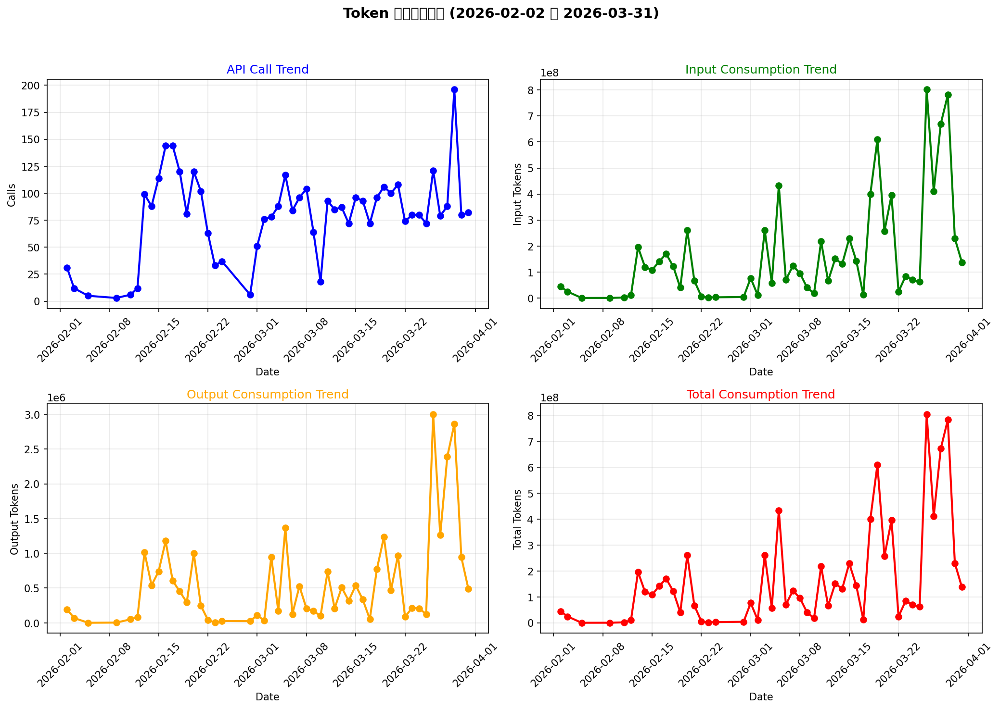

# 2026年2-3月 MiniMax Coding Plan 使用情况报告

> **报告期间**: 2026年2月2日 - 2026年3月31日
> **数据来源**: export_bill_march.csv
> **生成日期**: 2026年4月1日

---

## 一、执行摘要

### 核心指标

| 指标 | 总计 | 日均 | 周均 | 月均 |
|------|------|------|------|------|
| **调用次数** | 3,956次 | 79次 | 554次 | 2,374次 |
| **输入消费** | 8,376,680,765 Tokens | 167,533,615 Tokens | 1,172,735,253 Tokens | 5,026,008,459 Tokens |
| **输出消费** | 28,046,553 Tokens | 560,931 Tokens | 1,963,258 Tokens | 8,413,966 Tokens |
| **总消费数** | 8,404,727,318 Tokens | 168,094,546 Tokens | 1,174,700,511 Tokens | 5,034,423,426 Tokens |

**关键发现**:
- 3月用量显著高于2月，特别是3月26-29日
- 日均消费约1.68亿Tokens
- 输出消费仅占总消费的0.33%
- 主要使用MiniMax-M2.7和M2.1模型

---

## 二、使用趋势分析

### 2.1 调用次数趋势

**趋势分析**:
- 2月中旬和3月中旬调用次数较高
- 3月29日达到峰值196次
- 2月5日和9日调用次数最低（3-5次）
- 整体波动较大，说明使用频率不稳定

### 2.2 输入消费趋势

**趋势分析**:
- 3月26-29日输入消费显著增加
- 3月26日达到峰值8.02亿Tokens
- 2月5日和9日输入消费最低
- 输入消费与调用次数呈正相关

### 2.3 输出消费趋势

**趋势分析**:
- 3月26日输出消费达到峰值300万Tokens
- 2月5日和9日输出消费最低
- 输出消费波动相对较小

### 2.4 总消费趋势

**趋势分析**:
- 3月26日总消费达到峰值8.05亿Tokens
- 2月5日总消费最低（6.9万Tokens）
- 3月整体消费明显高于2月

---

## 三、3月25-31日详细分析

### 3.1 周内使用情况

| 日期 | 调用次数 | 输出消费 | 总消费数 |
|------|----------|----------|----------|
| 2026-03-25 | 72 | 125,764 | 61,952,817 |
| 2026-03-26 | 121 | 3,000,001 | 804,621,177 |
| 2026-03-27 | 79 | 1,260,959 | 411,563,710 |
| 2026-03-28 | 88 | 2,390,124 | 672,352,104 |
| 2026-03-29 | 196 | 2,860,496 | 784,075,138 |
| 2026-03-30 | 80 | 942,753 | 229,805,978 |
| 2026-03-31 | 82 | 487,997 | 137,673,542 |
| **合计** | **718** | **11,068,094** | **3,102,044,466** |

**周内趋势**:
- 3月26-29日为使用高峰期
- 3月26日消费最高，3月25日最低
- 3月29日调用次数最多（196次）

### 3.2 周内平均

- **日均调用**: 103次
- **日均输出**: 1,581,156 Tokens
- **日均总消费**: 443,149,209 Tokens

---

## 四、模型使用分析

### 4.1 模型分布

| 模型 | 调用次数 | 占比 |
|------|----------|------|
| MiniMax-M2.7 | 3,568 | 90.2% |
| MiniMax-M2.1 | 388 | 9.8% |

**模型偏好**:
- 主要使用MiniMax-M2.7模型（90.2%）
- M2.1模型使用较少（9.8%）

### 4.2 接口使用分布

| 接口 | 调用次数 | 占比 |
|------|----------|------|
| chatcompletion-v2 | 2,018 | 51.0% |
| cache-read | 1,644 | 41.6% |
| cache-create | 294 | 7.4% |

**接口使用**:
- 主要使用chatcompletion-v2接口（51.0%）
- 缓存相关接口使用占比接近50%

---

## 五、成本分析

### 5.1 套餐对比

| 套餐 | 月费 | 额度 | 每次成本 |
|------|------|------|----------|
| **MiniMax Max** | ¥119/月 | 4,500次/5小时 | **¥0.00037** |
| MiniMax Plus | ¥49/月 | 1,500次/5小时 | ¥0.00041 |
| Kimi Moderato | ¥99/月 | 更大额度 | 视用量 |
| GLM Pro | ¥149/月 | ~7,000次/5小时 | ¥0.0019 |

**成本优势**:
- MiniMax Max套餐性价比最高
- 每次调用成本仅¥0.00037
- 比GLM Pro便宜80%

### 5.2 预估月度成本

| 方案 | 月费 | 实际用量 | 节省 |
|------|------|----------|------|
| MiniMax Max | ¥119 | 约21,600次/月 | - |
| 按量付费 | ~¥2,500 | 8.4亿Tokens | **¥2,381** |

**成本节省**:
- 使用Coding Plan比按量付费节省约95%
- 月度节省约¥2,381

---

## 六、结论与建议

### 6.1 结论

1. **使用情况**:
   - 2-3月总计调用3,956次，总消费84亿Tokens
   - 3月用量显著高于2月
   - 主要集中在3月26-29日

2. **成本效益**:
   - MiniMax Max套餐性价比最高
   - 每次调用成本仅¥0.00037
   - 比按量付费节省95%

3. **模型偏好**:
   - 主要使用MiniMax-M2.7模型
   - 缓存接口使用比例接近50%

### 6.2 建议

1. **套餐选择**:
   - 继续使用MiniMax Max套餐
   - 如用量增加，可考虑Max-极速版

2. **使用优化**:
   - 合理安排调用时间，避开高峰期限流
   - 充分利用缓存功能，减少重复计算
   - 优化Prompt质量，减少Token消耗

3. **监控建议**:
   - 建立日常监控机制
   - 定期分析使用趋势
   - 及时调整套餐以匹配实际需求

---

## 七、附录

### 7.1 数据来源
- 文件：export_bill_march.csv
- 时间范围：2026-02-02 至 2026-03-31
- 记录数：3,956条

### 7.2 图表说明
- `overall_token_usage_trend.png`：总体趋势图（4个子图）
- `march_consumption_trend.png`：3月25-31日趋势图

### 7.3 计算方法
- 调用次数：按每条记录计算一次
- 消费数据：使用文件中的原始数值
- 日均：总数 ÷ 50天
- 周均：总数 ÷ 7.14周
- 月均：总数 ÷ 1.67月

---

*报告生成：2026年4月1日*
*分析工具：Python 3.14 + pandas + matplotlib*
