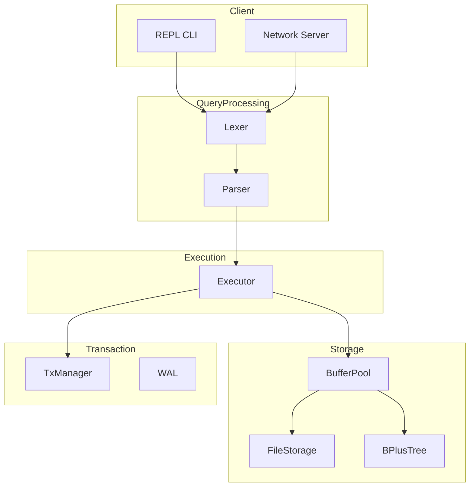

# SQLRustGo

<p align="center">
  
  
  
</p>

## 架构概览



## 项目简介

SQLRustGo 是一个用 Rust 从零实现的 SQL-92 子集兼容的关系型数据库系统。专为学习和研究数据库内核设计，同时具备生产级别的代码质量。

## 核心特性

| 特性 | 说明 |
|------|------|
| **SQL 支持** | SELECT, INSERT, UPDATE, DELETE, CREATE TABLE, DROP TABLE |
| **存储引擎** | Buffer Pool + FileStorage 持久化存储 |
| **索引结构** | B+ Tree 索引支持 |
| **事务机制** | Write-Ahead Log (WAL) 保障事务安全 |
| **网络协议** | MySQL 风格协议支持 TCP 连接 |
| **交互式 REPL** | 支持交互式 SQL 命令行 |

### 核心模块

| 模块 | 说明 |
|------|------|
| `lexer` | 词法分析，将 SQL 转换为 Token 流 |
| `parser` | 语法分析，将 Token 流转换为 AST |
| `executor` | 执行引擎，根据 AST 执行 SQL |
| `storage` | 存储层，包括 BufferPool、B+ Tree、FileStorage |
| `transaction` | 事务管理，WAL 和事务状态机 |
| `network` | 网络协议，MySQL 风格 TCP 协议 |
| `types` | 类型系统，SQL 数据类型定义 |

## 快速开始

### 环境要求

- Rust 1.75+ (推荐使用 [rustup](https://rustup.rs/) 安装)
- Cargo (随 Rust 一起安装)
- Git

### 安装

```bash
# 克隆项目
git clone https://github.com/yinglichina8848/sqlrustgo.git
cd sqlrustgo

# 构建项目
cargo build --release
```

### 运行

```bash
# 交互式 REPL 模式
cargo run

# 或使用编译后的二进制
./target/release/sqlrustgo
```

### 交互示例

```
╔════════════════════════════════════════════════╗
║       SQLRustGo v1.0.0                        ║
║  A Rust SQL-92 Database Implementation       ║
╚════════════════════════════════════════════════╝

Type 'exit' or 'quit' to exit.
Type '.help' for commands.

sqlrustgo> CREATE TABLE users (id INTEGER PRIMARY KEY, name TEXT, age INTEGER);
OK, 0 row(s) affected

sqlrustgo> INSERT INTO users (id, name, age) VALUES (1, 'Alice', 25);
OK, 1 row(s) affected

sqlrustgo> SELECT * FROM users;
1 row(s) in set
```

## SQL 支持

### 数据类型

| 类型 | 说明 | 示例 |
|------|------|------|
| INTEGER | 64位有符号整数 | `age INTEGER` |
| FLOAT | 64位浮点数 | `price FLOAT` |
| TEXT | 文本字符串 | `name TEXT` |
| BOOLEAN | 布尔值 | `active BOOLEAN` |
| BLOB | 二进制数据 | `data BLOB` |

### DDL 语句

```sql
-- 创建表
CREATE TABLE table_name (
    column_name column_type,
    ...
);

-- 删除表
DROP TABLE table_name;
```

### DML 语句

```sql
-- 插入数据
INSERT INTO table_name (columns) VALUES (values);

-- 查询数据
SELECT columns FROM table_name [WHERE condition];

-- 更新数据
UPDATE table_name SET column = value [WHERE condition];

-- 删除数据
DELETE FROM table_name [WHERE condition];
```

### WHERE 条件支持

```sql
-- 比较运算
WHERE age = 25
WHERE age > 18
WHERE name = 'Alice'

-- 逻辑运算
WHERE age > 18 AND age < 65
WHERE name = 'Alice' OR name = 'Bob'
```

### REPL 特殊命令

| 命令 | 说明 |
|------|------|
| `.help` | 显示帮助信息 |
| `.tables` | 列出所有表 |
| `.schema` | 显示数据库 schema |
| `.exit` | 退出程序 |

## 项目结构

```
sqlrustgo/
├── Cargo.toml              # 项目配置
├── README.md               # 项目说明
├── CHANGELOG.md            # 变更日志
├── LICENSE                 # MIT 许可证
├── docs/                   # 文档目录
│   ├── user/               # 用户文档
│   └── dev/                # 开发者文档
├── src/
│   ├── main.rs             # 入口文件 (REPL)
│   ├── lib.rs              # 库导出
│   ├── executor/           # SQL 执行引擎
│   ├── parser/             # SQL 解析器
│   ├── lexer/              # 词法分析器
│   ├── storage/            # 存储引擎
│   │   ├── buffer_pool.rs # 缓冲池
│   │   └── bplus_tree.rs  # B+ 树索引
│   ├── transaction/        # 事务管理
│   │   ├── wal.rs         # Write-Ahead Log
│   │   └── manager.rs     # 事务管理器
│   ├── network/           # 网络协议
│   └── types/             # 类型定义
└── tests/                 # 集成测试
```

## 测试

```bash
# 运行所有测试
cargo test

# 运行特定模块测试
cargo test --lib

# 运行集成测试
cargo test --test integration_test

# 生成覆盖率报告
cargo llvm-cov --all-features
```

## 性能基准

| 操作 | 预估性能 |
|------|----------|
| 简单 SELECT | ~10,000 ops/s |
| 简单 INSERT | ~8,000 ops/s |
| 索引查询 | ~50,000 ops/s |

> 注：实际性能取决于硬件和数据量

## 限制与已知问题

- **当前版本**: Alpha (功能测试阶段)
- 不支持 JOIN 操作
- 不支持子查询
- 不支持事务嵌套
- 不支持约束 (外键、唯一键等)
- 不支持索引自动选择

## 路线图

### v1.0.0 (规划中)

- [ ] 完整 SQL-92 支持
- [ ] 索引优化
- [ ] 查询优化器
- [ ] ACID 完整支持
- [ ] 性能优化

## 参与贡献

欢迎提交 Issue 和 Pull Request！

## 许可证

MIT License - see [LICENSE](LICENSE) file

## 联系方式

- GitHub: https://github.com/yinglichina8848/sqlrustgo
- Issues: https://github.com/yinglichina8848/sqlrustgo/issues
