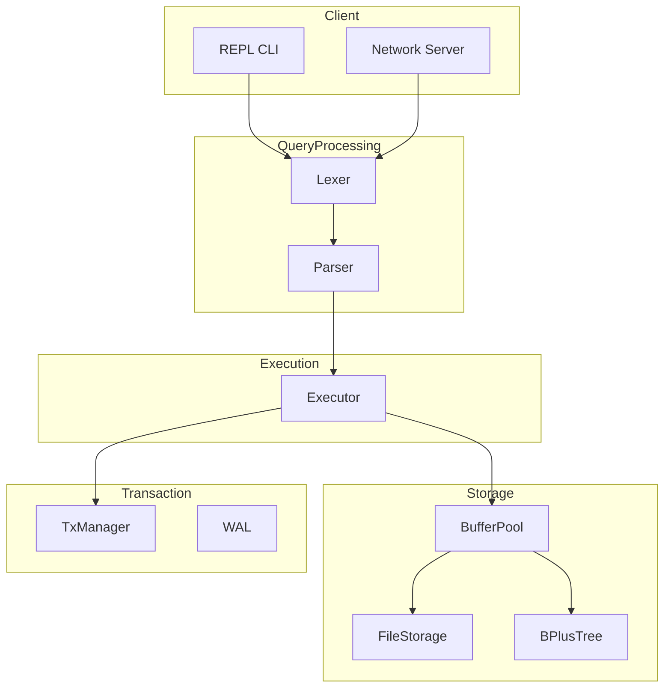

# SQLRustGo

背景有点长，这个项目的来龙去脉，大家当小说看吧，架空历史，我们从未来完全被AI控制的时代，穿越到2025/2026年，AI 的元年，见证万亿级参数大模型的诞生，AGI的早期形式：多 Agent 协作解决复杂问题的 AI 自动化机器人。

--
# sqlrustgo 项目诞生记

## 缘起：当 AI 遇见软件工程

我使用 AI 协作进行软件开发的想法，始于去年春节。

那时 DeepSeek 刚刚发布，字节跳动的编程工具 Trae 也刚上线国内版。因为正在给学生上人工智能课程，我就在想：能不能把 AI 和软件工程结合起来？
巧的是，手头正好有一台 HP Z6-G4 服务器，256GB 内存，但没有像样的显卡。只有一块很老的 Quadro M6000（24GB 显存），还是十年前做 CG 设计用的，当时要卖 4 万块，后来买服务器时老板 1000 块推荐给我的。24GB 显存跑不了大模型，我就用 Hugging Face 上极限量化的 DeepSeek 671B 全参数模型（1.58 比特量化，约 180GB），居然能跑起来！

去年寒假，我用最原始的方式开始了探索——在网页上问 DeepSeek 和 ChatGPT：“怎么编写某个软件？” 这大概是最早期的尝试了。当时测试大模型的方式很朴素：让它写一个“Flappy Bird”的 Python 游戏程序，看看逻辑是否正确。我就在大模型对话界面里化 30 秒输入一个问题，等它一秒 1-2 个 Token 的吐代码，等 1 小时，复制代码贴进 Python 文件运行，简直头皮发麻：见证一个存放了人类 3000 年以来的高质量文献内容训练出来的神器，就跑在面前嗡嗡响的机器上，几乎能回答你所有的问题。天，这简直是核战以后，人类文明毁灭，重新从石器时代攀登科技树的，人类文明之光啊！ 配个太阳能电板，一个锂电和逆变器，晒 3 天太阳，等 3 小时，回答一个问题，像不像古代的大祭司？恍惚之间，我有种盗梦空间的感觉：我们的地球，是不是毁灭过无数次了，不停地循环重启，文明从 0.1 级向上进化，发展不到 1.0 就核战重启了。

就这样，我开始了最早的 AI 辅助编程：让大模型写程序，然后粘贴出来——一开始是手工复制，后来学会了重定向到文件。那时还没用上 Cursor 或 Copilot，因为翻墙太麻烦，还没学会科学上网的方法。

## 探索：从作业辅助到教学实践

春节后到学期前半段，我都在做简单尝试：让学生用 AI 写算法作业、C++/Java 程序作业，用 AI 来生成或批改。说实话，这还谈不上真正的教学创新。

转折发生在2025 春季学期。软件工程导论课用的教材有些过时了：2021 年左右我开始用这本书时还在疫情期间，那时只求学生能照着书上的例子完整操作一遍：结构化分析设计、面向对象方法、UML 图，能走通流程就行，省的上课听讲感觉简单，啥都会，上手一做，什么 ER 图都画不对。但是，但是，但是啊，虽然清华大学出版社尹志宇老师主编的这本书案例很好（基于“高校图书信息系统”和“航空公司机票预定系统”项目案例讲软件工程方法），但技术栈还停留在很老的东西上，没有用 SpringBoot/MVC，也没工具支持，版本控制，测试自动化这些工具通通没有：2000 年软件公司用的，ClearCase，RationalRose 这些烂大街的东西都不讲。 

但去年这时候，我觉得这套东西跟不上了。于是下半学期开始，我尝试让学生用各种编程工具（Trae、Cursor、VS Code、IntelliJ/IDEA）里的 AI 插件（Extension）：通义灵码、Trae、Cline，Continue 等。用下来觉得 Cline 比较好用，Continue 因为只能给建议不能直接改代码，试过就放弃了。

去年五一之后，我开始用 AI 辅助编程工具 `aide` 做一个简单的 Java 项目。目的是让学生掌握软件工程里的设计模式（约 20 种），我做了个图形渲染系统的 Java 示例，发布到 GitHub 和 Gitee 上（学生访问 GitHub 不便）。那个项目做了完整的全流程：需求分析、总体设计、详细设计、实现、测试、文档，还录过一点视频。虽然很初级，但算是 AI 工具的演示项目。

## 尝试：第一次 AI 原生开发

2025 年暑假，国产 AI 工具大爆发——VS Code 开源后，国内厂商跟进，出了三四个工具。那时我开始用 Trae，在 Windows 下搭了 WSL + Ubuntu 环境，IDE 跑在 Windows，文件和编译在 Ubuntu 里。这是个很神奇的配置，坑也非常多。

最坑的是：当时 Trae 可以在同一目录下多实例并行，后来出了 Solo 模式可以开多任务——每个 Trae 就像一个团队，可以开好几个 IDE 实例，每个实例里又能开多任务。我心想：这不就可以搞全流程了吗？于是开了四五个“虚拟程序员”：一个做规划（Plan 模式）、一个做执行（Act 模式）、一个做测试、一个做并行功能开发，几个 AI 同时干活。但是，微软要死的 WSL 文件系统，烂透了，经常系统挂起，甚至自动重启，还找不到硬盘了，才发现微软竟然悄悄地把我的硬盘加密了，BitLock，密码还没有，这 TM 快赶上加密勒索，还是无法关闭，无法禁止的。WindowsUpdate 是我见过的，最不讲人权，最不安全的东西了。我干脆干掉一个分区，开始装 Ubuntu 双启动，平时完全到 Ubuntu，但是悲剧了：Trae 的 Linux 版，始终是 To be ... 只能用 Qoder + Cline了 开启了我一个学期的悲剧和弯路。

2026 年秋学期，大部分时间在用 Cline，其中的 groq-fast-api 的生成速度真快，快到没法看清，cline 写半小时，qwen3-coder 编译和修复错误，整整搞半天。

当时没意识到要用 Git 的 PR 流程做多分支审核，想到什么功能就加，写完单元测试就觉得 OK 了。当时为了测试各种 IDE（终于有了稳定的魔法，可以翻出去）Cursor、Trae、Gemini、GitHub Copilot 都试过。

从十一放假开始，因为讲《数据库原理与技术》，实在把我恶心到了，30 年没变的剩饭，干脆自己手搓一个RDBMS 吧(Coding 大模型和 AI IDE 都差不多够火候了)，搞出了一个项目叫 `SQLCC`——因为很多 Linux 环境下 C++ 程序后缀是 `.cc` 或 `.cxx`，所以想用这个名字手搓一个符合 SQL-92 的关系型数据库系统，我毕业那会，Oracle9 这样的东西要几万美金。

但很不幸：各种工具一起上，一句话开发一个功能（所谓的 vibe coding）这样的方式，看上去很美，就像有的人整容，局部看都不错，合起来总是别扭：局部上看每个模块的单元测试都过了，集成测试时却完全调不通。C/S 分离方式的 远程访问和执行从来没有成功过，因为没做接口分离，头文件里都是 class 直接声明，.h 文件随意 #include 引用，最后文件全耦合在一起，拆都拆不动。我还升级了构建系统，用 bazel，自己根本不熟悉的配置方式，AI 模型也乱整，这方面，国产的大模型不可信，总是在兜圈子，分析的问题都是错的。

十一一直到元旦，感觉自己就是在屎山里，修不完，根本搞不好，重构不出来，再重构，还是出不来，分层分块，还是不行，AI 缺乏基本的软件工程的背景和流程知识，像个文科生，背了一堆一堆的函数和类的代码，但是自己不懂，只能把自己记得的东西挨个写出来，用上去试试。甚至我用 ChatGPT 把问题理清楚了，Cline/TRAE 在执行的时候，又开倒车。

## 重生：当 Mac mini 遇上 Open Copilot

今年放寒假，新工具又出来了，或者说，我被逼的尝试生产力工具，而不是原来给学生玩的，教学示意的 Coding 工具：opencode，claude code，gemini，VSCode Copilot、Codex IDE 等。而且国内的大模型你追我赶的升级，跨过了 Sonnet3/4 的门槛。
老婆要在家里整个工作环境，大量的洋垃圾到货，我闲鱼上淘了一个最便宜的 Mac mini M4，16GB+256GB 最低配3030，有配了个 5K 显示器，3700，男人吗要对老婆好点，自己对付对付就算了，对老婆还是要舍得花钱。

放了寒假，本来是用笔记本工作的，但是笔记本屏幕，很感人啊，所以啊，你们懂的，5K 屏幕就接上 华为 MateBookX 了，男人吗，也要对自己好点，有东西不用是浪费啊，老婆全套的苹果，一体机，BookAir，iPad，手机，甚至 iPod，Kindle，Watch 都有。显示器放着，macmini 没人用，真浪费。最早 5K 显示器是笔记本的副屏。后来，后来不是龙虾来了吗。说的很邪乎，啥删光文件，格式化系统，我可不敢在 工作的笔记本上整，干脆就 mini 吧，结果一用，就停不下来喽。特么比 Windows，Ubuntu 好用太多了。这玩意是一帮子不差钱，最挑剔的艺术家搞出来系统。

以前从没用过 Mac，这次用了发现很惊艳——确实是生产力工具，效率比 Windows 高得多。Windows 上软件管理和信息共享很麻烦，有种早期计算机的感觉；苹果平台则非常顺畅，和手机、各种 App 都打通了，操作习惯也符合人性。我买了 5K 显示屏，加上双显示器，所有窗口平铺，效率很高。
这次我体会到：不能省钱。以前是“穷玩派”，能省就省——Windows 收费就用 Linux，商业版付费就用免费社区版。钱省了，但时间都花在装软件、修 Bug 上。苹果把这些都做好了，开箱即用。
用过了 MacOS，再看 Ubuntu，就觉得不能忍受了，Ubuntu 有的，Mac 全有，Mac 有的，Ubuntu 呵呵呵呵，用过的都知道。除了服务器啊，我始终认为 Linux 做服务器，绝对一流。桌面嘛，当然是大苹果，大苹果，大苹果！下个学期，我要给学生安利：有钱就苹果吧，充 coding plan，少年，把喝奶茶，啃鸡腿的钱省下来，花在刀刃上...

## 重构：从 SQLCC 到 SQLRustGo

因为搞开发的，拿到 Mac mini 就想让它 24 小时干活。对我来说最有用的还是上课和改作业，因为所以想把 `SQLCC` 这个项目重构好、修好 Bug，也算是完成自己吹的牛：现在 AI 时代了，完全可以 EveryThing 手搓， Do It Yourself. 

但神奇的是：给龙虾配 API_KEY 实在是搞烦了，一时冲动，充了一个 Minimax 的 Coding Plan 的顶配（当时只有普通班， 高速版过年才出来）。给 Claude Code 配上 Minimax M2.5, 让我这这个穷人也体验一下富豪的享受。因为小龙虾火爆，小红书里跟踪了很多 AI Coding 的大神，学了一个 SuperPowers 的东东，在 Cursor 里装上，让它 brainstorm 分析 `SQLCC` 项目，本来想渐进重构，或者用 C++ 干脆充和兴开始重建各个组件，我也意识到，应该用标准的 Git PR 控制。最好用 SDD-TDD 驱动工作流程。但是，Claude 给我一个大胆的建议 **干脆用 Rust 和 Go 重写，不要在 C++ 上雕花了。**

这就是 `SQLRustGo` 的诞生根源。

最早的 1.0 版设计文档已经传到项目里了（`1.0.0-alpha` 分支），里面有大量文本格式的文档、设计文档、跟 AI 的对话记录。现在是 alpha 阶段，我尽量把东西收集齐放进去，还没完全整理。因为工具太多，目录也乱，AI 工具都不支持聊天记录直接导出，只能手工整理。飞书上的记录可以通过 API 导出来，小龙虾工作目录里每次对话也有 Markdown 格式的记录，回头慢慢整理放上去。

做这个项目，我也是边摸索边推进，我也不是大神，只是一个还没完全磨灭好奇心的老少年，偶尔不计功利地发个疯什么的。

去年的 DeepSeek，今年的 OpenClaw，包括令我眼前一亮的 Minimax，都不是为了赚钱搞出来的东西，反而是不想赚钱的，赚到了大钱，Anthropic 更是代表。

大家不要期望太高，可以看到，SQLRustGo 是个刚刚 5 天的项目：情人节前 1 天开始计划，3 天完成了草稿，今天已经进入 Alpha， 马上到 Beta（最多明天），速度已经超乎我的想象，核心代码 5000 行，测试覆盖率 75% 行级，Beta 版会做性能测试。我刚进软件公司的时候，这差不多是一个开发小组 3-5 人，一个月的工作量。

我不准备全速推进这个项目，目前的状态，是预计在 3 月 1 日前完成就可以，有个可以给学生学习，上课可以讲的东西。1.0.0 的完整版本，是准备在 5 月 1 日前完成，然后是性能优化，结果 claude + opencode + codex  Rust 写的飞快，感觉一下就出来了，真是离了大谱啊，这样还玩啥 C++ 啊，错排不完，内存崩溃，噩梦啊，我多少次做梦就是要解决服务器崩溃问题。

本来是教学型的项目，给学生展示 AI-CLI，工作流，SDD-TDD 的，现在加上 OpenClaw 的通用 Agent，范围就可以扩大到工程学的本质：各种资源约束情况下的，多目标最优规划。时间，功能，成本的铁三角，是不是能被 AI 协作突破？我们拭目以待吧！

新的浪潮面前，我们都是新手。

## 未来：做一套完整的 AI 协同开发教程

有个好消息：学校有个“AI 赋能教学”的比赛，要求老师准备 30 分钟以内的视频去申请评奖。正好可以用上。

我准备等流程再稳定一些后，从头开始录一个完整的教程：怎么从工具准备开始，到配置、怎么控制 AI、怎么设定开发规范（如 TDD 测试驱动开发的智能方式），做一个完整的演示。

这是作为软件工程课程的目标——让学生看到，在 AI 时代，软件工程可以这样搞。

我不知道这种方式会不会过时，但这已经是我目前觉得最好的方式了，否则我只能讲讲软件工程的历史，也许软件工程会被并入普通的工程学，甚至是数学、乃至哲学。

---

**项目地址：**[https://github.com/minzuuniversity/sqlrustgo/](https://github.com/minzuuniversity/sqlrustgo/)

*如果你对这个项目感兴趣，欢迎 star、fork、pr。让我们一起探索 AI 时代软件工程的新可能。*


---
最初的目标规划：用于教学演示的，Rust+Go 实现的关系型数据库系统，支持 SQL-92 子集。

## 核心特性

- **SQL-92 支持**: 支持 SELECT, INSERT, UPDATE, DELETE, CREATE TABLE, DROP TABLE 等常用语句
- **事务支持**: ACID 事务，通过 Write-Ahead Log (WAL) 实现
- **存储引擎**: Page 管理 + BufferPool 缓存 + B+ Tree 索引
- **网络支持**: TCP 服务器，支持多客户端连接
- **REPL 交互**: 交互式命令行界面

## 快速开始

```bash
# 构建
cargo build --all-features

# 运行测试
cargo test --all-features

# 启动 REPL
cargo run --bin sqlrustgo

# Lint 检查
cargo clippy --all-features -- -D warnings
```

## 架构概览

```
┌─────────────────────────────────────┐
│           main.rs (REPL)             │
├─────────────────────────────────────┤
│           executor/                 │  ← 查询执行
├─────────────────────────────────────┤
│           parser/                    │  ← SQL → AST
│           lexer/                    │  ← SQL → Tokens
├─────────────────────────────────────┤
│           storage/                   │  ← Page, BufferPool, B+ Tree
├─────────────────────────────────────┤
│         transaction/                 │  ← WAL, TxManager
├─────────────────────────────────────┤
│           network/                   │  ← TCP Server/Client
├─────────────────────────────────────┤
│           types/                     │  ← Value, SqlError
└─────────────────────────────────────┘
```

## 项目结构

```
sqlrustgo/
├── Cargo.toml
├── README.md
├── .github/workflows/
├── docs/
│   └── architecture.md       ← 架构设计文档
├── src/
│   ├── main.rs              ← REPL 入口
│   ├── lib.rs               ← 库入口
│   ├── lexer/               ← 词法分析
│   ├── parser/              ← 语法分析
│   ├── executor/            ← 查询执行
│   ├── storage/             ← 存储层
│   ├── transaction/         ← 事务管理
│   ├── network/             ← 网络通信
│   └── types/               ← 类型系统
└── tests/                   ← 集成测试
```

## 功能特性

- ✅ SQL-92 子集支持 (SELECT, INSERT, UPDATE, DELETE)
- ✅ 存储引擎 (Buffer Pool, FileStorage)
- ✅ B+ Tree 索引
- ✅ 事务支持 (WAL)
- ✅ 网络协议支持

## 文档

- [架构设计](docs/architecture.md)
- [设计文档](docs/2026-02-13-sqlcc-rust-redesign-design.md)
- [实施计划](docs/2026-02-13-sqlcc-rust-impl-plan.md)

## 测试覆盖

- 测试数量: 118+ 个
- 行覆盖率: 82.24%
- 函数覆盖率: 84.73%

## 技术栈

- Rust Edition 2024
- Tokio 异步运行时
- thiserror 错误处理
- serde 序列化

## 参与贡献

欢迎提交 PR！请参考 GitHub 上的 Issue 和 PR 列表。

---

# SQLRustGo

<p align="center">
  
  
  
</p>

## 架构概览



## 项目简介

SQLRustGo 是一个用 Rust 从零实现的 SQL-92 子集兼容的关系型数据库系统。专为学习和研究数据库内核设计，同时具备生产级别的代码质量。

## 核心特性

| 特性 | 说明 |
|------|------|
| **SQL 支持** | SELECT, INSERT, UPDATE, DELETE, CREATE TABLE, DROP TABLE |
| **存储引擎** | Buffer Pool + FileStorage 持久化存储 |
| **索引结构** | B+ Tree 索引支持 |
| **事务机制** | Write-Ahead Log (WAL) 保障事务安全 |
| **网络协议** | MySQL 风格协议支持 TCP 连接 |
| **交互式 REPL** | 支持交互式 SQL 命令行 |

### 核心模块

| 模块 | 说明 |
|------|------|
| `lexer` | 词法分析，将 SQL 转换为 Token 流 |
| `parser` | 语法分析，将 Token 流转换为 AST |
| `executor` | 执行引擎，根据 AST 执行 SQL |
| `storage` | 存储层，包括 BufferPool、B+ Tree、FileStorage |
| `transaction` | 事务管理，WAL 和事务状态机 |
| `network` | 网络协议，MySQL 风格 TCP 协议 |
| `types` | 类型系统，SQL 数据类型定义 |

## 快速开始

### 环境要求

- Rust 1.75+ (推荐使用 [rustup](https://rustup.rs/) 安装)
- Cargo (随 Rust 一起安装)
- Git

### 安装

```bash
# 克隆项目
git clone https://github.com/yinglichina8848/sqlrustgo.git
cd sqlrustgo

# 构建项目
cargo build --release
```

### 运行

```bash
# 交互式 REPL 模式
cargo run

# 或使用编译后的二进制
./target/release/sqlrustgo
```

### 交互示例

```
╔════════════════════════════════════════════════╗
║       SQLRustGo v1.0.0                        ║
║  A Rust SQL-92 Database Implementation       ║
╚════════════════════════════════════════════════╝

Type 'exit' or 'quit' to exit.
Type '.help' for commands.

sqlrustgo> CREATE TABLE users (id INTEGER PRIMARY KEY, name TEXT, age INTEGER);
OK, 0 row(s) affected

sqlrustgo> INSERT INTO users (id, name, age) VALUES (1, 'Alice', 25);
OK, 1 row(s) affected

sqlrustgo> SELECT * FROM users;
1 row(s) in set
```

## SQL 支持

### 数据类型

| 类型 | 说明 | 示例 |
|------|------|------|
| INTEGER | 64位有符号整数 | `age INTEGER` |
| FLOAT | 64位浮点数 | `price FLOAT` |
| TEXT | 文本字符串 | `name TEXT` |
| BOOLEAN | 布尔值 | `active BOOLEAN` |
| BLOB | 二进制数据 | `data BLOB` |

### DDL 语句

```sql
-- 创建表
CREATE TABLE table_name (
    column_name column_type,
    ...
);

-- 删除表
DROP TABLE table_name;
```

### DML 语句

```sql
-- 插入数据
INSERT INTO table_name (columns) VALUES (values);

-- 查询数据
SELECT columns FROM table_name [WHERE condition];

-- 更新数据
UPDATE table_name SET column = value [WHERE condition];

-- 删除数据
DELETE FROM table_name [WHERE condition];
```

### WHERE 条件支持

```sql
-- 比较运算
WHERE age = 25
WHERE age > 18
WHERE name = 'Alice'

-- 逻辑运算
WHERE age > 18 AND age < 65
WHERE name = 'Alice' OR name = 'Bob'
```

### REPL 特殊命令

| 命令 | 说明 |
|------|------|
| `.help` | 显示帮助信息 |
| `.tables` | 列出所有表 |
| `.schema` | 显示数据库 schema |
| `.exit` | 退出程序 |

## 项目结构

```
sqlrustgo/
├── Cargo.toml              # 项目配置
├── README.md               # 项目说明
├── CHANGELOG.md            # 变更日志
├── LICENSE                 # MIT 许可证
├── docs/                   # 文档目录
│   ├── user/               # 用户文档
│   └── dev/                # 开发者文档
├── src/
│   ├── main.rs             # 入口文件 (REPL)
│   ├── lib.rs              # 库导出
│   ├── executor/           # SQL 执行引擎
│   ├── parser/             # SQL 解析器
│   ├── lexer/              # 词法分析器
│   ├── storage/            # 存储引擎
│   │   ├── buffer_pool.rs # 缓冲池
│   │   └── bplus_tree.rs  # B+ 树索引
│   ├── transaction/        # 事务管理
│   │   ├── wal.rs         # Write-Ahead Log
│   │   └── manager.rs     # 事务管理器
│   ├── network/           # 网络协议
│   └── types/             # 类型定义
└── tests/                 # 集成测试
```

## 测试

```bash
# 运行所有测试
cargo test

# 运行特定模块测试
cargo test --lib

# 运行集成测试
cargo test --test integration_test

# 生成覆盖率报告
cargo llvm-cov --all-features
```

## 性能基准

| 操作 | 预估性能 |
|------|----------|
| 简单 SELECT | ~10,000 ops/s |
| 简单 INSERT | ~8,000 ops/s |
| 索引查询 | ~50,000 ops/s |

> 注：实际性能取决于硬件和数据量

## 限制与已知问题

- **当前版本**: Alpha (功能测试阶段)
- 不支持 JOIN 操作
- 不支持子查询
- 不支持事务嵌套
- 不支持约束 (外键、唯一键等)
- 不支持索引自动选择

## 路线图

### v1.0.0 (规划中)

- [ ] 完整 SQL-92 支持
- [ ] 索引优化
- [ ] 查询优化器
- [ ] ACID 完整支持
- [ ] 性能优化

## 参与贡献

欢迎提交 Issue 和 Pull Request！

## 许可证

MIT License - see [LICENSE](LICENSE) file

## 联系方式

- GitHub: https://github.com/yinglichina8848/sqlrustgo
- Issues: https://github.com/yinglichina8848/sqlrustgo/issues
