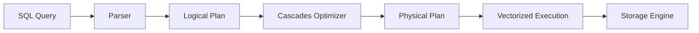
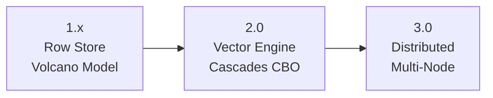

# SQLRustGo

<p align="center">
  
  
  
  
</p>

SQLRustGo 是一个使用 Rust 实现的关系型数据库教学与工程化项目，支持 SQL-92 子集，包含解析、规划、执行、存储、事务与网络模块。

## 当前状态

| 项目 | 当前值 |
|------|--------|
| 当前版本状态 | **alpha/v1.2.0** |
| 当前开发分支 | **develop-v1.2.0** |
| 当前阶段 | Alpha (内测) |
| 上一稳定版本 | v1.1.0 |

- 版本文件: [VERSION](VERSION)
- 当前版本说明: [CURRENT_VERSION.md](CURRENT_VERSION.md)
- v1.2.0 文档入口: [docs/releases/v1.2.0/README.md](docs/releases/v1.2.0/README.md)

## 核心能力

- SQL: `SELECT` `INSERT` `UPDATE` `DELETE` `CREATE TABLE` `DROP TABLE`
- 存储: Buffer Pool + FileStorage
- 索引: B+ Tree
- 事务: WAL
- 网络: TCP / MySQL 风格协议
- 交互: REPL

## 系统架构


```mermaid
flowchart LR

    SQL[SQL Query]
    Parser[Parser]
    LogicalPlan[Logical Plan]
    Optimizer[Cascades Optimizer]
    PhysicalPlan[Physical Plan]
    Executor[Vectorized Execution]
    Storage[Storage Engine]

    SQL --> Parser
    Parser --> LogicalPlan
    LogicalPlan --> Optimizer
    Optimizer --> PhysicalPlan
    PhysicalPlan --> Executor
    Executor --> Storage
```

### 版本演进


```mermaid
flowchart LR

    V1[1.x<br/>Row Store<br/>Volcano Model]
    V2[2.0<br/>Vector Engine<br/>Cascades CBO]
    V3[3.0<br/>Distributed<br/>Multi-Node]

    V1 --> V2 --> V3
```

- 详细架构: [docs/architecture.md](docs/architecture.md)
- 技术路线图: [docs/v2.0/TECH_ROADMAP.md](docs/v2.0/TECH_ROADMAP.md)

## 快速开始

```bash
# 构建
cargo build --all-features

# 运行测试
cargo test --all-features

# 启动 REPL
cargo run --bin sqlrustgo

# 代码检查
cargo clippy --all-targets -- -D warnings
```

## 文档导航

- 当前版本 (alpha/v1.2.0)
  - [版本计划](docs/releases/v1.2.0/VERSION_PLAN.md)
  - [发布门禁](docs/releases/v1.2.0/RELEASE_GATE_CHECKLIST.md)
  - [分支阶段治理](docs/releases/v1.2.0/BRANCH_STAGE_GOVERNANCE.md)
  - [测试计划](docs/releases/v1.2.0/TEST_PLAN.md)
- 已发布版本
- [v1.1.0 文档](docs/releases/v1.1.0/)
- [v1.0.0 文档](docs/releases/v1.0.0/)
- 中长期规划
  - [长期路线图](docs/releases/LONG_TERM_ROADMAP.md)
  - [2.0 路线图](docs/v2.0/SQLRUSTGO_2_0_ROADMAP.md)

## 分支与提交流程

当前主开发分支是 `develop-v1.2.0`。

推荐流程：

1. 从 `develop-v1.2.0` 拉出功能/修复分支
2. 提交 PR 到 `develop-v1.2.0`
3. CI 通过后合并

## 历史信息保留

- 历史阶段口径 `v1.2.0-draft` 保留在版本文档历史记录中，用于追溯 Draft 阶段治理与门禁演进。
- v1.2.0 已完成目录重构（`src/` 到 `crates/` workspace）并进入 Alpha 阶段持续开发。
- 分支治理已统一到 `develop-v1.2.0` 主开发分支，旧命名（如 `develop/v1.2.0`、`develop-1.2.0`）保留为历史兼容信息。
