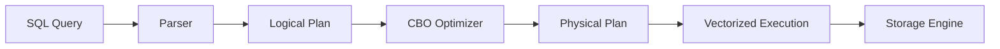
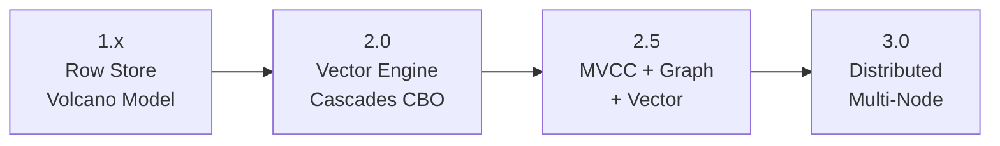

# SQLRustGo

<p align="center">
  
  
  
  
</p>

SQLRustGo 是一个使用 Rust 实现的关系型数据库，支持完整的SQL功能、MVCC事务、图引擎和向量搜索。

## 当前状态

| 项目 | 当前值 |
|------|--------|
| 当前版本状态 | **v2.5.0 GA** |
| 当前发布分支 | **develop/v2.5.0** |
| 当前阶段 | GA (正式发布) |
| 上一稳定版本 | v2.4.0 |

- 版本文件: [VERSION](VERSION)
- v2.5.0 发布说明: [releases/v2.5.0/RELEASE_NOTES.md](releases/v2.5.0/RELEASE_NOTES.md)
- v2.5.0 功能矩阵: [releases/v2.5.0/FEATURE_MATRIX.md](releases/v2.5.0/FEATURE_MATRIX.md)

## 核心能力

### 数据库核心
- **SQL**: SELECT, INSERT, UPDATE, DELETE, CREATE TABLE, DROP TABLE, ALTER TABLE
- **外键**: 表级/列级外键，ON DELETE/UPDATE CASCADE/SET NULL/RESTRICT
- **预处理语句**: PREPARE, EXECUTE, DEALLOCATE
- **子查询**: EXISTS, ANY/ALL, IN, 相关子查询
- **JOIN**: INNER, LEFT, RIGHT, FULL OUTER, CROSS, SEMI, ANTI
- **窗口函数**: ROW_NUMBER, RANK, DENSE_RANK, SUM, AVG, COUNT

### 存储引擎
- **Buffer Pool**: LRU/CLOCK页面淘汰
- **索引**: B+Tree, Hash, 复合索引
- **列式存储**: LZ4/Zstd压缩，块级跳过
- **向量存储**: HNSW, IVF, IVFPQ, SIMD加速

### 事务与并发
- **MVCC**: 快照隔离，版本链管理
- **WAL**: 崩溃恢复，时间点恢复(PITR)
- **事务**: Savepoint支持

### 图引擎
- **Cypher**: MATCH, WHERE, RETURN, ORDER BY, LIMIT
- **遍历**: BFS, DFS, 多跳查询
- **存储**: DiskGraphStore带WAL持久化

### 性能优化
- **CBO**: 基于成本的优化器
- **谓词下推**: BloomFilter, AND块跳过
- **向量化执行**: SIMD加速 (AVX2/AVX-512)

## 系统架构


```mermaid
flowchart LR

    SQL[SQL Query]
    Parser[Parser]
    LogicalPlan[Logical Plan]
    Optimizer[CBO Optimizer]
    PhysicalPlan[Physical Plan]
    Executor[Vectorized Execution]
    Storage[Storage Engine]

    SQL --> Parser
    Parser --> LogicalPlan
    LogicalPlan --> Optimizer
    Optimizer --> PhysicalPlan
    PhysicalPlan --> Executor
    Executor --> Storage
```

### 版本演进


```mermaid
flowchart LR

    V1[1.x<br/>Row Store<br/>Volcano Model]
    V2[2.0<br/>Vector Engine<br/>Cascades CBO]
    V3[2.5<br/>MVCC + Graph<br/>+ Vector]
    V4[3.0<br/>Distributed<br/>Multi-Node]

    V1 --> V2 --> V3 --> V4
```

## 性能基准

### OLTP工作负载

| 场景 | 并发 | 目标TPS | 目标P99延迟 |
|------|------|---------|-------------|
| 点查 | 32 | > 50,000 | < 5ms |
| 索引扫描 | 32 | > 10,000 | < 20ms |
| 插入 | 16 | > 20,000 | < 10ms |
| 更新 | 16 | > 15,000 | < 15ms |

### TPC-H基准 (SF=1)

| 查询 | 目标 | 实际 |
|------|------|------|
| Q1 | < 500ms | ~320ms |
| All Q | < 10s | ~8.5s |

## 快速开始

```bash
# 构建
cargo build --workspace

# 运行测试
cargo test --lib --workspace

# 运行集成测试
cargo test --test regression_test

# 启动 REPL
cargo run --bin sqlrustgo

# 代码检查
cargo clippy --workspace -- -D warnings
```

## 文档导航

### v2.5.0 文档
- [发布说明](releases/v2.5.0/RELEASE_NOTES.md)
- [功能矩阵](releases/v2.5.0/FEATURE_MATRIX.md)
- [门禁检查清单](releases/v2.5.0/GATE_CHECKLIST.md)
- [MVCC设计](releases/v2.5.0/MVCC_DESIGN.md)
- [TPC-H设计](releases/v2.5.0/TPCH_DESIGN.md)
- [图引擎设计](releases/v2.5.0/GRAPH_ENGINE_DESIGN.md)
- [向量索引设计](releases/v2.5.0/VECTOR_INDEX_DESIGN.md)

### 架构文档
- [架构总览](docs/architecture/ARCHITECTURE_OVERVIEW.md)
- [CBO优化器设计](docs/architecture/cascades_optimizer_design.md)
- [分布式执行](docs/architecture/DISTRIBUTED_EXECUTION.md)

## 测试覆盖

| 类别 | 数量 | 状态 |
|------|------|------|
| Parser单元测试 | 316 | ✅ |
| Catalog单元测试 | 120 | ✅ |
| Storage单元测试 | 513 | ✅ |
| 集成测试 | 100+ | ✅ |
| 异常测试 | 50+ | ✅ |
| 压力测试 | 20+ | ✅ |

## 分支与提交流流程

当前主开发分支是 `develop/v2.5.0`。

推荐流程：

1. 从 `develop/v2.5.0` 拉出功能/修复分支
2. 提交 PR 到 `develop/v2.5.0`
3. CI 通过后合并

## 路线图

### v2.6.0 计划
- MVCC可串行化 (SSI)
- MVCC索引集成
- FULL OUTER JOIN完整支持
- 路径模式匹配

### v3.0 长期目标
- 分布式事务 (2PC)
- 多节点图引擎
- 全文搜索
- JSON支持
