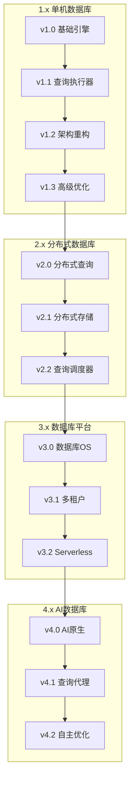

# SQLRustGo 企业级版本治理模型

> **版本**: 1.0
> **制定日期**: 2026-03-06
> **制定人**: yinglichina8848
> **适用范围**: 所有版本开发与发布

---

## 一、版本阶段模型

### 1.1 版本生命周期

每个版本统一遵循 5 个阶段：

```
develop-x.y
    │
    ├── Draft (草稿)      → 架构设计、目录调整
    ├── Alpha (内测)      → 功能开发
    ├── Beta (公测)       → Bug 修复、性能优化
    ├── RC (发布候选)     → 关键 Bug 修复
    │
    └── GA (正式发布)
        ├── tag vX.Y.0
        └── merge → main
```

### 1.2 阶段门禁规则

| 阶段 | 允许内容 | 禁止内容 | 目的 | 门禁要求 |
|------|----------|----------|------|----------|
| **Draft** | 架构设计、目录调整、模块拆分 | 稳定性承诺 | 完成架构 | 编译通过 |
| **Alpha** | 新功能开发 | 大规模架构重构 | 功能成型 | 测试 ≥ 80% |
| **Beta** | Bug 修复、性能优化 | 新模块、新接口 | 功能冻结 | 测试 ≥ 95%、Clippy 零警告 |
| **RC** | 关键 Bug 修复 | 功能变化 | 稳定验证 | 测试 100%、CI 全绿 |
| **GA** | 发布 | 任何代码修改 | 正式版本 | 所有问题关闭 |

---

## 二、冻结策略

### 2.1 Architecture Freeze (架构冻结)

**发生时机**: Draft → Alpha

```
Draft
   │
   │ Architecture Freeze
   ↓
Alpha
```

**冻结内容**:
- Crate 结构
- 模块目录
- 核心 API
- 执行器接口
- 优化器接口

**示例**:
```
crates/
 ├── parser      # Alpha 后禁止移动
 ├── planner     # Alpha 后禁止移动
 ├── optimizer   # Alpha 后禁止移动
 ├── executor    # Alpha 后禁止移动
 ├── storage     # Alpha 后禁止移动
 └── distributed # Alpha 后禁止移动
```

**Alpha 之后禁止**:
- ❌ Crate 移动
- ❌ 目录重构
- ❌ 接口签名变化

### 2.2 Feature Freeze (功能冻结)

**发生时机**: Alpha → Beta

**冻结内容**:
- 新功能
- 新模块
- SQL 语法扩展

**Beta 阶段只允许**:
- ✅ Bug 修复
- ✅ 性能优化
- ✅ 测试补充

### 2.3 Code Freeze (代码冻结)

**发生时机**: Beta → RC

**RC 阶段只允许**:
- ✅ Critical Bug 修复

**RC 阶段禁止**:
- ❌ Refactor (重构)
- ❌ Feature (新功能)
- ❌ Dependency upgrade (依赖升级)

---

## 三、分支模型

### 3.1 Git 分支结构

```
main
 │
 ├── develop              # 下一版本开发
 │
 ├── develop-1.2.0        # 当前版本开发
 │
 ├── release-1.2          # 维护版本
 │
 └── feature/*            # 功能分支
```

### 3.2 分支用途

| 分支 | 用途 | 保护级别 | 生命周期 |
|------|------|----------|----------|
| `main` | 稳定版本 | 🔴 最高 | 永久 |
| `develop` | 下一版本开发 | 🟡 中等 | 永久 |
| `develop-x.y.z` | 当前版本开发 | 🟡 中等 | 版本发布后转 release |
| `release-x.y` | 维护版本 | 🔴 高 | 长期 |
| `feature/*` | 功能分支 | 🟢 低 | 合并后删除 |
| `bugfix/*` | 修复分支 | 🟢 低 | 合并后删除 |

### 3.3 版本发布流程

```
develop-1.2.0
    │
    ├── Draft
    ├── Alpha
    ├── Beta
    ├── RC
    │
    └── GA
        ├── tag v1.2.0
        ├── merge → main
        └── rename → release-1.2
            │
            ├── v1.2.1 (patch)
            ├── v1.2.2 (patch)
            └── ...
```

---

## 四、AI 不可绕过的 Release Gate

### 4.1 强制流程

```
PR
 ↓
CI (必须通过)
 ↓
Review (至少 1 人)
 ↓
Release Gate Workflow
 ↓
Merge
```

### 4.2 Release Gate 检查项

| 检查项 | 要求 | 强制 |
|--------|------|------|
| CI Build | 通过 | ✅ |
| CI Test | 通过 | ✅ |
| CI Lint | 通过 | ✅ |
| Security Scan | 无高危漏洞 | ✅ |
| Code Review | ≥ 1 人批准 | ✅ |
| Release Gate Workflow | 通过 | ✅ |

### 4.3 AI 协作限制

| 操作 | AI 权限 | 说明 |
|------|---------|------|
| 直接 Push | ❌ 禁止 | 必须通过 PR |
| Force Push | ❌ 禁止 | 永久禁止 |
| 合并 PR | ⚠️ 限制 | 需要人工确认 |
| 创建 Tag | ❌ 禁止 | 需要人工操作 |
| 修改保护规则 | ❌ 禁止 | 仅管理员 |

---

## 五、GitHub Branch Protection 配置

### 5.1 main 分支 (最高保护)

```yaml
# .github/branch-protection/main.yml
protection_rules:
  required_pull_request_reviews:
    dismiss_stale_reviews: true
    require_code_owner_reviews: true
    required_approving_review_count: 2
  
  required_status_checks:
    strict: true
    contexts:
      - build
      - test
      - lint
      - security-scan
  
  enforce_admins: true
  required_linear_history: true
  allow_force_pushes: false
  allow_deletions: false
  required_signatures: true
```

### 5.2 develop-x.y 分支 (中等保护)

```yaml
# .github/branch-protection/develop.yml
protection_rules:
  required_pull_request_reviews:
    required_approving_review_count: 1
  
  required_status_checks:
    contexts:
      - build
      - test
  
  allow_force_pushes: false
  allow_deletions: false
```

### 5.3 release 分支 (高保护)

```yaml
# .github/branch-protection/release.yml
protection_rules:
  required_pull_request_reviews:
    required_approving_review_count: 2
  
  required_status_checks:
    strict: true
    contexts:
      - build
      - test
      - lint
      - security-scan
  
  required_signatures: true
  allow_force_pushes: false
  allow_deletions: false
```

---

## 六、Release Workflow (自动化发布)

### 6.1 发布流程

```
tag push
    │
    ├── build (编译)
    ├── test (测试)
    ├── generate changelog (生成变更日志)
    ├── build binaries (构建二进制)
    └── publish release (发布)
```

### 6.2 GitHub Actions 配置

```yaml
# .github/workflows/release.yml
name: Release

on:
  push:
    tags:
      - 'v*'

jobs:
  release:
    runs-on: ubuntu-latest
    steps:
      - name: Checkout
        uses: actions/checkout@v4
      
      - name: Build
        run: cargo build --release
      
      - name: Test
        run: cargo test --release
      
      - name: Generate Changelog
        run: |
          # Generate changelog from commits
          
      - name: Build Binaries
        run: |
          # Build for multiple platforms
          
      - name: Publish Release
        uses: softprops/action-gh-release@v1
        with:
          files: target/release/*
```

---

## 七、阶段转换检查清单

### 7.1 Draft → Alpha

```
├── ✅ 架构设计完成
├── ✅ 接口定义完整
├── ✅ 编译通过
├── ✅ 目录结构确定
└── ✅ 架构评审通过
```

### 7.2 Alpha → Beta

```
├── ✅ 所有功能开发完成
├── ✅ 测试通过率 ≥ 80%
├── ✅ 无 P0 Bug
├── ✅ 功能冻结确认
└── ✅ 功能评审通过
```

### 7.3 Beta → RC

```
├── ✅ 测试通过率 ≥ 95%
├── ✅ Clippy 零警告
├── ✅ 无 P0/P1 Bug
├── ✅ 性能达标
├── ✅ 代码冻结确认
└── ✅ 质量评审通过
```

### 7.4 RC → GA

```
├── ✅ 测试 100% 通过
├── ✅ CI 全绿
├── ✅ 无开放 Bug
├── ✅ 文档完整
├── ✅ 安全审计通过
└── ✅ 发布审批通过
```

---

## 八、版本路线图 (1.0 → 4.0)

### 8.1 1.x 系列 (单机数据库)

```
v1.0 ─── 基础 SQL Engine
   │
   ├── Lexer/Parser
   ├── Basic Executor
   └── Memory Storage

v1.1 ─── 查询执行器
   │
   ├── Query Planner
   ├── Basic Optimizer
   └── File Storage

v1.2 ─── 架构重构
   │
   ├── Crate 模块化
   ├── Storage Trait
   └── 向量化执行基础

v1.3 ─── 高级优化
   │
   ├── Cascades Optimizer
   ├── Vector Execution
   └── 统计信息收集
```

### 8.2 2.x 系列 (分布式数据库)

```
v2.0 ─── 分布式查询引擎
   │
   ├── Distributed Query
   ├── Query Router
   └── 分布式优化器

v2.1 ─── 分布式存储
   │
   ├── Sharding
   ├── Replication
   └── 分布式事务

v2.2 ─── 查询调度器
   │
   ├── Query Scheduler
   ├── 资源管理
   └── 负载均衡
```

### 8.3 3.x 系列 (数据库平台)

```
v3.0 ─── 数据库操作系统
   │
   ├── Database OS
   ├── 资源隔离
   └── 多租户基础

v3.1 ─── 多租户
   │
   ├── Tenant Isolation
   ├── 资源配额
   └── 计费系统

v3.2 ─── Serverless 执行
   │
   ├── Serverless Engine
   ├── 自动扩缩容
   └── 按需计费
```

### 8.4 4.x 系列 (AI + 数据库)

```
v4.0 ─── AI 原生数据库
   │
   ├── AI-native Storage
   ├── 向量索引
   └── 语义查询

v4.1 ─── 查询代理
   │
   ├── Query Agent
   ├── 自然语言查询
   └── 智能推荐

v4.2 ─── 自主优化器
   │
   ├── Autonomous Optimizer
   ├── 自学习索引
   └── 智能调优
```

---

## 九、版本演进图



---

## 十、相关文档

| 文档 | 说明 |
|------|------|
| [ARCHITECTURE_RULES.md](./ARCHITECTURE_RULES.md) | AI 协作安全规则 |
| [BRANCH_GOVERNANCE.md](./BRANCH_GOVERNANCE.md) | 分支治理规范 |
| [ROADMAP.md](./ROADMAP.md) | 版本路线图 |
| [RELEASE_GATE_CHECKLIST.md](./docs/releases/v1.2.0/RELEASE_GATE_CHECKLIST.md) | 门禁清单 |

---

## 十一、变更历史

| 版本 | 日期 | 说明 |
|------|------|------|
| 1.0 | 2026-03-06 | 初始版本，定义完整版本治理模型 |

---

*本文档由 yinglichina8848 制定*
