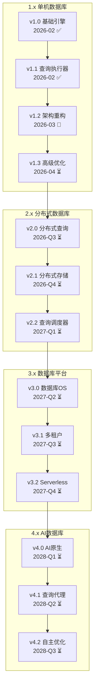

# SQLRustGo 版本路线图

> **版本**: 1.0
> **更新日期**: 2026-03-06
> **维护人**: yinglichina8848

---

## 一、版本系列概览

```
SQLRustGo
    │
    ├── 1.x 系列 ─── 单机数据库
    │
    ├── 2.x 系列 ─── 分布式数据库
    │
    ├── 3.x 系列 ─── 数据库平台
    │
    └── 4.x 系列 ─── AI 数据库
```

---

## 二、1.x 系列 (单机数据库)

### 2.1 v1.0 - 基础 SQL 引擎 ✅ 已发布

**发布日期**: 2026-02

**核心功能**:
- Lexer/Parser (词法/语法分析)
- Basic Executor (基础执行器)
- Memory Storage (内存存储)
- Basic SQL Support (基础 SQL 支持)

**技术栈**:
- Rust 2021 版
- 手写 Lexer
- 递归下降 Parser
- 简单火山模型执行器

### 2.2 v1.1 - 查询执行器 ✅ 已发布

**发布日期**: 2026-02

**核心功能**:
- Query Planner (查询规划器)
- Basic Optimizer (基础优化器)
- File Storage (文件存储)
- Transaction Support (事务支持)
- Index Support (索引支持)

**技术栈**:
- 逻辑计划/物理计划分离
- 基于规则的优化器
- B+ Tree 索引
- WAL 日志

### 2.3 v1.2 - 架构重构 🔄 进行中

**当前阶段**: Alpha (alpha/v1.2.0)

> 2026-03-07 口径更新：当前主开发分支为 `develop/v1.2.0`；`v1.2.0-draft` 与旧分支命名作为历史信息保留。

**核心功能**:
- Crate 模块化
- Storage Trait 抽象
- 向量化执行基础
- 统计信息收集
- 简化 CBO

**技术栈**:
- 模块化架构
- Trait 抽象层
- RecordBatch 向量化
- 成本模型

### 2.4 v1.3 - 高级优化 ⏳ 计划中

**预计发布**: 2026-04

**核心功能**:
- 级联优化器
- 矢量执行
- 完整统计信息
- 高级索引
- 查询缓存

**技术栈**:
- Cascades 框架
- Volcano 向量化
- Histogram 统计
- 哈希索引

---

## 三、2.x 系列 (分布式数据库)

### 3.1 v2.0 - 分布式查询引擎

**预计发布**: 2026-Q3

**核心功能**:
- 分布式查询
- 查询路由器
- 分布式优化器
- 数据分片感知

**技术栈**:
- 分布式查询计划
- 数据本地化优化
- 网络成本模型

### 3.2 v2.1 - 分布式存储

**预计发布**: 2026-Q4

**核心功能**:
- 分片
- 复制
- 分布式事务
- 一致性协议

**技术栈**:
- 水平分片
- 主从复制
- 2PC/3PC
- Raft/Paxos

### 3.3 v2.2 - 查询调度器

**预计发布**: 2027-Q1

**核心功能**:
- 查询调度程序
- 资源管理
- 负载均衡
- 故障恢复

**技术栈**:
- 任务调度
- 资源池
- 动态负载均衡
- 高可用

---

## 四、3.x 系列 (数据库平台)

### 4.1 v3.0 - 数据库操作系统

**预计发布**: 2027-Q2

**核心功能**:
- 数据库操作系统
- 资源隔离
- 多租户基础
- 安全增强

**技术栈**:
- 容器化部署
- 资源配额
- 租户隔离
- RBAC

### 4.2 v3.1 - 多租户

**预计发布**: 2027-Q3

**核心功能**:
- 租户隔离
- 资源配额
- 计费系统
- 监控告警

**技术栈**:
- Schema 隔离
- 资源限制
- 使用情况追踪
- 普罗米修斯

### 4.3 v3.2 - Serverless 执行

**预计发布**: 2027-Q4

**核心功能**:
- 无服务器引擎
- 自动扩缩容
- 按需计费
- 冷启动优化

**技术栈**:
- Function 计算
- 自动缩放
- 基于使用情况的计费
- 温水泳池

---

## 五、4.x 系列 (AI 数据库)

### 5.1 v4.0 - AI 原生数据库

**预计发布**: 2028-Q1

**核心功能**:
- AI原生存储
- 向量索引
- 语义查询
- 知识图谱

**技术栈**:
- 矢量数据库
- HNSW/IVF 索引
- 嵌入
- 图数据库

### 5.2 v4.1 - 查询代理

**预计发布**: 2028-Q2

**核心功能**:
- 查询代理
- 自然语言查询
- 智能推荐
- 自动调优

**技术栈**:
- 法学硕士整合
- 文本到SQL
- 查询建议
- 自动调整

### 5.3 v4.2 - 自主优化器

**预计发布**: 2028-Q3

**核心功能**:
- 自主优化器
- 自学习索引
- 智能调优
- 预测性维护

**技术栈**:
- 强化学习
- 学习索引
- 基于机器学习的调优
- 预测分析

---

## 六、版本演进图



---

## 七、技术债务规划

### 7.1 v1.x 遗留问题

| 问题 | 影响 | 计划版本 |
|------|------|----------|
|unwrap 过多| 稳定性 | v1.2 |
| 测试覆盖率不足 | 质量 | v1.2 |
| 文档不完整 | 可维护性 | v1.3 |
| 性能未优化 | 性能 | v1.3 |

### 7.2 架构演进计划

| 版本 | 架构改进 |
|------|----------|
| v1.2 | 模块化、Trait 抽象 |
| v1.3 | 向量化执行 |
| v2.0 | 分布式架构 |
| v2.1 | 存储分离 |
| v3.0 | 平台化 |
| v4.0 | AI 原生 |

---

## 八、里程碑时间线

```
2026
    │
    ├── Q1: v1.0, v1.1 ✅
    │
    ├── Q2: v1.2, v1.3
    │
    ├── Q3: v2.0
    │
    └── Q4: v2.1

2027
    │
    ├── Q1: v2.2
    │
    ├── Q2: v3.0
    │
    ├── Q3: v3.1
    │
    └── Q4: v3.2

2028
    │
    ├── Q1: v4.0
    │
    ├── Q2: v4.1
    │
    └── Q3: v4.2
```

---

## 九、相关文档

| 文档 | 说明 |
|------|------|
| [RELEASE_GOVERNANCE.md](./RELEASE_GOVERNANCE.md) | 版本治理模型 |
| [VERSION_PLAN.md](./docs/releases/v1.2.0/VERSION_PLAN.md) | 当前版本计划 |
| [BRANCH_GOVERNANCE.md](./BRANCH_GOVERNANCE.md) | 分支治理规范 |

---

## 十、变更历史

| 版本 | 日期 | 说明 |
|------|------|------|
| 1.0 | 2026-03-06 | 初始版本，定义 1.0-4.0 路线图 |

---

*本文档由 yinglichina8848 维护*
