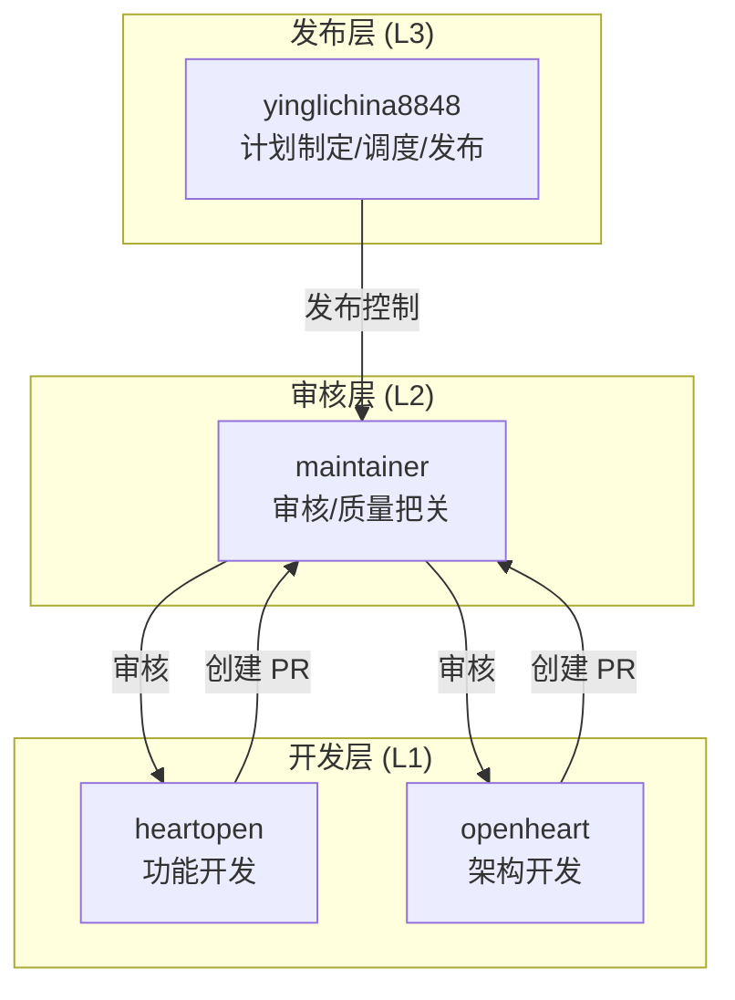
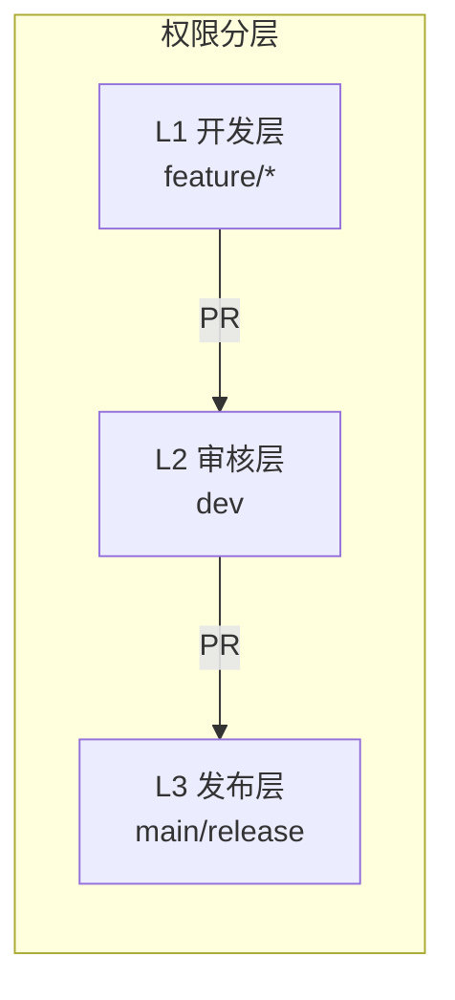
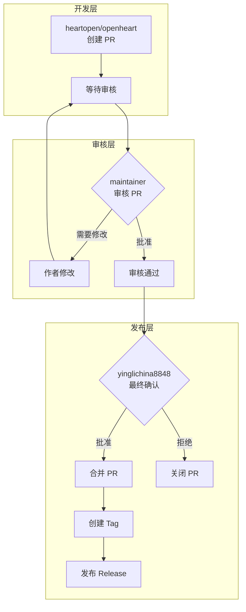
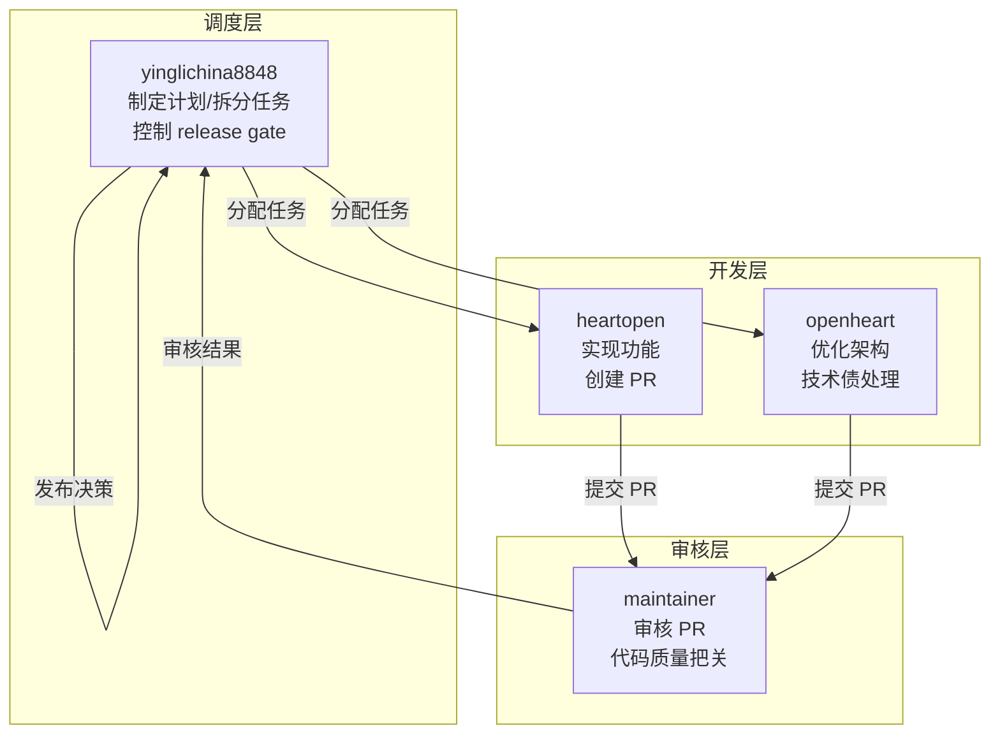
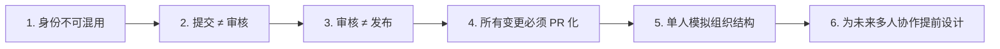
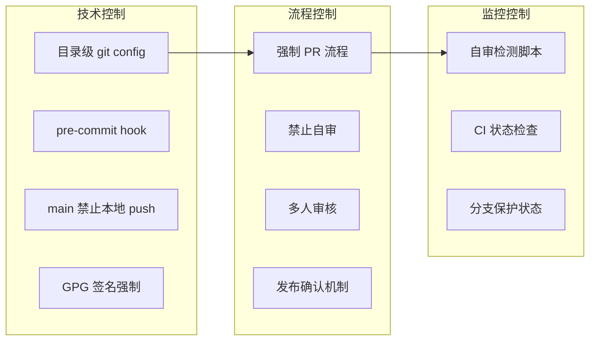

# 单人 4 GitHub 账号 + 4 AI Agent 多身份隔离开发模式

> **版本**: 1.0  
> **制定日期**: 2026-03-04  
> **适用范围**: SQLRustGo 项目  
> **文档类型**: 技术规范

---

## 目录

1. [总体背景](#一总体背景)
2. [账号结构](#二账号结构)
3. [本地目录结构](#三本地目录结构)
4. [Git 身份隔离规则](#四git-身份隔离规则)
5. [GPG 签名策略](#五gpg-签名策略)
6. [GitHub 身份隔离策略](#六github-身份隔离策略)
7. [PR 流程规范](#七pr-流程规范)
8. [AI Agent 分工](#八ai-agent-分工)
9. [核心设计原则](#九核心设计原则)
10. [安全控制](#十安全控制)
11. [风险控制说明](#十一风险控制说明)
12. [价值意义](#十二价值意义)
13. [附录](#十三附录)

---

## 一、总体背景

### 1.1 模式概述

本项目采用"单人多身份 + 多 AI Agent"协作模型。

### 1.2 设计目标

| 目标 | 说明 |
|------|------|
| 模拟真实组织治理结构 | 在单机环境中模拟多人协作 |
| 强制权限分离 | 开发、审核、调度、发布权限分离 |
| 防止自审 | 作者不能批准自己的 PR |
| 强制 PR 驱动 | 所有变更必须通过 PR |
| 保证 release 安全 | 发布流程受控 |

### 1.3 设计意义

本模式不是为了炫技，而是为了：

1. **构建企业级流程** - 提前适配生产环境
2. **提前适配多人团队结构** - 为扩展做准备
3. **为未来自动化 Agent 协作打基础** - 支持多 Agent 协作
4. **避免单身份操作带来的流程失控** - 降低风险

---

## 二、账号结构

### 2.1 四账号体系

| 账号 | 角色 | 权限层 | 职责 |
|------|------|--------|------|
|**心敞开**| 功能开发 | L1 | 实现功能、创建 PR |
|**敞开心扉**| 架构开发 | L1 | 优化架构、技术债处理 |
|**维护者**| 稳定维护/审核 | L2 | 审核 PR、代码质量把关 |
|**英利中国8848**| 计划制定/调度/发布 | L3 | 版本计划、发布控制 |

### 2.2 架构图 (Mermaid)



### 2.3 权限分层



---

## 三、本地目录结构

### 3.1 目录布局

```
/Users/liying/workspace
│
├── dev/                              # 开发目录
│   ├── heartopen/                    # heartopen 开发环境
│   │   └── sqlrustgo/
│   └── openheart/                    # openheart 开发环境
│       └── sqlrustgo/
│
├── maintainer/                       # 审核目录
│   └── sqlrustgo/                    # maintainer 审核环境
│
├── yinglichina/                      # 发布目录
│   └── sqlrustgo/                    # yinglichina8848 发布环境
│
└── identities/                       # 身份材料目录
    ├── heartopen/
    │   ├── PAT.txt                   # GitHub Token
    │   └── gpg.key                   # GPG 密钥
    ├── openheart/
    │   ├── PAT.txt
    │   └── gpg.key
    ├── maintainer/
    │   ├── PAT.txt
    │   └── gpg.key
    └── yinglichina8848/
        ├── PAT.txt
        └── gpg.key
```

### 3.2 目录规则

| 规则 | 说明 |
|------|------|
| 独立项目目录 | 每个身份拥有独立项目目录 |
| 身份材料隔离 | identities 目录仅存储密钥材料 |
| 项目目录不混放 | 项目目录不存储身份文件 |

---

## 四、Git 身份隔离规则

### 4.1 配置规则

每个项目目录必须使用 **local git config**：

```bash
# 在项目目录下执行
cd /Users/liying/workspace/dev/heartopen/sqlrustgo

git config user.name "heartopen"
git config user.email "heartopen@guizhouminzuuniversity.edu.cn"
```

### 4.2 禁止事项

```bash
# ❌ 禁止使用 global git config
git config --global user.name "xxx"
```

### 4.3 原因说明

> Git 作者身份必须与该目录的 GitHub 身份一致，避免提交记录污染。

### 4.4 配置验证

```bash
# 验证当前目录的 git 配置
git config --local --list | grep user
```

---

## 五、GPG 签名策略

### 5.1 配置方式

每个账号有独立 GPG key：

```bash
# 在项目目录下配置
git config user.signingkey <GPG_KEY_ID>
git config commit.gpgsign true
```

### 5.2 GPG 密钥管理

```bash
# 生成 GPG 密钥
gpg --full-generate-key

# 列出密钥
gpg --list-secret-keys --keyid-format=long

# 导出公钥
gpg --armor --export <GPG_KEY_ID> > public.key

# 上传到 GitHub
# Settings -> SSH and GPG keys -> New GPG key
```

### 5.3 目的

| 目的 | 说明 |
|------|------|
| 提交不可伪造 | GPG 签名验证 |
| 身份确认 | 确保提交来源 |
| 安全审计 | 可追溯性 |

---

## 六、GitHub 身份隔离策略

### 6.1 禁止事项

```bash
# ❌ 禁止使用
gh auth login
```

### 6.2 统一使用方式

```bash
# 使用环境变量
export GITHUB_TOKEN=$(cat /Users/liying/workspace/identities/<账号>/PAT.txt)

# 验证当前身份
gh api user --jq .login
```

### 6.3 身份切换脚本

```bash
#!/bin/bash
# switch-identity.sh

IDENTITY=$1
TOKEN_FILE="/Users/liying/workspace/identities/$IDENTITY/PAT.txt"

if [ -f "$TOKEN_FILE" ]; then
    export GITHUB_TOKEN=$(cat "$TOKEN_FILE")
    echo "Switched to: $(gh api user --jq .login)"
else
    echo "Identity not found: $IDENTITY"
    exit 1
fi
```

### 6.4 原则

> **GITHUB_TOKEN 决定 PR 审核身份，git config 只决定提交作者。**

---

## 七、PR 流程规范

### 7.1 流程图 (Mermaid)



### 7.2 核心规则

| 规则 | 说明 |
|------|------|
| 开发身份创建 PR |敞开心扉/敞开心扉|
| 不允许作者自审 | 必须由其他身份审核 |
| 审核身份批准 |维护者|
| 发布身份控制 merge |英利china8848|
| main 禁止直接 push | 只能通过 PR |

### 7.3 Release 规则

> release 必须通过 baseline 审核

### 7.4 自审检测

```bash
# 检测 PR 作者和审核者是否相同
check_self_review() {
    PR_NUMBER=$1
    AUTHOR=$(gh pr view $PR_NUMBER --json author --jq '.author.login')
    REVIEWERS=$(gh pr view $PR_NUMBER --json reviews --jq '.reviews[] | select(.state == "APPROVED") | .author.login')
    
    if echo "$REVIEWERS" | grep -q "^$AUTHOR$"; then
        echo "⚠️ WARNING: Self-review detected!"
        return 1
    else
        echo "✅ No self-review detected"
        return 0
    fi
}
```

---

## 八、AI Agent 分工

### 8.1 Agent 职责矩阵

| Agent | 职责 | 权限层 | 可访问目录 |
|-------|------|--------|------------|
|**心敞开**| 实现功能、创建 PR | L1 |开发/心开|
|**敞开心扉**| 优化架构、技术债处理 | L1 |开发/openheart|
|**维护者**| 审核 PR、代码质量把关 | L2 |维护者|
|**英利中国8848**| 制定版本计划、拆分任务、控制 release gate | L3 |英利中国|

### 8.2 Agent 协作图 (Mermaid)



### 8.3 Agent 限制

| 限制 | 说明 |
|------|------|
| Agent 不可访问 L3 | 物理隔离 |
|Agent 不可修改 main| 分支保护 |
|Agent 不可触发 release| 权限隔离 |

---

## 九、核心设计原则

### 9.1 六大原则



### 9.2 原则详解

| 原则 | 说明 | 实现方式 |
|------|------|----------|
| **身份不可混用** | 每个身份独立目录、独立 token |目录隔离 + local config|
| **提交 ≠ 审核** | 提交者和审核者必须是不同身份 | PR 流程 + 自审检测 |
| **审核 ≠ 发布** | 审核者和发布者必须是不同身份 | 权限分层 |
| **所有变更必须 PR 化** | 禁止直接 push 到受保护分支 | 分支保护 |
| **单人模拟组织结构** | 通过身份隔离模拟多人协作 | 四账号体系 |
| **为未来多人协作提前设计** | 架构可直接扩展到真实团队 | 权限模型 |

---

## 十、安全控制

### 10.1 安全规则

| 规则 | 说明 | 风险等级 |
|------|------|----------|
| 不共享 PAT | 每个身份独立 token | 🔴 高 |
| 不共享 SSH key | 每个身份独立密钥 | 🔴 高 |
| 不使用全局 gh 登录 | 使用环境变量 | 🟡 中 |
| 不允许绕过 PR | 强制 PR 流程 | 🔴 高 |
| 检查是否存在自审 | 自动检测 | 🟡 中 |

### 10.2 安全检查清单

```bash
#!/bin/bash
# security-check.sh

echo "=== Security Check ==="

# 检查是否使用 global git config
if git config --global --get user.name > /dev/null 2>&1; then
    echo "❌ WARNING: Global git config detected!"
else
    echo "✅ No global git config"
fi

# 检查是否使用 gh auth login
if gh auth status > /dev/null 2>&1; then
    echo "❌ WARNING: gh auth login detected!"
else
    echo "✅ No gh auth login"
fi

# 检查 GITHUB_TOKEN
if [ -z "$GITHUB_TOKEN" ]; then
    echo "❌ WARNING: GITHUB_TOKEN not set!"
else
    echo "✅ GITHUB_TOKEN set"
fi

# 验证当前身份
echo "Current GitHub identity: $(gh api user --jq .login)"
```

---

## 十一、风险控制说明

### 11.1 风险矩阵

| 风险 | 影响 | 概率 | 缓解措施 | 责任人 |
|------|------|------|----------|--------|
| 身份混用 | 🔴 高 | 🟡 中 |目录隔离 + local config|英利china8848|
| 自审行为 | 🔴 高 | 🟢 低 | 自动检测 + 流程规范 |维护者|
| Token 泄露 | 🔴 高 | 🟢 低 | 独立目录 + 权限限制 |英利china8848|
| 绕过 PR | 🔴 高 | 🟢 低 | 分支保护 + CI 强制 |英利china8848|
| 发布失误 | 🟡 中 | 🟢 低 | 手动确认 + 审核流程 |英利china8848|

### 11.2 控制措施



### 11.3 应急响应

| 场景 | 响应步骤 | 责任人 |
|------|----------|--------|
| Token 泄露 | 1. 立即撤销 token<br>2. 生成新 token<br>3. 审计相关操作 |英利china8848|
| 自审发现 | 1. 撤销审核<br>2. 重新分配审核人<br>3. 记录事件 |维护者|
| 发布失误 | 1. 回滚 release<br>2. 修复问题<br>3. 重新发布 |英利china8848|

---

## 十二、价值意义

### 12.1 实现目标

| 目标 | 说明 | 状态 |
|------|------|------|
| 单人企业级流程 | 一个人也能执行完整流程 | ✅ 已实现 |
| 可扩展到真实团队 | 架构无需重构 | ✅ 已实现 |
| 支持 AI Agent 协作治理 | 多 Agent 分工明确 | ✅ 已实现 |
| 提前构建工程制度 | 为未来做准备 | ✅ 已实现 |

### 12.2 成熟度评估

| 阶段 | 说明 | 状态 |
|------|------|------|
| 1.0 | 单账号开发 | ✅ 已超越 |
| 2.0 | 多账号 | ✅ 已实现 |
| 3.0 | 分支保护 | ✅ 已实现 |
| 4.0 | 权限分层 | ✅ 已实现 |
| 5.0 | AI 隔离 | ✅ 已实现 |
| 6.0 | 组织级可扩展 | 🔄 规划中 |

### 12.3 扩展路径


---

## 十三、附录

### A. 快速参考

#### A.1 身份切换

```bash
# 切换到 heartopen
export GITHUB_TOKEN=$(cat /Users/liying/workspace/identities/heartopen/PAT.txt)
cd /Users/liying/workspace/dev/heartopen/sqlrustgo

# 切换到 openheart
export GITHUB_TOKEN=$(cat /Users/liying/workspace/identities/openheart/PAT.txt)
cd /Users/liying/workspace/dev/openheart/sqlrustgo

# 切换到 maintainer
export GITHUB_TOKEN=$(cat /Users/liying/workspace/identities/maintainer/PAT.txt)
cd /Users/liying/workspace/maintainer/sqlrustgo

# 切换到 yinglichina8848
export GITHUB_TOKEN=$(cat /Users/liying/workspace/identities/yinglichina8848/PAT.txt)
cd /Users/liying/workspace/yinglichina/sqlrustgo
```

#### A.2 常用命令

```bash
# 验证当前身份
gh api user --jq .login

# 验证 git 配置
git config --local user.name
git config --local user.email

# 检查 PR 状态
gh pr list --state open

# 审核 PR (maintainer)
gh pr review <PR_NUMBER> --approve

# 合并 PR (yinglichina8848)
gh pr merge <PR_NUMBER> --squash
```

### B. 相关文档

| 文档 | 路径 | 说明 |
|------|------|------|
| 权限模型 | [GIT_PERMISSION_MODEL.md](./GIT_PERMISSION_MODEL.md) | 2.0 权限模型 |
| 企业级权限 | [GIT_PERMISSION_MODEL_V3.md](./GIT_PERMISSION_MODEL_V3.md) | 3.0 企业级权限 |
| 白皮书 | [WHITEPAPER_V3.md](./WHITEPAPER_V3.md) | 3.0 白皮书 |

### C. 变更历史

| 版本 | 日期 | 说明 |
|------|------|------|
| 1.0 | 2026-03-04 | 初始版本 |

---

*本文档由 yinglichina8848 制定*
