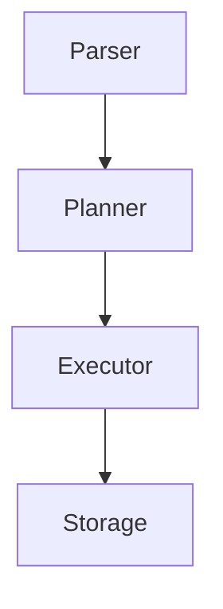

# SQLRustGo 架构演进推演（1.0 → 4.0）

## 1. 概述

本文档提供了 SQLRustGo 项目从 1.0 到 4.0 的完整架构演进推演模型。这不是一个简单的功能路线图，而是一个结构演化风险分析，旨在帮助团队识别每个阶段的关键挑战和决策点，特别是最容易踩坑的部分。

## 2. 1.0 —— 原型成立阶段

### 2.1 阶段目标

- **核心目标**：跑通最小闭环
- **具体目标**：
  - 数据流可运行
  - 执行链路成立
  - 基本功能可验证
  - 架构尚未稳定

### 2.2 架构形态（典型）



### 2.3 AI 角色

在 1.0 阶段，AI 可能只是：
- **AI → 生成查询 / 调用接口**
- 不参与核心执行流程

### 2.4 最容易踩坑（重点）

#### 🔴 1. 抽象过早

在 1.0 阶段：
- ❌ 不要做插件系统
- ❌ 不要做复杂 trait 抽象
- ❌ 不要搞多 runtime

**原因**：你需要的是“跑起来”，不是“优雅”。过早的抽象会增加复杂性，延缓验证速度。

#### 🔴 2. 过度工程化

- ❌ 过多目录分层
- ❌ 过多泛型
- ❌ 过度依赖注入

**原因**：1.0 是验证方向，不是建教堂。保持简单才能快速验证核心假设。

### 2.5 进入 2.0 的条件

- ✅ 数据路径稳定
- ✅ 修改 executor 不影响 storage
- ✅ 基本测试存在

## 3. 2.0 —— 架构稳定阶段

### 3.1 阶段目标

- **核心目标**：内部结构清晰，模块边界稳定
- **具体目标**：
  - 分层明确
  - trait 定义接口
  - 测试体系建立
  - 基本 CI

### 3.2 架构形态

```mermaid
graph TD
  "Interface Layer" --> "Logical Layer (Planner)"
  "Logical Layer (Planner)" --> "Physical Layer (Executor)"
  "Physical Layer (Executor)" --> "Storage Layer"
```

### 3.3 AI 角色

在 2.0 阶段，AI 开始参与：
- **AI → Planner Suggestion**
- 但不能绕过执行层

### 3.4 最容易踩坑（重点）

#### 🔴 1. AI 深度耦合内核

如果 2.0 让 AI：
- ❌ 直接访问存储
- ❌ 修改执行逻辑
- ❌ 注入 runtime

**后果**：后续演进将完全不可控。AI 必须是“策略层”，不是“执行层”。

#### 🔴 2. Trait 边界不清

典型错误：
- ❌ Planner 调 Storage
- ❌ Executor 调 Parser
- ❌ Layer 间相互引用

**必须保证**：依赖单向，层次清晰。

### 3.5 进入 3.0 的条件

- ✅ 模块依赖图可以画出来
- ✅ 无环依赖
- ✅ 新 feature 不会大面积改动

## 4. 3.0 —— 系统闭环阶段（关键）

### 4.1 阶段重要性

这是最危险的一阶段，决定了项目能否真正走向平台化。

### 4.2 阶段目标

- **核心目标**：系统真正可作为平台运行
- **具体目标**：
  - 完整生命周期管理
  - 稳定 API
  - 版本控制体系
  - 基本可扩展能力

### 4.3 架构形态

```mermaid
graph TD
  "API Layer" --> "Orchestrator"
  "Orchestrator" --> "Planner"
  "Planner" --> "Executor"
  "Executor" --> "Storage"
```

### 4.4 AI 角色

在 3.0 阶段，AI 的角色应该是：
- **AI → Orchestrator（建议策略）**
- 而不是：**AI → Executor（直接控制）**

### 4.5 3.0 最大坑（重点）

#### 🔴 1. 模块边界假稳定

很多项目在 3.0 阶段觉得“差不多”，但实际上：
- ❌ 内部还是互相引用
- ❌ 类型泄露跨层
- ❌ Executor 依赖 Planner 内部结构

**后果**：如果 3.0 结束时边界不干净，4.0 会指数级爆炸。

#### 🔴 2. API 过早冻结

如果在 3.0 阶段：
- ❌ 对外发布 SDK
- ❌ 承诺长期兼容
- ❌ 但内部结构还在变

**后果**：未来演进成本会非常高，甚至被历史包袱拖死。

#### 🔴 3. 扩展点设计错误

很多人会在 3.0 开始做插件系统，但如果：
- ❌ 插件插在错误层
- ❌ 插件可修改核心状态
- ❌ 没有沙箱

**后果**：你会得到一个不可控的平台，稳定性和安全性都会受到威胁。

### 4.6 判断 3.0 是否成功

问自己以下关键问题：
- ✅ 是否可以替换 storage 而不改 executor？
- ✅ 是否可以替换 planner 而不改 API？
- ✅ AI 是否可拔掉而系统仍可运行？

**如果不能**，4.0 不要启动。

## 5. 4.0 —— 平台化 / 生态化阶段

### 5.1 阶段目标

- **核心目标**：从系统变成平台
- **具体目标**：
  - 插件机制
  - SDK
  - 多 runtime
  - 外部扩展

### 5.2 架构形态

```mermaid
graph TD
  "SDK" --> "Plugin Layer"
  "Plugin Layer" --> "Core Kernel"
  "Core Kernel" --> "Storage"
```

### 5.3 核心原则

在 4.0 阶段，核心必须变成：
- **一个最小稳定内核**
- 所有扩展都通过插件层实现

### 5.4 4.0 最大坑（极重要）

#### 🔴 1. 内核不够小

如果 core 过大：
- ❌ 插件无法隔离
- ❌ 升级成本巨大
- ❌ 性能回归严重

**原因**：内核越大，修改的影响面就越大，插件的隔离性就越差。

#### 🔴 2. 扩展点过多

过多的 hook 会导致：
- ❌ 性能下降
- ❌ 状态不可预测
- ❌ 测试爆炸

**原则**：扩展点应该少而精，只在真正需要的地方开放。

#### 🔴 3. 版本分叉

一旦有生态：
- ❌ 你不能随便改接口
- ❌ 你必须维护兼容层
- ❌ 技术债指数级上升

**策略**：采用语义化版本控制，明确兼容性承诺，建立废弃流程。

## 6. 总体演进图

```mermaid
graph TD
  "1.0 — 原型成立" --> "2.0 — 架构稳定"
  "2.0 — 架构稳定" --> "3.0 — 系统闭环"
  "3.0 — 系统闭环" --> "4.0 — 平台开放"
```

## 7. 真正的死亡点在哪里？

不是 1.0，不是 2.0，而是：

> **3.0 → 4.0 的跃迁**

如果 3.0 的结构不干净，4.0 会把问题放大 10 倍。平台化会将所有潜在的架构问题暴露无遗。

## 8. 最重要的建议

3.0 结束时：

> **不要急着“开放”。先做一件事：画出系统依赖图，删除 20% 不必要的接口。**

平台化之前，必须收缩。一个精简、稳定的内核是平台成功的基础。

## 9. 总体判断

你现在的工程治理体系，足以支撑到 3.0 结束。4.0 不是流程问题，而是“是否具备内核稳定性”的问题。

## 10. 下一步建议

如果愿意，可以进一步深入：
- 🔥 3.0 分层结构具体建模
- 🔥 AI 与核心的安全边界设计
- 🔥 4.0 插件机制的正确插入层级推演
- 🔥 技术债风险热力图

这一步比任何 CI 设计都更关键，因为它决定了项目的长期可演进性。