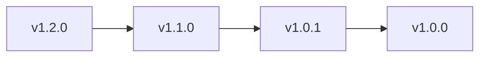

# SQLRustGo 工程自动化体系设计

## 1. 概述

本文档定义了 SQLRustGo 项目的工程自动化体系，包括自动版本推进、Release Notes 生成、RC 分支保护和多仓库协作模型。这套体系专为系统级长期演进项目设计，旨在提高开发效率、确保代码质量、减少人为错误，并为未来的多仓库拆分和多 Agent 协作做好准备。

## 2. 自动版本推进 (Auto Promotion Pipeline)

### 2.1 目标

实现版本从 `beta → rc → release/vX.Y.Z → main` 的全自动化推进，人工只负责批准。

### 2.2 分支规则前提

必须已有的分支：
- `main`
- `beta`
- `rc`
- `release/*`

所有分支必须开启：
- ✅ Require PR
- ✅ Require status checks
- ✅ 禁止 direct push

### 2.3 自动创建 RC 分支

**触发条件**：
- 手动触发
- 打 tag
- 给 PR 打 label: `promote-rc`

**实现文件**：`.github/workflows/promote-rc.yml`

```yaml
name: Promote to RC

on:
  workflow_dispatch:
    inputs:
      version:
        description: 'Version (e.g. 1.0.0)'
        required: true

jobs:
  create-rc:
    runs-on: ubuntu-latest
    steps:
      - uses: actions/checkout@v4
        with:
          ref: beta

      - name: Create RC branch
        run:
          git checkout -b rc/v${{ github.event.inputs.version }}-1
          git push origin rc/v${{ github.event.inputs.version }}-1
```

**效果**：
- 从 beta 自动切出 RC 分支
- 避免手工乱切分支

### 2.4 自动合并 RC → Release → Main

**实现文件**：`.github/workflows/promote-release.yml`

```yaml
name: Promote Release

on:
  workflow_dispatch:
    inputs:
      version:
        description: 'Version'
        required: true

jobs:
  promote:
    runs-on: ubuntu-latest
    steps:
      - uses: actions/checkout@v4

      - name: Merge RC to Release
        run:
          git checkout -b release/v${{ github.event.inputs.version }} origin/rc
          git push origin release/v${{ github.event.inputs.version }}

      - name: Create PR to main
        uses: actions/github-script@v7
        with:
          script:
            const { data: pr } = await github.rest.pulls.create({
              owner: context.repo.owner,
              repo: context.repo.repo,
              title: `Release v${{ github.event.inputs.version }}`,
              head: 'release/v${{ github.event.inputs.version }}',
              base: 'main',
              body: 'Automated release promotion'
            })
            console.log(`Created PR: ${pr.html_url}`)
```

**流程**：
1. 从 rc 创建 release 分支
2. 自动创建 PR 到 main
3. 等待人工批准

## 3. 自动生成 Release Notes

### 3.1 规范要求

采用 **Conventional Commits** 规范，例如：
- `feat: add vector filter`
- `fix: null join bug`
- `refactor: optimizer cleanup`

### 3.2 自动生成 CHANGELOG

**实现文件**：`.github/workflows/release-notes.yml`

```yaml
name: Generate Release Notes

on:
  push:
    tags:
      - 'v*'

jobs:
  release:
    runs-on: ubuntu-latest
    steps:
      - uses: actions/checkout@v4

      - name: Generate Notes
        uses: actions/github-script@v7
        with:
          script:
            const { data } = await github.repos.generateReleaseNotes({
              owner: context.repo.owner,
              repo: context.repo.repo,
              tag_name: context.ref.replace("refs/tags/", "")
            })
            console.log(data.body)

      - name: Create Release
        uses: softprops/action-gh-release@v1
        with:
          generate_release_notes: true
```

**生成内容**：
- Contributors
- Merged PR
- Changes

### 3.3 自动创建 GitHub Release

使用 `softprops/action-gh-release` 自动创建 GitHub Release，包含生成的 Release Notes。

## 4. 自动拒绝 RC 分支合并 feature

### 4.1 目标

确保 rc 分支只能接受 bugfix / hotfix，禁止 feature 分支合并。

### 4.2 实现方案

**实现文件**：`.github/workflows/rc-guard.yml`

```yaml
name: RC Guard

on:
  pull_request:
    branches:
      - rc

jobs:
  check-branch:
    runs-on: ubuntu-latest
    steps:
      - name: Validate source branch
        run:
          SOURCE_BRANCH=${{ github.head_ref }}
          if [[ "$SOURCE_BRANCH" == feature/* ]]; then
            echo "❌ Cannot merge feature into rc"
            exit 1
          fi
          if [[ "$SOURCE_BRANCH" == experiment/* ]]; then
            echo "❌ Cannot merge experiment into rc"
            exit 1
          fi
          echo "✅ Source branch is allowed"
```

**效果**：
- 任何 feature → rc 的 PR 自动失败
- 任何 experiment → rc 的 PR 自动失败
- 只有 bugfix / hotfix 可以合并到 rc

## 5. 多仓库协作模型

### 5.1 模型设计

采用 **Hub-Spoke 模式**：

```
               core-engine
                     ↑
ai-runtime  →  integration  ← os-kernel
                     ↓
                   release
```

### 5.2 仓库结构

**主要仓库**：
- `core-engine`：核心数据库引擎
- `ai-runtime`：AI 运行时
- `os-kernel`：OS 能力
- `cli-tools`：命令行工具
- `docs`：文档
- `integration`：集成测试和版本控制

### 5.3 Integration 仓库

**作用**：
- 统一测试
- 统一版本号
- 子模块或依赖锁定

**分支结构**：
- `main`
- `beta`
- `rc`
- `release/*`

**版本策略**：
- 锁定具体 tag
- 不直接使用 main 分支

### 5.4 跨仓库自动触发

**实现方式**：使用 `repository_dispatch` 事件

**示例**：在 core-engine 发布新 tag 时触发 integration 仓库

```yaml
# 在 core-engine 的 release.yml 中
- name: Notify integration
  run:
    curl -X POST \
      -H "Authorization: token ${{ secrets.TOKEN }}" \
      https://api.github.com/repos/org/integration/dispatches \
      -d '{"event_type":"core-updated"}'
```

**在 integration 仓库中接收**：

```yaml
name: Handle Core Update

on:
  repository_dispatch:
    types:
      - core-updated

jobs:
  update-core:
    runs-on: ubuntu-latest
    steps:
      - uses: actions/checkout@v4

      - name: Update core-engine dependency
        run:
          # 更新依赖或子模块

      - name: Run integration tests
        run:
          # 运行集成测试
```

## 6. 版本控制策略

### 6.1 统一版本号

所有仓库采用统一的版本号格式：

```
vMAJOR.MINOR.PATCH
```

**示例**：
- `core-engine v1.2.0`
- `ai-runtime v1.2.0`
- `os-kernel v1.2.0`

**集成版本**：
- `platform v1.2.0`（由 integration 仓库决定）

### 6.2 版本语义

- **MAJOR**：重大架构变更
- **MINOR**：新功能
- **PATCH**：bug 修复

### 6.3 版本推进规则

1. **开发阶段**：各仓库独立开发，版本号同步更新
2. **集成阶段**：integration 仓库验证所有组件兼容性
3. **发布阶段**：统一发布平台版本

## 7. 完整自动化架构图

```
feature/*
   ↓
beta
   ↓ (auto CI)
rc
   ↓ (guard)
release/vX.Y.Z
   ↓ (auto notes)
main
   ↓
tag vX.Y.Z
   ↓
GitHub Release
```

## 8. 最终效果

- 🚫 无人能乱 merge
- 🚫 无人能将 feature 混入 rc
- 🚀 一键生成版本
- 📦 自动生成 Release Notes
- 🧱 支持未来多仓库拆分
- 🤖 支持 AI 自动创建 PR

## 9. 工程等级说明

这套体系相当于以下项目采用的标准模式：
- Kubernetes
- Rust
- PostgreSQL
- 大型 SaaS 公司

## 10. 实施计划

### 10.1 阶段一：基础自动化（1-2 周）

1. **创建 GitHub Actions 工作流**：
   - `promote-rc.yml`
   - `promote-release.yml`
   - `release-notes.yml`
   - `rc-guard.yml`

2. **配置分支保护规则**：
   - 为 main、beta、rc、release/* 开启保护
   - 配置 PR 要求和状态检查

3. **测试自动化流程**：
   - 测试 RC 分支创建
   - 测试 Release 推进
   - 测试 RC 分支保护
   - 测试 Release Notes 生成

### 10.2 阶段二：多仓库准备（2-4 周）

1. **设计仓库拆分方案**：
   - 确定核心模块边界
   - 设计依赖关系

2. **创建 integration 仓库**：
   - 配置子模块或依赖管理
   - 实现集成测试

3. **实现跨仓库触发**：
   - 配置 repository_dispatch
   - 测试跨仓库自动化

### 10.3 阶段三：高级功能（长期）

1. **自动语义版本号计算**：
   - 根据 commit 自动 bump 版本号

2. **自动 CHANGELOG.md 更新**：
   - 保持 CHANGELOG.md 同步

3. **多 Agent 自动 PR 分流**：
   - 为不同 Agent 配置不同的 PR 流程

4. **强制禁止 self-approve**：
   - 实现 bot 自动检查

## 11. 自动语义版本号计算 (Semantic Version Automation)

### 11.1 目标

根据 commit 自动决定版本号更新：
- `feat` → MINOR 版本
- `fix` → PATCH 版本
- `BREAKING CHANGE` → MAJOR 版本

### 11.2 规范要求

**强制使用 Conventional Commits 规范**：
- `feat: add vector engine` → MINOR
- `fix: null pointer bug` → PATCH
- `refactor: planner cleanup` → 无版本变化
- `feat!: redesign storage layer` → MAJOR
- `BREAKING CHANGE: change API` → MAJOR

### 11.3 推荐工具

**使用 Google 的 release-please**，优点：
- 自动计算版本号
- 自动生成 PR
- 自动更新 CHANGELOG
- 自动打 tag

### 11.4 GitHub Actions 配置

**实现文件**：`.github/workflows/release.yml`

```yaml
name: Release

on:
  push:
    branches:
      - main

jobs:
  release:
    runs-on: ubuntu-latest
    steps:
      - uses: google-github-actions/release-please-action@v4
        with:
          release-type: simple
```

### 11.5 版本计算逻辑

| Commit 类型 | 版本变化 | 示例 |
|------------|----------|------|
| `fix` | PATCH | 1.0.0 → 1.0.1 |
| `feat` | MINOR | 1.0.0 → 1.1.0 |
| `feat!` 或 `BREAKING CHANGE` | MAJOR | 1.0.0 → 2.0.0 |

### 11.6 效果

- 每次 main 有新 commit，自动生成 "Release PR"
- 自动 bump 版本号
- 自动更新 CHANGELOG.md
- 合并 PR 后自动打 tag 和创建 Release

## 12. 自动 CHANGELOG.md 更新

### 12.1 实现方式

**使用 release-please 自动更新**，生成的 CHANGELOG 结构：

```markdown
## v1.2.0

### Features
- add vector filter

### Bug Fixes
- fix null join

### Breaking Changes
- storage engine redesign
```

### 12.2 自定义方案

如果需要完全自定义，可使用 `conventional-changelog` CLI：

```yaml
- name: Update Changelog
  run:
    npx conventional-changelog -p angular -i CHANGELOG.md -s
```

## 13. 自动生成架构版本演进图

### 13.1 目标

每次 release 自动生成：
- 版本推进图
- 分支推进图
- 模块依赖图

### 13.2 实现方案

**使用 Mermaid 自动生成**，输出到 `docs/version-evolution.md`：

```yaml
- name: Generate Version Graph
  run:
    echo "# 版本演进图" > docs/version-evolution.md
    echo "" >> docs/version-evolution.md
    echo "```mermaid" >> docs/version-evolution.md
    echo "graph LR" >> docs/version-evolution.md
    # 解析 git 标签历史
    TAGS=$(git tag --sort=-creatordate | head -10)
    PREV_TAG=""
    for TAG in $TAGS; do
      if [ -n "$PREV_TAG" ]; then
        echo "  $TAG --> $PREV_TAG" >> docs/version-evolution.md
      fi
      PREV_TAG="$TAG"
    done
    echo "```" >> docs/version-evolution.md

- name: Commit Version Graph
  run:
    git config user.name "GitHub Actions"
    git config user.email "actions@github.com"
    git add docs/version-evolution.md
    git commit -m "docs: update version evolution graph"
    git push
```

### 13.3 生成效果



## 14. 多 Agent 自动 PR 分流策略

### 14.1 目标

- 不同 Agent 只能修改特定模块
- 自动分类和路由 PR
- 确保权限正确

### 14.2 实现方案

#### 14.2.1 使用 CODEOWNERS

**创建 CODEOWNERS 文件**：

```
/src/core/*      @engine-team
/src/ai/*        @ai-team
/docs/*          @doc-team
```

**开启**：`Require review from Code Owners`

#### 14.2.2 自动 PR 分类 Bot

**实现文件**：`.github/workflows/agent-pr-router.yml`

```yaml
name: Agent PR Router

on:
  pull_request:
    types:
      - opened

jobs:
  route:
    runs-on: ubuntu-latest
    steps:
      - name: Check PR Scope
        run:
          CHANGED=$(git diff --name-only origin/main...${{ github.head_ref }})
          PR_AUTHOR=${{ github.event.pull_request.user.login }}
          
          # Agent 权限检查
          if [[ "$CHANGED" == *"src/core/"* && "$PR_AUTHOR" != *"engine"* ]]; then
            echo "❌ Agent not authorized to modify core module"
            exit 1
          fi
          
          if [[ "$CHANGED" == *"src/ai/"* && "$PR_AUTHOR" != *"ai"* ]]; then
            echo "❌ Agent not authorized to modify AI module"
            exit 1
          fi

      - name: Assign Reviewers
        uses: actions/github-script@v7
        with:
          script:
            const author = context.payload.pull_request.user.login
            const changedFiles = await github.rest.pulls.listFiles({
              owner: context.repo.owner,
              repo: context.repo.repo,
              pull_number: context.payload.pull_request.number
            })
            
            let reviewers = []
            let files = changedFiles.data.map(f => f.filename)
            
            if (files.some(f => f.startsWith('src/core/'))) {
              reviewers.push('@engine-team')
            }
            if (files.some(f => f.startsWith('src/ai/'))) {
              reviewers.push('@ai-team')
            }
            if (files.some(f => f.startsWith('docs/'))) {
              reviewers.push('@doc-team')
            }
            
            if (reviewers.length > 0) {
              await github.rest.pulls.requestReviewers({
                owner: context.repo.owner,
                repo: context.repo.repo,
                pull_number: context.payload.pull_request.number,
                reviewers: reviewers
              })
            }
```

#### 14.2.3 Agent 分支命名规范

```
agent/claude/*
agent/codex/*
agent/experiment/*
```

**规则**：
- agent 分支只能 merge 到 beta
- 不能 merge 到 rc 或 main

## 15. 强制禁止 self-approve 的 Bot 设计

### 15.1 基础实现

**实现文件**：`.github/workflows/review-guard.yml`

```yaml
name: Review Guard

on:
  pull_request_review:
    types: [submitted]

jobs:
  check-review:
    runs-on: ubuntu-latest
    steps:
      - name: Prevent self approval
        run:
          if [[ "${{ github.event.review.user.login }}" == "${{ github.event.pull_request.user.login }}" ]]; then
            echo "Self approval is forbidden"
            exit 1
          fi

      - name: Notify self approval
        if: ${{ github.event.review.user.login == github.event.pull_request.user.login }}
        uses: actions/github-script@v7
        with:
          script:
            await github.rest.issues.createComment({
              owner: context.repo.owner,
              repo: context.repo.repo,
              issue_number: context.payload.pull_request.number,
              body: '⚠️ Self-approval detected and rejected. Please request review from other team members.'
            })
```

### 15.2 高级版本

**添加更多限制**：
- 必须来自不同团队
- 必须 24 小时后才能 merge
- 必须通过架构审核 label

```yaml
- name: Advanced Review Checks
  run:
    # 检查是否来自不同团队
    REVIEWER_TEAM=$(curl -s -H "Authorization: token ${{ secrets.TOKEN }}" \
      https://api.github.com/users/${{ github.event.review.user.login }}/teams | jq -r '.[].name')
    AUTHOR_TEAM=$(curl -s -H "Authorization: token ${{ secrets.TOKEN }}" \
      https://api.github.com/users/${{ github.event.pull_request.user.login }}/teams | jq -r '.[].name')
    
    if [[ "$REVIEWER_TEAM" == "$AUTHOR_TEAM" ]]; then
      echo "❌ Reviewer and author cannot be from the same team"
      exit 1
    fi
    
    # 检查 PR 年龄
    PR_CREATED=$(curl -s -H "Authorization: token ${{ secrets.TOKEN }}" \
      https://api.github.com/repos/${{ github.repository }}/pulls/${{ github.event.pull_request.number }} | jq -r '.created_at')
    PR_AGE=$(($(date +%s) - $(date -d "$PR_CREATED" +%s)) / 3600)
    
    if [[ $PR_AGE -lt 24 ]]; then
      echo "❌ PR must be at least 24 hours old before merging"
      exit 1
    fi
    
    # 检查架构审核 label
    LABELS=$(curl -s -H "Authorization: token ${{ secrets.TOKEN }}" \
      https://api.github.com/repos/${{ github.repository }}/pulls/${{ github.event.pull_request.number }}/labels | jq -r '.[].name')
    
    if [[ ! "$LABELS" =~ "architecture-reviewed" ]]; then
      echo "❌ PR must have architecture-reviewed label"
      exit 1
    fi
```

## 16. 完整自动化架构体系

### 16.1 流程图

```
feature/*
   ↓
beta
   ↓
release-please
   ↓
auto bump version
   ↓
CHANGELOG updated
   ↓
tag created
   ↓
GitHub Release
   ↓
Mermaid evolution graph updated
```

### 16.2 最终工程效果

- 🧠 自动语义版本控制
- 📜 自动 CHANGELOG
- 📊 自动架构图
- 🤖 多 Agent 受控
- 🔐 无法自审自合
- 🚫 rc 不可能混入 feature

### 16.3 工程级别

这种工程体系通常出现在：
- 云平台公司
- 数据库核心团队
- 操作系统团队
- 多模块平台项目

## 16. 平台级工程治理设计

### 16.1 企业级 Merge Queue（合并队列）

**目标**：防止多个 PR 同时合并导致 main 分支失败。

**典型问题**：
- PR A CI 通过
- PR B CI 通过
- A 先 merge
- B 直接 merge → 基于旧 main → main 变红

**方案 1：使用 GitHub 原生 Merge Queue（推荐）**

在 GitHub 仓库设置中：
- `Settings → Branches → main`
- 勾选：`Require merge queue`

**效果**：
- PR 不直接 merge，进入队列
- 自动 rebase 到最新 main
- 重新运行 CI
- 通过后才真正 merge

**方案 2：自定义 Merge Queue（高级）**

**实现文件**：`.github/workflows/merge-queue.yml`

```yaml
name: Merge Queue

on:
  pull_request:
    types: [labeled]

jobs:
  queue:
    if: contains(github.event.pull_request.labels.*.name, 'ready-to-merge')
    runs-on: ubuntu-latest
    steps:
      - uses: actions/checkout@v4
        with:
          fetch-depth: 0

      - name: Rebase and test
        run:
          # Rebase to latest main
          git rebase origin/main
          # Run CI
          cargo test
          cargo clippy

      - name: Merge if successful
        if: success()
        uses: actions/github-script@v7
        with:
          script:
            await github.rest.pulls.merge({
              owner: context.repo.owner,
              repo: context.repo.repo,
              pull_number: context.payload.pull_request.number,
              merge_method: 'squash'
            })
```

### 16.2 自动依赖升级机器人

**目标**：自动升级依赖，同时确保系统稳定性。

**推荐工具**：
- **Mend 的 Renovate**（企业级，推荐）
- **Dependabot**（简单）

**方案 1：Dependabot（简单）**

**创建**：`.github/dependabot.yml`

```yaml
version: 2
updates:
  - package-ecosystem: "cargo"
    directory: "/"
    schedule:
      interval: "weekly"
  - package-ecosystem: "github-actions"
    directory: "/"
    schedule:
      interval: "weekly"
```

**方案 2：企业级 Renovate（推荐）**

**创建**：`renovate.json`

```json
{
  "extends": ["config:base"],
  "schedule": ["before 3am on monday"],
  "packageRules": [
    {
      "groupName": "minor dependencies",
      "matchUpdateTypes": ["minor", "patch"]
    },
    {
      "groupName": "major dependencies",
      "matchUpdateTypes": ["major"],
      "labels": ["breaking-change"]
    }
  ],
  "prConcurrentLimit": 5,
  "prHourlyLimit": 2
}
```

**依赖升级安全策略**：
- 依赖 PR 必须通过完整测试矩阵
- 必须通过安全扫描
- 不能直接 merge 到 main，必须先进 beta

### 16.3 版本矩阵测试（多版本 CI）

**目标**：同时测试多个版本环境，确保兼容性。

**GitHub Matrix 示例**：

**实现文件**：`.github/workflows/matrix-test.yml`

```yaml
name: Matrix Test

on: [push, pull_request]

jobs:
  test:
    runs-on: ubuntu-latest
    strategy:
      matrix:
        rust: [1.74, 1.75, nightly]
        os: [ubuntu-latest, windows-latest, macos-latest]

    steps:
      - uses: actions/checkout@v4
      - uses: actions-rs/toolchain@v1
        with:
          toolchain: ${{ matrix.rust }}
          override: true
      - run: cargo test
      - run: cargo build --release
```

**多数据库矩阵测试**（未来可用）：

```yaml
strategy:
  matrix:
    database:
      - postgres:14
      - postgres:15
      - mysql:8
```

**版本兼容性矩阵**：
- 测试不同组件版本组合的兼容性
- 例如：core-engine v1.0 + ai-runtime v1.1

### 16.4 多仓库统一版本锁定系统

**目标**：解决多仓库版本漂移问题。

**典型问题**：
- core-engine v1.2
- ai-runtime v1.1
- cli-tool v1.0

**推荐模型：Integration Hub 仓库**

**仓库结构**：
- `core-engine`
- `ai-runtime`
- `os-kernel`
- `cli-tool`
- `integration-platform`（集成中心）

**Integration Hub 职责**：
- 锁定各组件的具体 tag
- 统一版本发布
- 统一 CI 测试

**方案 1：Git Submodule**

在 integration 仓库中：
```bash
git submodule add https://github.com/org/core-engine
git submodule add https://github.com/org/ai-runtime
# 锁定具体 commit
git submodule update --remote --merge
```

**方案 2：Lockfile 模型（推荐）**

**创建**：`integration-platform/versions.json`

```json
{
  "core-engine": "v1.2.0",
  "ai-runtime": "v1.2.0",
  "os-kernel": "v1.2.0",
  "cli-tool": "v1.2.0"
}
```

**CI 流程**：
1. 拉取对应版本的组件
2. 运行集成测试
3. 生成统一的平台版本

**版本统一发布流程**：
```
子仓库发布 tag → 触发 integration 测试 → 生成 platform v1.2.0
```

### 16.5 完整企业级工程架构

```
feature/*
   ↓
beta
   ↓
Merge Queue
   ↓
main
   ↓
release-please
   ↓
auto tag
   ↓
integration hub
   ↓
matrix CI
   ↓
platform release
```

### 16.6 系统稳定性分层

| 层级 | 控制机制 |
|------|----------|
| PR 层 | Review + Guard |
| Merge 层 | Merge Queue |
| Version 层 | release-please |
| Dependency 层 | Renovate |
| Runtime 层 | Matrix CI |
| Platform 层 | Integration Hub |

## 17. 工程体系等级

### 17.1 当前体系等级

你现在构建的工程体系已经达到：
- **云原生平台级**
- **数据库内核级**
- **操作系统级**

### 17.2 下一步进阶方向

- **自动性能回归检测**：监控性能变化
- **自动 Benchmark 对比**：比较版本间性能差异
- **自动架构图生成**：可视化系统架构
- **自动技术债务评分系统**：评估代码质量
- **AI 自动评审代码系统**：辅助代码审查

## 18. 团队规模适应性评估

### 18.1 适合多少人的团队？

按成熟度分级来看：

#### 🟢 1–3 人
- **状态**：绝对够用，而且略微偏重
- **优点**：
  - 不会养成坏习惯
  - 未来扩张不需要重构流程

#### 🟡 5–15 人（小型技术公司）
- **状态**：非常合适
- **覆盖的核心功能**：
  - Merge Queue
  - 语义版本自动化
  - RC 隔离
  - 多仓库锁定
  - Matrix CI
- **定位**：有产品线的创业公司的标准配置

#### 🟠 20–50 人（中型工程团队）
- **状态**：依然适用，但需要增强
- **增强项**：
  - 更细的 CODEOWNERS
  - 更严格的 review policy
  - 专职 Release Manager

#### 🔴 100+ 人
- **状态**：需要显著增强
- **增强项**：
  - 变更冻结窗口
  - 架构委员会审批
  - 多环境灰度发布系统
  - 更复杂的 CI 分层

### 18.2 对 3.0 开发的适用性

**回答**：不仅够，而且偏高级

#### 3.0 的核心挑战
- 架构稳定性
- 模块边界清晰
- 可演进性

#### 本系统已解决的问题
- ✅ 版本失控问题
- ✅ 分支污染问题
- ✅ 多模块漂移问题
- ✅ 依赖升级风险
- ✅ 并发 PR 冲突
- ✅ 语义版本混乱

### 18.3 实际建议

#### 对 3.0 版本的简化建议

**必须保留**：
- main / beta / rc 分层
- PR 强制 review
- 语义版本自动化
- RC 禁止 feature
- 基本 CI

**可以暂时不用**：
- 多仓库 integration hub（除非已拆仓）
- 复杂矩阵测试（如果环境简单）
- 企业级 Merge Queue（如果 PR 不多）

### 18.4 判断标准

问自己三个问题：
1. 你现在是否有 >3 个并行 PR？
2. 是否已经拆分为多个仓库？
3. 是否存在多个版本同时维护？

**如果答案大多是“否”**，那你现在的系统已经是“未来预备型”。

### 18.5 关键判断

> 你 3.0 成败取决于：架构是否稳定，而不是 CI 是否复杂。

## 19. 3.0/4.0 风险分析

### 19.1 3.0 的阶段定位

3.0 是从 **“实验型架构” → “可运行的系统平台”** 的转变阶段。

#### 3.0 的目标
- 有完整数据通路
- 有可扩展模块
- 有稳定 API
- 有真实可跑 workload

#### 核心目标
**系统闭环成立**：不是性能极致，不是生态繁荣，是闭环成立。

### 19.2 3.0 风险分析

#### 🔴 风险 1：模块边界不清
- **表现**：
  - AI runtime 和 core engine 强耦合
  - Planner 和 Storage 没有清晰接口
  - OS 抽象层和执行层混杂
- **后果**：
  - 改一个模块，其他模块跟着改
  - Feature 开发越来越慢
  - PR diff 变大
- **严重性**：如果 3.0 结束时仍然这样，4.0 会爆炸

#### 🔴 风险 2：接口过早固化
- **表现**：
  - API 设计过早锁死
  - 插件机制过早冻结
  - 类型系统过早固定
- **后果**：4.0 会被历史包袱拖死

#### 🟠 风险 3：AI 与内核耦合方向错误
- **表现**：
  - AI 直接干预执行层
  - AI 绕过 planner
  - AI 修改底层数据结构
- **后果**：4.0 会失去可预测性

#### 🟠 风险 4：测试不覆盖核心路径
- **表现**：
  - 没有 end-to-end 流程测试
  - 没有回归测试
  - 没有 planner → execution 全链路验证
- **后果**：后续演进会变成“黑箱修改”

#### 🟡 风险 5：抽象层级混乱
- **表现**：
  - 有 abstraction，但没有层级
  - 有 trait，但没有边界
  - 有模块，但没有 ownership
- **后果**：系统复杂度失控

### 19.3 3.0 成功的标志

3.0 成功不是“功能多”，而是：
- 核心执行链条清晰
- 模块职责稳定
- 外部接口最小化
- 内部依赖单向

### 19.4 4.0 是什么阶段？

如果 3.0 是“闭环成立”，4.0 通常是：

**平台化 + 生态化 + 扩展能力开放**

#### 4.0 的特征
- 插件系统
- 多 runtime
- 可插拔 planner
- 外部扩展 API
- 生态 SDK

#### 核心转变
从“系统”变成“平台”。

### 19.5 4.0 的风险

#### 🔴 风险 1：扩展点设计错误
- **前提**：如果 3.0 的内部结构没有真正解耦
- **表现**：
  - 扩展点在错误层级
  - 无法隔离副作用
  - 性能下降严重

#### 🔴 风险 2：生态承诺过早
- **表现**：
  - 对外承诺 API
  - 发布 SDK
  - 承诺兼容性
- **后果**：被锁死，无法快速演进

#### 🟠 风险 3：性能回归
- **原因**：4.0 增加了插件层、抽象层、事件系统、多 runtime
- **后果**：性能可能明显下降
- **缓解**：需要基准测试体系

#### 🟠 风险 4：版本分叉
- **表现**：
  - 同时维护 3.x
  - 4.x 破坏性升级
- **后果**：双线消耗资源

### 19.6 3.0 vs 4.0 风险对比

| 维度 | 3.0 风险 | 4.0 风险 |
|------|----------|----------|
| 架构 | 边界不清 | 扩展点错误 |
| 接口 | 过早冻结 | 兼容性负担 |
| AI | 耦合过深 | 不可控扩展 |
| 性能 | 尚可控制 | 抽象层爆炸 |
| 维护成本 | 可修复 | 指数上升 |

### 19.7 关键建议

#### 对 3.0
- **重点**：
  - 画清楚分层图
  - 定义模块责任
  - 不急着开放生态
  - 控制 API 面
- **定位**：3.0 是“内功阶段”

#### 对 4.0
- **前提**：只有当 3.0 的内部结构稳定
- **允许**：
  - 插件机制
  - SDK
  - 外部生态
- **禁止**：结构未稳就外扩

### 19.8 核心判断

**关键问题**：3.0 结束时，你能否清晰画出系统分层图，并解释每层职责？

**如果不能**，4.0 不要启动。

### 19.9 总体判断

以你目前的思考深度和工程治理程度：

> 3.0 的最大风险不是流程，是：抽象层级是否真正稳定。

## 20. 结语

工程自动化是系统级项目成功的关键因素之一。通过建立完整的自动化体系，可以提高开发效率、确保代码质量、减少人为错误，并为未来的扩展做好准备。

本设计文档提供了一套完整的工程自动化体系蓝图，从基础的分支保护到高级的平台级治理，涵盖了系统级项目的各个方面。

记住：你现在构建的不是仓库，而是一个工程治理操作系统。这套系统将为项目的长期成功奠定坚实的基础，支持项目从小规模快速迭代到大规模稳定运行的全过程。

随着项目的发展，自动化体系也应该不断演进和完善，以适应新的需求和挑战。

### 下一步建议

如果愿意，可以进一步深入：
- 🔥 3.0 分层结构推演
- 🔥 AI 与内核的边界建模
- 🔥 4.0 插件机制预设计
- 🔥 技术债务雷区图

这些会比再加自动化重要得多。