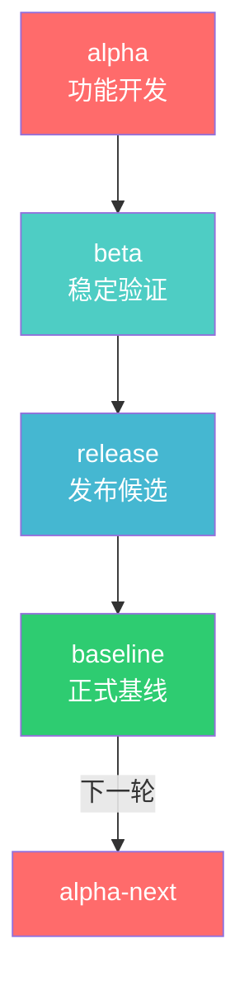
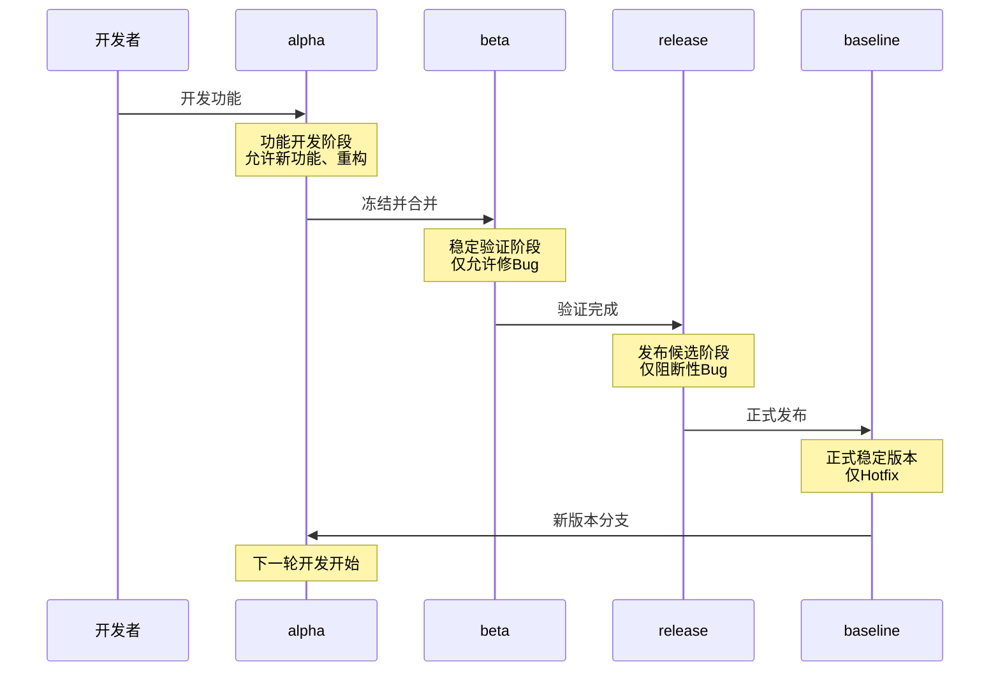
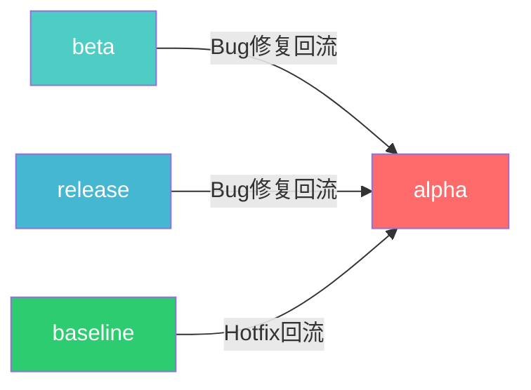
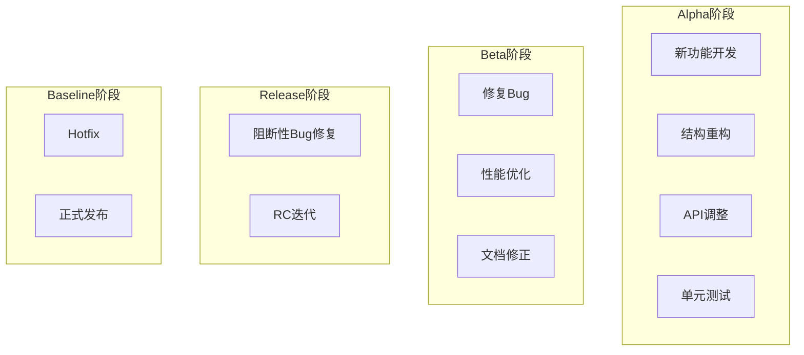
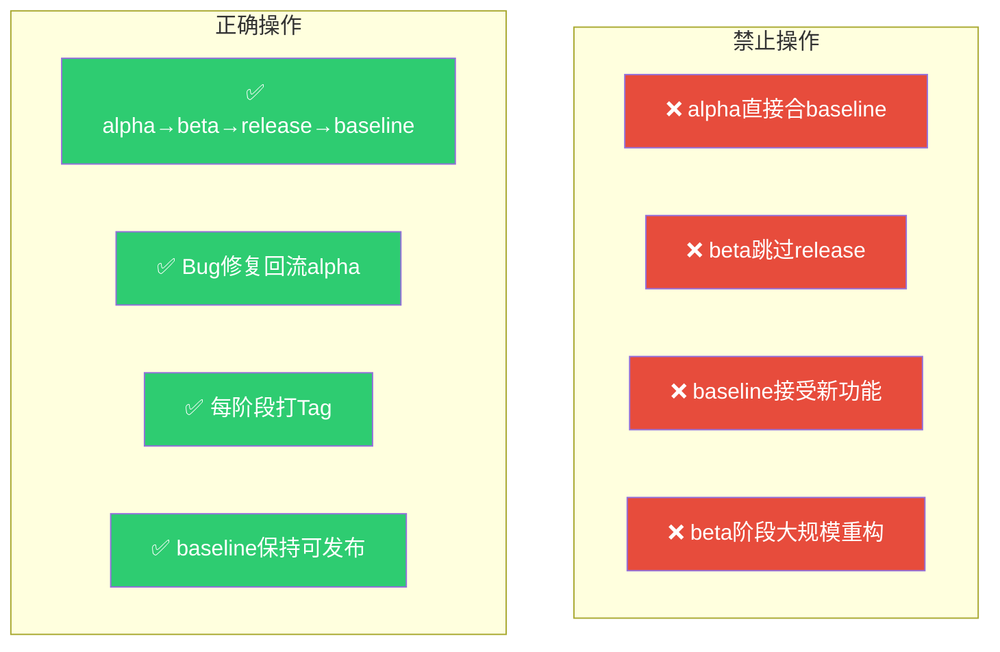

# SQLRustGo 版本流转架构图

> 版本：v1.0
> 日期：2026-02-18

---

## 1. 分支结构图（Mermaid）



---

## 2. 详细生命周期图



---

## 3. Bug 回流图



**说明**：在任何下游阶段修复的 Bug，都必须回流到 alpha，确保下一轮版本包含修复。

---

## 4. 版本标记策略

```
┌─────────────────────────────────────────────────────────────────────────────┐
│                          版本标记策略                                        │
├─────────────────────────────────────────────────────────────────────────────┤
│                                                                              │
│   阶段        标记格式           示例              说明                      │
│   ─────────────────────────────────────────────────────────────────────     │
│   Alpha       vX.Y.Z-alpha      v1.0.0-alpha     功能开发完成               │
│   Beta        vX.Y.Z-beta       v1.0.0-beta      稳定验证开始               │
│   RC          vX.Y.Z-rc.N       v1.0.0-rc.1      发布候选                   │
│   正式版      vX.Y.Z            v1.0.0           正式发布                   │
│                                                                              │
│   示例流程：                                                                 │
│   v1.0.0-alpha → v1.0.0-beta → v1.0.0-rc.1 → v1.0.0                        │
│                                                                              │
└─────────────────────────────────────────────────────────────────────────────┘
```

---

## 5. 分支职责矩阵



---

## 6. 禁止操作图



---

## 7. 完整流程图

```
┌─────────────────────────────────────────────────────────────────────────────┐
│                          完整版本推进流程                                    │
├─────────────────────────────────────────────────────────────────────────────┤
│                                                                              │
│   ┌─────────────────────────────────────────────────────────────────────┐   │
│   │                        Alpha 阶段                                    │   │
│   │  ┌──────────┐    ┌──────────┐    ┌──────────┐    ┌──────────┐      │   │
│   │  │ 功能开发 │ ──►│ 单元测试 │ ──►│ 代码审查 │ ──►│ 冻结Tag  │      │   │
│   │  └──────────┘    └──────────┘    └──────────┘    └──────────┘      │   │
│   └─────────────────────────────────────────────────────────────────────┘   │
│                                   │                                          │
│                                   ▼                                          │
│   ┌─────────────────────────────────────────────────────────────────────┐   │
│   │                        Beta 阶段                                     │   │
│   │  ┌──────────┐    ┌──────────┐    ┌──────────┐    ┌──────────┐      │   │
│   │  │ 合并alpha│ ──►│ Bug修复  │ ──►│ 性能优化 │ ──►│ 验证完成 │      │   │
│   │  └──────────┘    └──────────┘    └──────────┘    └──────────┘      │   │
│   └─────────────────────────────────────────────────────────────────────┘   │
│                                   │                                          │
│                                   ▼                                          │
│   ┌─────────────────────────────────────────────────────────────────────┐   │
│   │                       Release 阶段                                   │   │
│   │  ┌──────────┐    ┌──────────┐    ┌──────────┐    ┌──────────┐      │   │
│   │  │ 合并beta │ ──►│ RC测试   │ ──►│ 阻断修复 │ ──►│ 发布准备 │      │   │
│   │  └──────────┘    └──────────┘    └──────────┘    └──────────┘      │   │
│   └─────────────────────────────────────────────────────────────────────┘   │
│                                   │                                          │
│                                   ▼                                          │
│   ┌─────────────────────────────────────────────────────────────────────┐   │
│   │                       Baseline 阶段                                  │   │
│   │  ┌──────────┐    ┌──────────┐    ┌──────────┐    ┌──────────┐      │   │
│   │  │ 合并rel  │ ──►│ 正式Tag  │ ──►│ 文档更新 │ ──►│ 发布公告 │      │   │
│   │  └──────────┘    └──────────┘    └──────────┘    └──────────┘      │   │
│   └─────────────────────────────────────────────────────────────────────┘   │
│                                                                              │
└─────────────────────────────────────────────────────────────────────────────┘
```

---

## 8. 当前状态

```
┌─────────────────────────────────────────────────────────────────────────────┐
│                          当前版本状态                                        │
├─────────────────────────────────────────────────────────────────────────────┤
│                                                                              │
│   Alpha (v1.0.0-alpha.1)  ────►  Beta (v1.0.0-beta.1)  ────►  RC1        │
│        ✅ 已完成                                 ✅ 已完成        🔄 进行中   │
│                                                                              │
│   Release (v1.0.0-release)                      Baseline                    │
│        ⏳ 待开始                                     ⏳ 待开始                │
│                                                                              │
│   标签：                                                                    │
│   ├── v1.0.0-alpha.1  (Alpha 完成)                                         │
│   ├── v1.0.0-beta.1   (Beta 完成)                                          │
│   └── v1.0.0-rc.1    (RC 进行中)                                          │
│                                                                              │
└─────────────────────────────────────────────────────────────────────────────┘
```

---

*本文档由 TRAE (GLM-5.0) 创建*
