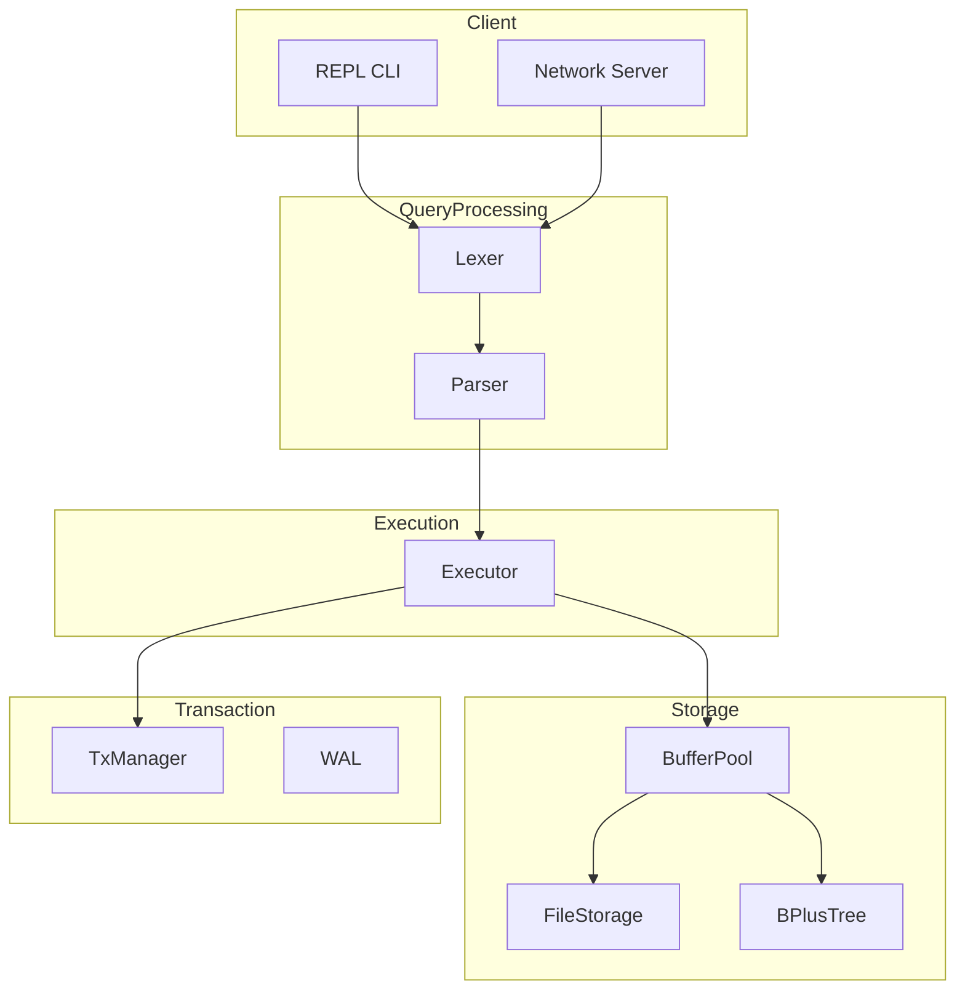
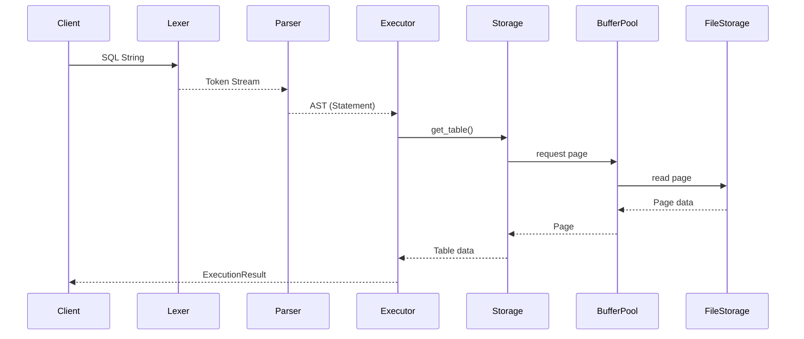
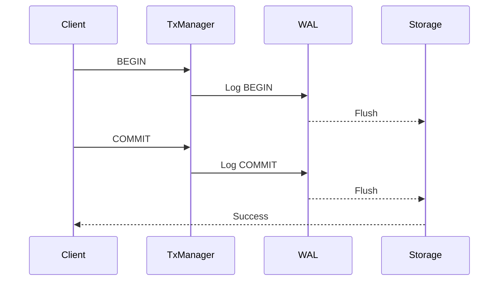
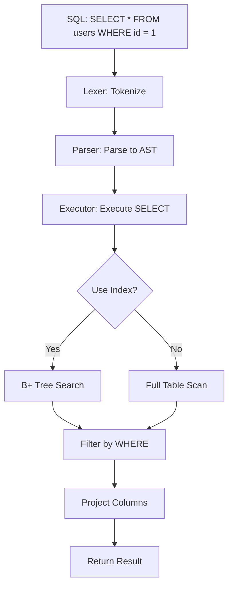
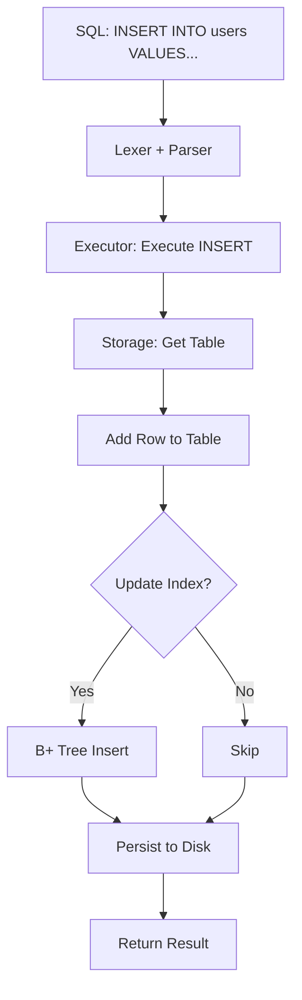

# SQLRustGo 架构设计文档

## 1. 系统概览

SQLRustGo 是一个用 Rust 从零实现的轻量级关系型数据库，支持 SQL-92 子集。专为学习和研究数据库内核设计，同时具备生产级别的代码质量。

### 设计目标

- **简洁性**: 代码结构清晰，易于理解和学习
- **完整性**: 实现数据库核心功能（解析、执行、存储、事务）
- **可扩展性**: 模块化设计，便于功能扩展
- **性能**: 合理的性能表现，支持索引优化

---

## 2. 架构图

### 2.1 整体架构

### 2.2 查询处理流程

### 2.3 事务处理流程

---

## 3. 模块说明

### 3.1 Lexer（词法分析器）

**位置**: `src/lexer/`

**功能**: 将 SQL 字符串转换为 Token 流

**核心结构**:
- `Lexer`: 主词法分析器
- `Token`: Token 类型枚举

**支持的 Token 类型**:
| 类型 | 说明 |
|------|------|
| Keywords | SQL 保留字 (SELECT, FROM, WHERE...) |
| Identifiers | 表名/列名 |
| Literals | 字面量 (数字、字符串) |
| Operators | 运算符 (=, >, <...) |
| Punctuation | 标点符号 ((), ,, ;) |

### 3.2 Parser（语法分析器）

**位置**: `src/parser/`

**功能**: 将 Token 流转换为抽象语法树 (AST)

**核心结构**:
- `Parser`: 主解析器
- `Statement`: SQL 语句枚举
- `Expression`: 表达式枚举

**支持的语句**:
| 语句 | 说明 |
|------|------|
| SELECT | 查询数据 |
| INSERT | 插入数据 |
| UPDATE | 更新数据 |
| DELETE | 删除数据 |
| CREATE TABLE | 创建表 |
| DROP TABLE | 删除表 |

### 3.3 Executor（执行引擎）

**位置**: `src/executor/`

**功能**: 执行 SQL 语句，返回结果

**核心结构**:
- `ExecutionEngine`: 执行引擎
- `ExecutionResult`: 执行结果

**执行流程**:
1. 接收解析后的 Statement
2. 根据语句类型分发到对应处理函数
3. 通过 Storage 层读取/写入数据
4. 支持索引优化（WHERE 子句）
5. 返回 ExecutionResult

### 3.4 Storage（存储层）

**位置**: `src/storage/`

**子模块**:

#### BufferPool
- 内存缓冲池，缓存磁盘页
- LRU 淘汰策略
- 减少磁盘 I/O

#### FileStorage
- 文件持久化存储
- 表数据的序列化/反序列化
- 支持 JSON 格式

#### BPlusTree
- B+ 树索引结构
- O(log n) 查找复杂度
- 支持范围查询

### 3.5 Transaction（事务管理）

**位置**: `src/transaction/`

**子模块**:

#### WAL (Write-Ahead Log)
- 预写日志
- 记录事务操作
- 保证持久性

#### TransactionManager
- 事务生命周期管理
- 状态机: Active → Committed/Aborted

### 3.6 Network（网络层）

**位置**: `src/network/`

**功能**: MySQL 风格协议支持

**协议特性**:
- TCP 连接
- MySQL Wire Protocol (版本 10)
- 支持查询执行

**包类型**:
| 类型 | 说明 |
|------|------|
| OK Packet | 成功响应 |
| Error Packet | 错误响应 |
| EOF Packet | 结果集结束 |
| Data Packet | 行数据 |

### 3.7 Types（类型系统）

**位置**: `src/types/`

**SQL 数据类型**:
| SQL 类型 | Rust 类型 | 说明 |
|----------|-----------|------|
| NULL | Null | 空值 |
| BOOLEAN | bool | 布尔值 |
| INTEGER | i64 | 64位整数 |
| FLOAT | f64 | 64位浮点 |
| TEXT | String | 字符串 |
| BLOB | Vec<u8> | 二进制数据 |

---

## 4. 数据流

### 4.1 SELECT 查询流程

### 4.2 INSERT 流程

---

## 5. 关键设计决策

### 5.1 存储格式

使用 JSON 格式进行持久化，简化实现，便于调试。

**优点**:
- 人类可读
- 便于调试
- 无需额外依赖

**缺点**:
- 性能不如二进制格式
- 文件体积较大

### 5.2 索引策略

使用 B+ 树作为索引结构，叶子节点通过链表连接，支持高效范围查询。

**设计**:
- MAX_KEYS = 4 (小阶B+树)
- 支持等值查询和范围查询
- 自动更新索引

### 5.3 事务日志

采用 Write-Ahead Log (WAL) 机制，保证事务持久性。

**记录类型**:
- BEGIN: 事务开始
- COMMIT: 事务提交
- ROLLBACK: 事务回滚

---

## 6. 限制与已知问题

- 不支持 JOIN 操作
- 不支持子查询
- 不支持事务嵌套
- 不支持约束（外键、唯一键等）
- 索引优化有限
- 并发控制简化

---

## 7. 未来规划

### 短期
- [ ] 完善测试覆盖率
- [ ] 性能优化
- [ ] 错误处理增强

### 中期
- [ ] JOIN 支持
- [ ] 子查询支持
- [ ] 约束支持

### 长期
- [ ] 完整 SQL-92 支持
- [ ] 查询优化器
- [ ] MVCC 并发控制

---

## 8. 参考资料

- 《Database System Concepts》- Silberschatz
- 《Architecture of a Database System》- Stonebraker
- MySQL Wire Protocol Documentation
- SQL-92 Standard
