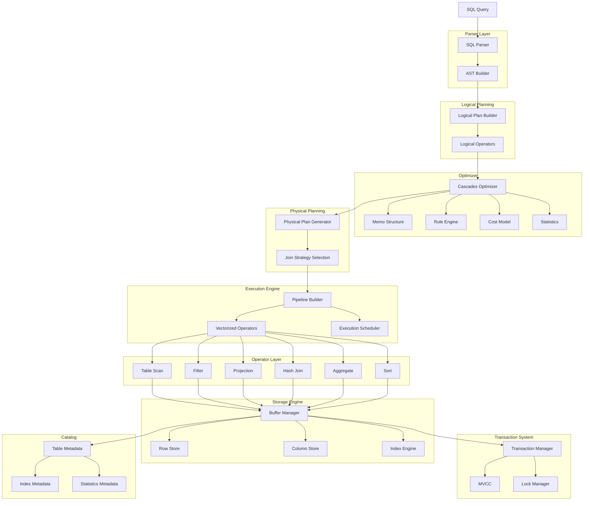
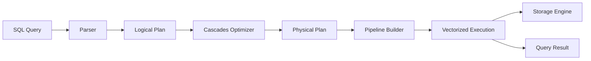
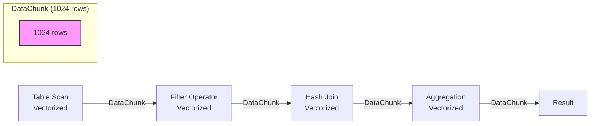
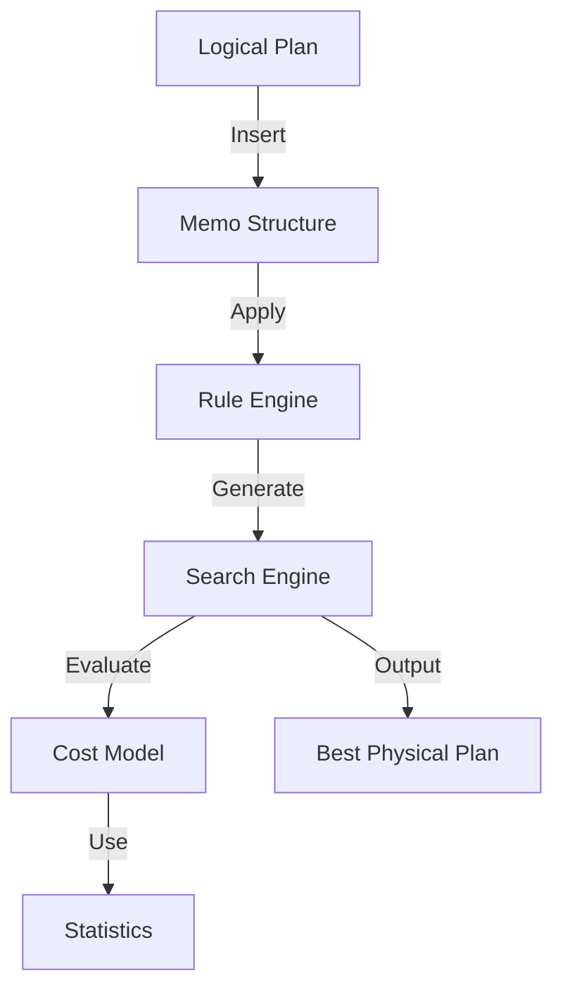
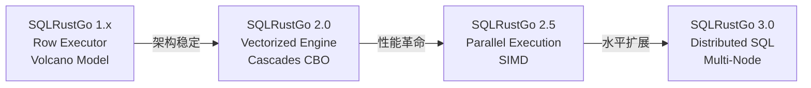
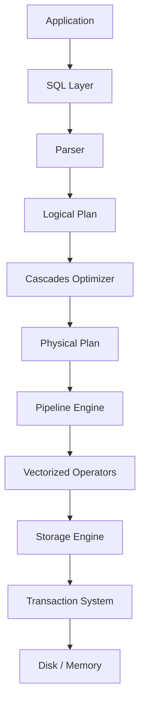

# SQLRustGo 架构设计文档

> **版本**: v2.0
> **更新日期**: 2026-03-11

## 概述

SQLRustGo 是一个用 Rust 实现的 SQL-92 数据库管理系统，采用分层架构设计。

---

## 一、系统总体架构


```mermaid
flowchart TB

    SQL[SQL Query]

    subgraph Parser Layer
        P1[SQL Parser]
        P2[AST Builder]
    end

    subgraph Logical Planning
        L1[Logical Plan Builder]
        L2[Logical Operators]
    end

    subgraph Optimizer
        O1[Cascades Optimizer]
        O2[Memo Structure]
        O3[Rule Engine]
        O4[Cost Model]
        O5[Statistics]
    end

    subgraph Physical Planning
        PH1[Physical Plan Generator]
        PH2[Join Strategy Selection]
    end

    subgraph Execution Engine
        E1[Pipeline Builder]
        E2[Vectorized Operators]
        E3[Execution Scheduler]
    end

    subgraph Operator Layer
        OP1[Table Scan]
        OP2[Filter]
        OP3[Projection]
        OP4[Hash Join]
        OP5[Aggregate]
        OP6[Sort]
    end

    subgraph Storage Engine
        S1[Buffer Manager]
        S2[Row Store]
        S3[Column Store]
        S4[Index Engine]
    end

    subgraph Transaction System
        T1[Transaction Manager]
        T2[MVCC]
        T3[Lock Manager]
    end

    subgraph Catalog
        C1[Table Metadata]
        C2[Index Metadata]
        C3[Statistics Metadata]
    end

    SQL --> P1
    P1 --> P2

    P2 --> L1
    L1 --> L2

    L2 --> O1
    O1 --> O2
    O1 --> O3
    O1 --> O4
    O1 --> O5

    O1 --> PH1
    PH1 --> PH2

    PH2 --> E1
    E1 --> E2
    E1 --> E3

    E2 --> OP1
    E2 --> OP2
    E2 --> OP3
    E2 --> OP4
    E2 --> OP5
    E2 --> OP6

    OP1 --> S1
    OP2 --> S1
    OP3 --> S1
    OP4 --> S1
    OP5 --> S1
    OP6 --> S1

    S1 --> S2
    S1 --> S3
    S1 --> S4

    S1 --> T1
    T1 --> T2
    T1 --> T3

    S1 --> C1
    C1 --> C2
    C1 --> C3
```

---

## 二、查询执行流程


```mermaid
flowchart LR

    SQL[SQL Query]

    Parser[Parser]

    LogicalPlan[Logical Plan]

    Optimizer[Cascades Optimizer]

    PhysicalPlan[Physical Plan]

    Pipeline[Pipeline Builder]

    Executor[Vectorized Execution]

    Storage[Storage Engine]

    Result[Query Result]

    SQL --> Parser
    Parser --> LogicalPlan
    LogicalPlan --> Optimizer
    Optimizer --> PhysicalPlan
    PhysicalPlan --> Pipeline
    Pipeline --> Executor
    Executor --> Storage
    Executor --> Result
```

---

## 三、Vectorized Execution Pipeline


```mermaid
flowchart LR

    Scan[Table Scan<br/>Vectorized]

    Filter[Filter Operator<br/>Vectorized]

    Join[Hash Join<br/>Vectorized]

    Aggregate[Aggregation<br/>Vectorized]

    Output[Result]

    subgraph DataFlow["DataChunk (1024 rows)"]
        direction TB
        DF1[1024 rows]
    end

    Scan -->|DataChunk| Filter
    Filter -->|DataChunk| Join
    Join -->|DataChunk| Aggregate
    Aggregate -->|DataChunk| Output

    style DF1 fill:#f9f,stroke:#333,stroke-width:2px
```

---

## 四、Cascades Optimizer 内部结构


```mermaid
flowchart TB

    LogicalPlan[Logical Plan]

    Memo[Memo Structure]

    Rules[Rule Engine]

    Search[Search Engine]

    Cost[Cost Model]

    Stats[Statistics]

    BestPlan[Best Physical Plan]

    LogicalPlan -->|Insert| Memo
    Memo -->|Apply| Rules
    Rules -->|Generate| Search
    Search -->|Evaluate| Cost
    Cost -->|Use| Stats
    Search -->|Output| BestPlan
```

### 4.1 优化器核心组件

| 组件 | 说明 |
|------|------|
| Memo | 存储所有候选执行计划 |
| Rule Engine | 应用优化规则 (Predicate Pushdown, Join Reordering) |
| Cost Model | 计算执行成本 |
| Statistics | 表/列统计信息 |

---

## 五、版本演进架构


```mermaid
flowchart LR

    V1[SQLRustGo 1.x<br/>Row Executor<br/>Volcano Model]

    V2[SQLRustGo 2.0<br/>Vectorized Engine<br/>Cascades CBO]

    V25[SQLRustGo 2.5<br/>Parallel Execution<br/>SIMD]

    V3[SQLRustGo 3.0<br/>Distributed SQL<br/>Multi-Node]

    V1 -->|架构稳定| V2
    V2 -->|性能革命| V25
    V25 -->|水平扩展| V3
```

---

## 六、技术层次


```mermaid
flowchart TB

    Application[Application]
    SQLLayer[SQL Layer]
    Parser[Parser]
    LogicalPlan[Logical Plan]
    Optimizer[Cascades Optimizer]
    PhysicalPlan[Physical Plan]
    PipelineEngine[Pipeline Engine]
    VectorizedOps[Vectorized Operators]
    StorageEngine[Storage Engine]
    Transaction[Transaction System]
    DiskMemory[Disk / Memory]

    Application --> SQLLayer
    SQLLayer --> Parser
    Parser --> LogicalPlan
    LogicalPlan --> Optimizer
    Optimizer --> PhysicalPlan
    PhysicalPlan --> PipelineEngine
    PipelineEngine --> VectorizedOps
    VectorizedOps --> StorageEngine
    StorageEngine --> Transaction
    Transaction --> DiskMemory
```

---

## 七、核心模块说明

### 7.1 Parser Layer

负责 SQL 解析，生成抽象语法树 (AST)。

| 模块 | 功能 |
|------|------|
| Lexer | 词法分析，将 SQL 转换为 Token |
| Parser | 语法分析，生成 AST |
| AST Builder | 语法树构建 |

### 7.2 Optimizer

基于代价的查询优化器。

| 模块 | 功能 |
|------|------|
| Cascades | 优化算法框架 |
| Memo | 候选计划存储 |
| Rule Engine | 规则应用 |
| Cost Model | 代价估算 |

### 7.3 Execution Engine

向量化执行引擎。

| 模块 | 功能 |
|------|------|
| Pipeline Builder | 流水线构建 |
| Vectorized Operators | 向量化算子 |
| Execution Scheduler | 执行调度 |

### 7.4 Storage Engine

数据存储层。

| 模块 | 功能 |
|------|------|
| Buffer Manager | 缓冲池管理 |
| Row Store | 行存引擎 |
| Column Store | 列存引擎 |
| Index Engine | 索引引擎 |

---

## 八、Legacy 架构图 (v1.x)

```
┌─────────────────────────────────────┐
│           main.rs (REPL)             │
├─────────────────────────────────────┤
│           executor/                 │  ← 查询执行引擎
├─────────────────────────────────────┤
│           parser/                    │  ← SQL → AST
│           lexer/                    │  ← SQL → Tokens
├─────────────────────────────────────┤
│           storage/                   │  ← Page, BufferPool, B+ Tree
├─────────────────────────────────────┤
│         transaction/                 │  ← WAL, TxManager
├─────────────────────────────────────┤
│           network/                   │  ← TCP 服务器/客户端
├─────────────────────────────────────┤
│           types/                     │  ← Value, SqlError
└─────────────────────────────────────┘
```

---

## 九、SQL 执行数据流

```
用户输入 SQL
     ↓
Lexer: "SELECT * FROM users" → [SELECT, STAR, FROM, IDENTIFIER(users)]
     ↓
Parser: Tokens → Statement::Select { table: "users", columns: [*], where_clause: None }
     ↓
Executor: 根据 Statement 类型调用 Storage 层
     ↓
Storage: 读取数据、构建结果
     ↓
返回 ExecutionResult { rows: [...], columns: [...], rows_affected: n }
```

---

## 十、错误处理机制

- **ParseError**: SQL 语法错误
- **ExecutionError**: 查询执行错误
- **TypeMismatch**: 类型不匹配
- **TableNotFound**: 表不存在
- **ColumnNotFound**: 列不存在
- **IoError**: I/O 错误

所有错误都实现 `std::error::Error` trait，支持 `Display` 输出。

---

## 十一、扩展点

1. **新增 SQL 语句**: 在 Parser 添加新的 `parse_xxx` 方法，在 Executor 添加对应处理
2. **新增数据类型**: 在 Types 模块添加新的 Value 变体
3. **新存储引擎**: 实现 Storage trait
4. **新网络协议**: 在 Network 模块添加协议处理

---

## 十二、测试覆盖

| 模块 | 行覆盖率 | 函数覆盖率 |
|------|---------|-----------|
| lexer/token.rs | 100% | 100% |
| types/error.rs | 100% | 100% |
| storage/file_storage.rs | 98.94% | 95.65% |
| storage/buffer_pool.rs | 97.96% | 100% |
| transaction/manager.rs | 93.69% | 80% |
| executor/mod.rs | 86.14% | 92.31% |
| parser/mod.rs | 78.74% | 96.15% |
| **总体** | **82.24%** | **84.73%** |

---

## 变更历史

| 版本 | 日期 | 说明 |
|------|------|------|
| 1.0 | 2026-03-05 | 初始版本 |
| 2.0 | 2026-03-11 | 添加 Mermaid 架构图，优化文档结构 |
