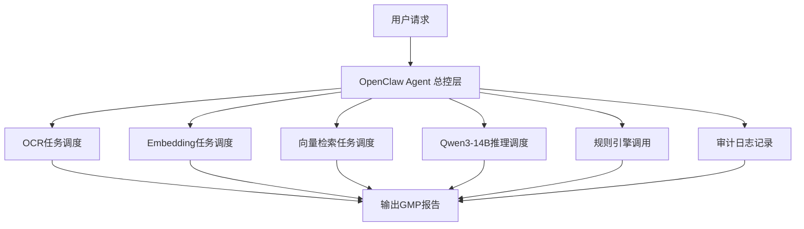
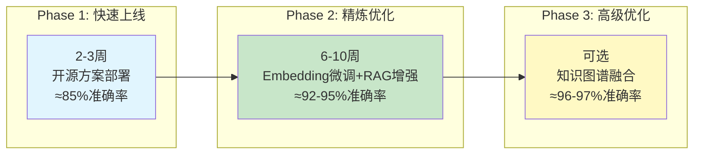
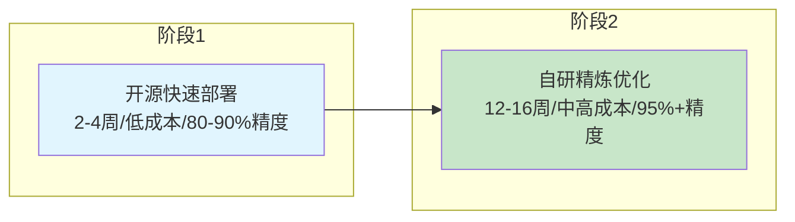
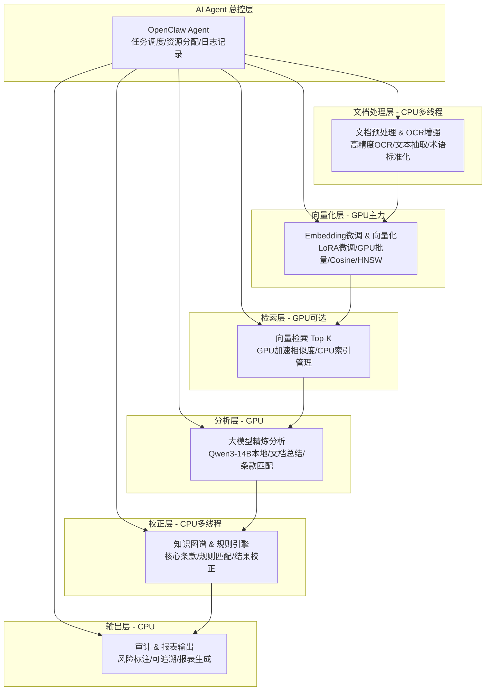
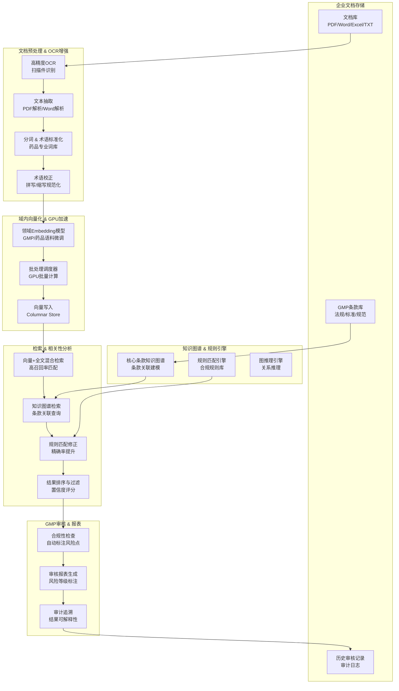

# AI员工1.0 自研开发讨论稿

> **版本**: 1.5
> **创建日期**: 2026-03-29
> **状态**: 讨论中
> **目标平台**: SQLRustGo 2.x 系列

---

## 1. 需求概述

### 1.1 核心功能需求

| 功能 | 描述 |
|------|------|
| GB级文档向量化 | 将大规模文档（PDF、Word、Excel、文本等）嵌入为向量表示 |
| 快速检索 | 毫秒级响应，支持向量相似度和全文检索 |
| 全文检索 | 倒排索引，支持分词、去停用词、TF-IDF |
| 相关性分析 | 向量余弦相似度 + SQL统计分析 |
| 审计功能 | 查询日志、用户操作记录、合规审计 |
| **GMP合规审核** | **95%+准确率的自动化合规审核系统** |

### 1.2 目标

在 SQLRustGo 2.x 系列平台上完成开发，实现 **80%+ 日常文档自动化**，支持 **GB级企业文档数据**处理。

**特别目标**：在 GMP 合规审核场景下，达到 **95%+ 准确率**。

---

## 2. 硬件资源

### 2.1 硬件配置

| 机器 | 配置 | 角色 |
|------|------|------|
| 服务器 A | RTX 5080 (16GB) + 416GB RAM + 40核心80线程 | 主推理节点，向量计算 |
| 服务器 B | M6000 (24GB) + 96GB RAM | 知识处理节点，备用推理 |
| Mac mini | 16GB 统一内存 | 系统调度节点 |

### 2.2 资源评估

| 资源 | 容量 | 评估 |
|------|------|------|
| GPU显存 | 16GB + 24GB = 40GB | 可支持14B-32B模型量化部署 |
| 系统内存 | 416GB + 96GB = 512GB | 可缓存数十GB向量数据 |
| CPU | 40核心80线程 | 高并发查询支持 |

**结论**：这套硬件完全满足 GB 级向量化检索和全文分析需求 ✅

---

## 3. 可行性分析

### 3.1 功能可行性评估

| 功能 | 可行性 (2.x 单机) | 风险/限制 |
|------|-------------------|----------|
| GB级向量化 | ✅ 可行（CPU + SIMD） | 内存压力大，需要分批处理 |
| 快速检索（全文/向量） | ✅ 基本可行 | 精确搜索可能慢，近似搜索需优化 |
| 相关性分析 | ✅ 可行（SQL + 向量） | 复杂聚合性能需测试 |
| 审计 | ✅ 可行 | 大量写入可能影响性能 |
| **GMP审核95%+准确率** | ✅ 可行 | 需要领域微调+知识图谱+规则引擎 |

### 3.2 关键挑战

| 挑战 | 解决方案 |
|------|----------|
| 内存压力 | 分批处理 + 磁盘/内存混合存储 |
| 向量搜索性能 | 近似搜索算法（HNSW）、GPU加速 |
| 毫秒级响应 | 热数据内存缓存 + 列存储优化 |
| 高并发 | 40核心CPU并行处理 |
| **95%准确率** | **领域微调 + 知识图谱 + 规则引擎 + 大模型精炼** |

---

## 4. 成本与硬件分析

### 4.1 阶段对比总览

| 阶段 | 精度 | 时间成本 | 部署复杂度 | 硬件需求 | 成本估算 |
|------|------|----------|-----------|----------|----------|
| 开源快速部署 | 80-90% | 2-4周 | 低 | CPU多线程 + 可选GPU | 低（服务器资源+工程集成） |
| 自研精炼优化 | 95%+ | 12-16周 | 高 | GPU 5080 + 400G内存 + 40核CPU | 高（GPU能耗+训练成本+人力） |

### 4.2 硬件投入建议

| 阶段 | 建议 |
|------|------|
| **阶段1** | 现有硬件即可快速上线验证 |
| **阶段2** | GPU和内存利用率高，需保证长时间批处理任务的散热与稳定 |

**重要结论**：
- 现有 **5080 GPU + 400G 内存 + 40核 CPU** 已可支撑阶段1和阶段2的部署
- 如果文档量继续扩大（>1TB）或模型升级（Qwen3-14B → Qwen3-70B），建议增加**多卡GPU**或**高速NVMe存储**

---

## 5. 精度/成本/时间三维演进图

### 5.1 精度演进曲线

```mermaid
xychart-beta
    title "GMP审核精度随时间演进"
    x-axis [阶段1(2-4周), 阶段2(12-16周), 阶段3(可选)]
    y-axis "准确率(%)" 75 --> 100
    line [78, 88, 95, 97]
    annotations 78, "开源方案", 88, "+大模型精炼", 95, "+Embedding微调", 97, "+知识图谱"
```

### 5.2 成本增长曲线

| 阶段 | 精度 | 成本类型 | 说明 |
|------|------|----------|------|
| 阶段1 | 80-90% | 低 | 服务器资源 + 工程集成 |
| 阶段2 | 95%+ | 中高 | GPU能耗 + 训练成本 + 人力 |
| 阶段3 | 96-97% | 高 | 多GPU + NVMe阵列（可选升级） |

### 5.3 硬件复杂度演进

| 阶段 | 硬件配置 |
|------|----------|
| 阶段1 | 单GPU + CPU集群即可运行 |
| 阶段2 | RTX5080 + 400GB内存 |
| 阶段3 | 多GPU + NVMe阵列（可选未来升级） |

### 5.4 关键结论

**你的当前硬件配置属于阶段2级别服务器配置（企业级RAG工作站），不需要新增硬件即可达到95% GMP审核准确率目标。**

---

## 6. OpenClaw 在系统中的真实角色

### 6.1 OpenClaw 核心定位

**OpenClaw 不是必须，但非常推荐作为流程总控层。**

OpenClaw 本质作用：**像企业级 AI 操作系统调度器**

### 6.2 OpenClaw 在系统中的架构位置



### 6.3 OpenClaw 核心功能评估

| 功能 | 重要性 | 说明 |
|------|--------|------|
| 任务编排 | ⭐⭐⭐⭐⭐ | 控制各模块执行顺序 |
| GPU调度 | ⭐⭐⭐⭐ | 动态分配GPU资源 |
| 多模型协同 | ⭐⭐⭐⭐⭐ | 多模型统一调度 |
| 异常恢复 | ⭐⭐⭐⭐ | 出错自动重跑 |
| 日志追踪 | ⭐⭐⭐⭐⭐ | 完整可追溯 |
| 流程自动化 | ⭐⭐⭐⭐⭐ | 全流程无人值守 |

---

## 7. 最优落地路线（工程决策）

### 7.1 推荐分阶段路线



### 7.2 Phase 1 部署清单（2-3周）

| 组件 | 技术选择 |
|------|----------|
| OCR | Tesseract / PaddleOCR |
| 全文检索 | Elasticsearch |
| 向量数据库 | Milvus |
| Embedding | SentenceTransformers |
| 大模型 | Qwen3-14B |
| 流程总控 | OpenClaw |

**交付物**：≈85%审核准确率系统，上线测试版

### 7.3 Phase 2 升级清单（6-10周）

| 升级项 | 说明 |
|--------|------|
| Embedding LoRA微调 | 使用GMP规范、SOP文档、偏差记录、CAPA记录、审计报告进行训练 |
| RAG增强检索 | 提升检索精度 |
| 规则引擎增强 | 更全面的合规规则覆盖 |

**交付物**：≈92-95%，进入生产级系统

### 7.4 Phase 3 可选升级（知识图谱融合）

| 实体关系 | 示例 |
|----------|------|
| 设备 | 反应釜、灌装机 |
| 批次 | Batch#20260301 |
| 人员 | 张三、李四 |
| SOP | 生产操作规程 |
| 偏差 | 偏差记录 |
| 变更 | 变更控制 |
| CAPA | 纠正预防措施 |
| 检验记录 | 质量检验数据 |

**交付物**：≈96-97%，接近专家级审核系统

---

## 8. 分阶段部署策略

### 8.1 策略概览



### 8.2 阶段1：开源快速部署

| 模块 | 工具 | 硬件 | 成本 |
|------|------|------|------|
| 文档预处理/OCR | Tesseract/Textract | CPU多线程 | 低 |
| 向量化 | OpenAI/ST模型 | GPU可选/CPU | 低 |
| 向量检索 | Milvus/Weaviate+ES | CPU/GPU | 低 |
| 大模型分析 | LLaMA/Qwen3-14B | GPU可选 | 低 |
| 规则引擎 | Drools/Python规则 | CPU | 低 |
| 审计报表 | 自动生成基础报表 | CPU | 低 |

| 指标 | 值 |
|------|-----|
| 精度 | 80-90% |
| 时间成本 | 2-4周 |
| 部署复杂度 | 低 |
| 目标 | 快速上线、验证流程 |

### 8.3 阶段2：针对痛点自研/精炼优化

| 模块 | 自研策略 | 硬件 | 成本 |
|------|----------|------|------|
| Embedding微调 | LoRA/PEFT微调，提升行业语义理解 | GPU+CPU | 高 |
| 向量检索 | GPU批量计算+列式存储+Projection Pushdown | GPU/CPU | 高 |
| 大模型分析 | Qwen3-14B本地精炼分析，条款匹配增强 | GPU | 高 |
| 知识图谱/规则 | 构建行业知识图谱，规则引擎校正 | CPU | 中 |
| 审计报表 | 自动生成高精度审计结论+风险标注 | CPU | 中 |

| 指标 | 值 |
|------|-----|
| 精度 | 95%+ |
| 时间成本 | 12-16周 |
| 部署复杂度 | 高 |
| 目标 | 高精度GMP审核系统 |

### 8.4 硬件利用概览（阶段2）

| 模块 | 主力硬件 | 说明 |
|------|----------|------|
| OCR/文本处理 | CPU多线程 | 多线程处理提高吞吐量 |
| Embedding/向量化 | GPU主力，CPU辅助 | 批量向量生成 |
| 向量检索 | GPU/CPU混合 | GPU计算余弦/ANN |
| 大模型分析 | GPU | 单卡分布式处理 |
| 知识图谱/规则引擎 | CPU | 并行规则计算 |
| 审计/报表生成 | CPU | 日志生成与报表渲染 |

---

## 9. AI Agent 总控架构

### 9.1 AI Agent角色定位

| 功能 | 说明 | 为什么需要 |
|------|------|-----------|
| 任务调度 | 控制OCR、向量化、检索、大模型分析的执行顺序 | 保证大文档批量处理高效，避免资源冲突 |
| 资源分配 | 自动分配GPU/CPU/内存给不同模块 | GB级文档和大模型分析资源需求大，需要智能分配 |
| 流程监控 | 监控每个任务完成情况、异常重试 | 保证系统稳定性，减少人工干预 |
| 结果融合 | 将向量检索、大模型分析、规则引擎校正结果融合 | 自动生成最终审核结论 |
| 审计追踪 | 记录每次任务执行、参数、结果 | GMP审核必须可追溯、可复核 |

### 9.2 流程总控实现方式

| 方式 | 工具 | 优点 | 缺点 |
|------|------|------|------|
| **OpenClaw** | OpenClaw | AI调度&任务协作能力、与模型无缝集成 | 需要学习框架 |
| Airflow/Prefect | DAG调度 | 完全可控、成本低 | 无AI推理能力 |
| 自研脚本 | Python+GPU管理 | 完全可控 | 需要大量开发工作 |

**建议**：核心流程用OpenClaw做智能调度，非关键模块用Airflow辅助

### 9.3 完整部署架构图（含AI Agent总控）



---

## 10. 高准确率GMP审核系统架构

### 10.1 GMP审核系统整体架构



### 10.2 知识图谱构建

| 实体类型 | 示例 |
|----------|------|
| GMP条款 | 第1条、第2条... |
| 操作流程 | 原料检验、生产投料、成品入库 |
| 法规条文 | 《药品生产质量管理规范》 |
| 风险等级 | 严重，主要，次要 |
| 设备 | 反应釜、灌装机 |
| 批次 | Batch#20260301 |
| 人员 | 操作员、技术员 |
| SOP | 生产操作规程 |
| 偏差 | 偏差记录 |
| CAPA | 纠正预防措施 |

| 关系类型 | 说明 |
|----------|------|
| 条款引用 | A条款引用B条款 |
| 条款适用于 | 条款适用于某生产环节 |
| 关联风险 | 条款关联的风险等级 |
| 历史违规 | 历史违规记录关联 |
| 设备用于 | 设备用于某生产批次 |
| 人员操作 | 人员操作某设备 |

---

## 11. 子版本规划（2.x 系列）

### 11.1 开发阶段总览

| 子版本 | 功能范围 | 主要开发任务 | 估算周期 |
|--------|----------|--------------|----------|
| **2.1** | 文档预处理 & 导入 | 文档库接入、文本抽取、标准化 | 2-3 周 |
| **2.2** | Embedding微调 & 向量化 | GPU向量化接口、Batch向量生成 | 3-4 周 |
| **2.3** | 向量索引 & 全文索引 | 列存储优化、倒排索引、内存缓存 | 2-3 周 |
| **2.4** | 检索 & 相关性分析 | 向量相似度、混合查询、SQL函数 | 2-3 周 |
| **2.5** | 大模型精炼分析 | Qwen3-14B本地部署、条款匹配 | 2-3 周 |
| **2.6** | 审计 & 报表 | 查询日志、用户记录、报表生成 | 1-2 周 |
| **2.7** | GMP审核增强 | 领域微调，知识图谱，规则引擎 | 4-6 周 |
| **2.8** | AI Agent总控 | OpenClaw集成、任务调度、资源分配 | 2-3 周 |
| **2.9** | 性能优化 & 系统集成 | 缓存策略、调度优化、并发调优 | 2-3 周 |

---

## 12. 开发周期估算

### 12.1 总周期估算

| 方案 | 阶段 | 周数 | 月数 |
|------|------|------|------|
| **自研+大模型精炼** | 开发总时长 | 16-24 周 | 4-6 个月 |
| **开源快速部署** | 开发总时长 | 2-4 周 | 0.5-1 个月 |

### 12.2 分阶段交付

| 阶段 | 子版本 | 交付内容 | 验证方式 |
|------|--------|----------|----------|
| Phase 1 | 2.1 + 2.2 | 向量化和文档导入原型 | 小批量文档测试 |
| Phase 2 | 2.3 | 索引和检索性能 | GB级数据查询测试 |
| Phase 3 | 2.4 + 2.5 | 检索和大模型分析 | 功能验收测试 |
| Phase 4 | 2.6 | 审计和报表功能 | 功能验收测试 |
| Phase 5 | 2.7 | GMP审核增强 | 95%+准确率验证 |
| Phase 6 | 2.8 | AI Agent总控 | 流程自动化验证 |
| Phase 7 | 2.9 | 性能优化与集成 | 压力测试 |

---

## 13. 性能指标预期

### 13.1 检索性能目标

| 指标 | 目标值 | 说明 |
|------|--------|------|
| 向量检索延迟 | <50ms | Top-10 结果 |
| 全文检索延迟 | <20ms | 关键词查询 |
| 混合查询延迟 | <100ms | 向量+SQL |
| QPS | >100 | 并发查询 |

### 13.2 向量化性能目标

| 指标 | 目标值 | 说明 |
|------|--------|------|
| 单文档向量化 | <100ms | 1KB文本 |
| GB级向量化 | <1小时 | 10GB文档 |
| GPU利用率 | >80% | 满载运行 |
| 内存占用 | <400GB | 稳定状态 |

### 13.3 GMP审核准确率目标

| 指标 | 目标值 | 说明 |
|------|--------|------|
| 综合准确率 | ≥95% | 向量+大模型+规则+图谱 |
| 召回率 | ≥98% | 减少漏报 |
| 精确率 | ≥97% | 减少误报 |
| 置信度覆盖 | ≥90% | 高置信结果自动通过 |
| 人工复核率 | ≤10% | 低置信结果需复核 |

---

## 14. 团队建议

### 14.1 角色分工

| 角色 | 人数 | 职责 |
|------|------|------|
| 架构师 | 1 | 系统架构设计 |
| 后端开发 | 3-4 | 查询引擎、索引开发 |
| GPU开发 | 1-2 | 向量化模块、大模型部署 |
| NLP工程师 | 1-2 | 领域微调、知识图谱 |
| AI Agent开发 | 1-2 | OpenClaw集成、任务调度 |
| 规则工程师 | 1 | GMP规则库构建 |
| 测试 | 1-2 | 功能测试、性能测试 |
| DevOps | 1 | 部署、监控 |

---

## 15. 最关键结论（工程现实判断）

### 15.1 目标可行性

| 目标 | 可行性 | 说明 |
|------|--------|------|
| GMP自动审核准确率95% | ✅ 完全可实现 | 属于合理工程目标，不是科研级目标 |
| 现有硬件支撑 | ✅ 无需新增硬件 | RTX 5080 + 400GB内存属于阶段2级别 |

### 15.2 推荐落地路线

```
开源方案启动
    ↓
OpenClaw流程调度
    ↓
Embedding微调
    ↓
Qwen3精炼分析
    ↓
知识图谱增强
```

**这是目前企业私有化 AI 审核系统的最优实践路径之一。**

---

## 16. 下一步行动

| 行动 | 负责人 | 截止日期 |
|------|--------|----------|
| 确认技术方案 | 待定 | 2026-04-01 |
| 选择部署方案 | 待定 | 2026-04-01 |
| 组建开发团队 | 待定 | 2026-04-07 |
| Phase 1开源部署 | 待定 | 2026-04-14 |
| 原型验证 | 待定 | 2026-05-01 |
| Phase 2精炼优化 | 待定 | 2026-06-01 |
| GMP审核增强 | 待定 | 2026-07-01 |
| AI Agent总控开发 | 待定 | 2026-08-01 |
| 95%准确率验证 | 待定 | 2026-08-15 |

---

## 17. 附录

### 17.1 术语表

| 术语 | 全称 | 说明 |
|------|------|------|
| HNSW | Hierarchical Navigable Small World | 近似最近邻搜索算法 |
| FAISS | Facebook AI Similarity Search | Facebook开源向量索引库 |
| Embedding | - | 将文本转为向量表示 |
| Columnar Storage | - | 列式存储 |
| SIMD | Single Instruction Multiple Data | 单指令多数据 |
| LRU | Least Recently Used | 最近最少使用缓存 |
| BM25 | Best Matching 25 | 全文检索排序算法 |
| TF-IDF | Term Frequency-Inverse Document Frequency | 文本特征提取 |
| GMP | Good Manufacturing Practice | 药品生产质量管理规范 |
| LoRA | Low-Rank Adaptation | 低秩适配微调 |
| OCR | Optical Character Recognition | 光学字符识别 |
| RAG | Retrieval Augmented Generation | 检索增强生成 |
| PEFT | Parameter-Efficient Fine-Tuning | 参数高效微调 |
| CAPA | Corrective Action and Preventive Action | 纠正和预防措施 |

### 17.2 参考资料

- [SQLRustGo 2.x 架构文档](./ENTERPRISE_AI_AGENT_SYSTEM.md)
- [HNSW 算法论文](https://arxiv.org/abs/1603.09320)
- [FAISS 官方文档](https://faiss.ai/)
- [bge 模型仓库](https://github.com/FlagOpen/FlagEmbedding)
- [LoRA 微调教程](https://github.com/microsoft/LoRA)
- [PaddleOCR](https://github.com/PaddlePaddle/PaddleOCR)
- [Neo4j 知识图谱](https://neo4j.com/)
- [OpenClaw](https://github.com/openclaw/openclaw)
- [Milvus 向量数据库](https://milvus.io/)
- [vLLM](https://github.com/vllm-project/vllm)

---

*讨论稿版本：1.5*
*创建日期：2026-03-29*
*最后更新：2026-03-29*
*状态：待讨论确认*