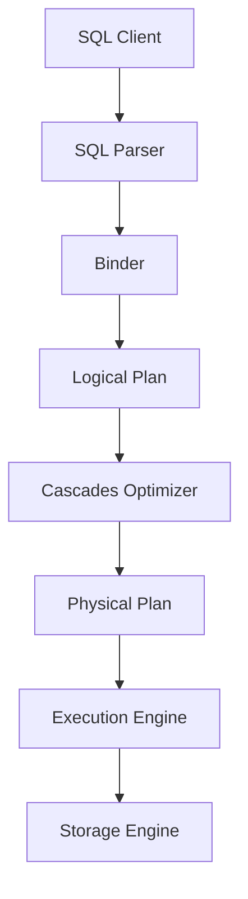
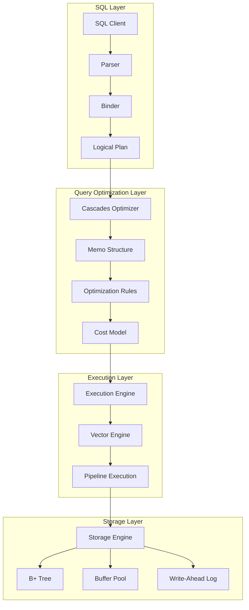
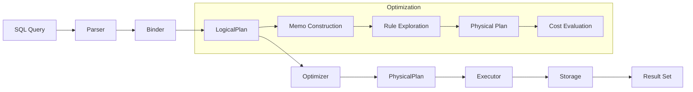
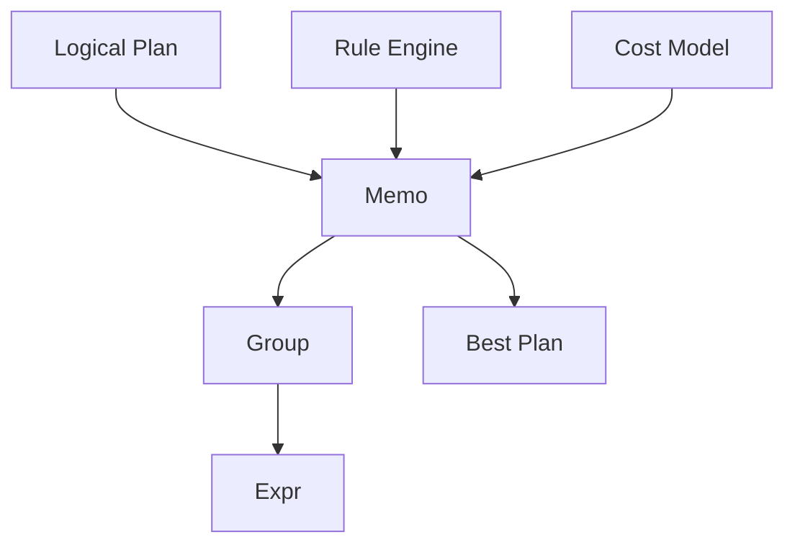
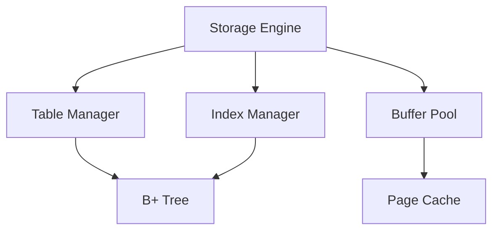
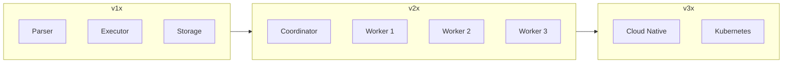

# SQLRustGo Architecture

> **版本**: 1.0
> **更新日期**: 2026-03-07
> **维护人**: yinglichina8848

---

## 核心目标

- 高性能 SQL 执行
- Cascades Query Optimizer
- 向量化执行引擎
- 分布式扩展能力
- AI Native Software Engineering

---

# 1. 系统总体架构



---

# 2. 分层架构

SQLRustGo 分为五个核心层：

| 层级 | 描述 |
|------|------|
| **SQL Layer** | SQL 解析与绑定 |
| **Query Optimization Layer** | Cascades 优化器 |
| **Execution Layer** | 向量化执行引擎 |
| **Storage Layer** | 存储引擎 |
| **Distributed Layer** | 分布式执行 (2.0) |

---

# 3. 详细模块架构



---

# 4. 查询执行流程



---

# 5. 核心设计原则

## 5.1 模块化

- 每个组件独立 crate
- 清晰的依赖关系
- 最小化公开 API

## 5.2 可扩展

- 优化器规则可插件化
- 执行算子可扩展
- 存储引擎可替换

## 5.3 高性能

- 向量化执行 (Vectorized Execution)
- Pipeline 流水线执行
- 无锁数据结构

## 5.4 分布式 (2.0)

- MPP 架构
- 分布式查询规划
- Shuffle 机制
- 故障容错

---

# 6. 核心模块

## 6.1 Parser (SQL 解析器)

```
┌─────────────┐
│    SQL      │
└──────┬──────┘
       │
       ▼
┌─────────────┐    ┌─────────────┐
│   Lexer     │───►│    AST      │
│  (词法)     │    │  (语法树)   │
└─────────────┘    └─────────────┘
```

## 6.2 Optimizer (Cascades 优化器)



## 6.3 Executor (执行引擎)


## 6.4 Storage (存储引擎)



---

# 7. 版本演进



| 版本 | 特性 |
|------|------|
| **1.x** | SQL 执行原型、Cascades 优化器、向量化执行 |
| **2.0** | 分布式 MPP、Shuffle Exchange、故障容错 |
| **3.0** | 云原生、Kubernetes 集成、弹性伸缩 |

---

# 8. 技术栈

| 组件 | 技术 |
|------|------|
| **语言** | Rust |
| **解析** | nom |
| **优化器** | Cascades Framework |
| **执行** | Vectorized / Pipeline |
| **存储** | B+ Tree / Buffer Pool |
| **网络** | Tokio / Tower |
| **测试** | Cargo Test / Criterion |

---

# 9. 相关文档

| 文档 | 说明 |
|------|------|
| [CASCADES_OPTIMIZER.md](./CASCADES_OPTIMIZER.md) | Cascades 优化器设计 |
| [DISTRIBUTED_EXECUTION.md](./DISTRIBUTED_EXECUTION.md) | 分布式执行架构 |
| [DIRECTORY_STRUCTURE.md](./DIRECTORY_STRUCTURE.md) | 目录结构规范 |
| [BRANCH_GOVERNANCE.md](../governance/BRANCH_GOVERNANCE.md) | 分支治理规范 |

---

# 10. 变更历史

| 版本 | 日期 | 说明 |
|------|------|------|
| 1.0 | 2026-03-07 | 初始版本 |

---

*本文档由 yinglichina8848 维护*
