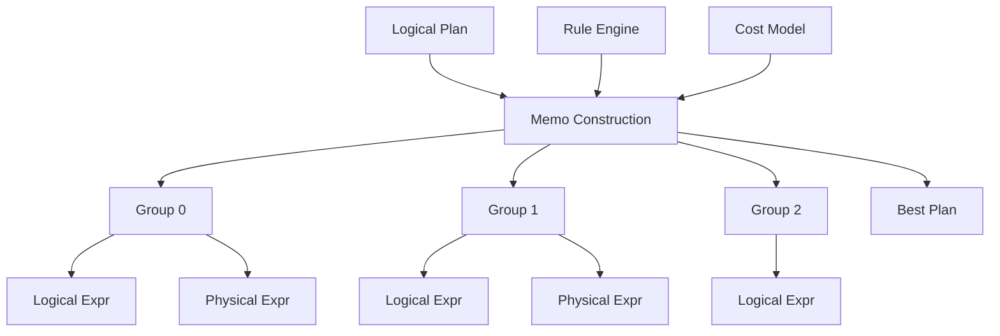
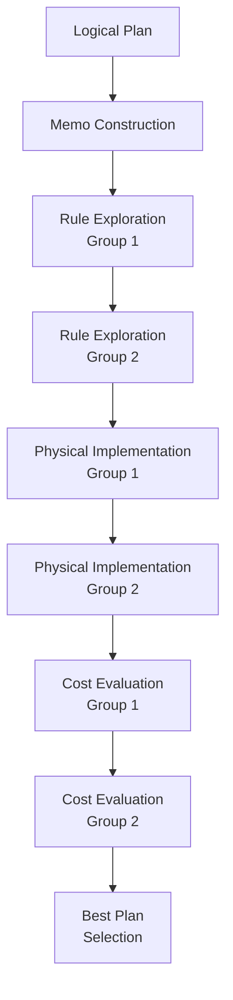

# Cascades Optimizer Design

> **版本**: 1.0
> **更新日期**: 2026-03-07
> **维护人**: yinglichina8848

---

## 概述

SQLRustGo 使用 **Cascades Query Optimizer**。

Cascades 是现代数据库优化器的主流架构。

典型实现：

- SQL Server
- Greenplum
- CockroachDB
- Oracle

---

# 1. Cascades 架构



---

# 2. Memo 结构

Memo 是优化器核心数据结构。

```mermaid
graph TD

Memo[Memo] --> Group1[Group 0<br/>Scan]
Memo --> Group2[Group 1<br/>Join]
Memo --> Group3[Group 2<br/>Aggregate]

Group1 --> LogExpr1[LogicalExpr<br/>Scan(A)]
Group1 --> PhysExpr1[PhysicalExpr<br/>TableScan]

Group2 --> LogExpr2[LogicalExpr<br/>Join]
Group2 --> PhysExpr2[PhysicalExpr<br/>HashJoin]
Group2 --> PhysExpr3[PhysicalExpr<br/>NestedLoopJoin]

Group3 --> LogExpr3[LogicalExpr<br/>Aggregate]
Group3 --> PhysExpr4[PhysicalExpr<br/>HashAggregate]
```

---

# 3. Rule 系统

优化器使用 规则驱动优化。

## 3.1 Rule 类型

| 类型 | 描述 | 示例 |
|------|------|------|
| **Logical Rewrite** | 逻辑表达式变换 | Filter Pushdown |
| **Physical Implementation** | 物理实现选择 | Join 算法选择 |
| **Exploration** | 等价探索 | Join Commutativity |

## 3.2 规则示例

### Join Commutativity

```
A ⋈ B  →  B ⋈ A
```

### Filter Pushdown

```
σ(A.x > 10)(A ⋈ B) → σ(A.x > 10)(A) ⋈ B
```

---

# 4. 优化流程



---

# 5. 成本模型

成本函数：

```
Cost = CPU × CPU_Cost + IO × IO_Cost + Network × Network_Cost
```

## 5.1 Join 算法成本

### Hash Join Cost

```
Cost = build_cost + probe_cost
     = |inner| + |outer| × match_ratio
```

### Nested Loop Join Cost

```
Cost = |outer| + |outer| × |inner|
```

### Sort Merge Join Cost

```
Cost = sort_outer + sort_inner + merge
```

## 5.2 Scan 算法成本

| 算法 | 成本公式 |
|------|----------|
| **Table Scan** | rows × row_size |
| **Index Scan** | index_cost + lookup_cost |
| **Index Only Scan** | index_cost |

---

# 6. Rust 结构设计

## 6.1 核心结构

```rust
pub struct Memo {
    pub groups: Vec<Group>,
}

pub struct Group {
    pub group_id: GroupId,
    pub logical_expressions: Vec<ExprId>,
    pub physical_expressions: Vec<ExprId>,
    pub best_cost: Cost,
    pub best_expr: Option<ExprId>,
}

pub struct Expr {
    pub expr_id: ExprId,
    pub operator: Operator,
    pub children: Vec<GroupId>,
}
```

## 6.2 Operator 枚举

```rust
pub enum Operator {
    // Logical Operators
    Scan { table: String },
    Filter { predicate: Expr },
    Project { exprs: Vec<Expr> },
    Join { condition: Expr, join_type: JoinType },
    Aggregate { group_by: Vec<Column>, agg: Vec<Expr> },
    Sort { order_by: Vec<OrderExpr> },
    Limit { count: usize },

    // Physical Operators
    TableScan { table: String },
    IndexScan { index: String },
    HashJoin { left_keys: Vec<Column>, right_keys: Vec<Column> },
    NestedLoopJoin,
    SortMergeJoin,
    HashAggregate,
    SortAggregate,
}
```

## 6.3 Rule Trait

```rust
pub trait Rule: Send {
    fn rule_id(&self) -> RuleId;
    
    fn match_rule(&self, expr: &Expr) -> bool;
    
    fn apply(&self, expr: &Expr, memo: &mut Memo) -> Vec<ExprId>;
}
```

---

# 7. Cascades Optimizer Pipeline


---

# 8. 优化规则实现

## 8.1 Filter Pushdown

```rust
pub struct FilterPushdownRule;

impl Rule for FilterPushdownRule {
    fn match_rule(&self, expr: &Expr) -> bool {
        matches!(expr.operator, Operator::Filter { .. })
    }

    fn apply(&self, expr: &Expr, memo: &mut Memo) -> Vec<ExprId> {
        // Push filter below join
        // σ(A.x > 10)(A ⋈ B) → σ(A.x > 10)(A) ⋈ B
    }
}
```

## 8.2 Join Reorder

```rust
pub struct JoinReorderRule;

impl Rule for JoinReorderRule {
    fn apply(&self, expr: &Expr, memo: &mut Memo) -> Vec<ExprId> {
        // Reorder join ordering
        // A ⋈ B ⋈ C → (A ⋈ B) ⋈ C
    }
}
```

## 8.3 Index Selection

```rust
pub struct IndexSelectionRule;

impl Rule for IndexSelectionRule {
    fn apply(&self, expr: &Expr, memo: &mut Memo) -> Vec<ExprId> {
        // Select index scan when available
        // Scan(A) → IndexScan(A.idx)
    }
}
```

---

# 9. 统计信息

```rust
pub struct TableStats {
    pub row_count: usize,
    pub total_bytes: usize,
    pub column_stats: HashMap<String, ColumnStats>,
}

pub struct ColumnStats {
    pub ndv: usize,           // Number of Distinct Values
    pub null_count: usize,
    pub min_value: Option<ScalarValue>,
    pub max_value: Option<ScalarValue>,
    pub histogram: Histogram,
}

pub struct Histogram {
    pub buckets: Vec<HistogramBucket>,
}

pub struct HistogramBucket {
    pub lower_bound: ScalarValue,
    pub upper_bound: ScalarValue,
    pub count: usize,
}
```

---

# 10. 代价模型接口

```rust
pub trait CostModel: Send {
    fn compute_cost(&self, expr: &Expr, context: &CostContext) -> Cost;
}

pub struct Cost {
    pub cpu_cost: f64,
    pub io_cost: f64,
    pub memory_cost: f64,
}

impl Cost {
    pub fn add(&self, other: &Cost) -> Cost {
        Cost {
            cpu_cost: self.cpu_cost + other.cpu_cost,
            io_cost: self.io_cost + other.io_cost,
            memory_cost: self.memory_cost + other.memory_cost,
        }
    }
}
```

---

# 11. 相关文档

| 文档 | 说明 |
|------|------|
| [ARCHITECTURE_OVERVIEW.md](./ARCHITECTURE_OVERVIEW.md) | 架构总览 |
| [DISTRIBUTED_EXECUTION.md](./DISTRIBUTED_EXECUTION.md) | 分布式执行 |
| [DIRECTORY_STRUCTURE.md](./DIRECTORY_STRUCTURE.md) | 目录结构 |

---

# 12. 变更历史

| 版本 | 日期 | 说明 |
|------|------|------|
| 1.0 | 2026-03-07 | 初始版本 |

---

*本文档由 yinglichina8848 维护*
