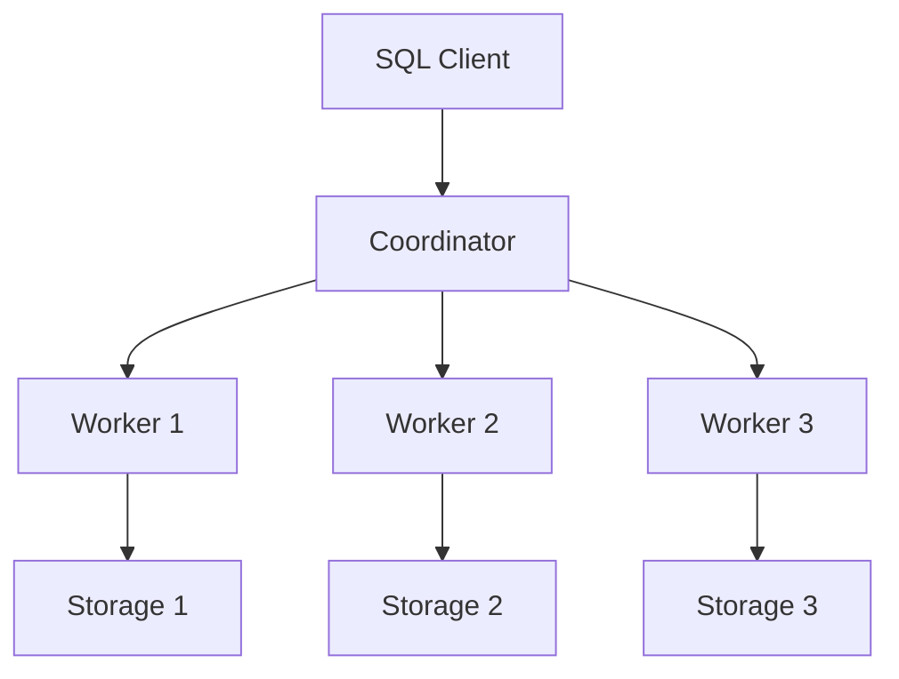
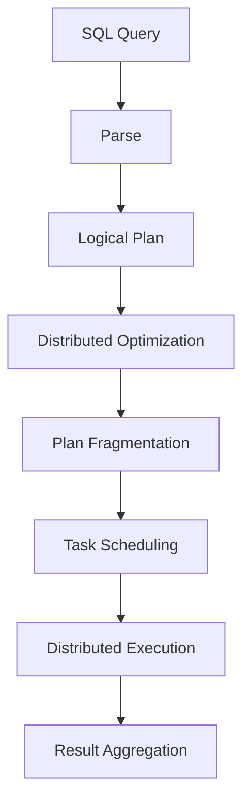
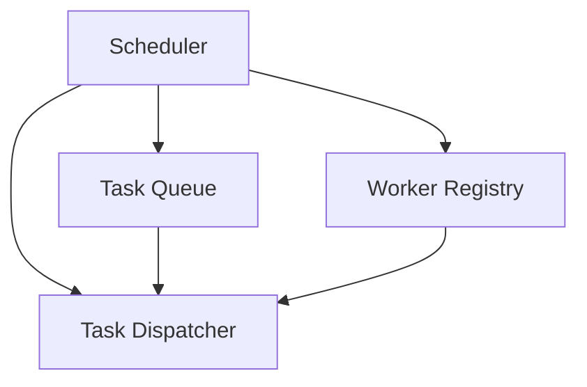
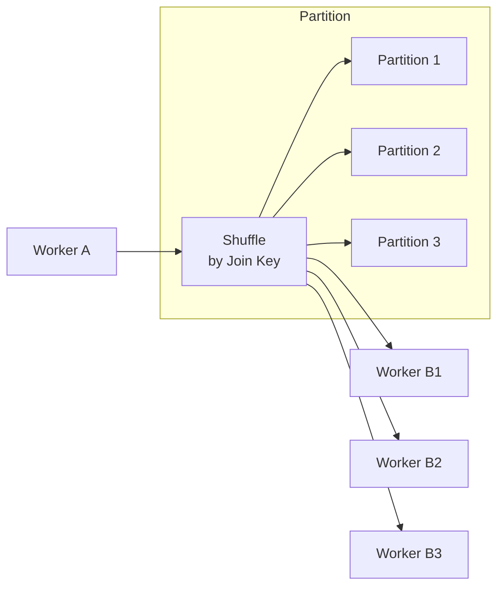
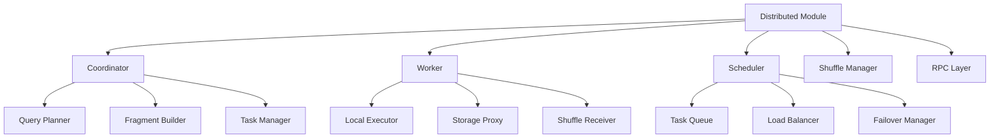
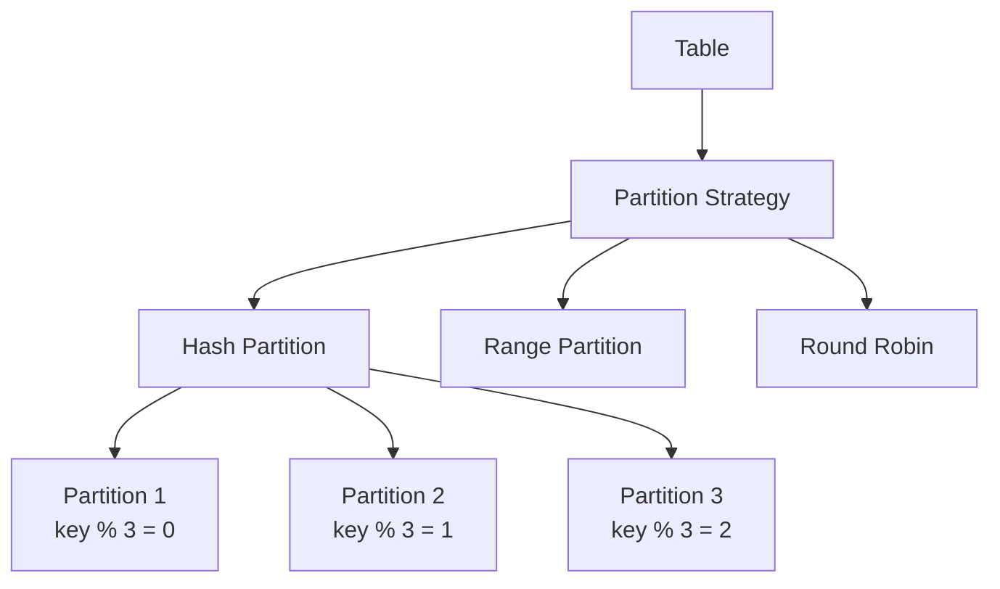
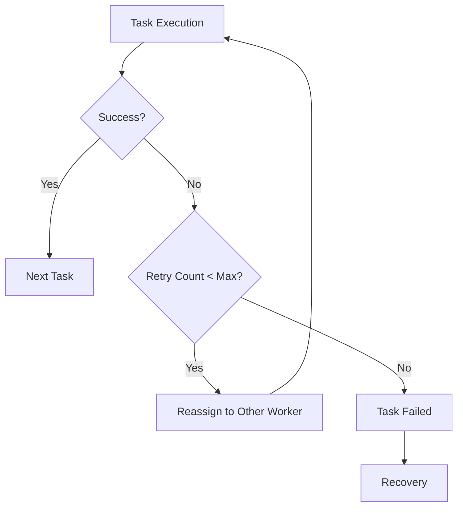
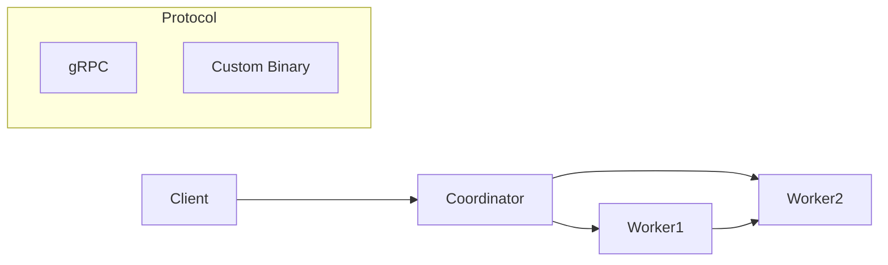
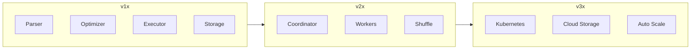

# SQLRustGo 2.0 分布式执行

> **版本**: 1.0
> **更新日期**: 2026-03-07
> **维护人**: yinglichina8848

---

## 概述

SQLRustGo 2.0 将支持 **分布式查询执行**。

目标：

- MPP 架构（大规模并行处理）
- 分布式 SQL
- 弹性扩展
- 故障容错

---

# 1. 分布式系统架构



---

# 2. 查询执行流程



---

# 3. 分布式算子

SQLRustGo 2.0 引入新的物理算子：

## 3.1 数据移动算子

| 算子 | 描述 |
|------|------|
|**随机交换**| 数据重分布 |
|**广播交换**| 数据广播 |
|**收集兑换**| 数据收集 |

## 3.2 分布式访问算子

| 算子 | 描述 |
|------|------|
|**分布式扫描**| 分布式扫描 |
|**分区扫描**| 分区扫描 |
|**远程扫描**| 远程节点扫描 |

## 3.3 分布式聚合算子

| 算子 | 描述 |
|------|------|
|**分布式聚合**| 分布式聚合 |
|**哈希聚合**| 哈希聚合 |
|**排序聚合**| 排序聚合 |

---

# 4. 任务调度程序

调度器负责：

- Task 分发
- 节点负载均衡
- 失败重试
- 资源管理



---

# 5. Shuffle 机制

用于 Join / Aggregate 操作。



---

# 6. Rust 模块设计



---

# 7. 核心结构设计

## 7.1 协调员

```rust
pub struct Coordinator {
    query_manager: QueryManager,
    planner: DistributedPlanner,
    scheduler: TaskScheduler,
    worker_registry: WorkerRegistry,
}

impl Coordinator {
    pub fn execute(&self, sql: &str) -> Result<DistributedResult> {
        // 1. Parse SQL
        let logical_plan = self.parse(sql)?;
        
        // 2. Optimize
        let optimized = self.optimize(logical_plan)?;
        
        // 3. Fragment
        let fragments = self.fragment(optimized)?;
        
        // 4. Schedule
        let tasks = self.schedule(fragments)?;
        
        // 5. Execute
        self.execute_distributed(tasks)
    }
}
```

## 7.2 工人

```rust
pub struct Worker {
    worker_id: WorkerId,
    local_executor: LocalExecutor,
    shuffle_manager: ShuffleManager,
    storage_proxy: StorageProxy,
}

impl Worker {
    pub fn execute_task(&self, task: &Task) -> Result<TaskResult> {
        // 1. Receive task
        // 2. Execute locally
        // 3. Handle shuffle
        // 4. Return result
    }
}
```

## 7.3 Task

```rust
pub struct Task {
    pub task_id: TaskId,
    pub fragment_id: FragmentId,
    pub plan: PhysicalPlan,
    pub partitions: Vec<PartitionInfo>,
    pub shuffle_edges: Vec<ShuffleEdge>,
}
```

---

# 8. 数据分区策略



| 策略 | 适用场景 |
|------|----------|
| **Hash** |加入、聚合|
| **Range** |范围查询、时间序列|
|**循环赛**|负载均衡|

---

# 9. 故障容错



---

# 10. 网络通信

## 10.1 RPC 架构



## 10.2 消息类型

| 消息 | 方向 | 描述 |
|------|------|------|
|提交查询|客户→协调员| 提交查询 |
|创建任务|协调员 → 工人| 创建任务 |
|任务结果|工人 → 协调员| 任务结果 |
|随机数据|工人 → 工人|Shuffle 数据|

---

# 11. SQLRustGo 发展路线



| 版本 | 特性 |
|------|------|
| **1.x** | 单机 SQL 执行引擎、Cascades 优化器、向量化执行 |
| **2.0** |分布式 MPP、Shuffle Exchange、故障容错|
| **3.0** | 云原生、Kubernetes 集成、弹性伸缩 |

---

# 12. 相关文档

| 文档 | 说明 |
|------|------|
| [ARCHITECTURE_OVERVIEW.md](./ARCHITECTURE_OVERVIEW.md) | 架构总览 |
| [CASCADES_OPTIMIZER.md](./CASCADES_OPTIMIZER.md) |Cascades 优化器|
| [DIRECTORY_STRUCTURE.md](./DIRECTORY_STRUCTURE.md) | 目录结构 |

---

# 13. 变更历史

| 版本 | 日期 | 说明 |
|------|------|------|
| 1.0 | 2026-03-07 | 初始版本 |

---

*本文档由 yinglichina8848 维护*
