# OpenClaw 企业级 AI 业务系统设计文档

> **版本**: 1.0
> **创建日期**: 2026-03-29
> **框架**: OpenClaw
> **核心模型**: Qwen3-14B

---

## 1. OpenClaw 定位与能力评估

### 1.1 OpenClaw 本质定位

OpenClaw 属于 **Agent Runtime / Tool-Orchestrator 层框架**，而非搜索引擎、爬虫系统或知识库系统。

| 框架 | 类型 |
|------|------|
| OpenClaw | 轻量 Agent 调度框架 |
| LangChain | Agent orchestration |
| AutoGen | Multi-agent framework |
| CrewAI | Workflow-agent orchestration |

**OpenClaw 的核心职责**：
- 让模型调用工具
- 调用模型
- 调用流程
- 任务编排与调度

### 1.2 工具调用能力评估

```
User
   ↓
Planner
   ↓
Tool Router
   ↓
Executor
   ↓
Memory
```

| 能力等级 | 评分 | 说明 |
|----------|------|------|
| 函数调用 | ⭐⭐⭐⭐☆ | 标准 Agent Tool Use Pipeline |
| 工具路由 | ⭐⭐⭐⭐☆ | 支持 search/python/db_query/browser |
| 执行反馈 | ⭐⭐⭐⭐☆ | 完整的 execute → result → reflect 循环 |

### 1.3 多任务 Agent 能力

**任务拆解示例**：

```
输入：分析 AI 芯片市场
自动拆解：
  ├── search market data
  ├── extract numbers
  ├── summarize vendors
  ├── generate chart code
  └── write report
```

| 能力 | 评分 | 说明 |
|------|------|------|
| 任务拆解 | ⭐⭐⭐⭐ | Plan → Execute → Reflect |
| DAG 任务流 | ⭐⭐⭐⭐ | 支持多任务并行/串行 |
| Multi-agent 协作 | ⭐⭐⭐ | 基础协作能力 |

### 1.4 网络搜索解析能力

**重要说明**：OpenClaw 本身不提供搜索能力，它是 **Search Tool Adapter**。

| 组件 | 质量决定因素 |
|------|-------------|
| Serper API | Google 质量搜索 |
| Tavily | Agent 优化搜索 |
| Bing API | 官方搜索 |
| Firecrawl | 网页结构解析 |
| Browser tool | 动态页面解析 |

### 1.5 网页解析能力层级

| 能力 | OpenClaw 支持 |
|------|--------------|
| HTML 解析 | ✅ |
| 正文提取 | ✅ |
| 结构识别 | ✅ |
| 表格解析 | ✅ |
| 跨页面推理 | ⚠️ 依赖模型 |
| 知识融合 | ⚠️ 依赖模型 |

**关键指标**：LLM能力 × Parser质量

### 1.6 编程驱动能力

OpenClaw 最大优势之一：**Code-first Agent architecture**

| 能力 | 评分 |
|------|------|
| Python 工具执行 | ⭐⭐⭐⭐⭐ |
| 数据分析 | ⭐⭐⭐⭐⭐ |
| 图表生成 | ⭐⭐⭐⭐⭐ |
| SQL 查询 | ⭐⭐⭐⭐⭐ |
| 文件处理/ETL | ⭐⭐⭐⭐⭐ |

### 1.7 Memory 系统能力

| 记忆类型 | 支持情况 |
|----------|----------|
| Short-term memory | ✅ conversation context, task history |
| Long-term memory | ⚠️ 需外挂 (Vector DB/Redis/Postgres/Milvus) |

**能力等级**：⭐⭐⭐⭐

---

## 2. Qwen3-14B 作为核心驱动模型

### 2.1 模型能力评估

| 指标 | Qwen3-14B | 评分 |
|------|-----------|------|
| 任务规划能力 | 强 | ⭐⭐⭐⭐ |
| 工具调用能力 | 强 | ⭐⭐⭐⭐ |
| 代码生成能力 | 强 | ⭐⭐⭐⭐ |
| 网页解析理解 | 中 | ⭐⭐⭐ |
| 长上下文能力 | 强 | ⭐⭐⭐⭐ |

### 2.2 显存与性能

| 配置项 | 参数 |
|--------|------|
| 推荐量化 | Q4_K_M |
| 上下文长度 | 32K |
| 推理速度 | 60-120 tokens/s |
| 显存需求 | ~16GB |

### 2.3 适用场景

| 场景 | 适合度 |
|------|--------|
| 企业 AI 员工 | ✅ |
| 自动报告系统 | ✅ |
| 数据分析 Agent | ✅ |
| 搜索解析 Agent | ✅ |
| 编程 Agent | ✅ |

| 场景 | 适合度 |
|------|--------|
| 超复杂 multi-agent 推理链 | ❌ |
| 科研级 AutoGPT++ | ❌ |

### 2.4 模型对比选择

| 模型 | 推荐度 | 原因 |
|------|--------|------|
| Qwen3-7B | ❌ | 太弱 |
| **Qwen3-14B** | ✅ | 最佳性价比 |
| Qwen3-32B | ⚠️ | 显存压力大 |
| DeepSeek-67B | ⚠️ | 推理慢 |
| Llama-70B | ❌ | 不现实 |

**结论**：Qwen3-14B = 本地 Agent 黄金模型

---

## 3. 推荐系统架构

### 3.1 整体架构图

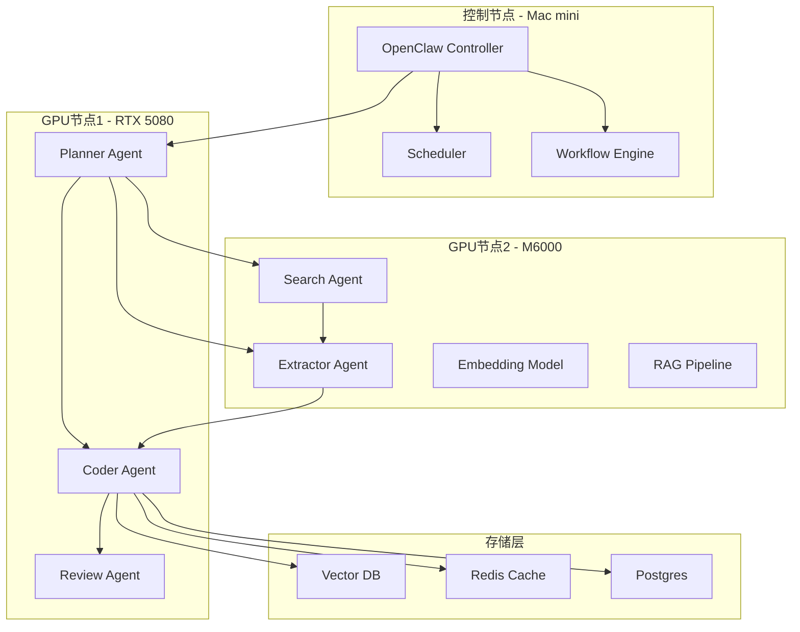

### 3.2 Agent 分层架构

#### Layer 1: Planner（核心）

| 项目 | 内容 |
|------|------|
| 模型 | Qwen3-14B |
| 职责 | 任务拆解、工具选择、流程规划、Agent调度 |

```
输入：分析全球药品市场
Planner输出：
  ├── search market data
  ├── extract tables
  ├── summarize regions
  ├── generate chart
  └── write report
```

#### Layer 2: Search Agent

| 组件 | 推荐 |
|------|------|
| 搜索 API | Serper API / Tavily |
| 网页抓取 | Firecrawl |
| 动态页面 | Browserless |

#### Layer 3: Extractor Agent

| 工具 | 用途 |
|------|------|
| trafilatura | 正文提取 |
| readability | 页面清洗 |
| unstructured.io | 结构化解析 |

#### Layer 4: Coder Agent

| 能力 | 说明 |
|------|------|
| Python execution | 数据分析、图表生成 |
| SQL execution | 数据库查询 |
| ETL 流程 | 数据清洗转换 |

#### Layer 5: Memory Agent

| 记忆类型 | 存储 | 用途 |
|----------|------|------|
| 短期记忆 | Redis | 当前任务上下文 |
| 长期记忆 | Postgres | 企业知识 |
| 向量记忆 | Milvus | 文档搜索 |

### 3.3 完整数据流

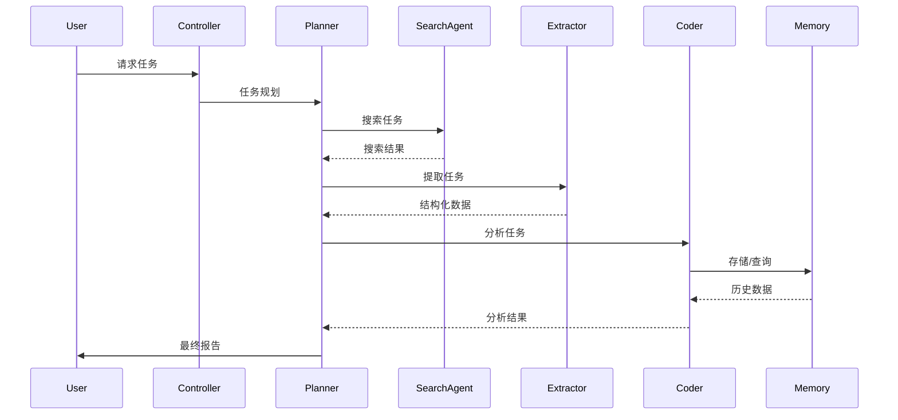

---

## 4. 部署拓扑

### 4.1 节点分配

| 节点 | 硬件 | 运行服务 |
|------|------|----------|
| 控制节点 | Mac mini | OpenClaw orchestrator, scheduler, workflow engine |
| GPU 节点 1 | RTX 5080 (16GB) | Qwen3-14B 主模型, planner/coder/review agent |
| GPU 节点 2 | M6000 (24GB) | Embedding模型, reranker, search parser, RAG pipeline |
| 存储节点 | 大内存服务器 (416GB RAM) | Vector DB, Redis, Postgres |

### 4.2 推荐模型组合

| 角色 | 模型 | 量化 | 显存 |
|------|------|------|------|
| Planner | Qwen3-14B | Q4_K_M | ~16GB |
| Embedding | bge-large-zh-v1.5 | FP16 | ~3GB |
| Reranker | bce-reranker-base | FP16 | ~1GB |
| Parser 辅助 | Qwen2.5-7B | Q4_K_M | ~8GB |

### 4.3 网络拓扑

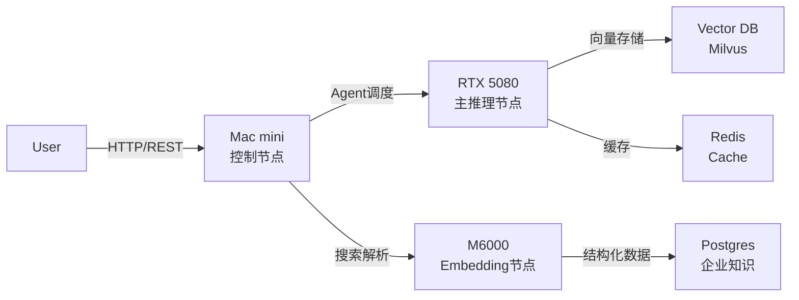

---

## 5. 性能预期

### 5.1 真实工程指标

| 能力 | 预期结果 |
|------|----------|
| 并发 Agent | 3-6 个 |
| 上下文长度 | 32K |
| 文档处理 | 300 页级 |
| 搜索解析 | 秒级 |
| 报告生成 | 5-20 秒 |

### 5.2 达到标准

| 指标 | 状态 |
|------|------|
| 企业 AI 员工系统生产级门槛 | ✅ 已达到 |
| 私有化部署要求 | ✅ 已满足 |
| 实时交互级别 | ✅ 已达到 |

### 5.3 升级时机

当出现以下场景时，建议升级模型：

| 场景 | 升级需求 |
|------|----------|
| 复杂科研推理 | 升级到 Qwen3-32B 或更大 |
| 多 Agent 长链协作 | 升级到 GPT-5 / Claude |
| 自动软件开发 | 升级到 GPT-5 / Claude |
| 跨文档知识融合 | 升级到 GPT-5 / Claude |

---

## 6. 企业级 Agent 系统架构

### 6.1 完整架构图

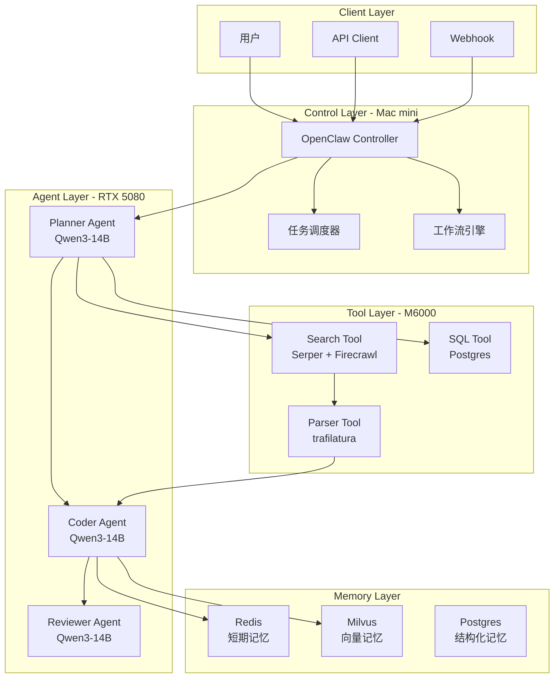

### 6.2 典型业务流程

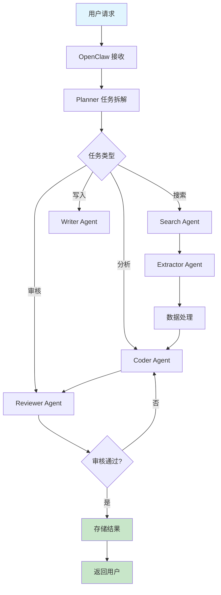

---

## 7. 安全与权限设计

### 7.1 权限矩阵

| 角色 | 搜索 | 解析 | 编程 | 写入 | 审核 |
|------|------|------|------|------|------|
| Planner | ✅ | ✅ | ✅ | ✅ | ❌ |
| Search Agent | ✅ | ✅ | ❌ | ❌ | ❌ |
| Extractor | ❌ | ✅ | ❌ | ❌ | ❌ |
| Coder | ❌ | ❌ | ✅ | ✅ | ❌ |
| Reviewer | ❌ | ❌ | ✅ | ✅ | ✅ |

### 7.2 审计日志

| 日志类型 | 存储 | 保留时间 |
|----------|------|----------|
| 任务执行日志 | Postgres | 90 天 |
| API 调用日志 | Redis | 30 天 |
| 搜索记录 | Postgres | 180 天 |
| 敏感操作审计 | Postgres | 永久 |

---

## 8. 监控与可观测性

### 8.1 关键指标

| 指标 | 告警阈值 | 监控方式 |
|------|----------|----------|
| Agent 响应时间 | >30s | Prometheus |
| 任务失败率 | >5% | AlertManager |
| GPU 利用率 | <40% | DCGM |
| 内存使用率 | >85% | node_exporter |
| API QPS | 动态 | API Gateway |

### 8.2 监控架构

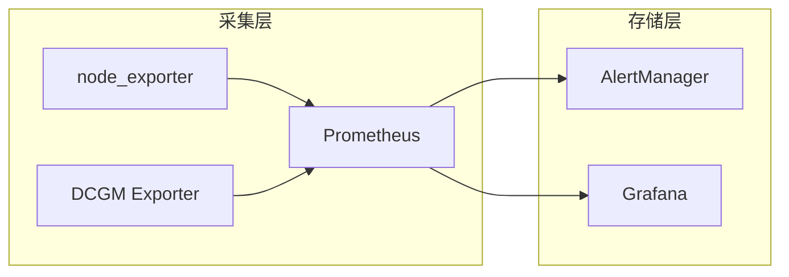

---

## 9. 总结

### 9.1 架构优势

| 优势 | 说明 |
|------|------|
| 轻量高效 | OpenClaw 调度开销低 |
| 本地私有化 | 全部模型可本地运行 |
| 弹性扩展 | 支持多节点部署 |
| 成本可控 | 使用开源模型，无 API 费用 |
| 国产化支持 | 适配国产硬件和模型 |

### 9.2 适用场景

| 场景 | 推荐度 |
|------|--------|
| 企业内部 AI 员工 | ✅ 强烈推荐 |
| 药品企业私有化 AI 系统 | ✅ 强烈推荐 |
| 数据分析自动化 | ✅ 强烈推荐 |
| 报告自动生成 | ✅ 强烈推荐 |
| 科研级复杂推理 | ⚠️ 需要升级模型 |

### 9.3 下一步行动计划

| 阶段 | 任务 | 状态 |
|------|------|------|
| Phase 1 | 单节点部署测试 | 待开始 |
| Phase 2 | 多节点联调 | 待开始 |
| Phase 3 | 性能压测 | 待开始 |
| Phase 4 | 业务流程定制 | 待开始 |
| Phase 5 | 生产环境部署 | 待开始 |

---

## 10. 参考资料

- [OpenClaw 官方文档](https://github.com/openclaw/openclaw)
- [Qwen3 模型文档](https://github.com/QwenLM/Qwen3)
- [LangChain Agent 最佳实践](https://python.langchain.com/docs/concepts/agents)
- [企业级 RAG 架构设计](../architecture/RAG_ARCHITECTURE.md)

---

## 11. 药品生产企业 AI 员工系统

### 11.1 大模型现状与问题分析

#### 11.1.1 大模型的局限性

| 问题 | 原因 |
|------|------|
| 缺乏行业流程常识 | 训练数据不是流程结构化知识 |
| 缺乏组织级知识 | 企业私有数据未训练 |
| 缺乏长期记忆 | 上下文窗口有限 |
| 缺乏可执行能力 | 需要 Agent orchestration |
| 缺乏可靠性 | 无规则约束 |

**结论**：参数规模不是解决方案，真正方案是：

```
模型 = 推理引擎
知识系统 = 记忆系统
Agent = 执行系统
```

#### 11.1.2 为什么必须是"组合系统"

| 知识类型 | 最佳存储方式 |
|----------|-------------|
| 结构化业务数据 | SQL 数据库 |
| 文档 | 向量数据库 |
| 实体关系 | 图数据库 |
| 行业规则 | 知识图谱 |
| 流程 | Workflow engine |

---

### 11.2 企业级 AI 员工技术架构

#### 11.2.1 完整技术栈

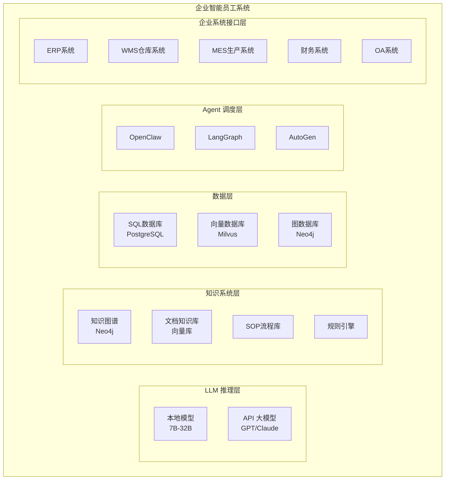

#### 11.2.2 药企场景适配度分析

| 药企特点 | AI 适配度 | 原因 |
|----------|-----------|------|
| SOP 严格 | ⭐⭐⭐⭐⭐ | 流程可建模 |
| 文档极多 | ⭐⭐⭐⭐⭐ | RAG 可处理 |
| 合规要求高 | ⭐⭐⭐⭐⭐ | 规则引擎 |
| 数据结构化 | ⭐⭐⭐⭐⭐ | SQL 友好 |
| 流程标准化 | ⭐⭐⭐⭐⭐ | Agent 可执行 |

**结论**：药企 ≈ AI 最适合落地行业之一

---

### 11.3 药品生产企业 AI 员工能力拆解

#### 11.3.1 进货管理

| AI 能力 | 依赖组件 |
|---------|----------|
| 采购建议生成 | SQL + 向量库 + Agent |
| 供应商比较 | SQL + 知识图谱 |
| 库存预警 | SQL + Agent |
| 订单创建 | SQL + Agent |
| 审批流触发 | Workflow Engine |

#### 11.3.2 仓库管理

| AI 能力 | 依赖组件 |
|---------|----------|
| 库存预测 | SQL + Python Agent |
| 批次管理 | SQL + 图数据库 |
| 有效期提醒 | SQL + 规则引擎 |
| 异常库存检测 | SQL + Agent |
| 盘点报告生成 | SQL + Python Agent |
| GMP 合规记录 | SOP库 + Agent |

#### 11.3.3 生产排班

| AI 能力 | 依赖组件 |
|---------|----------|
| 人员技能匹配 | 知识图谱 |
| 设备可用性检查 | SQL + 知识图谱 |
| 班次规则优化 | 规则引擎 + 调度算法 |
| 生产计划生成 | Constraint Optimization + Agent |
| 交付时间预测 | SQL + ML Model |

#### 11.3.4 药品生产记录（核心价值）

**最耗人工的场景：Batch Record（批生产记录）**

| AI 能力 | 价值 |
|---------|------|
| 生产日志自动生成 | ⭐⭐⭐⭐⭐ |
| 设备记录整理 | ⭐⭐⭐⭐⭐ |
| 温湿度记录整理 | ⭐⭐⭐⭐⭐ |
| 异常说明生成 | ⭐⭐⭐⭐ |
| 偏差报告生成 | ⭐⭐⭐⭐ |
| CAPA 建议 | ⭐⭐⭐⭐ |

**这是行业杀手级应用**

#### 11.3.5 物流发货

| AI 能力 | 依赖组件 |
|---------|----------|
| 发货单自动生成 | SQL + Agent |
| 物流路线优化 | 知识图谱 + SQL |
| 库存同步 | SQL + WMS API |
| 客户通知 | Agent + OA |
| 异常预警 | 规则引擎 + Agent |

#### 11.3.6 业务订单跟踪

| AI 能力 | 依赖组件 |
|---------|----------|
| 订单状态跟踪 | SQL + Agent |
| 延迟预测 | SQL + ML Model |
| 风险提醒 | 规则引擎 + Agent |
| 客户沟通邮件生成 | Agent + LLM |
| 报告输出 | Agent + Python |

#### 11.3.7 简单财务报表

| AI 能力 | 依赖组件 |
|---------|----------|
| 损益表生成 | SQL + Python Agent |
| 库存成本表 | SQL + Python Agent |
| 现金流预测 | SQL + Python + ML |
| 采购成本分析 | SQL + Python Agent |
| 毛利分析 | SQL + Python Agent |

---

### 11.4 药品生产企业知识图谱设计

#### 11.4.1 核心实体

| 实体类型 | 示例 |
|----------|------|
| 员工 | 张三、李四 |
| 设备 | 反应釜 #1、灌装机 #2 |
| 原料 | 原料A、原料B |
| 药品 | 产品X、产品Y |
| 供应商 | 供应商A、供应商B |
| 订单 | 订单#001、订单#002 |
| 生产批次 | Batch#20260301 |
| 仓库 | 原料仓库、成品仓库 |
| 客户 | 客户A、客户B |

#### 11.4.2 核心关系

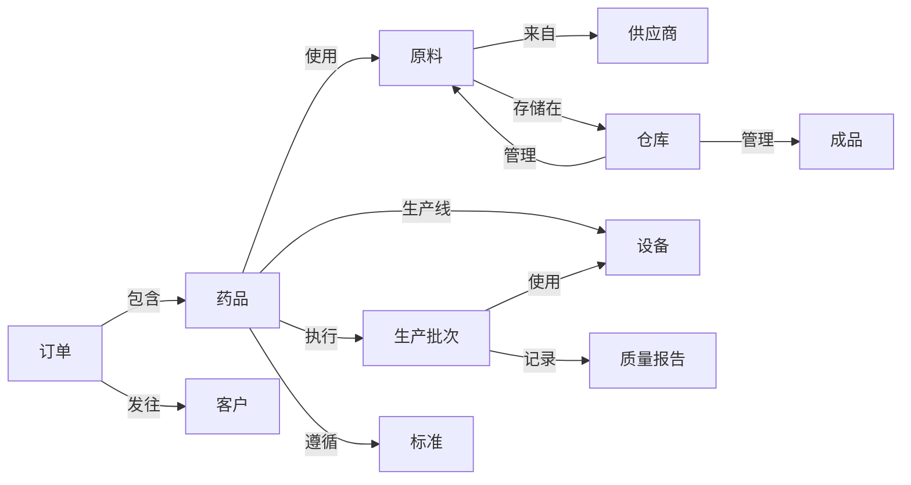

#### 11.4.3 知识图谱 Schema

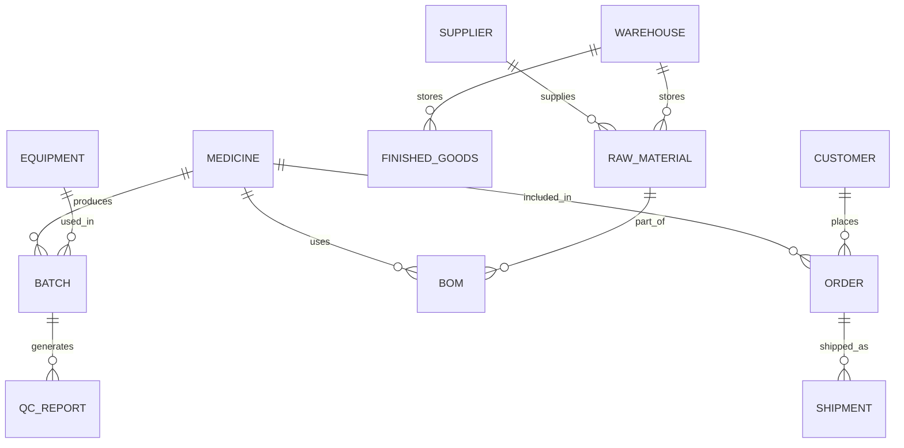

---

### 11.5 数据库结构设计

#### 11.5.1 SQL 数据库结构

| 表名 | 用途 |
|------|------|
| medicines | 药品信息 |
| raw_materials | 原料信息 |
| suppliers | 供应商信息 |
| customers | 客户信息 |
| orders | 订单信息 |
| order_items | 订单明细 |
| batches | 生产批次 |
| batch_records | 批生产记录 |
| inventory | 库存信息 |
| equipment | 设备信息 |
| employees | 员工信息 |
| shipments | 发货记录 |
| invoices | 发票记录 |

#### 11.5.2 向量数据库设计

| Collection | 用途 |
|------------|------|
| sop_documents | SOP 文档向量 |
| quality_standards | 质量标准文档 |
| operation_manuals | 操作手册 |
| gmp_documents | GMP 规范文档 |
| training_materials | 培训材料 |
| product_specs | 产品规格书 |

#### 11.5.3 图数据库设计

| 节点类型 | 关系类型 |
|----------|----------|
| 药品 - 原料 | uses |
| 药品 - 生产线 | produced_on |
| 原料 - 供应商 | supplied_by |
| 批次 - 设备 | processed_by |
| 批次 - 操作员 | executed_by |
| 订单 - 客户 | placed_by |

---

### 11.6 Agent 调度结构设计

#### 11.6.1 Agent 角色定义

| Agent | 职责 | 工具 |
|-------|------|------|
| Procurement Agent | 采购管理 | SQL, Email, 知识图谱 |
| Warehouse Agent | 仓库管理 | SQL, WMS API, RFID |
| Production Agent | 生产管理 | SQL, MES API, Schedule |
| QC Agent | 质量管理 | SQL, Document, SOP |
| Logistics Agent | 物流管理 | SQL, WMS API, Carrier API |
| Order Agent | 订单管理 | SQL, ERP API |
| Finance Agent | 财务管理 | SQL, Excel, Report |
| Doc Agent | 文档管理 | RAG, Template, SOP |

#### 11.6.2 多 Agent 协作流程

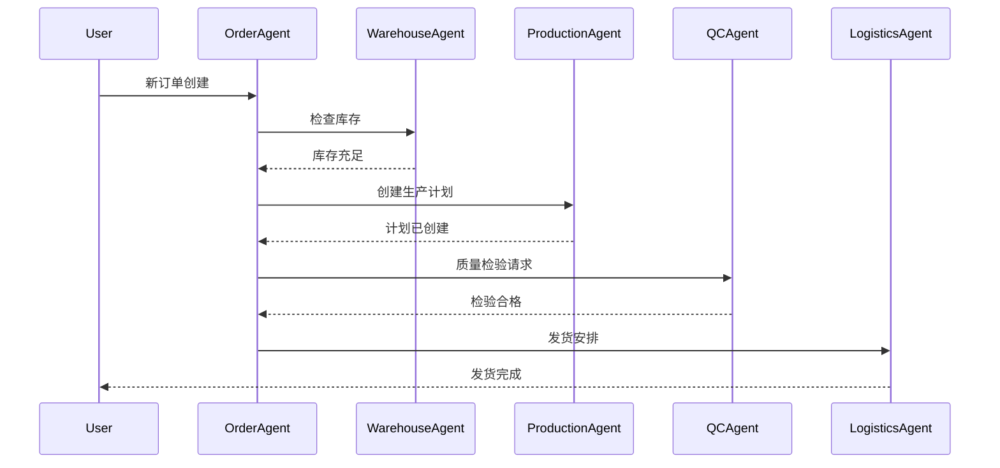

#### 11.6.3 Agent 调度架构

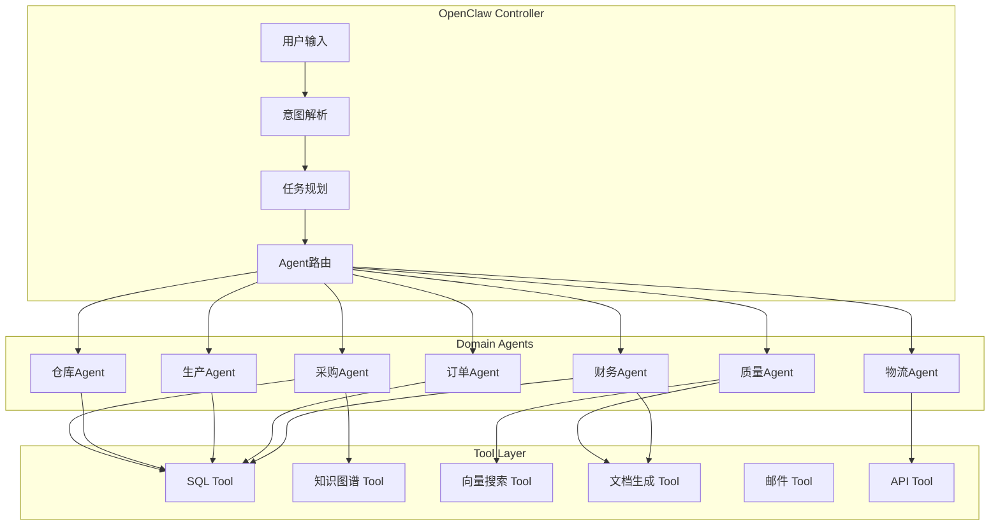

---

### 11.7 企业 AI 员工系统完整架构

#### 11.7.1 分层架构图

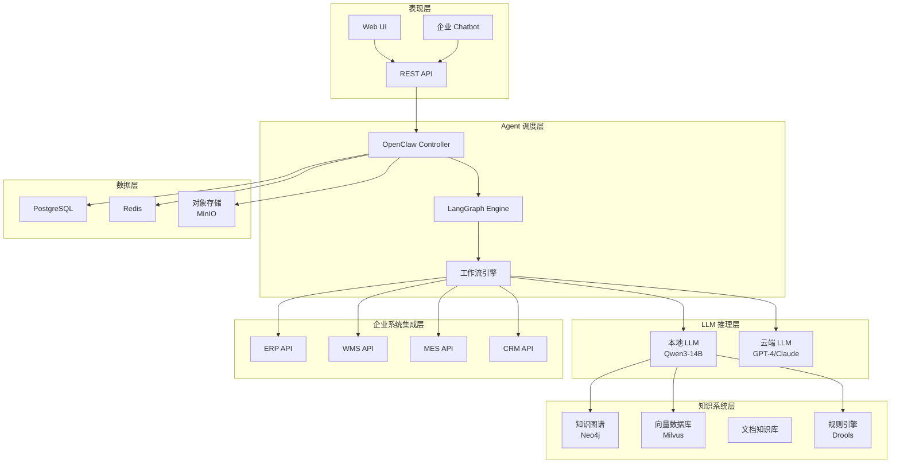

#### 11.7.2 数据流向

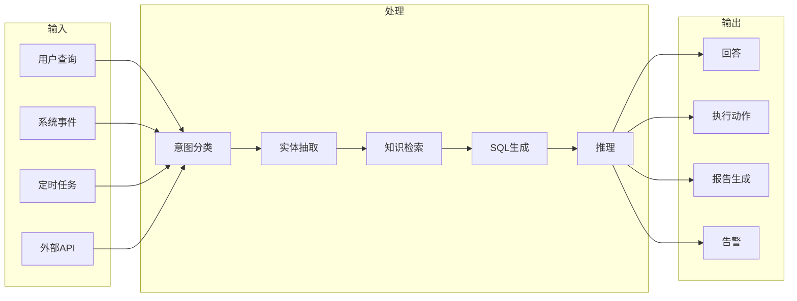

---

### 11.8 最小可运行版本（MVP）路线图

#### 11.8.1 MVP 阶段规划

| 阶段 | 时间 | 功能 | 交付 |
|------|------|------|------|
| MVP v0.1 | 2周 | 订单状态查询 | 可查询订单状态 |
| MVP v0.2 | 2周 | 库存预警 | 库存不足预警 |
| MVP v0.3 | 3周 | 生产记录生成 | 自动生成批生产记录 |
| MVP v0.4 | 2周 | 简单报表生成 | 财务报表自动生成 |
| MVP v1.0 | 4周 | 完整流程集成 | 端到端集成 |

#### 11.8.2 MVP 技术选型

| 组件 | MVP 选择 | 生产升级 |
|------|----------|----------|
| LLM | Qwen3-14B | GPT-4/Claude |
| Agent框架 | OpenClaw | LangGraph |
| SQL数据库 | PostgreSQL | PostgreSQL + PgBouncer |
| 向量数据库 | Milvus | Milvus Cluster |
| 图数据库 | Neo4j | Neo4j Cluster |
| 缓存 | Redis | Redis Cluster |
| 文档存储 | MinIO | S3兼容 |

#### 11.8.3 MVP 数据模型

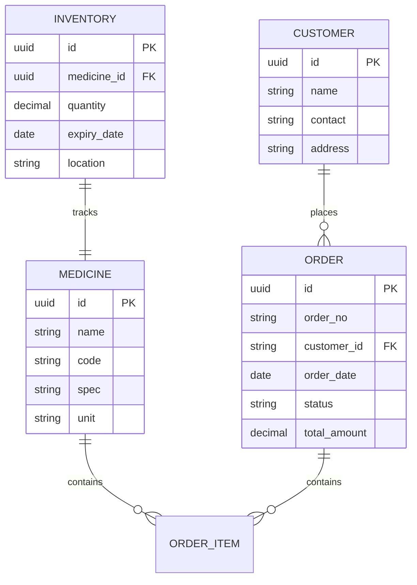

---

### 11.9 关键成功因素

#### 11.9.1 企业流程建模

**最大挑战不是技术，而是：企业流程建模**

| 能力要求 | 说明 |
|----------|------|
| 业务建模能力 | 理解企业业务流程 |
| 软件工程能力 | 系统设计与实现 |
| 数据建模能力 | 数据库与知识图谱设计 |
| 知识工程能力 | 知识抽取与表示 |

#### 11.9.2 知识库建设优先级

| 优先级 | 知识类型 | 建设方式 |
|--------|----------|----------|
| P0 | SOP 文档 | 文档数字化 + 向量化 |
| P0 | 药品工艺规程 | 结构化录入 + 知识图谱 |
| P1 | 质量标准 | 标准文档 + 规则引擎 |
| P1 | 历史批次记录 | 数据迁移 + SQL |
| P2 | 培训材料 | 文档向量化 |
| P2 | 行业法规 | 定期更新 |

---

### 11.10 未来趋势

#### 11.10.1 行业走向

**不是超大模型统治世界，而是：**

```
小模型
+
知识系统
+
Agent系统
+
企业数据
=
领域智能员工
```

#### 11.10.2 发展方向

| 方向 | 说明 |
|------|------|
| 多模态融合 | 图像 + 文本 + 结构化数据 |
| 自主学习 | 从企业数据中持续学习 |
| 跨系统协同 | ERP + WMS + MES 无缝集成 |
| 智能决策 | 从辅助决策到自主决策 |
| 合规自动化 | 实时合规检查与预警 |

---

### 11.11 总结

#### 11.11.1 系统定位

| 定位 | 说明 |
|------|------|
| 系统名称 | Domain AI Employee System（领域智能员工系统） |
| 核心能力 | 领域知识 + 企业数据 + Agent 自动化 |
| 目标用户 | 药品生产企业的日常运营人员 |

#### 11.11.2 核心价值

| 价值点 | 说明 |
|--------|------|
| 效率提升 | 减少 60-80% 的人工文档工作 |
| 合规保证 | 100% SOP 执行记录 |
| 决策支持 | 实时数据分析与预警 |
| 成本降低 | 减少重复性人工劳动 |

#### 11.11.3 成功标准

| 指标 | 目标 |
|------|------|
| 文档自动化率 | >80% |
| 订单处理时间 | <50% |
| 库存准确率 | >99% |
| 合规检查通过率 | 100% |
| 用户满意度 | >90% |

---

## 12. 附录：技术术语表

| 术语 | 全称 | 说明 |
|------|------|------|
| SOP | Standard Operating Procedure | 标准操作规程 |
| GMP | Good Manufacturing Practice | 药品生产质量管理规范 |
| ERP | Enterprise Resource Planning | 企业资源计划 |
| WMS | Warehouse Management System | 仓库管理系统 |
| MES | Manufacturing Execution System | 制造执行系统 |
| QC | Quality Control | 质量控制 |
| QA | Quality Assurance | 质量保证 |
| BOM | Bill of Materials | 物料清单 |
| Batch Record | Batch Production Record | 批生产记录 |
| CAPA | Corrective Action and Preventive Action | 纠正和预防措施 |
| RAG | Retrieval Augmented Generation | 检索增强生成 |
| Agent | Intelligent Agent | 智能代理 |

---

*文档版本：1.0*
*最后更新：2026-03-29*