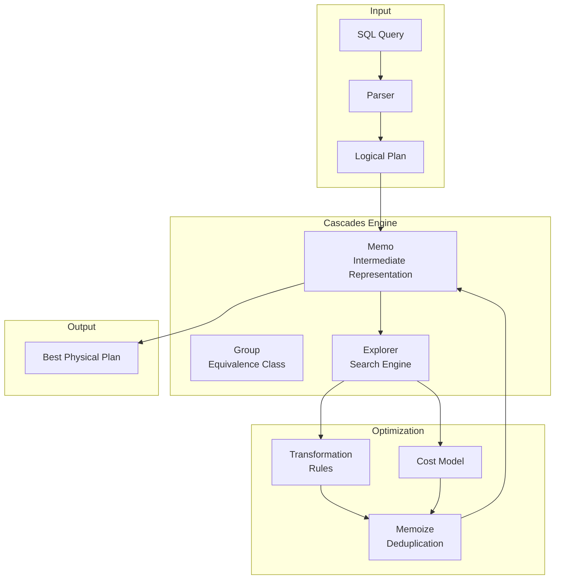
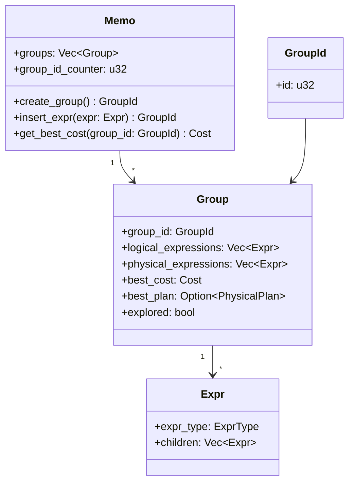
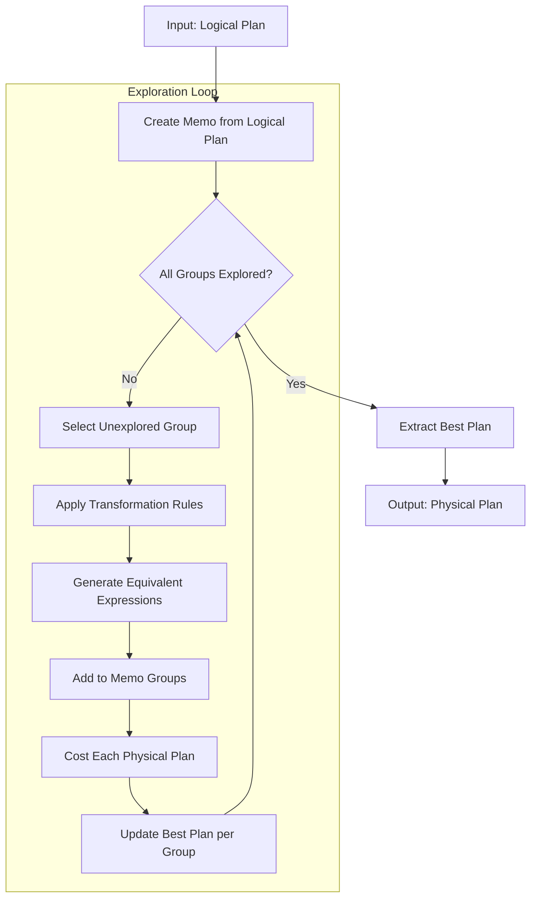
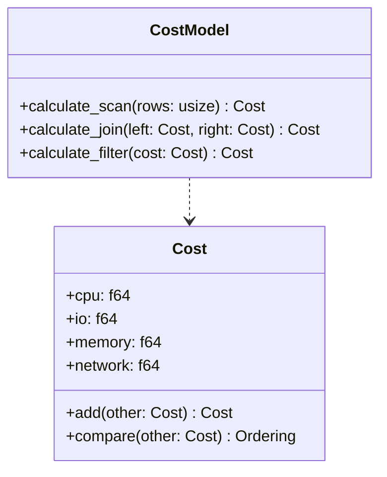
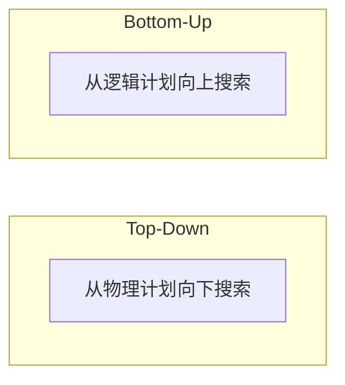
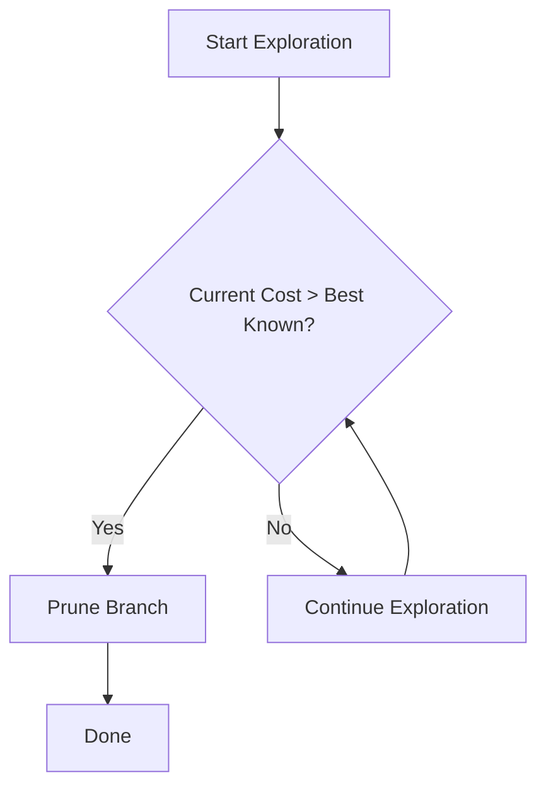
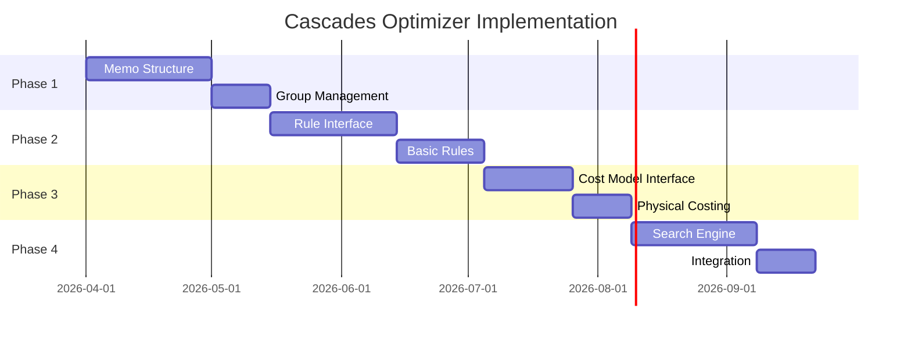

# 级联优化器设计

> **版本**: 2.x (规划中)
> **更新日期**: 2026-03-05

---

## 1. 为什么需要 Cascades

SQLRustGo 在 2.x 计划实现 **Cascades Optimizer**。

Cascades 是现代数据库优化器的主流架构，被以下系统采用：

| 数据库 | 架构 |
|--------|------|
|SQL服务器|瀑布|
|绿梅|瀑布|
|蟑螂数据库|瀑布|
|阿帕奇兽人|瀑布|

### 传统优化器 vs Cascades

| 特性 | 传统优化器 |瀑布|
|------|------------|----------|
| 搜索空间 | 有限 | 完整 |
| 规则扩展 | 困难 | 容易 |
| 成本模型 | 简单 | 灵活 |
| 执行计划 | 次优 | 更优 |

---

## 2. Cascades 架构



---

## 3. Memo 数据结构

Memo 用于保存所有等价表达式，避免重复计算。



### Memo 结构示意

```rust
struct Memo {
    groups: Vec<Group>
}

struct Group {
    group_id: GroupId,
    expressions: Vec<Expr>,  // 逻辑表达式
    best_cost: Cost,         // 最低成本
    best_plan: PhysicalPlan, // 最优计划
}
```

---

## 4. 优化流程



---

## 5. 转换规则

示例规则：

### 5.1 Join 交换律


### 5.2 Filter 合并


### 5.3谓词下推


### 规则接口

```rust
pub trait TransformRule {
    fn match_expr(&self, expr: &Expr) -> bool;
    fn apply(&self, expr: &Expr) -> Vec<Expr>;
}
```

---

## 6. 成本模型

成本函数：



### 成本计算公式

```
TotalCost = CPU_Cost + I/O_Cost + Memory_Cost + Network_Cost

CPU_Cost = rows * cpu_per_row
I/O_Cost = pages * disk_latency
Memory_Cost = bytes * memory_bandwidth
Network_Cost = transfer_bytes * network_bandwidth
```

---

## 7. 搜索策略

### 7.1 搜索方向



### 7.2 剪枝策略



---

## 8. SQLRustGo Cascades 规划

| 阶段 | 功能 | 目标版本 |
|------|------|----------|
| Phase 1 |备忘录引擎| 2.0 |
| Phase 2 |规则引擎| 2.1 |
| Phase 3 |成本模型| 2.2 |
| Phase 4 |搜索策略| 2.3 |

### 8.1 实现计划



---

## 9. Cascades 优势

| 优势 | 说明 |
|------|------|
| **规则扩展** | 新规则容易加入，只需实现 TransformRule trait |
| **计划搜索** | 更全面的搜索空间 |
| **性能优化** | 更优的执行计划 |
| **成本模型** | 可插拔的成本模型 |
| **复用** | Memo 避免重复计算 |

---

## 10. 与其他系统的对标

| 数据库 | 优化器架构 |SQLRustGo|
|--------|------------|-----------|
|SQL服务器|瀑布| ✅ 目标 |
|绿梅|瀑布| ✅ 目标 |
|蟑螂数据库|瀑布| ✅ 目标 |
|PostgreSQL|启发式| ❌ 已超越 |
| MySQL |启发式| ❌ 已超越 |

---

## 11. 相关文档

- [SQLRustGo Architecture](./sqlrustgo_architecture.md)
- [Distributed Scheduler](./distributed_scheduler_design.md)
- [Whitepaper](../whitepaper/sqlrustgo_1.2_release_whitepaper.md)
