# SQLRustGo 2.0 分布式调度器设计

> **版本**: 2.0 (规划中)
> **更新日期**: 2026-03-05

---

## 1. 概述

SQLRustGo 2.0 引入**分布式执行框架**，支持多节点并行查询执行。

### 核心目标

- **水平扩展**: 通过添加节点提升性能
- **数据分片**: 支持数据分布式存储
- **查询并行**: 支持分布式查询优化
- **容错处理**: 支持节点故障恢复

---

## 2. 系统架构

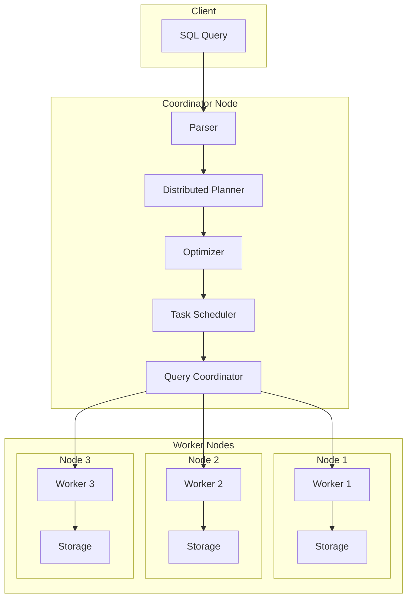

---

## 3. DAG 执行图

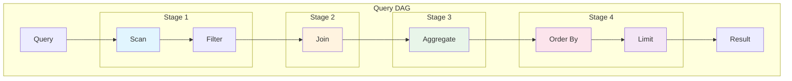

---

## 4. Scheduler 任务

调度器负责：

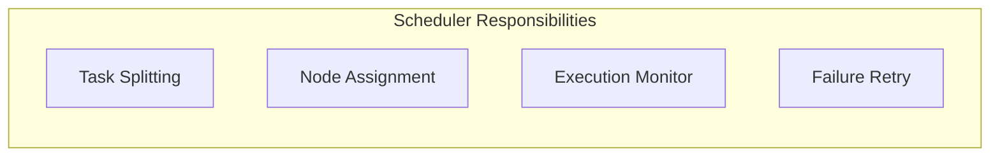

### 4.1 任务拆分

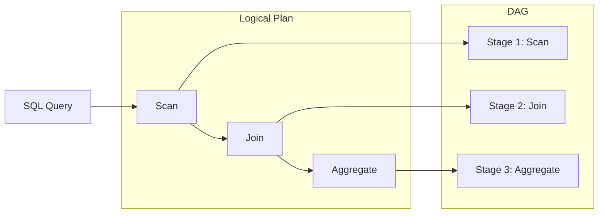

---

## 5. Task 调度模型

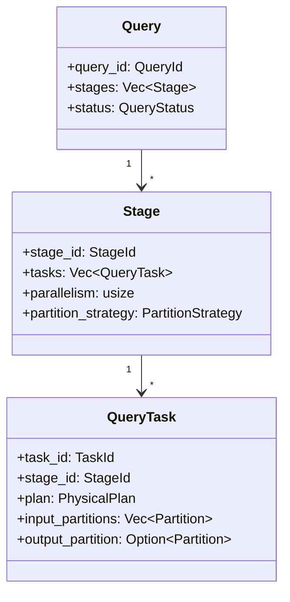

---

## 6. Stage 执行

### 6.1 Stage 定义

Stage = 一组并行执行的 Task

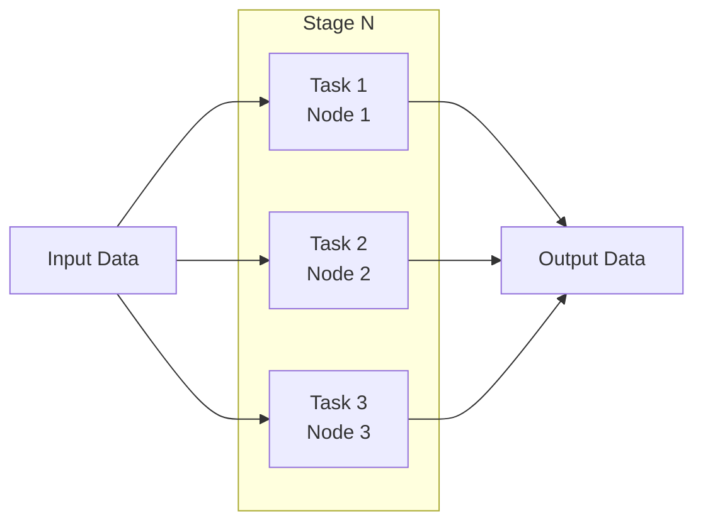

### 6.2 Stage 依赖

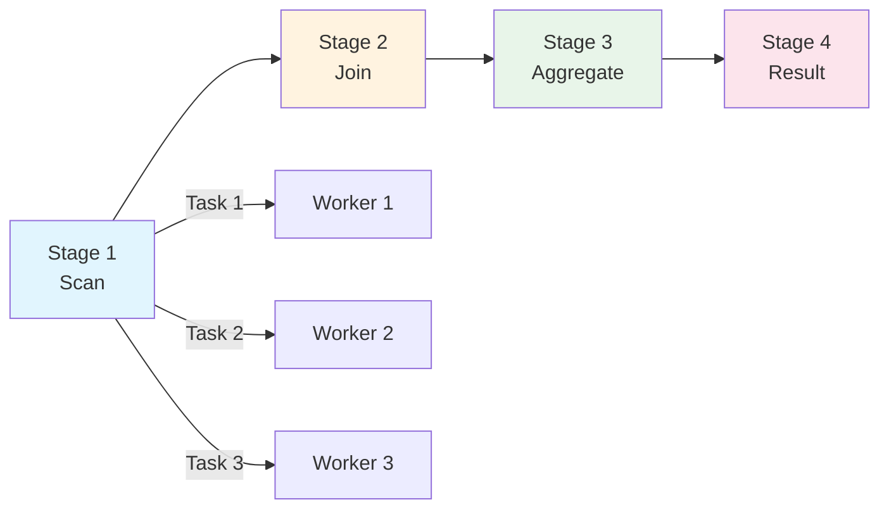

---

## 7. Exchange 算子

分布式关键算子：

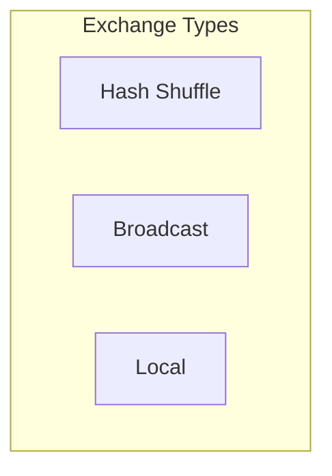

### 7.1 随机播放

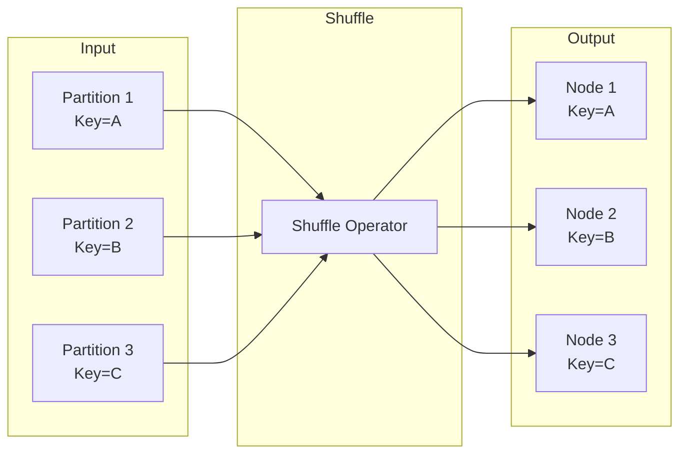

### 7.2 广播

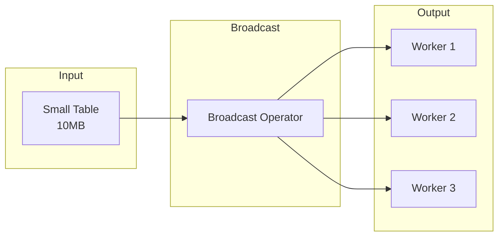

---

## 8. 调度策略

| 策略 | 说明 | 适用场景 |
|------|------|----------|
| **Hash** | 按 key 分区 | 等值 Join |
|**播送**| 小表广播 | 小表 Join |
| **Local** | 本地执行 | 本地数据 |
|**随机的**| 随机分配 | 负载均衡 |

### 8.1 策略选择

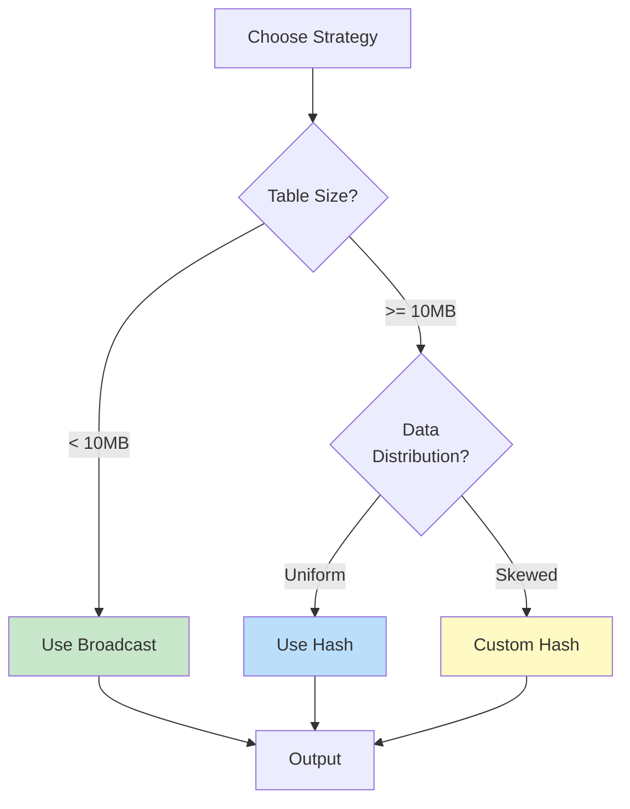

---

## 9. 容错

### 9.1 容错机制

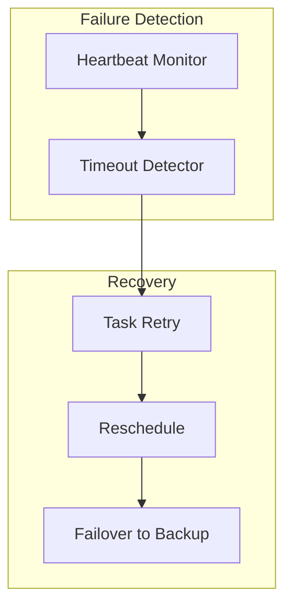

### 9.2 恢复策略

| 故障类型 | 检测方式 | 恢复策略 |
|----------|----------|----------|
| Worker 节点宕机 | 心跳检测 | 任务重新调度 |
| 网络分区 | 超时检测 | 重新执行 |
| 数据丢失 |校验和| 重新获取 |

---

## 10. SQLRustGo 分布式执行流程

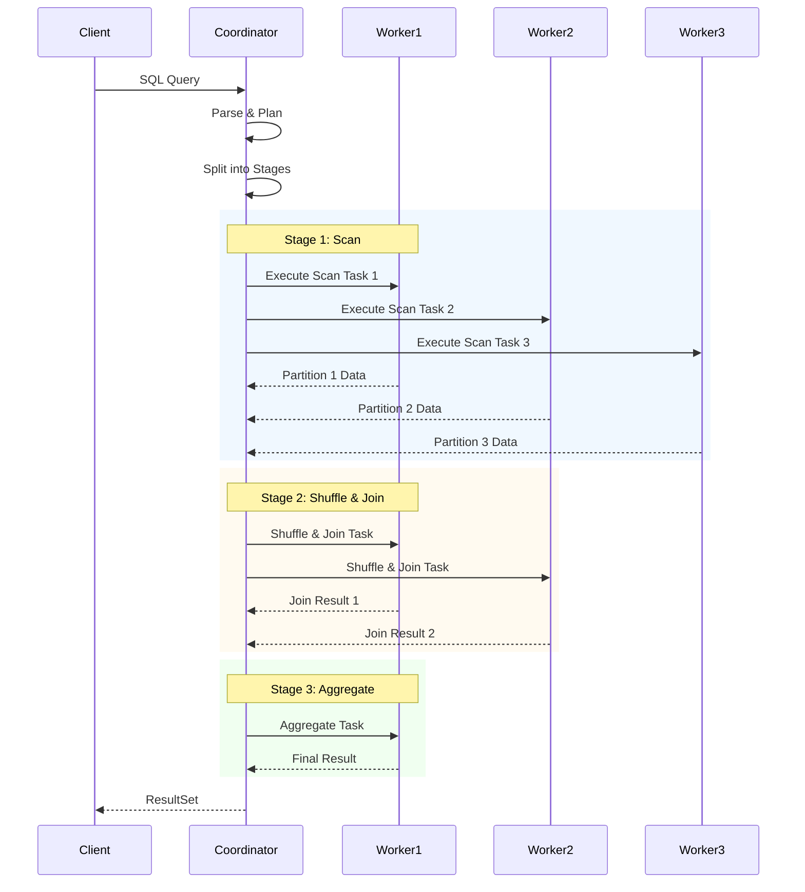

---

## 11. 性能优化

### 11.1 优化策略

| 优化手段 | 效果 |
|----------|------|
|谓词下推| 减少网络传输 |
|柱状传输| 减少序列化开销 |
|数据局部性| 减少跨节点访问 |
|流水线| 减少等待时间 |

### 11.2 性能目标

| 指标 | 1.x (单机) | 2.0 (3节点) |
|------|------------|-------------|
| 100万行 Join | <1s | <500ms |
| 1000万行聚合 | <5s | <2s |
| 水平扩展 | 1x | ~2.5x |

---

## 12. 技术对标

如果以下三件事做对：

- 执行接口 ✅
- 级联优化器✅
- 分布式调度 ✅

SQLRustGo 的技术路线将与这些系统一致：

| 数据库 | 架构 |
|--------|------|
|蟑螂数据库|瀑布+白天|
|绿梅|瀑布+白天|
|SQL服务器|瀑布+白天|
| Trino |有向无环图执行|

---

## 13. 相关文档

- [SQLRustGo Architecture](./sqlrustgo_architecture.md)
- [Cascades Optimizer](./cascades_optimizer_design.md)
- [Whitepaper](../whitepaper/sqlrustgo_1.2_release_whitepaper.md)
- [2.0 Distributed Framework](../whitepaper/sqlrustgo_2.0_distributed_framework.md)
