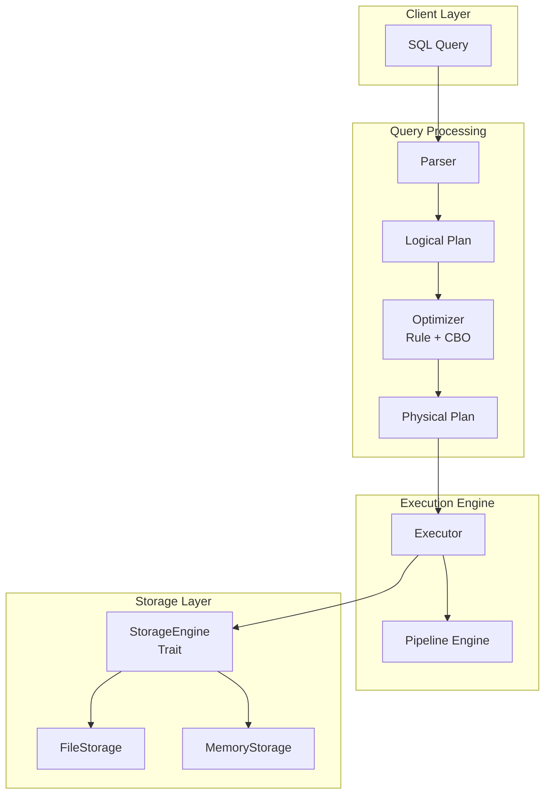
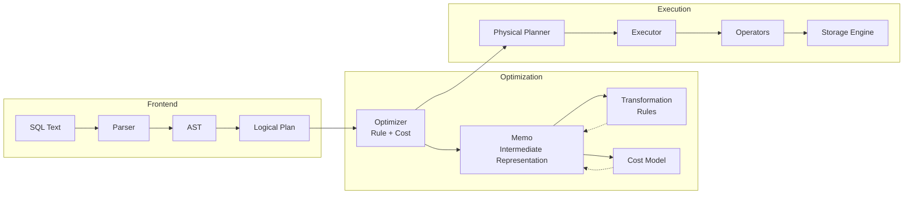
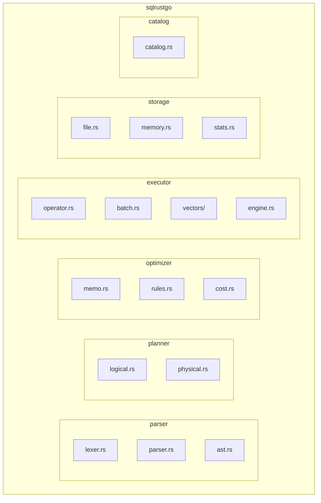
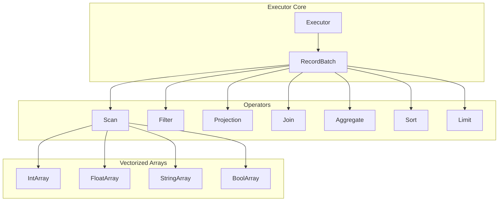
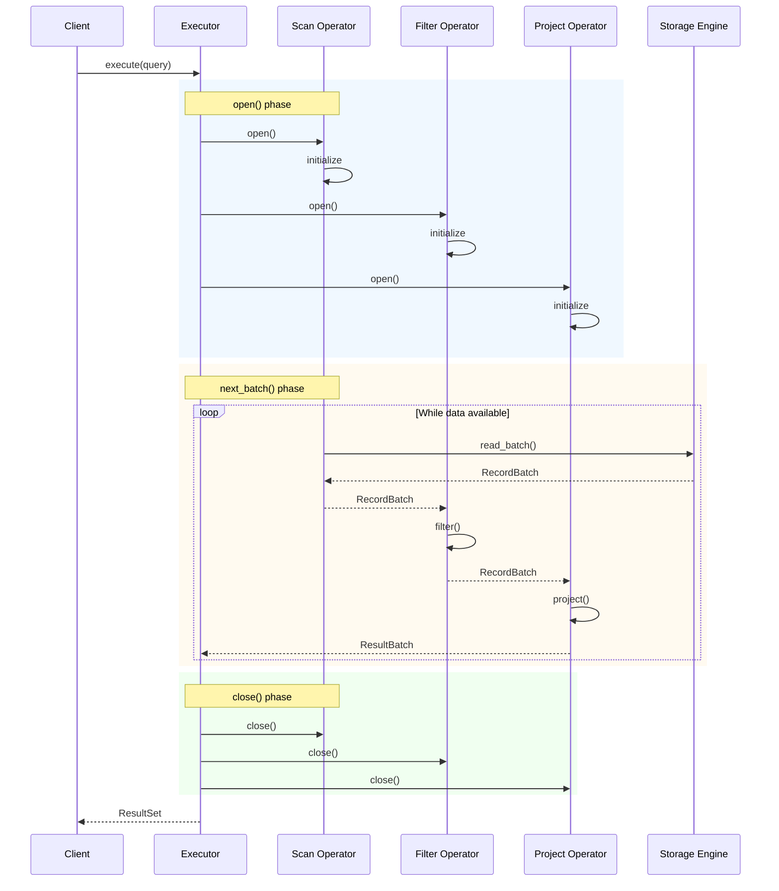
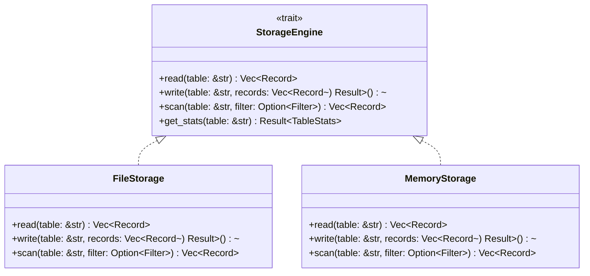
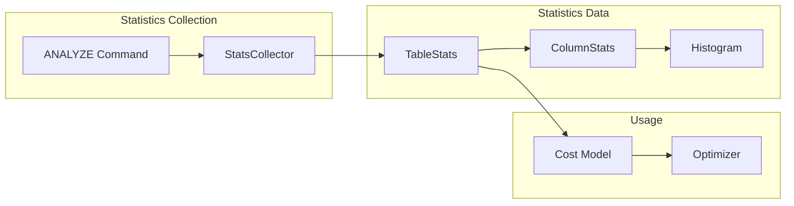
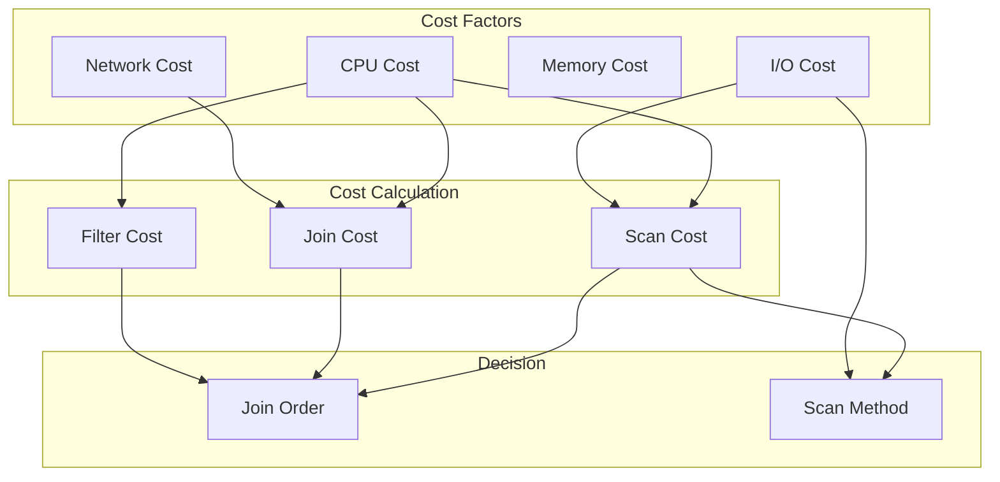
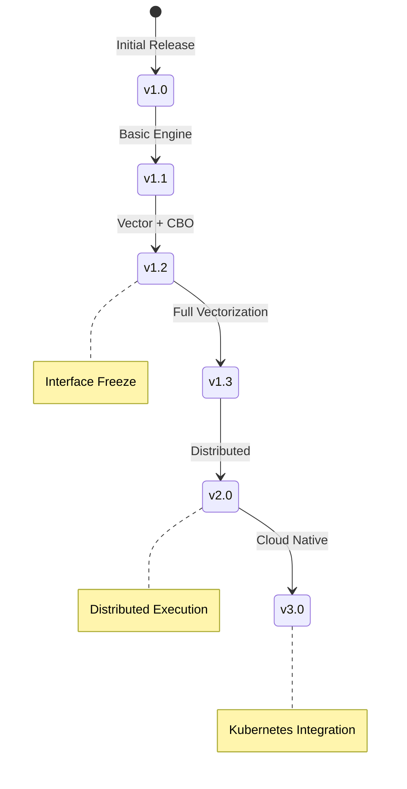

# SQLRustGo System Architecture

> **版本**: 1.2
> **更新日期**: 2026-03-05

---

## 1. 系统总体架构

---

## 2. 查询执行流程

---

## 3. SQLRustGo 模块架构

---

## 4. 执行引擎结构

---

## 5. Pipeline 执行模型

---

## 6. Storage Engine 架构

---

## 7. 统计信息系统

---

## 8. CBO 成本模型

---

## 9. 版本演进

---

## 10. 相关文档

- [Cascades Optimizer Design](./cascades_optimizer_design.md)
- [Distributed Scheduler Design](./distributed_scheduler_design.md)
- [Whitepaper](../whitepaper/sqlrustgo_1.2_release_whitepaper.md)
- [Interface Freeze](../whitepaper/sqlrustgo_1.2_interface_freeze.md)
