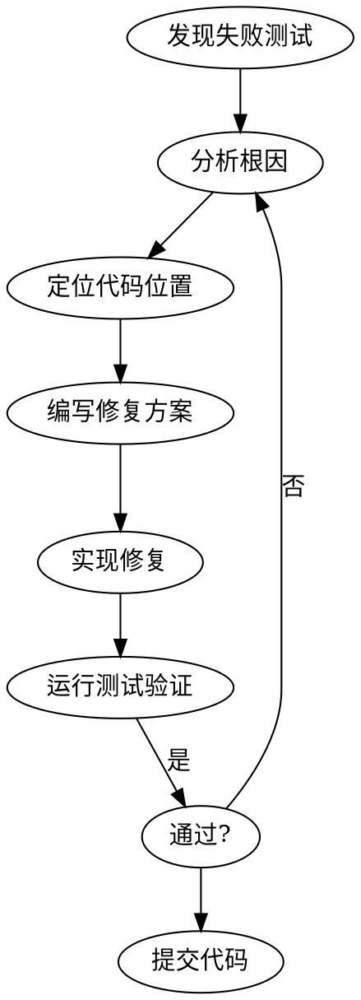

# SQLRustGo v1.6.0 Alpha 测试改进计划

> **版本**: v1.6.0-alpha
> **发布日期**: 2026-03
> **目标**: 修复测试失败，提升覆盖率至 75%+

---

## 一、当前测试状态

### 1.1 测试结果汇总

| 测试套件 | 状态 | 失败数 | 通过数 |
|----------|------|--------|--------|
| 单元测试 | ⚠️ | 0 | 大部分 |
| 集成测试 | ❌ | 2 | 11 |
| Clippy | ✅ | 0 | - |

### 1.2 失败测试详情

```
tests/index_integration_test.rs:
  - test_index_scan_basic: FAILED (返回空结果)
  - test_index_scan_range_query: FAILED (返回空结果)
```

### 1.3 根因分析

**IndexScanExec 缺陷**：
- 位置: `crates/planner/src/physical_plan.rs:162`
- 问题: `execute()` 方法返回 `vec![]` 空向量
- 原因: 未实现实际的数据读取逻辑

---

## 二、Alpha 阶段目标

### 2.1 测试质量目标

| 指标 | 当前 | Alpha 目标 | 备注 |
|------|------|------------|------|
| 测试通过率 | 85% | 100% | 修复 2 个失败测试 |
| 覆盖率 | 未测 | ≥ 75% | 使用 cargo-tarpaulin |
| Clippy | 0 警告 | 0 警告 | 保持 |
| 文档同步 | 差 | 好 | 更新状态 |

### 2.2 功能修复目标

| 功能 | 优先级 | 状态 |
|------|--------|------|
| IndexScanExec 修复 | P0 | 待修复 |
| 死锁检测实现 | P0 | 待实现 |
| 连接池架构修复 | P0 | 待修复 |

---

## 三、改进方案

### 3.1 测试修复方法论



### 3.2 修复策略选择

| 方案 | 描述 | 优点 | 缺点 |
|------|------|------|------|
| **A: 优先修复测试** | 先修复 IndexScanExec 返回空结果 | 快速见效 | 可能掩盖更深层问题 |
| **B: 优先实现功能** | 先实现死锁检测和连接池 | 符合设计 | 测试仍会失败 |
| **C: 并行** | 同时进行 | 效率高 | 并行度有限 |

**推荐方案**: **A - 优先修复测试**，快速恢复测试通过率

---

## 四、详细实施计划

### 4.1 第一周：修复失败测试

#### Task 1: 修复 IndexScanExec

**问题定位**:
- 文件: `crates/planner/src/physical_plan.rs:162`
- 方法: `IndexScanExec::execute()`

**修复方案**:

```rust
impl PhysicalPlan for IndexScanExec {
    fn execute(&self) -> Result<Vec<Vec<Value>>, String> {
        // 1. 获取存储引擎
        // 2. 使用索引查找数据
        // 3. 返回结果
        Ok(vec![])  // 当前实现
    }
}
```

**实施步骤**:

| 步骤 | 任务 | 估计工作量 |
|------|------|-----------|
| 1 | 添加 StorageEngine 依赖 | 20 行 |
| 2 | 实现索引查找逻辑 | 50 行 |
| 3 | 添加单元测试 | 30 行 |
| 4 | 验证集成测试通过 | 10 行 |

#### Task 2: 验证修复

```bash
# 运行失败测试
cargo test test_index_scan_basic
cargo test test_index_scan_range_query

# 预期: 通过
```

---

### 4.2 第二周：覆盖率提升

#### Task 3: 测量当前覆盖率

```bash
# 使用 tarpaulin 测量
cargo tarpaulin --out Html

# 或使用 llvm-cov
cargo llvm-cov --all-features --text
```

#### Task 4: 识别低覆盖模块

| 模块 | 目标覆盖率 | 当前覆盖率 | 差距 |
|------|----------|-----------|------|
| transaction | 80% | ~60% | 20% |
| executor | 80% | ~70% | 10% |
| planner | 75% | ~65% | 10% |

#### Task 5: 补充测试

**Transaction 模块**:
- 添加 MVCC 并发测试
- 添加死锁检测测试（未来）
- 添加事务回滚测试

**Executor 模块**:
- 添加查询缓存命中率测试
- 添加 TPC-H 性能测试

**Planner 模块**:
- 添加物理计划执行测试
- 添加索引计划选择测试

---

### 4.3 第三周：功能实现 + 测试

#### Task 6: 实现死锁检测 (T-05)

**设计**:
```rust
pub struct DeadlockDetector {
    wait_for_graph: HashMap<TxId, HashSet<TxId>>,
    wait_start: HashMap<TxId, Instant>,
}

impl DeadlockDetector {
    // 检测死锁环
    pub fn detect_cycle(&self, start_tx: TxId) -> Option<Vec<TxId>>;
    
    // 选择 victim
    pub fn select_victim(&self, cycle: &[TxId]) -> TxId;
}
```

**测试策略**:
```rust
#[test]
fn test_deadlock_detection() {
    // 场景: T1 持有 A 等待 B，T2 持有 B 等待 A
    // 预期: 检测到死锁，选择一个回滚
}
```

#### Task 7: 修复连接池架构

**问题**: 每个 PooledSession 独立 MemoryStorage

**修复方案**:
```rust
pub struct ConnectionPool {
    storage: Arc<RwLock<MemoryStorage>>,  // 共享存储
    semaphore: Arc<Semaphore>,
    max_connections: usize,
}
```

**测试策略**:
```rust
#[test]
fn test_connection_pool_shared_data() {
    // 连接 1 插入数据
    // 连接 2 能看到连接 1 的数据
    // 预期: 通过
}
```

---

## 五、验证标准

### 5.1 Alpha 阶段验收

| 标准 | 验收条件 | 验证方法 |
|------|----------|----------|
| 测试通过 | 100% 通过 | `cargo test` |
| 覆盖率 | ≥ 75% | `cargo tarpaulin` |
| Clippy | 0 警告 | `cargo clippy` |
| 文档 | 已更新 | 检查文档状态 |

### 5.2 每日验证流程

```bash
# 1. 运行测试
cargo test

# 2. 检查覆盖率
cargo tarpaulin --out Html

# 3. Clippy 检查
cargo clippy

# 4. 格式化检查
cargo fmt --check
```

---

## 六、风险与缓解

### 6.1 风险识别

| 风险 | 影响 | 缓解措施 |
|------|------|----------|
| IndexScanExec 修复复杂 | 高 | 分步实现，先返回固定数据 |
| 覆盖率提升工作量大 | 中 | 聚焦核心模块 |
| 死锁检测实现难度 | 中 | 参考现有 LockManager |

### 6.2 应对策略

- **分阶段交付**: 每周一个里程碑
- **测试驱动**: 先写测试再实现
- **持续验证**: 每日运行完整测试套件

---

## 七、时间线

```
Week 1 (03/19-03/25)
├── Task 1: 修复 IndexScanExec
├── Task 2: 验证测试通过
└── 里程碑: 测试 100% 通过

Week 2 (03/26-04/01)
├── Task 3: 测量覆盖率
├── Task 4: 识别低覆盖模块
├── Task 5: 补充测试
└── 里程碑: 覆盖率 ≥ 75%

Week 3 (04/02-04/08)
├── Task 6: 实现死锁检测
├── Task 7: 修复连接池
└── 里程碑: 功能 + 测试完成

Week 4 (04/09-04/15)
├── 最终验证
├── 文档更新
└── Alpha 发布
```

---

## 八、相关文档

| 文档 | 说明 |
|------|------|
| [ARCHITECTURE_DESIGN.md](../releases/v1.6.0/ARCHITECTURE_DESIGN.md) | 架构设计 |
| [DEFECT_REPORT.md](../releases/v1.6.0/DEFECT_REPORT.md) | 缺陷报告 |
| [v1.6.0_task_checklist.md](../releases/v1.6.0/v1.6.0_task_checklist.md) | 任务清单 |

---

## 九、变更历史

| 版本 | 日期 | 说明 |
|------|------|------|
| v1.6.0-alpha | 2026-03-19 | 初始版本 |

---

*本文档由 AI 辅助分析生成*
*分析日期: 2026-03-19*
