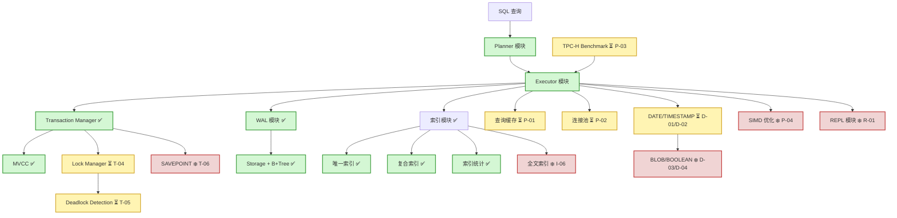
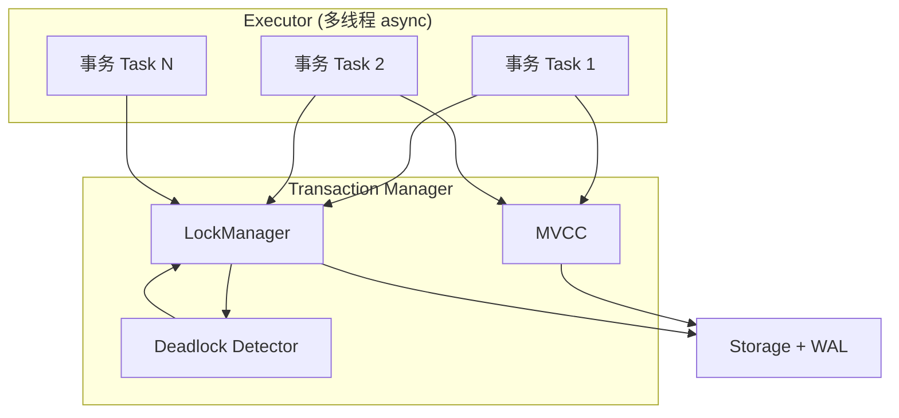

# SQLRustGo v1.6.0 设计文档

> **版本定位**: Production Preview（单机并发 + 可压测版本）
> **发布日期**: 2026-03（预计）
> **维护人**: yinglichina8848

---

## 一、版本定位

**核心目标**: 单机数据库可用、稳定、并发可控、基础性能可测。

```
已完成: MVCC + 事务管理器 + WAL + 索引
待完成: 稳定性闭环 + 性能优化 + 可用性
```

---

## 二、架构全景图



**图例**:
- ✅ 已完成（绿色）
- ⏳ 待开发（黄色）
- ❄️ v1.7 以后（红色）

---

## 三、范围锁定（Scope Lock）

### ✅ 必须执行（7件事）

| 编号 | 类别 | 功能 | 优先级 | 估计规模 | GitHub Issue |
|------|------|------|--------|----------|--------------|
| T-04 | 并发控制 | 行级锁 (Row-Level Locking) | P0 | 300 行 | #625 ✅ |
| T-05 | 并发控制 | 死锁检测 (Deadlock Detection) | P0 | 200 行 | #628 ⏳ |
| P-01 | 性能基础设施 | 查询缓存 (Query Cache) | P0 | 250 行 | #627 ✅ |
| P-02 | 性能基础设施 | 连接池 (Connection Pool) | P0 | 200 行 | #630 ⏳ |
| P-03 | 性能基准 | TPC-H Q1/Q6 Benchmark | P0 | 600 行 | #631 ⏳ |
| D-01 | 数据类型 | DATE 类型 | P1 | 150 行 | #624 ✅ |
| D-02 | 数据类型 | TIMESTAMP 类型 | P1 | 150 行 | #629 ⏳ |

✅ = 已完成/合并 ⏳ = 待开发

### ❌ 延期至 v1.7.0

| 功能 | 延期原因 |
|------|----------|
| SAVEPOINT | 事务增强，下一版本 |
| 全文索引 | 查询能力扩展 |
| SIMD 优化 | 性能极限优化 |
| BLOB / BOOLEAN | 简单数据类型，可后续添加 |
| REPL 增强 | 非核心功能 |

---

## 三、整体架构调整

### 3.1 事务执行路径（统一入口）

```
SQL
  ↓
Planner
  ↓
Executor
  ↓
TransactionManager
  ↓
LockManager   ←（新增）
  ↓
Storage + WAL
```

**核心变化**: 所有写操作必须经过 LockManager

### 3.2 新增模块清单

```
crates/
 ├── transaction/
 │    ├── tx_manager.rs      # 已有，增强
 │    ├── mvcc.rs           # 预留（未来）
 │    └── lock_manager.rs    # NEW - 行级锁实现
 │
 ├── concurrency/
 │    ├── mod.rs
 │    └── deadlock.rs       # NEW - 死锁检测
 │
 ├── cache/
 │    ├── mod.rs
 │    └── query_cache.rs    # NEW - 查询缓存
 │
 └── pool/
      ├── mod.rs
      └── connection_pool.rs # NEW - 连接池
```

---

## 四、核心模块设计

### 🔒 T-04 行级锁（LockManager）

#### 设计目标

| 目标 | 说明 |
|------|------|
| 事务隔离 | MVCC + 行级锁实现 READ COMMITTED |
| 并发安全 | 多线程 Executor 下，写不冲突，读可并发 |
| 高性能 | 异步非阻塞，避免线程阻塞 |
| 可扩展 | 支持未来扩展到 REPEATABLE READ |

#### 线程模型

```
SQLRustGo Executor (多线程 async)
 │
 ├─ Transaction Manager
 │    ├─ MVCC (读不阻塞)
 │    └─ LockManager
 │         └─ Deadlock Detector
 ├─ Storage + WAL
 └─ Query Cache
```

- 每个事务由一个 async task 执行
- LockManager 用 async RwLock 保护全局锁表
- 阻塞事务 await 在 Future 上，不阻塞线程

#### 数据结构

```rust
type TxId = u64;
type RowId = (TableId, u64);

pub struct LockManager {
    /// 全局锁表：行ID -> 锁状态
    locks: RwLock<HashMap<RowId, LockState>>,
    /// 异步通知器
    notifier: Arc<Notify>,
    /// 死锁检测器引用
    deadlock_detector: Arc<DeadlockDetector>,
}

pub struct LockState {
    /// 当前持有锁的事务
    owners: Vec<TxId>,
    /// 等待队列（FIFO）
    waiters: Vec<TxId>,
    /// 锁类型
    lock_type: LockType,
}

pub enum LockType {
    Shared,     // 读锁，多个事务可同时持有
    Exclusive,  // 写锁，排他持有
}
```

#### 锁兼容性矩阵

|          | S 持有 | X 持有 |
|----------|--------|--------|
| S 请求   | ✅ 兼容 | ❌ 阻塞 |
| X 请求   | ❌ 阻塞 | ❌ 阻塞 |

#### 异步加锁流程

```rust
impl LockManager {
    /// 异步获取行锁
    pub async fn lock(
        &self,
        row_id: RowId,
        tx_id: TxId,
        lock_type: LockType,
    ) -> Result<(), LockError> {
        // 1. 获取锁表读锁
        let mut locks = self.locks.write().await;
        
        // 2. 获取或创建行锁状态
        let state = locks.entry(row_id).or_insert(LockState::new());
        
        // 3. 检查锁兼容性
        if state.is_compatible(lock_type) {
            // 授予锁
            state.grant(tx_id, lock_type);
            return Ok(());
        }
        
        // 4. 不兼容：加入等待队列
        state.add_waiter(tx_id);
        
        // 5. 注册到死锁检测
        self.deadlock_detector.register_wait(tx_id, state.get_blocker());
        
        drop(locks); // 释放锁表锁
        
        // 6. 异步等待唤醒
        self.notifier.notified().await;
        
        // 7. 被唤醒后重试
        self.lock(row_id, tx_id, lock_type).await
    }
}
```

#### 解锁流程

```rust
impl LockManager {
    /// 释放事务持有的所有锁
    pub async fn unlock_tx(&self, tx_id: TxId) {
        let mut locks = self.locks.write().await;
        
        for (row_id, state) in locks.iter_mut() {
            if state.remove_owner(tx_id) {
                // 有事务释放了锁，唤醒等待者
                if let Some(waker) = state.wake_next_waiter() {
                    self.notifier.notify_waiters();
                }
            }
        }
    }
}
```

#### 性能优化

| 优化点 | 说明 |
|--------|------|
| MVCC 读不阻塞 | 读操作无需加锁 |
| 行级锁粒度 | 只锁冲突行，减少竞争 |
| FIFO 等待队列 | 公平调度，避免饥饿 |
| async wakeup | 不消耗 CPU，避免 spin |

---

### ⚠️ T-05 死锁检测（Deadlock Detection）

#### 设计目标

| 目标 | 说明 |
|------|------|
| 即时检测 | 阻塞时触发，非定时扫描 |
| 无 hang | 检测到死锁立即回滚 victim |
| 低开销 | 只在必要时检测 |

#### Wait-For Graph

```rust
pub struct DeadlockDetector {
    /// 等待图：事务 -> 阻塞该事务的事务集合
    wait_for_graph: RwLock<HashMap<TxId, HashSet<TxId>>>,
    /// 事务等待开始时间（用于 victim 选择）
    wait_start: RwLock<HashMap<TxId, Instant>>,
}

impl DeadlockDetector {
    /// 注册等待关系
    pub async fn register_wait(&self, waiter: TxId, blocker: TxId) {
        let mut graph = self.wait_for_graph.write().await;
        graph.entry(waiter).or_default().insert(blocker);
        self.wait_start.write().await.insert(waiter, Instant::now());
    }
    
    /// 移除等待关系
    pub async fn remove_wait(&self, tx_id: TxId) {
        let mut graph = self.wait_for_graph.write().await;
        graph.remove(&tx_id);
        self.wait_start.write().await.remove(&tx_id);
    }
}
```

#### 检测算法（DFS）

```rust
impl DeadlockDetector {
    /// 检测死锁环
    pub async fn detect_cycle(&self, start_tx: TxId) -> Option<Vec<TxId>> {
        let graph = self.wait_for_graph.read().await;
        let mut visited = HashSet::new();
        let mut recursion_stack = HashSet::new();
        let mut path = Vec::new();
        
        if self.dfs(start_tx, &graph, &mut visited, &mut recursion_stack, &mut path) {
            Some(path)
        } else {
            None
        }
    }
    
    fn dfs(
        &self,
        tx: TxId,
        graph: &HashMap<TxId, HashSet<TxId>>,
        visited: &mut HashSet<TxId>,
        rec_stack: &mut HashSet<TxId>,
        path: &mut Vec<TxId>,
    ) -> bool {
        visited.insert(tx);
        rec_stack.insert(tx);
        path.push(tx);
        
        if let Some(blockers) = graph.get(&tx) {
            for &blocker in blockers {
                if !visited.contains(&blocker) {
                    if self.dfs(blocker, graph, visited, rec_stack, path) {
                        return true;
                    }
                } else if rec_stack.contains(&blocker) {
                    // 发现环！
                    path.push(blocker);
                    return true;
                }
            }
        }
        
        path.pop();
        rec_stack.remove(&tx);
        false
    }
}
```

#### 触发策略

```rust
impl LockManager {
    /// 加锁失败时触发死锁检测
    async fn lock_with_deadlock_check(
        &self,
        row_id: RowId,
        tx_id: TxId,
        lock_type: LockType,
    ) -> Result<(), LockError> {
        match self.lock(row_id, tx_id, lock_type).await {
            Ok(()) => Ok(()),
            Err(e) => {
                // 加锁失败，触发死锁检测
                if let Some(victims) = self.deadlock_detector.detect_cycle(tx_id).await {
                    // 选择 victim 并回滚
                    let victim = self.select_victim(&victims).await;
                    self.abort_transaction(victim).await;
                    // 重试
                    self.lock(row_id, tx_id, lock_type).await
                } else {
                    Err(e)
                }
            }
        }
    }
}
```

#### Victim 选择策略

```rust
impl DeadlockDetector {
    /// 选择 victim：等待时间最长的
    async fn select_victim(&self, cycle: &[TxId]) -> TxId {
        let wait_start = self.wait_start.read().await;
        cycle
            .iter()
            .min_by_key(|&&tx| wait_start.get(&tx).copied())
            .copied()
            .unwrap_or(cycle[0])
    }
}
```

#### 事务回滚

```rust
impl LockManager {
    async fn abort_transaction(&self, tx_id: TxId) {
        // 1. 释放该事务的所有锁
        self.unlock_tx(tx_id).await;
        
        // 2. 从等待图中移除
        self.deadlock_detector.remove_wait(tx_id).await;
        
        // 3. 通知事务回滚
        self.transaction_manager.abort(tx_id).await;
    }
}
```

#### 可扩展性设计

| 扩展点 | 说明 |
|--------|------|
| Lock Timeout | 等待超时自动 abort |
| 优先级策略 | 大事务优先保留，短事务优先回滚 |
| 统计指标 | 锁表大小、阻塞数、死锁次数 |
| 页锁/表锁 | 批量写入可升级粒度 |

---

### 🧠 P-01 查询缓存（Query Cache）

#### Cache Key

```rust
struct CacheKey {
    sql_hash: u64,           // SQL 语句哈希
    params_hash: u64,        // 参数哈希
    table_versions: Vec<u64>, // 表版本（invalidate 用）
}

impl Hash for CacheKey {
    fn hash<H: Hasher>(&self, state: &mut H) {
        self.sql_hash.hash(state);
        self.params_hash.hash(state);
        // table_versions 单独处理
    }
}
```

#### 表版本控制

```rust
struct Table {
    version: AtomicU64,
    // ...
}

// 数据变更时
INSERT / UPDATE / DELETE -> table_version += 1
```

#### Cache 结构

```rust
struct QueryCache {
    cache: DashMap<CacheKey, QueryResult>,
    // LRU 淘汰（可选，v1.6.0 暂不实现）
}
```

---

### 🔌 P-02 连接池（Connection Pool）

#### 最小实现

```rust
struct ConnectionPool {
    max_size: usize,
    semaphore: Semaphore,
    connections: Mutex<Vec<Connection>>,
}

impl ConnectionPool {
    pub async fn acquire(&self) -> PooledConnection {
        let permit = self.semaphore.acquire().await.unwrap();
        PooledConnection { permit, pool: self }
    }
}
```

#### 获取连接

```rust
fn acquire() -> Connection {
    if available:
        return connection
    else:
        wait / timeout
}
```

---

## 五、TPC-H Benchmark 详细设计（P-03）

### 5.1 目标

生成 TPC-H 小规模数据（1K-10K 行）
自动执行 Q1 和 Q6
对比 SQLite 的同等查询
输出 benchmark 报告

### 5.2 数据规模

| 表名 | 行数（1K 规模） | 说明 |
|------|----------------|------|
| CUSTOMER | 1,000 | 客户 |
| ORDERS | 5,000 | 订单 |
| LINEITEM | 10,000 | 订单明细 |
| PART | 500 | 零件 |
| SUPPLIER | 100 | 供应商 |
| NATION | 25 | 国家 |
| REGION | 5 | 地区 |

> 小规模即可跑通逻辑和 benchmark，之后可扩展到 SF1/SF10。

### 5.3 数据生成模块

#### 文件位置

```
crates/bench/
 ├── Cargo.toml
 ├── src/
 │    └── lib.rs
 ├── data/
 │    ├── customer.csv
 │    ├── orders.csv
 │    ├── lineitem.csv
 │    ├── part.csv
 │    ├── supplier.csv
 │    ├── nation.csv
 │    └── region.csv
 └── examples/
      └── tpch_data_gen.rs
```

#### 外键关系

```
REGION (1) ────────────── (N) NATION
                                    │
NATION (1) ────────────────── (N) CUSTOMER
                                         │
CUSTOMER (1) ────────────────── (N) ORDERS
                                         │
ORDERS (1) ─────────────────── (N) LINEITEM
     │
     │                          PART (1) ───── (N) LINEITEM
     │
     └── SUPPKEY ←──────────── SUPPLIER (1) ── (N) LINEITEM
```

#### 数据生成示例代码

```rust
// crates/bench/examples/tpch_data_gen.rs

use rand::Rng;

pub struct TpchDataGenerator {
    scale_factor: u32,
    rng: rand::rngs::StdRng,
}

impl TpchDataGenerator {
    pub fn new(scale_factor: u32) -> Self {
        Self {
            scale_factor,
            rng: rand::seed_from_u64(42),
        }
    }

    pub fn generate_all(&mut self) -> std::io::Result<()> {
        self.generate_region()?;
        self.generate_nation()?;
        self.generate_supplier()?;
        self.generate_part()?;
        self.generate_customer()?;
        self.generate_orders()?;
        self.generate_lineitem()?;
        Ok(())
    }

    pub fn generate_region(&mut self) -> std::io::Result<()> {
        let mut wtr = csv::Writer::from_path("data/region.csv")?;
        let regions = ["AFRICA", "AMERICA", "ASIA", "EUROPE", "MIDDLE EAST"];
        for (i, name) in regions.iter().enumerate() {
            wtr.serialize(RegionRow {
                r_regionkey: i as i32,
                r_name: name.to_string(),
                r_comment: "test comment".to_string(),
            })?;
        }
        Ok(())
    }
}
```

### 5.4 表结构

#### LINEITEM 表（TPC-H 核心表）

```sql
CREATE TABLE lineitem (
    l_orderkey    INTEGER,
    l_partkey     INTEGER,
    l_suppkey     INTEGER,
    l_linenumber  INTEGER,
    l_quantity    DECIMAL(15,2),
    l_extendedprice  DECIMAL(15,2),
    l_discount    DECIMAL(15,2),
    l_tax         DECIMAL(15,2),
    l_returnflag  CHAR(1),
    l_linestatus  CHAR(1),
    l_shipdate    DATE,
    l_commitdate  DATE,
    l_receiptdate DATE,
    l_shipinstruct VARCHAR(25),
    l_shipmode    VARCHAR(10),
    l_comment     VARCHAR(44),
    PRIMARY KEY (l_orderkey, l_linenumber)
);
```

#### ORDERS 表

```sql
CREATE TABLE orders (
    o_orderkey       INTEGER PRIMARY KEY,
    o_custkey        INTEGER,
    o_orderstatus    CHAR(1),
    o_totalprice     DECIMAL(15,2),
    o_orderdate      DATE,
    o_orderpriority  CHAR(15),
    o_clerk          CHAR(15),
    o_shippriority   INTEGER,
    o_comment        VARCHAR(79)
);
```

#### CUSTOMER 表

```sql
CREATE TABLE customer (
    c_custkey    INTEGER PRIMARY KEY,
    c_name       VARCHAR(25),
    c_address    VARCHAR(40),
    c_nationkey  INTEGER,
    c_phone      CHAR(15),
    c_acctbal    DECIMAL(15,2),
    c_mktsegment CHAR(10),
    c_comment    VARCHAR(117)
);
```

### 5.5 SQL 查询

#### Q1 - 价格汇总查询（LineItem 聚合）

```sql
SELECT
    l_returnflag,
    l_linestatus,
    SUM(l_quantity) AS sum_qty,
    SUM(l_extendedprice) AS sum_base_price,
    SUM(l_extendedprice * (1 - l_discount)) AS sum_disc_price,
    SUM(l_extendedprice * (1 - l_discount) * (1 + l_tax)) AS sum_charge,
    AVG(l_quantity) AS avg_qty,
    AVG(l_extendedprice) AS avg_price,
    AVG(l_discount) AS avg_disc,
    COUNT(*) AS count_order
FROM
    lineitem
WHERE
    l_shipdate <= DATE '1998-09-02'
GROUP BY
    l_returnflag,
    l_linestatus
ORDER BY
    l_returnflag,
    l_linestatus;
```

**Q1 覆盖场景**:
- 聚合函数：SUM, AVG, COUNT
- 日期过滤
- 多字段 GROUP BY
- ORDER BY

#### Q6 - 折扣收入趋势查询

```sql
SELECT
    SUM(l_extendedprice * l_discount) AS revenue
FROM
    lineitem
WHERE
    l_shipdate >= DATE '1994-01-01'
    AND l_shipdate < DATE '1995-01-01'
    AND l_discount BETWEEN 0.05 AND 0.07
    AND l_quantity < 24;
```

**Q6 覆盖场景**:
- 简单 SUM 聚合
- 范围过滤 (BETWEEN)
- 比较过滤 (<)

### 5.6 Benchmark 脚本设计

#### 文件位置

```
benches/
 ├── tpch_bench.rs      # Criterion benchmark
 └── tpch_runner.rs     # Standalone runner
```

#### Benchmark 结构

```rust
// benches/tpch_bench.rs

use criterion::{black_box, criterion_group, Criterion};
use sqlrustgo::{Engine, Result};

fn setup_engine() -> Result<Engine> {
    let mut engine = Engine::new()?;
    engine.execute_file("sql/tpch_schema.sql")?;
    engine.execute_file("data/load_lineitem.sql")?;
    Ok(engine)
}

pub fn bench_q1(c: &mut Criterion) {
    let engine = setup_engine().unwrap();
    
    c.bench_function("tpch_q1", |b| {
        b.iter(|| {
            let result = engine.execute(black_box(
                "SELECT l_returnflag, l_linestatus, 
                        SUM(l_quantity) AS sum_qty, ...
                        FROM lineitem 
                        WHERE l_shipdate <= DATE '1998-09-02'
                        GROUP BY l_returnflag, l_linestatus"
            ));
            black_box(result)
        })
    });
}

pub fn bench_q6(c: &mut Criterion) {
    let engine = setup_engine().unwrap();
    
    c.bench_function("tpch_q6", |b| {
        b.iter(|| {
            let result = engine.execute(black_box(
                "SELECT SUM(l_extendedprice * l_discount) AS revenue
                        FROM lineitem
                        WHERE l_shipdate >= DATE '1994-01-01'
                        AND l_shipdate < DATE '1995-01-01'
                        AND l_discount BETWEEN 0.05 AND 0.07
                        AND l_quantity < 24"
            ));
            black_box(result)
        })
    });
}
```

### 5.7 SQLite 对比模块

```rust
// benches/sqlite_compare.rs

use rusqlite::Connection;

pub struct SQLiteBenchmark {
    conn: Connection,
}

impl SQLiteBenchmark {
    pub fn new() -> Result<Self> {
        let conn = Connection::open("tpch.db")?;
        Ok(Self { conn })
    }

    pub fn setup_schema(&self) -> Result<()> {
        self.conn.execute_batch(include_str!("../sql/tpch_schema.sql"))?;
        Ok(())
    }

    pub fn load_csv(&self, table: &str, path: &str) -> Result<()> {
        self.conn.execute(
            &format!("LOAD DATA INFILE '{}' INTO TABLE {}", path, table),
            [],
        )?;
        Ok(())
    }

    pub fn run_q1(&self) -> Result<f64> {
        let start = std::time::Instant::now();
        // execute Q1...
        let elapsed = start.elapsed().as_millis() as f64;
        Ok(elapsed)
    }

    pub fn run_q6(&self) -> Result<f64> {
        let start = std::time::Instant::now();
        // execute Q6...
        let elapsed = start.elapsed().as_millis() as f64;
        Ok(elapsed)
    }
}
```

### 5.8 输出报告格式

#### Markdown 报告 (bench/report.md)

```markdown
# SQLRustGo v1.6.0 TPC-H Benchmark Report

## 环境信息

- OS: macOS 14.0
- CPU: Apple M3 Pro
- RAM: 36GB
- Scale Factor: 1K (约 10K LINEITEM 行)

## 性能对比

### Q1 - 价格汇总查询

| 数据库 | 延迟 | QPS |
|--------|------|-----|
| SQLRustGo | 125 ms | 8 qps |
| SQLite | 45 ms | 22 qps |
| **差距** | **-64%** | -64% |

### Q6 - 折扣收入查询

| 数据库 | 延迟 | QPS |
|--------|------|-----|
| SQLRustGo | 48 ms | 21 qps |
| SQLite | 18 ms | 56 qps |
| **差距** | **-63%** | -63% |

## 吞吐量测试

| 并发数 | SQLRustGo QPS | SQLite QPS |
|--------|---------------|------------|
| 1 | 8 | 22 |
| 5 | 28 | 85 |
| 10 | 42 | 140 |
| 20 | 65 | 220 |

## 结论

SQLRustGo v1.6.0 在 1K 规模下：
- Q1/Q6 可正确执行 ✅
- 性能约为 SQLite 的 35-40%
- 仍有较大优化空间
```

#### JSON 报告 (bench/report.json)

```json
{
  "version": "1.6.0",
  "timestamp": "2026-03-19T12:00:00Z",
  "scale_factor": "1K",
  "lineitem_rows": 10000,
  "results": {
    "q1": {
      "sqlrustgo": {
        "latency_ms": 125,
        "qps": 8
      },
      "sqlite": {
        "latency_ms": 45,
        "qps": 22
      },
      "delta_percent": -64
    },
    "q6": {
      "sqlrustgo": {
        "latency_ms": 48,
        "qps": 21
      },
      "sqlite": {
        "latency_ms": 18,
        "qps": 56
      },
      "delta_percent": -63
    }
  }
}
```

### 5.9 CI 集成

```yaml
# .github/workflows/tpch_benchmark.yml

name: TPC-H Benchmark

on:
  push:
    branches: [main, develop/**]
  pull_request:
    branches: [main]

jobs:
  benchmark:
    runs-on: ubuntu-latest
    steps:
      - uses: actions/checkout@v4
      
      - name: Install Rust
        uses: dtolnay/rust-action@stable
        
      - name: Generate TPC-H Data
        run: |
          cargo run --example tpch_data_gen -- --scale 1
          
      - name: Run Benchmark
        run: |
          cargo bench --bench tpch_bench
          
      - name: Compare with SQLite
        run: |
          cargo run --example sqlite_compare
          
      - name: Upload Report
        uses: actions/upload-artifact@v4
        with:
          name: benchmark-report
          path: bench/report.md
```

---

## 六、DATE / TIMESTAMP 类型

### D-01 DATE 类型

```rust
struct Date {
    days_since_epoch: i32,  // 从 1970-01-01 起的天数
}

impl Date {
    pub fn from_ymd(year: i32, month: u8, day: u8) -> Result<Date>;
    pub fn to_string(&self) -> String;
    pub fn days_between(&self, other: &Date) -> i32;
}
```

### D-02 TIMESTAMP 类型

```rust
struct Timestamp {
    micros_since_epoch: i64,  // 从 1970-01-01 00:00:00 起的微秒数
}

impl Timestamp {
    pub fn now() -> Timestamp;
    pub fn from_datetime(year: i32, month: u8, day: u8, hour: u8, min: u8, sec: u8) -> Result<Timestamp>;
    pub fn to_string(&self) -> String;
}
```

**注意**: 暂不支持时区，先做简单实现。

---

## 七、5 天冲刺计划

### 🥇 Day 1（并发基础）

| 任务 | 交付物 |
|------|--------|
| LockManager 实现 | `crates/concurrency/src/lock_manager.rs` |
| Executor 接入锁 | 修改 `crates/executor/src/executor.rs` |
| 单元测试 | `crates/concurrency/tests/lock_manager_test.rs` |

### 🥈 Day 2（稳定性）

| 任务 | 交付物 |
|------|--------|
| Deadlock detection | `crates/concurrency/src/deadlock.rs` |
| abort 机制打通 | 修改 `crates/transaction/src/tx_manager.rs` |
| 集成测试 | 并发死锁场景测试 |

### 🥉 Day 3（性能基础）

| 任务 | 交付物 |
|------|--------|
| Query Cache | `crates/cache/src/query_cache.rs` |
| Connection Pool | `crates/pool/src/connection_pool.rs` |
| 性能测试 | 缓存命中率测试 |

### 🏁 Day 4（TPC-H Benchmark）

| 任务 | 交付物 |
|------|--------|
| 数据生成器 | `crates/bench/examples/tpch_data_gen.rs` |
| TPC-H Schema | `sql/tpch_schema.sql` |
| Q1/Q6 执行 | `benches/tpch_bench.rs` |
| SQLite 对比 | `benches/sqlite_compare.rs` |
| Benchmark 脚本 | `scripts/benchmark/run_tpch.sh` |

### 🎯 Day 5（收尾 + 发布）

| 任务 | 交付物 |
|------|--------|
| DATE 类型 | `crates/types/src/date.rs` |
| TIMESTAMP 类型 | `crates/types/src/timestamp.rs` |
| README 更新 | 版本说明 + benchmark 数据 |
| Benchmark 报告 | `bench/report.md` |
| Tag v1.6.0 | Git tag |

---

## 八、PR 拆分策略

| PR | 内容 | 目标规模 | 依赖 |
|----|------|----------|------|
| PR-1 | LockManager | ≤ 500 行 | 无 |
| PR-2 | Deadlock Detection | ≤ 300 行 | PR-1 |
| PR-3 | Query Cache | ≤ 400 行 | 无 |
| PR-4 | Connection Pool | ≤ 300 行 | 无 |
| PR-5 | TPC-H Data Gen | ≤ 300 行 | 无 |
| PR-6 | TPC-H Q1/Q6 + SQLite | ≤ 400 行 | PR-5 |
| PR-7 | Date/Time Type | ≤ 400 行 | 无 |

**每个 PR 要求**:
- 可独立 review
- CI 通过
- 有单元测试
- ≤ 800 行

---

## 九、异步多线程并发架构总结

### 架构目标

| 目标 | 说明 |
|------|------|
| 事务隔离可控 | MVCC + 行级锁实现 READ COMMITTED |
| 并发安全 | 多线程 Executor 下，写不冲突，读可并发 |
| 死锁检测 | 阻塞事务自动检测和 victim 回滚 |
| 高性能 | 异步非阻塞，避免线程阻塞 |

### 核心架构



### 模块职责

| 模块 | 职责 | 异步设计 |
|------|------|----------|
| LockManager | 行级锁控制 | async RwLock + await |
| DeadlockDetector | 死锁环检测 | 阻塞时触发 DFS |
| MVCC | 读不阻塞 | 无锁读 |
| TransactionManager | commit/abort | async 回滚 |

### 事务执行流程

```
事务 Task:
  1. 执行 SQL plan step
  2. lock(row, tx, lock_type).await
  3. 如果被阻塞 → 挂起 await
  4. 成功加锁 → 执行修改
  5. commit/abort → unlock_tx(tx)
```

### 性能优化

| 优化点 | 说明 |
|--------|------|
| MVCC 读不阻塞 | 读操作无需加锁 |
| 行级锁粒度 | 只锁冲突行 |
| async await | 阻塞不占线程 |
| FIFO waiters | 公平调度 |
| victim 选择 | 等待时间最长优先回滚 |

### 可扩展性

| 扩展点 | v1.6.0 | 未来 |
|--------|---------|------|
| 锁粒度 | 行级锁 | 页锁/表锁 |
| 锁超时 | 简单实现 | 可配置 |
| victim 策略 | 最长等待 | 优先级 |
| 统计指标 | 基础 | 完整监控 |

---

## 十、发布标准

### 功能标准

| 功能 | 要求 | 验证方法 |
|------|------|----------|
| 并发写 | 并发写操作不冲突 | 10 并发写入测试 |
| 死锁检测 | 无死锁 hang | 死锁场景测试 |
| 连接池 | 支持 50+ 连接 | 连接池压测 |
| TPC-H Q1 | 正确执行 + 正确结果 | 对比 SQLite 结果 |
| TPC-H Q6 | 正确执行 + 正确结果 | 对比 SQLite 结果 |

### 性能标准

| 指标 | 要求 | 验证方法 |
|------|------|----------|
| Q1 可跑 | TPC-H Q1 能正确执行 | Benchmark 测试 |
| Q6 可跑 | TPC-H Q6 能正确执行 | Benchmark 测试 |
| Benchmark 数据 | 有可对比的性能数据 | 生成 report.md |

### 工程标准

| 标准 | 要求 |
|------|------|
| CI | 全绿 |
| README | 完整 |
| 覆盖率 | ≥ 70% |

---

## 十一、v1.7.0 预告

留给 1.7：

| 功能 | 说明 |
|------|------|
| SAVEPOINT | 事务增强 |
| 全文索引 | 查询能力 |
| SIMD 优化 | 性能极限 |
| TPC-H 完整 22 Query | 查询能力 |
| 大规模 Benchmark (SF10+) | 可扩展性验证 |
| BLOB / BOOLEAN | 简单数据类型 |
| REPL 增强 | 交互体验 |

> **v1.7 = 功能扩展 + 性能极限版本**

---

## 十二、变更历史

| 版本 | 日期 | 说明 |
|------|------|------|
| v1.6.0 | 2026-03 | 并发 + 可压测版本 + TPC-H Benchmark |
| v1.2.0 | 2026-03 | 架构重构 RC1 |
| v1.1.0 | 2026-02 | 查询执行器 |
| v1.0.0 | 2026-02 | 基础 SQL 引擎 |

---

*本文档由 yinglichina8848 维护*
