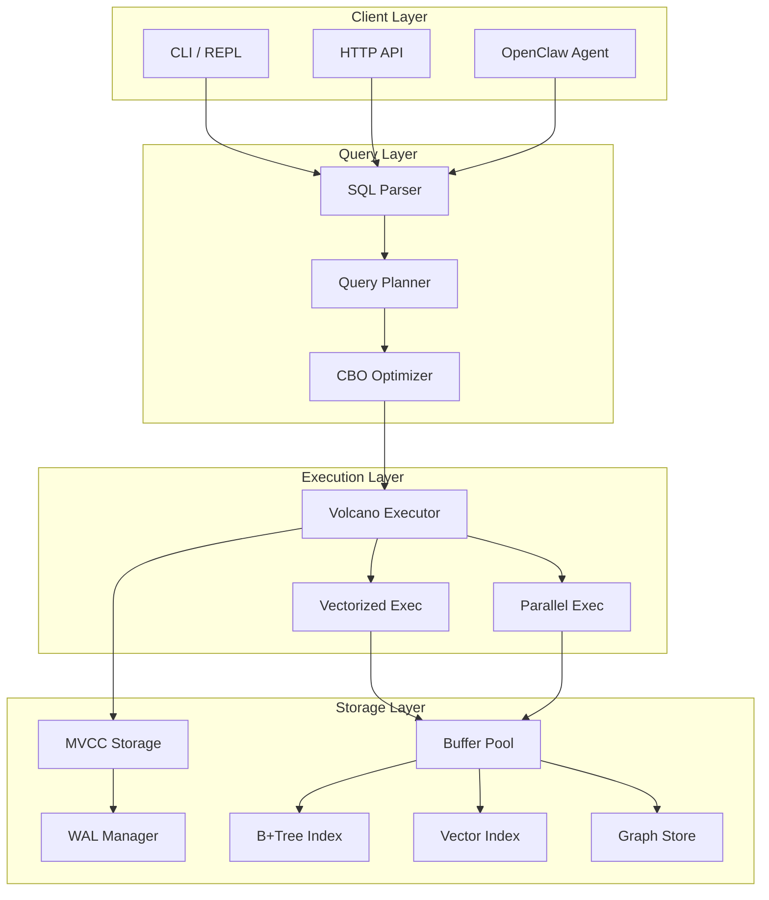

# SQLRustGo v2.5.0 OO 架构文档

**版本**: v2.5.0 (Full Integration + GMP)
**发布日期**: 2026-04-16
**状态**: 里程碑版本

---

## 一、文档目录

```
docs/releases/v2.5.0/oo/
├── architecture/           # 系统架构设计
│   ├── ARCHITECTURE_V2.5.md          # v2.5 架构总览
│   ├── EXECUTION_PIPELINE.md     # 执行流水线
│   └── STORAGE_LAYER.md        # 存储层架构
├── modules/             # 模块设计
│   ├── mvcc/               # MVCC 事务模块
│   │   ├── MVCC_OVERVIEW.md      # MVCC 概述
│   │   ├── SNAPSHOT_ISOLATION.md   # 快照隔离
│   │   └── VERSION_CHAIN.md    # 版本链管理
│   ├── wal/                 # WAL 模块
│   │   ├── WAL_DESIGN.md       # WAL 设计
│   │   └── PITR_RECOVERY.md   # PITR 恢复
│   ├── executor/             # 执行器模块
│   │   ├── VECTORIZED_EXEC.md  # 向量化执行
│   │   ├── PARALLEL_EXEC.md   # 并行执行
│   │   └── QUERY_PIPELINE.md  # 查询流水线
│   ├── graph/               # 图引擎模块
│   │   ├── CYPHER_DESIGN.md  # Cypher 设计
│   │   ├── TRAVERSAL_ALGO.md # 遍历算法
│   │   └── GRAPH_STORAGE.md  # 图存储
│   ├── vector/              # 向量索引模块
│   │   ├── HNSW_DESIGN.md    # HNSW 设计
│   │   ├── IVF_DESIGN.md     # IVF 设计
│   │   ├── IVFPQ_DESIGN.md  # IVFPQ 设计
│   │   └── SIMD_ACCEL.md    # SIMD 加速
│   ├── unified-query/       # 统一查询模块
│   │   ├── UNIFIED_API.md   # 统一查询 API
│   │   └── RESULT_FUSION.md # 结果融合
│   └── openclaw/            # OpenClaw 接口模块
│       ├── AGENT_GATEWAY.md # Agent 网关
│       └── AGENT_SCHEMA.md  # Schema API
├── algorithms/         # 核心算法设计
│   ├── CBO_OPTIMIZER.md     # 基于成本优化器
│   ├── JOIN_ALGORITHMS.md   # JOIN 算法
│   ├── INDEX_ALGORITHMS.md  # 索引算法
│   └── BLOOM_FILTER.md      # Bloom Filter
├── api/               # API 参考
│   ├── STORAGE_API.md
│   ├── TRANSACTION_API.md
│   ├── QUERY_API.md
│   └── GRAPH_API.md
├── user-guide/         # 用户指南
│   ├── QUICK_START.md
│   ├── CONFIGURATION.md
│   └── TROUBLESHOOTING.md
└── reports/           # 报告
    ├── SECURITY_ANALYSIS.md
    ├── PERFORMANCE_REPORT.md
    └── SQL_COMPLIANCE.md
```

---

## 二、架构演进

### v2.5.0 架构特点

| 特性 | v1.6.0 | v2.0 | v2.5.0 |
|------|---------|------|--------|
| 执行模型 | Volcano | Cascades | 向量化 + 并行 |
| 事务 | MVCC Phase-1 | MVCC Phase-1 | MVCC + WAL |
| 索引 | B+Tree | B+Tree + Hash | B+Tree + 向量 + 图 |
| 图支持 | 无 | 无 | Cypher Phase-1 |
| 向量 | 无 | IVF | HNSW + IVFPQ + SIMD |
| 优化器 | RBO | Cascades | CBO + BloomFilter |
| 查询API | SQL | SQL | SQL + 向量 + 图 |

---

## 三、核心模块关系



---

## 四、模块设计原则

### 4.1 What-Why-How 模板

每个模块文档使用以下格式：

```markdown
## 模块名称

### What (是什么)
[模块功能的简要描述]

### Why (为什么)
[为什么需要这个模块，解决什么问题]

### How (如何实现)
#### 核心数据结构
[主要数据结构]
#### 关键算法
[算法描述]
#### UML 图
```
```

### 4.2 UML 图例

```
┌────────────────────┐      ┌────────────────────┐
│    ClassName       │      │   <<interface>>   │
│------------------│      │    TraitName     │
│ - field: Type    │      │------------------│
│ + method()       │      │ + method()        │
└────────┬─────────┘      └────────┬─────────┘
         │                        ▲
         │                        │
         ▼                        │
┌────────────────────┐          │
│  <<structure>>    │          │
│    Component      │──────────┘
│-------------------|
│ - data           │
└─────────────────┘
```

---

## 五、关键设计决策

### 5.1 MVCC + WAL 集成

| 决策点 | 选择 | 理由 |
|--------|------|------|
| 隔离级别 | 快照隔离 | MySQL/PostgreSQL 兼容 |
| 版本存储 | VersionChainMap | 只追加，无锁读 |
| WAL 模式 | 同步写入 | 崩溃恢复保证 |
| GC 策略 | 后台线程 | 不阻塞事务 |

### 5.2 向量索引选择

| 场景 | 推荐索引 | 理由 |
|------|----------|------|
| 小规模 (<100K) | Flat | 100% 召回 |
| 中规模 (100K-1M) | HNSW | O(log n) 搜索 |
| 大规模 (>1M) | IVFPQ | 10x 内存压缩 |

### 5.3 图查询策略

| 查询类型 | 算法 | 复杂度 |
|----------|------|--------|
| 最短路径 | BFS | O(V+E) |
| 模式匹配 | DFS | O(V+E) |
| 多跳查询 | MultiHop | O(k×E) |

---

## 六、快速导航

| 模块 | 设计文档 |
|------|----------|
| MVCC | [oo/modules/mvcc](./modules/mvcc/) |
| WAL | [oo/modules/wal](./modules/wal/) |
| 向量化执行 | [oo/modules/executor](./modules/executor/) |
| 图引擎 | [oo/modules/graph](./modules/graph/) |
| 向量索引 | [oo/modules/vector](./modules/vector/) |
| 统一查询 | [oo/modules/unified-query/) |
| OpenClaw | [oo/modules/openclaw](./modules/openclaw/) |

---

*本文档由 SQLRustGo Team 维护*
*更新日期: 2026-04-16*