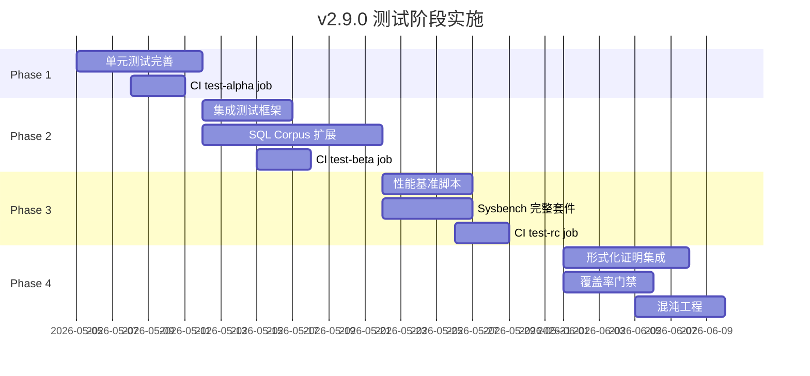

# v2.9.0 测试策略与阶段演化设计

> **文档**: docs/releases/v2.9.0/TEST_STRATEGY.md
> **版本**: 1.0
> **日期**: 2026-05-02

---

## 1. v2.7.0 / v2.8.0 测试回顾与教训

### 已存在但未充分利用的测试

| 测试类型 | 数量 | 问题 |
|---------|------|------|
| 单元测试 (lib) | 3630+ (#[test]) | 分布不均，部分 crate 覆盖不足 |
| 集成测试 (tests/) | 28 文件 | 仅在手动触发时运行，未纳入 CI 门禁 |
| SQL Corpus | 103 文件 / 426 用例 | 通过率已达 85.4% 但 C-02~C-06 未开发 |
| TPC-H 基准 | 2 文件 + 数据集生成器 | 仅手动运行，无基线数据 |
| Sysbench | 1 脚本 (point_select) | 缺少完整 OLTP 测试套件 |
| 稳定性测试 | 72h + 并发压力 | 耗时极长，从未在 CI 执行 |
| 覆盖率 | 6 个 JSON 报告 | 有收集无门禁，覆盖率目标未强制执行 |

### 教训总结

```
❌ v2.7.0/2.8.0 错误模式:
  开发 → 拖到 RC → 才测集成 → 发现大量问题 → 来不及修

✅ v2.9.0 纠正:
  每个阶段有对应测试级别 → 尽早发现 → 逐步收紧
```

---

## 2. 测试分层架构

```
                    ┌─────────────────────────┐
                    │      G-Gate (GA)        │
                    │ ┌─────────────────────┐ │
                    │ │   R-Gate (RC)       │ │
                    │ │ ┌─────────────────┐ │ │
                    │ │ │   B-Gate (Beta) │ │ │
                    │ │ │ ┌─────────────┐ │ │ │
                    │ │ │ │ A-Gate (α)  │ │ │ │
                    │ │ │ │ ┌─────────┐ │ │ │ │
                    │ │ │ │ │ Develop │ │ │ │ │
                    │ │ │ │ │ 单元测试 │ │ │ │ │
                    │ │ │ │ │ lint    │ │ │ │ │
                    │ │ │ │ │ fmt     │ │ │ │ │
                    │ │ │ │ └─────────┘ │ │ │ │
                    │ │ │ ├─────────────┤ │ │ │
                    │ │ │ │ 集成测试    │ │ │ │
                    │ │ │ │ 模块测试    │ │ │ │
                    │ │ │ └─────────────┘ │ │ │
                    │ │ ├─────────────────┤ │ │
                    │ │ │ SQL Corpus     │ │ │ │
                    │ │ │ 性能基准       │ │ │ │
                    │ │ │ 回归测试       │ │ │ │
                    │ │ └─────────────────┘ │ │
                    │ ├─────────────────────┤ │
                    │ │ TPC-H 基准         │ │ │
                    │ │ Sysbench OLTP      │ │ │
                    │ │ 安全审计           │ │ │
                    │ │ 稳定性测试 (72h)   │ │ │
                    │ └─────────────────────┘ │
                    ├─────────────────────────┤
                    │ 覆盖率门禁(≥85%)        │
                    │ 混沌工程                │
                    │ 形式化证明验证          │
                    └─────────────────────────┘
```

---

## 3. 各阶段测试要求

### Phase 1: 开发阶段 (develop/v2.9.0)

**目标**: 每提交 PR 前必须通过，单次运行 < 15min

| 测试 | 命令 | 要求 | CI 集成 |
|------|------|------|---------|
| 编译检查 | `cargo build --workspace` | 无错误 | ✅ 必须 |
| 单元测试 (lib) | `cargo test --lib --all-features` | 100% PASS | ✅ 必须 |
| 代码规范 | `cargo clippy --all-features -- -D warnings` | 零警告 | ✅ 必须 |
| 格式化 | `cargo fmt --check` | 无 diff | ✅ 必须 |
| 新增特性测试 | `cargo test -p <crate>` | 新增 + 回归 | ✅ 必须 |
| 分布式模块 | `cargo test -p sqlrustgo-distributed` | 627 PASS | ✅ R8 规则 |

**门禁**: PRE_COMMIT hook + CI lint-build job

### Phase 2: Alpha 阶段 (alpha/v2.9.0)

**目标**: 功能完整集成验证，单次 < 60min

| 测试 | 命令 | 要求 | CI 集成 |
|------|------|------|---------|
| 全量单元测试 | `cargo test --all-features` | 100% PASS | ✅ Gitea Actions |
| 集成测试 | `cargo test --test '*'` | 28 文件全通过 | ✅ 新增 |
| SQL Corpus | `cargo test -p sqlrustgo-sql-corpus` | ≥85% pass | ✅ 新增 |
| 回归测试 | `cargo test --test regression_test` | 无回归 | ✅ 新增 |
| 覆盖率基线 | `cargo tarpaulin --ignore-tests` | ≥50% | 📊 记录 |

**新增 CI job**: `test-alpha` → 全量测试 + SQL Corpus + 集成

### Phase 3: Beta 阶段 (beta/v2.9.0)

**目标**: 性能 + 兼容性验证，新增 ≈30min

| 测试 | 命令 | 要求 | CI 集成 |
|------|------|------|---------|
| 全量 Alpha 测试 | 同上 | 全部 PASS | ✅ |
| 性能基准 (基准) | `cargo bench --bench tpch_bench -- --quick` | 记录基线 | ✅ 新增 |
| Sysbench OLTP | `bash scripts/sysbench/point_select.sh --threads=8` | ≥1,800 QPS | ✅ 新增 |
| SQL Corpus 提升 | C-02~C-06 逐步引入 | ≥90% | ✅ |
| 安全测试 | `cargo test -p sqlrustgo-security` | 81 PASS | ✅ 新增 |
| 覆盖率门禁 | (由 Alpha 数据驱动) | ≥65% | 📊 门禁 |

**新增 CI job**: `test-beta` → 性能基准 + sysbench + 安全

### Phase 4: RC 阶段 (rc/v2.9.0)

**目标**: 生产级验证，单次 ≈2h（含长测试）

| 测试 | 命令 | 要求 | CI 集成 |
|------|------|------|---------|
| 全量 Alpha+Beta | 同上 | 全部 PASS | ✅ |
| TPC-H 基准 | `cargo run --bin tpch_bench -- --scale=1` | 记录 QPS | ✅ 新增 |
| Sysbench 完整 OLTP | `bash scripts/sysbench/oltp_read_write.sh` | ≥5K QPS | ✅ 新增 |
| 并发压力 | `cargo test --test concurrency_stress_test -- --ignored` | 无死锁 | ⏰ 定时 |
| 72h 稳定性 | `cargo test --test long_run_stability_72h_test -- --ignored` | 无崩溃 | ⏰ 定时 |
| 形式化证明 | `bash scripts/verify/dafny-verify.sh` | PROOF-011~014 PASS | ✅ |
| 覆盖率门禁 | | ≥80% | 📊 门禁 |

**新增 CI job**: `test-rc` → TPC-H + sysbench + 并发

### Phase 5: GA 阶段 (v2.9.0)

**目标**: 最终全面验证

| 测试 | 命令 | 要求 |
|------|------|------|
| 全部前序测试 | 累计 | 100% PASS |
| 混沌工程 | CPU 80% + 网络丢包 30% | 服务自愈 |
| 安全审计 | `bash scripts/gate/check_attack_surface.sh` | AV1-AV5 全部覆盖 |
| 覆盖率门禁 | | ≥85% |
| 形式化证明 | 全部 4 条 | verified=true |
| 发布检查清单 | `docs/governance/RELEASE_GATE_CHECKLIST.md` | 全部 ✅ |

---

## 4. 新测试开发计划

### 4.1 CI 工作流扩展

```yaml
# .gitea/workflows/ci.yml 新增 jobs
jobs:
  lint-build:     # 现有：develop 阶段
  test-alpha:     # 🆕 Alpha + Beta 阶段
    - cargo test --all-features --lib
    - cargo test --test '*' --all-features
    - cargo test -p sqlrustgo-sql-corpus
  test-beta:      # 🆕 Beta + RC 阶段
    - cargo bench --bench tpch_bench -- --quick
    - bash scripts/sysbench/point_select.sh
    - cargo test -p sqlrustgo-security
  test-rc:        # 🆕 RC + GA 阶段
    - bash scripts/sysbench/oltp_read_write.sh
    - bash scripts/verify/*.sh
  gate-verify:    # 现有
```

### 4.2 缺少的测试脚本

| 脚本 | 用途 | 所属阶段 | 优先级 |
|------|------|---------|--------|
| `scripts/sysbench/oltp_read_write.sh` | Sysbench 完整 OLTP 读写混合 | RC | P0 |
| `scripts/test/run_integration.sh` | 一键运行 28 个集成测试 | Alpha | P0 |
| `scripts/test/run_security.sh` | 安全测试套件 | Beta | P1 |
| `scripts/test/run_perf_baseline.sh` | 性能基线记录 | Beta | P1 |
| `scripts/test/run_coverage_gate.sh` | 覆盖率门禁检查 | Beta→RC | P1 |

### 4.3 C-02~C-06 测试用例

| 特性 | 测试用例数 | 来源 | 阶段 |
|------|-----------|------|------|
| C-02 CTE (WITH clause) | 32 sql files | sql_corpus/ADVANCED/ | Beta |
| C-03 JSON 操作 | 20 sql files | 新建 | RC |
| C-04 窗口函数 | 25 sql files | 新建 | RC |
| C-05 DISTINCT | 15 sql files | sql_corpus 已有 | Alpha |
| C-06 CASE/WHEN | 20 sql files | 新建 | Beta |

---

## 5. 测试质量度量

### 5.1 测试通过率要求

```
develop → cargo test --lib:             100%
Alpha   → cargo test --all-features:     100%
          SQL Corpus:                    ≥85%
          Integration:                   100%
Beta    → 安全测试:                      100%
          Perf 基准:                     记录基线 (不阻塞)
RC      → TPC-H:                        记录 QPS
          Sysbench OLTP:                ≥5K QPS
          72h 稳定:                      无 crash
GA      → 覆盖率:                        ≥85%
          形式化证明:                     4/4 verified
```

### 5.2 测试分层与 `#[ignore]` 管理

| 标记 | 用途 | 运行时机 |
|------|------|---------|
| `#[test]` | 快速单元测试 | 每次 commit / CI lint |
| `#[test]` (集成) | 中等速度集成测试 | Alpha CI test |
| `#[bench]` | 性能基准 | Beta/RC CI |
| `#[ignore]` | 极慢测试 (72h) | RC 定时任务 |

**⚠️ v2.9.0 规定**: `#[ignore]` 只能用于运行时间 > 30min 的测试（如 72h 稳定性、大规模数据基准），且必须加注释说明原因和预计时间。所有其他测试不得使用 `#[ignore]`。

---

## 6. 实施路线图



### 6.1 各项预计工时

| 任务 | 工时 | 依赖 |
|------|------|------|
| 1. 新建 `scripts/test/run_integration.sh` | 1d | - |
| 2. CI 新增 `test-alpha` job | 1d | 任务1 |
| 3. CI 新增 `test-beta` job (含 sysbench) | 1d | 任务2 |
| 4. CI 新增 `test-rc` job (含 TPC-H) | 1d | 任务3 |
| 5. C-02~C-06 SQL 测试用例开发 | 15d | - |
| 6. Sysbench OLTP 读写混合脚本 | 2d | - |
| 7. 性能基线记录脚本 | 1d | - |
| 8. 覆盖率门禁脚本 | 2d | - |
| 9. 形式化证明 CI 集成 | 3d | - |
| **合计** | **27d** | |

---

## 7. 与原计划的映射

```yaml
# 对应 contract/v2.9.0.json 规则
R4 (Full execution):   cargo test --all-features → 每个阶段延伸
R5 (Baseline):         verification_report.json 中的 test_count 随阶段更新
R6 (Monotonicity):     各阶段测试数不可逆减少
R8 (Distributed gate): cargo test -p sqlrustgo-distributed → 扩展到所有 crate

# 对应 Phase 任务
E-08 (Performance):    Sysbench ≥10K QPS → Beta/RC 阶段测量
C-02~C-06:             SQL Corpus 测试用例开发 → 开发阶段并行
G-04 (CI/CD):          test-alpha/beta/rc job 实施 → CI 自动运行
```
