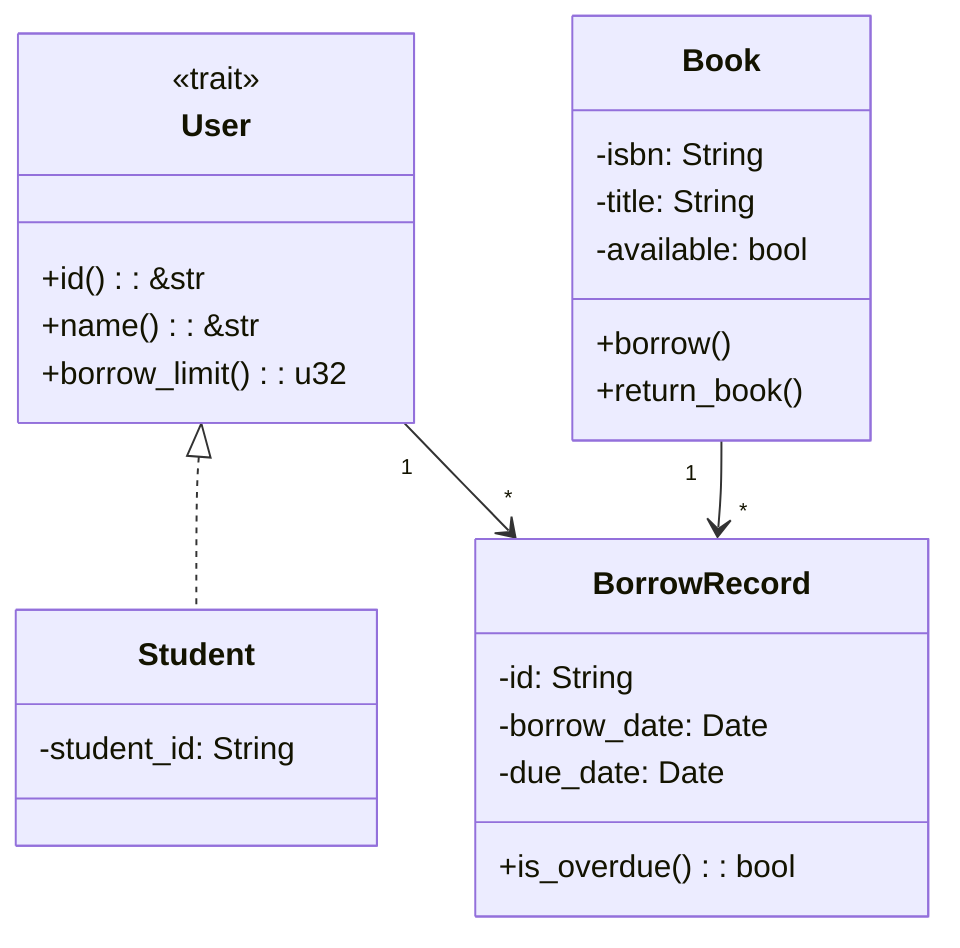

# 第3周：面向对象分析与设计实践

> **实验时间**：2学时（80分钟）
> **指导时间**：40分钟
> **练习时间**：40分钟
> **实验类型**：设计性
> **案例**：高校图书借阅系统
> **前置知识**：第3讲 - 面向对象分析、设计与实现

---

## 一、实验目标

- [ ] 掌握面向对象分析（OOA）方法
- [ ] 掌握面向对象设计（OOD）方法
- [ ] 理解 SOLID 设计原则
- [ ] 能够绘制类图

---

## 二、实验环境

- TRAE IDE（或 VS Code）
- Git
- Mermaid 插件（VS Code 扩展）

---

## 三、实验案例：高校图书借阅系统

### 需求描述

> 学生和教师可以借阅图书。每本图书有ISBN、书名、作者、出版社。借阅时需登记借阅人、借阅日期、应还日期。图书管理员负责管理图书和借阅记录。系统需要记录借阅历史，并支持逾期罚款计算。

---

# 第一部分：教师指导（40分钟）

---

## 步骤1：需求分析 - 对象发现（10分钟）

### 1.1 提取名词

从需求中提取所有名词：

| 类别 | 名词 |
|------|------|
| 角色 | 学生、教师、图书管理员 |
| 实体 | 图书、ISBN、书名、作者、出版社 |
| 业务 | 借阅人、借阅日期、应还日期、借阅记录、借阅历史、逾期罚款 |

### 1.2 筛选核心对象

| 对象 | 类型 | 说明 |
|------|------|------|
| 用户 | 实体 | 学生和教师的抽象 |
| 图书 | 实体 | 核心业务对象 |
| 借阅记录 | 实体 | 记录借阅信息 |
| 图书管理员 | 角色 | 系统用户 |
| 逾期罚款 | 值对象 | 借阅记录的属性 |

### 1.3 确定关系

```
用户 ──借阅──→ 借阅记录 ←──被借阅── 图书
图书管理员 ──管理──→ 图书
```

---

## 步骤2：类图设计（15分钟）

### 2.1 设计类结构

```rust
// 用户抽象（trait）
pub trait User {
    fn id(&self) -> &str;
    fn name(&self) -> &str;
    fn borrow_limit(&self) -> u32;
}

// 学生
pub struct Student {
    student_id: String,
    name: String,
}

// 图书
pub struct Book {
    isbn: String,
    title: String,
    author: String,
    available: bool,
}

// 借阅记录
pub struct BorrowRecord {
    id: String,
    user_id: String,
    book_isbn: String,
    borrow_date: Date,
    due_date: Date,
    return_date: Option<Date>,
}
```

### 2.2 SOLID 原则应用

**单一职责**：
```rust
// ❌ 违反：同时处理业务和持久化
struct User { fn save(&self) { ... } }

// ✅ 正确：分离
struct User { ... }           // 业务
struct UserRepository { ... } // 持久化
```

**依赖倒置**：
```rust
// 依赖抽象接口
pub struct BorrowService<T: BorrowRepository> {
    repository: T,
}
```

### 2.3 类图（Mermaid）



---

## 步骤3：代码实现（15分钟）

### 3.1 项目结构

```
src/
├── models/
│   ├── mod.rs
│   ├── user.rs
│   ├── book.rs
│   └── borrow_record.rs
├── services/
│   └── mod.rs
└── main.rs
```

### 3.2 核心代码

```rust
// src/models/user.rs
pub trait User {
    fn id(&self) -> &str;
    fn name(&self) -> &str;
    fn borrow_limit(&self) -> u32;
}

pub struct Student {
    pub student_id: String,
    pub name: String,
}

impl User for Student {
    fn id(&self) -> &str { &self.student_id }
    fn name(&self) -> &str { &self.name }
    fn borrow_limit(&self) -> u32 { 5 }
}
```

### 3.3 验证编译

```bash
cargo build
```

---

# 第二部分：学生练习（40分钟）

---

## 练习1：完善类图（15分钟）

### 任务

1. 添加 `Teacher` 类，继承 `User`
2. 添加 `FineCalculator` 接口
3. 在 `BorrowRecord` 中添加罚款计算方法

### 检查点

- [ ] Teacher 类正确继承 User
- [ ] FineCalculator 定义完整

---

## 练习2：实现代码（15分钟）

### 任务

1. 实现 `Teacher` 结构体
2. 实现 `Book` 的 `borrow()` 和 `return_book()` 方法
3. 实现 `BorrowRecord` 的 `is_overdue()` 方法

### 检查点

- [ ] 代码编译通过
- [ ] 测试用例通过

---

## 练习3：实验报告（10分钟）

### 提交内容

1. 对象分析列表
2. 完整类图（Mermaid 代码）
3. 核心代码片段
4. 实验心得

### Git 提交

```bash
git add .
git commit -m "experiment: week-03 OOAD"
git push origin develop/v1.4.0
```

---

# 评分标准

| 检查项 | 分值 |
|--------|------|
| 对象识别正确 | 15 |
| 关系类型准确 | 15 |
| SOLID 原则应用 | 20 |
| 类图规范 | 20 |
| 代码实现 | 15 |
| Git 提交 | 15 |

---

# 思考题

1. 为什么要先 OOA 再 OOD？
2. 如何判断类的职责是否单一？
3. 如果新增"预约"功能，如何修改类图？

---

**实验完成日期**: ____________

**得分**: ____________
