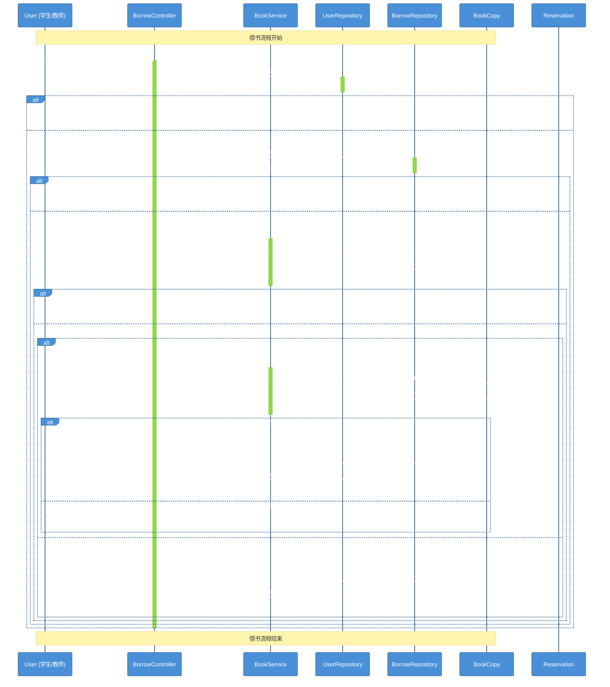
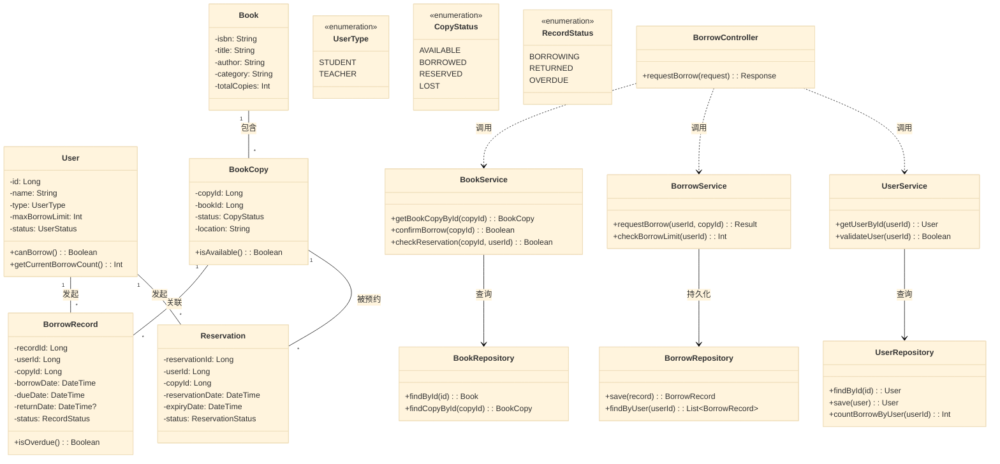
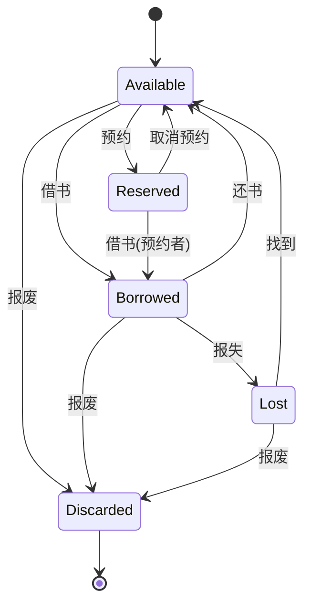
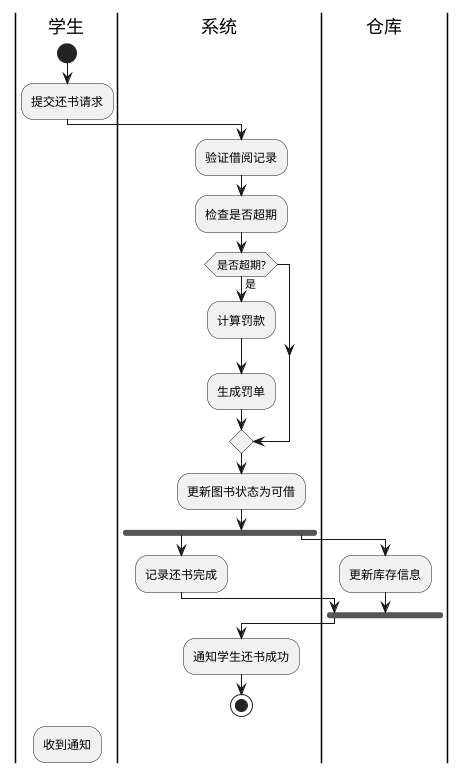

# 第4周：OOA到OOP学生上机实践过程记录

> 实践时间：2学时
> 实践类型：设计性
> 前置知识：第4周课程 - OOAD动态建模与架构设计

---

## 一、实践目标

- [ ] 掌握从用例图过渡到顺序图的方法
- [ ] 理解OOA到OOD再到OOP的转换过程
- [ ] 能够使用AI辅助生成顺序图和类图
- [ ] 理解关键设计决策及其理由

---

## 二、实践过程记录

### 2.1 阶段一：用例图生成

#### 操作步骤

1. 打开Trae IDE，进入AI对话模式
2. 输入用例图生成请求

#### AI提示词

```
请为"高校图书借阅系统"生成用例图，使用Mermaid语法。

参与者：学生、教师、图书管理员
用例：登录、查询图书、借书、还书、管理图书、预约图书、查看借阅历史、计算罚款

关系：
- 学生和教师可以登录、查询图书、借书、还书、预约图书、查看借阅历史
- 图书管理员可以登录、管理图书、查看所有借阅记录
- 借书和还书都包含查询图书（<<include>>）
- 还书包含计算罚款（<<include>>）
- 预约图书扩展借书（<<extend>>）
```

#### AI生成结果

```mermaid
%%{init: {'theme': 'base', 'themeVariables': { 'primaryColor': '#4A90D9', 'primaryTextColor': '#fff', 'primaryBorderColor': '#2C5F8D', 'lineColor': '#666', 'secondaryColor': '#F5F5F5', 'tertiaryColor': '#FAFAFA'}}}%%
graph LR
    subgraph "参与者"
        Student("学生")
        Teacher("教师")
        Librarian("图书管理员")
    end

    subgraph "用例"
        Login("登录")
        QueryBook("查询图书")
        BorrowBook("借书")
        ReturnBook("还书")
        ManageBook("管理图书")
        ReserveBook("预约图书")
        ViewHistory("查看借阅历史")
        ViewAllRecords("查看所有借阅记录")
        CalculateFine("计算罚款")
    end

    Student --> Login
    Student --> QueryBook
    Student --> BorrowBook
    Student --> ReturnBook
    Student --> ReserveBook
    Student --> ViewHistory

    Teacher --> Login
    Teacher --> QueryBook
    Teacher --> BorrowBook
    Teacher --> ReturnBook
    Teacher --> ReserveBook
    Teacher --> ViewHistory

    Librarian --> Login
    Librarian --> ManageBook
    Librarian --> ViewAllRecords

    BorrowBook ..> QueryBook : <<include>>
    ReturnBook ..> QueryBook : <<include>>
    ReturnBook ..> CalculateFine : <<include>>

    ReserveBook ---> BorrowBook : <<extend>>
```

#### 用例图说明

| 关系类型 | 符号 | 说明 |
|---------|------|------|
| 关联 | `-->` | 参与者与用例之间的交互 |
| 包含 | `..>` | 用例之间的关系，表示必须执行 |
| 扩展 | `--->` | 用例之间的可选扩展关系 |

---

### 2.2 阶段二：从用例图到顺序图的过渡

#### 为什么要从用例图过渡到顺序图？

**问题思考**：

- 用例图只说"借书"，但**如何借**？对象如何交互？
- 不知道谁和谁交互
- 不知道何时判断条件
- 不知道缺失什么对象

**答案**：顺序图揭示对象间的**消息传递、时间顺序、激活周期**

#### 用例图与顺序图的对比

| 用例图 | 顺序图 |
|--------|--------|
| 描述系统功能 | 描述对象交互 |
| 参与者与用例的关系 | 对象之间如何通信 |
| 静态视图 | 动态视图 |
| "谁可以做什么" | "做了什么之后谁响应" |

---

### 2.3 阶段三：借书流程详细分析

#### 3.1 借书流程活动图

```
┌─────────────────────────────────────────────────────────────────────────────┐
│                         借书流程活动图                                        │
├─────────────────────────────────────────────────────────────────────────────┤
│                                                                             │
│   ┌──────────┐     ┌──────────┐     ┌──────────┐     ┌──────────┐         │
│   │  用户登录  │ ──▶ │ 查询图书  │ ──▶ │ 选择图书  │ ──▶ │ 检查库存  │         │
│   └──────────┘     └──────────┘     └──────────┘     └──────────┘         │
│                                                           │                │
│                                                           ▼                │
│   ┌──────────┐     ┌──────────┐     ┌──────────┐     ┌──────────┐         │
│   │ 返回结果  │ ◀── │ 记录借阅  │ ◀── │ 检查用户  │ ◀── │ 检查预约  │         │
│   └──────────┘     └──────────┘     └──────────┘     └──────────┘         │
│                                                                             │
└─────────────────────────────────────────────────────────────────────────────┘
```

#### 3.2 识别关键对象（实体）

| 对象 | 类型 | 职责 | 关键属性 |
|------|------|------|----------|
| **User** | 实体 | 代表借阅者 | id, name, type, maxBorrowLimit |
| **Book** | 实体 | 图书信息 | isbn, title, author |
| **BookCopy** | 实体 | 图书副本/库存 | copyId, status, location |
| **BorrowRecord** | 实体 | 借阅记录 | recordId, borrowDate, dueDate |
| **Reservation** | 实体 | 预约记录 | reservationId, userId, copyId |
| **BorrowController** | 控制 | 处理借书请求 | 接收请求，调度业务 |
| **BookService** | 控制 | 图书业务逻辑 | 查询、检查、确认 |
| **UserService** | 控制 | 用户业务逻辑 | 验证、权限检查 |
| **Repository** | 数据 | 数据持久化 | 增删改查 |

---

### 2.4 阶段四：顺序图生成

#### AI提示词

```
根据用例图定义的参与者，和基础的对象，进行细化，生成借书过程的顺序图。
步骤2——顺序图：细化"借书"用例的交互

为什么用顺序图？
用例图只说"借书"，但 如何借 ？对象如何交互？
顺序图揭示对象间的 消息传递、时间顺序、激活周期
帮助识别 缺失的对象或职责
借书流程的交互分析
给我详细的分析，和 OOD 设计，设法完成 OOA到OOP 实现之间的设计，并且解释，为什么要这样做。
```

#### AI生成的顺序图



#### 顺序图说明

1. **激活条 (activate/deactivate)**：表示对象的活动时间
2. **alt 片段**：表示条件分支（对应代码中的 if-else）
3. **返回消息**：虚线表示返回值
4. **消息流**：实线箭头表示方法调用

---

### 💡 为什么要完成顺序图后更新类图？

#### 问题引出

完成顺序图后，我们已经知道：
- 有哪些对象参与了交互
- 对象之间如何消息传递
- 有哪些条件分支

**但类图还是第3周那个版本，没有反映顺序图中的新发现！**

#### 顺序图揭示的问题

| 顺序图发现 | 类图需要反映 |
|-----------|-------------|
| 需要 BorrowController | 添加控制类 |
| 需要 BookService/UserService | 添加服务类 |
| 需要 Repository 接口 | 添加抽象接口 |
| 方法调用链 | 添加方法签名 |
| 条件分支逻辑 | 添加业务方法（如 checkBorrowLimit） |

#### 更新类图的三原则

```
┌─────────────────────────────────────────────────────────────────────────────┐
│                         更新类图的三原则                                    │
├─────────────────────────────────────────────────────────────────────────────┤
│                                                                             │
│  原则1: 补充缺失的类                                                        │
│  ─────────────────────                                                      │
│  顺序图中的每个参与者都应该对应一个类                                        │
│  如果类图中没有，就需要添加                                                  │
│                                                                             │
│  原则2: 添加必要的方法                                                       │
│  ─────────────────────                                                      │
│  顺序图中的每条消息都对应一个方法调用                                        │
│  类图需要添加这些方法（方法名、参数、返回值）                                │
│                                                                             │
│  原则3: 体现协作关系                                                        │
│  ─────────────────────                                                      │
│  顺序图中的调用关系映射到类图的依赖关系                                      │
│  服务类依赖仓储接口（依赖倒置）                                              │
│                                                                             │
└─────────────────────────────────────────────────────────────────────────────┘
```

#### 具体更新步骤

| 步骤 | 操作 | 示例 |
|------|------|------|
| 1 | 列出顺序图中所有对象 | User, BorrowController, BookService, BorrowRepository... |
| 2 | 检查类图是否有对应类 | 发现 BookService 不存在 → 添加 |
| 3 | 从消息提取方法 | `getUserById(userId)` → UserRepository 添加 find_by_id 方法 |
| 4 | 确定依赖关系 | Controller → Service → Repository（依赖倒置） |
| 5 | 验证多重性 | User 与 BorrowRecord 是一对多 |

#### 示例：第3周类图 vs 第4周更新后

```
第3周类图（更新前）：
┌─────────┐       ┌─────────┐
│  User   │       │  Book   │
├─────────┤       ├─────────┤
│-id      │       │-isbn    │
│-name    │       │-title   │
└─────────┘       └─────────┘

第4周类图（更新后）：
┌──────────────┐    ┌──────────────┐    ┌──────────────┐
│ BorrowController│    │BookService  │    │UserService   │
├──────────────┤    ├──────────────┤    ├──────────────┤
│+borrow()     │───>│+getBook()   │───>│+checkLimit() │
└──────────────┘    └──────────────┘    └──────────────┘
        │                   │                   │
        ▼                   ▼                   ▼
┌──────────────────────────────────────────────────────────┐
│                    Repository 接口                        │
│  (依赖倒置：Service依赖接口，不依赖具体实现)              │
└──────────────────────────────────────────────────────────┘
```

#### 💡 AI提示词的来源解析

**问题**：这个AI提示词是怎么得到的？

**答案**：是基于**前序步骤的结果**和**设计原则**综合得出的。

##### 1. 前序步骤提供了什么？

| 前序步骤 | 提供的信息 | 如何用于类图生成 |
|----------|-----------|-----------------|
| **阶段一：用例图** | 参与者：学生、教师、图书管理员<br>用例：借书、还书、查询图书... | 确定实体类（User）<br>确定业务范围 |
| **阶段三：对象识别** | 实体对象：User, Book, BookCopy, BorrowRecord, Reservation | 提取实体类清单 |
| **阶段四：顺序图** | 参与对象：BorrowController, BookService, UserService, Repository | 提取服务类、控制器类、仓储接口 |

##### 2. 从顺序图提取类图信息

```
顺序图消息分析：
─────────────────────────────────────────────────────────────
BC -> UR: getUserById(userId)      → UserRepository.find_by_id()
BC -> BR: checkBorrowLimit()       → BorrowRepository.count_by_user()
BC -> BS: getBookCopyById()        → BookService.get_book_copy()
BS -> BCopy: findById()             → BookCopyRepository.find_by_id()
BC -> BS: confirmBorrow()           → BookService.confirm_borrow()
BC -> BR: createBorrowRecord()      → BorrowRepository.save()

提取规则：
- 每个消息发送者/接收者 → 可能是一个类
- 消息名 → 方法名
- 消息参数 → 方法参数
```

##### 3. 设计原则指导结构

| 设计原则 | 应用 | 体现在提示词中 |
|----------|------|---------------|
| **分层架构** | 分离关注点 | Controller → Service → Repository |
| **依赖倒置** | Service依赖接口 | Repository作为接口（trait） |
| **单一职责** | 每个类只做一件事 | 拆分：BorrowService, BookService, UserService |
| **开闭原则** | 对扩展开放 | 接口抽象，便于替换实现 |

---

#### 💡 什么是依赖倒置原则？

##### 1. 传统方式的问题（高耦合）

```
❌ 错误示例：直接依赖具体实现

    ┌─────────────────┐
    │ BorrowService   │  ← 直接依赖具体数据库
    └────────┬────────┘
             │
             ▼
    ┌─────────────────┐
    │ MySQLDatabase  │  ← 具体实现，紧密耦合
    └─────────────────┘

问题：
1. 如果要换成 PostgreSQL，必须修改 BorrowService 的代码
2. 单元测试时，无法用假数据（Mock）替换数据库
3. 违反了"对修改关闭，对扩展开放"的原则
```

##### 2. 依赖倒置的解决方案（低耦合）

```
✅ 正确示例：依赖抽象接口

    ┌─────────────────┐
    │ BorrowService   │  ← 依赖抽象接口
    └────────┬────────┘
             │
             ▼
    ┌─────────────────┐      ┌─────────────────┐
    │ Repository      │◄─────│ 实现：MySQL     │
    │ (接口/trait)   │      └─────────────────┘
    └─────────────────┘      ┌─────────────────┐
            ▲               │ 实现：PostgreSQL │
            │               └─────────────────┘
            │               ┌─────────────────┐
            └──────────────│ 实现：Mock内存   │ ← 测试时用
                           └─────────────────┘

好处：
1. 更换数据库只需要新增一个实现类，不修改业务代码
2. 单元测试可以用 Mock 对象替代真实数据库
3. 依赖关系反转了：原来是高层模块依赖低层模块，现在是都依赖抽象
```

##### 3. 依赖倒置的核心要点

```
依赖倒置原则 (DIP - Dependency Inversion Principle)
═══════════════════════════════════════════════════════

要点1：高层模块不应该依赖低层模块
       Both should depend on abstractions

要点2：抽象不应该依赖细节
       Abstractions should not depend on details

要点3：细节应该依赖抽象
       Details should depend on abstractions
```

##### 4. 代码示例对比

```python
# ❌ 不使用依赖倒置（紧耦合）
class BorrowService:
    def __init__(self):
        self.db = MySQLDatabase()  # 直接依赖具体类
    
    def borrow(self, user_id, book_id):
        # 直接调用数据库方法
        user = self.db.query(f"SELECT * FROM users WHERE id={user_id}")
        ...

# ✅ 使用依赖倒置（松耦合）
class BorrowService:
    def __init__(self, user_repo: UserRepository, book_repo: BookRepository):
        # 依赖抽象接口，不依赖具体实现
        self.user_repo = user_repo
        self.book_repo = book_repo
    
    def borrow(self, user_id, book_id):
        # 通过接口调用
        user = self.user_repo.find_by_id(user_id)
        ...

# 定义接口（抽象）
class UserRepository(ABC):
    @abstractmethod
    def find_by_id(self, user_id: int) -> Optional[User]:
        pass

# 具体实现1：MySQL
class MySQLUserRepository(UserRepository):
    def find_by_id(self, user_id: int) -> Optional[User]:
        # 连接MySQL查询
        ...

# 具体实现2：内存（测试用）
class InMemoryUserRepository(UserRepository):
    def find_by_id(self, user_id: int) -> Optional[User]:
        # 从内存字典获取
        return self.users.get(user_id)

# 测试时使用 Mock
class MockUserRepository(UserRepository):
    def find_by_id(self, user_id: int) -> Optional[User]:
        return User(id=user_id, name="Test User")  # 返回假数据
```

##### 5. 在类图中的体现

```
类图中的依赖倒置关系：
═══════════════════════════════════════════════════════

    BorrowService              UserRepository
    ┌─────────────┐            ┌──────────────────┐
    │             │───────────▶│ <<interface>>    │
    │             │  depends   │                  │
    └─────────────┘            └──────────────────┘
                                       ▲
                                       │ implements
                              ┌─────────┴──────────┐
                              │                    │
                        MySQLRepository    InMemoryRepository
```

##### 6. 为什么要用依赖倒置？

| 场景 | 没有依赖倒置 | 有依赖倒置 |
|------|-------------|-----------|
| 换数据库 | 修改业务代码 | 新增实现类即可 |
| 单元测试 | 需要真实数据库 | 用 Mock 替换 |
| 添加新功能 | 影响现有代码 | 不影响现有代码 |
| 代码复用 | 困难 | 容易 |

##### 7. 依赖倒置 vs 依赖注入

```
关系：
- 依赖倒置是一种设计原则（要遵循的规则）
- 依赖注入是一种实现手段（具体怎么做）

依赖注入的常见方式：
1. 构造函数注入（最常用）
   class BorrowService:
       def __init__(self, user_repo: UserRepository):
           self.user_repo = user_repo

2. setter注入
   class BorrowService:
       def set_user_repo(self, user_repo: UserRepository):
           self.user_repo = user_repo

3. 接口注入
   class UserRepositoryInjector:
       def inject(self, user_repo: UserRepository):
           ...
```

##### 4. 提示词生成公式

```
AI提示词 = "基于" + 顺序图对象 + "生成类图，包括：" 
         + "实体类：" + 从用例图/对象识别提取
         + "服务类：" + 从顺序图消息接收者提取
         + "仓储接口：" + 从顺序图数据访问对象提取
         + "控制器类：" + 从顺序图消息发送者提取
         + "体现：" + 设计原则
```

##### 5. 完整的提示词构建过程

```
步骤1：从用例图提取基础实体
       → User (学生/教师的抽象)
       → Book (核心业务对象)

步骤2：从对象识别补充实体
       → BookCopy (副本)
       → BorrowRecord (借阅记录)
       → Reservation (预约记录)

步骤3：从顺序图提取服务层
       → BorrowController (控制器)
       → BookService (图书业务)
       → UserService (用户业务)

步骤4：从顺序图提取数据访问层
       → UserRepository
       → BookCopyRepository
       → BorrowRecordRepository

步骤5：应用设计原则
       → 分层：Controller → Service → Repository
       → 依赖倒置：Service 依赖 Repository 接口
       → 泛化：学生/教师继承User
```

---

### 2.5 阶段五：OOD类图设计

#### AI提示词

```
基于顺序图生成类图，包括：
- 实体类：User, Book, BookCopy, BorrowRecord, Reservation
- 服务类：BorrowService, BookService, UserService
- 仓储接口：UserRepository, BookCopyRepository, BorrowRecordRepository
- 控制器类：BorrowController

体现：
- 分层架构：Controller -> Service -> Repository
- 依赖倒置：Service依赖Repository接口
- 泛化关系：学生/教师继承User
```

---

#### 💡 为什么要分层？（Controller、Service、Repository）

##### 1. 问题：一个类做所有事情会怎样？

```
❌ 反模式：把所有代码写在一个类里

class BorrowController:
    def borrow_book(self, user_id, book_id):
        # 1. 处理HTTP请求参数
        if not user_id or not book_id:
            return error("参数错误")
        
        # 2. 验证用户（数据库操作）
        conn = MySQL.connect(...)
        user = conn.query(f"SELECT * FROM users WHERE id={user_id}")
        if not user:
            return error("用户不存在")
        
        # 3. 检查借阅上限（数据库操作）
        count = conn.query(f"SELECT COUNT(*) FROM borrow WHERE user_id={user_id}")
        if count >= user.limit:
            return error("已达上限")
        
        # 4. 检查图书库存（数据库操作）
        book = conn.query(f"SELECT * FROM books WHERE id={book_id}")
        if not book or book.stock <= 0:
            return error("图书不可借")
        
        # 5. 创建借阅记录（数据库操作）
        conn.execute(f"INSERT INTO borrow ...")
        
        # 6. 更新库存（数据库操作）
        conn.execute(f"UPDATE books SET stock=stock-1 ...")
        
        # 7. 生成JSON响应
        return json({"success": True})

问题：
1. 代码重复：其他模块也要连接数据库
2. 难以测试：无法单独测试业务逻辑
3. 难以维护：3000行代码，改一处怕影响其他地方
4. 无法复用：借书逻辑无法被其他模块调用
5. 团队协作难：一个人改代码会影响所有人
```

##### 2. 解决方案：分层架构

```
✅ 分层架构：每层只做一件事

┌────────────────────────────────────────────────────────────────────┐
│                     三层架构 (Three-Tier Architecture)              │
├────────────────────────────────────────────────────────────────────┤
│                                                                    │
│   表现层 (Presentation)    业务层 (Business)    数据层 (Data)      │
│   ══════════════════     ══════════════     ══════════════       │
│                                                                    │
│   ┌─────────────────┐    ┌─────────────────┐  ┌─────────────────┐ │
│   │  Controller    │    │    Service     │  │  Repository    │ │
│   │                 │    │                 │  │  (接口/trait)  │ │
│   │ - 处理请求      │───▶│ - 业务逻辑     │───▶│ - 增删改查    │ │
│   │ - 参数校验      │    │ - 规则验证     │  │ - 数据映射    │ │
│   │ - 返回响应      │    │ - 事务管理     │  │                │ │
│   └─────────────────┘    └─────────────────┘  └─────────────────┘ │
│                                                                    │
└────────────────────────────────────────────────────────────────────┘
```

##### 3. 每一层的职责

```
┌─────────────────────────────────────────────────────────────────────────────┐
│                           各层职责说明                                       │
├─────────────────────────────────────────────────────────────────────────────┤
│                                                                             │
│  表现层 (Controller)                                                        │
│  ───────────────────                                                        │
│  职责：处理用户请求和响应                                                   │
│  - 接收HTTP请求，解析参数                                                   │
│  - 参数校验（格式、必填等）                                                 │
│  - 调用Service层处理业务                                                   │
│  - 返回HTTP响应（JSON/XML）                                                │
│  - 处理异常，转换为错误码                                                   │
│                                                                             │
│  示例：                                                                     │
│  - 验证 userId 是否为数字                                                   │
│  - 检查必填参数是否齐全                                                     │
│  - 调用 borrow_service.request_borrow()                                    │
│  - 成功返回 200，失败返回 400/404/500                                      │
│                                                                             │
│  业务层 (Service)                                                           │
│  ─────────────────                                                          │
│  职责：处理核心业务逻辑                                                     │
│  - 编写业务规则和算法                                                       │
│  - 处理业务流程（借书、还书、计算罚款）                                     │
│  - 管理事务（ACID）                                                         │
│  - 协调多个Repository的操作                                                │
│  - 不处理HTTP，只处理业务对象                                               │
│                                                                             │
│  示例：                                                                     │
│  - 检查用户借阅数量是否已达上限                                             │
│  - 检查图书是否可借（考虑预约状态）                                         │
│  - 创建借阅记录，更新图书状态                                               │
│  - 发送通知（邮件/短信）                                                    │
│                                                                             │
│  数据层 (Repository)                                                        │
│  ─────────────────────                                                      │
│  职责：处理数据持久化                                                       │
│  - 定义数据操作接口（增删改查）                                             │
│  - 实现具体的数据库操作                                                     │
│  - 对象与数据库的映射（ORM）                                                │
│  - 不包含业务逻辑                                                           │
│                                                                             │
│  示例：                                                                     │
│  - UserRepository.find_by_id()                                            │
│  - BorrowRepository.save(record)                                           │
│  - BookRepository.update_status()                                          │
│                                                                             │
└─────────────────────────────────────────────────────────────────────────────┘
```

##### 4. 分层的好处

```
分层的价值：
═══════════════════════════════════════════════════════════════

1. 职责清晰
   ┌──────────────┐   改HTTP响应格式  →  只改Controller
   │ Controller   │  改业务规则       →  只改Service  
   │ Service      │  换数据库         →  只改Repository
   │ Repository   │
   └──────────────┘

2. 便于测试
   ┌──────────────┐
   │ Controller   │  → 调用 Service（可以用 Mock 替换）
   │ Service      │  → 调用 Repository（可以用 Mock 替换）
   │ Repository   │  → 调用 真实数据库 或 Mock
   └──────────────┘
   
   测试 Service 时，不需要启动 Web 服务器！
   测试 Repository 时，不需要真实数据库！

3. 代码复用
   ┌──────────────┐
   │ Controller   │  Web API 用
   │ Service      │── CLI 工具可以用
   │ Service      │── 后台定时任务可以用
   └──────────────┘

4. 团队协作
   ┌──────────────┐
   │ 前端工程师   │  → 调 Controller 接口
   │ 后端工程师   │  → 开发 Service + Repository
   │ DBA          │  → 优化 Repository 的 SQL
   └──────────────┘
```

##### 5. 代码示例：分层后的借书

```python
# ============================================================
# 表现层：BorrowController（处理HTTP请求）
# ============================================================
class BorrowController:
    def __init__(self, borrow_service: BorrowService):
        self.borrow_service = borrow_service
    
    def request_borrow(self, request):
        # 1. 参数校验
        user_id = request.get("userId")
        book_id = request.get("bookId")
        if not user_id or not book_id:
            return {"code": 400, "message": "参数错误"}
        
        # 2. 调用Service处理业务
        result = self.borrow_service.borrow(user_id, book_id)
        
        # 3. 返回响应
        if result["success"]:
            return {"code": 200, "data": result}
        else:
            return {"code": 400, "message": result["message"]}

# ============================================================
# 业务层：BorrowService（处理业务逻辑）
# ============================================================
class BorrowService:
    def __init__(self, user_repo: UserRepository, book_repo: BookRepository):
        self.user_repo = user_repo
        self.book_repo = book_repo
    
    def borrow(self, user_id, book_id):
        # 1. 验证用户
        user = self.user_repo.find_by_id(user_id)
        if not user:
            return {"success": False, "message": "用户不存在"}
        
        # 2. 检查借阅上限（业务规则）
        current_count = self.user_repo.count_borrow(user_id)
        if current_count >= user.max_limit:
            return {"success": False, "message": "已达借阅上限"}
        
        # 3. 检查图书状态
        book = self.book_repo.find_by_id(book_id)
        if not book or not book.is_available():
            return {"success": False, "message": "图书不可借"}
        
        # 4. 执行借书
        self.book_repo.update_status(book_id, "BORROWED")
        self.user_repo.add_borrow_record(user_id, book_id)
        
        return {"success": True, "message": "借书成功"}

# ============================================================
# 数据层：Repository（处理数据持久化）
# ============================================================
class UserRepository(ABC):
    @abstractmethod
    def find_by_id(self, user_id): pass
    
    @abstractmethod
    def count_borrow(self, user_id): pass

class MySQLUserRepository(UserRepository):
    def __init__(self, db_connection):
        self.db = db_connection
    
    def find_by_id(self, user_id):
        # SQL查询
        return self.db.query("SELECT * FROM users WHERE id = ?", user_id)
    
    def count_borrow(self, user_id):
        return self.db.query("SELECT COUNT(*) FROM borrow WHERE user_id = ?", user_id)
```

##### 6. 分层 vs MVC

```
常见误解：分层就是MVC？

┌─────────────────────────────────────────────────────────────────┐
│                         MVC vs 分层                             │
├─────────────────────────────────────────────────────────────────┤
│                                                                 │
│  MVC（Model-View-Controller）                                  │
│  - View: 视图（HTML页面、前端）                                 │
│  - Controller: 控制器（处理用户输入）                           │
│  - Model: 模型（数据）                                          │
│                                                                 │
│  这里的"三层架构"                                               │
│  - Controller: 处理请求/响应（类似MVC的Controller）             │
│  - Service: 业务逻辑（MVC里没有对应部分）                       │
│  - Repository: 数据访问（MVC里归为Model的一部分）                │
│                                                                 │
│  关系：                                                          │
│  MVC + Service + Repository = 分层架构                          │
│                                                                 │
│  实际上：                                                        │
│  - Controller 处理"请求"层面的事情                              │
│  - Service 处理"业务"层面的事情                                 │
│  - Repository 处理"数据"层面的事情                              │
│                                                                 │
└─────────────────────────────────────────────────────────────────┘
```

#### AI生成的类图



---

### 💡 状态图AI提示词的关键和知识来源

#### 1. 为什么要用状态图？

| 类图的问题 | 状态图的回答 |
|-----------|-------------|
| 类图只有属性 `available: bool` | 状态图告诉你在什么情况下这个布尔值会变 |
| 不知道什么时候可以借 | 状态图告诉你：可借 → 已借出（借书事件） |
| 不知道有什么特殊情况 | 状态图告诉你：还有"预约中"、"遗失"等状态 |

#### 2. 状态图的核心要素

```
┌─────────────────────────────────────────────────────────────────────────────┐
│                          状态图三要素                                       │
├─────────────────────────────────────────────────────────────────────────────┤
│                                                                             │
│  1. 状态 (State)                                                           │
│     - 对象所处的"状态"：可借、已借出、预约中...                            │
│     - 例如：BookCopy 的状态可以是 AVAILABLE, BORROWED, RESERVED            │
│                                                                             │
│  2. 事件 (Event)                                                           │
│     - 触发状态变化的原因：借书、还书、预约...                              │
│     - 例如：借书事件 导致 AVAILABLE → BORROWED                             │
│                                                                             │
│  3. 转换 (Transition)                                                      │
│     - 状态之间的变化关系                                                   │
│     - 格式：状态 + 事件 [条件] → 新状态                                   │
│                                                                             │
└─────────────────────────────────────────────────────────────────────────────┘
```

#### 3. 什么时候需要画状态图？

```
需要画状态图的情况：
═══════════════════════════════════════════════════════════════

1. 对象有多种状态
   - BookCopy 有：可借、已借出、预约中、遗失、报废
   - BorrowRecord 有：借阅中、已归还、已逾期

2. 状态会发生变化
   - 图书可以从"可借"变成"已借出"
   - 借阅记录可以从"借阅中"变成"已归还"

3. 状态变化有规则
   - 只有"可借"才能被借
   - 只有"预约中"才能被预约者借走

4. 需要知道对象的生命周期
   - 对象从创建到销毁的状态变化过程
```

#### 4. AI提示词的来源和构建

##### AI提示词来源分析

```
AI提示词 = 课程知识点 + 前序步骤结果
```

| 组成部分 | 来源 | 具体内容 |
|----------|------|----------|
| **对象选择** | 类图/顺序图 | BookCopy（图书副本）是借阅的最小单位 |
| **状态列表** | 业务分析 | 结合用例：可借、已借出、预约中、遗失、报废 |
| **事件列表** | 用例图 | 借书、还书、预约、取消预约、报失 |
| **转换规则** | 业务逻辑 | 借书:可借→已借出，还书:已借出→可借 |

##### 提示词构建步骤

```
步骤1：从类图中找到有"状态"属性的对象
       → BookCopy 有 status: CopyStatus

步骤2：分析业务场景，确定所有可能的状态
       → 可借、已借出、预约中、遗失、报废

步骤3：从用例图中提取所有相关事件
       → 借书、还书、预约、取消预约、报失、找到

步骤4：确定状态转换规则
       → 借书: 可借 → 已借出
       → 还书: 已借出 → 可借

步骤5：确定初始状态和终止状态
       → 初始: 可借
       → 终止: 报废（图书销毁）
```

#### 5. AI提示词示例

```
基于以下信息生成状态图：

1. 对象：BookCopy（图书副本）
2. 状态列表：可借(Available)、已借出(Borrowed)、预约中(Reserved)、遗失(Lost)、报废(Discarded)
3. 事件列表：借书、还书、预约、取消预约、报失、找到、报废
4. 转换规则：
   - 借书: Available → Borrowed
   - 预约: Available → Reserved  
   - 取消预约: Reserved → Available
   - 借书(预约后): Reserved → Borrowed
   - 还书: Borrowed → Available
   - 报失: Borrowed → Lost
   - 找到: Lost → Available
   - 报废: Any → Discarded
5. 初始状态：Available
6. 终止状态：Discarded
7. 内部活动：Borrwed状态时 entry/记录借出时间; do/计算借阅时长; exit/记录归还时间
```

#### 6. 状态图到代码的映射

| 状态图元素 | 代码实现 | 示例 |
|-----------|---------|------|
| 状态 | 枚举 | `enum CopyStatus { AVAILABLE, BORROWED, RESERVED, LOST }` |
| 事件 | 方法 | `fn borrow()` 触发状态变更 |
| 转换规则 | match/if | `match current_status { BORROWED => ... }` |
| 内部活动 | 生命周期钩子 | Rust: `impl Drop` / Python: `__enter__/__exit__` |

#### 7. 状态图示例（Mermaid）



---

### 💡 活动图AI提示词的关键和知识来源

#### 1. 活动图 vs 顺序图

```
┌─────────────────────────────────────────────────────────────────────────────┐
│                    活动图 vs 顺序图 对比                                    │
├─────────────────────────────────────────────────────────────────────────────┤
│                                                                             │
│  顺序图 (Sequence Diagram)                                                 │
│  ──────────────────────────                                                │
│  - 强调对象之间的**交互消息**                                              │
│  - 展示**时间顺序**（谁先调用谁）                                         │
│  - 适合描述单个业务流程中对象的协作                                        │
│  - 关注"谁做了什么"                                                         │
│                                                                             │
│  活动图 (Activity Diagram)                                                 │
│  ──────────────────────────                                                │
│  - 强调活动的**流程和步骤**                                                │
│  - 展示**分支决策**和**并行处理**                                          │
│  - 适合描述整个业务流程的走向                                               │
│  - 关注"做什么"而不是"谁做"                                                │
│                                                                             │
│  互补关系：                                                                 │
│  - 活动图给出全景视图（地图）                                              │
│  - 顺序图给出详细交互（导航）                                              │
│                                                                             │
└─────────────────────────────────────────────────────────────────────────────┘
```

#### 2. 泳道（Swimlane）是什么？

```
泳道的定义：
═══════════════════════════════════════════════════════════════════════

泳道 = 活动图中的"分栏" = 职责划分

┌─────────────────────────────────────────────────────────────────┐
│                      活动图（带泳道）                           │
├──────────────────┬──────────────────┬──────────────────────────┤
│    学生          │    系统           │    仓库                  │
├──────────────────┼──────────────────┼──────────────────────────┤
│                  │                  │                          │
│  提交还书请求  ──┼──▶  验证记录    │                          │
│                  │                  │                          │
│                  │  检查超期？ ────┼──▶  计算罚款             │
│                  │                  │                          │
│                  │  更新状态      ──┼──▶  更新库存             │
│                  │                  │                          │
│  收到通知      ◀─┼───  记录完成    │                          │
│                  │                  │                          │
└──────────────────┴──────────────────┴──────────────────────────┘
         ▲                    ▲                   ▲
         │                    │                   │
       泳道1               泳道2               泳道3
```

#### 3. 泳道的用途和优点

```
泳道的价值：
═══════════════════════════════════════════════════════════════════════

1. 明确职责分工
   - 谁负责什么工作一目了然
   - 学生：提交请求、接收通知
   - 系统：验证、计算、更新
   - 仓库：接收图书、更新库存

2. 便于团队协作
   - 不同泳道可以交给不同的人/团队开发
   - 前端工程师 → 学生泳道
   - 后端工程师 → 系统泳道
   - 仓库管理员 → 仓库泳道（如果有实体仓库系统）

3. 优化流程
   - 找出哪个泳道（部门/模块）最繁忙
   - 发现流程瓶颈

4. 支持多种划分方式
   - 按角色划分（学生、管理员）
   - 按部门划分（教务处、图书馆）
   - 按系统划分（Web端、移动端）
```

#### 4. 活动图的核心要素

```
┌─────────────────────────────────────────────────────────────────────────────┐
│                          活动图四要素                                       │
├─────────────────────────────────────────────────────────────────────────────┤
│                                                                             │
│  1. 活动 (Activity)                                                        │
│     - 要做的具体动作：提交请求、验证记录、计算罚款                           │
│                                                                             │
│  2. 决策节点 (Decision)                                                    │
│     - 条件分支：是否超期？                                                 │
│     - 符号：菱形 ◊                                                         │
│                                                                             │
│  3. 并行处理 (Fork/Join)                                                   │
│     - 同时进行多个活动                                                     │
│     - 符号：粗黑线 ║                                                       │
│                                                                             │
│  4. 泳道 (Swimlane)                                                        │
│     - 划分职责区域                                                         │
│     - 每个泳道代表一个角色/部门/系统                                       │
│                                                                             │
└─────────────────────────────────────────────────────────────────────────────┘
```

#### 5. AI提示词的来源和构建

##### 从前序步骤获取信息

```
AI提示词 = 用例图 + 顺序图 + 状态图 + 设计原则
```

| 信息来源 | 获取内容 | 具体内容 |
|----------|---------|----------|
| **用例图** | 还书用例 | 学生可以还书、还书包含计算罚款 |
| **顺序图** | 交互对象 | 学生、系统、仓库（可选） |
| **状态图** | 状态变化 | 图书从"已借出"变为"可借" |
| **业务分析** | 流程步骤 | 提交→验证→检查超期→更新→通知 |

##### 提示词构建步骤

```
步骤1: 确定泳道（从顺序图/业务分析）
       → 学生：提交请求、接收通知
       → 系统：验证、计算、更新、通知
       → 仓库：接收图书、更新库存

步骤2: 确定活动流程（从用例图/顺序图）
       → 提交还书 → 验证记录 → 检查超期 → 更新状态 → 并行处理 → 通知

步骤3: 识别决策点（从业务逻辑）
       → 是否超期？是 → 计算罚款，否 → 跳过

步骤4: 识别并行点（从业务分析）
       → 记录还书和更新库存可以同时进行

步骤5: 组合成完整提示词
       → 添加语法要求（fork/join, diamond）
```

##### 完整提示词示例

```
请为"高校图书借阅系统"的还书流程生成活动图，使用PlantUML语法。

泳道：学生、系统、仓库

流程：
- 学生提交还书请求
- 系统验证借阅记录
- 如果超期，计算罚款并生成罚单
- 系统更新图书状态为可借
- 并行：
   - 系统记录还书完成
   - 仓库更新库存信息
- 结束

使用fork/join表示并行，使用diamond表示决策
```

#### 6. 活动图示例（PlantUML）



#### 7. 活动图到代码的映射

| 活动图元素 | 代码实现 | 示例 |
|-----------|---------|------|
| 活动步骤 | 函数/方法 | `fn validate_record()` |
| 决策节点 | if/else 或 match | `if is_overdue { ... }` |
| 并行处理 | 多线程/异步 | `tokio::spawn()` / `asyncio.gather()` |
| 泳道 | 模块/类分组 | 按模块组织代码 |

---

### 2.6 阶段六：OOD设计到OOP实现

#### 6.1 实体类实现

```python
from dataclasses import dataclass
from datetime import datetime, date
from enum import Enum
from typing import Optional

class UserType(Enum):
    STUDENT = "学生"
    TEACHER = "教师"

class CopyStatus(Enum):
    AVAILABLE = "可借"
    BORROWED = "已借出"
    RESERVED = "已预约"
    LOST = "遗失"

class RecordStatus(Enum):
    BORROWING = "借阅中"
    RETURNED = "已归还"
    OVERDUE = "已逾期"

@dataclass
class User:
    id: int
    name: str
    user_type: UserType
    max_borrow_limit: int
    status: str = "active"
    _current_borrow_count: int = 0

    def can_borrow(self) -> bool:
        return self.status == "active" and self._current_borrow_count < self.max_borrow_limit

@dataclass
class BookCopy:
    copy_id: int
    book_id: int
    status: CopyStatus
    location: str

    def is_available(self) -> bool:
        return self.status == CopyStatus.AVAILABLE
```

#### 6.2 服务层实现

```python
from abc import ABC, abstractmethod

class UserRepository(ABC):
    @abstractmethod
    def find_by_id(self, user_id: int) -> Optional[User]:
        pass

class BorrowService:
    def __init__(
        self,
        user_repo: UserRepository,
        book_copy_repo: BookCopyRepository,
        borrow_record_repo: BorrowRecordRepository
    ):
        self.user_repo = user_repo
        self.book_copy_repo = book_copy_repo
        self.borrow_record_repo = borrow_record_repo

    def request_borrow(self, user_id: int, copy_id: int) -> dict:
        # 1. 验证用户
        user = self.user_repo.find_by_id(user_id)
        if not user or not user.can_borrow():
            return {"success": False, "message": "用户无效或已冻结"}

        # 2. 检查借阅数量
        # 3. 检查图书状态
        # 4. 执行借阅
        # ... (详见顺序图)
```

---

## 三、关键设计决策解释

### 3.1 为什么需要 BookCopy 而不是直接用 Book？

```
问题：一本《Python编程》可以有 5 本副本（复本）
- 副本1: 已在借
- 副本2: 可借
- 副本3: 已预约
- 副本4: 正在维修
- 副本5: 可借

答案：如果只用一个 Book 对象，无法精确管理每本书的状态！
BookCopy（副本）代表具体的物理书籍，是借阅的最小单位。
```

### 3.2 为什么要用 Repository 接口？

```python
# 不使用接口（紧耦合）
class BorrowService:
    def __init__(self):
        self.db = MySQLDatabase()  # 直接依赖具体数据库

# 使用接口（松耦合，可测试）
class BorrowService:
    def __init__(self, user_repo: UserRepository):  # 依赖抽象
        self.user_repo = user_repo
```

**好处**：

- 便于单元测试（可以用 Mock 对象替代）
- 可替换数据库实现（从 MySQL 改为 PostgreSQL 不影响业务代码）
- 符合依赖倒置原则

### 3.3 为什么要分层？

```
Controller: 职责是处理请求/响应
Service:    职责是业务逻辑
Repository: 职责是数据访问

各层各司其职，符合单一职责原则
便于分工协作和独立测试
```

---

## 四、OOA到OOD再到OOP的转换映射

### 4.1 转换路径

```
┌─────────────────────────────────────────────────────────────────────────────┐
│                        OOA → OOD → OOP 转换路径                             │
├─────────────────────────────────────────────────────────────────────────────┤
│                                                                             │
│   OOA (面向对象分析)         OOD (面向对象设计)          OOP (面向对象编程)  │
│   ─────────────────         ─────────────────          ─────────────────   │
│                                                                             │
│   用例: 借书              ──▶  类: BorrowService    ──▶  class BorrowService │
│                           ──▶  类: BorrowRecord     ──▶  @dataclass          │
│                                                                             │
│   参与者: 学生/教师        ──▶  类: User             ──▶  class User          │
│                                                                             │
│   图书副本                 ──▶  类: BookCopy         ──▶  class BookCopy      │
│                                                                             │
│   借阅记录                 ──▶  类: BorrowRecord     ──▶  @Entity             │
│                                                                             │
│   (无)                     ──▶  接口: Repository     ──▶  abstract class      │
│                                                                             │
│   流程: 验证→检查→借阅     ──▶  方法: request_borrow ──▶  def request_borrow  │
│                                                                             │
└─────────────────────────────────────────────────────────────────────────────┘
```

### 4.2 UML到代码的映射

| UML图元素 | 代码实现 |
|----------|----------|
| 类名 | 结构体名 |
| 属性 | 字段 |
| 方法 | 方法 |
| 关联 | 字段持有引用或ID |
| 继承 | trait + impl |
| 接口 | trait |

| 顺序图元素 | 代码实现 |
|------------|----------|
| 消息 | 方法调用 |
| 激活条 | 函数调用栈 |
| alt | if-else或match |

---

## 五、实践心得

### 5.1 从用例图到顺序图的过渡要点

1. **为什么需要顺序图？**
   - 用例图描述"谁可以做什么"（静态视图）
   - 顺序图描述"做了什么之后谁响应"（动态视图）
   - 用例图只说"借书"，顺序图揭示"如何借"

2. **如何从用例图识别顺序图对象？**
   - 从参与者映射到实体对象（User）
   - 从用例映射到服务对象（Service/Controller）
   - 从包含关系识别数据访问对象（Repository）

3. **OOA到OOD的转换**
   - 顺序图中的对象 → 类图中的类
   - 消息传递 → 方法调用
   - 激活周期 → 对象的生命周期

### 5.2 AI工具使用体验

| 方面 | 体验 |
|------|------|
| 用例图生成 | 简单直接，AI能准确理解参与者、用例、关系 |
| 顺序图生成 | 需要提供详细的流程步骤，否则生成的图不完整 |
| 类图生成 | 基于顺序图生成效果最好，AI能识别服务层和仓储层 |
| 代码生成 | 迭代细化很有效，从基础结构到完整系统逐步完善 |

---

## 六、检查点

- [ ] 用例图生成完成
- [ ] 顺序图生成完成（包含条件分支）
- [ ] 类图设计完成（体现分层架构）
- [ ] 关键设计决策已解释
- [ ] OOA→OOD→OOP转换已记录

---

## 七、提交

将本实践记录保存为 `reports/week-04/OOA-OOP实践过程.md`，包含：

1. 用例图截图
2. 顺序图截图
3. 类图截图
4. 代码片段
5. 设计决策说明

---

**实践完成日期**: ____________

**得分**: ____________

**助教签名**: ____________
