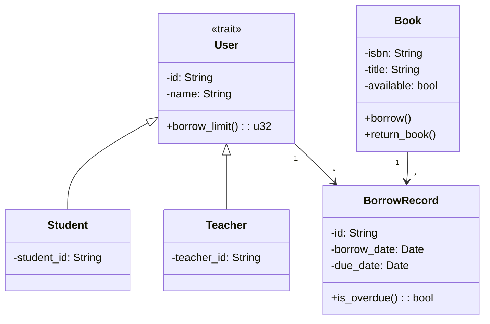
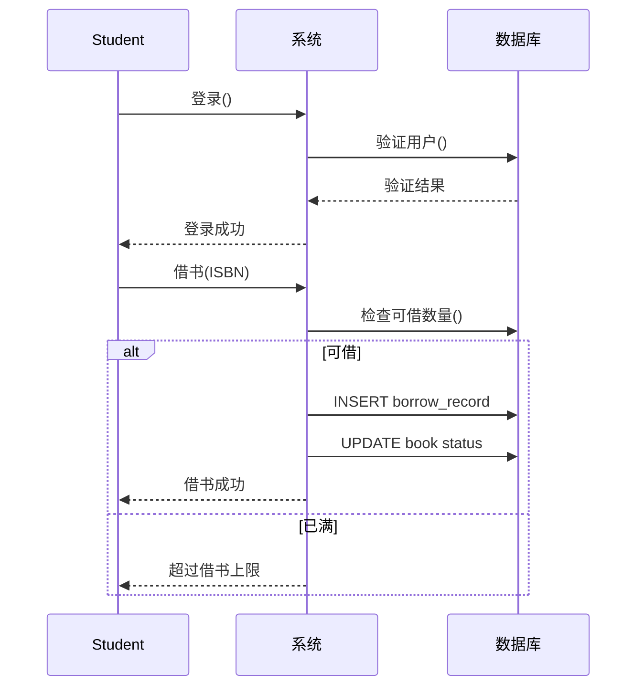
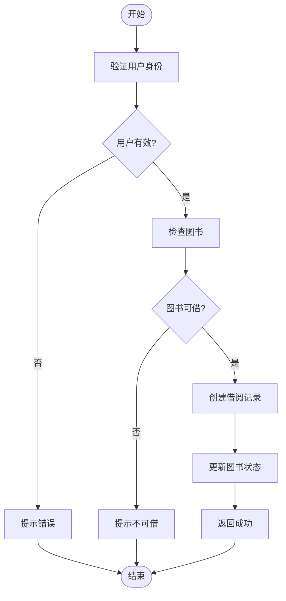

# 第4周：UML 规范与图例实践

> **实验时间**：2学时（80分钟）
> **指导时间**：40分钟
> **练习时间**：40分钟
> **实验类型**：设计性
> **案例**：高校图书借阅系统
> **前置知识**：第4讲 - UML 规范与图例

---

## 一、实验目标

- [ ] 掌握用例图绘制方法
- [ ] 掌握类图绘制方法
- [ ] 掌握顺序图绘制方法
- [ ] 掌握活动图绘制方法

---

## 二、实验环境

- TRAE IDE（或 VS Code）
- Git
- Mermaid 插件（VS Code 扩展）

---

## 三、实验案例：高校图书借阅系统

### 需求描述

> 学生和教师可以借阅图书。每本图书有ISBN、书名、作者。借阅时需登记借阅日期、应还日期。系统需要记录借阅历史。

---

# 第一部分：教师指导（40分钟）

---

## 步骤1：用例图（10分钟）

### 1.1 识别参与者

| 参与者 | 说明 |
|--------|------|
| 学生 | 借书、还书、查询 |
| 教师 | 借书、还书、查询 |
| 管理员 | 管理图书、管理用户 |

### 1.2 识别用例

| 参与者 | 用例 |
|--------|------|
| 学生/教师 | 登录、查询图书、借书、还书 |
| 管理员 | 登录、管理图书、管理用户 |

### 1.3 用例图（Mermaid）

```mermaid
use case
left to right direction

actor Student
actor Teacher
actor Admin

rectangle 图书管理系统 {
    usecase 登录
    usecase 查询图书
    usecase 借书
    usecase 还书
    usecase 管理图书
    
    Student --> 登录
    Student --> 查询图书
    Student --> 借书
    Student --> 还书
    
    Teacher --> 登录
    Teacher --> 查询图书
    Teacher --> 借书
    Teacher --> 还书
    
    Admin --> 登录
    Admin --> 管理图书
    
    借书 ..> 查询图书 : <<include>>
    还书 ..> 查询图书 : <<include>>
}
```

---

## 步骤2：类图（10分钟）

### 2.1 识别类

- `User`（抽象）
- `Student`
- `Teacher`
- `Book`
- `BorrowRecord`

### 2.2 类图（Mermaid）



---

## 步骤3：顺序图（10分钟）

### 3.1 识别参与者

- Student
- System
- Database

### 3.2 借书流程

```
1. Student → System: 登录()
2. System → Database: 验证
3. Database → System: 结果
4. Student → System: 借书(ISBN)
5. System → Database: 检查
6. System → Database: 创建记录
7. System → Student: 成功
```

### 3.3 顺序图（Mermaid）



---

## 步骤4：活动图（10分钟）

### 4.1 借书流程

```
开始 → 验证身份 → 检查用户 → 检查图书 → 创建记录 → 更新状态 → 结束
```

### 4.2 活动图（Mermaid）



---

# 第二部分：学生练习（40分钟）

---

## 练习1：用例图完善（10分钟）

### 任务

1. 为"预约图书"功能添加用例
2. 添加"查看借阅历史"用例
3. 绘制完整的用例图

### 检查点

- [ ] 参与者识别完整
- [ ] 用例关系正确（包含/扩展）

---

## 练习2：状态图（10分钟）

### 任务

绘制图书的状态图：

```
在库 → 借出 → 归还 → 在库
在库 → 报废
借出 → 逾期
```

### 检查点

- [ ] 状态定义正确
- [ ] 转换条件标注

---

## 练习3：部署图（10分钟）

### 任务

绘制图书管理系统的部署图：

- Web 客户端
- 应用服务器
- MySQL 数据库
- Redis 缓存

### 检查点

- [ ] 节点标注正确
- [ ] 通信协议标注

---

## 练习4：提交（10分钟）

### 提交内容

将所有 Mermaid 图整合到一个 Markdown 文件

### Git 提交

```bash
git add .
git commit -m "experiment: week-04 UML diagrams"
git push origin develop/v1.4.0
```

---

# 评分标准

| 检查项 | 分值 |
|--------|------|
| 用例图正确 | 15 |
| 类图正确 | 20 |
| 顺序图正确 | 20 |
| 活动图正确 | 20 |
| 状态图/部署图 | 10 |
| Git 提交 | 15 |

---

# 思考题

1. 用例图和类图的区别？
2. 顺序图和活动图的应用场景？
3. 何时使用架构图 vs 部署图？

---

**实验完成日期**: ____________

**得分**: ____________
