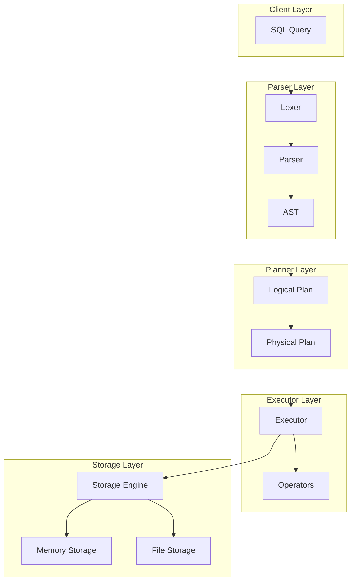
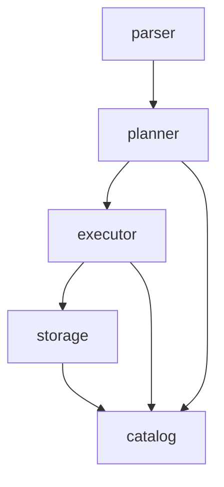

# 实验五：架构设计实践（第5周）

## 实验基本信息

| 项目 | 内容 |
|------|------|
| **课程名称** | AI增强的软件工程 |
| **实验学时** | 2学时 |
| **实验类型** | 设计性 |
| **实验项目** | SQLRustGo架构设计 |

---

## 实验目的

1. 掌握数据库系统架构设计的基本原理
2. 能够使用AI辅助进行SQLRustGo 1.0架构设计
3. 能够绘制架构图并编写架构设计文档
4. 理解架构设计中的各种约束和权衡
5. 掌握如何有效地提示AI生成架构设计方案

---

## 实验环境

- 操作系统：macOS / Linux / Windows 10+
- 开发工具：TRAE IDE
- 绘图工具：Mermaid（通过Markdown支持）
- 版本控制：Git
- 项目：SQLRustGo

---

## 实验内容

### 任务1：架构设计原理学习（20分钟）

#### 步骤1：复习架构设计基础知识

1. **架构设计的核心原则**：
   - 高内聚低耦合
   - 关注点分离
   - 单一职责
   - 开闭原则

2. **数据库系统的核心组件**：
   - SQL解析器（Parser）
   - 查询规划器（Planner）
   - 查询优化器（Optimizer）
   - 执行引擎（Executor）
   - 存储引擎（Storage Engine）

3. **分层架构的优势**：
   - 模块化设计，便于理解和维护
   - 每层可独立测试和开发
   - 易于替换和扩展特定组件

---

### 任务2：使用AI辅助架构设计（30分钟）

#### 步骤1：设计有效的AI提示词

**提示词模板**：

```
请为SQLRustGo 1.0数据库系统设计架构，要求：

1. 系统功能：
   - 支持基本SQL查询（SELECT、INSERT、UPDATE、DELETE）
   - 支持数据持久化
   - 支持基本事务处理
   - 支持并发访问

2. 架构要求：
   - 采用分层架构
   - 模块边界清晰
   - 接口设计合理
   - 使用Rust语言实现

3. 请提供：
   - 整体架构图（Mermaid格式）
   - 核心组件说明
   - 模块间的依赖关系
   - 关键接口设计
   - 架构设计的约束和权衡
```

#### 步骤2：分析AI生成的架构方案

1. **评估架构方案**：
   - 架构是否清晰合理
   - 模块划分是否恰当
   - 接口设计是否合理
   - 是否满足功能需求

2. **调整和优化**：
   - 结合SQLRustGo的实际情况进行调整
   - 确保架构符合1.0版本的目标（跑通最小闭环）
   - 避免过度设计和过早抽象

---

### 任务3：绘制架构图（25分钟）

#### 步骤1：使用Mermaid绘制架构图

**SQLRustGo 1.0架构图**：



#### 步骤2：绘制模块依赖图



---

### 任务4：编写架构设计文档（25分钟）

#### 步骤1：创建架构设计文档

创建 `docs/design/architecture_v1.0.md` 文件，包含以下内容：

```markdown
# SQLRustGo 1.0 架构设计文档

## 1. 架构概述

SQLRustGo 1.0采用分层架构设计，旨在实现一个最小可行的数据库系统，跑通核心执行流程。

## 2. 核心组件

### 2.1 Parser Layer
- **功能**：SQL解析、语法检查
- **组件**：Lexer（词法分析器）、Parser（语法分析器）、AST（抽象语法树）
- **输入**：SQL字符串
- **输出**：AST（Statement枚举）

### 2.2 Planner Layer
- **功能**：查询规划
- **组件**：Logical Plan（逻辑执行计划）、Physical Plan（物理执行计划）
- **输入**：AST（来自Parser层）
- **输出**：Physical Plan（执行计划）

### 2.3 Executor Layer
- **功能**：查询执行
- **组件**：Executor（执行引擎）、Operators（执行算子）
- **输入**：Physical Plan（来自Planner层）
- **输出**：查询结果

### 2.4 Storage Layer
- **功能**：数据存储
- **组件**：StorageEngine（存储引擎接口）、MemoryStorage（内存存储）、FileStorage（文件存储）
- **输入**：读写请求（来自Executor层）
- **输出**：数据或操作结果

### 2.5 Catalog
- **功能**：元数据管理
- **组件**：TableSchema、ColumnSchema
- **输入**：元数据操作请求
- **输出**：元数据信息

## 3. 执行流程

1. **SQL解析**：将SQL字符串解析为AST
2. **查询规划**：将AST转换为逻辑执行计划，再转换为物理执行计划
3. **查询执行**：执行物理执行计划，调用相应的算子
4. **数据访问**：通过存储引擎访问和修改数据
5. **结果返回**：将执行结果返回给客户端

## 4. 设计约束

### 4.1 技术约束
- **语言**：Rust
- **性能**：内存安全、并发安全
- **可维护性**：代码结构清晰，易于理解

### 4.2 功能约束
- **SQL支持**：基本DML语句（SELECT、INSERT、UPDATE、DELETE）
- **事务支持**：基本事务功能
- **并发控制**：简单的并发控制机制
- **持久化**：基本的数据持久化

### 4.3 架构约束
- **分层架构**：严格的分层设计，避免跨层依赖
- **接口设计**：清晰的接口定义，便于扩展
- **依赖方向**：单向依赖，避免循环依赖

## 5. 权衡决策

### 5.1 存储引擎选择
- **内存存储**：速度快，适合测试和开发
- **文件存储**：持久化，适合生产环境
- **权衡**：在1.0版本中同时支持两种存储引擎，以满足不同场景需求

### 5.2 执行模型选择
- **迭代器模型**：简单易实现，适合1.0版本
- **向量化执行**：性能更好，但实现复杂
- **权衡**：1.0版本采用迭代器模型，为后续版本预留向量化执行的扩展空间

### 5.3 优化器选择
- **规则优化**：简单易实现
- **成本优化**：更智能，但需要统计信息
- **权衡**：1.0版本采用基本的规则优化，为后续版本的成本优化做准备

## 6. 扩展点

### 6.1 存储引擎扩展
- 接口：`StorageEngine` trait
- 实现：可添加新的存储引擎（如列存、分布式存储等）

### 6.2 执行算子扩展
- 接口：`Operator` trait
- 实现：可添加新的执行算子（如Join、Aggregate等）

### 6.3 SQL语法扩展
- 接口：Parser模块
- 实现：可添加对更多SQL语法的支持

## 7. 测试策略

- **单元测试**：针对每个模块进行测试
- **集成测试**：测试模块间的协作
- **端到端测试**：测试完整的执行流程

## 8. 部署考虑

- **依赖管理**：使用Cargo管理依赖
- **构建系统**：使用Cargo构建系统
- **发布策略**：语义化版本控制

## 9. 未来演进

- **1.1版本**：添加更多SQL语法支持
- **1.2版本**：实现向量化执行和成本优化
- **1.3版本**：增强事务支持和并发控制
- **2.0版本**：实现分布式执行
```

#### 步骤2：文档审核

1. **完整性检查**：确保文档包含所有必要的部分
2. **一致性检查**：确保架构图与文档描述一致
3. **可行性检查**：确保架构设计在1.0版本的范围内是可行的

---

### 任务5：Git提交（15分钟）

#### 步骤1：创建分支

```bash
git checkout -b docs/architecture-v1.0
```

#### 步骤2：添加文件

```bash
git add docs/design/architecture_v1.0.md
git add docs/tutorials/教学计划/week-5-架构设计.md
```

#### 步骤3：提交并推送

```bash
git commit -m "docs: add architecture design for v1.0"
git push origin docs/architecture-v1.0
```

---

## 实验要求

1. **架构设计文档**：完整、清晰、符合规范
2. **架构图**：使用Mermaid绘制，结构清晰
3. **AI辅助**：能够有效地提示AI生成架构设计方案
4. **Git操作**：提交规范，分支命名合理
5. **实验报告**：包含实验过程、遇到的问题和解决方法

---

## 实验报告内容

1. **实验过程**：详细描述架构设计的过程
2. **AI提示词**：记录使用的AI提示词及其效果
3. **架构图**：包含完整的架构图
4. **设计决策**：说明关键的设计决策和权衡
5. **遇到的问题**：记录实验过程中遇到的问题及解决方法
6. **收获与体会**：总结架构设计的收获和体会

---

## 架构设计教程：如何有效地从头设计SQLRustGo 1.0

### 1. 架构设计准备

#### 1.1 明确设计目标
- **核心目标**：跑通最小闭环
- **具体目标**：数据流可运行、执行链路成立、基本功能可验证
- **架构要求**：简单直接，避免过度设计

#### 1.2 了解技术栈
- **语言**：Rust（内存安全、并发安全）
- **工具**：Cargo（依赖管理和构建）
- **测试**：Rust测试框架

---

### 2. 如何有效地提示AI

#### 2.1 提示词设计原则
- **明确目标**：清晰说明设计目标和范围
- **具体要求**：详细描述功能需求和架构要求
- **格式要求**：指定输出格式（如Mermaid架构图）
- **约束条件**：说明技术和功能约束

#### 2.2 有效的提示词示例

```
请为SQLRustGo 1.0数据库系统设计架构，要求：

1. 系统功能：
   - 支持基本SQL查询（SELECT、INSERT、UPDATE、DELETE）
   - 支持数据持久化
   - 支持基本事务处理
   - 支持并发访问

2. 架构要求：
   - 采用分层架构
   - 模块边界清晰
   - 接口设计合理
   - 使用Rust语言实现
   - 适合1.0版本（跑通最小闭环）

3. 请提供：
   - 整体架构图（Mermaid格式）
   - 核心组件说明
   - 模块间的依赖关系
   - 关键接口设计
   - 架构设计的约束和权衡
   - 避免过度设计，保持简单直接
```

#### 2.3 评估AI输出
- **架构合理性**：是否符合数据库系统的基本架构
- **实现可行性**：是否在1.0版本的范围内可行
- **代码质量**：生成的代码是否符合Rust最佳实践
- **可扩展性**：是否为未来扩展预留空间

---

### 3. 架构图绘制技巧

#### 3.1 Mermaid语法基础
- **流程图**：`graph TD`（从上到下）或 `graph LR`（从左到右）
- **子图**：`subgraph "子图名称"`
- **节点**：`Node["节点名称"]`
- **边**：`A --> B`（有向边）
- **注释**：`%% 注释内容`

#### 3.2 架构图设计原则
- **层次清晰**：从上到下或从左到右表示数据流向
- **模块明确**：每个模块职责清晰
- **关系明确**：模块间的依赖关系清晰
- **简洁明了**：避免过于复杂的图表

#### 3.3 常见架构图类型
- **系统架构图**：展示整体架构和模块关系
- **执行流程图**：展示数据处理流程
- **模块依赖图**：展示模块间的依赖关系
- **类图**：展示接口和实现关系

---

### 4. 架构设计约束

#### 4.1 技术约束
- **语言约束**：Rust的所有权系统和借用检查
- **性能约束**：内存使用、执行速度
- **并发约束**：线程安全、锁竞争

#### 4.2 功能约束
- **SQL支持**：1.0版本只支持基本DML语句
- **事务支持**：基本事务功能，不要求复杂的隔离级别
- **存储支持**：支持内存和文件存储

#### 4.3 架构约束
- **分层架构**：严格的分层设计，避免跨层依赖
- **接口设计**：清晰的接口定义，便于扩展
- **依赖方向**：单向依赖，避免循环依赖
- **模块大小**：每个模块保持合理大小，便于理解和维护

---

### 5. 架构设计步骤

#### 5.1 需求分析
- 明确系统功能需求
- 确定技术约束和性能要求
- 识别核心业务流程

#### 5.2 架构风格选择
- 选择分层架构
- 确定各层的职责边界
- 设计模块间的接口

#### 5.3 组件设计
- 识别核心组件
- 设计组件间的交互方式
- 定义组件的接口和实现

#### 5.4 架构评估
- 评估架构的合理性和可行性
- 识别潜在的性能瓶颈
- 检查架构的可扩展性

#### 5.5 文档编写
- 编写架构设计文档
- 绘制架构图
- 记录设计决策和权衡

---

### 6. 常见架构设计问题及解决方法

#### 6.1 过度设计
- **症状**：架构过于复杂，包含不必要的组件
- **原因**：追求完美，忽视1.0版本的目标
- **解决方法**：回到核心目标，删除不必要的组件，保持简单直接

#### 6.2 抽象过早
- **症状**：引入过多的抽象层和接口
- **原因**：担心未来扩展，提前设计通用接口
- **解决方法**：根据当前需求设计接口，预留扩展点但不过度设计

#### 6.3 依赖混乱
- **症状**：模块间相互依赖，形成循环依赖
- **原因**：缺乏清晰的依赖方向
- **解决方法**：定义清晰的依赖方向，确保单向依赖

#### 6.4 性能瓶颈
- **症状**：架构设计存在潜在的性能问题
- **原因**：缺乏性能考虑，设计不合理
- **解决方法**：分析关键路径，优化数据流向，合理使用缓存

---

### 7. 架构设计最佳实践

#### 7.1 保持简单
- 1.0版本专注于核心功能
- 避免不必要的复杂性
- 优先实现最小可行产品

#### 7.2 模块化设计
- 清晰的模块边界
- 合理的职责分配
- 易于理解和维护的代码结构

#### 7.3 接口设计
- 简洁明了的接口
- 合理的参数和返回值
- 良好的错误处理

#### 7.4 测试驱动
- 为每个模块编写测试
- 确保模块间的集成测试
- 验证架构设计的可行性

#### 7.5 持续改进
- 收集用户反馈
- 分析性能数据
- 迭代优化架构设计

---

## 总结

通过本实验，你将掌握数据库系统架构设计的基本原理，学会使用AI辅助架构设计，能够绘制架构图并编写架构设计文档，理解架构设计中的各种约束和权衡。这些技能对于构建高质量的软件系统至关重要，也是成为一名优秀软件工程师的必备能力。

在设计SQLRustGo 1.0架构时，记住保持简单直接，专注于核心功能，为未来的扩展预留空间，但不要过度设计。通过实践和迭代，不断优化架构设计，构建一个稳定、高效、可扩展的数据库系统。

---

## 附录：SQLRustGo与MySQL架构对比分析

### 1. 架构演化对比

#### 1.1 MySQL架构演化

| 版本 | 时间 | 主要架构变化 | 关键特性 |
|------|------|-------------|----------|
| MySQL 1.0 | 1995 | 初始版本 | 基本SQL支持 |
| MySQL 3.23 | 2000 | MyISAM存储引擎 | 全文索引 |
| MySQL 5.0 | 2005 | InnoDB存储引擎 | 事务支持 |
| MySQL 5.5 | 2010 | 默认InnoDB | 半同步复制 |
| MySQL 5.6 | 2013 | 性能提升 | GTID复制 |
| MySQL 5.7 | 2015 | 安全增强 | JSON支持 |
| MySQL 8.0 | 2018 | 重大架构改进 | 窗口函数、CTE |
| MySQL 8.4 | 2024 | 现代架构 | 向量搜索 |

#### 1.2 SQLRustGo架构演化

| 版本 | 时间 | 主要架构变化 | 关键特性 |
|------|------|-------------|----------|
| SQLRustGo 1.0 | 2026 | 初始版本 | 核心SQL执行 |
| SQLRustGo 1.1 | 2026 | 基础引擎 | 完整执行链路 |
| SQLRustGo 1.2 | 2026 | 向量化执行 | CBO优化 |
| SQLRustGo 1.3 | 2026 | 完整向量执行 | 流水线执行 |
| SQLRustGo 2.0 | 2026 | 分布式执行 | DAG执行器 |

### 2. 架构组件对比

#### 2.1 核心组件对比

| 组件 | SQLRustGo | MySQL | 对比分析 |
|------|-----------|-------|----------|
| 解析器 | Rust实现，支持基本SQL | YACC/LEX实现，完整SQL支持 | SQLRustGo更轻量，MySQL更全面 |
| 优化器 | 规则优化 + CBO | 规则优化 + CBO + 统计信息 | 功能相近，MySQL更成熟 |
| 执行器 | 向量化执行 | 迭代器模型 | SQLRustGo性能更优 |
| 存储引擎 | 内存 + 文件存储 | MyISAM + InnoDB + 多种引擎 | MySQL存储引擎更丰富 |
| 事务支持 | 基本事务 | 完整ACID支持 | MySQL事务支持更完善 |
| 并发控制 | 基本锁机制 | 行级锁 + MVCC | MySQL并发控制更先进 |

#### 2.2 架构分层对比

| 层级 | SQLRustGo | MySQL | 对比分析 |
|------|-----------|-------|----------|
| 客户端层 | 简单客户端 | 多种客户端工具 | MySQL工具生态更丰富 |
| 连接层 | 基本连接管理 | 完整连接池 + 认证 | MySQL连接管理更成熟 |
| 查询层 | Parser + Planner + Optimizer | 相同架构 | 架构相似，实现不同 |
| 执行层 | 向量化执行 | 迭代器执行 | SQLRustGo执行模型更现代 |
| 存储层 | 简单存储接口 | 复杂存储引擎 | MySQL存储能力更强 |
| 系统层 | 基础系统功能 | 完整系统管理 | MySQL系统功能更全面 |

### 3. 性能对比

#### 3.1 执行性能

| 操作类型 | SQLRustGo | MySQL | 优势分析 |
|----------|-----------|-------|----------|
| 简单查询 | 高 | 中 | Rust语言优势 + 向量化执行 |
| 复杂查询 | 中 | 高 | MySQL优化器更成熟 |
| 数据插入 | 高 | 中 | 列式存储 + 批处理 |
| 事务处理 | 中 | 高 | MySQL事务支持更完善 |
| 并发处理 | 中 | 高 | MySQL并发控制更先进 |

#### 3.2 资源占用

| 资源类型 | SQLRustGo | MySQL | 优势分析 |
|----------|-----------|-------|----------|
| 内存使用 | 低 | 中 | Rust内存管理 + 列式存储 |
| CPU使用 | 中 | 中 | 相近，但SQLRustGo有向量化优势 |
| 磁盘使用 | 低 | 中 | 列式存储 + 压缩 |
| 启动时间 | 快 | 中 | 轻量级架构 |
| 编译时间 | 中 | 无 | Rust编译开销 |

### 4. 代码规模对比

| 指标 | SQLRustGo | MySQL | 对比分析 |
|------|-----------|-------|----------|
| 代码行数 | ~100K | ~3M | SQLRustGo更轻量 |
| 模块数量 | ~20 | ~100 | SQLRustGo更简洁 |
| 依赖数量 | 少 | 多 | SQLRustGo依赖更少 |
| 编译产物 | 单一可执行文件 | 多个组件 | SQLRustGo部署更简单 |
| 维护复杂度 | 低 | 高 | SQLRustGo更易于维护 |

### 5. 功能对比

#### 5.1 核心功能

| 功能 | SQLRustGo | MySQL | 状态 |
|------|-----------|-------|------|
| SELECT查询 | ✅ | ✅ | 基本支持 |
| INSERT/UPDATE/DELETE | ✅ | ✅ | 基本支持 |
| 事务 | ✅ | ✅ | SQLRustGo基础支持 |
| 索引 | ✅ | ✅ | MySQL更丰富 |
| 视图 | ❌ | ✅ | MySQL支持 |
| 存储过程 | ❌ | ✅ | MySQL支持 |
| 触发器 | ❌ | ✅ | MySQL支持 |
| 分区 | ❌ | ✅ | MySQL支持 |

#### 5.2 高级功能

| 功能 | SQLRustGo | MySQL | 状态 |
|------|-----------|-------|------|
| 窗口函数 | ❌ | ✅ | MySQL支持 |
| CTE (WITH子句) | ❌ | ✅ | MySQL支持 |
| JSON支持 | ❌ | ✅ | MySQL支持 |
| 全文搜索 | ❌ | ✅ | MySQL支持 |
| 地理空间索引 | ❌ | ✅ | MySQL支持 |
| 向量搜索 | ✅ | ✅ | 两者都支持 |
| 分布式执行 | ✅ (2.0) | ❌ | SQLRustGo支持 |

### 6. 架构设计哲学对比

#### 6.1 SQLRustGo设计哲学

- **简洁优先**：保持核心功能，避免不必要的复杂性
- **性能导向**：向量化执行 + 列式存储
- **模块化设计**：清晰的分层架构，易于扩展
- **Rust优势**：内存安全、并发安全、零成本抽象
- **现代架构**：采用现代数据库设计理念

#### 6.2 MySQL设计哲学

- **功能全面**：支持完整的SQL标准和企业级功能
- **可靠性优先**：成熟的事务处理和故障恢复
- **兼容性**：广泛的客户端和工具生态
- **可扩展性**：插件架构，支持多种存储引擎
- **成熟稳定**：经过多年生产验证

### 7. 适用场景对比

#### 7.1 SQLRustGo适用场景

- **实时分析**：向量化执行适合分析查询
- **边缘计算**：轻量级，资源占用低
- **嵌入式系统**：单一可执行文件，部署简单
- **教学研究**：架构清晰，易于理解和修改
- **特定领域**：需要定制化的数据库场景

#### 7.2 MySQL适用场景

- **企业应用**：功能全面，可靠性高
- **Web应用**：广泛的生态支持
- **传统OLTP**：成熟的事务处理
- **混合工作负载**：支持多种存储引擎
- **生产环境**：经过大规模验证

### 8. 发展趋势对比

#### 8.1 SQLRustGo发展趋势

- **分布式能力**：2.0版本引入分布式执行
- **功能扩展**：逐步增加SQL特性支持
- **性能优化**：持续提升向量化执行效率
- **生态建设**：构建工具和驱动生态
- **云原生**：适配云环境和容器化部署

#### 8.2 MySQL发展趋势

- **现代架构**：逐步引入现代数据库特性
- **性能提升**：优化执行引擎和存储引擎
- **云服务**：加强云原生支持
- **安全增强**：持续提升安全性
- **AI集成**：引入AI辅助功能

### 9. 学习价值

#### 9.1 从SQLRustGo学习

- **现代架构设计**：了解现代数据库的架构趋势
- **Rust实践**：学习如何用Rust构建高性能系统
- **向量化执行**：理解现代查询执行技术
- **模块化设计**：掌握清晰的分层架构设计
- **快速迭代**：体验从零构建数据库的过程

#### 9.2 从MySQL学习

- **成熟架构**：了解经过验证的数据库架构
- **功能设计**：学习完整的数据库功能实现
- **性能优化**：掌握数据库性能调优技术
- **生态建设**：理解数据库生态系统的重要性
- **生产实践**：学习企业级数据库的运维经验

### 10. 总结

SQLRustGo和MySQL代表了不同时代的数据库设计理念：

- **SQLRustGo**：现代、轻量、高性能，采用Rust语言和向量化执行，适合学习和特定场景
- **MySQL**：成熟、全面、可靠，经过多年发展和验证，适合企业生产环境

通过对比分析，我们可以更好地理解数据库架构设计的演进过程，以及不同设计决策的权衡。无论是学习数据库原理还是构建实际应用，这种对比分析都能提供宝贵的 insights。

对于SQLRustGo 1.0的架构设计，我们应该：

1. **借鉴MySQL的成熟经验**：学习其分层架构和核心组件设计
2. **发挥Rust的语言优势**：利用内存安全和并发安全特性
3. **采用现代执行技术**：实现向量化执行和列式存储
4. **保持简洁设计**：专注于核心功能，避免过度设计
5. **预留扩展空间**：为未来的功能扩展和性能优化做准备

通过这种对比学习，我们可以设计出既符合现代数据库趋势，又适合1.0版本目标的SQLRustGo架构。