# 实验六：核心模块设计实践（第6周）

## 实验基本信息

| 项目 | 内容 |
|------|------|
| **课程名称** | AI增强的软件工程 |
| **实验学时** | 2学时 |
| **实验类型** | 设计性 |
| **实验项目** | SQLRustGo核心模块设计 |

---

## 实验目的

1. 掌握数据库系统核心模块的设计方法
2. 能够使用UML进行面向对象分析与设计（OOA/OOD）
3. 能够为每个核心模块生成完整的UML图（用例图、概念类图、活动图、顺序图、状态图、组件图、设计类图）
4. 理解模块间的依赖关系和接口设计
5. 掌握测试计划的制定方法
6. 能够使用AI辅助进行模块设计

---

## 实验环境

- 操作系统：macOS / Linux / Windows 10+
- 开发工具：TRAE IDE
- 绘图工具：PlantUML（通过Markdown支持）
- 版本控制：Git
- 项目：SQLRustGo

---

## 实验内容

本次实验要求设计SQLRustGo的4个核心模块：**解析器（Parser）、优化器（Optimizer）、执行器（Executor）、存储引擎（Storage）**。每个模块需要完成完整的OOA/OOD设计，包括UML图和详细的设计文档。

### 任务1：Parser模块设计（30分钟）

#### 步骤1：OOA分析

1. **用例图**：

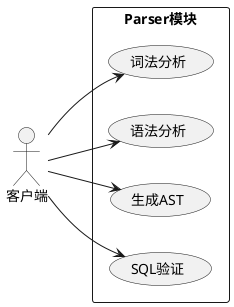

2. **概念类图**：

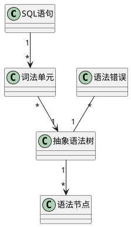

3. **活动图**：

```plantuml
@startuml
start
:接收SQL语句;
:词法分析生成Token流;
diamond "语法正确?"
  -> 是: 继续
  -> 否: 生成语法错误
:语法分析构建AST;
diamond "语义正确?"
  -> 是: 输出AST
  -> 否: 生成语义错误
stop
@enduml
```

#### 步骤2：OOD设计

1. **设计类图**：

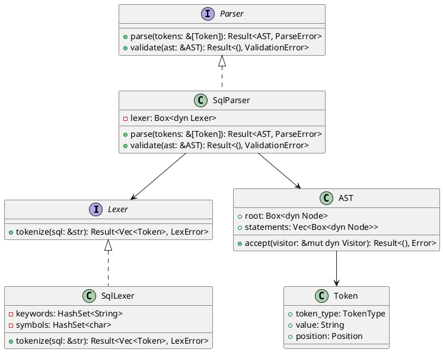

2. **顺序图**：

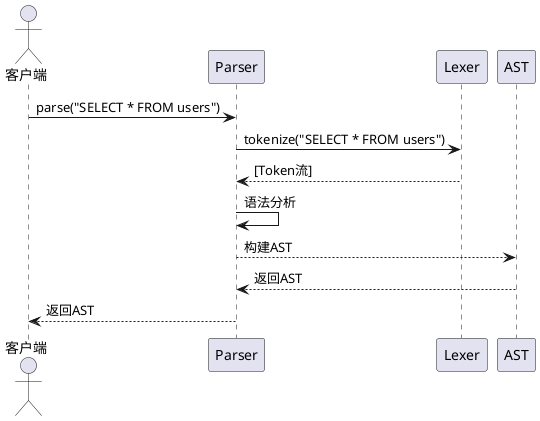

3. **状态图**：

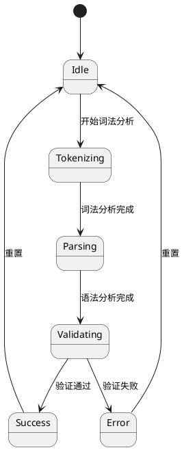

4. **组件图**：

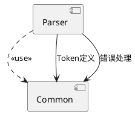

#### 步骤3：详细设计文档

创建 `docs/design/parser_module_design.md` 文件，包含：
- 模块概述
- 核心功能
- 类与接口设计
- 执行流程
- 异常处理
- 性能考虑

### 任务2：Optimizer模块设计（30分钟）

#### 步骤1：OOA分析

1. **用例图**：

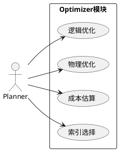

2. **概念类图**：

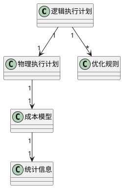

3. **活动图**：

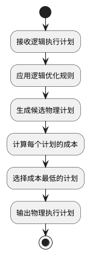

#### 步骤2：OOD设计

1. **设计类图**：

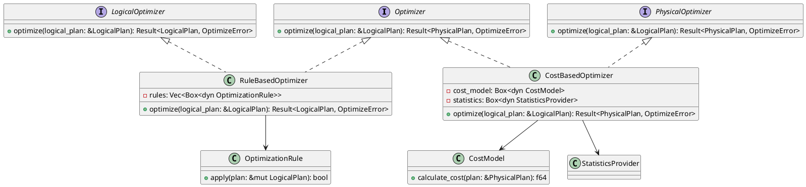

2. **顺序图**：

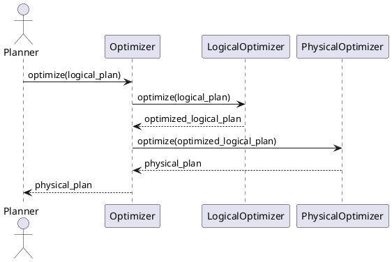

3. **状态图**：

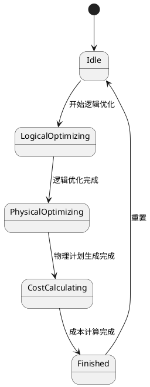

4. **组件图**：

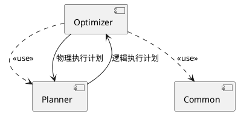

#### 步骤3：详细设计文档

创建 `docs/design/optimizer_module_design.md` 文件，包含：
- 模块概述
- 核心功能
- 类与接口设计
- 执行流程
- 优化策略
- 性能考虑

### 任务3：Executor模块设计（30分钟）

#### 步骤1：OOA分析

1. **用例图**：

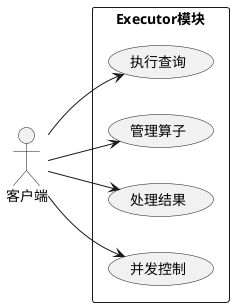

2. **概念类图**：

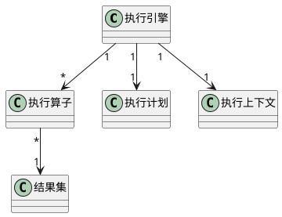

3. **活动图**：

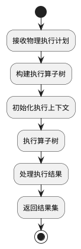

#### 步骤2：OOD设计

1. **设计类图**：

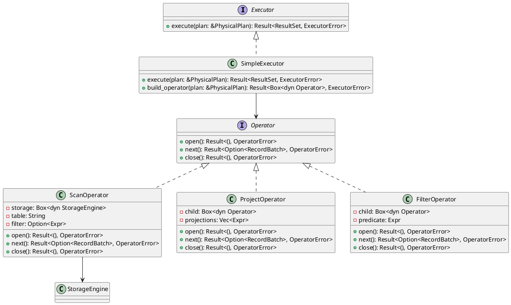

2. **顺序图**：

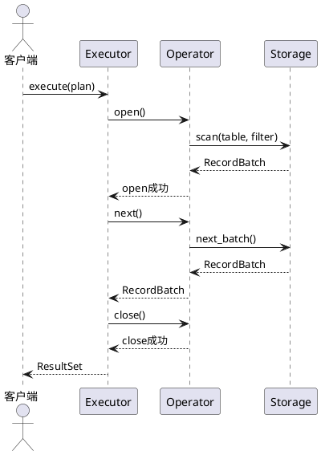

3. **状态图**：

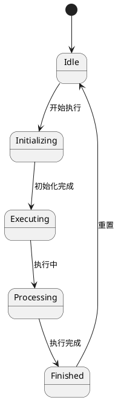

4. **组件图**：

```plantuml
@startuml
component "Executor" as E
component "Storage" as S
component "Common" as C

E ..> S : <<use>>
E ..> C : <<use>>

E --> S : 存储访问
S --> E : 数据返回
@enduml
```

#### 步骤3：详细设计文档

创建 `docs/design/executor_module_design.md` 文件，包含：
- 模块概述
- 核心功能
- 类与接口设计
- 执行流程
- 算子设计
- 性能考虑

### 任务4：Storage模块设计（30分钟）

#### 步骤1：OOA分析

1. **用例图**：

```plantuml
@startuml
left to right direction
actor "Executor" as Executor

rectangle "Storage模块" {
  usecase "读取数据" as Read
  usecase "写入数据" as Write
  usecase "扫描数据" as Scan
  usecase "管理表结构" as Schema
}

Executor --> Read
Executor --> Write
Executor --> Scan
Executor --> Schema
@enduml
```

2. **概念类图**：

```plantuml
@startuml
class "存储引擎" as StorageEngine
class "表" as Table
class "索引" as Index
class "页面" as Page
class "缓冲池" as BufferPool
class "事务" as Transaction

StorageEngine "1" --> "*" Table
Table "1" --> "*" Index
Table "1" --> "*" Page
StorageEngine "1" --> "1" BufferPool
StorageEngine "1" --> "*" Transaction
@enduml
```

3. **活动图**：

```plantuml
@startuml
start
:接收存储请求;
diamond "请求类型?"
  -> 读取: 读操作
  -> 写入: 写操作
  -> 扫描: 扫描操作
  -> 管理: 元数据操作
:执行相应操作;
:返回结果;
stop
@enduml
```

#### 步骤2：OOD设计

1. **设计类图**：

```plantuml
@startuml
interface StorageEngine {
  + read(table: &str, key: &Key): Result<Record, StorageError>
  + write(table: &str, record: Record): Result<(), StorageError>
  + scan(table: &str, filter: Option<&Expr>): Result<ScanIterator, StorageError>
  + create_table(name: &str, schema: &Schema): Result<(), StorageError>
  + begin_transaction(): Result<TransactionId, StorageError>
  + commit_transaction(tx_id: TransactionId): Result<(), StorageError>
  + rollback_transaction(tx_id: TransactionId): Result<(), StorageError>
}

class MemoryStorage {
  - tables: HashMap<String, Table>
  - transactions: HashMap<TransactionId, Transaction>
  + read(table: &str, key: &Key): Result<Record, StorageError>
  + write(table: &str, record: Record): Result<(), StorageError>
  + scan(table: &str, filter: Option<&Expr>): Result<ScanIterator, StorageError>
  + create_table(name: &str, schema: &Schema): Result<(), StorageError>
}

class FileStorage {
  - data_dir: String
  - buffer_pool: BufferPool
  - tables: HashMap<String, Table>
  + read(table: &str, key: &Key): Result<Record, StorageError>
  + write(table: &str, record: Record): Result<(), StorageError>
  + scan(table: &str, filter: Option<&Expr>): Result<ScanIterator, StorageError>
  + create_table(name: &str, schema: &Schema): Result<(), StorageError>
}

class BufferPool {
  - frames: Vec<Page>
  - lru: LruCache
  + get_page(page_id: PageId): Result<&Page, BufferPoolError>
  + put_page(page: Page): Result<(), BufferPoolError>
  + flush_all(): Result<(), BufferPoolError>
}

StorageEngine <|.. MemoryStorage
StorageEngine <|.. FileStorage
FileStorage --> BufferPool
@enduml
```

2. **顺序图**：

```plantuml
@startuml
actor "Executor" as Executor
participant "StorageEngine" as S
participant "BufferPool" as BP
participant "Table" as T

Executor -> S: read("users", key)
S -> T: get_record(key)
T -> BP: get_page(page_id)
BP --> T: Page
T --> S: Record
S --> Executor: Record
@enduml
```

3. **状态图**：

```plantuml
@startuml
[*] --> Idle

Idle --> Reading: 读请求
Idle --> Writing: 写请求
Idle --> Scanning: 扫描请求
Idle --> Managing: 元数据请求

Reading --> Idle: 读完成
Writing --> Idle: 写完成
Scanning --> Idle: 扫描完成
Managing --> Idle: 管理完成
@enduml
```

4. **组件图**：

```plantuml
@startuml
component "Storage" as S
component "Executor" as E
component "Common" as C

S ..> E : <<use>>
S ..> C : <<use>>

E --> S : 存储操作
S --> E : 数据返回
@enduml
```

#### 步骤3：详细设计文档

创建 `docs/design/storage_module_design.md` 文件，包含：
- 模块概述
- 核心功能
- 类与接口设计
- 执行流程
- 事务处理
- 性能考虑

### 任务5：测试计划设计（20分钟）

为每个模块制定详细的测试计划，包括：

1. **单元测试**：测试各个类和方法的功能
2. **集成测试**：测试模块间的协作
3. **端到端测试**：测试完整的执行流程

创建 `docs/design/test_plan.md` 文件，包含：
- 测试目标
- 测试策略
- 测试用例
- 测试环境
- 测试工具

### 任务6：Git提交（15分钟）

#### 步骤1：创建分支

```bash
git checkout -b docs/module-design-week6
```

#### 步骤2：添加文件

```bash
git add docs/design/parser_module_design.md
git add docs/design/optimizer_module_design.md
git add docs/design/executor_module_design.md
git add docs/design/storage_module_design.md
git add docs/design/test_plan.md
git add docs/tutorials/教学实践/学生操作手册/week-06-核心模块设计.md
```

#### 步骤3：提交并推送

```bash
git commit -m "docs: add module design for week 6"
git push origin docs/module-design-week6
```

---

## 实验要求

1. **UML图**：每个模块都要有完整的UML图（用例图、概念类图、活动图、顺序图、状态图、组件图、设计类图）
2. **设计文档**：每个模块都要有详细的设计文档，包含模块概述、核心功能、类与接口设计、执行流程等
3. **测试计划**：制定详细的测试计划，包括单元测试、集成测试、端到端测试
4. **AI辅助**：能够有效地提示AI生成UML图和设计文档
5. **Git操作**：提交规范，分支命名合理
6. **实验报告**：包含实验过程、遇到的问题和解决方法

---

## 实验报告内容

1. **实验过程**：详细描述核心模块设计的过程
2. **UML图**：包含每个模块的完整UML图
3. **设计文档**：每个模块的详细设计文档
4. **测试计划**：详细的测试计划
5. **AI提示词**：记录使用的AI提示词及其效果
6. **遇到的问题**：记录实验过程中遇到的问题及解决方法
7. **收获与体会**：总结核心模块设计的收获和体会

---

## 设计教程：如何有效地设计SQLRustGo核心模块

### 1. 设计准备

#### 1.1 明确设计目标
- **核心目标**：设计4个核心模块的完整架构
- **具体目标**：每个模块有完整的UML图和设计文档
- **设计要求**：符合面向对象设计原则，高内聚低耦合

#### 1.2 了解模块职责
- **Parser**：SQL解析、语法检查、生成AST
- **Optimizer**：查询优化、成本估算、执行计划生成
- **Executor**：执行查询、管理算子、处理结果
- **Storage**：数据存储、事务处理、并发控制

---

### 2. 如何有效地提示AI生成UML图

#### 2.1 提示词设计原则
- **明确目标**：清楚说明要生成的UML图类型和模块
- **提供上下文**：提供模块的职责和功能需求
- **指定格式**：要求输出PlantUML代码
- **设置约束**：说明设计约束和要求

#### 2.2 有效的提示词示例

**生成Parser模块的设计类图**：

```
请为SQLRustGo的Parser模块生成设计类图，使用PlantUML语法。

包含以下类和接口：
- Lexer接口：tokenize方法
- Parser接口：parse和validate方法
- SqlLexer类：实现Lexer接口
- SqlParser类：实现Parser接口
- Token类：包含token_type、value、position字段
- AST类：包含root和statements字段
- 各种错误类

显示类的属性、方法和关系。
```

#### 2.3 评估AI输出
- **正确性**：UML图是否符合语法规范
- **完整性**：是否包含所有必要的类和关系
- **合理性**：设计是否符合面向对象原则
- **一致性**：不同UML图之间是否一致

---

### 3. 设计文档编写技巧

#### 3.1 文档结构
- **模块概述**：模块的职责和目标
- **核心功能**：模块的主要功能
- **类与接口设计**：详细的类和接口定义
- **执行流程**：模块的工作流程
- **异常处理**：错误处理策略
- **性能考虑**：性能优化策略

#### 3.2 文档编写原则
- **清晰明了**：使用简洁的语言描述
- **结构合理**：层次分明，逻辑清晰
- **详细具体**：包含必要的细节
- **图文并茂**：配合UML图说明

---

### 4. 测试计划制定

#### 4.1 测试策略
- **单元测试**：测试每个类和方法
- **集成测试**：测试模块间的协作
- **端到端测试**：测试完整的执行流程

#### 4.2 测试用例设计
- **正常用例**：测试正常情况下的功能
- **异常用例**：测试异常情况下的处理
- **边界用例**：测试边界条件
- **性能用例**：测试性能表现

---

### 5. 常见设计问题及解决方法

#### 5.1 过度设计
- **症状**：设计过于复杂，包含不必要的类和接口
- **原因**：追求完美，忽视模块的核心职责
- **解决方法**：回到模块的核心职责，删除不必要的设计

#### 5.2 接口设计不合理
- **症状**：接口过于复杂或过于简单
- **原因**：对模块的职责理解不够清晰
- **解决方法**：重新分析模块的职责，设计合理的接口

#### 5.3 依赖关系混乱
- **症状**：模块间相互依赖，形成循环依赖
- **原因**：缺乏清晰的依赖方向
- **解决方法**：定义清晰的依赖方向，确保单向依赖

#### 5.4 性能考虑不足
- **症状**：设计没有考虑性能因素
- **原因**：专注于功能设计，忽视性能
- **解决方法**：在设计阶段就考虑性能因素，如缓存、索引等

---

### 6. 设计最佳实践

#### 6.1 模块化设计
- **清晰的模块边界**：每个模块有明确的职责
- **合理的接口设计**：接口简洁明了，符合单一职责原则
- **低耦合**：模块间依赖尽可能少
- **高内聚**：模块内部功能紧密相关

#### 6.2 面向对象设计
- **封装**：隐藏实现细节
- **继承**：合理使用继承和多态
- **多态**：通过接口实现多态
- **抽象**：提取共同特征，定义抽象接口

#### 6.3 测试驱动设计
- **先设计测试**：在实现前先设计测试
- **测试覆盖**：确保测试覆盖主要功能
- **测试自动化**：使用自动化测试工具

#### 6.4 持续改进
- **迭代设计**：通过迭代不断改进设计
- **反馈机制**：收集用户和开发者的反馈
- **代码审查**：定期进行代码审查

---

## 总结

通过本实验，你将掌握数据库系统核心模块的设计方法，学会使用UML进行面向对象分析与设计，能够为每个核心模块生成完整的UML图和设计文档，理解模块间的依赖关系和接口设计，掌握测试计划的制定方法。

在设计SQLRustGo核心模块时，记住以下几点：

1. **明确模块职责**：每个模块有清晰的职责边界
2. **遵循设计原则**：高内聚低耦合，单一职责原则
3. **使用UML工具**：通过UML图清晰表达设计
4. **考虑性能因素**：在设计阶段就考虑性能优化
5. **制定测试计划**：确保模块的质量和可靠性

通过实践和迭代，不断优化模块设计，构建一个稳定、高效、可扩展的SQLRustGo数据库系统。