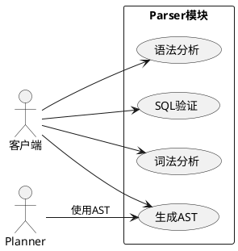
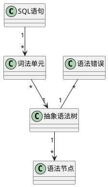
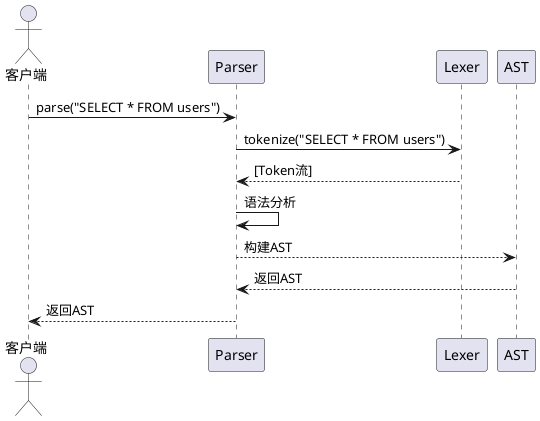
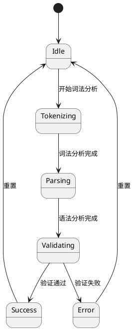
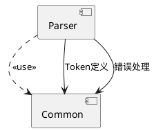
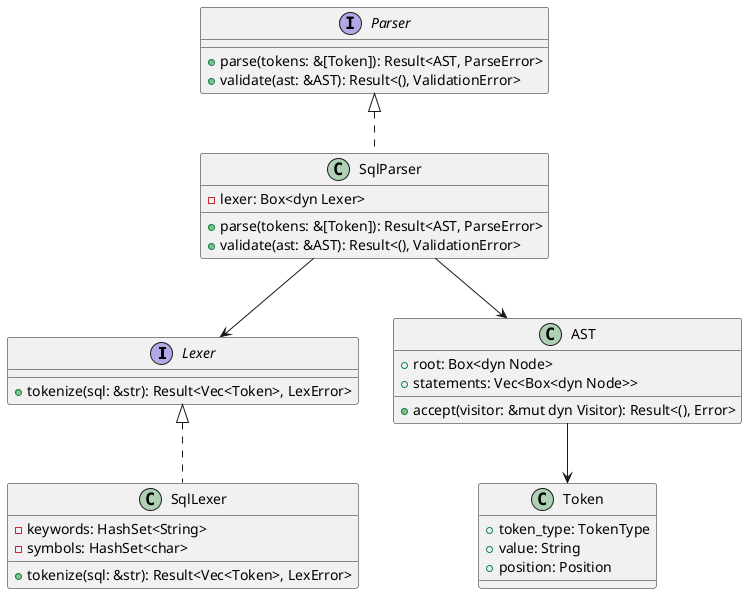

# 第6周：核心模块设计实践 - 详细操作指南

## 课程大纲

1. **核心模块设计概述**（15分钟）
2. **Parser模块详细设计**（30分钟）
3. **Optimizer模块详细设计**（30分钟）
4. **Executor模块详细设计**（30分钟）
5. **Storage模块详细设计**（30分钟）
6. **完整实验操作流程**（30分钟）

---

# Part 1: 核心模块设计概述

---

## 1.1 What：你需要完成什么？

### 实验任务清单

本次实验你需要完成以下任务：

| 任务 | 时间 | 交付物 |
|------|------|--------|
| Parser模块设计 | 30分钟 | 7个UML图 + 设计文档 |
| Optimizer模块设计 | 30分钟 | 7个UML图 + 设计文档 |
| Executor模块设计 | 30分钟 | 7个UML图 + 设计文档 |
| Storage模块设计 | 30分钟 | 7个UML图 + 设计文档 |
| 测试计划设计 | 20分钟 | 测试计划文档 |
| Git提交 | 15分钟 | 完整的提交记录 |

**每个模块需要绘制7个UML图**：
1. 用例图（Use Case Diagram）
2. 概念类图（Concept Class Diagram）
3. 活动图（Activity Diagram）
4. 顺序图（Sequence Diagram）
5. 状态图（State Diagram）
6. 组件图（Component Diagram）
7. 设计类图（Design Class Diagram）

---

## 1.2 Why：为什么需要这些UML图？

### UML图的作用

| UML图类型 | 解决的问题 | 设计阶段 |
|-----------|-----------|----------|
| **用例图** | 谁用系统？做什么？ | OOA - 需求分析 |
| **概念类图** | 有哪些对象？关系如何？ | OOA - 领域建模 |
| **活动图** | 业务流程如何？ | OOA - 流程分析 |
| **顺序图** | 对象如何交互？ | OOD - 交互设计 |
| **状态图** | 对象状态如何变化？ | OOD - 状态设计 |
| **组件图** | 模块如何组织？ | OOD - 架构设计 |
| **设计类图** | 类如何实现？ | OOD - 详细设计 |

**记忆技巧**：
- OOA阶段：用例图 → 概念类图 → 活动图（What - 做什么）
- OOD阶段：顺序图 → 状态图 → 组件图 → 设计类图（How - 怎么做）

---

## 1.3 How：完整的设计流程

### 标准设计流程（每个模块都要走一遍）

```
1. 理解模块职责 ← 看第5讲的架构设计
   ↓
2. 绘制用例图 ← 识别功能和参与者
   ↓
3. 绘制概念类图 ← 识别对象和关系
   ↓
4. 绘制活动图 ← 描述业务流程
   ↓
5. 绘制顺序图 ← 描述对象交互
   ↓
6. 绘制状态图 ← 描述状态变化
   ↓
7. 绘制组件图 ← 描述模块组织
   ↓
8. 绘制设计类图 ← 定义类和接口
   ↓
9. 编写设计文档 ← 整理所有内容
   ↓
10. Git提交 ← 版本控制
```

---

# Part 2: Parser模块详细设计 - 一步一步来

---

## 2.0 准备工作

### 步骤1：理解Parser模块的职责

先回顾第5讲的架构设计，Parser模块的职责是：

```
Parser模块职责：
1. 接收SQL字符串
2. 进行词法分析（Tokenize）
3. 进行语法分析（Parse）
4. 生成抽象语法树（AST）
5. 进行基本的语义验证
6. 返回AST或错误信息
```

### 步骤2：查看SQLRustGo的实际目录结构

先看看真实的项目结构，了解如何组织文件：

```
crates/
├── parser/
│   ├── src/
│   │   ├── lib.rs
│   │   ├── lexer.rs
│   │   ├── parser.rs
│   │   └── ast/
│   │       ├── mod.rs
│   │       ├── statement.rs
│   │       └── expression.rs
│   └── Cargo.toml
```

---

## 2.1 第一步：绘制用例图

### What：用例图画什么？

用例图需要包含：
1. **参与者**：谁使用这个模块？
2. **用例**：模块提供哪些功能？
3. **系统边界**：模块的范围

### How：怎么画用例图？

#### 提示1：先识别参与者

对于Parser模块，参与者是谁？

```
参与者：
- Planner模块（使用Parser的输出）
- 客户端（直接调用Parser）
```

#### 提示2：识别用例

Parser提供哪些功能？

```
用例：
1. 词法分析（Lexical Analysis）
2. 语法分析（Syntax Analysis）
3. 生成AST（Generate AST）
4. SQL验证（SQL Validation）
```

#### 提示3：画用例图的PlantUML代码



#### 提示4：AI辅助画用例图的提示词

如果想让AI帮你画，可以用这个提示词：

```
请为SQLRustGo的Parser模块绘制用例图，使用PlantUML语法。

参与者：
- Planner（使用Parser的输出）
- 客户端（直接调用Parser）

用例：
- 词法分析（Lexical Analysis）
- 语法分析（Syntax Analysis）
- 生成AST（Generate AST）
- SQL验证（SQL Validation）

关系：
- 客户端可以调用所有用例
- Planner使用"生成AST"的输出

要求：
- 使用left to right direction
- 系统边界用rectangle表示
- 参与者用actor表示
```

---

## 2.2 第二步：绘制概念类图

### What：概念类图画什么？

概念类图需要包含：
1. **业务实体**：从需求中提取的名词
2. **属性**：实体的特征（只写属性名，不写类型）
3. **关系**：实体之间的关联、聚合、组合

### How：怎么画概念类图？

#### 提示1：从需求中提取名词

从Parser模块的需求中提取名词：

```
SQL语句
词法单元（Token）
抽象语法树（AST）
语法节点（Node）
语法错误（Error）
```

#### 提示2：识别关系

这些名词之间有什么关系？

```
SQL语句 → 词法单元（1对多）
词法单元 → AST（多对1）
AST → 语法节点（1对多）
语法错误 → AST（多对1）
```

#### 提示3：画概念类图的PlantUML代码



#### 提示4：AI辅助画概念类图的提示词

```
请为SQLRustGo的Parser模块绘制概念类图，使用PlantUML语法。

类：
- SQL语句
- 词法单元
- 抽象语法树
- 语法节点
- 语法错误

关系：
- SQL语句有多个词法单元
- 多个词法单元组成一个抽象语法树
- 抽象语法树包含多个语法节点
- 一个抽象语法树可能有多个语法错误

要求：
- 只写类名和属性名，不写方法和类型
- 使用正确的关联关系
```

---

## 2.3 第三步：绘制活动图

### What：活动图画什么？

活动图需要包含：
1. **开始节点**：流程的起点
2. **活动**：具体的操作步骤
3. **决策节点**：分支判断
4. **结束节点**：流程的终点

### How：怎么画活动图？

#### 提示1：梳理Parser的工作流程

Parser的工作流程是什么？

```
1. 接收SQL语句
2. 进行词法分析，生成Token流
3. 判断语法是否正确
   - 如果不正确，生成语法错误
   - 如果正确，继续
4. 进行语法分析，构建AST
5. 判断语义是否正确
   - 如果不正确，生成语义错误
   - 如果正确，输出AST
```

#### 提示2：画活动图的PlantUML代码

```plantuml
@startuml
start
:接收SQL语句;
:词法分析生成Token流;
diamond "语法正确?"
  -> 是: 继续
  -> 否: 生成语法错误
:语法分析构建AST;
diamond "语义正确?"
  -> 是: 输出AST
  -> 否: 生成语义错误
stop
@enduml
```

#### 提示3：AI辅助画活动图的提示词

```
请为SQLRustGo的Parser模块绘制活动图，使用PlantUML语法。

流程：
1. 接收SQL语句
2. 进行词法分析，生成Token流
3. 判断语法是否正确
   - 如果不正确，生成语法错误
   - 如果正确，继续
4. 进行语法分析，构建AST
5. 判断语义是否正确
   - 如果不正确，生成语义错误
   - 如果正确，输出AST

要求：
- 使用start、stop表示开始和结束
- 使用diamond表示决策节点
- 使用箭头表示流程方向
```

---

## 2.4 第四步：绘制顺序图

### What：顺序图画什么？

顺序图需要包含：
1. **参与者/对象**：参与交互的对象
2. **消息**：对象之间的调用
3. **激活条**：对象的活动时间
4. **返回值**：返回的结果

### How：怎么画顺序图？

#### 提示1：识别参与交互的对象

Parser执行查询的流程中有哪些对象？

```
- 客户端
- Parser
- Lexer
- AST
```

#### 提示2：梳理交互流程

这些对象之间是如何交互的？

```
1. 客户端调用Parser的parse方法，传入SQL字符串
2. Parser调用Lexer的tokenize方法
3. Lexer返回Token流给Parser
4. Parser进行语法分析
5. Parser构建AST
6. Parser返回AST给客户端
```

#### 提示3：画顺序图的PlantUML代码



#### 提示4：AI辅助画顺序图的提示词

```
请为SQLRustGo的Parser模块绘制顺序图，使用PlantUML语法。

参与者：
- 客户端
- Parser
- Lexer
- AST

流程：
1. 客户端调用Parser的parse方法，传入"SELECT * FROM users"
2. Parser调用Lexer的tokenize方法
3. Lexer返回Token流给Parser
4. Parser进行语法分析
5. Parser构建AST
6. Parser返回AST给客户端

要求：
- 使用actor表示参与者
- 使用participant表示对象
- 使用->表示调用，-->表示返回
- 显示激活条
```

---

## 2.5 第五步：绘制状态图

### What：状态图画什么？

状态图需要包含：
1. **初始状态**：对象的起始状态
2. **状态**：对象可能处于的状态
3. **转换**：状态之间的变化
4. **事件**：触发状态变化的事件
5. **终止状态**：对象的结束状态

### How：怎么画状态图？

#### 提示1：识别Parser的状态

Parser在执行过程中有哪些状态？

```
- Idle（空闲）
- Tokenizing（词法分析中）
- Parsing（语法分析中）
- Validating（验证中）
- Success（成功）
- Error（错误）
```

#### 提示2：识别状态转换事件

什么事件会触发状态变化？

```
- 开始词法分析：Idle → Tokenizing
- 词法分析完成：Tokenizing → Parsing
- 语法分析完成：Parsing → Validating
- 验证通过：Validating → Success
- 验证失败：Validating → Error
- 重置：Success/Error → Idle
```

#### 提示3：画状态图的PlantUML代码



#### 提示4：AI辅助画状态图的提示词

```
请为SQLRustGo的Parser模块绘制状态图，使用PlantUML语法。

状态：
- Idle（空闲）
- Tokenizing（词法分析中）
- Parsing（语法分析中）
- Validating（验证中）
- Success（成功）
- Error（错误）

初始状态：Idle
终止状态：无（可以重置）

转换：
- Idle → Tokenizing: 开始词法分析
- Tokenizing → Parsing: 词法分析完成
- Parsing → Validating: 语法分析完成
- Validating → Success: 验证通过
- Validating → Error: 验证失败
- Success → Idle: 重置
- Error → Idle: 重置

要求：
- 使用[*]表示初始状态
- 使用-->表示状态转换
- 在转换上标注事件
```

---

## 2.6 第六步：绘制组件图

### What：组件图画什么？

组件图需要包含：
1. **组件**：可部署的单元
2. **接口**：组件提供的服务
3. **依赖关系**：组件之间的依赖

### How：怎么画组件图？

#### 提示1：识别Parser的组件

Parser模块有哪些组件？

```
- Parser组件（核心组件）
- Common组件（公共组件）
```

#### 提示2：识别依赖关系

这些组件之间有什么依赖？

```
- Parser组件依赖Common组件
- Parser组件使用Common组件的Token定义
- Parser组件使用Common组件的错误处理
```

#### 提示3：画组件图的PlantUML代码



#### 提示4：AI辅助画组件图的提示词

```
请为SQLRustGo的Parser模块绘制组件图，使用PlantUML语法。

组件：
- Parser（核心解析组件）
- Common（公共组件）

依赖关系：
- Parser组件依赖Common组件
- Parser使用Common的Token定义
- Parser使用Common的错误处理

要求：
- 使用component表示组件
- 使用..>表示依赖关系
- 可以标注依赖的内容
```

---

## 2.7 第七步：绘制设计类图

### What：设计类图画什么？

设计类图需要包含：
1. **类/接口**：具体的类和接口定义
2. **属性**：字段名 + 类型
3. **方法**：方法名 + 参数 + 返回类型
4. **可见性**：+（public）、-（private）、#（protected）
5. **关系**：继承、实现、关联、聚合、组合

### How：怎么画设计类图？

#### 提示1：先定义接口

Parser模块需要哪些接口？

```
Lexer接口：
- tokenize(sql: &str): Result<Vec<Token>, LexError>

Parser接口：
- parse(tokens: &[Token]): Result<AST, ParseError>
- validate(ast: &AST): Result<(), ValidationError>
```

#### 提示2：定义具体的类

实现这些接口的类：

```
SqlLexer（实现Lexer）：
- keywords: HashSet<String>
- symbols: HashSet<char>
+ tokenize(sql: &str): Result<Vec<Token>, LexError>

SqlParser（实现Parser）：
- lexer: Box<dyn Lexer>
+ parse(tokens: &[Token]): Result<AST, ParseError>
+ validate(ast: &AST): Result<(), ValidationError>

Token：
+ token_type: TokenType
+ value: String
+ position: Position

AST：
+ root: Box<dyn Node>
+ statements: Vec<Box<dyn Node>>
+ accept(visitor: &mut dyn Visitor): Result<(), Error>
```

#### 提示3：画设计类图的PlantUML代码



#### 提示4：AI辅助画设计类图的提示词

```
请为SQLRustGo的Parser模块绘制设计类图，使用PlantUML语法。

接口：
- Lexer：tokenize方法
- Parser：parse和validate方法

类：
- SqlLexer：实现Lexer接口，包含keywords和symbols字段
- SqlParser：实现Parser接口，包含lexer字段
- Token：包含token_type、value、position字段
- AST：包含root和statements字段，accept方法

关系：
- Lexer由SqlLexer实现
- Parser由SqlParser实现
- SqlParser依赖Lexer
- SqlParser依赖AST
- AST包含Token

要求：
- 使用interface表示接口
- 使用class表示类
- 使用<|..表示实现关系
- 使用-->表示依赖关系
- 显示属性的可见性（+ public, - private）
- 显示方法的签名
```

---

## 2.8 第八步：编写设计文档

### 设计文档的结构

创建 `docs/design/parser_module_design.md` 文件，包含以下内容：

```markdown
# Parser模块设计文档

## 1. 模块概述

说明Parser模块的职责和目标。

## 2. 核心功能

列出Parser模块的核心功能。

## 3. UML图

### 3.1 用例图

[插入用例图]

### 3.2 概念类图

[插入概念类图]

### 3.3 活动图

[插入活动图]

### 3.4 顺序图

[插入顺序图]

### 3.5 状态图

[插入状态图]

### 3.6 组件图

[插入组件图]

### 3.7 设计类图

[插入设计类图]

## 4. 类与接口设计

详细说明每个类和接口的设计。

## 5. 执行流程

说明模块的执行流程。

## 6. 异常处理

说明异常处理策略。

## 7. 性能考虑

说明性能优化策略。
```

---

# Part 3: 其他模块设计提示

---

## 3.1 Optimizer模块设计提示

### Optimizer模块的职责

```
Optimizer模块职责：
1. 接收逻辑执行计划
2. 进行逻辑优化
3. 进行物理优化
4. 计算执行计划的成本
5. 选择最优的物理执行计划
6. 返回物理执行计划
```

### 需要绘制的UML图

1. **用例图**：参与者（Planner、Executor），用例（逻辑优化、物理优化、成本估算）
2. **概念类图**：逻辑执行计划、物理执行计划、优化规则、成本模型、统计信息
3. **活动图**：逻辑优化 → 物理优化 → 成本计算 → 选择最优计划
4. **顺序图**：Planner → Optimizer → LogicalOptimizer → PhysicalOptimizer
5. **状态图**：Idle → LogicalOptimizing → PhysicalOptimizing → CostCalculating → Finished
6. **组件图**：Optimizer → Planner → Common
7. **设计类图**：Optimizer接口、LogicalOptimizer、PhysicalOptimizer、CostModel等

---

## 3.2 Executor模块设计提示

### Executor模块的职责

```
Executor模块职责：
1. 接收物理执行计划
2. 构建执行算子树
3. 执行算子
4. 管理执行上下文
5. 处理查询结果
6. 返回结果集
```

### 需要绘制的UML图

1. **用例图**：参与者（客户端、Optimizer），用例（执行查询、管理算子、处理结果）
2. **概念类图**：执行引擎、执行算子、执行计划、结果集、执行上下文
3. **活动图**：接收计划 → 构建算子树 → 执行算子 → 处理结果 → 返回
4. **顺序图**：客户端 → Executor → Operator → Storage
5. **状态图**：Idle → Initializing → Executing → Processing → Finished
6. **组件图**：Executor → Storage → Common
7. **设计类图**：Executor接口、Operator接口、ScanOperator、ProjectOperator、FilterOperator等

---

## 3.3 Storage模块设计提示

### Storage模块的职责

```
Storage模块职责：
1. 接收读写请求
2. 管理表结构
3. 管理索引
4. 管理事务
5. 管理缓冲池
6. 持久化数据
```

### 需要绘制的UML图

1. **用例图**：参与者（Executor），用例（读取数据、写入数据、扫描数据、管理表、管理事务）
2. **概念类图**：存储引擎、表、索引、页面、缓冲池、事务
3. **活动图**：接收请求 → 检查事务 → 访问缓冲池 → 读写数据 → 返回结果
4. **顺序图**：Executor → StorageEngine → BufferPool → Table
5. **状态图**：Idle → Reading → Writing → Scanning → Managing → Finished
6. **组件图**：Storage → Common
7. **设计类图**：StorageEngine接口、MemoryStorage、FileStorage、BufferPool、Table、Index等

---

# Part 4: 完整实验操作流程

---

## 4.1 实验环境准备

### 步骤1：创建设计文档目录

```bash
mkdir -p docs/design
```

### 步骤2：准备PlantUML工具

确保可以在Markdown中渲染PlantUML图。

---

## 4.2 开始设计Parser模块

### 按照2.0-2.8的步骤，依次完成：

1. 理解模块职责
2. 绘制用例图
3. 绘制概念类图
4. 绘制活动图
5. 绘制顺序图
6. 绘制状态图
7. 绘制组件图
8. 绘制设计类图
9. 编写设计文档

---

## 4.3 继续设计其他模块

### 对Optimizer、Executor、Storage模块，重复4.2的步骤

每个模块都要完成：
- 7个UML图
- 1个设计文档

---

## 4.4 编写测试计划

### 创建 `docs/design/test_plan.md`，包含：

```markdown
# 测试计划

## 1. 测试目标

说明测试的目标和范围。

## 2. 测试策略

### 2.1 单元测试
- 测试每个类和方法
- 测试边界条件
- 测试异常情况

### 2.2 集成测试
- 测试模块间的协作
- 测试完整的执行流程

### 2.3 端到端测试
- 测试完整的SQL执行流程
- 测试真实的SQL语句

## 3. 测试用例

### 3.1 Parser模块测试用例
- 测试词法分析
- 测试语法分析
- 测试AST生成
- 测试错误处理

### 3.2 Optimizer模块测试用例
- 测试逻辑优化
- 测试物理优化
- 测试成本估算

### 3.3 Executor模块测试用例
- 测试算子执行
- 测试结果处理
- 测试并发执行

### 3.4 Storage模块测试用例
- 测试数据读写
- 测试事务处理
- 测试缓冲池

## 4. 测试环境

说明测试环境和工具。
```

---

## 4.5 Git提交

### 步骤1：创建分支

```bash
git checkout -b docs/module-design-week6
```

### 步骤2：添加文件

```bash
git add docs/design/parser_module_design.md
git add docs/design/optimizer_module_design.md
git add docs/design/executor_module_design.md
git add docs/design/storage_module_design.md
git add docs/design/test_plan.md
git add docs/tutorials/教学实践/学生操作手册/week-06-核心模块设计实践.md
```

### 步骤3：提交

```bash
git commit -m "docs: add module design for week 6"
```

### 步骤4：推送

```bash
git push origin docs/module-design-week6
```

---

# Part 5: 常见问题与解决方法

---

## 5.1 常见问题

| 问题 | 原因 | 解决方法 |
|------|------|----------|
| 不知道从哪里开始 | 缺乏设计经验 | 先看第5讲的架构设计，再从用例图开始 |
| UML图画得不对 | 对UML语法不熟悉 | 参考PlantUML官方文档，从简单的图开始 |
| 设计过于复杂 | 追求完美 | 回到核心需求，删除不必要的设计 |
| 接口设计不合理 | 对模块职责理解不够 | 重新分析模块职责，设计合理接口 |
| 依赖关系混乱 | 缺乏清晰的依赖方向 | 定义清晰的依赖方向，确保单向依赖 |
| AI生成设计不合理 | 提示词不够清晰 | 优化提示词，提供更多上下文 |

---

## 5.2 实践建议

### 建议1：从简单开始

先设计Parser模块（相对简单），再设计其他模块。

### 建议2：迭代设计

不要期望一次画出完美的图，通过多次迭代优化设计。

### 建议3：对比分析

对比手工设计和AI生成的设计，吸取两者的优点。

### 建议4：团队协作

与同学讨论设计方案，互相学习。

### 建议5：参考资料

参考成熟数据库系统（MySQL、PostgreSQL）的设计。

---

# 核心知识点总结

## 1. UML图的作用

- **用例图**：明确功能边界和参与者
- **概念类图**：识别业务实体和关系
- **活动图**：描述业务流程
- **顺序图**：描述对象交互
- **状态图**：描述状态变化
- **组件图**：描述模块组织
- **设计类图**：定义类和接口

## 2. 设计流程

- OOA阶段：用例图 → 概念类图 → 活动图
- OOD阶段：顺序图 → 状态图 → 组件图 → 设计类图

## 3. AI辅助设计

- 设计有效的提示词
- 审查和调整AI生成的设计
- 通过多次交互优化设计

## 4. 实验交付物

- 每个模块7个UML图
- 每个模块1个设计文档
- 1个测试计划
- Git提交记录

---

# 总结

通过本实验，你将掌握数据库系统核心模块的设计方法，学会使用UML进行面向对象分析与设计，能够为每个核心模块生成完整的UML图和设计文档，理解模块间的依赖关系和接口设计，掌握测试计划的制定方法。

记住：设计是一个迭代的过程，没有完美的设计，只有不断优化的设计。通过手工设计和AI辅助相结合的方式，你可以更快、更好地完成核心模块的设计，为SQLRustGo的开发奠定坚实的基础。

**实验完成日期**：____________

**得分**：____________

**助教签名**：____________
