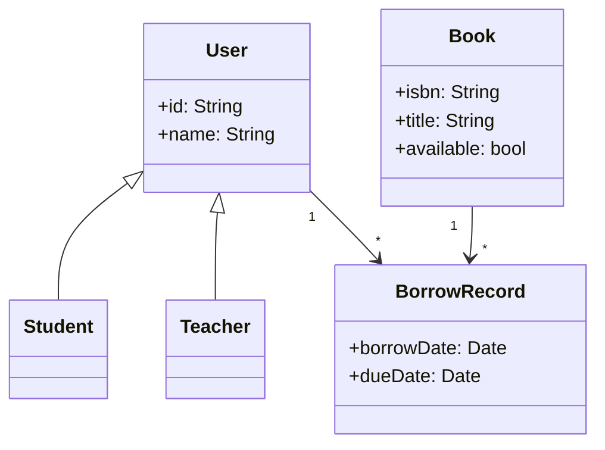

<!-- _class: lead -->

# 第三讲：面向对象分析、设计与实现

## 从结构化到面向对象的方法演进

### 以高校图书借阅系统为例

**80分钟 | 两节课**

---

# 课程大纲

## 第一节课（40分钟）

1. 方法学演进：从结构化到面向对象（10分钟）
2. 面向对象核心概念（15分钟）
3. 面向对象分析（OOA）- 用用例图捕获需求（15分钟）

## 第二节课（40分钟）

4. 面向对象分析（OOA）- 概念类图（10分钟）
5. 从分析到设计的过渡（5分钟）
6. 面向对象设计（OOD）方法（10分钟）
7. SOLID 设计原则（15分钟）

---

# 一、方法学演进

---

## 1.1 软件危机与结构化方法

### 1960s-1970s：软件危机

- 软件规模爆炸，项目延期
- 质量低劣，维护困难
- "软件危机"一词出现

### 结构化方法应运而生

- **自顶向下、逐步求精**
- **三视图建模**：
  - 功能建模：数据流图（DFD）
  - 数据建模：实体-关系图（ERD）
  - 行为建模：流程图、状态图

### 优点 vs 缺陷

| 优点 | 缺陷 |
|------|------|
| 适合中小规模系统 | 数据和操作分离 |
| 模块化设计 | 难以应对需求变化 |
| 数据处理型系统 | 小改动影响全局 |

---

## 1.2 图形化界面催生面向对象

### 1980s：图形操作系统普及

- Macintosh (1984)
- Windows (1985)
- 窗口、按钮、菜单等界面元素涌现

### 面向对象的天然契合

- 界面元素可建模为**对象**
- 每个元素既有**状态**又有**行为**
- 对象间通过**消息通信**
- **继承**复用界面元素
- **多态**处理不同事件

---

## 1.3 面向对象发展简史

| 年代 | 里程碑 | 意义 |
|------|--------|------|
| 1967 | Simula | 引入"类"和"对象"概念 |
| 1972 | Smalltalk | 第一个纯OO语言 |
| 1985 | C++ | 将OO带入主流工程 |
| 1995 | Java | 互联网时代OO语言 |
| 1997 | UML 1.0 | 统一建模语言标准 |

---

## 1.4 从结构化到面向对象的转变

### 建模视角对比

| 维度 | 结构化方法 | 面向对象方法 | 转变本质 |
|------|-----------|-------------|----------|
| 功能需求 | 数据流图（DFD） | 用例图 | "功能分解"→"用户场景" |
| 静态结构 | ER图 | 类图 | "数据实体"→"封装行为的数据" |
| 动态行为 | 流程图、状态图 | 顺序图、活动图 | "过程流"→"对象间消息传递" |

### 本质区别

- **结构化**：程序 = 数据结构 + 算法
- **面向对象**：程序 = 对象 + 消息

---

# 二、面向对象核心概念

---

## 2.1 为什么需要面向对象？

### 软件开发的挑战与OO解决方案

| 挑战 | 传统方法 | OO解决方案 |
|------|---------|-----------|
| 复杂性 | 拆分功能 | 封装隐藏细节，降低认知负担 |
| 变化性 | 修改函数 | 继承和多态支持扩展 |
| 协作性 | 全局变量 | 对象职责清晰，接口明确 |

### 面向对象的核心价值

- **更高复用**：代码复用、设计复用
- **更低耦合**：模块独立，便于维护
- **更易理解**：符合人类认知习惯

---

## 2.2 封装（Encapsulation）

### 定义

将数据和操作捆绑在一起，对外隐藏实现细节。

### 核心思想

```
┌────────────────────────────────────┐
│              Book                   │
│  ┌──────────────────────────────┐  │
│  │  私有数据                    │  │
│  │  - isbn: String             │  │
│  │  - title: String            │  │
│  │  - available: bool          │  │
│  └──────────────────────────────┘  │
│  ┌──────────────────────────────┐  │
│  │  公开方法                    │  │
│  │  + borrow()                 │  │
│  │  + return_book()            │  │
│  │  + is_available()           │  │
│  └──────────────────────────────┘  │
└────────────────────────────────────┘
```

### Rust 实现示例

```rust
pub struct Book {
    isbn: String,
    title: String,
    available: bool,  // 私有状态
}

impl Book {
    pub fn borrow(&mut self) -> Result<(), String> {
        if self.available {
            self.available = false;
            Ok(())
        } else {
            Err("图书已借出".into())
        }
    }
    
    pub fn is_available(&self) -> bool {
        self.available
    }
}
```

### 封装的好处

1. **信息隐藏**：外部无法直接修改内部状态
2. **降低耦合**：只依赖公开接口
3. **易于维护**：修改内部不影响外部
4. **提高复用**：清晰的功能边界

---

## 2.3 继承（Inheritance）

### 定义

通过"is-a"关系复用父类代码，建立类型层次。

### 继承类型

| 类型 | 说明 | 示例 |
|------|------|------|
| 单继承 | 一个父类 | Student extends User |
| 多继承 | 多个父类 | 接口 |
| 实现 | 接口定义行为 | impl User for Student |

### Rust 中的替代方案

Rust 没有传统继承，通过 **trait** 实现多态：

```rust
// 定义行为接口
trait User {
    fn id(&self) -> &str;
    fn name(&self) -> &str;
    fn can_borrow(&self) -> bool;
}

// 学生实现
struct Student { student_id: String, name: String }
impl User for Student {
    fn id(&self) -> &str { &self.student_id }
    fn name(&self) -> &str { &self.name }
    fn can_borrow(&self) -> bool { true }
}

// 教师实现
struct Teacher { teacher_id: String, name: String }
impl User for Teacher {
    fn id(&self) -> &str { &self.teacher_id }
    fn name(&self) -> &str { &self.name }
    fn can_borrow(&self) -> bool { true }
}
```

### 继承 vs 组合

| 继承 | 组合 |
|------|------|
| is-a 关系 | has-a 关系 |
| 静态绑定 | 动态绑定 |
| 紧耦合 | 松耦合 |

---

## 2.4 多态（Polymorphism）

### 定义

同一接口，不同实现。

### Rust 实现

```rust
// 运行时多态
fn print_user_info(user: &dyn User) {
    println!("ID: {}, 姓名: {}", user.id(), user.name());
    if user.can_borrow() {
        println!("可以借书");
    }
}

// 无论是Student还是Teacher，都可传入
let student = Student { ... };
let teacher = Teacher { ... };

print_user_info(&student);
print_user_info(&teacher);
```

### 多态的意义

- **统一接口**：调用方无需关心具体类型
- **可扩展**：新增类型无需修改现有代码
- **灵活性**：运行时决定具体实现

---

# 三、面向对象分析（OOA）- 用例图

---

## 3.1 OOA 核心任务

### 什么是 OOA？

面向对象分析（Object-Oriented Analysis）
- 理解问题域，建立概念模型
- 识别对象、属性、行为、关系

### OOA 产出

| 产出 | 说明 | 所属阶段 |
|------|------|----------|
| 用例图 | 系统功能需求 | OOA |
| 概念类图 | 领域概念模型 | OOA |
| 活动图 | 业务流程 | OOA |
| 设计类图 | 详细设计 | OOD |

---

## 3.2 用例图基本元素

### 核心元素

| 元素 | 表示 | 说明 |
|------|------|------|
| 参与者 | 小人 | 与系统交互的人、硬件 |
| 用例 | 椭圆 | 系统提供的功能 |
| 系统边界 | 矩形 | 系统范围 |

### 关系类型

| 关系 | 符号 | 说明 |
|------|------|------|
| 关联 | ──→ | 参与者与用例 |
| 包含 | `..>` | 必选功能 <<include>> |
| 扩展 | `..>` | 可选功能 <<extend>> |
| 继承 | ──▶ | 用例间泛化 |

---

## 3.3 图书借阅系统用例图

### 识别参与者

| 参与者 | 说明 |
|--------|------|
| 学生 | 借书、还书、查询 |
| 教师 | 借书、还书、查询 |
| 管理员 | 管理图书、管理用户 |

### 识别用例

| 参与者 | 用例 |
|--------|------|
| 学生/教师 | 登录、查询图书、借书、还书 |
| 管理员 | 登录、管理图书、管理用户 |

### 用例图（Mermaid）

```mermaid
use case
left to right direction

actor Student
actor Teacher
actor Admin

rectangle 图书管理系统 {
    usecase 登录
    usecase 查询图书
    usecase 借书
    usecase 还书
    usecase 管理图书
    
    Student --> 登录
    Student --> 查询图书
    Student --> 借书
    Student --> 还书
    
    Teacher --> 登录
    Teacher --> 查询图书
    Teacher --> 借书
    Teacher --> 还书
    
    Admin --> 登录
    Admin --> 管理图书
    
    借书 ..> 查询图书 : <<include>>
    还书 ..> 查询图书 : <<include>>
}
```

### 用例图的作用

- **捕获功能需求**：站在用户视角看系统做什么
- **界定系统边界**：明确哪些功能属于系统
- **沟通工具**：与用户、客户确认需求

---

## 3.4 用例图绘制步骤

### 步骤

1. **识别参与者**：谁使用系统？
2. **识别用例**：系统提供什么功能？
3. **描述用例**：用例的详细步骤
4. **建立关系**：包含、扩展、继承

### 示例：用例描述

```
用例：借书
参与者：学生
前置条件：学生已登录
基本流程：
  1. 学生选择图书
  2. 系统检查库存
  3. 系统创建借阅记录
  4. 系统更新图书状态
后置条件：借阅记录已创建
```

---

<!-- _class: lead -->

## 课间休息（5分钟）

---

# 四、面向对象分析（OOA）- 概念类图

---

## 4.1 概念类图 vs 设计类图

### 区别

| 维度 | 概念类图 | 设计类图 |
|------|----------|----------|
| 阶段 | OOA | OOD |
| 抽象 | 业务概念 | 实现细节 |
| 内容 | 领域模型 | 具体类 |
| 依赖 | 业务语言 | 编程语言 |

### 关系

```
OOA → OOD
概念类图 → 设计类图
```

---

## 4.2 对象发现方法：名词短语分析法

### 步骤

1. **提取名词**：从需求描述中找出所有名词
2. **筛选对象**：保留核心业务实体
3. **确定属性**：明确对象的特征
4. **识别关系**：建立对象间联系

### 示例：图书借阅系统

> 学生和教师可以借阅图书。每本图书有ISBN、书名、作者、出版社。借阅时需登记借阅人、借阅日期、应还日期。图书管理员负责管理图书和借阅记录。系统需要记录借阅历史，并支持逾期罚款计算。

### 提取结果

| 候选对象 | 是否保留 | 理由 |
|----------|----------|------|
| 学生 | ✅ | 核心角色 |
| 教师 | ✅ | 核心角色 |
| 图书管理员 | ✅ | 核心角色 |
| 图书 | ✅ | 核心实体 |
| ISBN | ❌ | 图书的属性 |
| 书名 | ❌ | 图书的属性 |
| 借阅记录 | ✅ | 核心实体 |
| 逾期罚款 | ✅ | 业务规则 |

---

## 4.3 确定对象关系

### 关系类型

| 关系 | 含义 | 示例 |
|------|------|------|
| 关联 | 使用关系 | 用户 → 借阅记录 |
| 聚合 | 整体-部分 | 班级 → 学生 |
| 组合 | 强整体-部分 | 订单 → 订单项 |
| 泛化 | 一般-特殊 | 用户 → 学生、教师 |

### 图书借阅系统关系

| 对象 | 关系 | 对象 |
|------|------|------|
| 用户 | 借阅 | 借阅记录 |
| 图书 | 被借阅于 | 借阅记录 |
| 图书管理员 | 管理 | 图书 |

### 概念类图（Mermaid）



---

# 五、从分析到设计

---

## 5.1 OOA vs OOD

### 区别

| 维度 | OOA | OOD |
|------|-----|-----|
| 目标 | 理解问题域 | 解决问题 |
| 关注 | 做什么 | 怎么做 |
| 输出 | 概念模型 | 设计方案 |
| 抽象 | 业务概念 | 实现细节 |

### 映射关系

```
┌─────────────────────────────────────────┐
│              OOA → OOD                   │
├─────────────────────────────────────────┤
│ 用例图 → 系统设计                         │
│ 概念类 "用户" → 设计类 User (trait)     │
│ 概念类 "图书" → 设计类 Book (struct)    │
│ 关系实现 → 成员变量、集合               │
└─────────────────────────────────────────┘
```

---

## 5.2 设计考虑因素

### 实现环境

- 编程语言特性
- 框架约束
- 性能要求
- 存储方案

### 质量属性

- 可维护性
- 可扩展性
- 可测试性
- 性能

---

# 六、面向对象设计（OOD）

---

## 6.1 类的设计

### 类的组成

```
┌─────────────────────────────────────┐
│           类名                       │
├─────────────────────────────────────┤
│ - 属性1: 类型     （私有）          │
│ - 属性2: 类型     （私有）           │
├─────────────────────────────────────┤
│ + 方法1(参数): 返回类型  （公开）   │
│ + 方法2(参数): 返回类型              │
└─────────────────────────────────────┘
```

### Rust 实现

```rust
pub struct User {
    id: String,
    name: String,
    user_type: UserType,
    borrow_records: Vec<BorrowRecord>,
}

impl User {
    pub fn can_borrow(&self) -> bool {
        self.borrow_records.len() < self.max_books()
    }
    
    pub fn borrow_book(&mut self, book: &mut Book) -> Result<(), String> {
        // 借书逻辑
    }
}
```

---

## 6.2 接口设计

### 什么是接口？

- 行为的抽象定义
- 实现与使用分离
- 依赖倒置的基础

### Rust 接口

```rust
pub trait Repository<T> {
    fn find(&self, id: &str) -> Option<T>;
    fn save(&mut self, entity: T);
}

pub struct InMemoryUserRepo { ... }
impl Repository<User> for InMemoryUserRepo { ... }
```

---

# 七、SOLID 设计原则

---

## 7.1 S - 单一职责（SRP）

### 定义

一个类只应有一个引起它变化的原因。

### 示例

```rust
// ❌ 违反：同时处理业务和持久化
struct User { fn save_to_db(&self) { ... } }

// ✅ 正确：分离职责
struct User { ... }           // 业务逻辑
struct UserRepository { ... } // 持久化
```

---

## 7.2 O - 开闭原则（OCP）

### 定义

对扩展开放，对修改关闭。

### 示例

```rust
trait FineCalculator {
    fn calculate(&self, days_overdue: u32) -> f64;
}

struct DefaultFineCalculator;
struct HolidayFineCalculator;

impl FineCalculator for DefaultFineCalculator {
    fn calculate(&self, days: u32) -> f64 { days as f64 * 0.5 }
}
```

---

## 7.3 L - 里氏替换（LSP）

### 定义

子类必须能够替换父类。

### 示例

```rust
trait User {
    fn borrow_limit(&self) -> u32;
}

struct Student;
impl User for Student { fn borrow_limit(&self) -> u32 { 5 } }

struct Teacher;
impl User for Teacher { fn borrow_limit(&self) -> u32 { 10 } }
```

---

## 7.4 I - 接口隔离（ISP）

### 定义

接口要小而专，避免胖接口。

### 示例

```rust
// ❌ 胖接口
trait LibraryService {
    fn add_book(&mut self, book: Book);
    fn borrow_book(&mut self, user_id: &str, isbn: &str);
    fn calculate_fine(&self, record_id: &str) -> f64;
}

// ✅ 分离
trait BookManager { fn add_book(&mut self, book: Book); }
trait BorrowService { fn borrow_book(&mut self, user_id: &str, isbn: &str); }
```

---

## 7.5 D - 依赖倒置（DIP）

### 定义

依赖抽象，不依赖具体实现。

### 示例

```rust
struct BorrowService<T: UserRepository, U: BookRepository> {
    user_repo: T,
    book_repo: U,
}
```

---

# 课堂小结

---

## 核心要点回顾

1. **方法学演进**：从结构化到面向对象
2. **OO三要素**：封装、继承、多态
3. **OOA**：用例图捕获需求 → 概念类图建模
4. **OOD**：设计类图 → 接口设计
5. **SOLID原则**：指导高质量设计

---

## 下节预告

- **第四讲**：UML规范与图例
  - 顺序图、活动图、状态图
  - 组件图、部署图
  - 继续以图书借阅系统为例

---

<!-- _class: lead -->

# 谢谢！

## Q&A
