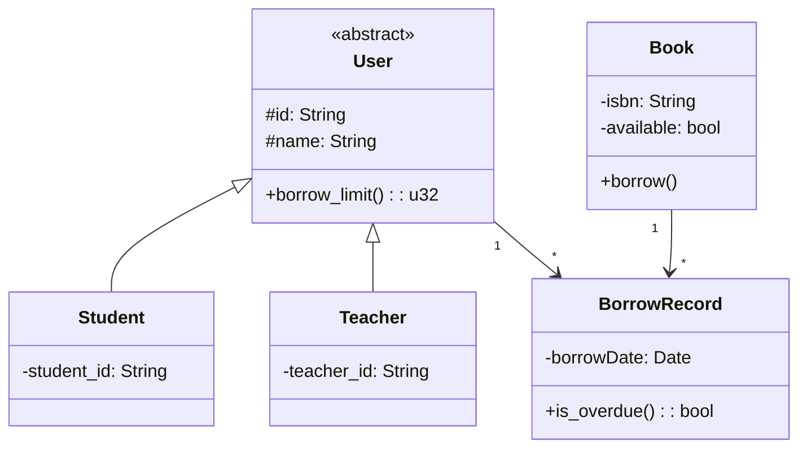

<!-- _class: lead -->

# 第三讲：面向对象分析、设计与实现

## 从结构化到面向对象的方法演进

### 以高校图书借阅系统为例

**80分钟 | 两节课**

---

# 课程大纲

## 第一节课（40分钟）

1. 方法学演进：从结构化到面向对象（10分钟）
2. 面向对象核心概念（15分钟）
3. 面向对象分析（OOA）入门（15分钟）

## 第二节课（40分钟）

4. 从分析到设计的过渡（5分钟）
5. 面向对象设计（OOD）方法（15分钟）
6. SOLID 设计原则（15分钟）
7. 类图规范与实践（10分钟）

---

# Part 1: 方法学演进

---

## 1.1 软件危机与结构化方法

### 1960s-1970s：软件危机

- 软件规模爆炸，项目延期
- 质量低劣，维护困难

### 结构化方法应运而生

- **自顶向下、逐步求精**
- **三视图建模**：
  - 功能建模：数据流图（DFD）
  - 数据建模：实体-关系图（ERD）
  - 行为建模：流程图、状态图

### 优点与缺陷

| 优点 | 缺陷 |
|------|------|
| 适合中小规模系统 | 数据和操作分离 |
| 数据处理型系统 | 需求变化时脆弱难改 |

---

## 1.2 图形化界面催生面向对象

### 1980s：图形操作系统普及

- Macintosh, Windows
- 窗口、按钮、菜单等界面元素涌现

### 面向对象的天然契合

- 界面元素可建模为**对象**
- 封装**状态**和**行为**
- 对象间通过**消息通信**
- **继承**复用，**多态**灵活

---

## 1.3 面向对象发展简史

| 年代 | 里程碑 |
|------|--------|
| 1960s | Simula 引入"类"和"对象" |
| 1970s | Smalltalk 第一个纯OO语言 |
| 1980s | C++ 将OO带入主流 |
| 1990s | UML 统一建模语言 |

---

## 1.4 建模视角转变

| 维度 | 结构化方法 | 面向对象方法 | 转变本质 |
|------|-----------|-------------|----------|
| 功能需求 | 数据流图（DFD） | 用例图 | "功能分解"→"用户场景" |
| 静态结构 | 实体-关系图（ERD） | 类图 | "数据实体"→"封装行为的数据" |
| 动态行为 | 流程图、状态图 | 顺序图、活动图 | "过程流"→"对象间消息传递" |

---

# Part 2: 面向对象核心概念

---

## 2.1 为什么需要面向对象？

### 挑战与OO解决方案

| 挑战 | OO解决方案 |
|------|-----------|
| 复杂性 | 封装隐藏细节，降低认知负担 |
| 变化性 | 继承和多态支持扩展，减少修改 |
| 协作性 | 对象职责清晰，接口明确 |

---

## 2.2 封装（Encapsulation）

### 定义

将数据和操作捆绑在一起，对外隐藏实现细节。

### 图书借阅系统示例

```rust
struct Book {
    isbn: String,
    title: String,
    available: bool,  // 私有状态
}

impl Book {
    pub fn borrow(&mut self) -> Result<(), String> {
        if self.available {
            self.available = false;
            Ok(())
        } else {
            Err("图书已借出".into())
        }
    }
    
    pub fn is_available(&self) -> bool {
        self.available
    }
}
```

**外界只能通过 borrow、return_book 修改状态，无法直接修改 available**

---

## 2.3 继承（Inheritance）

### 定义

通过"is-a"关系复用父类代码。

### 示例

```rust
trait User {
    fn id(&self) -> &str;
    fn name(&self) -> &str;
    fn can_borrow(&self) -> bool;
}

struct Student { student_id: String, name: String, max_books: u32 }
struct Teacher { teacher_id: String, name: String, department: String }

impl User for Student {
    fn can_borrow(&self) -> bool { true }
}

impl User for Teacher {
    fn can_borrow(&self) -> bool { true }
}
```

**Rust中通过 trait 实现多态，继承通过组合和 trait 替代**

---

## 2.4 多态（Polymorphism）

### 定义

同一接口，不同实现。

```rust
fn print_user_info(user: &dyn User) {
    println!("ID: {}, 姓名: {}", user.id(), user.name());
    if user.can_borrow() {
        println!("可以借书");
    }
}

// 无论是Student还是Teacher，都可传入print_user_info
```

---

# Part 3: 面向对象分析（OOA）

---

## 3.1 OOA 核心任务

- **理解问题域**，建立概念模型
- **识别对象、属性、行为、关系**
- **产出**：用例图、概念类图、活动图

---

## 3.2 对象发现方法：名词短语分析法

### 步骤

1. 从需求描述中提取所有**名词**
2. 筛选核心业务实体
3. 确定属性和行为
4. 识别对象间关系

### 示例：图书借阅系统

> 学生和教师可以借阅图书。每本图书有ISBN、书名、作者、出版社。借阅时需登记借阅人、借阅日期、应还日期。图书管理员负责管理图书和借阅记录。系统需要记录借阅历史，并支持逾期罚款计算。

### 筛选核心对象

- **用户**（学生、教师 → 泛化）
- **图书**
- **借阅记录**
- **图书管理员**
- **逾期罚款**（值对象）

---

## 3.3 确定对象关系

| 对象 | 关系 | 对象 |
|------|------|------|
| 用户 | 借阅 | 借阅记录 |
| 图书 | 被借阅于 | 借阅记录 |
| 图书管理员 | 管理 | 图书 |
| 借阅记录 | 可能产生 | 逾期罚款 |

---

## 3.4 课堂互动

### 小组讨论

从简化需求中提取对象并绘制简单关系图：

> "图书馆允许学生借阅图书，每本书最多借30天。逾期每天罚款0.5元。管理员可以添加新书。"

---

<!-- _class: lead -->

## 课间休息（5分钟）

---

# Part 4: 从分析到设计

---

## 4.1 OOA vs OOD

| OOA | OOD |
|-----|-----|
| 概念模型 | 解决方案 |
| 关注"做什么" | 关注"怎么做" |
| 考虑实现环境 |

### 映射关系

- 分析类 → 设计类（细化属性和方法）
- 关系 → 具体实现（引用、集合）
- 引入接口、设计模式

---

## 4.2 示例：分析到设计

```
分析类"用户" → 设计类User（trait或抽象类）
分析关系"用户借阅图书" → User持有BorrowRecord列表
```

---

# Part 5: 面向对象设计（OOD）

---

## 5.1 类的设计

```rust
pub struct User {
    id: String,
    name: String,
    user_type: UserType,
    borrow_records: Vec<BorrowRecord>,
}

impl User {
    pub fn can_borrow(&self) -> bool {
        self.borrow_records.len() < self.max_books()
    }
    
    pub fn borrow_book(&mut self, book: &mut Book) -> Result<(), String> {
        // 借书逻辑
    }
}
```

---

## 5.2 接口设计

```rust
pub trait Repository<T> {
    fn find(&self, id: &str) -> Option<T>;
    fn save(&mut self, entity: T);
}

struct InMemoryUserRepo { ... }
impl Repository<User> for InMemoryUserRepo { ... }
```

---

# Part 6: SOLID 设计原则

---

## 6.1 S - 单一职责（SRP）

### 定义

一个类只应有一个引起它变化的原因。

```rust
// ❌ 错误：User类同时处理业务规则和持久化
struct User { fn save_to_db(&self) { ... } }

// ✅ 正确：分离职责
struct User { ... }           // 仅业务逻辑
struct UserRepository { ... }  // 仅持久化
```

---

## 6.2 O - 开闭原则（OCP）

### 定义

对扩展开放，对修改关闭。

```rust
trait FineCalculator {
    fn calculate(&self, days_overdue: u32) -> f64;
}

struct DefaultFineCalculator;
impl FineCalculator for DefaultFineCalculator {
    fn calculate(&self, days: u32) -> f64 { days as f64 * 0.5 }
}

struct HolidayFineCalculator;
impl FineCalculator for HolidayFineCalculator {
    fn calculate(&self, days: u32) -> f64 { days as f64 * 0.3 }
}
```

---

## 6.3 L - 里氏替换（LSP）

### 定义

子类必须能够替换父类。

```rust
trait User {
    fn borrow_limit(&self) -> u32;
}

struct Student { ... }
impl User for Student { fn borrow_limit(&self) -> u32 { 5 } }

struct Teacher { ... }
impl User for Teacher { fn borrow_limit(&self) -> u32 { 10 } }
```

---

## 6.4 I - 接口隔离（ISP）

### 定义

接口要小而专，避免胖接口。

```rust
// ❌ 胖接口
trait LibraryService {
    fn add_book(&mut self, book: Book);
    fn borrow_book(&mut self, user_id: &str, isbn: &str);
    fn calculate_fine(&self, record_id: &str) -> f64;
}

// ✅ 分离
trait BookManager { fn add_book(&mut self, book: Book); }
trait BorrowService { fn borrow_book(&mut self, user_id: &str, isbn: &str); }
trait FineService { fn calculate_fine(&self, record_id: &str) -> f64; }
```

---

## 6.5 D - 依赖倒置（DIP）

### 定义

依赖抽象，不依赖具体实现。

```rust
struct BorrowService<T: UserRepository, U: BookRepository> {
    user_repo: T,
    book_repo: U,
}

impl<T, U> BorrowService<T, U>
where T: UserRepository, U: BookRepository {
    pub fn borrow(&mut self, user_id: &str, isbn: &str) -> Result<(), String> {
        // 借书逻辑
    }
}
```

---

# Part 7: 类图规范

---

## 7.1 类图元素

```
┌─────────────────┐
│      User       │
├─────────────────┤
│ - id: String    │
│ - name: String  │
├─────────────────┤
│ + can_borrow()  │
│ + borrow_book() │
└─────────────────┘
```

---

## 7.2 关系符号

| 关系 | 符号 | 说明 |
|------|------|------|
| 继承 | ──▶ | 实线三角箭头 |
| 实现 | - -▶ | 虚线三角箭头 |
| 关联 | ───→ | 实线箭头 |
| 依赖 | .──→ | 虚线箭头 |
| 聚合 | ◇── | 空心菱形 |
| 组合 | ◆── | 实心菱形 |

---

## 7.3 类图示例



---

# 课堂小结（5分钟）

## 核心要点回顾

1. **方法学演进**：从结构化（数据+操作分离）到面向对象（封装+消息传递），图形界面是重要驱动力

2. **OO三要素**：封装、继承、多态

3. **OOA → OOD → OOP**：分析概念模型，设计实现方案，编码实现

4. **SOLID原则**：指导高质量设计

5. **类图**：描述系统静态结构的关键工具

---

## 下节预告

- **第四讲**：UML规范与图例 —— 用例图、顺序图、活动图等，继续以图书借阅系统为例

---

<!-- _class: lead -->

# 谢谢！

## Q&A
