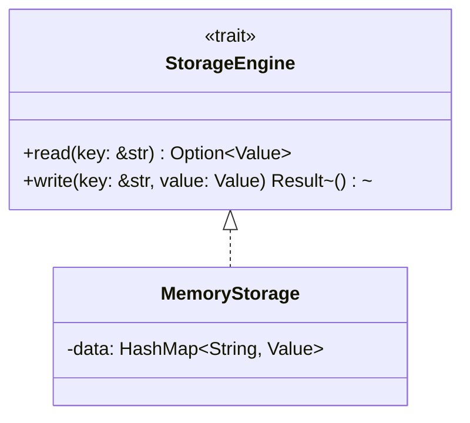

<!-- _class: lead -->

# 第三讲：面向对象的分析设计与实现

## AI增强的软件工程

---

# 课程大纲

1. 面向对象核心概念（15分钟）
2. 面向对象分析（OOA）原理（20分钟）
3. 面向对象设计（OOD）原理（20分钟）
4. SOLID设计原则（15分钟）
5. 类图与AI辅助设计（20分钟）

---

# Part 1: 面向对象核心概念

---

## 1.1 为什么需要面向对象？

### 软件开发的本质挑战

- **复杂性**：现代软件系统包含数百万行代码
- **变化性**：需求不断变化，系统需要易于修改
- **协作性**：多团队并行开发

### 面向对象的解决方案

- **封装**：隐藏实现细节，降低认知负荷
- **继承**：复用共性，建立层次结构
- **多态**：统一接口，支持多种实现

---

## 1.2 核心概念原理解读

### 封装（Encapsulation）

```
┌─────────────────┐
│      对象        │
│  ┌───────────┐  │
│  │  内部状态  │  │  → 数据隐藏
│  └───────────┘  │
│       ↑          │
│  ┌───────────┐  │
│  │  公开接口  │  │  → 行为暴露
│  └───────────┘  │
└─────────────────┘
```

**原理**：将数据和操作数据的方法捆绑，对外隐藏实现细节。

---

### 继承（Inheritance）

```
┌─────────┐
│  动物   │  ← 抽象基类
└─────────┘
    ↑ ↑
┌─────┘ └─────┐
┌─────────┐ ┌─────────┐
│   狗    │ │   猫    │  ← 派生类
└─────────┘ └─────────┘
```

**原理**：通过"is-a"关系，子类自动获得父类的属性和方法。

---

### 多态（Polymorphism）

```rust
trait Drawable {
    fn draw(&self);
}

struct Circle { radius: f64 }
impl Drawable for Circle {
    fn draw(&self) { /* 画圆 */ }
}

// 统一接口，不同行为
fn render(shape: &dyn Drawable) {
    shape.draw();  // 运行时决定具体实现
}
```

**原理**：同一接口在不同对象上有不同实现。

---

# Part 2: 面向对象分析（OOA）原理

---

## 2.1 OOA的目标：理解问题域

### 核心问题

- 系统要处理哪些概念？
- 概念之间有什么关系？
- 概念有哪些行为？

### 分析方法

- **名词短语分析**：从需求中提取名词，识别候选对象
- **分类**：区分实体对象、边界对象、控制对象
- **抽象**：忽略细节，保留本质特征

---

## 2.2 对象发现方法

### 名词短语分析法示例

**需求描述**：用户可以通过客户端提交SQL查询，系统解析查询后，从存储引擎中读取数据，并将结果返回给用户。

**筛选核心对象**：SQLQuery、Parser、StorageEngine、Result

---

## 2.3 识别对象之间的关系

### 关系类型

- **关联**：对象之间存在某种联系
- **聚合**：整体包含部分，部分可独立存在
- **组合**：整体包含部分，部分不能独立存在
- **泛化**：一般与特殊的关系

---

## 2.4 OOA的产出：概念模型

### 示例：SQLRustGo概念模型

```
┌──────────┐     ┌──────────┐
│   用户   │────>│  SQL查询  │
└──────────┘     └──────────┘
                      │
                      ▼
                ┌──────────┐
                │  解析器  │
                └──────────┘
                      │
                      ▼
┌──────────┐     ┌──────────┐
│ 存储引擎 │<────│ 执行引擎 │
└──────────┘     └──────────┘
```

---

# Part 3: 面向对象设计（OOD）原理

---

## 3.1 OOD的目标：构建解决方案

### 核心任务

- 将分析模型转化为设计模型
- 定义类（属性、方法、可见性）
- 设计关系

---

## 3.2 设计原则（SOLID）

| 原则 | 含义 |
|------|------|
| 单一职责 | 一个类只有一个变化原因 |
| 开闭原则 | 对扩展开放，对修改关闭 |
| 里氏替换 | 子类必须能替换父类 |
| 接口隔离 | 接口要小而专一 |
| 依赖倒置 | 依赖抽象，不依赖具体 |

---

## 3.3 设计原则应用示例

### 单一职责（SRP）

```rust
// ❌ 违反：Parser既做词法分析又做语法分析
struct Parser { input: String, pos: usize, tokens: Vec<Token> }

// ✅ 符合：拆分为Lexer和Parser
struct Lexer { input: String, pos: usize }
struct Parser { lexer: Lexer }
```

### 开闭原则（OCP）

```rust
trait StorageEngine {
    fn read(&self, key: &str) -> Option<Value>;
}

struct MemoryStorage { data: HashMap<String, Value> }
struct DiskStorage { path: PathBuf }
// 可以任意扩展新存储引擎
```

### 依赖倒置（DIP）

```rust
struct Executor<T: StorageEngine> { storage: T }  // 依赖抽象
```

---

# Part 4: 类图设计

---

## 4.1 设计类图包含

- 类名、属性（含类型、可见性）
- 方法（含参数、返回类型）
- 关系（继承、实现、关联）

---

## 4.2 示例：SQLRustGo设计类图

```
┌─────────────────┐      ┌─────────────────┐
│    Parser       │      │     Lexer       │
├─────────────────┤      ├─────────────────┤
│ -lexer: Lexer   │────>│ -input: String  │
├─────────────────┤      │ -pos: usize     │
│ +parse(): AST   │      ├─────────────────┤
└─────────────────┘      │ +next_token()   │
       │                 └─────────────────┘
       │ 使用
       ▼
┌─────────────────┐
│      AST        │（抽象）
├─────────────────┤
│ +execute(): ... │
└─────────────────┘
       ▲
       │ 继承
┌─────────────────┐
│ SelectStatement │
├─────────────────┤
│ -columns: Vec   │
│ -table: String  │
└─────────────────┘
```

---

# Part 5: AI辅助设计

---

## 5.1 AI生成类图



---

## 5.2 练习任务

1. 分析需求文档
2. 识别核心对象
3. 确定对象关系
4. 绘制类图

---

# 总结

---

## 核心要点

1. **面向对象三要素**：封装、继承、多态
2. **OOA**：从需求到概念模型
3. **OOD**：从概念到设计类图
4. **SOLID原则**：高质量类的设计指南
5. **AI辅助**：提升UML建模效率

---

## 下节预告

- 第四讲：UML规范和图例
- 实践：使用AI工具生成UML图

---

<!-- _class: lead -->

# 谢谢！

## Q&A
