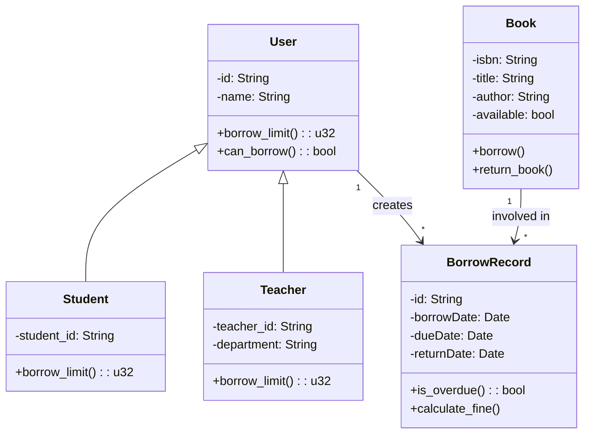
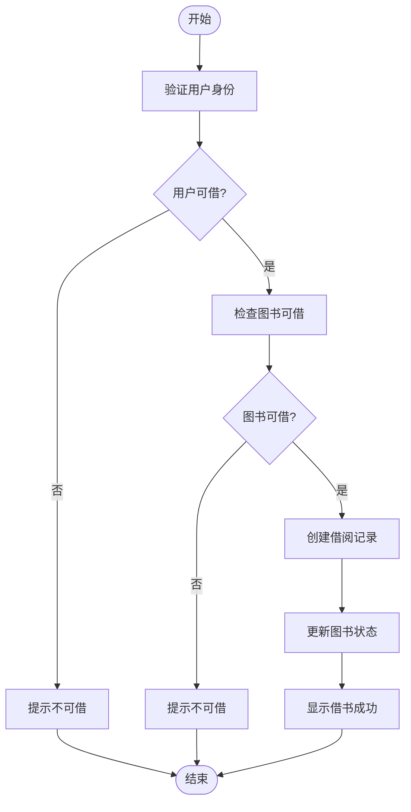
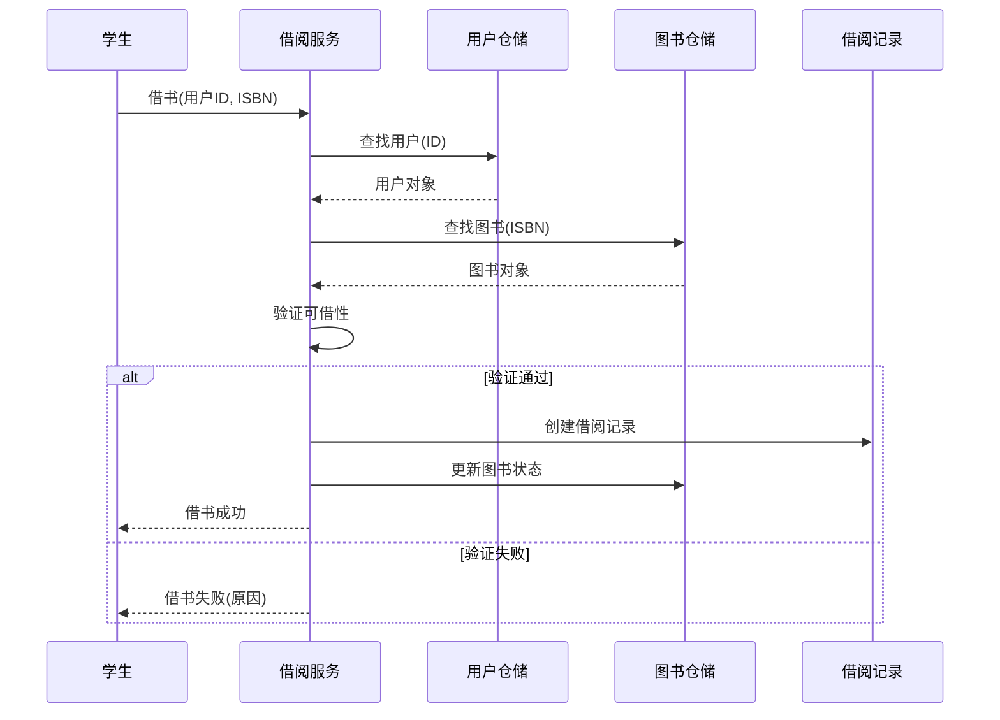

<!-- _class: lead -->

# 第四讲：UML 规范与图例

## 统一建模语言详解

### 从图形界面到标准建模

**80分钟 | 两节课**

---

# 课程大纲

## 第一节课（40分钟）

1. UML的来龙去脉（10分钟）
2. UML图的分类（5分钟）
3. 功能建模：用例图（15分钟）
4. 静态结构建模：类图与对象图（15分钟）

## 第二节课（40分钟）

5. 动态行为建模（25分钟）
6. 物理视图：组件图与部署图（10分钟）
7. 如何选择合适的UML图（5分钟）

---

# Part 1: UML的来龙去脉

---

## 1.1 面向对象方法的百花齐放（1980s-1990s）

### 三大主流方法

| 方法 | 创始人 | 特点 |
|------|--------|------|
| **Booch方法** | Grady Booch | 强调类和对象的设计，擅长架构表示 |
| **OMT方法** | James Rumbaugh | 三个视角建模（对象、动态、功能模型） |
| **OOSE方法** | Ivar Jacobson | 引入用例描述功能需求 |

### 问题

- 每种方法有自己的符号和过程
- 团队沟通困难
- 工具互不兼容

---

## 1.2 三友联合：UML的诞生

### 1994年

Booch、Rumbaugh、Jacobson 三人携手加入 Rational 公司

### 融合

- Booch 的类图和对象图
- OMT 的对象模型、动态模型
- OOSE 的用例图

### 里程碑

| 年份 | 事件 |
|------|------|
| 1997 | UML 1.0 提交给 OMG，成为业界标准 |
| 2005 | UML 2.0 发布，扩展图的数量和精确性 |

---

## 1.3 UML的定位

### 不是方法学，而是建模语言

- 可以与任何过程（统一过程、敏捷开发）结合使用
- **目标**：可视化、规范化、文档化

### 核心价值

- 统一沟通语言，降低歧义
- 支持从分析到设计的完整建模

---

# Part 2: UML图的分类

---

## 2.1 视角与图类型

| 视角 | 图类型 | 对应结构化方法 | 作用 |
|------|--------|---------------|------|
| 功能建模 | 用例图 | DFD顶层图 | 描述系统功能，识别参与者与用例 |
| 静态结构 | 类图、对象图、包图、组件图、部署图 | ER图、模块结构图 | 描述系统的静态组成和关系 |
| 动态行为 | 活动图、状态图、顺序图、通信图、时间图 | 流程图、状态图 | 描述系统的动态交互和状态变化 |

### 关键区别

- **结构化方法**：用不同图分别描述功能、数据、流程
- **UML**：以对象为中心，所有图都围绕对象展开

---

# Part 3: 功能建模：用例图

---

## 3.1 什么是用例图？

### 定义

描述系统外部参与者与系统提供的功能之间的交互

### 核心元素

| 元素 | 表示 | 说明 |
|------|------|------|
| 参与者 | 小人 | 与系统交互的人、硬件或其他系统 |
| 用例 | 椭圆 | 系统对外提供的完整功能 |
| 系统边界 | 矩形 | 用矩形框表示系统范围 |

---

## 3.2 用例图的作用

- **捕获功能需求**：站在用户视角看系统做什么
- **界定系统边界**：明确哪些功能属于系统
- **沟通工具**：与用户、客户确认需求，直观易懂

---

## 3.3 用例图示例：图书借阅系统

```mermaid
use case
left to right direction

actor 学生
actor 教师
actor 管理员

rectangle 图书管理系统 {
    usecase 登录
    usecase 查询图书
    usecase 借书
    usecase 还书
    usecase 预约图书
    usecase 管理图书
    
    学生 --> 登录
    学生 --> 查询图书
    学生 --> 借书
    学生 --> 还书
    学生 --> 预约图书
    
    教师 --> 登录
    教师 --> 查询图书
    教师 --> 借书
    教师 --> 还书
    教师 --> 预约图书
    
    管理员 --> 登录
    管理员 --> 管理图书
    
    借书 ..> 查询图书 : <<include>>
    还书 ..> 查询图书 : <<include>>
}
```

---

## 3.4 用例关系

| 关系 | 符号 | 说明 |
|------|------|------|
| 包含 | `..>` | 必须执行子功能 <<include>> |
| 扩展 | `..>` | 可选或条件触发 <<extend>> |
| 泛化 | ──▶ | 参与者或用例间的继承 |

---

# Part 4: 静态结构建模：类图与对象图

---

## 4.1 类图（Class Diagram）

### 定义

描述系统中类的定义以及类之间的关系

### 类包含

- **类名**
- **属性**（可见性、名称、类型）
- **方法**（可见性、名称、参数、返回类型）

### 关系类型

| 关系 | 符号 | 说明 |
|------|------|------|
| 继承 | `<\|--` | is-a |
| 实现 | `<\|..` | can-do |
| 关联 | `-->` | has-a |
| 依赖 | `.-->` | uses-a |
| 聚合 | `◇--` | has-a (可分离) |
| 组合 | `◆--` | has-a (不可分) |

---

## 4.2 类图示例：图书借阅系统



---

## 4.3 对象图（Object Diagram）

### 定义

- 类图的实例
- 展示系统在某一时刻的具体对象快照

### 作用

- 验证类图的合理性
- 帮助理解复杂的数据结构

---

## 4.4 包图（Package Diagram）

### 定义

用于组织类或其他模型元素，展示包之间的依赖

### 图书借阅系统包图

```
[models] → [services] → [repositories] → [db]
```

---

<!-- _class: lead -->

## 课间休息（5分钟）

---

# Part 5: 动态行为建模

---

## 5.1 活动图（Activity Diagram）

### 定义

描述业务流程或算法步骤，强调控制流和数据流

### 元素

| 元素 | 符号 |
|------|------|
| 起始/终止 | ● / ◎ |
| 活动 | 圆角矩形 |
| 决策 | 菱形 |
| 并发分叉/汇合 | 粗横线 |

---

## 5.2 活动图示例：借书流程



---

## 5.3 状态图（State Diagram）

### 定义

描述单个对象在其生命周期中的状态变化及触发事件

### 元素

- **状态**：圆角矩形
- **初始/终止状态**：● / ◎
- **转换**：带事件/条件的箭头

### 图书状态图

```
[可借] ──借出──> [已借出]
[已借出] ──归还──> [可借]
[可借] ──下架──> [报废]
[已借出] ──丢失──> [遗失处理]
```

---

## 5.4 顺序图（Sequence Diagram）

### 定义

描述对象间消息交互的时间顺序

### 元素

- 对象生命线
- 激活条
- 消息（同步、异步、返回）
- 组合片段（alt、opt、loop、par）

---

## 5.5 顺序图示例：借书流程



---

## 5.6 通信图（Communication Diagram）

### 定义

与顺序图等价，但强调对象间的结构关系（用编号表示消息顺序）

### 作用

- 展示对象连接和消息传递
- 适合理解对象协作的结构

---

# Part 6: 物理视图：组件图与部署图

---

## 6.1 组件图（Component Diagram）

### 定义

描述软件组件的结构及依赖关系（组件是物理模块，如 JAR、DLL、微服务）

### 元素

- 组件（带接口）
- 接口（提供/依赖）
- 依赖关系

### 图书借阅系统组件图

```
[借阅服务] → [用户服务] → [数据库接口]
[借阅服务] → [图书服务]
[图书服务] → [数据库接口]
```

---

## 6.2 部署图（Deployment Diagram）

### 定义

描述软件制品在硬件节点上的部署情况

### 元素

- 节点（服务器、设备）
- 制品（可执行文件、数据库）
- 通信路径（协议、端口）

### 图书借阅系统部署图

```
┌──────────┐        HTTP        ┌────────────┐
│ 浏览器   │ ────────────────▶ │ 应用服务器 │
└──────────┘                   └────────────┘
                                      │
                                ┌─────┴─────┐
                                │            │
                          ┌─────┴─────┐ ┌───┴────┐
                          │ MySQL     │ │ Redis  │
                          └───────────┘ └────────┘
```

---

# Part 7: 如何选择合适的UML图？

---

## 7.1 选择指南

| 你要表达什么 | 推荐图 | 阶段 |
|-------------|--------|------|
| 系统有什么功能？谁来用？ | 用例图 | OOA |
| 有哪些业务概念？它们的关系？ | 类图（概念层） | OOA |
| 业务流程是怎样的？ | 活动图 | OOA |
| 对象有哪些状态？如何转换？ | 状态图 | OOA/OOD |
| 具体某个功能如何由对象协作完成？ | 顺序图、通信图 | OOD |
| 类的详细设计（属性、方法） | 类图（设计层） | OOD |
| 系统模块如何划分？ | 包图、组件图 | 架构设计 |
| 系统如何部署？ | 部署图 | 部署设计 |

---

## 7.2 关键思想

- **不要试图画全所有图**，根据需要选择
- **不同图从不同视角描述系统**，互相补充

---

# 课堂小结（5分钟）

## 核心要点回顾

1. **UML的由来**：统一三大面向对象方法（Booch、OMT、OOSE），成为工业标准

2. **UML图的分类**：
   - 功能建模：用例图
   - 静态结构：类图、对象图、包图、组件图、部署图
   - 动态行为：活动图、状态图、顺序图、通信图、时间图

3. **每种图的用途**：
   - 用例图：捕获需求
   - 类图：定义对象结构
   - 活动图：描述流程
   - 状态图：描述生命周期
   - 顺序图：描述交互时序
   - 组件/部署图：描述物理架构

4. **UML支持OOA/OOD**：从用例到类再到交互，完整覆盖分析设计全过程

---

## 下节预告

- **第五讲**：架构设计原理 —— 将UML图应用于系统架构设计

---

<!-- _class: lead -->

# 谢谢！

## Q&A
