# SQLRustGo 架构设计原理与实践

## 第5讲：SQLRustGo 1.0.0 架构详解

---

# Part 1: 课程概述

---

## 1.1 课程目标

### 本讲内容

| 主题 | 内容 | 课时 |
|------|------|------|
| **What** | SQLRustGo架构是什么 | 45分钟 |
| **Why** | 为什么要这样设计 | 45分钟 |
| **How** | 核心模块的实现原理 | 90分钟 |
| **实践** | 架构探索与调试 | 90分钟 |

### 学习目标

- 理解SQLRustGo 1.0.0的总体架构
- 掌握查询处理的完整流程
- 了解核心模块的设计原理
- 能够阅读和理解架构代码

---

## 1.2 架构设计三问

### What（是什么）

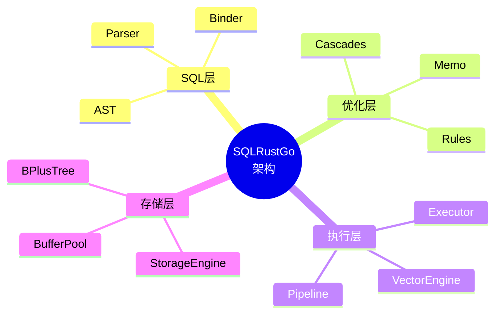

### Why（为什么）

| 问题 | SQLRustGo的答案 |
|------|-----------------|
| 为什么要分层？ | 关注点分离，独立演进 |
| 为什么要优化器？ | 查询计划影响性能100倍 |
| 为什么要向量化？ | CPU利用率从5%提升到80% |
| 为什么要插件化？ | 适应不同工作负载 |

### How（怎么做）

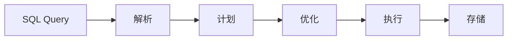

---

## 1.3 SQLRustGo版本定位

### v1.0.0 核心目标

> **单机数据库内核**：验证核心架构的可行性和正确性

| 特性 | 目标 | 状态 |
|------|------|------|
| SQL解析 | 完整SQL支持 | ✅ |
| 查询优化 | Cascades + CBO | ✅ |
| 向量执行 | SIMD加速 | ✅ |
| 存储引擎 | B+Tree + WAL | ✅ |
| 事务支持 | MVCC | 🔄 |

### 与其他版本的关系

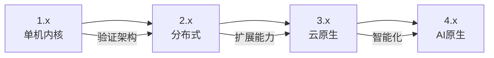

---

# Part 2: 系统总体架构

---

## 2.1 架构全景图

### SQLRustGo 1.0.0 架构

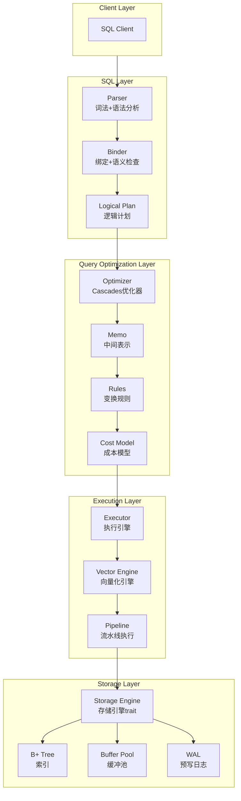

---

## 2.2 五层架构详解

### 核心分层

| 层级 | 职责 | 关键组件 | 可扩展性 |
|------|------|----------|----------|
| **SQL Layer** | 解析与绑定 | Parser, Binder, AST | 高 |
| **Optimizer Layer** | 查询优化 | Cascades, Memo, Rules | 极高 |
| **Execution Layer** | 查询执行 | Executor, Vector, Pipeline | 高 |
| **Storage Layer** | 数据存储 | B+Tree, Buffer, WAL | 中 |
| **Distributed Layer** | 分布式执行 | Coordinator, Worker | 高 |

### 分层原则

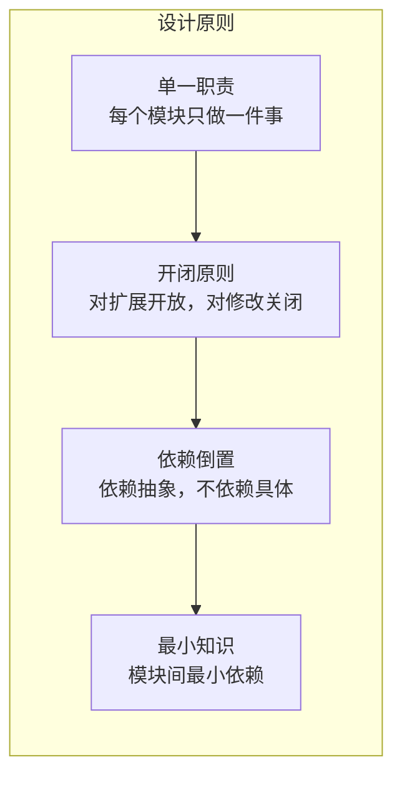

---

## 2.3 核心设计原则

### 1. 模块化

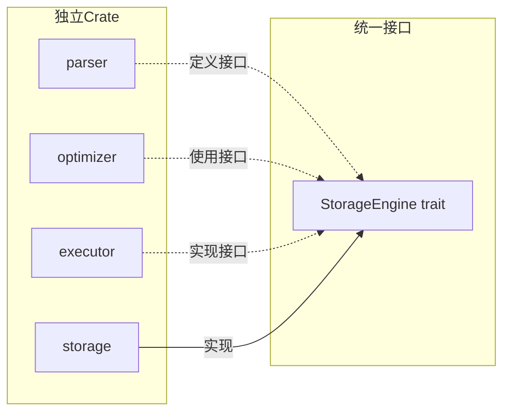

### 2. 可扩展性

| 扩展点 | 方式 | 示例 |
|--------|------|------|
| 优化规则 | 添加Rule | 新谓词下推规则 |
| 执行算子 | 实现Operator | 新Join算法 |
| 存储引擎 | 实现trait | 列存引擎 |
| 数据类型 | 实现Array | JSON类型 |

### 3. 高性能

| 技术 | 原理 | 收益 |
|------|------|------|
| 向量化执行 | 一次处理一批数据 | CPU利用率80%+ |
| Pipeline执行 | 流水线并行 | 延迟降低50% |
| 无锁数据结构 | CAS操作 | 并发度提升10x |
| 成本优化 | CBO | 查询时间降低90% |

---

# Part 3: 查询执行流程

---

## 3.1 完整查询流程

### 端到端查询处理

```mermaid
flowchart LR
    subgraph Input["输入"]
        SQL["SQL Query"]
    end

    subgraph Parse["解析阶段"]
        Lexer["Lexer<br/>词法分析"]
        Parser["Parser<br/>语法分析"]
        AST["AST<br/>抽象语法树"]
    end

    subgraph Bind["绑定阶段"]
        Binder["Binder<br/>语义分析"]
        LogicalPlan["Logical Plan<br/>逻辑计划"]
    end

    subgraph Optimize["优化阶段"]
        Memo["Memo<br/>中间表示"]
        Rules["Transformation<br/>规则应用"]
        Cost["Cost Evaluation<br/>成本评估"]
        PhysicalPlan["Physical Plan<br/>物理计划"]
    end

    subgraph Execute["执行阶段"]
        Executor["Executor<br/>执行引擎"]
        Operators["Operators<br/>算子树"]
        RecordBatch["RecordBatch<br/>数据批次"]
    end

    subgraph Storage["存储阶段"]
        Storage["Storage Engine"]
        Data["Data"]
    end

    subgraph Output["输出"]
        Result["Result Set"]
    end

    SQL --> Lexer --> Parser --> AST
    AST --> Binder --> LogicalPlan
    LogicalPlan --> Memo
    Memo --> Rules
    Rules --> Cost
    Cost --> PhysicalPlan
    PhysicalPlan --> Executor
    Executor --> Operators
    Operators --> RecordBatch
    RecordBatch --> Storage
    Storage --> Data
    Data --> Result
```

---

## 3.2 阶段详解

### 各阶段输入输出

| 阶段 | 输入 | 输出 | 关键问题 |
|------|------|------|----------|
| **Lexer** | SQL文本 | Token流 | 如何识别关键字？ |
| **Parser** | Token流 | AST | 如何解析语法？ |
| **Binder** | AST | Logical Plan | 如何解析语义？ |
| **Optimizer** | Logical Plan | Physical Plan | 如何选择最优计划？ |
| **Planner** | Physical Plan | 执行计划 | 如何生成执行指令？ |
| **Executor** | 执行计划 | ResultSet | 如何高效执行？ |

### 时间占比（典型OLAP查询）

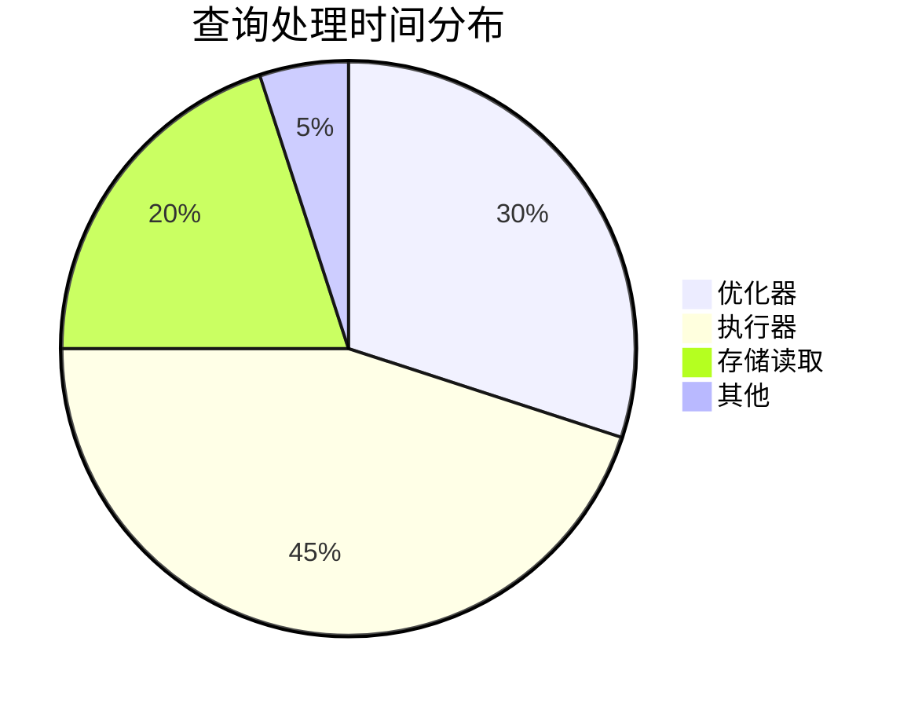

---

## 3.3 Parser层详解

### SQL解析流程


### Parser模块结构

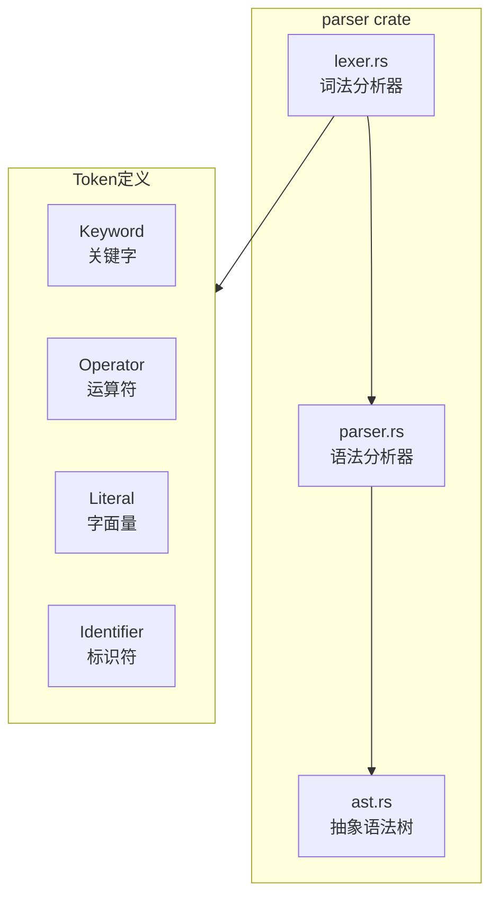

### 关键数据结构

```rust
// Token类型
pub enum Token {
    Keyword(Keyword),
    Identifier(String),
    StringLiteral(String),
    Number(i64),
    Float(f64),
    Operator(Op),
    Punctuation(char),
}

// AST节点
pub enum AstNode {
    Select(SelectStmt),
    Insert(InsertStmt),
    Update(UpdateStmt),
    Delete(DeleteStmt),
    CreateTable(CreateTableStmt),
    // ...
}

pub struct SelectStmt {
    pub projection: Vec<Expr>,
    pub from: TableRef,
    pub filter: Option<Expr>,
    pub group_by: Vec<Expr>,
    pub order_by: Vec<OrderByExpr>,
    pub limit: Option<u64>,
}
```

---

## 3.4 Optimizer层详解

### Cascades优化器架构

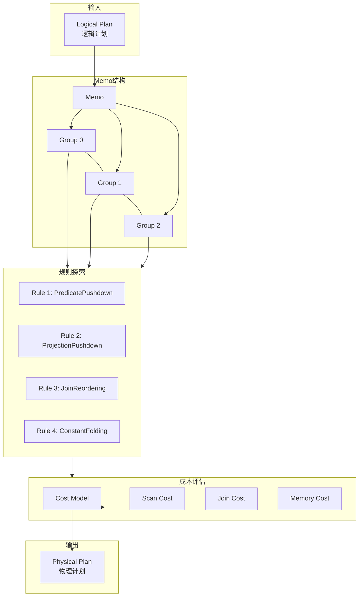

### Memo中间表示

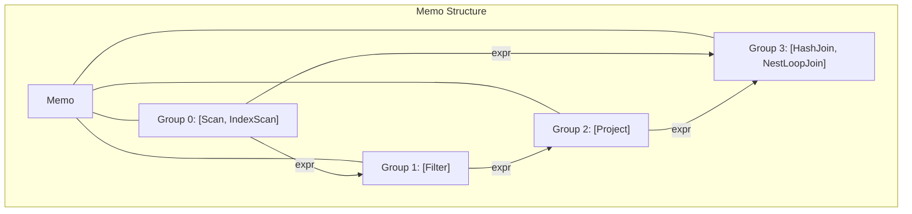

### 优化规则详解

| 规则 | 作用 | 示例 |
|------|------|------|
| **PredicatePushdown** | 谓词下推 | WHERE提前到Scan层 |
| **ProjectionPushdown** | 投影下推 | 只读取需要的列 |
| **ConstantFolding** | 常量折叠 | 1+2 → 3 |
| **JoinReordering** | Join重排 | 选小表先驱动 |
| **ColumnPruning** | 列裁剪 | 去掉未使用列 |
| **FilterMerge** | 过滤器合并 | a AND b AND c → single filter |

### 谓词下推示例

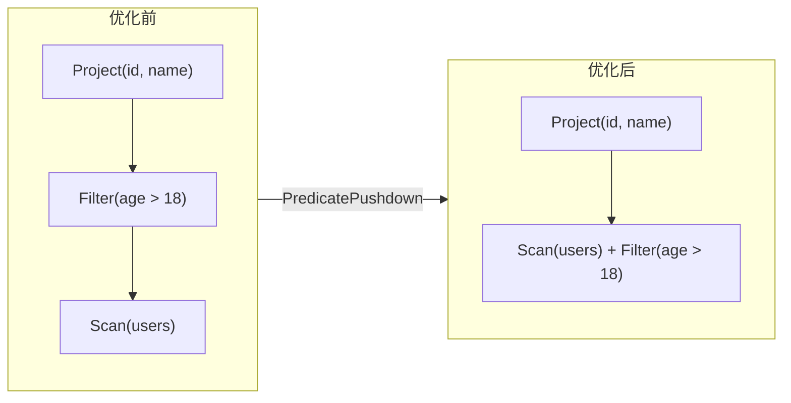

---

## 3.5 Executor层详解

### 执行引擎架构

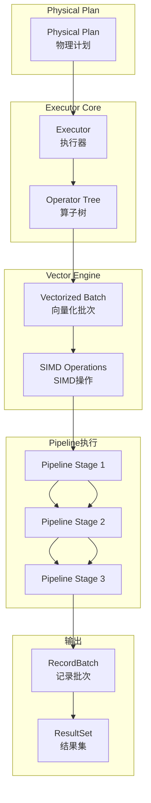

### 算子树结构

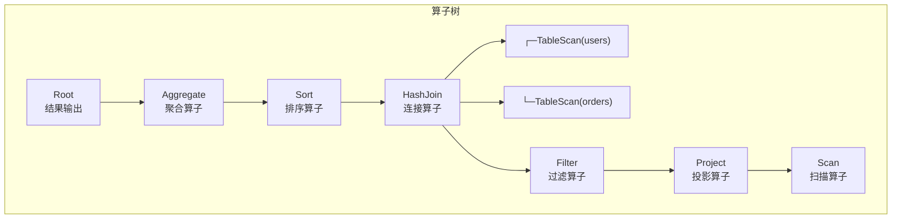

### RecordBatch结构

```mermaid
graph TB
    subgraph Batch["RecordBatch"]
        direction TB
        SCH["schema: Arc<Schema>"]
        COLS["columns: Vec<ArrayRef>"]
        ROWS["row_count: usize"]
    end

    subgraph Column["列式存储"]
        direction LR
        C1["id: [1,2,3,4,5]"]
        C2["name: [\"A\",\"B\",\"C\",\"D\",\"E\"]"]
        C3["age: [20,25,30,35,40]"]
    end

    Batch --> Column
```

### Pipeline执行模型

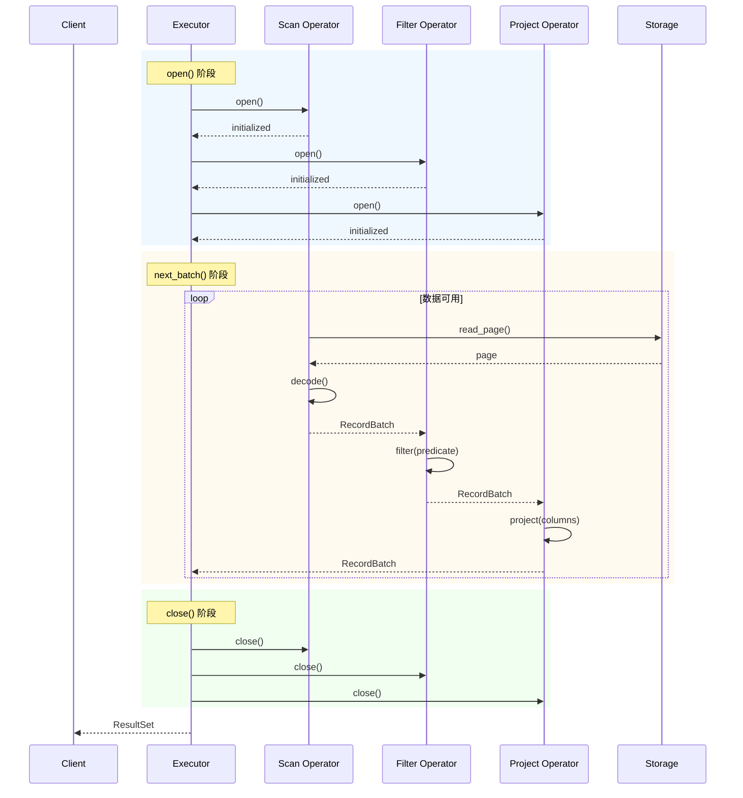

---

## 3.6 Storage层详解

### 存储引擎架构

```mermaid
flowchart TB
    subgraph Interface["StorageEngine Trait"]
        SE["pub trait StorageEngine"]
        SE_R["+ read(table) -> Vec<Record>"]
        SE_W["+ write(table, records)"]
        SE_S["+ scan(table, filter) -> Vec<Record>"]
        SE_G["+ get_stats(table) -> TableStats"]
    end

    subgraph Implementations["实现"]
        FS["FileStorage<br/>持久化存储"]
        MS["MemoryStorage<br/>内存存储"]
    end

    subgraph Internal["内部组件"]
        BT["B+Tree<br/>索引结构"]
        BP["BufferPool<br/>缓冲池"]
        WAL["WAL<br/>预写日志"]
        PF["Page Format<br/>页格式"]
    end

    SE <|.. FS
    SE <|.. MS
    FS --> BT
    FS --> BP
    FS --> WAL
    FS --> PF
    MS --> BT
```

### B+Tree索引结构

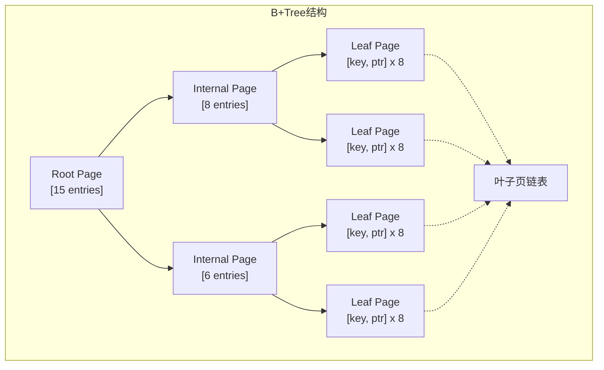

### BufferPool管理

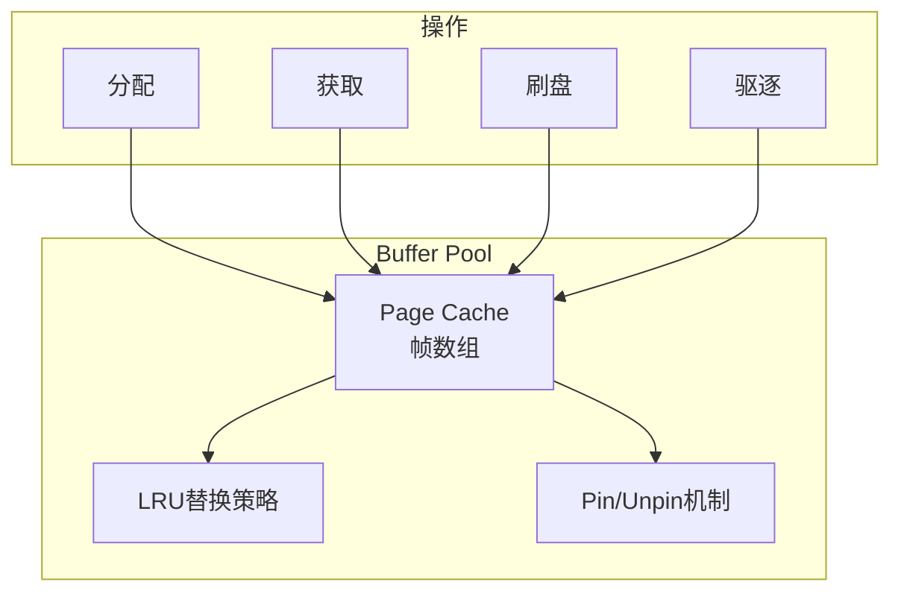

### WAL日志机制

```mermaid
sequenceDiagram
    participant Txn as Transaction
    participant WAL as WAL Buffer
    participant Log as Log File
    participant DB as Database

    rect rgb(255, 240, 245)
        Note over Txn: 事务开始
        Txn->>WAL: BEGIN
        WAL->>Log: append
    end

    rect rgb(240, 255, 240)
        Note over Txn: 执行修改
        Txn->>DB: modify page
        Txn->>WAL: append UPDATE
        WAL->>Log: append
    end

    rect rgb(240, 240, 255)
        Note over Txn: 事务提交
        Txn->>WAL: COMMIT
        WAL->>Log: append
        WAL->>Log: force
        Txn-->>Txn: success
    end
```

---

# Part 4: 核心模块详解

---

## 4.1 Parser模块

### 模块职责

| 职责 | 说明 |
|------|------|
| **词法分析** | 将SQL文本转换为Token流 |
| **语法分析** | 将Token流解析为AST |
| **语法校验** | 检查SQL语法是否合法 |
| **错误恢复** | 提供有意义的错误信息 |

### 代码结构

```
parser/
├── Cargo.toml
├── src/
│   ├── lib.rs
│   ├── lexer.rs      # 词法分析器
│   ├── token.rs      # Token定义
│   ├── parser.rs     # 语法分析器
│   ├── ast.rs        # AST定义
│   └── error.rs      # 错误定义
```

### Lexer实现原理

```rust
pub struct Lexer {
    input: Vec<char>,
    position: usize,
}

impl Lexer {
    pub fn next_token(&mut self) -> Result<Token> {
        self.skip_whitespace();
        match self.current_char() {
            Some(c) if c.is_alphabetic() => self识别_identifier_or_keyword(),
            Some(c) if c.is_digit() => self识别_number(),
            Some('"') | Some('\'') => self识别_string(),
            Some('(') | Some(')') | Some(',') => self识别_punctuation(),
            _ => self.识别_operator(),
        }
    }
}
```

### Parser实现原理

```rust
pub struct Parser {
    tokens: Vec<Token>,
    position: usize,
}

impl Parser {
    pub fn parse_select(&mut self) -> Result<SelectStmt> {
        self.expect(TokenType::SELECT)?;
        let projection = self.parse_projection_list()?;
        self.expect(TokenType::FROM)?;
        let from = self.parse_table_ref()?;
        let filter = if self.check(TokenType::WHERE) {
            Some(self.parse_expression()?)
        } else {
            None
        };
        Ok(SelectStmt { projection, from, filter })
    }
}
```

### AST定义

```rust
pub enum AstNode {
    Select(SelectStmt),
    Insert(InsertStmt),
    Update(UpdateStmt),
    Delete(DeleteStmt),
    CreateTable(CreateTableStmt),
    DropTable(DropTableStmt),
}

pub struct SelectStmt {
    pub projection: Vec<Expr>,
    pub from: TableRef,
    pub filter: Option<Box<Expr>>,
    pub group_by: Vec<Expr>,
    pub having: Option<Box<Expr>>,
    pub order_by: Vec<OrderByExpr>,
    pub limit: Option<u64>,
}

pub enum Expr {
    Column(String),
    Literal(Value),
    BinaryOp {
        op: BinaryOperator,
        left: Box<Expr>,
        right: Box<Expr>,
    },
    Function {
        name: String,
        args: Vec<Expr>,
    },
    // ...
}
```

---

## 4.2 Optimizer模块

### 模块职责

| 职责 | 说明 |
|------|------|
| **逻辑优化** | 基于规则的等价变换 |
| **成本优化** | 基于统计信息的成本估算 |
| **计划搜索** | 探索最优物理计划 |
| **计划缓存** | 避免重复优化相同查询 |

### 代码结构

```
optimizer/
├── Cargo.toml
├── src/
│   ├── lib.rs
│   ├── memo.rs        # Memo结构
│   ├── group.rs       # Group定义
│   ├── expr.rs        # 表达式定义
│   ├── rule.rs        # 优化规则
│   ├── cost.rs        # 成本模型
│   ├── optimizer.rs   # 优化器主逻辑
│   └── transforms.rs  # 变换规则实现
```

### Memo结构

```rust
pub struct Memo {
    pub groups: Vec<Group>,
}

pub struct Group {
    pub id: GroupId,
    pub expressions: Vec<GroupExpr>,
    pub logical_props: LogicalProperties,
    pub physical_props: PhysicalProperties,
    pub best_cost: f64,
    pub best_expr: Option<GroupExpr>,
}

pub struct GroupExpr {
    pub expr: Expr,
    pub children: Vec<GroupId>,
    pub cost: Option<f64>,
    pub is_rule_applied: bool,
}
```

### 优化规则示例

```rust
pub struct PredicatePushdown;

impl OptimizationRule for PredicatePushdown {
    fn apply(&self, memo: &mut Memo, group_id: GroupId) -> bool {
        let group = &memo.groups[group_id];

        // 找到Filter下的Scan
        if let Some(scan) = find_scan_in_group(group) {
            let filter_expr = extract_filter_expr(group);

            // 将Filter下推到Scan
            let pushed_filter = filter_expr.pushdown_to_scan(scan);

            // 创建新的Group
            memo.groups[scan.id].add_expr(pushed_filter);
            true
        } else {
            false
        }
    }
}
```

### 成本模型

```rust
pub struct CostModel {
    pub cpu_cost_per_row: f64,
    pub io_cost_per_page: f64,
    pub memory_cost_per_batch: f64,
}

impl CostModel {
    pub fn estimate_scan_cost(&self, stats: &TableStats) -> f64 {
        let num_pages = stats.total_bytes / PAGE_SIZE as u64;
        let cpu_cost = stats.row_count as f64 * self.cpu_cost_per_row;
        let io_cost = num_pages as f64 * self.io_cost_per_page;
        cpu_cost + io_cost
    }

    pub fn estimate_join_cost(&self, left: &PlanStats, right: &PlanStats) -> f64 {
        let build_cost = left.row_count as f64 * self.cpu_cost_per_row;
        let probe_cost = left.row_count as f64 * right.row_count as f64 * self.cpu_cost_per_row;
        build_cost + probe_cost
    }
}
```

---

## 4.3 Executor模块

### 模块职责

| 职责 | 说明 |
|------|------|
| **算子执行** | 火山模型 + 向量化 |
| **内存管理** | RecordBatch内存分配 |
| **并发控制** | 多线程执行支持 |
| **结果返回** | 批量返回结果 |

### 代码结构

```
executor/
├── Cargo.toml
├── src/
│   ├── lib.rs
│   ├── engine.rs       # 执行器主逻辑
│   ├── operator.rs     # 算子trait
│   ├── batch.rs        # RecordBatch
│   ├── projection.rs   # 投影算子
│   ├── filter.rs       # 过滤算子
│   ├── scan.rs         # 扫描算子
│   ├── join.rs         # 连接算子
│   ├── aggregate.rs    # 聚合算子
│   ├── sort.rs         # 排序算子
│   └── vectors/        # 向量化实现
│       ├── lib.rs
│       ├── array.rs    # Array trait
│       ├── int.rs      # 整型数组
│       ├── string.rs   # 字符串数组
│       └── simd.rs     # SIMD操作
```

### Operator Trait

```rust
pub trait Operator: Send {
    fn open(&mut self);

    fn next_batch(&mut self) -> Option<RecordBatch>;

    fn close(&mut self);
}

pub struct RecordBatch {
    pub schema: Arc<Schema>,
    pub columns: Vec<ArrayRef>,
    pub row_count: usize,
}
```

### 扫描算子实现

```rust
pub struct ScanOperator {
    table: TableRef,
    storage: Arc<dyn StorageEngine>,
    filter: Option<Expr>,
    batch_size: usize,
    current_page: usize,
}

impl Operator for ScanOperator {
    fn open(&mut self) {
        self.current_page = 0;
    }

    fn next_batch(&mut self) -> Option<RecordBatch> {
        let page = self.storage.read_page(self.table, self.current_page)?;

        let mut batch = RecordBatch::new(self.schema.clone(), self.batch_size);

        for row in page.rows() {
            if self.evaluate_filter(row) {
                batch.append(row);
            }
            if batch.is_full() {
                break;
            }
        }

        self.current_page += 1;
        Some(batch)
    }

    fn close(&mut self) {}
}
```

### 向量化执行

```rust
pub struct VectorizedFilter {
    input: Arc<Array>,
    predicate: fn(&Array, usize) -> bool,
    output: MutableArray,
}

impl VectorizedFilter {
    pub fn filter(&mut self, input: &Array) {
        match input {
            Array::Int(arr) => self.filter_int_array(arr),
            Array::Float(arr) => self.filter_float_array(arr),
            Array::String(arr) => self.filter_string_array(arr),
        }
    }

    #[target_feature(enable = "avx2")]
    unsafe fn filter_int_array(&mut self, input: &IntArray) {
        let values = input.values();
        let nulls = input.nulls();

        for i in 0..input.len() {
            if !nulls.is_null(i) && self.predicate(input, i) {
                self.output.append_unchecked(values[i]);
            }
        }
    }
}
```

---

## 4.4 Storage模块

### 模块职责

| 职责 | 说明 |
|------|------|
| **数据持久化** | 写入磁盘，读取内存 |
| **索引管理** | B+Tree索引维护 |
| **缓冲池** | 热点数据缓存 |
| **恢复** | WAL故障恢复 |

### 代码结构

```
storage/
├── Cargo.toml
├── src/
│   ├── lib.rs
│   ├── engine.rs       # StorageEngine trait
│   ├── file_storage.rs # 文件存储实现
│   ├── memory_storage.rs # 内存存储实现
│   ├── bplus_tree.rs   # B+Tree实现
│   ├── buffer_pool.rs  # 缓冲池实现
│   ├── page.rs         # 页格式
│   ├── wal.rs          # WAL实现
│   └── stats.rs        # 统计信息
```

### StorageEngine Trait

```rust
pub trait StorageEngine: Send + Sync {
    fn read(&self, table: &str) -> Result<Vec<Record>>;

    fn write(&self, table: &str, records: Vec<Record>) -> Result<()>;

    fn scan(&self, table: &str, filter: Option<Filter>) -> Result<Vec<Record>>;

    fn get_stats(&self, table: &str) -> Result<TableStats>;

    fn create_table(&self, schema: &Schema) -> Result<()>;

    fn drop_table(&self, name: &str) -> Result<()>;
}
```

### B+Tree实现

```rust
pub struct BPlusTree {
    root: PageId,
    file: Arc<dyn StorageFile>,
    buffer_pool: Arc<BufferPool>,
}

impl BPlusTree {
    pub fn insert(&self, key: &Key, value: &Value) -> Result<()> {
        let leaf = self.find_leaf(key)?;
        leaf.insert(key, value);

        if leaf.is_full() {
            self.split_leaf(leaf)?;
        }

        Ok(())
    }

    pub fn search(&self, key: &Key) -> Result<Option<Value>> {
        let leaf = self.find_leaf(key)?;
        leaf.search(key)
    }

    pub fn range_scan(&self, start: &Key, end: &Key) -> Result<Vec<(Key, Value)>> {
        let mut results = Vec::new();
        let mut current = self.find_leaf(start)?;

        loop {
            for (k, v) in current.items() {
                if k < end {
                    results.push((k.clone(), v.clone()));
                } else {
                    return Ok(results);
                }
            }

            current = match current.next_leaf() {
                Some(next) => self.load_page(next)?,
                None => break,
            };
        }

        Ok(results)
    }
}
```

### BufferPool实现

```rust
pub struct BufferPool {
    frames: Vec<PageFrame>,
    lru: LruCache<PageId, FrameId>,
    disk: Arc<dyn StorageFile>,
    max_frames: usize,
}

impl BufferPool {
    pub fn get_page(&mut self, page_id: PageId) -> Result<&mut Page> {
        if let Some(&frame_id) = self.lru.get(&page_id) {
            self.frames[frame_id].pin();
            return Ok(&mut self.frames[frame_id].page);
        }

        let frame_id = self.allocate_frame()?;
        self.load_page(page_id, frame_id)?;

        Ok(&mut self.frames[frame_id].page)
    }

    fn allocate_frame(&mut self) -> Result<FrameId> {
        if let Some(&frame_id) = self.lru.evict() {
            if self.frames[frame_id].is_dirty() {
                self.flush_frame(frame_id)?;
            }
            return Ok(frame_id);
        }

        Err(Error::OutOfMemory)
    }
}
```

---

# Part 5: 数据结构

---

## 5.1 RecordBatch

### 批量处理模型

```mermaid
flowchart LR
    subgraph Batch["RecordBatch"]
        direction TB
        SCH["schema: Arc<Schema>"]
        COLS["columns: Vec<ArrayRef>"]
        ROWS["row_count: usize"]
    end

    subgraph Arrays["列式存储"]
        direction LR
        A1["id: [1,2,3,4,5]"]
        A2["name: [\"A\",\"B\",\"C\",\"D\",\"E\"]"]
        A3["age: [20,25,30,35,40]"]
    end

    Batch --> Arrays
```

### RecordBatch vs 行式处理

| 维度 | RecordBatch | 行式处理 |
|------|-------------|----------|
| CPU缓存 | 批量访问友好 | 缓存不友好 |
| SIMD | 容易向量化 | 难以向量化 |
| 内存布局 | 列式连续 | 行式分散 |
| 适用场景 | OLAP | OLTP |

---

## 5.2 Array类型

### Array Trait

```rust
pub trait Array: Send + Sync {
    fn data_type(&self) -> &DataType;
    fn len(&self) -> usize;
    fn is_null(&self, index: usize) -> bool;
    fn as_any(&self) -> &dyn Any;
}

pub enum DataType {
    Int(Int32, Int64),
    Float(Float32, Float64),
    String,
    Boolean,
    Date,
    Timestamp,
    // ...
}
```

### 实现类型

```mermaid
graph TB
    Array["Array Trait"]

    Array --> Int32Array
    Array --> Int64Array
    Array --> Float32Array
    Array --> Float64Array
    Array --> StringArray
    Array --> BooleanArray

    Int32Array --> PrimitiveArray["PrimitiveArray<Int32>"]
    Int64Array --> PrimitiveArray
    Float32Array --> PrimitiveArray
    Float64Array --> PrimitiveArray
    StringArray --> StringArrayImpl
    BooleanArray --> BooleanArrayImpl
```

---

## 5.3 Schema

### Schema定义

```rust
pub struct Schema {
    pub fields: Vec<Field>,
}

pub struct Field {
    pub name: String,
    pub data_type: DataType,
    pub nullable: bool,
    pub default_value: Option<Value>,
}

impl Schema {
    pub fn new(fields: Vec<Field>) -> Self {
        Self { fields }
    }

    pub fn column(&self, name: &str) -> Option<&Field> {
        self.fields.iter().find(|f| f.name == name)
    }

    pub fn index_of(&self, name: &str) -> Option<usize> {
        self.fields.iter().position(|f| f.name == name)
    }
}
```

---

## 5.4 统计信息

### 统计数据结构

```mermaid
graph TB
    TS["TableStats"]

    TS --> CS1["ColumnStats: id"]
    TS --> CS2["ColumnStats: name"]
    TS --> CS3["ColumnStats: age"]

    CS1 --> H1["Histogram"]
    CS2 --> H2["Histogram"]
    CS3 --> H3["Histogram"]

    CS1 --> NDV1["n = 10000"]
    CS2 --> NDV2["n = 9999"]
    CS3 --> NDV3["n = 100"]

    CS1 --> MIN1["min: 1"]
    CS1 --> MAX1["max: 100000"]

    CS2 --> MIN2["min: \"A\""]
    CS2 --> MAX2["max: \"ZZZZZ\""]
```

### TableStats

```rust
pub struct TableStats {
    pub row_count: usize,
    pub total_bytes: usize,
    pub column_stats: HashMap<String, ColumnStats>,
}

pub struct ColumnStats {
    pub ndv: usize,              // 唯一值数量
    pub null_count: usize,       // 空值数量
    pub min_value: Option<Value>,
    pub max_value: Option<Value>,
    pub histogram: Option<Histogram>,
    pub nulls_ratio: f64,
}

pub struct Histogram {
    pub num_buckets: usize,
    pub buckets: Vec<Bucket>,
}

pub struct Bucket {
    pub lower: Value,
    pub upper: Value,
    pub count: usize,
}
```

---

# Part 6: 工作流程详解

---

## 6.1 简单查询流程

### 查询：SELECT * FROM users WHERE id = 1

```mermaid
sequenceDiagram
    participant Client as SQL Client
    participant Parser as Parser
    participant Binder as Binder
    participant Optimizer as Optimizer
    participant Planner as Planner
    participant Executor as Executor
    participant Storage as Storage

    Client->>Parser: "SELECT * FROM users WHERE id = 1"

    rect rgb(240, 248, 255)
        Note over Parser: 解析阶段
        Parser->>Parser: Lexer.tokenize()
        Parser->>Parser: Parser.parse()
        Parser-->>Binder: SelectStmt { id = 1 }
    end

    rect rgb(255, 250, 240)
        Note over Binder: 绑定阶段
        Binder->>Binder: 解析表名 users
        Binder->>Binder: 解析列名 id
        Binder-->>Optimizer: LogicalPlan
    end

    rect rgb(240, 255, 240)
        Note over Optimizer: 优化阶段
        Optimizer->>Optimizer: PredicatePushdown
        Optimizer->>Optimizer: Cost Evaluation
        Optimizer-->>Planner: PhysicalPlan: IndexScan(id=1)
    end

    rect rgb(255, 240, 245)
        Note over Executor: 执行阶段
        Executor->>Storage: get_page(key=1)
        Storage-->>Executor: Record { id: 1, name: "A" }
        Executor-->>Client: ResultSet
    end
```

---

## 6.2 复杂查询流程

### 查询：SELECT u.name, COUNT(o.id) FROM users u JOIN orders o ON u.id = o.user_id WHERE u.age > 18 GROUP BY u.name

```mermaid
flowchart TB
    subgraph Parse["解析"]
        SQL["SQL"]
        AST["AST"]
        LP["LogicalPlan"]
    end

    subgraph LogicalOpt["逻辑优化"]
        LP --> PP1["PredicatePushdown"]
        PP1 --> PP2["ProjectionPushdown"]
        PP2 --> JR["JoinReorder"]
    end

    subgraph Physical["物理计划"]
        JR --> PJ["PhysicalPlan"]
        PJ --> HT["HashJoin"]
        HT --> HS["Hash: user_id"]
        HT --> PS["Probe: user_id"]
        PS --> S1["Scan: users"]
        PS --> S2["Scan: orders"]
    end

    subgraph Exec["执行"]
        HT --> AGG["Aggregate: COUNT"]
        AGG --> SORT["Sort"]
        SORT --> PROJ["Project: u.name, COUNT"]
    end
```

### Join重排示例

```mermaid
flowchart LR
    subgraph Original["原始顺序"]
        direction TB
        J1["Join(users, orders)"]
        J2["Join(products, order_items)"]
        J3["Join(J1, J2)"]
    end

    subgraph Optimized["优化后顺序"]
        direction TB
        O1["Join(products, order_items)<br/>小表先"]
        O2["Join(users, orders)"]
        O3["Join(O1, O2)"]
    end

    Original -->|"统计信息<br/>小表先驱动"| Optimized
```

---

## 6.3 插入流程

### 语句：INSERT INTO users (id, name, age) VALUES (1, 'A', 20)

```mermaid
sequenceDiagram
    participant Client as SQL Client
    participant Parser as Parser
    participant Binder as Binder
    participant Planner as Planner
    participant Executor as Executor
    participant Storage as Storage
    participant WAL as WAL

    Client->>Parser: "INSERT INTO users..."

    Parser-->>Binder: InsertStmt
    Binder-->>Planner: InsertPlan
    Planner-->>Executor: InsertPhysicalPlan

    rect rgb(255, 240, 245)
        Note over Executor: 执行阶段
        Executor->>WAL: BEGIN
        Executor->>Executor: validate_constraints()
        Executor->>Storage: write_record()
        Executor->>Storage: update_index()
        Executor->>WAL: COMMIT
        Executor->>WAL: force
    end

    Executor-->>Client: 1 row affected
```

---

## 6.4 更新流程

### 语句：UPDATE users SET age = 21 WHERE id = 1

```mermaid
sequenceDiagram
    participant Client as SQL Client
    participant Parser as Parser
    participant Binder as Binder
    participant Optimizer as Optimizer
    participant Executor as Executor
    participant Storage as Storage
    participant WAL as WAL

    Client->>Parser: "UPDATE users SET age = 21..."

    Parser-->>Binder-->Optimizer-->Executor

    rect rgb(255, 240, 245)
        Note over Executor: 执行阶段
        Executor->>WAL: BEGIN
        Executor->>Storage: read_record(id=1)
        Executor->>WAL: UPDATE old_value
        Executor->>Storage: write_record(age=21)
        Executor->>Storage: update_index()
        Executor->>WAL: COMMIT
    end

    Executor-->>Client: 1 row affected
```

---

# Part 7: 架构设计原理

---

## 7.1 为什么需要分层

### 分层架构优势

| 优势 | 说明 | 例子 |
|------|------|------|
| **关注点分离** | 每层只关心自己的逻辑 | Parser不关心存储 |
| **独立演进** | 层可以独立升级 | 换用新优化器 |
| **易于测试** | 每层可单独测试 | Mock Storage |
| **代码复用** | 公共逻辑复用 | 多种引擎用同一Executor |

### 分层架构劣势

| 劣势 | 影响 | 解决方案 |
|------|------|----------|
| **性能开销** | 层间调用开销 | 批量调用，减少接口 |
| **调试困难** | 跨层问题难定位 | 分层测试，全链路追踪 |
| **过度设计** | 小系统不需要 | 按需分层 |

---

## 7.2 火山模型 vs 向量化

### 火山模型（Iterator Model）

```mermaid
flowchart LR
    subgraph Tree["火山模型"]
        direction TB
        Root["Result"]
        Root --> Op1["Filter"]
        Op1 --> Op2["Project"]
        Op2 --> Op3["Join"]
        Op3 --> Op4["Scan"]
        Op3 --> Op5["Scan"]
    end

    subgraph Pull["Pull模式"]
        direction LR
        C1["next()"] --> E["Executor"]
        E --> R["Record"]
        R --> C2["next()"]
    end

    Tree --> Pull
```

| 特性 | 描述 |
|------|------|
| **调用模式** | 上层pull，下层push |
| **每次调用** | 返回一行 |
| **CPU利用率** | 低（分支预测失败） |
| **内存访问** | 不友好 |

### 向量化模型（Vectorized Model）

```mermaid
flowchart LR
    subgraph Vec["向量化模型"]
        direction TB
        V1["VectorizedFilter"]
        V2["VectorizedProject"]
        V3["VectorizedJoin"]
        V4["VectorizedScan"]
        V5["VectorizedScan"]
    end

    subgraph Batch["Batch模式"]
        direction LR
        C1["next_batch()"] --> E["Executor"]
        E --> RB["RecordBatch (1000 rows)"]
        RB --> C2["next_batch()"]
    end

    Vec --> Batch
```

| 特性 | 描述 |
|------|------|
| **调用模式** | 批量处理 |
| **每次调用** | 返回一批（1000行） |
| **CPU利用率** | 高（SIMD优化） |
| **内存访问** | 友好（列式连续） |

### 性能对比

```mermaid
pie title CPU利用率对比
    "火山模型" : 5
    "向量化模型" : 80
```

---

## 7.3 为什么需要优化器

### 优化器的重要性

| 问题 | 优化前 | 优化后 | 提升 |
|------|--------|--------|------|
| **Join顺序** | 10小时 | 1秒 | 36000x |
| **索引选择** | 全表扫描 | 索引扫描 | 1000x |
| **谓词位置** | Filter后Scan | Scan前Filter | 100x |

### CBO vs RBO

```mermaid
flowchart LR
    subgraph RBO["RBO<br/>Rule-Based Optimizer"]
        direction TB
        R1["Rule 1: PredicatePushdown"]
        R2["Rule 2: ProjectionPushdown"]
        R3["Rule 3: IndexScan"]
    end

    subgraph CBO["CBO<br/>Cost-Based Optimizer"]
        direction TB
        C1["收集统计信息"]
        C2["计算成本"]
        C3["选择最优计划"]
    end

    RBO -->|"规则固定"| CBO
    CBO -->|"考虑数据分布"| RBO
```

| 优化器 | 优点 | 缺点 |
|--------|------|------|
| **RBO** | 简单，稳定 | 不考虑数据分布 |
| **CBO** | 最优计划 | 依赖统计信息准确性 |

---

## 7.4 存储引擎设计

### 为什么需要存储引擎抽象

| 原因 | 说明 |
|------|------|
| **测试** | 使用MemoryStorage避免IO |
| **扩展** | 支持多种存储后端 |
| **优化** | 根据场景选择最佳引擎 |

### StorageEngine Trait

```rust
pub trait StorageEngine: Send + Sync {
    fn read(&self, table: &str) -> Result<Vec<Record>>;
    fn write(&self, table: &str, records: Vec<Record>) -> Result<()>;
    fn scan(&self, table: &str, filter: Option<Filter>) -> Result<Vec<Record>>;
    fn get_stats(&self, table: &str) -> Result<TableStats>;
    fn create_table(&self, schema: &Schema) -> Result<()>;
    fn drop_table(&self, name: &str) -> Result<()>;
}
```

---

## 7.5 为什么需要WAL

### WAL的作用

| 作用 | 说明 |
|------|------|
| **原子性** | 事务提交前确保日志落盘 |
| **持久性** | 系统崩溃后可恢复 |
| **性能** | 顺序写比随机写快1000倍 |

### WAL工作原理

```mermaid
sequenceDiagram
    participant T as Transaction
    participant W as WAL Buffer
    participant D as Disk
    participant TCB as Transaction Table

    T->>W: write(BEGIN)
    T->>W: write(UPDATE page#1)
    T->>W: write(UPDATE page#2)
    T->>T: commit
    T->>W: write(COMMIT)
    W->>D: force
    D-->>W: flushed
    W->>TCB: mark committed
    T-->>T: success
```

---

# Part 8: 实践与调试

---

## 8.1 如何阅读架构代码

### 代码阅读顺序

```mermaid
flowchart LR
    A["1. 理解接口"] --> B["2. 追踪调用链"]
    B --> C["3. 分析数据结构"]
    C --> D["4. 理解核心算法"]
    D --> E["5. 编写测试验证"]
```

### 关键文件清单

| 模块 | 核心文件 | 关键类型 |
|------|----------|----------|
| **parser** | lexer.rs, parser.rs | Lexer, Parser, AstNode |
| **optimizer** | optimizer.rs, memo.rs | Optimizer, Memo, Group |
| **executor** | engine.rs, operator.rs | Executor, Operator |
| **storage** | engine.rs, bplus_tree.rs | StorageEngine, BPlusTree |

---

## 8.2 调试工具

### 日志级别

```rust
pub enum LogLevel {
    Debug,
    Info,
    Warn,
    Error,
}

pub struct Logger {
    level: LogLevel,
    writer: Box<dyn Write>,
}

impl Logger {
    pub fn debug(&self, msg: &str) {
        if self.level <= LogLevel::Debug {
            writeln!(self.writer, "DEBUG: {}", msg);
        }
    }
}
```

### 查询计划可视化

```bash
# 启用查询计划输出
SET enable_logical_plan = true;
SET enable_physical_plan = true;

# 执行查询
SELECT * FROM users WHERE id = 1;

# 输出示例：
# Logical Plan:
#   Filter(id = 1)
#     Scan(users)
#
# Physical Plan:
#   IndexScan(users, idx_id, key=1)
```

---

## 8.3 性能分析

### Profiling工具

```bash
# 使用perf分析
perf record -g ./sqlrustgo
perf report

# 使用火焰图
cargo flamegraph --bin sqlrustgo
```

### 关键指标

| 指标 | 工具 | 目标 |
|------|------|------|
| **CPU时间** | perf | 识别热点 |
| **内存分配** | heaptrack | 减少分配 |
| **IO延迟** | iostat | 优化存储 |
| **锁竞争** | perf lock | 减少同步 |

---

## 8.4 常见架构问题

### 问题1：优化器选择了错误计划

| 原因 | 解决方案 |
|------|----------|
| 统计信息不准 | 运行ANALYZE |
| 成本模型错误 | 调优成本参数 |
| 规则缺失 | 添加优化规则 |

### 问题2：执行器性能差

| 原因 | 解决方案 |
|------|----------|
| 未向量化 | 检查SIMD支持 |
| Pipeline中断 | 减少阻塞调用 |
| 内存分配多 | 使用对象池 |

### 问题3：存储性能瓶颈

| 原因 | 解决方案 |
|------|----------|
| BufferPool太小 | 增加内存 |
| 索引未命中 | 检查查询条件 |
| WAL竞争 | 批量提交 |

---

# Part 9: 总结与展望

---

## 9.1 本讲总结

### SQLRustGo 1.0.0架构要点

```mermaid
mindmap
    root((架构
    要点))
        分层设计
            SQL层
            优化层
            执行层
            存储层
        核心模块
            Parser
            Optimizer
            Executor
            Storage
        关键设计
            Trait抽象
            向量化
            CBO
            WAL
```

### 学习路径

| 阶段 | 内容 | 建议 |
|------|------|------|
| **入门** | 跑通查询，理解流程 | 1周 |
| **理解** | 阅读核心代码 | 2周 |
| **实践** | 修改和扩展功能 | 2周 |
| **精通** | 参与核心开发 | 持续 |

---

## 9.2 下讲预告

### 第6讲预告：执行器深度解析

| 内容 | 说明 |
|------|------|
| 火山模型详解 | 算子接口与实现 |
| 向量化执行原理 | SIMD与批量处理 |
| Pipeline执行 | 流水线并行 |
| 算子实现 | Join、Aggregate等 |

---

## 9.3 参考资料

### 核心文档

| 文档 | 路径 |
|------|------|
| 架构总览 | docs/architecture/ARCHITECTURE_OVERVIEW.md |
| 架构详解 | docs/architecture/ARCHITECTURE.md |
| 系统架构 | docs/architecture/sqlrustgo_architecture.md |
| Cascades优化器 | docs/architecture/CASCADES_OPTIMIZER.md |

### 推荐阅读

| 书籍/论文 | 说明 |
|-----------|------|
| "Architecture of a Database System" | 数据库系统架构经典论文 |
| "Volcano-An Extensible..." | 火山模型论文 |
| "Orca- A Modular Query..." | Cascades优化器论文 |
| "MonetDB/X100" | 向量化执行论文 |

---

# 谢谢

## 欢迎提问

