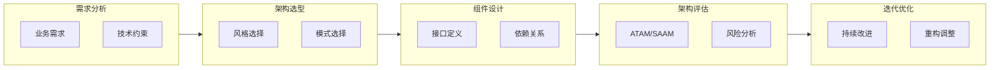
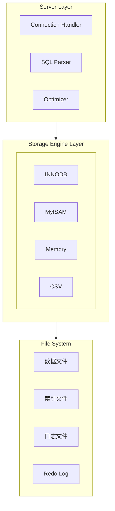
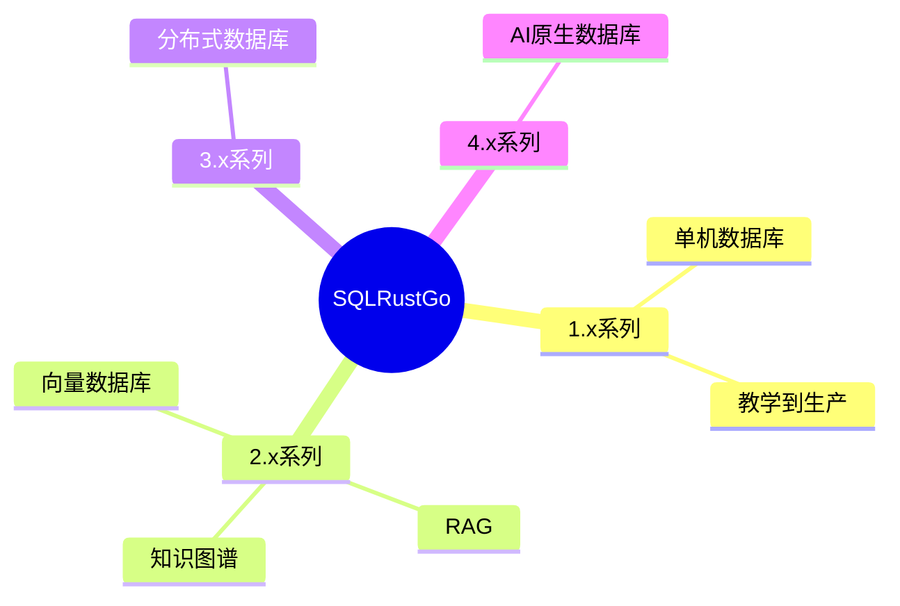
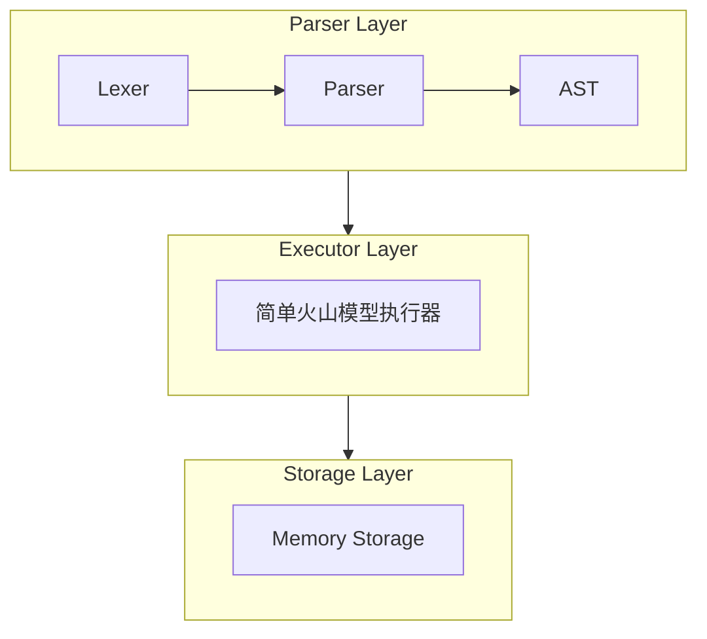
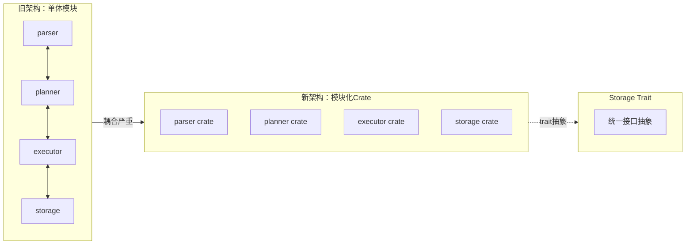
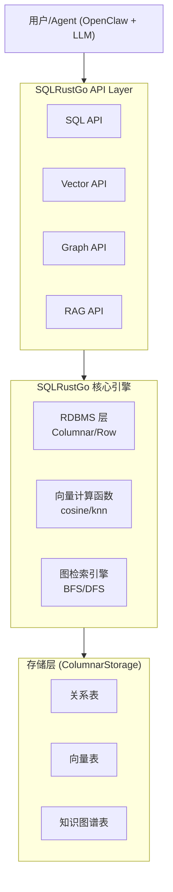
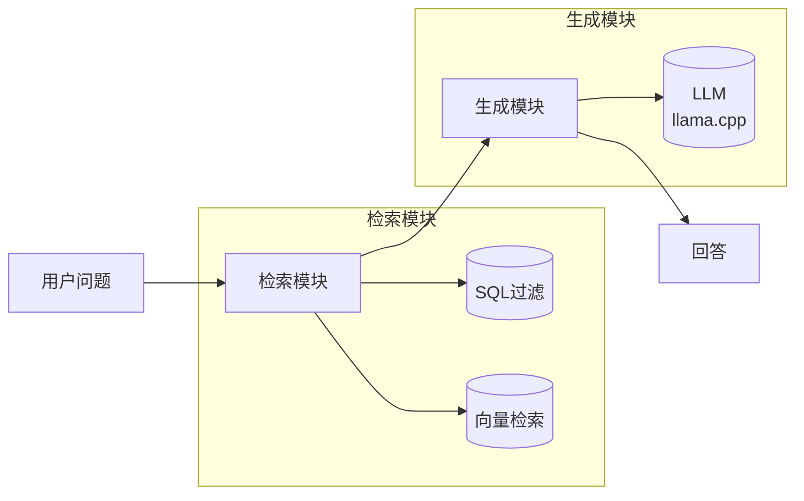
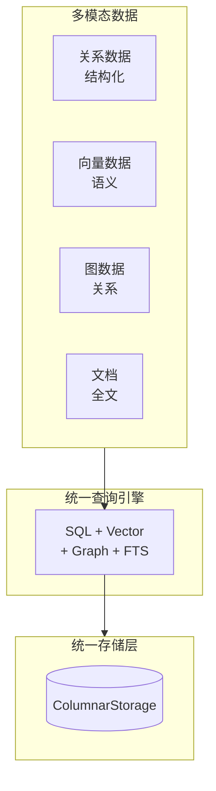
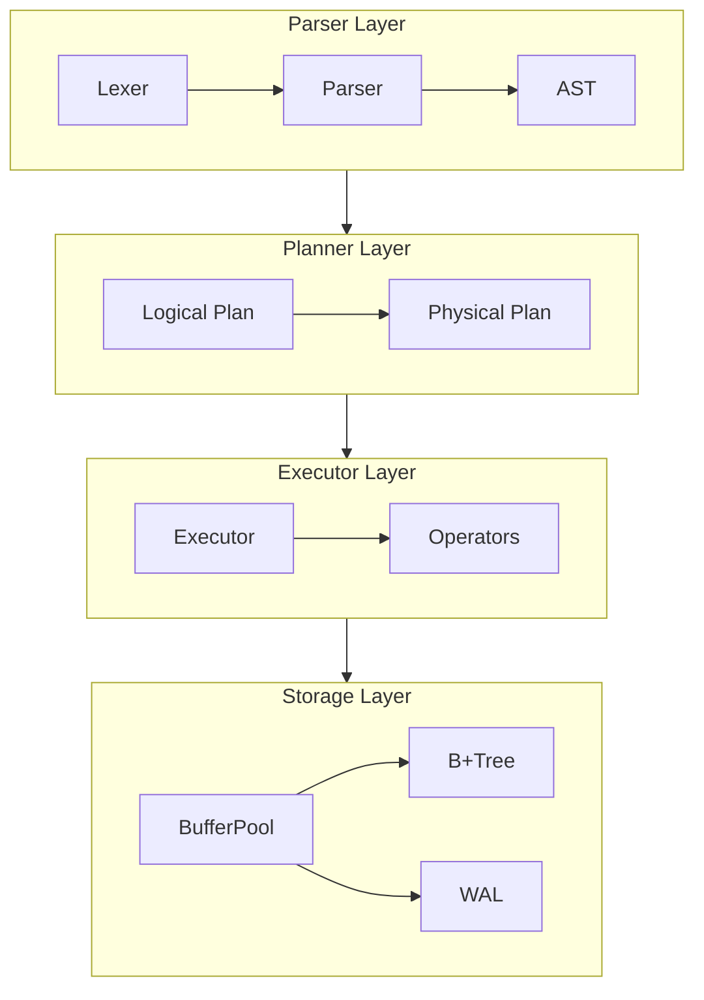
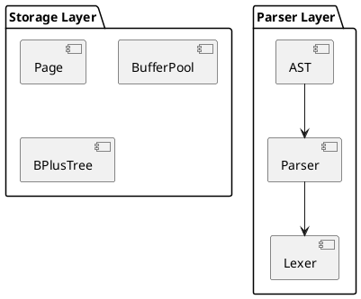

---
马尔普：真实
主题：盖亚
页面：真实
背景颜色：#fff
color: #333
---

<!-- _class: 领导 -->

# 第五讲：架构设计原理与SQLRustGo架构

## AI增强的软件工程

---

# 课程大纲

1. **架构设计概述**（25分钟）
2. **SQLRustGo四层架构设计**（30分钟）
3. **架构图绘制实践**（20分钟）
4. **AI辅助架构设计实践**（10分钟）

---

# Part 1: 架构设计概述

---

## 1.1 What：什么是软件架构

### 定义

软件系统的高层结构，包括组件、组件关系、组件与环境的关系

### 架构的层次

- **业务架构**：业务流程、业务规则
- **应用架构**：功能模块、模块关系
- **数据架构**：数据模型、数据流向
- **技术架构**：技术选型、基础设施

### 架构设计的核心问题

| 问题 | 回答 |
|------|------|
| **What（是什么）** | 系统的顶层结构和组件设计 |
| **Why（为什么）** | 为什么要这样设计，解决了什么问题 |
| **How（怎么做）** | 如何实现这个架构，有哪些方法和工具 |

---

## 1.1 What：什么是软件架构（续）

### 架构的核心要素

- **组件（Component）**：功能单元
- **连接器（Connector）**：组件间的通信机制
- **约束（Constraint）**：架构的限制条件

### 架构设计原则

- **高内聚低耦合**：组件内部紧密相关，组件之间松散依赖
- **关注点分离**：不同层面的问题分开处理
- **单一职责**：每个组件只做一件事
- **开闭原则**：对扩展开放，对修改关闭

---

## 1.2 Why：为什么需要架构设计

### 复杂性管理

- 大型系统包含数百万行代码
- 没有良好架构，系统无法理解和维护
- 架构提供系统的"地图"和"导航"

### 质量保证

- 架构决定系统的质量属性（性能、可扩展性、可靠性）
- 良好架构降低Bug数量
- 提高代码可读性和可维护性

### 成本控制

- **架构设计成本 << 重构成本**
- 良好架构降低长期维护成本
- 提前识别风险，降低后期重构成本

---

## 1.2 Why：为什么需要架构重构

### 架构腐化现象

- **坏味道代码堆积**：临时方案变成永久方案
- **依赖混乱**：模块间循环依赖，难以测试
- **职责蔓延**：模块承担过多职责
- **技术债务累积**：欠下的债总要还

### 架构重构时机

| 征兆 | 说明 | 处理方式 |
|------|------|----------|
| 添加功能困难 | 需要修改多个模块 | 重构边界 |
| 测试困难 | 组件难以隔离测试 | 解耦 |
| 性能下降 | 系统响应变慢 | 优化关键路径 |
| 代码冲突频繁 | 多人协作困难 | 模块化 |

---

## 1.2 Why：为什么需要架构设计（续）

### 团队协作

- 清晰的架构让多人协作成为可能
- 降低沟通成本
- 减少代码冲突

### 风险控制

- 架构设计提前识别风险
- 降低后期重构成本
- 提高系统稳定性

### 业界案例

| 公司 | 架构 | 规模 | 挑战 |
|------|------|------|------|
| Google | 微服务 | 亿级用户 | 全球分布、一致性 |
| Netflix | 云原生 | 2亿+订阅 | 高可用、弹性 |
| 微信 | 分布式 | 13亿用户 | 低延迟、高并发 |
| MySQL | 插件式存储 | 千万级部署 | 兼容性、性能 |

---

## 1.3 How：如何进行架构设计

### 架构设计流程



### 架构风格选择

| 架构风格 | 适用场景 | 优点 | 缺点 |
|---------|---------|------|------|
| 分层架构 | 企业应用、教学 | 结构清晰、易于理解 | 性能开销 |
| 微服务架构 | 大型分布式系统 | 可扩展、独立部署 | 复杂度高 |
| 事件驱动架构 | 实时系统、IoT | 解耦、异步 | 调试困难 |
| 管道过滤器架构 | 数据处理系统 | 可组合、模块化 | 错误处理复杂 |
| 插件架构 | MySQL、VSCode | 灵活扩展、生态 | 版本兼容 |

---

## 1.3 How：如何进行架构设计（续）

### AI辅助架构设计

#### AI辅助工具类型

| 工具类型 | 代表产品 | 用途 |
|----------|----------|------|
| **AI IDE** | Trae IDE, Cursor, Copilot | 代码补全、架构建议 |
| **AI CLI** | Claude CLI, OpenCode CLI | 架构设计、代码生成 |
| **AI WebUI** | ChatGPT, Claude Web | 对话式设计讨论 |

#### AI辅助架构设计的提示词模板

```
设计一个数据库系统的架构，要求：
1. 支持SQL查询
2. 支持数据持久化
3. 支持事务处理
4. 支持并发访问
5. 使用Rust实现
请提供：
- 架构方案建议
- 组件划分及职责
- 接口设计草案
- 关键技术选型
- 潜在风险和替代方案
```

#### AI辅助架构设计的有效策略

1. **分步骤提问**：先问整体框架，再问具体组件
2. **提供约束条件**：明确性能、规模、技术栈要求
3. **要求对比分析**：让AI对比多个方案的优劣
4. **迭代优化**：基于AI建议不断调整和完善

---

# Part 2: 现代数据库架构演进史

---

## 2.1 MySQL发展史与架构演变

### MySQL发展时间线

| 版本 | 年份 | 重大架构变化 | 关键特性 |
|------|------|-------------|----------|
| MySQL 1.0 | 1995 | 初始版本 | 基本SQL支持、ISAM存储引擎 |
| MySQL 3.23 | 2000 | MyISAM存储引擎 | 全文索引、速度优化 |
| MySQL 4.0 | 2003 | InnoDB集成 | 事务支持、MVCC |
| MySQL 5.0 | 2005 | 存储引擎架构 | 插件式存储引擎、触发器、存储过程 |
| MySQL 5.5 | 2010 | 默认InnoDB | 半同步复制、UTF8MB4 |
| MySQL 5.6 | 2013 | 性能优化 | GTID复制、延迟复制、索引条件下推 |
| MySQL 5.7 | 2015 | 性能与安全 | JSON支持、GIS增强、组复制 |
| MySQL 8.0 | 2018 | 重大架构升级 | 窗口函数、CTE、角色、字典 |
| MySQL 8.4 | 2024 | 现代架构 | 向量搜索、Hash Join优化 |

### MySQL架构的核心设计



### MySQL架构演进的启示

| 演进阶段 | 驱动因素 | 架构变化 | 启示 |
|----------|----------|----------|------|
| 事务支持 | 企业级需求 | InnoDB插件化 | 插件架构的必要性 |
| 性能优化 | 大规模数据 | 索引下推、物化路径 | 查询优化的重要性 |
| 云原生 | 云环境需求 | 组复制、InnoDB Cluster | 高可用的架构设计 |
| AI集成 | 向量搜索需求 | 向量索引支持 | 弹性架构的扩展性 |

---

## 2.2 SQLRustGo 1.0~2.1 版本演进

### 版本路线图总览



### v1.0 → v1.1 → v1.2 架构演进

| 版本 | 核心目标 | 架构变化 | 关键特性 |
|------|----------|----------|----------|
| **v1.0** | 基础SQL引擎 | 初始四层架构 | Lexer/Parser, 简单Executor, 内存存储 |
| **v1.1** | 查询执行器 | 完善执行链路 | Planner, B+Tree索引, WAL, 文件存储 |
| **v1.2** | 架构重构 | **模块化Trait抽象** | Crate分离, Storage Trait, 向量化基础 |
| **v1.3** | 高级优化 | Cascades优化器 | 向量化执行, 统计信息, 高级索引 |

### SQLRustGo 1.x 版本功能矩阵

| 功能 | v1.0 | v1.1 | v1.2 | v1.3 |
|------|------|------|------|------|
| SQL解析 | ✅ | ✅ | ✅ | ✅ |
| 逻辑计划 | ✅ | ✅ | ✅ | ✅ |
| 物理计划 | - | ✅ | ✅ | ✅ |
| 火山模型执行 | ✅ | ✅ | - | - |
| 向量化执行 | - | - | ✅ | ✅ |
| 内存存储 | ✅ | ✅ | ✅ | ✅ |
| 文件存储 | - | ✅ | ✅ | ✅ |
| B+Tree索引 | - | ✅ | ✅ | ✅ |
| WAL日志 | - | ✅ | ✅ | ✅ |
| 事务支持 | - | 基础 | 基础 | MVCC |
| CBO优化 | - | 规则 | 简化CBO | 完整CBO |

---

## 2.3 SQLRustGo架构变化的关键节点

### 节点1：v1.0 初始架构（四层分离）

**问题**：需要跑通最小闭环，验证数据库核心流程

**架构**：



**决策理由**：
- 保持简单直接，避免过度设计
- 快速验证SQL解析和执行链路
- 为后续扩展预留接口

### 节点2：v1.1 文件存储与事务支持

**问题**：数据需要持久化，基本事务支持

**架构变化**：
- 添加Planner层（逻辑计划/物理计划分离）
- 添加文件存储（替代纯内存存储）
- 添加WAL日志（保证数据持久性）
- 添加B+Tree索引（加速查询）

**决策理由**：
- 文件存储是生产环境的基本要求
- WAL是保证ACID的必备组件
- B+Tree索引是数据库查询性能的保障

### 节点3：v1.2 模块化重构（核心变化）

**问题**：代码耦合严重，难以独立测试和扩展

**架构变化**：





**决策理由**：
| 驱动因素 | 具体原因 |
|----------|----------|
| 测试需求 | 每层需要独立测试，避免编译依赖 |
| 扩展需求 | 未来需要支持多种存储引擎（列存、分布式） |
| 团队协作 | 不同团队并行开发不同模块 |
| 编译速度 | 改一行代码不需要全量编译 |

**v1.2关键改进**：
- Storage Trait抽象：支持多种存储引擎
- Crate模块化：独立编译、独立测试
- 向量化基础：引入RecordBatch
- 统计信息：支持CBO成本优化

---

## 2.4 SQLRustGo 2.x 架构展望

### 2.x系列核心目标

| 版本 | 核心目标 | 主要功能 |
|------|----------|----------|
| **2.0** | GA单机稳定 | RDBMS核心、TaskScheduler、ParallelExecutor |
| **2.1** | GMP文档检索 | 文档导入、向量化、OpenClaw SQL API |
| **2.2** | 向量数据库 | 向量索引、并行KNN、SQL+Vector联合 |
| **2.3** | RAG+知识库 | 文档问答、LLM集成、全文检索 |
| **2.4** | 知识图谱 | 节点/边表、BFS/DFS、图检索 |
| **2.5** | 全面集成 | SQL+Vector+Graph统一查询 |

### 2.x弹性架构设计



### 弹性架构的必要性和重要性

| 维度 | 传统RDBMS | SQLRustGo 2.x | 优势 |
|------|-----------|----------------|------|
| **数据类型** | 结构化数据 | 结构化+向量+图 | 多模态数据支持 |
| **查询方式** | SQL | SQL + 向量检索 + 图查询 | 统一查询接口 |
| **应用场景** | OLTP/OLAP | OLTP + OLAP + AI问答 | 一站式数据平台 |
| **扩展方式** | 垂直扩展 | 水平扩展 + 模块插拔 | 弹性伸缩 |

---

## 2.5 AI时代的新型数据技术

### 向量搜索（Vector Search）

**背景**：大语言模型(LLM)的爆发导致对向量检索的需求剧增

**核心概念**：
- 将文本、图像等数据转换为向量（Embedding）
- 相似的数据在向量空间中距离相近
- 通过向量距离计算实现语义检索

**向量索引技术**：

| 索引类型 | 原理 | 优势 | 适用场景 |
|----------|------|------|----------|
| **IVF** | 倒排文件索引 | 召回率高 | 大规模数据 |
| **HNSW** | 层次导航小世界图 | 查询快 | 实时检索 |
| **PQ** | 产品量化 | 存储省 | 内存受限 |

**SQLRustGo 2.x向量检索示例**：
```sql
-- 向量相似度检索
SELECT doc_id, title,
       cosine_similarity(embedding, query_embedding) as score
FROM document_embeddings
WHERE doc_type = 'SOP'
ORDER BY score DESC
LIMIT 10;
```

### 全文检索（Full-Text Search）

**核心概念**：
- 文档内容分词处理
- 建立倒排索引
- 支持布尔查询、模糊匹配

**倒排索引结构**：
```
文档1: "清洁验证标准操作流程"
文档2: "设备维护保养SOP"

词项 → 文档列表
清洁 → [文档1]
验证 → [文档1]
标准 → [文档1]
操作 → [文档1, 文档2]
流程 → [文档1]
设备 → [文档2]
维护 → [文档2]
保养 → [文档2]
SOP → [文档1, 文档2]
```

**SQLRustGo全文检索**：
```sql
-- 全文索引创建
CREATE FULLTEXT INDEX idx_content ON document_contents(content);

-- 全文检索查询
SELECT * FROM document_contents
WHERE MATCH(content) AGAINST('+清洁验证 -设备' IN BOOLEAN MODE);
```

### RAG（检索增强生成）

**RAG架构**：



**RAG Pipeline实现**：
```rust
pub struct RAGPipeline {
    sql_executor: SqlExecutor,
    vector_store: VectorStore,
    llm: LlmClient,
}

impl RAGPipeline {
    // 1. 检索相关文档
    pub async fn retrieve(&self, query: &str, top_k: usize) -> Vec<DocChunk> {
        // SQL 过滤 + 向量检索
        let sql_results = self.sql_executor.query(&query).await?;
        let vector_results = self.vector_store.search(&query, top_k).await?;
        // 融合排序
        self.fusion_rerank(sql_results, vector_results)
    }

    // 2. 生成回答
    pub async fn generate(&self, query: &str, context: &[DocChunk]) -> String {
        let prompt = format!(
            "基于以下上下文回答问题。\n\n上下文:\n{}\n\n问题: {}",
            context.iter().map(|c| c.content.as_str()).join("\n---\n"),
            query
        );
        self.llm.generate(&prompt).await
    }
}
```

### 知识图谱（Knowledge Graph）

**核心概念**：
- 用图结构表示知识
- 节点表示实体，边表示关系
- 支持复杂的关系查询和推理

**知识图谱表结构**：
```sql
-- 节点表
CREATE TABLE kg_nodes (
    id UUID PRIMARY KEY,
    type TEXT NOT NULL,  -- 'SOP', 'Device', 'Regulation', 'Person'
    name TEXT NOT NULL,
    description TEXT,
    embedding FLOAT[],  -- 节点向量
    metadata JSONB
);

-- 边表
CREATE TABLE kg_edges (
    id UUID PRIMARY KEY,
    src_id UUID REFERENCES kg_nodes(id),
    dst_id UUID REFERENCES kg_nodes(id),
    relation_type TEXT NOT NULL,  -- 'depends_on', 'uses', 'belongs_to'
    weight FLOAT DEFAULT 1.0,
    metadata JSONB
);
```

**图检索算法**：

| 算法 | 功能 | 场景 |
|------|------|------|
| **BFS** | 广度优先遍历 | 层级关系查询 |
| **DFS** | 深度优先遍历 | 路径探索 |
| **Dijkstra** | 最短路径 | 依赖分析 |
| **PageRank** | 重要性排序 | 关键节点识别 |

**SQL + Graph联合查询**：
```sql
-- 找出SOP涉及特定设备的所有步骤
WITH device AS (
    SELECT id FROM kg_nodes WHERE type = 'Device' AND name = 'Reactor1'
)
SELECT n.*, e.relation_type
FROM kg_nodes n
JOIN kg_edges e ON n.id = e.dst_id
WHERE e.src_id IN (SELECT id FROM device)
  AND n.type = 'Step'
ORDER BY e.weight DESC;
```

### 为什么需要弹性架构

**传统数据库的局限性**：
- 只能处理结构化数据
- 复杂的AI查询需要额外系统
- 数据需要在多个系统间同步
- 一致性难以保证

**弹性架构的优势**：



| 特性 | 传统方案 | 弹性架构 | 收益 |
|------|----------|----------|------|
| 数据同步 | 多系统同步 | 单一数据源 | 一致性保证 |
| 查询接口 | 多个API | 统一SQL | 开发简化 |
| 维护成本 | 多个集群 | 单平台 | 运维简化 |
| AI能力 | 独立向量库 | 内置向量 | 快速上线 |



---

## 2.2 Why：为什么选择四层架构

### 分层架构的优势

- **关注点分离**：每层专注自己的职责
- **易于理解**：清晰的层次结构
- **易于测试**：每层可独立测试
- **易于扩展**：可以替换某一层的实现

### 数据库系统的特性

- **解析层**：处理SQL语法，与存储无关
- **规划层**：优化查询，与具体存储无关
- **执行层**：执行查询，依赖存储层
- **存储层**：管理数据，独立于上层

---

## 2.2 Why：为什么选择四层架构（续）

### 教学价值

- 每层对应数据库系统的核心概念
- 学生可以逐层学习和实现
- 适合AI辅助开发（每层相对独立）

### 可扩展性

- 可以添加新的SQL语法（修改Parser层）
- 可以添加新的优化规则（修改Planner层）
- 可以添加新的执行算子（修改Executor层）
- 可以添加新的存储引擎（修改Storage层）

---

## 2.3 How：四层架构的详细设计

### Parser Layer（解析层）

**组件**：
- **Lexer**：词法分析器，将SQL字符串转换为Token流
- **Parser**：语法分析器，将Token流转换为AST
- **AST**：抽象语法树，表示SQL语句的结构

**输入**：SQL字符串
**输出**：AST（Statement枚举）

**关键技术**：
- 正则表达式（词法分析）
- 递归下降解析（语法分析）
- 错误处理和恢复

---

## 2.3 How：四层架构的详细设计（续）

### Planner Layer（规划层）

**组件**：
- **Logical Planner**：逻辑规划器，生成逻辑执行计划
- **Physical Planner**：物理规划器，生成物理执行计划
- **Optimizer**：查询优化器，优化执行计划

**输入**：AST（来自Parser层）
**输出**：Physical Plan（执行计划）

**关键技术**：
- 基于规则的优化（Rule-based Optimization）
- 基于成本的优化（Cost-based Optimization）
- 索引选择

---

## 2.3 How：四层架构的详细设计（续）

### Executor Layer（执行层）

**组件**：
- **ExecutionEngine**：执行引擎，协调算子执行
- **Operators**：执行算子（Scan, Filter, Project, Join等）
- **Volcano Model**：火山模型，算子迭代执行

**输入**：Physical Plan（来自Planner层）
**输出**：Query Result（查询结果）

**关键技术**：
- 迭代器模式（Iterator Pattern）
- 流水线执行（Pipeline Execution）
- 向量化执行（Vectorized Execution）

---

## 2.3 How：四层架构的详细设计（续）

### Storage Layer（存储层）

**组件**：
- **Page**：存储页，数据存储的基本单位
- **BufferPool**：缓冲池，管理内存中的页
- **BPlusTree**：B+树索引，加速数据查询
- **WAL**：Write-Ahead Log，预写日志，保证事务持久性
- **Transaction Manager**：事务管理器，管理ACID事务

**输入**：读写请求（来自Executor层）
**输出**：数据或操作结果

**关键技术**：
- 页式存储（Page-based Storage）
- 缓冲区管理（Buffer Management）
- B+树索引（B+ Tree Indexing）
- WAL日志（预写式日志记录）
- 并发控制（Concurrency Control）

---

# Part 3: 架构图绘制实践

---

## 3.1 使用PlantUML绘制架构图

### PlantUML组件图语法



---

## 3.2 架构设计评审

### 评审要点

- 架构是否清晰？
- 职责是否分离？
- 是否易于扩展？
- 是否易于测试？

### 评审方法

- **同行评审**（Peer Review）
- **架构评估会议**（Architecture Review Meeting）
- **架构权衡分析**（Tradeoff Analysis）

---

# Part 4: AI辅助架构设计实践

---

## 4.1 使用AI生成架构方案

### 提示词设计

```
为SQLRustGo数据库系统设计架构，要求：
1. 支持SQL解析、查询优化、执行、存储
2. 采用分层架构
3. 每层职责明确
4. 使用Rust实现
请提供架构方案、组件划分、接口设计。
```

### 方案评估

- 评估架构的合理性
- 评估架构的可扩展性
- 评估架构的复杂度

---

## 4.2 使用AI生成架构图

### PlantUML代码生成

```
生成SQLRustGo四层架构的PlantUML代码，要求：
1. 包含Parser、Planner、Executor、Storage四层
2. 标注每层的核心组件
3. 标注层之间的依赖关系
```

### 图形渲染

- 使用PlantUML渲染图形
- 导出为PNG或SVG格式

### 文档输出

- 将架构图嵌入设计文档
- 编写架构说明

---

# 核心知识点总结

---

## 1. 架构设计

- **What**：软件架构的定义、层次、核心要素
- **Why**：复杂性管理、质量保证、团队协作、风险控制、成本控制
- **How**：架构设计流程、架构风格选择、架构评估方法、AI辅助设计

## 2. SQLRustGo四层架构

- **解析器层**：SQL解析
- **Planner Layer**：查询优化
- **Executor Layer**：查询执行
- **Storage Layer**：数据存储

## 3. 架构设计实践

- PlantUML绘制架构图
- 架构设计评审
- AI辅助架构设计

---

# 课后作业

---

## 任务

1. 完成SQLRustGo架构图（使用PlantUML）
2. 编写架构设计文档
3. 使用AI生成一个架构方案并评估

## 预习

- 功能模块划分
- 接口设计原则

---

<!-- _class: 领导 -->

# 谢谢！

## 下节课：功能模块划分与接口设计
