# 第六-七讲：核心模块设计与实现

## AI增强的软件工程

---

# 课程大纲

## 第一周：核心模块设计（2小时）

1. **功能模块划分**（25分钟）
2. **使用UML进行OOA/OOD模块设计**（40分钟）
3. **SQLRustGo 1.0功能模块划分**（30分钟）
4. **接口设计原则与实践**（25分钟）

## 第二周：AI辅助核心模块实现（2小时）

1. **AI辅助开发概述**（20分钟）
2. **AI辅助实现词法分析器**（30分钟）
3. **AI辅助实现语法分析器**（30分钟）
4. **AI辅助实现存储引擎**（25分钟）
5. **从UML到Rust代码的AI辅助转换**（25分钟）

---

# 第一周：核心模块设计

---

## Part 1: 功能模块划分

---

## 1.1 What：什么是功能模块

### 定义

功能模块是具有独立功能的软件单元，通过接口对外提供服务

### 模块的特性

- **独立性**：模块可以独立开发、测试、部署
- **可重用性**：模块可以在不同场景中重用
- **可替换性**：模块可以被其他实现替换
- **封装性**：模块隐藏内部实现细节

---

## 1.1 What：什么是功能模块（续）

### 模块的粒度

- **粗粒度模块**：功能完整、接口复杂（如存储引擎）
- **细粒度模块**：功能单一、接口简单（如词法分析器）

### 模块划分原则

- **高内聚**：模块内部元素紧密相关
- **低耦合**：模块之间依赖最小化
- **单一职责**：一个模块只负责一个功能
- **接口稳定**：模块接口应该稳定，内部实现可以变化

---

## 1.2 Why：为什么需要功能模块划分

### 复杂性管理

- 大型系统包含数百个功能
- 模块化将复杂问题分解为简单问题
- 降低认知负荷

### 团队协作

- 不同团队可以负责不同模块
- 减少代码冲突
- 提高并行开发效率

---

## 1.2 Why：为什么需要功能模块划分（续）

### 可维护性

- 模块化使代码更易理解和修改
- Bug定位更精确
- 重构范围更可控

### 可测试性

- 模块可以独立测试
- 测试覆盖率更高
- Mock和Stub更容易实现

### 可扩展性

- 新功能可以作为新模块添加
- 现有模块可以独立升级
- 支持插件化架构

### 业界案例

- **Linux内核**：模块化设计支持动态加载驱动
- **Chrome浏览器**：多进程架构提高稳定性
- **VS Code**：插件架构支持扩展

---

## 1.3 How：如何进行功能模块划分

### 模块划分方法

| 方法 | 依据 | 示例 | 优点 | 缺点 |
|------|------|------|------|------|
| 按功能划分 | 业务功能 | 用户管理、订单管理 | 符合业务逻辑 | 可能导致功能耦合 |
| 按层次划分 | 系统层次 | 表示层、业务层、数据层 | 结构清晰 | 跨层次调用复杂 |
| 按数据划分 | 数据实体 | 用户模块、商品模块 | 数据一致性好 | 可能产生数据冗余 |

---

## 1.3 How：如何进行功能模块划分（续）

### 模块划分流程

1. **需求分析**：识别系统功能
2. **功能聚类**：将相关功能归类
3. **模块识别**：识别候选模块
4. **接口设计**：设计模块接口
5. **依赖分析**：分析模块依赖关系
6. **迭代优化**：根据反馈优化模块划分

### 模块划分评估

- **内聚度评估**：模块内部元素的相关程度
- **耦合度评估**：模块之间的依赖程度
- **复杂度评估**：模块的复杂程度
- **可测试性评估**：模块是否易于测试

---

## 1.3 How：如何进行功能模块划分（续）

### AI辅助模块划分

```
分析以下数据库系统的需求，进行功能模块划分：
[需求文档]
要求：
1. 识别核心功能模块
2. 说明每个模块的职责
3. 分析模块之间的依赖关系
4. 评估模块划分的合理性（高内聚、低耦合）
```

---

## 1.4 使用UML进行OOA/OOD模块设计

### 1.4.1 UML在模块设计中的作用

UML（统一建模语言）提供了一套标准化的图形建模工具，可以帮助我们在面向对象分析（OOA） 和面向对象设计（OOD） 阶段系统地进行模块划分与接口设计。

| UML图类型 | 在模块设计中的作用 | 对应OOA/OOD阶段 |
|----------|------------------|----------------|
| 用例图 | 捕获系统功能需求，识别参与者，界定系统边界，为模块划分提供顶层功能清单 | OOA |
| 概念类图 | 发现业务实体及关系，识别候选模块（每个类或一组类可能成为一个模块） | OOA |
| 活动图/状态图 | 分析核心业务流程，帮助识别功能内聚的模块边界 | OOA |
| 设计类图 | 定义模块的静态结构：类的属性、方法、可见性；明确模块对外接口 | OOD |
| 顺序图 | 描述对象间的交互时序，验证模块接口的完整性和调用关系 | OOD |
| 组件图 | 将类或包组织为可部署的组件（模块），定义组件提供的接口和依赖的接口 | OOD |
| 包图 | 划分顶层模块，展示模块间的依赖关系，指导项目目录结构 | OOD |

---

## 1.4.2 OOA阶段：从需求到候选模块

### 步骤1：绘制用例图

根据需求文档，识别所有参与者（用户、外部系统）和用例（系统提供的完整功能）。

用例图的系统边界框直接对应模块划分的顶层范围。

**示例：SQLRustGo 1.0核心用例图**

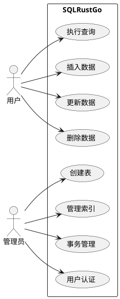

---

## 1.4.2 OOA阶段：从需求到候选模块（续）

### 步骤2：建立概念类图

使用名词分析法从用例描述中提取候选类（业务实体）。

识别类之间的关联、聚合、组合、继承关系。

概念类图中只写类名和属性名，不写方法（分析阶段不关心实现）。

**示例：SQLRustGo 1.0概念类图（简化）**

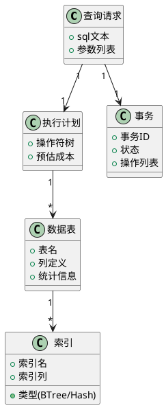

---

## 1.4.2 OOA阶段：从需求到候选模块（续）

### 步骤3：基于概念类图初步分组（候选模块）

将高内聚的类归入同一个模块。例如：

- **Parser模块**：包含查询请求、词法单元、语法树节点等类。
- **Planner模块**：包含执行计划、优化规则、成本估算器等类。
- **Executor模块**：包含操作符、执行上下文、记录批次等类。
- **Storage模块**：包含数据表、索引、页、缓冲池、事务日志等类。
- **Transaction模块**：包含事务、锁、MVCC等类。
- **Security模块**：包含用户认证、权限管理等类。

---

## 1.4.3 OOD阶段：细化模块与接口设计

### 步骤4：绘制设计类图（细化接口）

将概念类转化为具体的设计类，添加方法签名、属性类型、可见性（+ public, - private）。

明确接口（interface/trait），将模块的公共API抽象出来。

**示例：Storage模块的设计类图（部分）**

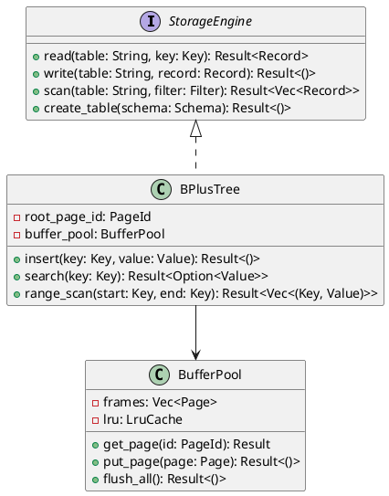

---

## 1.4.3 OOD阶段：细化模块与接口设计（续）

### 步骤5：绘制顺序图（验证接口交互）

选择一个核心用例（如"执行查询"），绘制对象间的消息交互。

检查模块接口的调用顺序、参数传递、返回值是否合理，发现遗漏或冗余的接口。

**示例：SQL查询执行的顺序图**

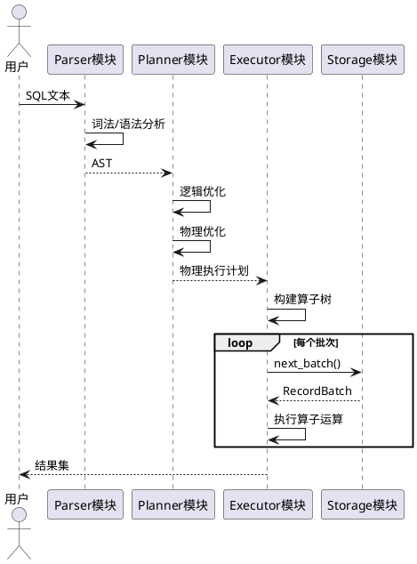

---

## 1.4.3 OOD阶段：细化模块与接口设计（续）

### 步骤6：绘制组件图（定义模块边界与依赖）

每个组件对应一个独立部署/编译单元（如Rust crate、Java jar）。

用接口（lollipop符号）表示组件提供的服务，用依赖（虚线箭头）表示组件需要的接口。

组件图是模块划分的最终输出，直接指导项目代码结构。

**示例：SQLRustGo 1.0组件图**

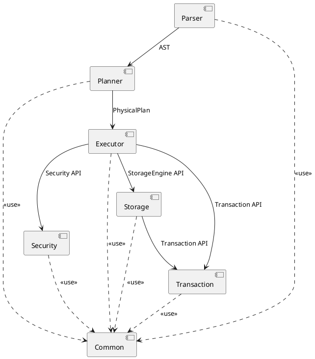

---

## 1.4.4 将UML模型映射到SQLRustGo 1.0模块划分

| UML模型 | 映射结果 | 在代码中的体现 |
|---------|----------|----------------|
| 组件图 | 模块边界 | Cargo.toml中的crate依赖 |
| 设计类图中的接口（trait） | 模块公共API | pub trait StorageEngine { ... } |
| 设计类图中的具体类 | 模块内部实现 | pub struct BPlusTree { ... } |
| 顺序图中的交互 | 模块间的调用关系 | 函数调用、消息传递 |
| 包图 | 源代码目录结构 | crates/parser/, crates/optimizer/等 |

**实践建议：**

- 在编写任何代码之前，先用UML组件图和包图完成顶层模块划分。
- 为每个核心模块定义接口（trait），通过设计类图固定下来。
- 使用顺序图验证关键流程的接口调用，确保模块之间的依赖合理（无循环依赖）。
- 将UML模型作为设计文档的一部分，提交到代码仓库（可使用PlantUML源码），便于团队同步和后续维护。

---

## 1.4.5 AI辅助UML建模

AI工具（如Claude、ChatGPT）可以根据需求描述快速生成PlantUML代码：

**提示词示例：**

```text
为SQLRustGo 1.0数据库系统设计UML组件图，包含以下模块：
- Parser（解析器）
- Planner（规划器）
- Executor（执行器）
- Storage（存储引擎）
- Transaction（事务）
- Security（安全）
- Common（公共组件）
要求：显示模块间的依赖关系和提供的接口。
```

AI可以输出可直接渲染的PlantUML源码，大幅提升建模效率。但需要人工审查模型的正确性和合理性。

---

## 1.4.6 完整模块设计案例：Parser模块从OOA到OOD

本案例展示如何从需求到完整设计，串联所有7张UML图：

**Step 1: 用例图**

识别Parser模块的参与者和功能：

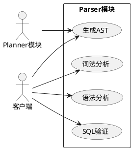

**Step 2: 概念类图**

从用例中提取业务实体：

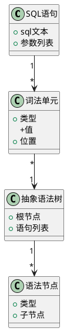

**Step 3: 活动图**

描述Parser的工作流程：

```plantuml
@startuml
start
:接收SQL语句;
:词法分析生成Token流;
diamond "语法正确?"
  -> 是: 继续
  -> 否: 生成语法错误
:语法分析构建AST;
diamond "语义正确?"
  -> 是: 输出AST
  -> 否: 生成语义错误
stop
@enduml
```

**Step 4: 顺序图**

验证对象间的交互：

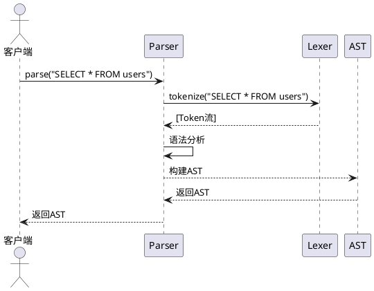

**Step 5: 状态图**

描述Parser的状态变化：

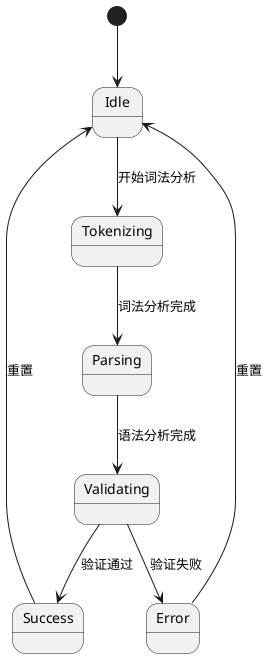

**Step 6: 组件图**

定义模块边界和依赖：

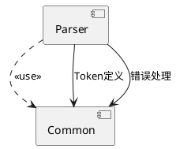

**Step 7: 设计类图**

详细定义接口和实现：

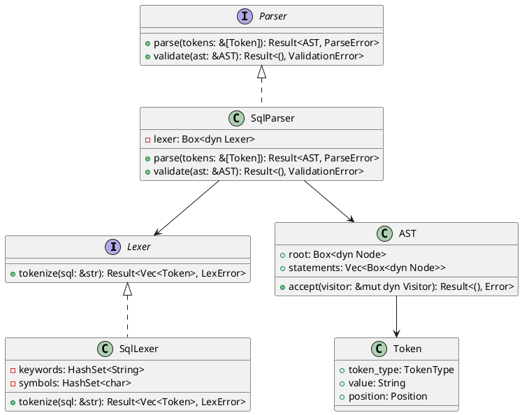

---

## 1.4.7 UML验证检查表

| 图表类型 | 检查项目 | 常见问题 | 解决方案 |
|---------|----------|----------|----------|
| **用例图** | 参与者是否完整？ | 遗漏外部系统 | 列出所有与模块交互的实体 |
| | 用例是否覆盖所有功能？ | 功能遗漏 | 对照需求文档逐条检查 |
| | 关系是否正确？ | 箭头方向错误 | 参与者发起用例，不是相反 |
| **概念类图** | 类是否完整？ | 遗漏业务实体 | 从用例描述中提取所有名词 |
| | 关系是否合理？ | 关系类型错误 | 明确是关联、聚合还是组合 |
| | 属性是否必要？ | 属性过多 | 只保留核心属性，避免实现细节 |
| **活动图** | 流程是否完整？ | 缺少分支或终止 | 确保所有路径都有终点 |
| | 决策是否合理？ | 逻辑不清晰 | 使用明确的条件判断 |
| **顺序图** | 交互是否合理？ | 消息顺序错误 | 按照实际调用顺序排列 |
| | 激活条是否正确？ | 激活条缺失 | 显示对象的活动时间 |
| **状态图** | 状态是否完整？ | 遗漏状态 | 分析对象的所有可能状态 |
| | 转换是否合理？ | 转换条件不明确 | 为每个转换添加触发事件 |
| **组件图** | 依赖是否单向？ | 循环依赖 | 确保依赖方向一致（自下而上） |
| | 接口是否清晰？ | 接口不明确 | 使用lollipop符号表示提供的接口 |
| **设计类图** | 接口是否合理？ | 接口过大 | 遵循ISP原则，接口小型化 |
| | 可见性是否正确？ | 过度暴露 | 只暴露必要的方法和属性 |
| | 关系是否清晰？ | 关系复杂 | 简化关系，使用依赖注入 |

---

## 1.4.8 AI辅助UML建模的迭代示例

**第一轮：生成初步用例图**

提示词：
```
为SQLRustGo的Parser模块生成用例图，参与者包括Planner和客户端，用例包括词法分析、语法分析、生成AST、SQL验证。
```

AI输出可能缺少系统边界。

**第二轮：优化用例图**

提示词：
```
修改之前的用例图，添加系统边界矩形，明确标注"Parser模块"，并确保所有参与者都在系统边界外。
```

**第三轮：生成概念类图**

提示词：
```
基于用例图，为Parser模块生成概念类图，包含SQL语句、词法单元、抽象语法树、语法节点等类，以及它们之间的关系。
```

AI输出可能缺少属性。

**第四轮：完善概念类图**

提示词：
```
为概念类图添加属性：SQL语句包含sql文本和参数列表，词法单元包含类型、值和位置，抽象语法树包含根节点和语句列表。
```

通过多轮迭代，可以逐步完善AI生成的UML图，确保其正确性和完整性。

---

## Part 2: SQLRustGo 1.0功能模块划分

---

## 2.1 模块划分方案

```
┌─────────────────────────────────────────────────────────┐
│                    Parser 模块                           │
│  • Lexer：词法分析器                                     │
│  • Parser：语法分析器                                    │
│  • Token：词法单元                                       │
│  职责：将SQL字符串转换为AST                              │
└─────────────────────────────────────────────────────────┘
                          ↓
┌─────────────────────────────────────────────────────────┐
│                    Planner 模块                          │
│  • LogicalPlanner：逻辑规划器                            │
│  • PhysicalPlanner：物理规划器                           │
│  • Optimizer：查询优化器                                 │
│  职责：生成优化的执行计划                                │
└─────────────────────────────────────────────────────────┘
```

---

## 2.1 模块划分方案（续）

```
                          ↓
┌─────────────────────────────────────────────────────────┐
│                    Executor 模块                         │
│  • ExecutionEngine：执行引擎                             │
│  • Operators：执行算子                                   │
│  • StoredProc：存储过程                                 │
│  • Trigger：触发器                                      │
│  职责：执行查询并返回结果                                │
└─────────────────────────────────────────────────────────┘
                          ↓
┌─────────────────────────────────────────────────────────┐
│                    Storage 模块                          │
│  • PageManager：页管理器                                 │
│  • BufferPool：缓冲池                                   │
│  • BPlusTree：B+树索引                                  │
│  • WAL：预写日志                                        │
│  • Replication：复制                                    │
│  职责：数据存储、索引、事务                              │
└─────────────────────────────────────────────────────────┘
```

---

## 2.1 模块划分方案（续）

```
                          ↓
┌─────────────────────────────────────────────────────────┐
│                    Transaction 模块                       │
│  • TransactionManager：事务管理器                        │
│  • LockManager：锁管理器                               │
│  • MVCC：多版本并发控制                                 │
│  职责：事务处理、并发控制                                │
└─────────────────────────────────────────────────────────┘
                          ↓
┌─────────────────────────────────────────────────────────┐
│                    Security 模块                         │
│  • Authentication：认证                                 │
│  • Authorization：授权                                  │
│  • Audit：审计                                          │
│  职责：安全管理、权限控制                                │
└─────────────────────────────────────────────────────────┘
                          ↓
┌─────────────────────────────────────────────────────────┐
│                    Common 模块                           │
│  • Value：数据值类型                                     │
│  • DataType：数据类型枚举                                │
│  • SqlError：错误类型                                   │
│  职责：公共数据类型和工具                                │
└─────────────────────────────────────────────────────────┘
```

---

## 2.2 模块依赖关系

### 依赖方向

- **Parser → Common**：依赖公共数据类型
- **Planner → Parser, Common**：依赖AST和公共类型
- **Executor → Planner, Storage, Transaction, Security, Common**：依赖执行计划和存储层
- **Storage → Transaction, Common**：依赖事务和公共数据类型
- **Transaction → Common**：依赖公共数据类型
- **Security → Common**：依赖公共数据类型
- **所有模块 → Common**：依赖公共类型

### 依赖原则

- **上层依赖下层，下层不依赖上层**
- **避免循环依赖**
- **依赖抽象而非具体实现**

---

## 2.3 模块接口设计

### Parser模块接口

```rust
pub trait Lexer {
    fn next_token(&mut self) -> Result<Token, SqlError>;
}

pub trait Parser {
    fn parse(&mut self, sql: &str) -> Result<Statement, SqlError>;
}
```

### Planner模块接口

```rust
pub trait LogicalPlanner {
    fn plan(&self, stmt: &Statement) -> Result<LogicalPlan, SqlError>;
}

pub trait PhysicalPlanner {
    fn plan(&self, logical: &LogicalPlan) -> Result<PhysicalPlan, SqlError>;
}

pub trait Optimizer {
    fn optimize(&self, plan: &LogicalPlan) -> Result<LogicalPlan, SqlError>;
}
```

---

## 2.3 模块接口设计（续）

### Executor模块接口

```rust
pub trait ExecutionEngine {
    fn execute(&mut self, plan: &PhysicalPlan) -> Result<ExecutionResult, SqlError>;
}

pub trait Operator {
    fn next_batch(&mut self) -> Result<Option<RecordBatch>, SqlError>;
}
```

### Storage模块接口

```rust
pub trait StorageEngine {
    fn read(&self, table: &str, key: &Key) -> Result<Record, SqlError>;
    fn write(&mut self, table: &str, record: Record) -> Result<()>;
    fn scan(&self, table: &str, filter: &Filter) -> Result<Vec<Record>>;
    fn create_table(&mut self, schema: Schema) -> Result<()>;
}

pub trait BufferPool {
    fn get_page(&mut self, page_id: PageId) -> Result<&Page, SqlError>;
    fn put_page(&mut self, page: Page) -> Result<()>;
}
```

---

## Part 3: 接口设计原则与实践

---

## 3.1 What：什么是接口设计

### 接口的定义

模块之间交互的契约

### 接口的组成

- **方法签名**：方法名、参数、返回值
- **行为契约**：前置条件、后置条件、不变式
- **错误处理**：错误类型、错误传播

### 接口的类型

- **同步接口**：调用者等待结果
- **异步接口**：调用者不等待结果
- **流式接口**：返回数据流

---

## 3.2 Why：接口设计的重要性

### 解耦

- 接口降低模块之间的耦合度

### 可测试性

- 接口使Mock和Stub更容易实现

### 可替换性

- 接口允许替换实现而不影响调用者

### 可扩展性

- 接口支持新功能的添加

### 文档作用

- 接口本身就是文档

---

## 3.3 How：接口设计原则

### 接口隔离原则（ISP）

- 接口要小而专一
- 客户端不应该依赖它不需要的接口

### 最小知识原则（Law of Demeter）

- 模块只与直接的朋友通信
- 减少模块之间的依赖

### 契约式设计（Design by Contract）

- 明确前置条件、后置条件、不变式
- 使用类型系统保证契约

---

## 3.3 How：接口设计原则（续）

### 错误处理原则

- 使用Result类型表示可能失败的操作
- 错误类型应该包含足够的信息
- 错误应该向上传播到合适的处理层

### Rust接口设计实践

- 使用trait定义接口
- 使用泛型支持多种实现
- 使用生命周期标注引用关系
- 使用Send和Sync标记线程安全

---

# 第二周：AI辅助核心模块实现

---

## Part 1: AI辅助开发概述

---

## 1.1 What：AI辅助开发是什么

### 定义

使用AI工具辅助软件开发的各个环节

### AI辅助开发的阶段

- **需求分析**：AI分析需求文档，识别功能点
- **设计阶段**：AI生成设计方案、架构图、接口设计
- **编码阶段**：AI生成代码、补全代码、重构代码
- **测试阶段**：AI生成测试用例、分析覆盖率
- **文档阶段**：AI生成文档、翻译文档

---

## 1.1 What：AI辅助开发是什么（续）

### AI辅助开发工具

- **AI-IDE**：光标、TRAE IDE、克劳德代码
- **AI编程助手**：GitHub Copilot、TabNine
- **AI聊天机器人**：ChatGPT、Claude、Gemini
- **AI代码审查**：SonarQube AI、DeepCode

---

## 1.2 Why：为什么使用AI辅助开发

### 提高效率

- AI可以快速生成样板代码
- AI可以自动补全代码
- AI可以批量生成测试用例
- **开发效率提升2-5倍**

### 降低门槛

- 新手可以借助AI快速上手
- AI可以解释复杂代码
- AI可以提供最佳实践建议

---

## 1.2 Why：为什么使用AI辅助开发（续）

### 提高质量

- AI可以生成规范的代码
- AI可以自动发现Bug
- AI可以建议重构方案

### 加速学习

- AI可以解释概念
- AI可以提供示例
- AI可以回答问题

### 业界案例

- **GitHub**：Copilot帮助开发者提高55%的编码速度
- **Microsoft**：AI辅助开发减少30%的Bug
- **Google**：AI代码审查提高代码质量

---

## 1.3 How：如何有效使用AI辅助开发

### AI辅助开发流程

1. **明确需求**：清楚描述要实现的功能
2. **设计提示词**：编写清晰、完整的提示词
3. **生成代码**：使用AI生成初始代码
4. **代码审查**：人工审查AI生成的代码
5. **测试验证**：编写测试用例，验证功能
6. **迭代优化**：根据反馈优化代码

### 提示词工程

- **清晰性**：明确任务目标，避免歧义
- **完整性**：提供必要上下文，指定约束条件
- **结构性**：使用结构化格式，分步骤描述
- **可迭代性**：便于反馈修正，支持渐进优化

### 代码审查要点

- **正确性**：代码是否实现了预期功能
- **安全性**：是否存在安全漏洞
- **性能**：是否存在性能问题
- **可读性**：代码是否易于理解
- **可维护性**：代码是否易于修改

---

## 1.3 How：如何有效使用AI辅助开发（续）

### AI辅助开发的局限性

- **上下文窗口限制**：AI无法理解整个大型项目
- **创造性限制**：AI难以创造全新的解决方案
- **领域知识限制**：AI缺乏特定领域的专业知识
- **责任问题**：AI生成的代码需要人工负责

---

## Part 2: AI辅助实现词法分析器

---

## 2.1 词法分析原理

### 词法分析的作用

将SQL字符串转换为Token流

### Token类型

- **关键字**：SELECT, FROM, WHERE, INSERT, UPDATE, DELETE
- **标识符**：表名、列名
- **字面量**：字符串、整数、浮点数、布尔值
- **运算符**：=, <>, <, >, <=, >=, +, -, *, /
- **分隔符**：, ( ) ; .

### 正则表达式

描述Token的模式

### 有限状态机（FSM）

实现词法分析器

---

## 2.2 What：使用AI生成Token定义

### 提示词设计

```
设计一个SQL词法分析器的Token枚举，支持：
- SQL关键字：SELECT, FROM, WHERE, INSERT, UPDATE, DELETE, CREATE, DROP, TABLE
- 标识符：表名、列名
- 字面量：字符串、整数、浮点数、布尔值
- 运算符：=, <>, <, >, <=, >=, +, -, *, /, AND, OR, NOT
- 分隔符：, ( ) ; .
使用Rust枚举实现，包含Debug和Clone trait。
```

---

## 2.2 What：使用AI生成Token定义（续）

### AI输出

```rust
#[derive(Debug, Clone, PartialEq)]
pub enum Token {
    // 关键字
    Select, From, Where, Insert, Update, Delete,
    Create, Drop, Table,
    
    // 标识符和字面量
    Identifier(String),
    IntegerLiteral(i64),
    FloatLiteral(f64),
    StringLiteral(String),
    BooleanLiteral(bool),
    
    // 运算符
    Equal, NotEqual, Less, Greater, LessEqual, GreaterEqual,
    Plus, Minus, Star, Slash,
    And, Or, Not,
    
    // 分隔符
    Comma, LeftParen, RightParen, Semicolon, Dot,
    
    // 结束标记
    Eof,
}
```

---

## 2.3 How：使用AI生成词法分析器

### 提示词设计

```
基于以下Token定义，实现一个SQL词法分析器：
[Token定义代码]
要求：
1. 实现Lexer结构体，包含input和position字段
2. 实现next_token()方法，返回下一个Token
3. 支持跳过空白字符（空格、制表符、换行）
4. 支持识别关键字和标识符（区分大小写）
5. 支持识别整数和浮点数字面量
6. 支持识别字符串字面量（单引号和双引号）
7. 支持识别运算符和分隔符
8. 使用Rust实现，考虑错误处理
```

### 代码审查要点

- 检查逻辑是否正确
- 检查错误处理是否完善
- 检查边界条件是否处理

### 测试验证

```rust
#[test]
fn test_lexer_select() {
    let mut lexer = Lexer::new("SELECT * FROM users");
    assert_eq!(lexer.next_token().unwrap(), Token::Select);
    assert_eq!(lexer.next_token().unwrap(), Token::Star);
    assert_eq!(lexer.next_token().unwrap(), Token::From);
    assert_eq!(lexer.next_token().unwrap(), Token::Identifier("users".to_string()));
}
```

---

## Part 3: AI辅助实现语法分析器

---

## 3.1 语法分析原理

### 语法分析的作用

将Token流转换为AST

### 上下文无关文法

描述SQL语法

### 抽象语法树（AST）

表示SQL语句的结构

### 递归下降解析

实现语法分析器

---

## 3.2 What：使用AI生成AST定义

### 提示词设计

```
设计SQL语句的AST节点，支持：
- SELECT语句：columns（列列表）, from_table（表名）, where_clause（WHERE条件）, limit（限制数量）
- INSERT语句：table（表名）, columns（列列表）, values（值列表）
- UPDATE语句：table（表名）, set_clauses（SET子句）, where_clause（WHERE条件）
- DELETE语句：table（表名）, where_clause（WHERE条件）
- CREATE TABLE语句：table_name（表名）, columns（列定义列表）
- DROP TABLE语句：table_name（表名）
使用Rust结构体和枚举实现，包含Debug和Clone trait。
```

---

## 3.3 How：使用AI生成语法分析器

### 提示词设计

```
基于以下Token和AST定义，实现一个SQL语法分析器：
[Token定义代码]
[AST定义代码]
要求：
1. 实现Parser结构体，包含lexer字段
2. 实现parse()方法，解析SQL字符串并返回AST
3. 支持解析SELECT、INSERT、UPDATE、DELETE、CREATE TABLE、DROP TABLE语句
4. 使用Rust实现，考虑错误处理
5. 提供清晰的错误信息
```

### 代码审查要点

- 检查解析逻辑是否正确
- 检查错误处理是否完善
- 检查是否支持所有SQL语句

### 测试验证

```rust
#[test]
fn test_parser_select() {
    let mut parser = Parser::new("SELECT id, name FROM users WHERE age > 18");
    let stmt = parser.parse().unwrap();
    match stmt {
        Statement::Select(select) => {
            assert_eq!(select.columns, vec!["id", "name"]);
            assert_eq!(select.from_table, "users");
        }
        _ => panic!("Expected SELECT statement"),
    }
}
```

---

## Part 4: AI辅助实现存储引擎

---

## 4.1 存储引擎原理

### 页式存储

数据以页为单位存储

### 缓冲池

管理内存中的页

### B+树索引

加速数据查询

### WAL日志

保证事务持久性

---

## 4.2 What：使用AI设计页结构

### 提示词设计

```
设计数据库存储页结构，要求：
1. 页大小：8KB
2. 页头：页ID（4字节）、页类型（1字节）、空闲空间指针（2字节）
3. 数据区：存储实际数据
4. 方法：read(offset, len)读取数据、write(offset, data)写入数据
5. 使用Rust实现，考虑内存安全
6. 支持序列化和反序列化
```

---

## 4.3 How：使用AI实现缓冲池

### 提示词设计

```
实现数据库缓冲池管理器，要求：
1. 容量可配置（默认100页）
2. 使用LRU置换算法
3. 支持get(page_id)获取页面
4. 支持put(page_id, page)插入页面
5. 支持脏页标记
6. 支持flush()刷盘所有脏页
7. 使用Rust实现，考虑线程安全
8. 使用HashMap和LinkedList实现LRU
```

### 代码审查要点

- 检查LRU算法是否正确
- 检查并发安全是否保证
- 检查脏页管理是否完善

### 测试验证

```rust
#[test]
fn test_buffer_pool() {
    let mut pool = BufferPool::new(10);
    let page = Page::new(1);
    pool.put_page(1, page).unwrap();
    
    let retrieved = pool.get_page(1).unwrap();
    assert_eq!(retrieved.id, 1);
}
```

---

## Part 5: 从UML到Rust代码的AI辅助转换

---

## 5.1 What：UML到Rust代码的转换

### 转换流程

1. **UML设计类图 → Rust trait/struct**
2. **接口定义 → Rust trait**
3. **类实现 → Rust struct**
4. **关系 → Rust引用/依赖**

### 转换原则

- **接口隔离**：一个trait对应一个职责
- **依赖注入**：通过参数传递依赖
- **所有权清晰**：明确数据所有权
- **错误处理**：使用Result类型

---

## 5.2 How：从设计类图生成Rust代码

### 示例：Storage模块设计类图

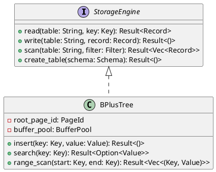

---

## 5.2 How：从设计类图生成Rust代码（续）

### 提示词设计

```
基于以下UML设计类图，生成Rust代码：

接口：
- StorageEngine：read, write, scan, create_table方法
- BPlusTree：实现StorageEngine，包含insert, search, range_scan方法

要求：
1. 使用Rust trait定义接口
2. 使用struct实现具体类
3. 包含适当的错误处理
4. 考虑所有权和生命周期
5. 提供基本的测试用例
```

### AI生成的代码

```rust
// 接口定义
pub trait StorageEngine {
    fn read(&self, table: &str, key: &Key) -> Result<Record>;
    fn write(&mut self, table: &str, record: Record) -> Result<()>;
    fn scan(&self, table: &str, filter: &Filter) -> Result<Vec<Record>>;
    fn create_table(&mut self, schema: Schema) -> Result<()>;
}

// 具体实现
pub struct BPlusTree {
    root_page_id: PageId,
    buffer_pool: BufferPool,
}

impl BPlusTree {
    pub fn new(buffer_pool: BufferPool) -> Self {
        BPlusTree {
            root_page_id: 0,
            buffer_pool,
        }
    }
    
    pub fn insert(&mut self, key: Key, value: Value) -> Result<()> {
        // 实现B+树插入
    }
    
    pub fn search(&self, key: &Key) -> Result<Option<Value>> {
        // 实现B+树搜索
    }
    
    pub fn range_scan(&self, start: &Key, end: &Key) -> Result<Vec<(Key, Value)>> {
        // 实现范围扫描
    }
}

impl StorageEngine for BPlusTree {
    // 实现StorageEngine接口
}
```

---

## 5.3 AI辅助调试和重构

### AI辅助调试

#### 示例：编译错误分析

**错误信息：**
```
error[E0382]: use of moved value: `buffer_pool`
  --> src/storage/bptree.rs:10:13
   |
9  |     pub fn new(buffer_pool: BufferPool) -> Self {
   |                ------------ move occurs because `buffer_pool` has type `BufferPool`, which does not implement the `Copy` trait
10 |         BPlusTree {
11 |             root_page_id: 0,
12 |             buffer_pool,
   |             ^^^^^^^^^^^ value moved here
13 |         }
14 |     }
```

**提示词：**
```
分析以下Rust编译错误，提供修复方案：
[错误信息]
```

**AI解决方案：**
```rust
// 修复方案1：使用引用
pub struct BPlusTree {
    root_page_id: PageId,
    buffer_pool: &'a mut BufferPool,
}

// 修复方案2：使用Arc<Mutex<BufferPool>>
use std::sync::{Arc, Mutex};

pub struct BPlusTree {
    root_page_id: PageId,
    buffer_pool: Arc<Mutex<BufferPool>>,
}
```

---

## 5.3 AI辅助调试和重构（续）

### AI辅助重构

#### 示例：提取函数

**提示词：**
```
重构以下代码，提取重复的逻辑为单独的函数：
[代码]
```

**AI解决方案：**
```rust
// 原代码
fn process_batch(&mut self, batch: &RecordBatch) -> Result<()> {
    for record in batch.records {
        if self.validate_record(&record)? {
            self.index_record(&record)?;
            self.store_record(&record)?;
        }
    }
    Ok(())
}

// 重构后
fn process_batch(&mut self, batch: &RecordBatch) -> Result<()> {
    for record in batch.records {
        self.process_record(&record)?;
    }
    Ok(())
}

fn process_record(&mut self, record: &Record) -> Result<()> {
    if self.validate_record(record)? {
        self.index_record(record)?;
        self.store_record(record)?;
    }
    Ok(())
}
```

---

## 5.4 存储引擎B+树和WAL的AI生成

### B+树实现

#### 提示词设计

```
实现B+树索引，要求：
1. 支持插入、搜索、范围扫描操作
2. 节点大小：16KB
3. 分支因子：默认128
4. 支持页面管理
5. 使用Rust实现
6. 考虑错误处理
7. 提供测试用例
```

### WAL（预写日志）实现

#### 提示词设计

```
实现数据库WAL（预写日志），要求：
1. 支持事务日志记录
2. 支持日志回放（recovery）
3. 支持检查点（checkpoint）
4. 日志格式：LSN + 操作类型 + 数据
5. 使用Rust实现
6. 考虑性能优化
7. 提供测试用例
```

---

# 核心知识点总结

---

## 第一周：核心模块设计

### 1. 功能模块划分

- **What**：功能模块的定义、特性、粒度、划分原则
- **Why**：复杂性管理、团队协作、可维护性、可测试性、可扩展性
- **How**：划分方法、划分流程、评估方法、AI辅助划分

### 2. UML进行OOA/OOD模块设计

- **What**：UML图类型及作用
- **Why**：系统地进行模块划分与接口设计
- **How**：OOA阶段（用例图、概念类图）、OOD阶段（设计类图、顺序图、组件图）
- **实践**：将UML模型映射到SQLRustGo 1.0模块划分
- **AI辅助**：使用AI生成PlantUML代码

### 3. SQLRustGo 1.0模块划分

- Parser模块、Planner模块、Executor模块、Storage模块、Transaction模块、Security模块、Common模块
- 模块依赖关系
- 模块接口设计

### 4. 接口设计

- 接口设计原则：ISP、最小知识原则、契约式设计、错误处理原则
- Rust接口设计实践
- AI辅助接口设计

## 第二周：AI辅助核心模块实现

### 1. AI辅助开发

- **What**：AI辅助开发的定义、阶段、工具
- **Why**：提高效率、降低门槛、提高质量、加速学习
- **How**：开发流程、提示词工程、代码审查、局限性

### 2. AI辅助实现词法分析器

- Token定义
- Lexer实现
- 测试验证

### 3. AI辅助实现语法分析器

- AST定义
- Parser实现
- 测试验证

### 4. AI辅助实现存储引擎

- Page结构
- BufferPool实现
- 测试验证

### 5. 从UML到Rust代码的AI辅助转换

- UML到Rust的转换流程
- 从设计类图生成代码
- AI辅助调试和重构
- B+树和WAL的AI生成

---

# 课后作业

## 第一周作业

1. 完成SQLRustGo 1.0模块划分文档
2. 为4个核心模块（Parser、Planner、Executor、Storage）绘制UML图
3. 设计所有模块的接口
4. 绘制模块依赖图

## 第二周作业

1. 完成词法分析器实现
2. 完成语法分析器实现
3. 完成页结构和缓冲池实现
4. 编写测试用例
5. 从UML设计类图生成Rust代码框架

## 预习

- 测试驱动开发（TDD）
- Alpha版本验收

---

# 谢谢！

## 下节课：测试驱动开发与Alpha版本