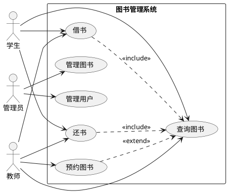
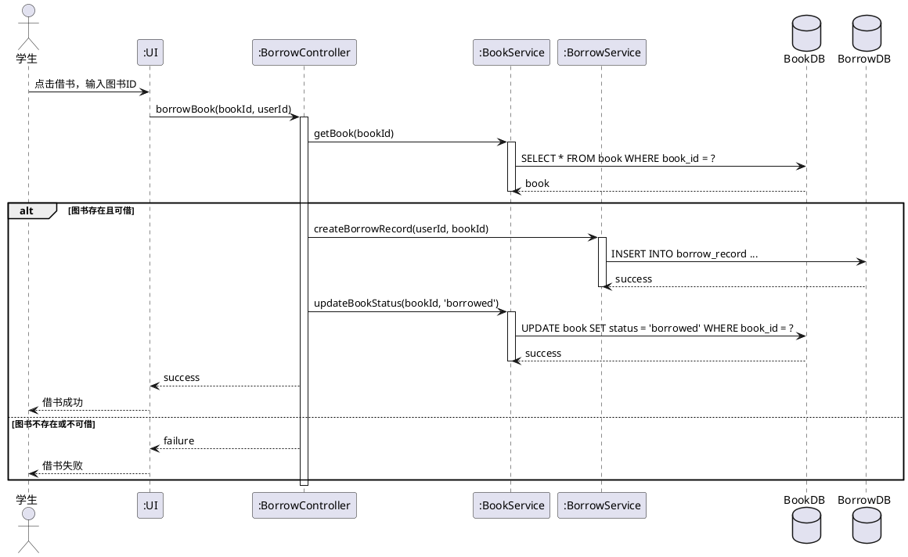

**面向对象UML设计PPT重制**

**第3讲-面向对象设计与类图.md**

MD 7.69KB

**第4讲-顺序图状态图与架构设计.md**

MD 9.91KB

**上半学期PPT大纲.md**

MD 137.41KB

原先的教学计划是直接以sqlrustgo项目为例进行讲解，现在需要改变：在第3，4讲中，介绍 面向对象的分析、设计和实现方法，以及 UML 的规范和各种图。 请帮我重新设计，整理第3讲，第4讲的 PPT 的 MD文件

嗯，用户提供了详细的第三讲和第四讲的PPT内容，以及上半学期的完整教学大纲，但用户提出了一个明确的修改需求：希望重新设计第三讲和第四讲，改变原先“直接以sqlrustgo项目为例进行讲解”的方式，改为“介绍面向对象的分析、设计和实现方法，以及UML的规范和各种图”。

用户的核心需求是希望这两讲的内容更加通用化、方法论化，而不是紧紧绑定在sqlrustgo这一个项目案例上。这意味着需要将PPT的内容框架从“项目驱动”转向“方法驱动”，将UML和面向对象设计作为独立的知识体系来系统介绍，同时保持与项目的一定关联以体现应用，但案例应从“核心”降为“示例”。

我需要重新构思这两讲的结构。第三讲可以聚焦于面向对象的设计原则和类图，这是静态结构建模的核心。内容上应该先系统讲解面向对象的核心概念（封装、继承、多态），然后深入讲解SOLID原则，并引入设计模式简介。接着详细介绍类图的组成元素（类、属性、方法、可见性）和六种主要关系（关联、聚合、组合、依赖、泛化、实现），最后用SQLRustGo作为贯穿案例，展示这些原则和关系在项目中的应用，并介绍AI辅助类图生成。

第四讲则转向动态行为建模和架构视图。内容上先讲顺序图，包括其组成元素（对象、生命线、消息、激活、组合片段）和绘制规范，并用SQL查询执行作为实例。接着讲状态图，包括状态、转换、事件、动作等元素，并以事务状态作为实例。然后介绍架构图与部署图，讲解分层架构、模块架构等，并以SQLRustGo的四层架构作为实例。最后引入快速原型法的概念和流程，并分析SQLRustGo草稿版本作为原型的意义，以及AI如何辅助原型开发。

在重新设计时，需要确保每部分的理论讲解清晰、有层次，案例应用恰当、有代表性，同时保持与教学大纲其他部分的连贯性。对于用户提供的原有PPT内容，我需要提取其中有价值的知识点和结构，但按照新的思路进行重组和深化，使其成为一套独立、系统的UML与面向对象设计教程。

# **第三讲：面向对象分析与设计**

## **AI增强的软件工程**

***

# **课程大纲**

1. **面向对象分析（OOA）**（20分钟）
2. **面向对象设计（OOD）**（20分钟）
3. **面向对象实现（OOP）**（15分钟）
4. **UML中的面向对象建模**（20分钟）
5. **实践练习**（15分钟）

***

# **Part 1: 面向对象分析（OOA）**

***

## **1.1 什么是面向对象分析**

### **定义**

面向对象分析（Object-Oriented Analysis, OOA）是在问题域中识别和理解**对象**及其**关系**的过程。

### **核心目标**

- 理解业务需求
- 识别问题域中的概念
- 建立问题域的模型

### **关键问题**

- 系统要做什么？（What）
- 问题域中有哪些实体？（Who）
- 实体之间有什么关系？（How）

***

## **1.2 OOA的三个层次**

### **第1层：对象发现**

- 识别问题域中的实体
- 区分对象和属性
- 寻找名词和名词短语

### **第2层：结构识别**

- 分类结构（泛化-特化）
- 组装结构（整体-部分）
- 关联关系

### **第3层：行为识别**

- 对象的行为
- 对象之间的交互
- 系统的动态特性

***

## **1.3 对象发现方法**

### **名词短语分析法**

text

```
需求描述：
"用户可以输入SQL查询，系统解析查询并返回结果。"

候选对象：
- 用户（User）
- SQL查询（SQLQuery）
- 系统（System）
- 查询结果（QueryResult）

核心对象：
- SQLQuery
- QueryResult
```

### **边界对象**

- 与外部交互的接口
- 如：客户端连接、命令行界面

### **实体对象**

- 持久化的数据
- 如：表、记录、索引

### **控制对象**

- 业务逻辑的协调者
- 如：查询处理器、事务管理器

***

## **1.4 案例分析：数据库系统对象发现**

### **需求描述**

"数据库系统需要接收SQL语句，进行语法检查，然后执行查询，最后返回结果。系统需要持久化存储数据，支持表的创建、插入、查询操作。"

### **候选对象列表**

**名词**

**类型**

**是否核心**

SQL语句

概念

✅ 核心

语法检查

过程

❌ 方法

查询

概念

✅ 核心

结果

概念

✅ 核心

数据

概念

✅ 核心

表

实体

✅ 核心

操作

行为

❌ 方法

### **识别出的核心对象**

- SQL语句（SQLStatement）
- 查询（Query）
- 结果集（ResultSet）
- 表（Table）
- 数据行（Row）

***

# **Part 2: 面向对象设计（OOD）**

***

## **2.1 什么是面向对象设计**

### **定义**

面向对象设计（Object-Oriented Design, OOD）是将分析模型转化为**设计模型**的过程，定义**类**、**属性**、**方法**和**关系**。

### **核心目标**

- 定义类的结构和职责
- 设计类之间的协作
- 满足非功能需求（性能、可扩展性、可维护性）

### **关键问题**

- 系统如何做？（How）
- 需要哪些类？（Class）
- 类之间如何交互？（Interaction）

***

## **2.2 从对象到类的映射**

### **对象 vs 类**

**特征**

**对象**

**类**

定义

现实世界的实体

对象的抽象模板

示例

"用户表"这个具体的表

Table类

数量

多个实例

一个定义

生命周期

创建、使用、销毁

始终存在

### **映射过程**

text

```
对象（分析阶段） → 类（设计阶段）
SQL语句对象 → SQLStatement类
查询对象 → Query类
结果集对象 → ResultSet类
表对象 → Table类
```

***

## **2.3 类的设计**

### **类的三要素**

text

```
┌─────────────────┐
│   类名           │
├─────────────────┤
│   属性           │
│   - 名称         │
│   - 类型         │
│   - 可见性       │
├─────────────────┤
│   方法           │
│   + 操作1()      │
│   + 操作2()      │
└─────────────────┘
```

### **属性设计原则**

- 反映对象的状态
- 选择合适的类型
- 设置适当的可见性

### **方法设计原则**

- 反映对象的行为
- 单一职责原则
- 接口要简洁清晰

***

## **2.4 关系设计**

### **六种关系的设计决策**

**关系类型**

**何时使用**

**设计考虑**

关联

对象之间需要知道彼此

单向还是双向？多重性？

聚合

整体-部分，部分可独立存在

生命周期是否绑定？

组合

整体-部分，部分不可独立

生命周期严格绑定

依赖

临时使用关系

是否可以用参数传递替代？

泛化

"is-a"关系

是否符合里氏替换原则？

实现

接口与实现

接口是否足够抽象？

***

## **2.5 设计原则在OOD中的应用**

### **单一职责原则（SRP）**

> 一个类应该只有一个引起它变化的原因

text

```
// ❌ 不好的设计
class QueryHandler {
    fn parse_sql(&self) { }
    fn optimize_query(&self) { }
    fn execute(&self) { }
    fn format_result(&self) { }
}

// ✅ 好的设计
class Parser {
    fn parse(&self) -> AST { }
}
class Optimizer {
    fn optimize(&self, ast: AST) -> Plan { }
}
class Executor {
    fn execute(&self, plan: Plan) -> Result { }
}
class Formatter {
    fn format(&self, result: Result) -> Output { }
}
```

***

### **开闭原则（OCP）**

> 对扩展开放，对修改关闭

text

```
// ✅ 通过抽象实现开闭原则
trait StorageEngine {
    fn read(&self, key: &str) -> Option<Value>;
    fn write(&mut self, key: &str, value: Value);
}

class MemoryStorage implements StorageEngine { }
class DiskStorage implements StorageEngine { }
class CloudStorage implements StorageEngine { }

// 查询执行器依赖抽象，可以支持任何存储引擎
class QueryExecutor<T: StorageEngine> {
    engine: T,
    fn execute(&self, query: &Query) -> Result {
        // 使用 engine 执行查询
    }
}
```

***

### **依赖倒置原则（DIP）**

> 依赖抽象，不依赖具体实现

text

```
// ❌ 违反DIP：高层依赖低层具体实现
class QueryService {
    storage = DiskStorage::new()
}

// ✅ 符合DIP：都依赖抽象
class QueryService<T: StorageEngine> {
    storage: T
}
```

***

## **2.6 案例分析：从分析模型到设计模型**

### **分析模型（对象）**

text

```
[SQL语句] ----使用---> [解析器]
   |
   v
[查询] -----执行----> [存储引擎]
   |
   v
[结果集]
```

### **设计模型（类）**

text

```
┌─────────────┐      ┌─────────────┐
│ SQLStatement│<-----│   Parser    │
├─────────────┤      ├─────────────┤
│ -text: String│      │ +parse():   │
│ -type: Type  │      │ Statement   │
└─────────────┘      └─────────────┘
       ^                    ^
       |                    |
┌─────────────┐      ┌─────────────┐
│   Query     │----->│  Executor   │
├─────────────┤      ├─────────────┤
│ -plan: Plan │      │ +execute(): │
└─────────────┘      │ ResultSet   │
       |             └─────────────┘
       |                    ^
       v                    |
┌─────────────┐      ┌─────────────┐
│  ResultSet  │<-----│  Storage    │
└─────────────┘      └─────────────┘
```

***

# **Part 3: 面向对象实现（OOP）**

***

## **3.1 什么是面向对象实现**

### **定义**

面向对象实现（Object-Oriented Programming, OOP）是将设计模型转化为**可执行代码**的过程。

### **核心要素**

- **封装**：隐藏实现细节
- **继承**：代码复用和层次结构
- **多态**：同一接口不同实现

### **编程语言支持**

**语言**

**封装**

**继承**

**多态**

Rust

模块/私有字段

Trait

Trait对象/泛型

Java

private/protected

extends

接口/重写

Python

\_\_private

继承

鸭子类型

***

## **3.2 Rust中的面向对象特性**

### **封装（Encapsulation）**

rust

```
pub struct Page {
    id: PageId,           // 私有字段
    data: Vec<u8>,        // 私有字段
    dirty: bool,          // 私有字段
}

impl Page {
    pub fn new(id: PageId) -> Self {  // 公共构造函数
        Page {
            id,
            data: Vec::with_capacity(PAGE_SIZE),
            dirty: false,
        }
    }
    
    pub fn read(&self, offset: usize) -> &[u8] {  // 公共方法
        &self.data[offset..]
    }
}
```

### **继承的替代：Trait**

rust

```
pub trait StorageEngine {
    fn read(&self, key: &str) -> Result<Option<Value>, Error>;
    fn write(&mut self, key: &str, value: Value) -> Result<(), Error>;
}

pub struct MemoryStorage {
    data: HashMap<String, Value>,
}

impl StorageEngine for MemoryStorage {
    fn read(&self, key: &str) -> Result<Option<Value>, Error> {
        Ok(self.data.get(key).cloned())
    }
    
    fn write(&mut self, key: &str, value: Value) -> Result<(), Error> {
        self.data.insert(key.to_string(), value);
        Ok(())
    }
}
```

### **多态（Polymorphism）**

rust

```
// Trait对象方式
pub struct QueryExecutor {
    storage: Box<dyn StorageEngine>,  // 运行时多态
}

// 泛型方式（编译时多态）
pub struct QueryExecutor<T: StorageEngine> {
    storage: T,  // 编译时多态
}

// 使用示例
let mem_executor = QueryExecutor::new(MemoryStorage::new());
let disk_executor = QueryExecutor::new(DiskStorage::new());
```

***

## **3.3 从设计到实现的映射**

### **类图到代码的映射**

**类图元素** → **Rust代码**

**类图元素**

**Rust对应**

类

`struct` + `impl`

抽象类

`trait` + 默认实现

接口

`trait`

属性

字段

方法

方法

关联

引用字段

聚合

`Vec<T>` 或 `Option<T>`

组合

所有权字段

泛化

`trait`实现

实现

`impl Trait for Struct`

***

### **示例：SQL语句类图的实现**

**类图**

text

```
┌─────────────────┐
│   Statement     │ (抽象)
├─────────────────┤
│ +execute():Result│
└─────────────────┘
         ^
         |
┌─────────────────┐
│  SelectStatement│
├─────────────────┤
│ -columns: Vec   │
│ -table: String  │
│ -where: Option  │
└─────────────────┘
```

**Rust实现**

rust

```
// 抽象接口
pub trait Statement {
    fn execute(&self) -> Result<Value, Error>;
}

// 具体实现
pub struct SelectStatement {
    columns: Vec<String>,
    table: String,
    where_clause: Option<Expression>,
}

impl Statement for SelectStatement {
    fn execute(&self) -> Result<Value, Error> {
        // 执行SELECT查询
        Ok(Value::from(rows))
    }
}
```

***

# **Part 4: UML中的面向对象建模**

***

## **4.1 UML对面向对象的支持**

### **UML的视图**

text

```
UML 2.0
├── 结构图（Structure Diagrams）—— 静态建模
│   ├── 类图 —— 类的结构和关系
│   ├── 对象图 —— 对象的快照
│   ├── 组件图 —— 组件的结构和依赖
│   └── 部署图 —— 物理部署
│
└── 行为图（Behavior Diagrams）—— 动态建模
    ├── 用例图 —— 系统功能
    ├── 顺序图 —— 交互时序
    ├── 活动图 —— 流程控制
    └── 状态图 —— 状态变化
```

### **面向对象的四个层次**

**层次**

**UML图**

**面向对象概念**

需求层

用例图

对象、角色

静态层

类图、对象图

类、属性、方法、关系

动态层

顺序图、状态图

消息、状态、行为

实现层

组件图、部署图

组件、节点

***

## **4.2 面向对象分析与UML**

### **OOA阶段使用的UML图**

**分析任务**

**使用的UML图**

**作用**

需求获取

用例图

识别参与者和用例

对象发现

类图（概念层）

识别候选对象

关系识别

类图

分析对象间关系

行为分析

顺序图、状态图

分析动态行为

### **概念层类图（不包含实现细节）**

text

```
┌─────────────────────────────────────┐
│          概念层类图示例              │
├─────────────────────────────────────┤
│                                    │
│  [用户] -------- 执行 ---------> [查询] │
│    │                                 │
│    │ 拥有                             │
│    ▼                                 │
│  [数据库] <------- 包含 --------- [表]  │
│                                    │
└─────────────────────────────────────┘
```

***

## **4.3 面向对象设计与UML**

### **OOD阶段使用的UML图**

**设计任务**

**使用的UML图**

**作用**

类定义

类图（设计层）

定义属性、方法、可见性

关系设计

类图

定义关联、聚合、组合、继承

接口设计

类图（接口）

定义接口和实现关系

交互设计

顺序图

设计对象间的消息传递

状态设计

状态图

设计对象的状态变化

### **设计层类图（包含实现细节）**

text

```
┌─────────────────────────────────────┐
│          设计层类图示例              │
├─────────────────────────────────────┤
│                                    │
│  ┌──────────────┐    ┌──────────────┐
│  │   <<interface>>│    │   Parser     │
│  │  StorageEngine │◄---│              │
│  ├──────────────┤    ├──────────────┤
│  │ +read()      │    │ -lexer: Lexer│
│  │ +write()     │    │ +parse()     │
│  └──────────────┘    └──────────────┘
│         ▲                  ▲
│         │                  │
│  ┌──────────────┐    ┌──────────────┐
│  │MemoryStorage │    │  Lexer       │
│  └──────────────┘    └──────────────┘
│                                    │
└─────────────────────────────────────┘
```

***

## **4.4 面向对象实现与UML**

### **OOP阶段使用的UML图**

**实现任务**

**使用的UML图**

**作用**

代码生成

类图

生成类框架代码

组件部署

组件图、部署图

规划模块和部署

文档生成

所有UML图

代码文档和注释

### **从UML到代码的映射**

plantuml

```
@startuml
class Parser {
    -lexer: Lexer
    +parse(sql: String): Statement
}

class Lexer {
    -input: String
    -position: int
    +next_token(): Token
}

Parser --> Lexer
@enduml
```

映射为Rust代码：

rust

```
struct Lexer {
    input: String,
    position: usize,
}

impl Lexer {
    fn next_token(&mut self) -> Token {
        // 实现
    }
}

struct Parser {
    lexer: Lexer,
}

impl Parser {
    fn parse(&mut self, sql: String) -> Statement {
        // 使用lexer解析
    }
}
```

***

## **4.5 UML建模的完整流程**

### **面向对象建模的四个步骤**

text

```
Step 1: 需求建模（用例图）
        ↓
Step 2: 静态建模（类图、对象图）
        ↓
Step 3: 动态建模（顺序图、状态图、活动图）
        ↓
Step 4: 实现建模（组件图、部署图）
```

### **迭代过程**

text

```
分析 → 设计 → 实现
  ↑            ↓
  └──── 反馈 ───┘
```

***

## **4.6 案例：完整的面向对象建模过程**

### **Step 1: 需求建模（用例图）**

**用例图**：数据库查询系统

text

```
┌─────────────────────────────────────┐
│          数据库系统                  │
│  ┌───────────────────────────────┐  │
│  │                               │  │
│  │  ┌─────────┐    ┌─────────┐  │  │
│  │  │ 执行查询 │<---│  用户   │  │  │
│  │  └─────────┘    └─────────┘  │  │
│  │       <<include>>              │  │
│  │         ↓                      │  │
│  │  ┌─────────┐                  │  │
│  │  │ 解析SQL │                  │  │
│  │  └─────────┘                  │  │
│  │                               │  │
│  └───────────────────────────────┘  │
└─────────────────────────────────────┘
```

***

### **Step 2: 静态建模（类图）**

**类图**：数据库系统的核心类

text

```
┌─────────────────────────────────────────────────┐
│                   类图                            │
├─────────────────────────────────────────────────┤
│                                                  │
│  ┌──────────────┐       ┌──────────────┐        │
│  │   Database   │       │    Table     │        │
│  ├──────────────┤       ├──────────────┤        │
│  │ -name: String│1      *│ -name: String│        │
│  │ -tables: List│◇───────│ -rows: List  │        │
│  ├──────────────┤       ├──────────────┤        │
│  │ +query()     │       │ +insert()    │        │
│  │ +createTable()│      │ +select()    │        │
│  └──────────────┘       └──────────────┘        │
│                                                  │
│         ┌─────────────────────┘                  │
│         ↓                                        │
│  ┌──────────────┐                                │
│  │     Row      │                                │
│  ├──────────────┤                                │
│  │ -columns: Map│                                │
│  └──────────────┘                                │
│                                                  │
└─────────────────────────────────────────────────┘
```

***

### **Step 3: 动态建模（顺序图）**

**顺序图**：查询执行过程

text

```
用户         Database      Parser      Executor     Storage
 |              |            |            |            |
 |---query()--->|            |            |            |
 |              |---parse()-->|            |            |
 |              |            |---AST------>|            |
 |              |            |            |---execute()>|
 |              |            |            |            |
 |              |<-----------结果----------|            |
 |<---结果-------|            |            |            |
```

***

### **Step 4: 实现建模（组件图）**

**组件图**：系统模块划分

text

```
┌─────────────────────────────────────────────┐
│              数据库系统                       │
├─────────────────────────────────────────────┤
│                                             │
│  ┌────────────┐      ┌────────────┐        │
│  │  客户端    │      │  SQL解析器  │        │
│  │  接口组件  │----->│   组件     │        │
│  └────────────┘      └────────────┘        │
│         │                   │               │
│         v                   v               │
│  ┌────────────┐      ┌────────────┐        │
│  │ 查询执行器 │<---->│ 存储引擎   │        │
│  │   组件     │      │   组件     │        │
│  └────────────┘      └────────────┘        │
│                                             │
└─────────────────────────────────────────────┘
```

***

# **Part 5: 实践练习**

***

## **5.1 任务1：对象发现练习**

### **需求描述**

"设计一个简单的图书管理系统。系统需要管理图书信息（书名、作者、ISBN、价格），支持图书的借阅和归还。用户可以是学生或教师，不同类型的用户有不同的借阅权限。管理员可以管理图书和用户信息。"

### **练习步骤**

1. 阅读需求，找出所有名词和名词短语
2. 识别候选对象（哪些是对象，哪些是属性）
3. 分类对象（实体对象、边界对象、控制对象）
4. 分享和讨论

### **时间：10分钟**

***

## **5.2 任务2：类图设计**

### **练习要求**

基于任务1识别的对象，设计类图：

1. **定义类**
   - 类名
   - 关键属性
   - 关键方法
2. **定义关系**
   - 关联（多重性）
   - 聚合/组合
   - 泛化（继承）
3. **使用PlantUML绘制**

### **参考提示词**

text

```
请为图书管理系统生成类图，包含：
- 图书（Book）
- 用户（User）及其子类（Student, Teacher）
- 管理员（Admin）
- 借阅记录（BorrowRecord）
标注类之间的关系和多重性。
```

### **时间：15分钟**

***

## **5.3 任务3：顺序图设计**

### **练习要求**

基于类图，设计"用户借书"的顺序图：

1. **识别参与者**
   - 用户（Student/Teacher）
   - 系统边界
2. **设计交互流程**
   - 用户请求借书
   - 系统检查权限
   - 系统检查库存
   - 系统创建借阅记录
   - 系统返回结果
3. **使用PlantUML绘制**

### **时间：15分钟**

***

# **核心知识点总结**

***

## **面向对象分析（OOA）**

- 对象发现：名词短语分析法
- 三层分析：对象、结构、行为
- 对象类型：实体对象、边界对象、控制对象

## **面向对象设计（OOD）**

- 从对象到类的映射
- 类的三要素：类名、属性、方法
- 关系的设计决策
- SOLID原则的应用

## **面向对象实现（OOP）**

- 封装、继承、多态
- Rust中的OOP：struct、trait、泛型
- 从设计到代码的映射

## **UML中的面向对象建模**

- 需求层：用例图
- 静态层：类图、对象图
- 动态层：顺序图、状态图
- 实现层：组件图、部署图

***

# **课后作业**

***

## **作业1：图书管理系统完整设计**

1. 完成对象发现文档
2. 绘制完整的类图（至少6个类）
3. 绘制至少2个顺序图（借书、还书）

## **作业2：代码实现**

1. 将类图转化为Rust代码框架
2. 实现核心类的结构定义
3. 使用trait定义接口

## **预习**

- 状态图
- 活动图
- 架构设计

***

\<!-- \_class: 领导 -->

# **谢谢！**

## **下节课：顺序图、状态图与架构设计**

***

# **第四讲：顺序图、状态图与架构设计**

## **AI增强的软件工程**

***

# **课程大纲**

1. **UML行为图概述**（15分钟）
2. **顺序图（Sequence Diagram）**（20分钟）
3. **状态图（State Diagram）**（20分钟）
4. **活动图（Activity Diagram）**（15分钟）
5. **架构图与部署图**（15分钟）
6. **实践练习**（15分钟）

***

# **Part 1: UML行为图概述**

***

## **1.1 什么是行为图**

### **定义**

行为图（Behavior Diagrams）描述系统的**动态行为**，展示对象之间的交互和状态变化。

### **作用**

- 建模系统的运行时行为
- 描述对象之间的消息传递
- 展示对象的状态变化
- 刻画业务流程

***

## **1.2 行为图的分类**

text

```
UML行为图
├── 交互图（Interaction Diagrams）
│   ├── 顺序图（Sequence Diagram）—— 时间顺序的消息交互
│   ├── 通信图（Communication Diagram）—— 对象连接的消息交互
│   ├── 时序图（Timing Diagram）—— 时间约束的状态变化
│   └── 交互概览图（Interaction Overview Diagram）—— 交互的控制流
│
├── 状态图（State Diagram）—— 对象的状态变化
│
└── 活动图（Activity Diagram）—— 业务流程和控制流
```

### **本讲重点**

- **顺序图**：最常用的交互图
- **状态图**：单个对象的行为建模
- **活动图**：业务流程建模

***

## **1.3 行为图在面向对象开发中的位置**

text

```
需求分析 → 静态建模 → 动态建模 → 实现
              ↓          ↓
            类图     顺序图/状态图/活动图
```

### **行为图的作用**

**阶段**

**行为图**

**作用**

分析

顺序图

验证用例的实现

分析

活动图

理解业务流程

设计

顺序图

设计对象交互

设计

状态图

设计对象生命周期

实现

所有

指导代码实现

***

# **Part 2: 顺序图（Sequence Diagram）**

***

## **2.1 顺序图的基本概念**

### **定义**

顺序图描述了对象之间**按时间顺序**的消息传递。

### **核心要素**

text

```
对象:      对象1          对象2          对象3
           │             │             │
生命线:     │─────────────│─────────────│
           │             │             │
消息:       │──消息1─────>│             │
           │             │──消息2─────>│
           │             │<──返回──────│
激活条:     │█████        │█████        │
           │             │             │
时间:      ↓             ↓             ↓
```

### **适用场景**

- 用例的实现细节
- 对象之间的协作
- 消息的时序关系

***

## **2.2 顺序图的组成元素**

### **1. 对象（Object）**

text

```
┌──────────┐
│ :对象类型 │  匿名对象
└──────────┘

┌──────────┐
│ 对象名    │  命名对象
│ :类型     │
└──────────┘

例如：
┌──────────┐
│ parser   │
│ :Parser  │
└──────────┘
```

### **2. 生命线（Lifeline）**

text

```
对象 ────│──── 生命线（虚线）
```

### **3. 激活条（Activation）**

text

```
对象 ────█████──── 对象正在执行操作
```

***

### **4. 消息（Message）**

**消息类型**

**符号**

**含义**

同步消息

`───>`

调用者等待返回

异步消息

`───>>`

调用者不等待

返回消息

`<───`

方法返回值

创建消息

`─create─>`

创建对象

销毁消息

`─destroy─>×`

销毁对象

### **5. 组合片段（Combined Fragment）**

**片段类型**

**符号**

**含义**

alt

`[alt]`

条件分支（if-else）

opt

`[opt]`

可选执行（if）

loop

`[loop]`

循环执行

par

`[par]`

并行执行

region

`[region]`

临界区

***

## **2.3 顺序图绘制规范**

### **布局规范**

1. **从左到右**排列参与交互的对象
2. **从上到下**表示时间顺序
3. **激活条**的顶部表示开始执行，底部表示结束
4. **消息**要清晰描述操作名称和参数

### **命名规范**

- 对象名：`对象名:类型` 或 `:类型`
- 消息名：动词短语，如 `parse(sql: String)`
- 返回消息：可省略，或用虚线箭头表示

### **示例规范**

text

```
正确的顺序图：

用户         :Parser        :Executor
 │              │              │
 │─parse(sql)──>│              │
 │              │              │
 │<─ast─────────│              │
 │              │─execute(ast)─>│
 │              │              │
 │<─────────────│──result──────│
```

***

## **2.4 组合片段的使用**

### **alt片段（条件分支）**

text

```
[alt]
├── [条件1]
│   消息A
│   消息B
└── [条件2]
    消息C
    消息D
```

**示例**：

text

```
用户         系统
 │            │
 │─登录请求───>│
 │            │
alt           │
├── [密码正确] │
│  │<─成功────│
│  │─查询数据─>│
└── [密码错误] │
   │<─失败────│
```

***

### **loop片段（循环）**

text

```
[loop]
   重复执行的消息
```

**示例**：

text

```
用户         数据库
 │            │
loop         │
├── [还有数据] │
│  │─读取下一行>│
│  │<─返回数据─│
└──           │
```

### **opt片段（可选）**

text

```
[opt]
   可选执行的消息
```

***

## **2.5 实例1：SQL查询执行顺序图**

### **场景描述**

用户执行一条SELECT查询，系统解析SQL、优化、执行并返回结果。

### **顺序图**

plantuml

```
@startuml
actor 用户
participant ":Parser" as Parser
participant ":Optimizer" as Optimizer
participant ":Executor" as Executor
participant ":Storage" as Storage

用户 -> Parser: parse(sql)
activate Parser
Parser --> 用户: AST
deactivate Parser

用户 -> Optimizer: optimize(AST)
activate Optimizer
Optimizer --> 用户: PhysicalPlan
deactivate Optimizer

用户 -> Executor: execute(plan)
activate Executor
Executor -> Storage: scan(table)
activate Storage
Storage --> Executor: rows
deactivate Storage
Executor --> 用户: ResultSet
deactivate Executor
@enduml
```

***

## **2.6 实例2：事务处理顺序图**

### **场景描述**

用户开始事务，执行多个操作，最后提交事务。

### **顺序图**

plantuml

```
@startuml
actor 用户
participant ":TransactionManager" as TM
participant ":Executor" as Executor
participant ":Storage" as Storage

用户 -> TM: begin()
activate TM
TM --> 用户: ok
deactivate TM

loop [每个操作]
    用户 -> Executor: execute(statement)
    activate Executor
    Executor -> Storage: read/write
    activate Storage
    Storage --> Executor: result
    deactivate Storage
    Executor --> 用户: result
    deactivate Executor
end

用户 -> TM: commit()
activate TM
TM -> Storage: flush()
activate Storage
Storage --> TM: done
deactivate Storage
TM --> 用户: committed
deactivate TM
@enduml
```

***

## **2.7 AI辅助生成顺序图**

### **提示词设计**

text

```
为以下场景生成顺序图：
场景：用户注册
流程：
1. 用户提交注册信息
2. 系统验证信息格式
3. 系统检查用户名是否已存在
4. 系统创建新用户
5. 系统发送验证邮件
6. 系统返回注册成功

要求：
1. 使用PlantUML语法
2. 包含参与者、对象、消息
3. 标注激活条
4. 使用alt片段处理用户名已存在的情况
```

### **AI生成结果**

plantuml

```
@startuml
actor 用户
participant ":AuthController" as Controller
participant ":UserService" as Service
participant ":UserRepository" as Repo
participant ":EmailService" as Email

用户 -> Controller: register(info)
activate Controller

Controller -> Service: validate(info)
activate Service
Service --> Controller: valid/invalid
deactivate Service

alt [信息有效]
    Controller -> Service: checkUsername(username)
    activate Service
    Service -> Repo: findByUsername(username)
    activate Repo
    Repo --> Service: exists?
    deactivate Repo
    deactivate Service
    
    alt [用户名不存在]
        Controller -> Service: createUser(info)
        activate Service
        Service -> Repo: save(user)
        activate Repo
        Repo --> Service: saved
        deactivate Repo
        Service --> Controller: user
        deactivate Service
        
        Controller -> Email: sendVerification(email)
        activate Email
        Email --> Controller: sent
        deactivate Email
        
        Controller --> 用户: 注册成功
    else [用户名已存在]
        Controller --> 用户: 用户名已存在
    end
else [信息无效]
    Controller --> 用户: 信息格式错误
end

deactivate Controller
@enduml
```

***

# **Part 3: 状态图（State Diagram）**

***

## **3.1 状态图的基本概念**

### **定义**

状态图描述一个对象在其生命周期内的**状态变化**，以及触发状态变化的事件。

### **核心要素**

text

```
[初始状态] ●
              │
              │ 事件/条件/动作
              ▼
        ┌──────────┐
        │  状态A    │
        └──────────┘
              │
              │ 事件/条件/动作
              ▼
        ┌──────────┐
        │  状态B    │
        └──────────┘
              │
              ▼
[终止状态] ◎
```

### **适用场景**

- 单个对象的生命周期
- 状态相关的行为（如：事务状态、连接状态）
- 事件驱动的系统

***

## **3.2 状态图的组成元素**

### **1. 状态（State）**

text

```
┌─────────────┐
│   状态名     │
│             │
│ entry/动作   │ 进入状态时执行
│ do/活动      │ 在状态中执行
│ exit/动作    │ 退出状态时执行
└─────────────┘
```

### **2. 初始状态（Initial State）**

text

```
●  实心圆点
```

### **3. 终止状态（Final State）**

text

```
◎  实心圆外加圆圈
```

### **4. 转换（Transition）**

text

```
事件 [条件] / 动作
例如：点击提交 [表单有效] / 验证表单
```

***

### **5. 内部活动**

**活动类型**

**语法**

**触发时机**

进入动作

`entry/动作`

进入状态时

退出动作

`exit/动作`

退出状态时

内部活动

`do/活动`

在状态中执行

事件处理

`事件/动作`

事件发生时

### **6. 复合状态（Composite State）**

text

```
┌─────────────────────┐
│      状态A           │
│  ┌───────────────┐  │
│  │    子状态1     │  │
│  └───────────────┘  │
│         │           │
│         ▼           │
│  ┌───────────────┐  │
│  │    子状态2     │  │
│  └───────────────┘  │
└─────────────────────┘
```

***

## **3.3 状态图绘制规范**

### **命名规范**

- 状态名：名词或形容词，如`活跃`、`已提交`
- 事件名：动词短语，如`用户点击提交`
- 条件：布尔表达式，如`[余额>0]`

### **布局原则**

1. 初始状态在左上角
2. 状态从左到右、从上到下排列
3. 避免交叉的转换线
4. 使用注释解释复杂转换

### **常见错误**

- 状态过多（状态爆炸）
- 缺少初始或终止状态
- 转换条件不明确
- 事件命名模糊

***

## **3.4 实例1：事务状态图**

### **场景描述**

数据库事务的生命周期：开始、活跃、提交/回滚、结束。

### **状态图**

plantuml

```
@startuml
[*] --> 空闲

空闲 --> 活跃 : BEGIN事务

state 活跃 {
    [*] --> 执行中
    执行中 --> 执行中 : SQL操作
    执行中 --> 准备提交 : COMMIT
    执行中 --> 准备回滚 : ROLLBACK
    准备提交 --> 提交中 : 准备完成
    准备回滚 --> 回滚中 : 准备完成
}

活跃 --> 已提交 : COMMIT完成
活跃 --> 已回滚 : ROLLBACK完成

已提交 --> [*]
已回滚 --> [*]

注脚: 事务状态变化
@enduml
```

***

## **3.5 实例2：数据库连接状态图**

### **场景描述**

数据库连接的生命周期：创建、认证、空闲、忙碌、关闭。

### **状态图**

plantuml

```
@startuml
[*] --> 已创建

已创建 --> 认证中 : connect()

认证中 --> 空闲 : 认证成功
认证中 --> [*] : 认证失败

空闲 --> 忙碌 : 执行查询
忙碌 --> 空闲 : 查询完成

空闲 --> 超时 : 空闲超时
超时 --> 关闭中 : 超时处理

空闲 --> 关闭中 : close()
忙碌 --> 关闭中 : close()
关闭中 --> [*] : 关闭完成

状态 空闲 {
    entry/启动空闲计时器
    exit/取消空闲计时器
}

状态 忙碌 {
    entry/执行SQL
    exit/清理资源
}
@enduml
```

***

## **3.6 状态图与顺序图的关系**

### **区别与联系**

**维度**

**状态图**

**顺序图**

视角

单个对象

多个对象

关注点

状态变化

消息交互

时间

生命周期

时序关系

触发

事件

消息

### **互补关系**

text

```
状态图：描述对象的内部状态变化
        ↓
       影响对象的行为
        ↓
顺序图：描述对象之间的消息交互
```

### **联合使用**

- 用状态图设计对象的行为
- 用顺序图验证对象间的协作
- 状态图中的事件对应顺序图中的消息

***

# **Part 4: 活动图（Activity Diagram）**

***

## **4.1 活动图的基本概念**

### **定义**

活动图描述**业务流程**或**控制流**，类似于传统流程图，但支持并行和分叉。

### **核心要素**

text

```
[开始] ●
   │
   ▼
┌─────────┐
│  活动1   │
└─────────┘
   │
   ▼
┌─────────┐
│  活动2   │
└─────────┘
   │
   ▼
  [结束] ◎
```

### **适用场景**

- 业务流程建模
- 用例的详细流程
- 算法逻辑描述
- 并行处理设计

***

## **4.2 活动图的组成元素**

### **1. 活动节点（Activity Node）**

text

```
┌─────────┐
│  活动名  │  基本活动
└─────────┘
```

### **2. 控制节点（Control Node）**

text

```
●  初始节点

◎  终止节点

◇  决策节点（分支）

▽  合并节点

─  分叉节点（并发开始）

─  汇合节点（并发结束）
```

***

### **3. 边（Edge）**

text

```
───>  控制流
```

### **4. 泳道（Swimlane）**

text

```
┌─────────────────────────────────┐
│ 泳道A        │ 泳道B        │ 泳道C │
├─────────────┼─────────────┼──────┤
│ 活动1       │             │      │
│             │ 活动2       │      │
│             │             │ 活动3 │
└─────────────┴─────────────┴──────┘
```

***

## **4.3 活动图绘制规范**

### **布局规范**

1. 从上到下表示流程顺序
2. 泳道按角色划分
3. 决策节点要有明确的条件
4. 分叉和汇合要成对出现

### **命名规范**

- 活动名：动词短语，如`解析SQL`
- 决策条件：用方括号，如`[语法正确]`
- 泳道名：角色或系统名称

### **示例**

text

```
[用户]          [系统]
  │               │
  │ 提交表单       │
  │──────────────>│
  │               │
  │               │ 验证数据
  │               │   │
  │               │   │ [无效]
  │               │   ▼
  │               │ 显示错误
  │               │   │
  │               │   │ [有效]
  │               │   ▼
  │               │ 处理请求
  │               │   │
  │<──────────────│ 返回结果
```

***

## **4.4 实例1：SQL执行流程活动图**

### **场景描述**

SQL查询从接收到返回结果的全流程。

### **活动图**

plantuml

```
@startuml
|客户端|
start
:发送SQL;

|解析器|
:词法分析;
:语法分析;
if (语法正确?) then (是)
  :生成AST;
else (否)
  :返回语法错误;
  stop
endif

|优化器|
:逻辑优化;
:物理优化;
:生成执行计划;

|执行器|
fork
  :执行扫描;
fork again
  :执行过滤;
fork again
  :执行投影;
end fork
:组装结果;

|客户端|
:返回结果;
stop
@enduml
```

***

## **4.5 活动图与顺序图的关系**

### **区别与联系**

**维度**

**活动图**

**顺序图**

抽象层次

业务流程

对象交互

控制流

显式

隐式（通过消息）

并发

支持分叉/汇合

支持par片段

角色

泳道

对象

### **使用建议**

- **业务流程** → 活动图
- **对象交互** → 顺序图
- **复杂流程** → 先用活动图，再用顺序图细化

***

# **Part 5: 架构图与部署图**

***

## **5.1 组件图（Component Diagram）**

### **定义**

组件图描述系统的**物理模块**及其依赖关系。

### **核心元素**

text

```
┌─────────────┐
│  <<组件>>    │
│  组件名      │
├─────────────┤
│ 提供的接口   │
│ 需要的接口   │
└─────────────┘

接口表示：
─────────●  提供的接口（球）
─────────○  需要的接口（插座）
```

### **适用场景**

- 系统模块划分
- 接口定义
- 依赖关系管理

***

### **实例：SQLRustGo组件图**

plantuml

```
@startuml
package "SQLRustGo" {
  
  [客户端接口] <<组件>>
  
  [SQL解析器] <<组件>>
  [查询优化器] <<组件>>
  [执行引擎] <<组件>>
  [存储引擎] <<组件>>
  
  客户端接口 --> SQL解析器 : 使用
  SQL解析器 --> 查询优化器 : 传递AST
  查询优化器 --> 执行引擎 : 传递计划
  执行引擎 --> 存储引擎 : 读写数据
  
  存储引擎 --> [文件系统] <<外部>>
}
@enduml
```

***

## **5.2 部署图（Deployment Diagram）**

### **定义**

部署图描述系统的**物理部署**，包括节点、组件和连接。

### **核心元素**

text

```
┌─────────────────┐
│  <<节点>>        │
│  节点名          │
├─────────────────┤
│  [部署的组件]    │
│  [部署的组件]    │
└─────────────────┘

通信路径：─────── 节点之间的连接
```

### **适用场景**

- 分布式系统部署
- 硬件配置规划
- 网络拓扑设计

***

### **实例：SQLRustGo部署图**

plantuml

```
@startuml
node "应用服务器" {
  [Web应用]
}

node "数据库服务器1" <<主>> {
  [SQL解析器]
  [查询优化器]
  [执行引擎]
  database "数据文件" {
    folder "表空间"
  }
}

node "数据库服务器2" <<从>> {
  [SQL解析器]
  [查询优化器]
  [执行引擎]
  database "数据文件副本" {
    folder "表空间"
  }
}

node "缓存服务器" {
  [Redis]
}

应用服务器 --> 数据库服务器1 : JDBC
数据库服务器1 --> 数据库服务器2 : 主从复制
数据库服务器1 --> 缓存服务器 : 缓存查询
@enduml
```

***

## **5.3 包图（Package Diagram）**

### **定义**

包图描述**命名空间**和**元素分组**，用于管理大型模型的复杂性。

### **核心元素**

text

```
┌─────────────────┐
│  <<包>>          │
│  包名            │
├─────────────────┤
│  类A             │
│  类B             │
│  子包            │
└─────────────────┘
```

### **适用场景**

- 命名空间管理
- 模块划分
- 大型系统的组织

***

### **实例：SQLRustGo包图**

plantuml

```
@startuml
package sqlrustgo {
  
  package parser {
    class Lexer
    class Parser
    class AST
  }
  
  package planner {
    class LogicalPlanner
    class PhysicalPlanner
    class Optimizer
  }
  
  package executor {
    class ExecutionEngine
    class Operator
  }
  
  package storage {
    class Page
    class BufferPool
    class BPlusTree
    class WAL
  }
  
  package common {
    enum Value
    enum DataType
    class Error
  }
  
  parser --> planner
  planner --> executor
  executor --> storage
  parser --> common
  planner --> common
  executor --> common
  storage --> common
}
@enduml
```

***

## **5.4 UML图的选择指南**

### **按开发阶段选择**

**阶段**

**主要使用的UML图**

需求分析

用例图、活动图

系统分析

类图（概念层）、顺序图

系统设计

类图（设计层）、顺序图、状态图、组件图

系统实现

组件图、部署图、包图

### **按关注点选择**

**关注点**

**使用的UML图**

系统功能

用例图

静态结构

类图、对象图、包图

动态行为

顺序图、状态图、活动图

物理部署

组件图、部署图

***

# **Part 6: 实践练习**

***

## **6.1 任务1：顺序图练习**

### **场景**

"用户注册"流程：

1. 用户填写注册表单并提交
2. 系统验证邮箱格式
3. 系统检查邮箱是否已注册
4. 系统创建用户账号
5. 系统发送激活邮件
6. 系统返回注册结果

### **练习要求**

1. 识别参与对象（至少3个）
2. 绘制顺序图（使用PlantUML）
3. 包含alt片段处理异常情况

### **时间：10分钟**

***

## **6.2 任务2：状态图练习**

### **场景**

"数据库连接"的生命周期：

- 初始状态：关闭
- 连接时进入认证状态
- 认证成功进入空闲状态
- 执行查询时进入忙碌状态
- 空闲超时进入超时状态
- 任何状态都可能关闭

### **练习要求**

1. 识别所有状态
2. 定义状态转换的事件和条件
3. 绘制状态图
4. 至少包含一个复合状态

### **时间：10分钟**

***

## **6.3 任务3：活动图练习**

### **场景**

"订单处理"流程：

1. 用户下单
2. 系统验证库存
   - 库存不足 → 取消订单
   - 库存充足 → 继续
3. 系统扣减库存
4. 系统创建发货单
5. 并行处理：
   - 通知仓库发货
   - 通知用户确认
6. 订单完成

### **练习要求**

1. 使用泳道区分角色
2. 包含决策和并行
3. 绘制活动图

### **时间：10分钟**

***

## **6.4 任务4：综合练习（选做）**

### **场景**

为SQLRustGo设计：

1. **事务管理器**的状态图
2. **查询执行**的顺序图（包含缓存检查）
3. **SQL解析**的活动图
4. **系统模块**的组件图

### **时间：15分钟**

***

# **核心知识点总结**

***

## **顺序图**

- **对象、生命线、激活、消息**
- **同步/异步消息**
- **组合片段**：alt、loop、opt、par
- **适用场景**：对象交互、用例实现

## **状态图**

- **状态、转换、事件、动作**
- **初始/终止状态**
- **内部活动**：entry/do/exit
- **适用场景**：对象生命周期、状态相关行为

## **活动图**

- **活动节点、控制节点、边**
- **泳道**：角色划分
- **分叉/汇合**：并发处理
- **适用场景**：业务流程、算法逻辑

## **架构图**

- **组件图**：模块划分、接口依赖
- **部署图**：物理节点、网络拓扑
- **包图**：命名空间组织

***

# **课后作业**

***

## **作业1：数据库核心流程建模**

1. 绘制"SQL查询执行"的顺序图
2. 绘制"事务"的状态图
3. 绘制"查询优化"的活动图

## **作业2：系统架构设计**

1. 绘制SQLRustGo的组件图
2. 绘制部署图（单机部署）
3. 绘制包图

## **作业3：使用AI辅助**

1. 用AI生成以上所有图
2. 人工审查和优化
3. 比较AI生成和人工设计的差异

## **预习**

- 架构设计原理
- 模块划分
- 接口设计

***

\<!-- \_class: 领导 -->

# **谢谢！**

## **下节课：架构设计原理与模块划分**

请考虑2个情况：1，目前是AI 时代，学生不在需要手工画图，进行OOA，OOD，OOP等。所有讲解的时候，注意讲清楚原理。 2. UML 的部分，重点讲每种图的目的，表达方法，如何用AI工具通过提示词描述来生成。  还有，直接开始引入 sqlrustgo 项目的情况，跨度大不大？

我们被要求重新设计第3讲和第4讲的PPT，以适应AI时代。用户指出：1. 在AI时代，学生不需要手工画图，进行OOA、OOD、OOP等，讲解时注意讲清楚原理。2. UML部分重点讲每种图的目的、表达方法、如何用AI工具通过提示词描述来生成。3. 考虑直接开始引入sqlrustgo项目的情况，跨度大不大？

我们已有原教学计划中第3讲和第4讲的MD文件，以及上半学期大纲中关于这两讲的内容。现在需要修改为更符合AI时代和注重原理的版本。需要重新设计第3讲和第4讲的PPT内容（以MD格式呈现）。重点包括：

- 面向对象分析、设计、实现的原理，而不是手工画图步骤。
- UML图的目的、表达方法、如何用AI生成（提示词示例）。
- 引入sqlrustgo项目作为案例，但要注意跨度，可能逐步引入。

我们需输出两个MD文件：第3讲.md和第4讲.md。需要满足用户要求，内容要清晰、现代、注重AI辅助。

现在我将构思第3讲的内容结构：

**第3讲：面向对象分析与设计原理（AI时代视角）**

- 介绍面向对象的核心概念（封装、继承、多态）及其在软件工程中的价值（原理层面）。
- OOA：如何从需求中识别对象（概念建模），而不是画图。强调思考过程。
- OOD：如何设计类、关系、接口，遵循SOLID原则。重点解释原则原理。
- OOP：如何在代码中实现（以Rust为例），但强调概念映射。
- UML的角色：UML是沟通工具，在AI时代如何用自然语言描述需求让AI生成UML图。介绍UML图的目的（类图、用例图、顺序图、状态图等），讲解每种图的表达方法（语法元素），然后重点展示如何写提示词让AI生成。
- 结合SQLRustGo案例：展示如何用AI辅助进行OOA/OOD，生成类图等。

**第4讲：动态建模与架构设计（AI时代视角）**

- 顺序图、状态图、活动图的目的和表达方法。
- 架构图、部署图的目的和表达方法。
- 重点：如何通过提示词让AI生成这些图。
- 结合SQLRustGo案例：展示查询执行顺序图、事务状态图、系统架构图等。
- 讨论AI生成图的审查和迭代。

注意：直接引入SQLRustGo项目跨度问题？原计划第3讲已包含SQLRustGo类图，第4讲包含架构，跨度合理。我们可以在讲解原理时穿插案例，逐步引入，避免学生感到突兀。

需要编写两个MD文件，每个文件包含完整的PPT结构，有标题、内容、代码块（提示词示例）、图示描述等。

下面开始输出。

# **第三讲：面向对象分析与设计原理（AI时代视角）**

## **AI增强的软件工程**

***

# **课程大纲**

1. **面向对象的核心概念与价值**（15分钟）
2. **面向对象分析（OOA）原理**（20分钟）
3. **面向对象设计（OOD）原理**（20分钟）
4. **UML在AI时代的角色**（20分钟）
5. **AI辅助UML生成实战**（15分钟）

***

# **Part 1: 面向对象的核心概念与价值**

***

## **1.1 为什么需要面向对象？**

### **软件开发的本质挑战**

- **复杂性**：现代软件系统包含数百万行代码
- **变化性**：需求不断变化，系统需要易于修改
- **协作性**：多团队并行开发

### **面向对象的解决方案**

- **封装**：隐藏实现细节，降低认知负荷
- **继承**：复用共性，建立层次结构
- **多态**：统一接口，支持多种实现

***

## **1.2 核心概念原理解读**

### **封装（Encapsulation）**

text

```
┌─────────────────┐
│    对象         │
│  ┌───────────┐ │
│  │ 内部状态   │ │  → 数据隐藏
│  └───────────┘ │
│       ↑        │
│  ┌───────────┐ │
│  │ 公开接口   │ │  → 行为暴露
│  └───────────┘ │
└─────────────────┘
```

**原理**：将数据和操作数据的方法捆绑在一起，对外部隐藏内部实现细节，只暴露必要的接口。

**AI时代意义**：AI可以基于接口理解模块功能，无需关心内部实现，便于自动生成测试、文档和调用代码。

***

### **继承（Inheritance）**

text

```
       ┌─────────┐
       │  动物   │  ← 抽象基类
       └─────────┘
          ↑    ↑
    ┌─────┘    └─────┐
┌─────────┐    ┌─────────┐
│   狗    │    │   猫    │  ← 派生类
└─────────┘    └─────────┘
```

**原理**：通过“is-a”关系，子类自动获得父类的属性和方法，可扩展或重写。实现代码复用和层次化组织。

**AI时代意义**：AI可以自动识别类之间的继承关系，生成符合里氏替换原则的代码。

***

### **多态（Polymorphism）**

rust

```
trait Drawable {
    fn draw(&self);
}

struct Circle { radius: f64 }
struct Square { side: f64 }

impl Drawable for Circle { fn draw(&self) { /* 画圆 */ } }
impl Drawable for Square { fn draw(&self) { /* 画方 */ } }

// 统一接口，不同行为
fn render(shape: &dyn Drawable) {
    shape.draw();  // 运行时决定具体实现
}
```

**原理**：同一接口在不同对象上有不同实现，使得程序可以针对抽象编程，提高灵活性和可扩展性。

**AI时代意义**：AI可以自动识别适合多态的场景，生成trait定义和实现，确保开闭原则。

***

# **Part 2: 面向对象分析（OOA）原理**

***

## **2.1 OOA的目标：理解问题域**

### **核心问题**

- 系统要处理哪些**概念**？
- 概念之间有什么**关系**？
- 概念有哪些**行为**？

### **分析方法**

- **名词短语分析**：从需求文档中提取名词，识别候选对象
- **分类**：区分实体对象、边界对象、控制对象
- **抽象**：忽略细节，保留本质特征

***

## **2.2 对象发现方法**

### **名词短语分析法示例**

**需求描述**：

> 用户可以通过客户端提交SQL查询，系统解析查询后，从存储引擎中读取数据，并将结果返回给用户。

**名词提取**：

- 用户（User）
- 客户端（Client）
- SQL查询（SQLQuery）
- 系统（System）
- 解析器（Parser）
- 存储引擎（StorageEngine）
- 数据（Data）
- 结果（Result）

**筛选核心对象**：

- SQLQuery（核心概念）
- Parser（负责解析）
- StorageEngine（负责存储）
- Result（输出）

***

## **2.3 识别对象之间的关系**

### **关系类型（概念层）**

- **关联**：对象之间存在某种联系（如：Parser处理SQLQuery）
- **聚合**：整体包含部分，部分可独立存在（如：数据库包含多个表）
- **组合**：整体包含部分，部分不能独立存在（如：查询结果包含多行数据）
- **泛化**：一般与特殊的关系（如：SELECT语句是SQL语句的一种）

### **分析方法**

- 从需求中寻找“拥有”、“包含”、“是一种”等描述
- 使用自然语言描述对象间的交互

***

## **2.4 OOA的产出：概念模型**

### **概念模型不是类图**

- 概念模型关注**业务概念**，而非实现细节
- 通常用**简化的UML类图**表示，但省略属性和方法

### **示例：SQLRustGo概念模型**

text

```
┌──────────┐          ┌──────────┐
│  用户    │─────────>│ SQL查询  │
└──────────┘          └──────────┘
                           │
                           ▼
                     ┌──────────┐
                     │  解析器  │
                     └──────────┘
                           │
                           ▼
┌──────────┐          ┌──────────┐
│ 存储引擎 │<─────────│ 执行引擎 │
└──────────┘          └──────────┘
     │                      │
     ▼                      ▼
┌──────────┐          ┌──────────┐
│   表     │          │  结果集  │
└──────────┘          └──────────┘
```

***

# **Part 3: 面向对象设计（OOD）原理**

***

## **3.1 OOD的目标：构建解决方案**

### **核心任务**

- 将分析模型转化为**设计模型**
- 定义**类**（属性、方法、可见性）
- 设计**关系**（关联、聚合、组合、继承、实现）
- 满足**非功能需求**（性能、可扩展性、可维护性）

### **设计原则（SOLID）**

- **单一职责**：一个类只有一个变化原因
- **开闭原则**：对扩展开放，对修改关闭
- **里氏替换**：子类必须能替换父类
- **接口隔离**：接口要小而专一
- **依赖倒置**：依赖抽象，不依赖具体

***

## **3.2 从概念到类：设计决策**

### **类的设计**

- **命名**：使用领域术语，如 `Parser`、`StorageEngine`
- **属性**：决定状态，如 `position: usize`、`buffer: Vec<u8>`
- **方法**：定义行为，如 `parse(&mut self) -> AST`

### **关系设计**

- **关联**：对象间的引用，决定多重性（1对1、1对多）
- **聚合/组合**：生命周期管理
- **继承/实现**：复用接口和代码

***

## **3.3 设计原则应用示例**

### **单一职责（SRP）**

rust

```
// ❌ 违反：Parser既做词法分析又做语法分析
struct Parser {
    input: String,
    pos: usize,
    tokens: Vec<Token>,
}
impl Parser {
    fn tokenize(&mut self) { /* ... */ }
    fn parse(&mut self) -> AST { /* ... */ }
}

// ✅ 符合：拆分为Lexer和Parser
struct Lexer { input: String, pos: usize }
impl Lexer { fn next_token(&mut self) -> Token { /* ... */ } }

struct Parser { lexer: Lexer }
impl Parser { fn parse(&mut self) -> AST { /* ... */ } }
```

***

### **开闭原则（OCP）**

rust

```
// 抽象存储引擎接口
trait StorageEngine {
    fn read(&self, key: &str) -> Option<Value>;
    fn write(&mut self, key: &str, value: Value);
}

// 可以任意扩展新存储引擎，无需修改上层代码
struct MemoryStorage { data: HashMap<String, Value> }
impl StorageEngine for MemoryStorage { /* ... */ }

struct DiskStorage { path: PathBuf }
impl StorageEngine for DiskStorage { /* ... */ }
```

### **依赖倒置（DIP）**

rust

```
// 高层模块（Executor）依赖抽象StorageEngine
struct Executor<T: StorageEngine> {
    storage: T,
}
impl<T: StorageEngine> Executor<T> {
    fn execute(&mut self, query: &Query) -> ResultSet {
        self.storage.read(...)  // 通过抽象调用
    }
}
```

***

## **3.4 OOD的产出：设计类图**

### **设计类图包含**

- 类名、属性（含类型、可见性）、方法（含参数、返回类型）
- 关系（关联方向、多重性、聚合/组合、继承）
- 接口和抽象类

### **示例：SQLRustGo设计类图（局部）**

text

```
┌─────────────────┐         ┌─────────────────┐
│    Parser       │         │     Lexer       │
├─────────────────┤         ├─────────────────┤
│ -lexer: Lexer   │────────>│ -input: String  │
├─────────────────┤         │ -pos: usize     │
│ +parse(): AST   │         ├─────────────────┤
└─────────────────┘         │ +next_token()   │
                            └─────────────────┘
       │
       │ 使用
       ▼
┌─────────────────┐
│      AST        │（抽象）
├─────────────────┤
│ +execute(): ... │
└─────────────────┘
       ▲
       │ 继承
┌─────────────────┐
│ SelectStatement │
├─────────────────┤
│ -columns: Vec   │
│ -table: String  │
│ -where: Expr    │
└─────────────────┘
```

***

# **Part 4: UML在AI时代的角色**

***

## **4.1 UML的本质：沟通语言**

### **UML不是目的，而是工具**

- 帮助开发团队**可视化、理解、沟通**软件设计
- 在AI时代，UML仍然是**人机沟通的桥梁**

### **AI如何改变UML的使用**

- AI可以**理解自然语言**并生成UML图
- AI可以**解释UML图**，辅助理解
- AI可以**根据UML图生成代码框架**

### **核心观念转变**

> 从“手工画图”到“用自然语言描述设计意图，让AI生成UML图”

***

## **4.2 常用UML图及其目的**

**UML图**

**目的**

**表达的核心信息**

**用例图**

描述系统功能与外部参与者

参与者、用例、系统边界

**类图**

描述系统的静态结构

类、属性、方法、关系

**顺序图**

描述对象间的消息交互时序

对象、生命线、消息、激活

**状态图**

描述单个对象的状态变化

状态、事件、转换、动作

**活动图**

描述业务流程或算法逻辑

活动、分支、并发、泳道

**组件图**

描述物理模块及依赖

组件、接口、依赖

**部署图**

描述系统物理部署

节点、组件、连接

***

## **4.3 每种图的表达方法**

### **类图表达方法**

- **类**：矩形框，分三部分（类名、属性、方法）
- **关系**：
  - 关联：实线箭头
  - 聚合：空心菱形 + 实线
  - 组合：实心菱形 + 实线
  - 泛化：实线空心三角箭头
  - 实现：虚线空心三角箭头
  - 依赖：虚线箭头

### **顺序图表达方法**

- **对象**：矩形框，生命线向下延伸
- **消息**：箭头从发送者指向接收者
- **激活条**：对象生命线上的细长矩形
- **组合片段**：alt/loop/opt等框

***

## **4.4 AI生成UML图的基本原理**

### **自然语言 → UML**

text

```
用户输入（提示词）
       ↓
AI理解设计意图
       ↓
AI生成UML语法（如PlantUML）
       ↓
渲染工具显示图形
```

### **关键：高质量的提示词**

- **清晰描述场景**：谁、做什么、顺序、条件
- **指定图类型**：类图、顺序图等
- **提供上下文**：相关类、对象、角色
- **明确约束**：多重性、关系类型

***

# **Part 5: AI辅助UML生成实战**

***

## **5.1 提示词设计原则**

### **原则1：明确目标图类型**

> ❌ "帮我画个图描述用户注册"\
> ✅ "请用PlantUML生成一个顺序图，描述用户注册流程"

### **原则2：提供完整信息**

- 涉及的角色/对象
- 交互步骤（按时间顺序）
- 条件分支、循环等控制逻辑
- 需要标注的特殊信息（如多重性、关系类型）

### **原则3：指定格式**

> "请输出PlantUML代码，并包含必要的注释"

***

## **5.2 用例图生成示例**

### **提示词**

text

```
为SQLRustGo数据库系统生成用例图，要求：
1. 参与者：数据库用户、管理员
2. 用例：
   - 执行SQL查询
   - 管理表结构（创建表、删除表）
   - 事务管理（开始事务、提交事务、回滚事务）
   - 系统管理（备份、恢复）
3. 包含关系：执行SQL查询包含语法检查
4. 扩展关系：管理表结构可扩展自执行SQL查询
5. 使用PlantUML语法
```

### **AI生成的PlantUML代码**

plantuml

```
@startuml
left to right direction
actor "数据库用户" as User
actor "管理员" as Admin

rectangle "SQLRustGo" {
  usecase "执行SQL查询" as UC1
  usecase "管理表结构" as UC2
  usecase "事务管理" as UC3
  usecase "系统管理" as UC4
  usecase "语法检查" as UC5
  
  UC1 <.. UC5 : <<include>>
  UC2 <|-- UC1 : <<extend>>
}

User --> UC1
User --> UC2
User --> UC3
Admin --> UC4
@enduml
```

***

## **5.3 类图生成示例**

### **提示词**

text

```
为SQLRustGo的存储引擎模块生成类图，要求：
1. 包含以下类：
   - Page：存储页，有id、data、dirty属性，read()、write()方法
   - BufferPool：缓冲池，有pages（HashMap）、capacity、lru_list属性，get_page()、put_page()、flush()方法
   - BPlusTree：B+树索引，有root、order属性，insert()、search()、delete()方法
   - WAL：预写日志，有log_entries属性，append()、replay()方法
2. 关系：
   - BufferPool 聚合 Page（1对多）
   - BPlusTree 使用 Page（依赖）
   - WAL 关联 BufferPool（1对1）
3. 标注多重性和可见性
4. 使用PlantUML语法
```

### **AI生成的PlantUML代码**

plantuml

```
@startuml
class Page {
  -id: PageId
  -data: Vec<u8>
  -dirty: bool
  +read(offset: usize, len: usize): &[u8]
  +write(offset: usize, data: &[u8])
}

class BufferPool {
  -pages: HashMap<PageId, Page>
  -capacity: usize
  -lru_list: LinkedList<PageId>
  +get_page(id: PageId): Option<&Page>
  +put_page(page: Page)
  +flush()
}

class BPlusTree {
  -root: Option<PageId>
  -order: usize
  +insert(key: Key, value: Value)
  +search(key: Key): Option<Value>
  +delete(key: Key)
}

class WAL {
  -log_entries: Vec<LogEntry>
  -buffer_pool: BufferPool
  +append(entry: LogEntry)
  +replay()
}

BufferPool o-- Page : contains
BPlusTree ..> Page : uses
WAL --> BufferPool : manages
@enduml
```

***

## **5.4 顺序图生成示例**

### **提示词**

text

```
为SQLRustGo生成顺序图，描述执行SELECT查询的流程：
1. 参与者：Client、Parser、Optimizer、Executor、Storage
2. 步骤：
   - Client发送SQL给Parser
   - Parser解析SQL返回AST
   - Client将AST发给Optimizer优化，返回执行计划
   - Client将计划发给Executor执行
   - Executor向Storage请求数据
   - Storage返回数据给Executor
   - Executor返回结果给Client
3. 标注激活条
4. 使用PlantUML语法
```

### **AI生成的PlantUML代码**

plantuml

```
@startuml
actor Client
participant ":Parser" as P
participant ":Optimizer" as O
participant ":Executor" as E
participant ":Storage" as S

Client -> P: parse(sql)
activate P
P --> Client: ast
deactivate P

Client -> O: optimize(ast)
activate O
O --> Client: plan
deactivate O

Client -> E: execute(plan)
activate E
E -> S: scan(table)
activate S
S --> E: rows
deactivate S
E --> Client: result
deactivate E
@enduml
```

***

## **5.5 状态图生成示例**

### **提示词**

text

```
为数据库事务生成状态图，要求：
1. 状态：空闲、活跃、部分提交、提交、失败、回滚
2. 转换事件：BEGIN、SQL操作、COMMIT、ROLLBACK、失败
3. 标注进入/退出动作（可选）
4. 使用PlantUML语法
```

### **AI生成的PlantUML代码**

plantuml

```
@startuml
[*] --> 空闲

空闲 --> 活跃 : BEGIN事务

state 活跃 {
  [*] --> 执行中
  执行中 --> 执行中 : SQL操作
  执行中 --> 部分提交 : COMMIT
  执行中 --> 失败 : 错误发生
}

活跃 --> 提交 : COMMIT完成
活跃 --> 回滚 : ROLLBACK
活跃 --> 失败 : 失败

部分提交 --> 提交 : 准备完成
部分提交 --> 回滚 : 失败

失败 --> [*]
回滚 --> [*]
提交 --> [*]
@enduml
```

***

## **5.6 AI生成图的审查与迭代**

### **审查要点**

- **完整性**：是否包含所有必要元素？
- **准确性**：关系、顺序是否正确？
- **命名规范**：类名、方法名是否合理？
- **可读性**：布局是否清晰？

### **迭代优化技巧**

- **补充上下文**：提供更多细节，如“添加多重性约束”
- **修正错误**：指出具体问题让AI重新生成
- **合并多图**：让AI将多个图整合

***

# **实践练习**

***

## **任务1：AI生成类图**

### **场景**

为SQLRustGo的解析器模块设计类图：

- 包含Lexer、Parser、AST节点（Statement、Expression）
- 定义关键属性和方法
- 标注关系（依赖、关联、继承）

### **练习步骤**

1. 写出清晰提示词
2. 让AI生成PlantUML代码
3. 审查生成的类图，指出需要改进的地方
4. 迭代提示词，优化结果

***

## **任务2：AI生成顺序图**

### **场景**

描述用户执行INSERT语句的流程：

- 客户端发送INSERT
- 解析器解析生成AST
- 执行器调用存储引擎写入数据
- 存储引擎记录WAL并更新索引
- 返回成功

### **练习步骤**

1. 编写提示词（包含参与者、步骤）
2. 让AI生成顺序图
3. 检查消息顺序和激活条是否正确
4. 优化提示词重新生成

***

## **任务3：AI生成状态图**

### **场景**

设计数据库连接的状态图：

- 状态：断开、连接中、空闲、忙碌、关闭
- 事件：connect()、认证成功、查询开始、查询结束、close()、超时

### **练习步骤**

1. 编写提示词
2. 让AI生成状态图
3. 分析状态转换是否完整
4. 添加进入/退出动作描述

***

# **核心知识点总结**

***

## **1. 面向对象原理**

- **封装**：隐藏内部实现，暴露接口
- **继承**：复用共性，建立层次
- **多态**：统一接口，多种行为
- **SOLID原则**：指导高质量设计

## **2. OOA/OOD过程**

- OOA：从需求中识别对象和关系
- OOD：定义类、属性、方法、关系
- 概念模型 → 设计模型

## **3. UML在AI时代的角色**

- UML是沟通语言，AI是生成工具
- 理解每种图的目的和表达方法
- 掌握提示词工程，让AI生成符合要求的图

## **4. AI辅助UML生成**

- 清晰描述场景、步骤、约束
- 指定图类型和语法格式
- 审查、迭代、优化

***

# **课后作业**

***

## **作业1：AI生成完整类图**

为SQLRustGo的四个核心模块（Parser、Planner、Executor、Storage）生成类图，包括主要类、属性、方法和关系。

## **作业2：AI生成关键顺序图**

生成至少两个顺序图：SELECT查询、事务提交。

## **作业3：AI生成状态图**

生成事务管理器的状态图，包含所有可能的状态和转换。

## **作业4：提示词优化报告**

记录你为每个图编写的初始提示词、AI生成结果、审查发现的问题、优化后的提示词和最终结果，总结提示词编写经验。

***

\<!-- \_class: 领导 -->

# **谢谢！**

## **下节课：动态建模与架构设计（AI时代视角）**

***

# **第四讲：动态建模与架构设计（AI时代视角）**

## **AI增强的软件工程**

***

# **课程大纲**

1. **动态建模概述**（10分钟）
2. **顺序图深度解析**（15分钟）
3. **状态图深度解析**（15分钟）
4. **活动图深度解析**（15分钟）
5. **架构图与部署图**（15分钟）
6. **AI辅助动态建模实战**（20分钟）

***

# **Part 1: 动态建模概述**

***

## **1.1 什么是动态建模？**

### **定义**

动态建模描述系统的**运行时行为**，关注对象之间的交互、状态变化和业务流程。

### **为什么需要动态建模？**

- **验证静态设计**：类图只描述结构，动态模型验证这些结构是否能协作完成功能
- **发现交互问题**：消息顺序、并发冲突、死锁
- **沟通行为逻辑**：比文字描述更直观

***

## **1.2 动态建模的三种视角**

**视角**

**关注点**

**代表UML图**

**交互视角**

对象间如何传递消息

顺序图、通信图

**状态视角**

单个对象如何响应事件

状态图

**流程视角**

业务流程如何流转

活动图

### **三者的关系**

- **顺序图**：多个对象的一次具体交互
- **状态图**：单个对象的生命周期
- **活动图**：不特定对象的流程控制

***

## **1.3 AI时代动态建模的价值**

### **AI可以自动生成动态模型**

- 从自然语言描述生成顺序图、状态图、活动图
- 从代码逆向生成动态模型（辅助理解）
- 从动态模型生成测试用例

### **开发者的角色转变**

- 从“绘制者”变为“设计者和审查者”
- 核心能力：准确描述行为、审查AI生成结果

***

# **Part 2: 顺序图深度解析**

***

## **2.1 顺序图的本质**

### **顺序图 = 时间线上的消息交互**

- **水平轴**：参与交互的对象
- **垂直轴**：时间（从上到下）
- **消息**：对象间的通信

### **关键概念**

- **生命线**：对象存在的时间段
- **激活条**：对象正在执行操作
- **消息**：同步、异步、返回
- **组合片段**：控制结构（分支、循环、并发）

***

## **2.2 顺序图的元素详解**

### **对象与生命线**

text

```
对象名:类名          :类名（匿名对象）
   │                    │
   │                    │
   └──────生命线─────────┘
```

### **消息类型**

**符号**

**含义**

**示例**

`─>`

同步消息

调用方法，等待返回

`─>>`

异步消息

发送信号，不等待

`<──`

返回消息

方法返回值（可省略）

`─create─>`

创建对象

实例化新对象

`─destroy─>×`

销毁对象

释放对象

***

### **组合片段**

**片段**

**含义**

**语法（PlantUML）**

alt

条件分支

`alt [条件1]` ... `else [条件2]` ... `end`

opt

可选

`opt [条件]` ... `end`

loop

循环

`loop [次数或条件]` ... `end`

par

并行

`par` ... `end`

break

中断

`break [条件]` ... `end`

***

## **2.3 顺序图的用途**

### **主要用途**

1. **描述用例的实现**：展示用例中参与者的交互
2. **设计对象协作**：明确消息顺序和职责分配
3. **验证接口设计**：检查类之间是否有足够的方法支持交互
4. **识别并发问题**：通过par片段设计并发，检查冲突

### **典型场景**

- 用户登录流程
- 订单处理流程
- 数据库查询执行
- API调用链

***

## **2.4 用AI生成顺序图**

### **提示词要点**

- **明确参与者**：角色、系统组件、外部服务
- **按时间顺序描述步骤**：谁→谁：做什么
- **指定控制逻辑**：条件分支、循环
- **说明返回结果**：是否需要显示返回消息

### **示例提示词**

text

```
请用PlantUML生成顺序图，描述用户通过Web应用查询订单的流程：
1. 参与者：用户、浏览器、Web服务器、订单服务、数据库
2. 步骤：
   - 用户在浏览器输入订单号，点击查询
   - 浏览器发送HTTP请求到Web服务器
   - Web服务器调用订单服务的getOrder方法
   - 订单服务查询数据库获取订单数据
   - 数据库返回订单数据给订单服务
   - 订单服务返回数据给Web服务器
   - Web服务器渲染页面返回给浏览器
3. 考虑订单不存在的情况，用alt片段处理
```

***

### **AI生成结果示例**

plantuml

```
@startuml
actor 用户
participant "浏览器" as Browser
participant "Web服务器" as Server
participant "订单服务" as Service
participant "数据库" as DB

用户 -> Browser: 输入订单号，点击查询
activate Browser
Browser -> Server: HTTP GET /order?id=123
activate Server
Server -> Service: getOrder(123)
activate Service
Service -> DB: SELECT * FROM orders WHERE id=123
activate DB
DB --> Service: order data
deactivate DB

alt 订单存在
    Service --> Server: order对象
    Server --> Browser: 订单详情页面
    Browser --> 用户: 显示订单信息
else 订单不存在
    Service --> Server: 404 Not Found
    Server --> Browser: 错误页面
    Browser --> 用户: 显示"订单不存在"
end

deactivate Service
deactivate Server
deactivate Browser
@enduml
```

***

# **Part 3: 状态图深度解析**

***

## **3.1 状态图的本质**

### **状态图 = 对象的生命周期**

- **状态**：对象满足某种条件、执行某个活动或等待某个事件的时期
- **事件**：触发状态变化的事情
- **转换**：从一个状态到另一个状态

### **关键概念**

- **初始状态**：对象创建时的状态
- **终止状态**：对象销毁前的状态
- **内部活动**：entry（进入）、do（执行中）、exit（退出）
- **复合状态**：包含嵌套子状态

***

## **3.2 状态图的元素详解**

### **状态表示**

text

```
┌─────────────┐
│   状态名     │
│             │
│ entry/动作   │
│ do/活动      │
│ exit/动作    │
└─────────────┘
```

### **转换表示**

text

```
事件 [条件] / 动作
例如：点击提交 [表单有效] / 验证表单
```

### **初始和终止**

text

```
●  初始状态（实心圆）
◎  终止状态（实心圆外加圆圈）
```

***

## **3.3 状态图的用途**

### **主要用途**

1. **建模对象生命周期**：如订单状态（新建、已支付、已发货、已完成）
2. **设计事件驱动系统**：如UI控件的状态变化
3. **验证状态合法性**：确保不会出现非法状态转换
4. **生成测试用例**：覆盖所有状态和转换

### **典型场景**

- 订单状态管理
- 工作流引擎
- 协议状态机（如TCP连接）
- 数据库事务

***

## **3.4 用AI生成状态图**

### **提示词要点**

- **明确对象**：哪个对象的状态图
- **列出所有状态**：包括初始和终止
- **定义转换**：事件 + 条件 + 动作
- **指定内部活动**：可选

### **示例提示词**

text

```
为数据库连接对象生成状态图，要求：
1. 状态：已创建、认证中、空闲、忙碌、超时、关闭
2. 初始状态：已创建，终止状态：关闭
3. 转换事件：
   - connect()：已创建 → 认证中
   - 认证成功：认证中 → 空闲
   - 认证失败：认证中 → 关闭
   - 执行查询：空闲 → 忙碌
   - 查询完成：忙碌 → 空闲
   - 空闲超时：空闲 → 超时
   - 超时处理：超时 → 关闭
   - close()：任何状态 → 关闭
4. 在空闲状态添加entry/exit动作：entry/启动计时器，exit/取消计时器
5. 使用PlantUML语法
```

***

### **AI生成结果示例**

plantuml

```
@startuml
[*] --> 已创建

已创建 --> 认证中 : connect()

认证中 --> 空闲 : 认证成功
认证中 --> 关闭 : 认证失败

state 空闲 {
  entry/启动计时器
  exit/取消计时器
}

空闲 --> 忙碌 : 执行查询
忙碌 --> 空闲 : 查询完成

空闲 --> 超时 : 空闲超时
超时 --> 关闭 : 超时处理

已创建 --> 关闭 : close()
认证中 --> 关闭 : close()
空闲 --> 关闭 : close()
忙碌 --> 关闭 : close()
超时 --> 关闭 : close()

关闭 --> [*]
@enduml
```

***

# **Part 4: 活动图深度解析**

***

## **4.1 活动图的本质**

### **活动图 = 增强版的流程图**

- 支持**并行**和**分叉/汇合**
- 支持**泳道**（划分责任区域）
- 支持**对象流**（数据传递）

### **关键概念**

- **活动节点**：执行的动作
- **控制节点**：决策、分叉、汇合、合并
- **边**：控制流
- **泳道**：角色或组织单元

***

## **4.2 活动图的元素详解**

### **活动节点**

text

```
┌─────────┐
│  活动   │
└─────────┘
```

### **控制节点**

text

```
●  初始节点
◎  终止节点
◇  决策节点（分支）
▽  合并节点
──  分叉节点（并发开始）
──  汇合节点（并发结束）
```

### **泳道**

text

```
| 泳道A | 泳道B |
|-------|-------|
| 活动1 |       |
|       | 活动2 |
```

***

## **4.3 活动图的用途**

### **主要用途**

1. **业务流程建模**：如订单处理、报销审批
2. **算法逻辑描述**：如查询优化流程
3. **并发设计**：并行执行的任务
4. **用例细化**：描述用例的多种路径

### **典型场景**

- 业务工作流
- 并行计算流程
- 异常处理流程
- 系统集成流程

***

## **4.4 用AI生成活动图**

### **提示词要点**

- **明确泳道**：哪些角色参与
- **描述流程步骤**：按顺序
- **指出分支条件**：决策点
- **指出并行任务**：可同时执行的活动

### **示例提示词**

text

```
为订单处理流程生成活动图，要求：
1. 泳道：客户、系统、仓库
2. 流程：
   - 客户提交订单
   - 系统验证订单信息
   - 如果验证失败，返回错误给客户
   - 如果验证通过，系统扣减库存
   - 系统创建发货单
   - 并行：
       仓库拣货
       通知客户订单已确认
   - 仓库发货
   - 系统更新订单状态为已完成
3. 使用PlantUML语法，标注决策和并行
```

***

### **AI生成结果示例**

plantuml

```
@startuml
|客户|
start
:提交订单;

|系统|
:验证订单信息;
if (验证通过?) then (是)
  :扣减库存;
  :创建发货单;
  fork
    |仓库|
    :拣货;
    :发货;
  fork again
    |系统|
    :通知客户订单已确认;
  end fork
  |系统|
  :更新订单状态为已完成;
else (否)
  |系统|
  :返回错误信息;
  |客户|
  :显示错误;
endif
stop
@enduml
```

***

# **Part 5: 架构图与部署图**

***

## **5.1 架构图的本质**

### **架构图描述系统的宏观结构**

- **组件**：模块、服务、库
- **接口**：提供的接口、需要的接口
- **依赖**：组件之间的依赖关系

### **常用架构图类型**

- **组件图**：物理模块及接口
- **包图**：命名空间组织
- **部署图**：物理节点和网络

***

## **5.2 组件图详解**

### **元素**

text

```
[组件]         ┌─────────┐
               │ 组件名  │
               └─────────┘

接口           ○── 提供的接口（球）
               ──○ 需要的接口（插座）

依赖           ───>  依赖关系
```

### **用途**

- 展示系统模块划分
- 定义模块间契约
- 指导开发和测试

***

## **5.3 部署图详解**

### **元素**

text

```
节点           ┌─────────┐
               │ 节点名  │
               │ <<设备>>│
               └─────────┘

组件部署       [组件] 放在节点内

通信路径       ──── 节点间连接
```

### **用途**

- 规划物理部署
- 分析网络性能
- 设计容灾方案

***

## **5.4 用AI生成架构图**

### **组件图提示词示例**

text

```
为SQLRustGo生成组件图，包含：
- 客户端接口组件
- SQL解析器组件
- 查询优化器组件
- 执行引擎组件
- 存储引擎组件
标注组件之间的依赖关系，以及存储引擎依赖文件系统
使用PlantUML语法
```

### **部署图提示词示例**

text

```
为SQLRustGo生成部署图，考虑：
- 应用服务器部署Web应用
- 数据库服务器部署SQLRustGo实例
- 缓存服务器部署Redis
- 数据库服务器有主从复制
标注节点类型和通信协议
```

***

# **Part 6: AI辅助动态建模实战**

***

## **6.1 综合案例：SQLRustGo动态建模**

### **需求描述**

SQLRustGo需要支持以下场景：

1. 用户执行SELECT查询
2. 事务的BEGIN、COMMIT、ROLLBACK
3. 并发事务的隔离

### **任务分解**

- 顺序图：SELECT查询执行流程
- 状态图：事务状态机
- 活动图：查询优化流程
- 组件图：系统模块划分

***

## **6.2 生成SELECT查询顺序图**

### **提示词**

text

```
为SQLRustGo生成顺序图，描述SELECT查询的执行流程：
参与者：Client、Parser、Optimizer、Executor、Storage
步骤：
1. Client发送SQL给Parser
2. Parser解析返回AST
3. Client将AST发给Optimizer优化，返回执行计划
4. Client将计划发给Executor
5. Executor向Storage请求数据
6. Storage返回数据
7. Executor返回结果给Client
添加alt片段处理解析错误和优化错误
使用PlantUML
```

***

## **6.3 生成事务状态图**

### **提示词**

text

```
为SQLRustGo的事务管理器生成状态图：
状态：空闲、活跃、部分提交、提交、回滚、失败
转换事件：
- BEGIN: 空闲 → 活跃
- SQL操作: 活跃 → 活跃（自转换）
- COMMIT: 活跃 → 部分提交
- 准备完成: 部分提交 → 提交
- ROLLBACK: 活跃 → 回滚
- 错误: 活跃 → 失败
- 失败后自动回滚: 失败 → 回滚
提交、回滚、失败最终到终止状态
在活跃状态添加do/执行SQL
使用PlantUML
```

***

## **6.4 生成查询优化活动图**

### **提示词**

text

```
为SQLRustGo的查询优化流程生成活动图：
泳道：优化器、统计信息、规则引擎
流程：
- 优化器接收AST
- 优化器进行逻辑优化（如谓词下推）
- 优化器请求统计信息
- 统计信息返回数据分布
- 优化器进行物理优化（选择索引、连接顺序）
- 优化器应用规则引擎
- 规则引擎返回优化后计划
- 输出执行计划
使用决策和循环适当细化
```

***

## **6.5 AI生成结果的审查与迭代**

### **常见问题及修正方法**

**问题**

**修正提示词**

缺少激活条

"请在消息上标注激活条，用activate/deactivate"

关系错误

"Parser应该依赖Lexer，请添加依赖关系"

状态不完整

"添加超时状态，并定义超时事件"

并行不对

"使用fork和join表示并行"

### **迭代示例**

初始提示词可能得到不完整的图，通过补充上下文和约束，逐步优化。

***

# **实践练习**

***

## **任务1：生成SQLRustGo顺序图**

编写提示词，让AI生成以下顺序图：

- 用户执行INSERT语句
- 涉及缓存检查（先查缓存，再查数据库）

## **任务2：生成事务状态图**

让AI生成包含子状态的事务状态图（如活跃状态内部分为读、写子状态）

## **任务3：生成并发查询活动图**

描述两个查询并发执行的调度流程

## **任务4：生成部署图**

为分布式部署的SQLRustGo生成部署图（主从复制、分片）

***

# **核心知识点总结**

***

## **1. 动态建模**

- **顺序图**：对象间消息的时间顺序
- **状态图**：单个对象的状态变化
- **活动图**：业务流程和控制流

## **2. 架构建模**

- **组件图**：模块划分和依赖
- **部署图**：物理部署和网络

## **3. AI辅助生成**

- 清晰描述场景、步骤、约束
- 指定图类型和语法格式
- 审查、迭代、优化

***

# **课后作业**

***

## **作业1：完整动态建模**

为SQLRustGo生成以下图：

1. 顺序图：事务提交过程（包含WAL写入）
2. 状态图：连接池中连接的状态变化
3. 活动图：查询执行器的向量化执行流程

## **作业2：架构设计**

生成SQLRustGo的组件图和部署图（考虑云原生部署）

## **作业3：提示词优化报告**

记录每个图的生成过程、遇到的问题、优化后的提示词和结果

***

\<!-- \_class: 领导 -->

# **谢谢！**

## **下节课：架构设计原理与模块划分**

*本回答由 AI 生成，内容仅供参考，请仔细甄别。*

**第2讲-结构化分析、设计与实现.md**

MD 5.36KB

**week-02-结构化方法.md**

MD 8.83KB

第二讲是结构化方法，除了上课的理论讲解，同步准备了，上机操作练习内容和 PPT 讲解。 请按照这个方法，准备 第3，4讲的上机练习和讲解 MD。以便学生可以根据理论讲解，利用 AI 工具进行面向对象的分析，设计和实现，并熟悉 UML 各类图的生成。

我们被要求为第3讲和第4讲准备上机练习和讲解的MD文件，类似于第二讲的结构化方法实验。需要结合AI工具（如Trae IDE，Builder模式）进行面向对象的分析、设计和实现，并熟悉UML各类图的生成。

我们需要创建两个MD文件：

- 第3讲上机练习：面向对象分析与设计（OOA/OOD）
- 第4讲上机练习：动态建模与架构设计（顺序图、状态图、活动图、组件图、部署图）

内容结构应类似于week-02-结构化方法.md：

- 实验目标
- 知识回顾
- 操作步骤（使用AI生成UML图，使用Builder模式生成代码）
- 实验报告要求
- 评分标准
- AI工具使用技巧
- 课后思考

我们需要确保每个步骤都有具体的任务，并引导学生使用AI生成UML图和代码。同时，需要融入SQLRustGo项目（如果合适），但根据题目，跨度可能大，所以我们可以从简单的系统入手，比如学生成绩管理系统或图书管理系统，然后逐步扩展到SQLRustGo。但鉴于第二讲已经用了学生成绩管理系统，第三讲可以沿用这个系统进行面向对象重构，或者引入新的系统如图书管理系统。SQLRustGo可能更适合后续章节，但也可以作为扩展案例。

我们来看一下第三讲的内容：面向对象分析与设计原理。那么实验应该是基于OOA/OOD，生成用例图、类图、对象图等。可以让学生对一个简单系统进行面向对象建模，然后用AI生成UML图，再生成代码框架。

第四讲是动态建模与架构设计，实验应该包括顺序图、状态图、活动图、组件图、部署图。

我们需要分别创建两个MD文件，文件名建议：

- week-03-OOAD.md
- week-04-dynamic-modeling.md

内容结构参考第二讲。我们要明确每个步骤使用AI生成什么，以及使用Builder模式生成代码。

注意：要强调AI辅助，学生不再手工画图，而是用自然语言描述让AI生成UML图（Mermaid或PlantUML），然后审查修改。

我们还需要提供一些提示词模板。

下面开始构思内容。

# **第3周：面向对象分析与设计实践**

> 实验时间：2学时\
> 实验类型：设计性\
> 前置知识：第三讲 - 面向对象分析与设计原理

***

## **一、实验目标**

- 掌握面向对象分析（OOA）的基本方法：识别对象、属性和关系
- 掌握面向对象设计（OOD）的基本方法：定义类、接口和关系
- 能够使用AI辅助生成用例图、类图
- 能够使用Builder模式生成代码框架
- 理解SOLID原则在设计中的应用

***

## **二、知识回顾：面向对象分析与设计**

### **2.1 OOA的核心任务**

- **对象发现**：从需求中提取名词，识别候选对象
- **关系识别**：关联、聚合、组合、泛化
- **行为识别**：对象需要提供哪些服务

### **2.2 OOD的核心任务**

- **类的定义**：属性、方法、可见性
- **关系设计**：关联方向、多重性、生命周期
- **接口设计**：抽象与实现分离
- **设计原则**：SOLID原则的应用

### **2.3 UML图在OOAD中的作用**

**图类型**

**用途**

**在AI时代的作用**

用例图

描述系统功能与参与者

快速沟通需求，AI可自动生成

类图

描述系统的静态结构

核心设计文档，AI可生成代码框架

对象图

描述某一时刻的对象快照

辅助理解实例关系

***

## **三、操作步骤**

### **步骤1：使用AI生成用例图（20分钟）**

#### **1.1 系统描述**

我们以**图书管理系统**为例进行面向对象建模。

> 系统需求：
>
> - 学生可以查询图书、借书、还书
> - 教师除学生权限外，还可以预约图书
> - 管理员可以管理图书（增删改查）、管理用户（增删改查）
> - 系统需要记录借阅历史

#### **1.2 在Trae IDE中生成用例图**

打开Trae IDE，在AI对话窗口输入：

text

```
请为“图书管理系统”生成用例图，使用PlantUML语法。
参与者：学生、教师、管理员
用例：
- 学生：查询图书、借书、还书
- 教师：查询图书、借书、还书、预约图书
- 管理员：管理图书、管理用户
包含关系：借书需要先查询图书，还书需要先查询借阅记录
扩展关系：预约图书可扩展自查询图书
请输出PlantUML代码。
```

#### **1.3 查看生成的代码并渲染**

AI会输出类似以下的PlantUML代码：

plantuml

```
@startuml
left to right direction
actor 学生
actor 教师
actor 管理员

rectangle 图书管理系统 {
  usecase "查询图书" as UC1
  usecase "借书" as UC2
  usecase "还书" as UC3
  usecase "预约图书" as UC4
  usecase "管理图书" as UC5
  usecase "管理用户" as UC6
  
  UC2 ..> UC1 : <<include>>
  UC3 ..> UC1 : <<include>>
  UC4 ..> UC1 : <<extend>>
}

学生 --> UC1
学生 --> UC2
学生 --> UC3
教师 --> UC1
教师 --> UC2
教师 --> UC3
教师 --> UC4
管理员 --> UC5
管理员 --> UC6
@enduml
```

将代码复制到PlantUML在线编辑器或本地工具中查看图形。

#### **✅ 检查点1：截图保存用例图**

***

### **步骤2：对象发现（15分钟）**

#### **2.1 使用AI辅助识别候选对象**

在AI对话中输入：

text

```
请分析“图书管理系统”的需求，识别出候选对象（名词），并分类为实体对象、边界对象、控制对象。
需求：
- 学生可以查询图书、借书、还书
- 教师除学生权限外，还可以预约图书
- 管理员可以管理图书（增删改查）、管理用户（增删改查）
- 系统需要记录借阅历史
```

#### **2.2 AI生成的对象列表示例**

**候选对象**

**类型**

**说明**

学生

实体

系统用户的一种

教师

实体

系统用户的一种

管理员

实体

系统用户的一种

图书

实体

核心业务对象

借阅记录

实体

记录借还历史

预约记录

实体

记录预约信息

借书界面

边界

与用户交互的界面

图书管理界面

边界

管理员界面

借书控制器

控制

处理借书逻辑

还书控制器

控制

处理还书逻辑

#### **✅ 检查点2：保存对象列表**

***

### **步骤3：使用AI生成类图（25分钟）**

#### **3.1 生成初步类图**

在AI对话中输入：

text

```
请为“图书管理系统”生成类图，使用PlantUML语法。
基于以下对象：
- 用户（User）作为抽象类，包含属性：用户ID、姓名、类型
- 学生（Student）继承User
- 教师（Teacher）继承User，增加属性：可预约数量
- 管理员（Admin）继承User
- 图书（Book）：图书ID、书名、作者、ISBN、状态（可借/已借）
- 借阅记录（BorrowRecord）：记录ID、用户ID、图书ID、借书日期、应还日期、实际还书日期
- 预约记录（Reservation）：记录ID、用户ID、图书ID、预约日期、状态

关系：
- User与BorrowRecord是一对多
- Book与BorrowRecord是一对多
- User与Reservation是一对多（教师可用）
- Book与Reservation是一对多
- 学生和教师继承User

标注可见性（+ public, - private）和多重性。
```

#### **3.2 AI生成的类图代码示例**

plantuml

```
@startuml
abstract class User {
  -userId: String
  -name: String
  -type: String
  +getUserId(): String
  +getName(): String
}

class Student {
}

class Teacher {
  -maxReservations: int
}

class Admin {
}

class Book {
  -bookId: String
  -title: String
  -author: String
  -isbn: String
  -status: BookStatus
  +borrow(): void
  +return(): void
}

enum BookStatus {
  AVAILABLE
  BORROWED
}

class BorrowRecord {
  -recordId: String
  -userId: String
  -bookId: String
  -borrowDate: Date
  -dueDate: Date
  -returnDate: Date
}

class Reservation {
  -reservationId: String
  -userId: String
  -bookId: String
  -reservationDate: Date
  -status: ReservationStatus
}

enum ReservationStatus {
  ACTIVE
  FULFILLED
  CANCELLED
}

User <|-- Student
User <|-- Teacher
User <|-- Admin

User "1" --o "0..*" BorrowRecord : has
Book "1" --o "0..*" BorrowRecord : has

User "1" --o "0..*" Reservation : makes
Book "1" --o "0..*" Reservation : for
@enduml
```

#### **3.3 审查和优化**

- 检查是否有缺失的属性和方法
- 确认关系是否正确（聚合/组合、多重性）
- 可以要求AI添加缺失的关联，例如“Book和BorrowRecord应该有关联”

#### **✅ 检查点3：截图保存类图**

***

### **步骤4：数据字典设计（15分钟）**

#### **4.1 使用AI生成数据字典**

在AI对话中输入：

text

```
请为“图书管理系统”生成数据字典，包括以下表的字段定义：
- 用户表（user）
- 图书表（book）
- 借阅记录表（borrow_record）
- 预约记录表（reservation）

用表格形式输出，包含字段名、数据类型、说明、主键/外键。
```

#### **4.2 数据字典示例**

**表名**

**字段名**

**数据类型**

**说明**

**约束**

user

user\_id

VARCHAR(20)

用户ID

PK

user

name

VARCHAR(50)

姓名

NOT NULL

user

type

ENUM('student','teacher','admin')

用户类型

<br />

book

book\_id

VARCHAR(20)

图书ID

PK

book

title

VARCHAR(100)

书名

<br />

book

status

ENUM('available','borrowed')

状态

<br />

borrow\_record

record\_id

VARCHAR(20)

记录ID

PK

borrow\_record

user\_id

VARCHAR(20)

用户ID

FK references user(user\_id)

borrow\_record

book\_id

VARCHAR(20)

图书ID

FK references book(book\_id)

borrow\_record

borrow\_date

DATE

借书日期

<br />

...

...

...

...

...

#### **✅ 检查点4：保存数据字典**

***

### **步骤5：使用Builder模式生成代码框架（20分钟）**

#### **5.1 切换到Builder模式**

在Trae中点击Builder模式或输入 `/builder`

#### **5.2 输入生成指令**

text

```
请基于类图生成Rust代码框架，要求：
- 定义User trait和Student、Teacher、Admin结构体
- 定义Book结构体
- 定义BorrowRecord结构体
- 定义Reservation结构体
- 为每个结构体实现new方法和基本的getter/setter
- 使用模块组织代码
```

#### **5.3 查看生成的代码框架**

AI会生成类似以下结构的代码：

rust

```
// lib.rs 或 main.rs
mod models;

// models/mod.rs
pub mod user;
pub mod book;
pub mod borrow;
pub mod reservation;
```

每个模块包含结构体定义和impl块。

#### **5.4 保存代码到项目**

将生成的代码保存到 `src/models/` 目录下。

#### **✅ 检查点5：保存生成的代码框架**

***

### **步骤6：Git提交（10分钟）**

#### **6.1 创建分支**

bash

```
git checkout -b docs/ooad-图书管理系统-你的学号
```

#### **6.2 创建文档目录**

bash

```
mkdir -p docs/ooad/book-system
```

#### **6.3 保存所有生成的内容**

- 用例图截图
- 类图截图
- 对象列表
- 数据字典
- 代码框架

#### **6.4 提交**

bash

```
git add docs/ooad/book-system/
git commit -m "docs: add OOAD for book system

- use case diagram
- class diagram
- object list
- data dictionary
- code skeleton"
```

#### **6.5 推送**

bash

```
git push origin docs/ooad-图书管理系统-你的学号
```

#### **✅ 检查点6：截图Git提交记录**

***

## **四、实验报告**

### **4.1 报告内容**

1. 用例图（截图 + 说明）
2. 对象发现列表（表格）
3. 类图（截图 + 说明）
4. 数据字典（表格）
5. 代码框架（关键代码片段）
6. Git提交截图
7. **AI实践心得**：描述使用AI工具生成UML和代码的体验，遇到的挑战及解决方法

### **4.2 报告格式**

markdown

```
# 实验报告：面向对象分析与设计实践

## 1. 实验概述
（简述实验目标和完成的工作）

## 2. 用例图
（截图 + 解释用例关系）

## 3. 对象发现
（表格列出候选对象及分类）

## 4. 类图
（截图 + 解释类、属性、方法、关系）

## 5. 数据字典
（表格）

## 6. 代码框架
（展示核心结构体定义）

## 7. AI实践心得
（使用AI工具的体会、技巧、改进建议）
```

### **4.3 提交方式**

bash

```
mkdir -p reports/week-03
# 将报告放入该目录
git add reports/week-03/
git commit -m "experiment: submit week-03 report"
git push
```

***

## **五、评分标准**

**检查项**

**分值**

用例图正确完整

15分

对象发现合理

10分

类图正确完整（包含类、关系、多重性）

25分

数据字典规范

15分

代码框架生成正确

15分

Git提交规范

10分

AI实践心得

10分

***

## **六、AI工具使用技巧总结**

### **6.1 有效Prompt要素**

- ✅ 明确系统范围和功能
- ✅ 提供实体和关系的自然语言描述
- ✅ 指定输出格式（PlantUML、Mermaid、表格、代码）
- ✅ 要求标注可见性、多重性等细节

### **6.2 常用Prompt模板**

**生成用例图**：

text

```
请为[系统名]生成用例图，使用PlantUML。
参与者：[...]
用例：[...]
包含/扩展关系：[...]
```

**生成类图**：

text

```
请为[系统名]生成类图，使用PlantUML。
类包括：[...]
属性：[...]
方法：[...]
关系：[...]
标注可见性和多重性。
```

**生成数据字典**：

text

```
请为[系统名]生成数据字典，表格形式，包含表名、字段名、类型、说明、约束。
```

**生成代码框架**：

text

```
请基于以下类图生成Rust代码框架：[描述类图或粘贴PlantUML]
为每个结构体实现new方法和基本的getter/setter。
```

### **6.3 迭代优化技巧**

- 如果AI生成的图不完整，可以补充描述重新生成
- 要求AI添加缺失的属性和方法
- 询问AI是否符合SOLID原则，并请其改进

***

## **七、课后思考**

1. 如何判断一个类是实体类、边界类还是控制类？
2. 为什么需要先建模再编码？AI时代是否还需要建模？
3. 如何确保AI生成的类图符合SOLID原则？
4. 类图中的聚合和组合在实际代码中如何体现？

***

\*最后更新: 2026-03-15\*

***

# **第4周：动态建模与架构设计实践**

> 实验时间：2学时\
> 实验类型：设计性\
> 前置知识：第四讲 - 顺序图、状态图与架构设计

***

## **一、实验目标**

- 掌握顺序图的建模方法：描述对象间的消息交互
- 掌握状态图的建模方法：描述单个对象的状态变化
- 掌握活动图的建模方法：描述业务流程
- 掌握组件图和部署图的建模方法：描述系统架构
- 能够使用AI辅助生成各类动态模型和架构图

***

## **二、知识回顾：动态建模与架构图**

### **2.1 顺序图**

- **对象**：参与交互的实例
- **生命线**：对象的时间线
- **消息**：同步、异步、返回
- **激活条**：对象执行操作的时间段
- **组合片段**：alt（分支）、loop（循环）、opt（可选）、par（并行）

### **2.2 状态图**

- **状态**：对象生命周期中的阶段
- **事件**：触发状态转换的事情
- **转换**：状态之间的迁移
- **内部活动**：entry/do/exit

### **2.3 活动图**

- **活动节点**：执行的动作
- **控制节点**：决策、分叉、汇合
- **泳道**：划分责任区域

### **2.4 组件图与部署图**

- **组件图**：系统的物理模块及接口依赖
- **部署图**：节点上的组件部署及网络连接

***

## **三、操作步骤**

### **步骤1：使用AI生成顺序图（20分钟）**

#### **1.1 场景描述**

以图书管理系统的“借书”流程为例：

> 用户（学生）发起借书请求，系统验证用户身份和图书可借性，创建借阅记录，更新图书状态，返回借书成功信息。

#### **1.2 生成顺序图**

在Trae IDE的AI对话中输入：

text

```
请为“图书管理系统”的借书流程生成顺序图，使用PlantUML语法。
参与者：学生（Actor）、系统界面（UI）、借书控制器（BorrowController）、图书服务（BookService）、借阅服务（BorrowService）、图书数据库（BookDB）、借阅数据库（BorrowDB）

流程：
1. 学生点击借书按钮，输入图书ID
2. UI调用控制器的borrowBook(bookId, userId)方法
3. 控制器调用BookService的getBook(bookId)验证图书是否存在且可借
4. BookService查询BookDB返回图书信息
5. 控制器调用BorrowService的createBorrowRecord(userId, bookId)
6. BorrowService在BorrowDB中插入记录
7. 控制器调用BookService的updateBookStatus(bookId, 'borrowed')
8. BookService更新BookDB中的状态
9. 控制器返回借书成功信息给UI
10. UI显示借书成功

使用alt片段处理图书不可借或用户违规的情况。
```

#### **1.3 生成的PlantUML代码示例**

plantuml

```
@startuml
actor 学生
participant ":UI" as UI
participant ":BorrowController" as Controller
participant ":BookService" as BookService
participant ":BorrowService" as BorrowService
database "BookDB" as BookDB
database "BorrowDB" as BorrowDB

学生 -> UI: 点击借书，输入图书ID
UI -> Controller: borrowBook(bookId, userId)
activate Controller

Controller -> BookService: getBook(bookId)
activate BookService
BookService -> BookDB: SELECT * FROM book WHERE book_id = ?
BookDB --> BookService: book
deactivate BookService

alt 图书存在且可借
    Controller -> BorrowService: createBorrowRecord(userId, bookId)
    activate BorrowService
    BorrowService -> BorrowDB: INSERT INTO borrow_record ...
    BorrowDB --> BorrowService: success
    deactivate BorrowService
    
    Controller -> BookService: updateBookStatus(bookId, 'borrowed')
    activate BookService
    BookService -> BookDB: UPDATE book SET status = 'borrowed' WHERE book_id = ?
    BookDB --> BookService: success
    deactivate BookService
    
    Controller --> UI: success
    UI --> 学生: 借书成功
else 图书不存在或不可借
    Controller --> UI: failure
    UI --> 学生: 借书失败
end

deactivate Controller
@enduml
```

#### **1.4 检查并优化**

- 确认消息顺序正确
- 确认激活条使用合理
- 可要求AI添加返回消息（可选）

#### **✅ 检查点1：截图保存顺序图**

***

### **步骤2：使用AI生成状态图（20分钟）**

#### **2.1 场景描述**

以“图书”对象的状态变化为例：

> 图书有“可借”、“已借出”、“遗失”、“报废”等状态，状态转换由事件触发。

#### **2.2 生成状态图**

在AI对话中输入：

text

```
请为“图书”对象生成状态图，使用PlantUML语法。
状态：可借（Available）、已借出（Borrowed）、遗失（Lost）、报废（Discarded）
初始状态：可借
终止状态：报废
转换事件：
- 借书：Available → Borrowed
- 还书：Borrowed → Available
- 报失：Borrowed → Lost
- 找到：Lost → Available
- 报废：Available/Lost → Discarded
在Available状态添加entry动作：打印“图书可借”
在Borrowed状态添加do动作：计时借阅天数
```

#### **2.3 生成的PlantUML代码示例**

plantuml

```
@startuml
[*] --> Available

state Available {
  entry/ print("图书可借")
}

Available --> Borrowed : 借书

state Borrowed {
  do/ 计时借阅天数
}

Borrowed --> Available : 还书
Borrowed --> Lost : 报失

Lost --> Available : 找到

Available --> Discarded : 报废
Lost --> Discarded : 报废

Discarded --> [*]
@enduml
```

#### **✅ 检查点2：截图保存状态图**

***

### **步骤3：使用AI生成活动图（20分钟）**

#### **3.1 场景描述**

以图书管理系统的“还书”流程为例，涉及多个角色并行操作。

#### **3.2 生成活动图**

在AI对话中输入：

text

```
请为“图书管理系统”的还书流程生成活动图，使用PlantUML语法。
泳道：学生、系统、仓库（可选）
流程：
- 学生提交还书请求
- 系统验证借阅记录
- 如果超期，计算罚款
- 系统更新图书状态为可借
- 并行：
   - 系统记录还书完成
   - 仓库（如果有）接收图书
- 系统通知学生还书成功
使用决策节点处理超期情况。
```

#### **3.3 生成的PlantUML代码示例**

plantuml

```
@startuml
|学生|
start
:提交还书请求;

|系统|
:验证借阅记录;
if (是否超期?) then (是)
  :计算罚款金额;
else (否)
endif
:更新图书状态为可借;

fork
  |系统|
  :记录还书完成;
fork again
  |仓库|
  :接收图书;
end fork

|系统|
:通知学生还书成功;
|学生|
:显示成功信息;
stop
@enduml
```

#### **✅ 检查点3：截图保存活动图**

***

### **步骤4：使用AI生成组件图（15分钟）**

#### **4.1 系统模块划分**

图书管理系统的模块：

- 用户界面模块（Web/App）
- 业务逻辑模块（借书、还书、查询）
- 数据访问模块
- 数据库

#### **4.2 生成组件图**

在AI对话中输入：

text

```
请为“图书管理系统”生成组件图，使用PlantUML语法。
组件：
- 前端应用（Frontend）
- 借书服务（BorrowService）
- 还书服务（ReturnService）
- 查询服务（QueryService）
- 用户服务（UserService）
- 数据访问层（DataAccess）
- 数据库（Database）

关系：
- 前端依赖所有服务
- 服务依赖数据访问层
- 数据访问层依赖数据库
- 借书服务和还书服务可能依赖用户服务
标注接口（提供的和需要的）。
```

#### **4.3 生成的PlantUML代码示例**

plantuml

```
@startuml
package "前端" {
  component Frontend
}

package "业务层" {
  component BorrowService
  component ReturnService
  component QueryService
  component UserService
}

package "数据层" {
  component DataAccess
}

database Database

Frontend --> BorrowService : 使用
Frontend --> ReturnService : 使用
Frontend --> QueryService : 使用

BorrowService --> DataAccess : 读写
ReturnService --> DataAccess : 读写
QueryService --> DataAccess : 查询
UserService --> DataAccess : 读写

BorrowService --> UserService : 验证用户
ReturnService --> UserService : 验证用户

DataAccess --> Database : JDBC
@enduml
```

#### **✅ 检查点4：截图保存组件图**

***

### **步骤5：使用AI生成部署图（15分钟）**

#### **5.1 部署场景**

假设系统采用微服务架构，部署在云环境中。

#### **5.2 生成部署图**

在AI对话中输入：

text

```
请为“图书管理系统”生成部署图，使用PlantUML语法。
节点：
- 客户端设备（浏览器/手机）
- Web服务器（Nginx）
- 应用服务器（Tomcat）部署业务服务
- 数据库服务器（MySQL）部署主库
- 缓存服务器（Redis）
- 数据库从库（用于读扩展）

连接：
- 客户端通过HTTPS访问Web服务器
- Web服务器反向代理到应用服务器
- 应用服务器连接数据库主库和缓存
- 数据库主从复制
```

#### **5.3 生成的PlantUML代码示例**

plantuml

```
@startuml
node "客户端" as Client
node "Web服务器" as Web
node "应用服务器" as App
node "数据库主库" as DB_Master
node "数据库从库" as DB_Slave
node "缓存服务器" as Redis

Client --> Web : HTTPS
Web --> App : HTTP
App --> DB_Master : JDBC
App --> Redis : Redis协议
DB_Master --> DB_Slave : 主从复制
@enduml
```

#### **✅ 检查点5：截图保存部署图**

***

### **步骤6：Git提交（10分钟）**

#### **6.1 创建分支**

bash

```
git checkout -b docs/dynamic-arch-你的学号
```

#### **6.2 创建文档目录**

bash

```
mkdir -p docs/dynamic/book-system
```

#### **6.3 保存所有生成的内容**

- 顺序图截图
- 状态图截图
- 活动图截图
- 组件图截图
- 部署图截图

#### **6.4 提交**

bash

```
git add docs/dynamic/book-system/
git commit -m "docs: add dynamic and architecture diagrams for book system

- sequence diagram for borrow
- state diagram for Book
- activity diagram for return
- component diagram
- deployment diagram"
```

#### **6.5 推送**

bash

```
git push origin docs/dynamic-arch-你的学号
```

#### **✅ 检查点6：截图Git提交记录**

***

## **四、实验报告**

### **4.1 报告内容**

1. 顺序图（截图 + 说明）
2. 状态图（截图 + 说明）
3. 活动图（截图 + 说明）
4. 组件图（截图 + 说明）
5. 部署图（截图 + 说明）
6. Git提交截图
7. **AI实践心得**：描述使用AI工具生成各种图的体验，比较不同图生成的难易程度

### **4.2 报告格式**

markdown

```
# 实验报告：动态建模与架构设计实践

## 1. 实验概述

## 2. 顺序图
（截图 + 消息流程解释）

## 3. 状态图
（截图 + 状态转换解释）

## 4. 活动图
（截图 + 流程解释）

## 5. 组件图
（截图 + 组件依赖解释）

## 6. 部署图
（截图 + 节点部署解释）

## 7. AI实践心得
```

### **4.3 提交方式**

bash

```
mkdir -p reports/week-04
# 将报告放入该目录
git add reports/week-04/
git commit -m "experiment: submit week-04 report"
git push
```

***

## **五、评分标准**

**检查项**

**分值**

顺序图正确完整（包含对象、消息、片段）

20分

状态图正确完整（包含状态、事件、转换）

20分

活动图正确完整（包含泳道、决策、并行）

20分

组件图正确合理

10分

部署图正确合理

10分

Git提交规范

10分

AI实践心得

10分

***

## **六、AI工具使用技巧总结**

### **6.1 生成动态图的Prompt要点**

- 明确**参与者/对象**（顺序图）
- 明确**状态和事件**（状态图）
- 明确**泳道和流程步骤**（活动图）
- 明确**组件和依赖**（组件图）
- 明确**节点和连接**（部署图）
- 指定输出格式（PlantUML优先）

### **6.2 常见问题的修正**

- **顺序图缺少激活条**：要求AI添加 `activate` / `deactivate`
- **状态图缺少初始/终止状态**：补充说明
- **活动图缺少并发**：用 `fork` / `join` 描述
- **组件图接口不明确**：要求标注 `provided interface` / `required interface`

### **6.3 组合使用**

可以先让AI生成一个初步图，然后逐步添加细节，例如：

text

```
在上一个顺序图基础上，添加一个超时处理片段：如果数据库响应超过2秒，返回超时错误。
```

***

## **七、课后思考**

1. 顺序图和活动图在描述流程时有什么区别？各适合什么场景？
2. 状态图是否适用于所有对象？什么情况下需要为对象建状态图？
3. 组件图和部署图在项目不同阶段的作用是什么？
4. 如何验证AI生成的图是否符合实际系统设计？

***

\*最后更新: 2026-03-15\*

*本回答由 AI 生成，内容仅供参考，请仔细甄别。*

重新回顾 第3讲，第4讲的 课堂 PPT 设计和 上机练习的 PPT，分别给出第3讲，上课的理论PPT MD，上机操作的 MD 和 PPT 的MD版本。方便我用来生成PPT

我们被要求重新整理第3讲和第4讲的内容，包括上课的理论PPT MD和上机操作的MD，以及PPT的MD版本。实际上，用户已经提供了之前我们生成的第三讲和第四讲的上课理论PPT（在之前的回答中），以及对应的上机练习MD（刚刚生成的）。现在需要重新回顾并分别给出第3讲和第4讲的上课理论PPT MD、上机操作的MD，以及PPT的MD版本（可能是指可用于生成PPT的版本，即包含合适标题、分页标记等）。我们需要以清晰的格式输出，便于直接复制用于生成PPT。

根据用户要求，我们需要提供：

- 第3讲上课理论PPT MD（即课堂讲解用的，应包含课程大纲、知识点等，注重原理讲解，强调AI时代，UML图用提示词生成）
- 第3讲上机操作MD（即实验指导，分步骤，含AI使用）
- 第3讲PPT的MD版本（可能是用于生成幻灯片的简洁版本，带分页标记等）

同理第4讲。

注意：之前我们已经生成了第3讲的上课理论PPT（题目为“第三讲：面向对象分析与设计原理（AI时代视角）”），也生成了第3讲的上机练习（“第3周：面向对象分析与设计实践”）。第4讲的上课理论PPT我们生成了“第四讲：动态建模与架构设计（AI时代视角）”，第4讲上机练习是“第4周：动态建模与架构设计实践”。这些内容已经覆盖了要求。现在需要将它们分别整理出来，并可能添加PPT的MD版本（即适合直接用作PPT源的格式，例如每页用`---`分隔，适当调整格式，加入背景等）。

用户可能希望得到三个文件：第3讲上课理论PPT.md、第3讲上机练习.md、第3讲PPT（幻灯片版）.md，第4讲同理。总共6个文件。

我们可以按照之前生成的内容，进行整理并输出。注意确保格式清晰，包含必要的分割线，便于生成PPT。

我们还需要注意，用户说“方便我用来生成PPT”，所以我们需要提供Markdown格式，可能使用Marp或类似工具的分页语法（例如`---`作为分页符）。在之前的回答中，我们使用的格式已经类似，但需要明确分页。例如，每个标题页面用`<!-- _class: lead -->`等，但我们不需要那么复杂，简单的`---`分页即可。

因此，我们可以提供每个文件的内容，并在适当位置添加`---`分页符。

我们将分别输出第3讲和第4讲的三个文件。

注意：第3讲上课理论PPT的内容我们之前有，可以复用，但可能需要调整分页。第3讲上机练习MD也有，也需要调整分页。同样第4讲。

我们将直接输出整理好的内容，使用Markdown代码块包裹，方便复制。

我们还需要确保文件名清晰。

现在开始整理输出。

以下是为第3讲和第4讲分别准备的三个文件：

- **上课理论PPT**：用于课堂讲解的幻灯片（Markdown格式，含分页标记）
- **上机练习指南**：实验操作手册（Markdown格式，含步骤和检查点）
- **PPT源文件**：可直接导入PPT工具的简洁版（Markdown格式，含分页）

***

## **第3讲 文件包**

### **1. 第3讲-上课理论PPT.md**

markdown

```
# 第三讲：面向对象分析与设计原理（AI时代视角）

## AI增强的软件工程

---

# 课程大纲

1. 面向对象的核心概念与价值（15分钟）
2. 面向对象分析（OOA）原理（20分钟）
3. 面向对象设计（OOD）原理（20分钟）
4. UML在AI时代的角色（20分钟）
5. AI辅助UML生成实战（15分钟）

---

# Part 1: 面向对象的核心概念与价值

---

## 1.1 为什么需要面向对象？

### 软件开发的本质挑战
- 复杂性：现代软件系统包含数百万行代码
- 变化性：需求不断变化，系统需要易于修改
- 协作性：多团队并行开发

### 面向对象的解决方案
- 封装：隐藏实现细节，降低认知负荷
- 继承：复用共性，建立层次结构
- 多态：统一接口，支持多种实现

---

## 1.2 核心概念原理解读

### 封装（Encapsulation）
```

┌─────────────────┐\
│ 对象 │\
│ ┌───────────┐ │\
│ │ 内部状态 │ │ → 数据隐藏\
│ └───────────┘ │\
│ ↑ │\
│ ┌───────────┐ │\
│ │ 公开接口 │ │ → 行为暴露\
│ └───────────┘ │\
└─────────────────┘

text

```
**原理**：将数据和操作数据的方法捆绑，对外隐藏实现细节，只暴露必要接口。

---

### 继承（Inheritance）
```

┌─────────┐\
│ 动物 │ ← 抽象基类\
└─────────┘\
↑ ↑\
┌─────┘ └─────┐\
┌─────────┐ ┌─────────┐\
│ 狗 │ │ 猫 │ ← 派生类\
└─────────┘ └─────────┘

text

````
**原理**：通过“is-a”关系，子类自动获得父类的属性和方法，可扩展或重写。

---

### 多态（Polymorphism）
```rust
trait Drawable {
    fn draw(&self);
}
struct Circle { radius: f64 }
impl Drawable for Circle { fn draw(&self) { /* 画圆 */ } }
// 统一接口，不同行为
fn render(shape: &dyn Drawable) {
    shape.draw();  // 运行时决定具体实现
}
````

**原理**：同一接口在不同对象上有不同实现，针对抽象编程。

***

# **Part 2: 面向对象分析（OOA）原理**

***

## **2.1 OOA的目标：理解问题域**

### **核心问题**

- 系统要处理哪些概念？
- 概念之间有什么关系？
- 概念有哪些行为？

### **分析方法**

- **名词短语分析**：从需求中提取名词，识别候选对象
- **分类**：区分实体对象、边界对象、控制对象
- **抽象**：忽略细节，保留本质特征

***

## **2.2 对象发现方法**

### **名词短语分析法示例**

**需求描述**：用户可以通过客户端提交SQL查询，系统解析查询后，从存储引擎中读取数据，并将结果返回给用户。

**名词提取**：用户、客户端、SQL查询、系统、解析器、存储引擎、数据、结果

**筛选核心对象**：SQLQuery、Parser、StorageEngine、Result

***

## **2.3 识别对象之间的关系**

### **关系类型（概念层）**

- **关联**：对象之间存在某种联系（如 Parser 处理 SQLQuery）
- **聚合**：整体包含部分，部分可独立存在（如 数据库包含多个表）
- **组合**：整体包含部分，部分不能独立存在（如 查询结果包含多行数据）
- **泛化**：一般与特殊的关系（如 SELECT 语句是 SQL 语句的一种）

### **分析方法**

- 从需求中寻找“拥有”、“包含”、“是一种”等描述
- 使用自然语言描述对象间的交互

***

## **2.4 OOA的产出：概念模型**

### **概念模型不是类图**

- 概念模型关注业务概念，而非实现细节
- 通常用简化的UML类图表示，但省略属性和方法

### **示例：SQLRustGo概念模型**

text

```
┌──────────┐     ┌──────────┐
│   用户   │────>│ SQL查询  │
└──────────┘     └──────────┘
                      │
                      ▼
                ┌──────────┐
                │  解析器  │
                └──────────┘
                      │
                      ▼
┌──────────┐     ┌──────────┐
│ 存储引擎 │<────│ 执行引擎 │
└──────────┘     └──────────┘
     │                 │
     ▼                 ▼
┌──────────┐     ┌──────────┐
│   表     │     │  结果集  │
└──────────┘     └──────────┘
```

***

# **Part 3: 面向对象设计（OOD）原理**

***

## **3.1 OOD的目标：构建解决方案**

### **核心任务**

- 将分析模型转化为设计模型
- 定义类（属性、方法、可见性）
- 设计关系（关联、聚合、组合、继承、实现）
- 满足非功能需求（性能、可扩展性、可维护性）

### **设计原则（SOLID）**

- **单一职责**：一个类只有一个变化原因
- **开闭原则**：对扩展开放，对修改关闭
- **里氏替换**：子类必须能替换父类
- **接口隔离**：接口要小而专一
- **依赖倒置**：依赖抽象，不依赖具体

***

## **3.2 从概念到类：设计决策**

### **类的设计**

- 命名：使用领域术语，如 `Parser`、`StorageEngine`
- 属性：决定状态，如 `position: usize`、`buffer: Vec<u8>`
- 方法：定义行为，如 `parse(&mut self) -> AST`

### **关系设计**

- 关联：对象间的引用，决定多重性（1对1、1对多）
- 聚合/组合：生命周期管理
- 继承/实现：复用接口和代码

***

## **3.3 设计原则应用示例**

### **单一职责（SRP）**

rust

```
// ❌ 违反：Parser既做词法分析又做语法分析
struct Parser { input: String, pos: usize, tokens: Vec<Token> }
// ✅ 符合：拆分为Lexer和Parser
struct Lexer { input: String, pos: usize }
struct Parser { lexer: Lexer }
```

### **开闭原则（OCP）**

rust

```
trait StorageEngine { fn read(&self, key: &str) -> Option<Value>; }
struct MemoryStorage { data: HashMap<String, Value> }
struct DiskStorage { path: PathBuf }
// 可以任意扩展新存储引擎，无需修改上层代码
```

### **依赖倒置（DIP）**

rust

```
struct Executor<T: StorageEngine> { storage: T }  // 依赖抽象
```

***

## **3.4 OOD的产出：设计类图**

### **设计类图包含**

- 类名、属性（含类型、可见性）、方法（含参数、返回类型）
- 关系（关联方向、多重性、聚合/组合、继承）
- 接口和抽象类

### **示例：SQLRustGo设计类图（局部）**

text

```
┌─────────────────┐      ┌─────────────────┐
│    Parser       │      │     Lexer       │
├─────────────────┤      ├─────────────────┤
│ -lexer: Lexer   │─────>│ -input: String  │
├─────────────────┤      │ -pos: usize     │
│ +parse(): AST   │      ├─────────────────┤
└─────────────────┘      │ +next_token()   │
       │                 └─────────────────┘
       │ 使用
       ▼
┌─────────────────┐
│      AST        │（抽象）
├─────────────────┤
│ +execute(): ... │
└─────────────────┘
       ▲
       │ 继承
┌─────────────────┐
│ SelectStatement │
├─────────────────┤
│ -columns: Vec   │
│ -table: String  │
│ -where: Expr    │
└─────────────────┘
```

***

# **Part 4: UML在AI时代的角色**

***

## **4.1 UML的本质：沟通语言**

### **UML不是目的，而是工具**

- 帮助开发团队可视化、理解、沟通软件设计
- 在AI时代，UML仍然是**人机沟通的桥梁**

### **AI如何改变UML的使用**

- AI可以理解自然语言并生成UML图
- AI可以解释UML图，辅助理解
- AI可以根据UML图生成代码框架

### **核心观念转变**

> 从“手工画图”到“用自然语言描述设计意图，让AI生成UML图”

***

## **4.2 常用UML图及其目的**

**UML图**

**目的**

**表达的核心信息**

用例图

描述系统功能与外部参与者

参与者、用例、系统边界

类图

描述系统的静态结构

类、属性、方法、关系

顺序图

描述对象间的消息交互时序

对象、生命线、消息、激活

状态图

描述单个对象的状态变化

状态、事件、转换、动作

活动图

描述业务流程或算法逻辑

活动、分支、并发、泳道

组件图

描述物理模块及依赖

组件、接口、依赖

部署图

描述系统物理部署

节点、组件、连接

***

## **4.3 每种图的表达方法**

### **类图表达方法**

- **类**：矩形框，分三部分（类名、属性、方法）
- **关系**：
  - 关联：实线箭头
  - 聚合：空心菱形+实线
  - 组合：实心菱形+实线
  - 泛化：实线空心三角箭头
  - 实现：虚线空心三角箭头
  - 依赖：虚线箭头

### **顺序图表达方法**

- **对象**：矩形框，生命线向下延伸
- **消息**：箭头从发送者指向接收者
- **激活条**：对象生命线上的细长矩形
- **组合片段**：alt/loop/opt等框

***

## **4.4 AI生成UML图的基本原理**

### **自然语言 → UML**

text

```
用户输入（提示词）
       ↓
AI理解设计意图
       ↓
AI生成UML语法（如PlantUML）
       ↓
渲染工具显示图形
```

### **关键：高质量的提示词**

- 清晰描述场景：谁、做什么、顺序、条件
- 指定图类型：类图、顺序图等
- 提供上下文：相关类、对象、角色
- 明确约束：多重性、关系类型

***

# **Part 5: AI辅助UML生成实战**

***

## **5.1 提示词设计原则**

### **原则1：明确目标图类型**

> ❌ “帮我画个图描述用户注册”\
> ✅ “请用PlantUML生成一个顺序图，描述用户注册流程”

### **原则2：提供完整信息**

- 涉及的角色/对象
- 交互步骤（按时间顺序）
- 条件分支、循环等控制逻辑
- 需要标注的特殊信息（如多重性、关系类型）

### **原则3：指定格式**

> “请输出PlantUML代码，并包含必要的注释”

***

## **5.2 用例图生成示例**

### **提示词**

text

```
为SQLRustGo数据库系统生成用例图，要求：
1. 参与者：数据库用户、管理员
2. 用例：执行SQL查询、管理表结构、事务管理、系统管理
3. 包含关系：执行SQL查询包含语法检查
4. 扩展关系：管理表结构可扩展自执行SQL查询
5. 使用PlantUML语法
```

### **AI生成的PlantUML代码（略，课上展示）**

***

## **5.3 类图生成示例**

### **提示词**

text

```
为SQLRustGo的存储引擎模块生成类图，要求：
- 类：Page、BufferPool、BPlusTree、WAL
- 属性、方法、关系
- 标注多重性和可见性
- 使用PlantUML
```

***

## **5.4 顺序图生成示例**

### **提示词**

text

```
为SQLRustGo生成顺序图，描述SELECT查询流程：
参与者：Client、Parser、Optimizer、Executor、Storage
步骤：
1. Client发送SQL给Parser → 返回AST
2. Client将AST发给Optimizer → 返回执行计划
3. Client将计划发给Executor → Executor向Storage请求数据 → 返回结果
4. 添加激活条
```

***

## **5.5 状态图生成示例**

### **提示词**

text

```
为数据库事务生成状态图：
状态：空闲、活跃、部分提交、提交、失败、回滚
转换事件：BEGIN、SQL操作、COMMIT、ROLLBACK、失败
标注进入/退出动作
```

***

## **5.6 AI生成图的审查与迭代**

### **审查要点**

- 完整性：是否包含所有必要元素？
- 准确性：关系、顺序是否正确？
- 命名规范：类名、方法名是否合理？
- 可读性：布局是否清晰？

### **迭代优化技巧**

- 补充上下文：提供更多细节
- 修正错误：指出具体问题让AI重新生成
- 合并多图：让AI整合多个图

***

# **核心知识点总结**

- **面向对象原理**：封装、继承、多态、SOLID原则
- **OOA/OOD过程**：从对象发现到类设计
- **UML在AI时代**：自然语言→UML，AI辅助生成
- **提示词工程**：清晰、完整、指定格式

***

# **课后作业**

1. AI生成完整类图（SQLRustGo四个模块）
2. AI生成关键顺序图（SELECT、事务提交）
3. AI生成事务状态图
4. 编写提示词优化报告

***

\<!-- \_class: lead -->

# **谢谢！**

text

````

---

### 2. 第3讲-上机练习.md

```markdown
# 第3周：面向对象分析与设计实践

> 实验时间：2学时  
> 实验类型：设计性  
> 前置知识：第三讲 - 面向对象分析与设计原理

---

## 一、实验目标

- [ ] 掌握面向对象分析（OOA）的基本方法：识别对象、属性和关系  
- [ ] 掌握面向对象设计（OOD）的基本方法：定义类、接口和关系  
- [ ] 能够使用AI辅助生成用例图、类图  
- [ ] 能够使用Builder模式生成代码框架  
- [ ] 理解SOLID原则在设计中的应用  

---

## 二、知识回顾：面向对象分析与设计

### 2.1 OOA的核心任务

- **对象发现**：从需求中提取名词，识别候选对象  
- **关系识别**：关联、聚合、组合、泛化  
- **行为识别**：对象需要提供哪些服务  

### 2.2 OOD的核心任务

- **类的定义**：属性、方法、可见性  
- **关系设计**：关联方向、多重性、生命周期  
- **接口设计**：抽象与实现分离  
- **设计原则**：SOLID原则的应用  

### 2.3 UML图在OOAD中的作用

| 图类型 | 用途 | 在AI时代的作用 |
|--------|------|----------------|
| 用例图 | 描述系统功能与参与者 | 快速沟通需求，AI可自动生成 |
| 类图   | 描述系统的静态结构 | 核心设计文档，AI可生成代码框架 |
| 对象图 | 描述某一时刻的对象快照 | 辅助理解实例关系 |

---

## 三、操作步骤

### 步骤1：使用AI生成用例图（20分钟）

#### 1.1 系统描述

我们以**图书管理系统**为例进行面向对象建模。

> 系统需求：  
> - 学生可以查询图书、借书、还书  
> - 教师除学生权限外，还可以预约图书  
> - 管理员可以管理图书（增删改查）、管理用户（增删改查）  
> - 系统需要记录借阅历史  

#### 1.2 在Trae IDE中生成用例图

打开Trae IDE，在AI对话窗口输入：

````

请为“图书管理系统”生成用例图，使用PlantUML语法。\
参与者：学生、教师、管理员\
用例：

- 学生：查询图书、借书、还书
- 教师：查询图书、借书、还书、预约图书
- 管理员：管理图书、管理用户\
  包含关系：借书需要先查询图书，还书需要先查询借阅记录\
  扩展关系：预约图书可扩展自查询图书\
  请输出PlantUML代码。

text

````

#### 1.3 查看生成的代码并渲染

AI会输出类似以下的PlantUML代码：


请分析“图书管理系统”的需求，识别出候选对象（名词），并分类为实体对象、边界对象、控制对象。
需求：
- 学生可以查询图书、借书、还书
- 教师除学生权限外，还可以预约图书
- 管理员可以管理图书（增删改查）、管理用户（增删改查）
- 系统需要记录借阅历史
```

#### **2.2 AI生成的对象列表示例**

**候选对象**

**类型**

**说明**

学生

实体

系统用户的一种

教师

实体

系统用户的一种

管理员

实体

系统用户的一种

图书

实体

核心业务对象

借阅记录

实体

记录借还历史

预约记录

实体

记录预约信息

借书界面

边界

与用户交互的界面

图书管理界面

边界

管理员界面

借书控制器

控制

处理借书逻辑

还书控制器

控制

处理还书逻辑

#### **✅ 检查点2：保存对象列表**

***

### **步骤3：使用AI生成类图（25分钟）**

#### **3.1 生成初步类图**

在AI对话中输入：

text

```
请为“图书管理系统”生成类图，使用PlantUML语法。
基于以下对象：
- 用户（User）作为抽象类，包含属性：用户ID、姓名、类型
- 学生（Student）继承User
- 教师（Teacher）继承User，增加属性：可预约数量
- 管理员（Admin）继承User
- 图书（Book）：图书ID、书名、作者、ISBN、状态（可借/已借）
- 借阅记录（BorrowRecord）：记录ID、用户ID、图书ID、借书日期、应还日期、实际还书日期
- 预约记录（Reservation）：记录ID、用户ID、图书ID、预约日期、状态

关系：
- User与BorrowRecord是一对多
- Book与BorrowRecord是一对多
- User与Reservation是一对多（教师可用）
- Book与Reservation是一对多
- 学生和教师继承User

标注可见性（+ public, - private）和多重性。
```

#### **3.2 AI生成的类图代码示例（略）**

#### **✅ 检查点3：截图保存类图**

***

### **步骤4：数据字典设计（15分钟）**

#### **4.1 使用AI生成数据字典**

在AI对话中输入：

text

```
请为“图书管理系统”生成数据字典，包括以下表的字段定义：
- 用户表（user）
- 图书表（book）
- 借阅记录表（borrow_record）
- 预约记录表（reservation）

用表格形式输出，包含字段名、数据类型、说明、主键/外键。
```

#### **✅ 检查点4：保存数据字典**

***

### **步骤5：使用Builder模式生成代码框架（20分钟）**

#### **5.1 切换到Builder模式**

在Trae中点击Builder模式或输入 `/builder`

#### **5.2 输入生成指令**

text

```
请基于类图生成Rust代码框架，要求：
- 定义User trait和Student、Teacher、Admin结构体
- 定义Book结构体
- 定义BorrowRecord结构体
- 定义Reservation结构体
- 为每个结构体实现new方法和基本的getter/setter
- 使用模块组织代码
```

#### **5.3 保存代码到项目**

将生成的代码保存到 `src/models/` 目录下。

#### **✅ 检查点5：保存生成的代码框架**

***

### **步骤6：Git提交（10分钟）**

#### **6.1 创建分支**

bash

```
git checkout -b docs/ooad-图书管理系统-你的学号
```

#### **6.2 创建文档目录**

bash

```
mkdir -p docs/ooad/book-system
```

#### **6.3 保存所有生成的内容**

- 用例图截图
- 类图截图
- 对象列表
- 数据字典
- 代码框架

#### **6.4 提交**

bash

```
git add docs/ooad/book-system/
git commit -m "docs: add OOAD for book system

- use case diagram
- class diagram
- object list
- data dictionary
- code skeleton"
```

#### **6.5 推送**

bash

```
git push origin docs/ooad-图书管理系统-你的学号
```

#### **✅ 检查点6：截图Git提交记录**

***

## **四、实验报告**

### **4.1 报告内容**

1. 用例图（截图 + 说明）
2. 对象发现列表（表格）
3. 类图（截图 + 说明）
4. 数据字典（表格）
5. 代码框架（关键代码片段）
6. Git提交截图
7. **AI实践心得**：描述使用AI工具生成UML和代码的体验

### **4.2 提交方式**

bash

```
mkdir -p reports/week-03
# 将报告放入该目录
git add reports/week-03/
git commit -m "experiment: submit week-03 report"
git push
```

***

## **五、评分标准**

**检查项**

**分值**

用例图正确完整

15分

对象发现合理

10分

类图正确完整（包含类、关系、多重性）

25分

数据字典规范

15分

代码框架生成正确

15分

Git提交规范

10分

AI实践心得

10分

***

## **六、AI工具使用技巧总结**

### **有效Prompt要素**

- ✅ 明确系统范围和功能
- ✅ 提供实体和关系的自然语言描述
- ✅ 指定输出格式（PlantUML、Mermaid、表格、代码）
- ✅ 要求标注可见性、多重性等细节

### **常用Prompt模板**

**生成用例图**：

text

```
请为[系统名]生成用例图，使用PlantUML。
参与者：[...]
用例：[...]
包含/扩展关系：[...]
```

**生成类图**：

text

```
请为[系统名]生成类图，使用PlantUML。
类包括：[...]
属性：[...]
方法：[...]
关系：[...]
标注可见性和多重性。
```

**生成数据字典**：

text

```
请为[系统名]生成数据字典，表格形式，包含表名、字段名、类型、说明、约束。
```

***

## **七、课后思考**

1. 如何判断一个类是实体类、边界类还是控制类？
2. 为什么需要先建模再编码？AI时代是否还需要建模？
3. 如何确保AI生成的类图符合SOLID原则？

***

\*最后更新: 2026-03-15\*

text

````

---

### 3. 第3讲-PPT源文件.md

```markdown
# 第三讲：面向对象分析与设计原理

---

## 课程大纲

- 面向对象的核心概念与价值
- 面向对象分析（OOA）原理
- 面向对象设计（OOD）原理
- UML在AI时代的角色
- AI辅助UML生成实战

---

## 为什么需要面向对象？

- 复杂性管理
- 变化应对
- 团队协作

**三大核心机制**
- 封装
- 继承
- 多态

---

## 封装

```rust
struct Page {
    id: PageId,
    data: Vec<u8>,
}
impl Page {
    pub fn read(&self) { /* ... */ }
}
````

- 数据隐藏
- 接口暴露

***

## **继承**

text

```
       动物
      ↑    ↑
     狗    猫
```

- 代码复用
- 层次结构

***

## **多态**

rust

```
trait Drawable { fn draw(&self); }
fn render(shape: &dyn Drawable) {
    shape.draw();
}
```

- 统一接口
- 不同实现

***

## **面向对象分析（OOA）**

### **核心任务**

- 对象发现（名词短语分析）
- 关系识别（关联、聚合、组合、泛化）
- 行为识别

***

## **对象发现示例**

**需求**：用户提交SQL查询，系统解析，从存储引擎读取数据，返回结果。

**候选对象**：用户、SQL查询、解析器、存储引擎、结果

**核心对象**：SQLQuery, Parser, StorageEngine, Result

***

## **关系识别**

- 关联：Parser → SQLQuery
- 聚合：Database → Table
- 组合：ResultSet → Row
- 泛化：SelectStatement → Statement

***

## **面向对象设计（OOD）**

### **核心任务**

- 定义类（属性、方法、可见性）
- 设计关系（方向、多重性、生命周期）
- 满足SOLID原则

***

## **SOLID原则**

- **S** 单一职责
- **O** 开闭原则
- **L** 里氏替换
- **I** 接口隔离
- **D** 依赖倒置

***

## **单一职责示例**

rust

```
// ❌ 违反
struct Parser {
    fn tokenize() { }
    fn parse() { }
}
// ✅ 符合
struct Lexer { fn tokenize() { } }
struct Parser { fn parse() { } }
```

***

## **开闭原则示例**

rust

```
trait StorageEngine { fn read(); }
struct MemoryStorage;
impl StorageEngine for MemoryStorage { }
struct DiskStorage;
impl StorageEngine for DiskStorage { }
```

***

## **设计类图**

text

```
┌─────────────┐      ┌─────────────┐
│   Parser    │      │    Lexer    │
├─────────────┤      ├─────────────┤
│ -lexer:Lexer│─────>│ -input:String│
└─────────────┘      └─────────────┘
       │
       ▼
┌─────────────┐
│     AST     │（抽象）
└─────────────┘
```

***

## **UML在AI时代的角色**

- 从手工画图 → 自然语言描述
- AI理解并生成UML图
- AI根据UML生成代码

***

## **常用UML图及用途**

**图类型**

**用途**

用例图

功能与参与者

类图

静态结构

顺序图

消息时序

状态图

生命周期

活动图

业务流程

组件图

模块依赖

部署图

物理部署

***

## **AI生成UML图原理**

text

```
自然语言描述
     ↓
AI理解设计意图
     ↓
生成PlantUML代码
     ↓
渲染工具显示图形
```

***

## **提示词设计原则**

- 明确图类型
- 提供完整场景
- 指定格式（PlantUML）
- 迭代优化

***

## **用例图提示词示例**

text

```
为图书管理系统生成用例图，参与者：学生、教师、管理员，
用例：查询图书、借书、还书、预约图书、管理图书、管理用户。
包含关系：借书包含查询图书。
使用PlantUML。
```

***

## **类图提示词示例**

text

```
为图书管理系统生成类图，类包括：
User(抽象)、Student、Teacher、Book、BorrowRecord。
属性、方法、关系见描述。
标注可见性和多重性。
使用PlantUML。
```

***

## **顺序图提示词示例**

text

```
为图书管理系统借书流程生成顺序图。
参与者：学生、UI、BorrowController、BookService、BorrowService、数据库。
步骤：...（详细步骤）
使用alt处理异常。
```

***

## **状态图提示词示例**

text

```
为图书对象生成状态图。
状态：可借、已借出、遗失、报废。
转换事件：借书、还书、报失、找到、报废。
标注entry/do动作。
```

***

## **活动图提示词示例**

text

```
为还书流程生成活动图。
泳道：学生、系统、仓库。
流程：提交还书→验证→（超期则罚款）→更新状态→并行记录/接收图书→通知。
```

***

## **组件图提示词示例**

text

```
为图书管理系统生成组件图。
组件：前端、借书服务、还书服务、查询服务、数据访问、数据库。
标注接口和依赖。
```

***

## **部署图提示词示例**

text

```
为图书管理系统生成部署图。
节点：客户端、Web服务器、应用服务器、数据库主库、数据库从库、缓存。
连接：HTTPS、HTTP、JDBC、主从复制。
```

***

## **AI生成图的审查**

- 完整性检查
- 准确性检查
- 命名规范
- 可读性

***

## **迭代优化技巧**

- 补充细节
- 修正错误
- 合并多图

***

## **核心总结**

- 面向对象原理是基础
- OOA/OOD是设计过程
- UML是沟通语言
- AI是高效工具
- 提示词是关键

***

## **课后作业**

1. 生成图书管理系统完整类图
2. 生成借书流程顺序图
3. 生成图书状态图
4. 编写提示词优化报告

***

\<!-- \_class: lead -->

# **谢谢！**

text

````

---

## 第4讲 文件包

### 1. 第4讲-上课理论PPT.md

```markdown
# 第四讲：动态建模与架构设计（AI时代视角）

## AI增强的软件工程

---

# 课程大纲

1. 动态建模概述（10分钟）
2. 顺序图深度解析（15分钟）
3. 状态图深度解析（15分钟）
4. 活动图深度解析（15分钟）
5. 架构图与部署图（15分钟）
6. AI辅助动态建模实战（20分钟）

---

# Part 1: 动态建模概述

---

## 1.1 什么是动态建模？

### 定义
动态建模描述系统的**运行时行为**，关注对象之间的交互、状态变化和业务流程。

### 为什么需要动态建模？
- **验证静态设计**：类图只描述结构，动态模型验证这些结构是否能协作完成功能
- **发现交互问题**：消息顺序、并发冲突、死锁
- **沟通行为逻辑**：比文字描述更直观

---

## 1.2 动态建模的三种视角

| 视角 | 关注点 | 代表UML图 |
|------|--------|-----------|
| 交互视角 | 对象间如何传递消息 | 顺序图、通信图 |
| 状态视角 | 单个对象如何响应事件 | 状态图 |
| 流程视角 | 业务流程如何流转 | 活动图 |

### 三者的关系
- 顺序图：多个对象的一次具体交互
- 状态图：单个对象的生命周期
- 活动图：不特定对象的流程控制

---

## 1.3 AI时代动态建模的价值

### AI可以自动生成动态模型
- 从自然语言描述生成顺序图、状态图、活动图
- 从代码逆向生成动态模型（辅助理解）
- 从动态模型生成测试用例

### 开发者的角色转变
- 从“绘制者”变为“设计者和审查者”
- 核心能力：准确描述行为、审查AI生成结果

---

# Part 2: 顺序图深度解析

---

## 2.1 顺序图的本质

### 顺序图 = 时间线上的消息交互
- **水平轴**：参与交互的对象
- **垂直轴**：时间（从上到下）
- **消息**：对象间的通信

### 关键概念
- **生命线**：对象存在的时间段
- **激活条**：对象正在执行操作
- **消息**：同步、异步、返回
- **组合片段**：控制结构（分支、循环、并发）

---

## 2.2 顺序图的元素详解

### 对象与生命线
````

对象名:类名 :类名（匿名对象）\
│ │\
│ │\
└──────生命线─────────┘

text

```

### 消息类型
| 符号 | 含义 | 示例 |
|------|------|------|
| `─>` | 同步消息 | 调用方法，等待返回 |
| `─>>` | 异步消息 | 发送信号，不等待 |
| `<──` | 返回消息 | 方法返回值（可省略） |
| `─create─>` | 创建对象 | 实例化新对象 |
| `─destroy─>×` | 销毁对象 | 释放对象 |

---

### 组合片段
| 片段 | 含义 | 语法（PlantUML） |
|------|------|------------------|
| alt | 条件分支 | `alt [条件1]` ... `else [条件2]` ... `end` |
| opt | 可选 | `opt [条件]` ... `end` |
| loop | 循环 | `loop [次数或条件]` ... `end` |
| par | 并行 | `par` ... `end` |
| break | 中断 | `break [条件]` ... `end` |

---

## 2.3 顺序图的用途

### 主要用途
1. 描述用例的实现：展示用例中参与者的交互
2. 设计对象协作：明确消息顺序和职责分配
3. 验证接口设计：检查类之间是否有足够的方法支持交互
4. 识别并发问题：通过par片段设计并发，检查冲突

### 典型场景
- 用户登录流程
- 订单处理流程
- 数据库查询执行
- API调用链

---

## 2.4 用AI生成顺序图

### 提示词要点
- 明确参与者
- 按时间顺序描述步骤
- 指定控制逻辑
- 说明返回结果

### 示例提示词
```

请用PlantUML生成顺序图，描述用户通过Web应用查询订单的流程：\
参与者：用户、浏览器、Web服务器、订单服务、数据库\
步骤：（详细步骤）\
考虑订单不存在的情况，用alt片段处理

text

```

---

# Part 3: 状态图深度解析

---

## 3.1 状态图的本质

### 状态图 = 对象的生命周期
- **状态**：对象满足某种条件、执行某个活动或等待某个事件的时期
- **事件**：触发状态变化的事情
- **转换**：从一个状态到另一个状态

### 关键概念
- 初始状态：对象创建时的状态
- 终止状态：对象销毁前的状态
- 内部活动：entry（进入）、do（执行中）、exit（退出）
- 复合状态：包含嵌套子状态

---

## 3.2 状态图的元素详解

### 状态表示
```

┌─────────────┐\
│ 状态名 │\
│ entry/动作 │\
│ do/活动 │\
│ exit/动作 │\
└─────────────┘

text

```

### 转换表示
```

事件 \[条件] / 动作\
例如：点击提交 \[表单有效] / 验证表单

text

```

### 初始和终止
- ● 初始状态（实心圆）
- ◎ 终止状态（实心圆外加圆圈）

---

## 3.3 状态图的用途

### 主要用途
1. 建模对象生命周期：如订单状态（新建、已支付、已发货、已完成）
2. 设计事件驱动系统：如UI控件的状态变化
3. 验证状态合法性：确保不会出现非法状态转换
4. 生成测试用例：覆盖所有状态和转换

### 典型场景
- 订单状态管理
- 工作流引擎
- 协议状态机（如TCP连接）
- 数据库事务

---

## 3.4 用AI生成状态图

### 提示词要点
- 明确对象
- 列出所有状态（包括初始和终止）
- 定义转换（事件+条件+动作）
- 指定内部活动

### 示例提示词
```

为数据库连接对象生成状态图：\
状态：已创建、认证中、空闲、忙碌、超时、关闭\
转换事件：connect()、认证成功、执行查询、查询完成、空闲超时、close()\
在空闲状态添加entry/exit动作

text

```

---

# Part 4: 活动图深度解析

---

## 4.1 活动图的本质

### 活动图 = 增强版的流程图
- 支持并行和分叉/汇合
- 支持泳道（划分责任区域）
- 支持对象流（数据传递）

### 关键概念
- **活动节点**：执行的动作
- **控制节点**：决策、分叉、汇合、合并
- **边**：控制流
- **泳道**：角色或组织单元

---

## 4.2 活动图的元素详解

### 活动节点
```

┌─────────┐\
│ 活动 │\
└─────────┘

text

```

### 控制节点
```

● 初始节点\
◎ 终止节点\
◇ 决策节点（分支）\
▽ 合并节点\
── 分叉节点（并发开始）\
── 汇合节点（并发结束）

text

```

### 泳道
```

**泳道A**

**泳道B**

活动1

<br />

<br />

活动2

text

```

---

## 4.3 活动图的用途

### 主要用途
1. 业务流程建模：如订单处理、报销审批
2. 算法逻辑描述：如查询优化流程
3. 并发设计：并行执行的任务
4. 用例细化：描述用例的多种路径

### 典型场景
- 业务工作流
- 并行计算流程
- 异常处理流程
- 系统集成流程

---

## 4.4 用AI生成活动图

### 提示词要点
- 明确泳道
- 描述流程步骤（按顺序）
- 指出分支条件
- 指出并行任务

### 示例提示词
```

为订单处理流程生成活动图：\
泳道：客户、系统、仓库\
流程：客户提交订单→系统验证→（验证失败返回错误，验证通过扣库存）→创建发货单→并行：仓库拣货、通知客户→仓库发货→系统更新状态

text

```

---

# Part 5: 架构图与部署图

---

## 5.1 架构图的本质

### 架构图描述系统的宏观结构
- **组件**：模块、服务、库
- **接口**：提供的接口、需要的接口
- **依赖**：组件之间的依赖关系

### 常用架构图类型
- **组件图**：物理模块及接口
- **包图**：命名空间组织
- **部署图**：物理节点和网络

---

## 5.2 组件图详解

### 元素
```

\[组件] ┌─────────┐\
│ 组件名 │\
└─────────┘\
接口 ○── 提供的接口（球）\
──○ 需要的接口（插座）\
依赖 ───> 依赖关系

text

```

### 用途
- 展示系统模块划分
- 定义模块间契约
- 指导开发和测试

---

## 5.3 部署图详解

### 元素
```

节点 ┌─────────┐\
│ 节点名 │\
│ <<设备>>│\
└─────────┘\
组件部署 \[组件] 放在节点内\
通信路径 ──── 节点间连接

text

```

### 用途
- 规划物理部署
- 分析网络性能
- 设计容灾方案

---

## 5.4 用AI生成架构图

### 组件图提示词示例
```

为SQLRustGo生成组件图，包含：客户端接口、SQL解析器、查询优化器、执行引擎、存储引擎。标注依赖关系。

text

```

### 部署图提示词示例
```

为SQLRustGo生成部署图：应用服务器部署Web应用，数据库服务器部署SQLRustGo，缓存服务器部署Redis，数据库主从复制。

text

```

---

# Part 6: AI辅助动态建模实战

---

## 6.1 综合案例：图书管理系统

### 需求描述
图书管理系统需要支持：
- 用户借书、还书、查询
- 图书状态管理
- 系统部署在云端

### 任务分解
- 顺序图：借书流程
- 状态图：图书状态
- 活动图：还书流程
- 组件图：模块划分
- 部署图：云部署

---

## 6.2 生成借书顺序图

### 提示词
```

为图书管理系统生成借书流程顺序图，参与者：学生、UI、BorrowController、BookService、BorrowService、数据库。步骤：（详细步骤）使用alt处理异常。

text

```

---

## 6.3 生成图书状态图

### 提示词
```

为图书对象生成状态图，状态：可借、已借出、遗失、报废。转换事件：借书、还书、报失、找到、报废。标注内部活动。

text

```

---

## 6.4 生成还书活动图

### 提示词
```

为还书流程生成活动图，泳道：学生、系统、仓库。流程：提交还书→验证→（超期罚款）→更新状态→并行记录/接收图书→通知。

text

```

---

## 6.5 生成组件图

### 提示词
```

为图书管理系统生成组件图，组件：前端、借书服务、还书服务、查询服务、数据访问、数据库。标注接口和依赖。

text

```

---

## 6.6 生成部署图

### 提示词
```

为图书管理系统生成部署图，节点：客户端、Web服务器、应用服务器、数据库主库、数据库从库、缓存。标注连接。

text

```

---

## 6.7 AI生成结果的审查与迭代

### 常见问题及修正
| 问题 | 修正提示词 |
|------|------------|
| 缺少激活条 | “请在消息上标注激活条，用activate/deactivate” |
| 状态不完整 | “添加超时状态，并定义超时事件” |
| 并行不对 | “使用fork和join表示并行” |

---

# 核心知识点总结

- 顺序图：对象间消息的时间顺序
- 状态图：单个对象的状态变化
- 活动图：业务流程和控制流
- 组件图：模块划分和依赖
- 部署图：物理部署和网络
- AI辅助生成：清晰描述、指定格式、迭代优化

---

# 课后作业

1. 生成图书管理系统完整动态模型（顺序图、状态图、活动图）
2. 生成组件图和部署图
3. 编写提示词优化报告

---

<!-- _class: lead -->

# 谢谢！
```

***

### **2. 第4讲-上机练习.md**

markdown

```
# 第4周：动态建模与架构设计实践

> 实验时间：2学时  
> 实验类型：设计性  
> 前置知识：第四讲 - 顺序图、状态图与架构设计

---

## 一、实验目标

- [ ] 掌握顺序图的建模方法：描述对象间的消息交互  
- [ ] 掌握状态图的建模方法：描述单个对象的状态变化  
- [ ] 掌握活动图的建模方法：描述业务流程  
- [ ] 掌握组件图和部署图的建模方法：描述系统架构  
- [ ] 能够使用AI辅助生成各类动态模型和架构图  

---

## 二、知识回顾：动态建模与架构图

### 2.1 顺序图

- **对象**：参与交互的实例  
- **生命线**：对象的时间线  
- **消息**：同步、异步、返回  
- **激活条**：对象执行操作的时间段  
- **组合片段**：alt（分支）、loop（循环）、opt（可选）、par（并行）  

### 2.2 状态图

- **状态**：对象生命周期中的阶段  
- **事件**：触发状态转换的事情  
- **转换**：状态之间的迁移  
- **内部活动**：entry/do/exit  

### 2.3 活动图

- **活动节点**：执行的动作  
- **控制节点**：决策、分叉、汇合  
- **泳道**：划分责任区域  

### 2.4 组件图与部署图

- **组件图**：系统的物理模块及接口依赖  
- **部署图**：节点上的组件部署及网络连接  

---

## 三、操作步骤

### 步骤1：使用AI生成顺序图（20分钟）

#### 1.1 场景描述

以图书管理系统的“借书”流程为例：

> 用户（学生）发起借书请求，系统验证用户身份和图书可借性，创建借阅记录，更新图书状态，返回借书成功信息。

#### 1.2 生成顺序图

在Trae IDE的AI对话中输入：

```

请为“图书管理系统”的借书流程生成顺序图，使用PlantUML语法。\
参与者：学生（Actor）、系统界面（UI）、借书控制器（BorrowController）、图书服务（BookService）、借阅服务（BorrowService）、图书数据库（BookDB）、借阅数据库（BorrowDB）

流程：

1. 学生点击借书按钮，输入图书ID
2. UI调用控制器的borrowBook(bookId, userId)方法
3. 控制器调用BookService的getBook(bookId)验证图书是否存在且可借
4. BookService查询BookDB返回图书信息
5. 控制器调用BorrowService的createBorrowRecord(userId, bookId)
6. BorrowService在BorrowDB中插入记录
7. 控制器调用BookService的updateBookStatus(bookId, 'borrowed')
8. BookService更新BookDB中的状态
9. 控制器返回借书成功信息给UI
10. UI显示借书成功

使用alt片段处理图书不可借或用户违规的情况。

text

````

#### 1.3 查看生成的代码并渲染

AI会输出类似以下的PlantUML代码：


请为“图书”对象生成状态图，使用PlantUML语法。
状态：可借（Available）、已借出（Borrowed）、遗失（Lost）、报废（Discarded）
初始状态：可借
终止状态：报废
转换事件：
- 借书：Available → Borrowed
- 还书：Borrowed → Available
- 报失：Borrowed → Lost
- 找到：Lost → Available
- 报废：Available/Lost → Discarded
在Available状态添加entry动作：打印“图书可借”
在Borrowed状态添加do动作：计时借阅天数
```

#### **2.3 生成的PlantUML代码示例**

plantuml

```
@startuml
[*] --> Available

state Available {
  entry/ print("图书可借")
}

Available --> Borrowed : 借书

state Borrowed {
  do/ 计时借阅天数
}

Borrowed --> Available : 还书
Borrowed --> Lost : 报失

Lost --> Available : 找到

Available --> Discarded : 报废
Lost --> Discarded : 报废

Discarded --> [*]
@enduml
```

#### **✅ 检查点2：截图保存状态图**

***

### **步骤3：使用AI生成活动图（20分钟）**

#### **3.1 场景描述**

以图书管理系统的“还书”流程为例，涉及多个角色并行操作。

#### **3.2 生成活动图**

在AI对话中输入：

text

```
请为“图书管理系统”的还书流程生成活动图，使用PlantUML语法。
泳道：学生、系统、仓库（可选）
流程：
- 学生提交还书请求
- 系统验证借阅记录
- 如果超期，计算罚款
- 系统更新图书状态为可借
- 并行：
   - 系统记录还书完成
   - 仓库（如果有）接收图书
- 系统通知学生还书成功
使用决策节点处理超期情况。
```

#### **3.3 生成的PlantUML代码示例**

plantuml

```
@startuml
|学生|
start
:提交还书请求;

|系统|
:验证借阅记录;
if (是否超期?) then (是)
  :计算罚款金额;
else (否)
endif
:更新图书状态为可借;

fork
  |系统|
  :记录还书完成;
fork again
  |仓库|
  :接收图书;
end fork

|系统|
:通知学生还书成功;
|学生|
:显示成功信息;
stop
@enduml
```

#### **✅ 检查点3：截图保存活动图**

***

### **步骤4：使用AI生成组件图（15分钟）**

#### **4.1 系统模块划分**

图书管理系统的模块：

- 用户界面模块（Web/App）
- 业务逻辑模块（借书、还书、查询）
- 数据访问模块
- 数据库

#### **4.2 生成组件图**

在AI对话中输入：

text

```
请为“图书管理系统”生成组件图，使用PlantUML语法。
组件：
- 前端应用（Frontend）
- 借书服务（BorrowService）
- 还书服务（ReturnService）
- 查询服务（QueryService）
- 用户服务（UserService）
- 数据访问层（DataAccess）
- 数据库（Database）

关系：
- 前端依赖所有服务
- 服务依赖数据访问层
- 数据访问层依赖数据库
- 借书服务和还书服务可能依赖用户服务
标注接口（提供的和需要的）。
```

#### **4.3 生成的PlantUML代码示例**

plantuml

```
@startuml
package "前端" {
  component Frontend
}

package "业务层" {
  component BorrowService
  component ReturnService
  component QueryService
  component UserService
}

package "数据层" {
  component DataAccess
}

database Database

Frontend --> BorrowService : 使用
Frontend --> ReturnService : 使用
Frontend --> QueryService : 使用

BorrowService --> DataAccess : 读写
ReturnService --> DataAccess : 读写
QueryService --> DataAccess : 查询
UserService --> DataAccess : 读写

BorrowService --> UserService : 验证用户
ReturnService --> UserService : 验证用户

DataAccess --> Database : JDBC
@enduml
```

#### **✅ 检查点4：截图保存组件图**

***

### **步骤5：使用AI生成部署图（15分钟）**

#### **5.1 部署场景**

假设系统采用微服务架构，部署在云环境中。

#### **5.2 生成部署图**

在AI对话中输入：

text

```
请为“图书管理系统”生成部署图，使用PlantUML语法。
节点：
- 客户端设备（浏览器/手机）
- Web服务器（Nginx）
- 应用服务器（Tomcat）部署业务服务
- 数据库服务器（MySQL）部署主库
- 缓存服务器（Redis）
- 数据库从库（用于读扩展）

连接：
- 客户端通过HTTPS访问Web服务器
- Web服务器反向代理到应用服务器
- 应用服务器连接数据库主库和缓存
- 数据库主从复制
```

#### **5.3 生成的PlantUML代码示例**

plantuml

```
@startuml
node "客户端" as Client
node "Web服务器" as Web
node "应用服务器" as App
node "数据库主库" as DB_Master
node "数据库从库" as DB_Slave
node "缓存服务器" as Redis

Client --> Web : HTTPS
Web --> App : HTTP
App --> DB_Master : JDBC
App --> Redis : Redis协议
DB_Master --> DB_Slave : 主从复制
@enduml
```

#### **✅ 检查点5：截图保存部署图**

***

### **步骤6：Git提交（10分钟）**

#### **6.1 创建分支**

bash

```
git checkout -b docs/dynamic-arch-你的学号
```

#### **6.2 创建文档目录**

bash

```
mkdir -p docs/dynamic/book-system
```

#### **6.3 保存所有生成的内容**

- 顺序图截图
- 状态图截图
- 活动图截图
- 组件图截图
- 部署图截图

#### **6.4 提交**

bash

```
git add docs/dynamic/book-system/
git commit -m "docs: add dynamic and architecture diagrams for book system

- sequence diagram for borrow
- state diagram for Book
- activity diagram for return
- component diagram
- deployment diagram"
```

#### **6.5 推送**

bash

```
git push origin docs/dynamic-arch-你的学号
```

#### **✅ 检查点6：截图Git提交记录**

***

## **四、实验报告**

### **4.1 报告内容**

1. 顺序图（截图 + 说明）
2. 状态图（截图 + 说明）
3. 活动图（截图 + 说明）
4. 组件图（截图 + 说明）
5. 部署图（截图 + 说明）
6. Git提交截图
7. **AI实践心得**：描述使用AI工具生成各种图的体验

### **4.2 提交方式**

bash

```
mkdir -p reports/week-04
# 将报告放入该目录
git add reports/week-04/
git commit -m "experiment: submit week-04 report"
git push
```

***

## **五、评分标准**

**检查项**

**分值**

顺序图正确完整（包含对象、消息、片段）

20分

状态图正确完整（包含状态、事件、转换）

20分

活动图正确完整（包含泳道、决策、并行）

20分

组件图正确合理

10分

部署图正确合理

10分

Git提交规范

10分

AI实践心得

10分

***

## **六、AI工具使用技巧总结**

### **生成动态图的Prompt要点**

- 明确参与者/对象（顺序图）
- 明确状态和事件（状态图）
- 明确泳道和流程步骤（活动图）
- 明确组件和依赖（组件图）
- 明确节点和连接（部署图）
- 指定输出格式（PlantUML优先）

### **常见问题的修正**

- **顺序图缺少激活条**：要求AI添加 `activate` / `deactivate`
- **状态图缺少初始/终止状态**：补充说明
- **活动图缺少并发**：用 `fork` / `join` 描述
- **组件图接口不明确**：要求标注接口

***

## **七、课后思考**

1. 顺序图和活动图在描述流程时有什么区别？各适合什么场景？
2. 状态图是否适用于所有对象？什么情况下需要为对象建状态图？
3. 组件图和部署图在项目不同阶段的作用是什么？
4. 如何验证AI生成的图是否符合实际系统设计？

***

\*最后更新: 2026-03-15\*

text

````

---

### 3. 第4讲-PPT源文件.md

```markdown
# 第四讲：动态建模与架构设计

---

## 课程大纲

- 动态建模概述
- 顺序图深度解析
- 状态图深度解析
- 活动图深度解析
- 架构图与部署图
- AI辅助动态建模实战

---

## 什么是动态建模？

- 描述系统的运行时行为
- 验证静态设计
- 发现交互问题
- 沟通行为逻辑

---

## 动态建模的三种视角

| 视角 | 图 |
|------|----|
| 交互视角 | 顺序图 |
| 状态视角 | 状态图 |
| 流程视角 | 活动图 |

---

## 顺序图的本质

````

对象1 对象2\
│ │\
│──消息1────>│\
│ │\
│<──返回─────│

text

```

- 时间轴从上到下
- 消息驱动
- 激活表示执行

---

## 顺序图元素

- 对象（矩形）
- 生命线（虚线）
- 激活条（细长矩形）
- 消息（箭头）
- 组合片段（alt/loop/par）

---

## 顺序图用途

- 用例实现
- 对象协作设计
- 接口验证
- 并发分析

---

## 用AI生成顺序图

**提示词模板**：
```

为\[系统名]的\[场景]生成顺序图。\
参与者：...\
步骤：

1. ...
2. ...\
   使用alt处理异常。\
   使用PlantUML。

text

```

---

## 状态图的本质

```

● → \[状态A] → \[状态B] → ◎\
事件/动作

text

```

- 状态：对象的阶段
- 事件：触发变化
- 转换：状态迁移
- 内部活动：entry/do/exit

---

## 状态图元素

- 初始状态（●）
- 终止状态（◎）
- 状态（圆角矩形）
- 转换（箭头 + 事件/条件/动作）

---

## 状态图用途

- 对象生命周期建模
- 事件驱动设计
- 状态合法性验证
- 测试用例生成

---

## 用AI生成状态图

**提示词模板**：
```

为\[对象名]生成状态图。\
状态：...\
初始状态：...\
终止状态：...\
转换事件：...\
标注内部活动。

text

```

---

## 活动图的本质

- 增强版流程图
- 支持并行、泳道
- 描述业务流程

---

## 活动图元素

- 活动节点（圆角矩形）
- 初始/终止节点
- 决策节点（菱形）
- 分叉/汇合（粗线）
- 泳道（分区）

---

## 活动图用途

- 业务流程建模
- 算法逻辑描述
- 并发设计
- 用例细化

---

## 用AI生成活动图

**提示词模板**：
```

为\[流程]生成活动图。\
泳道：...\
流程步骤：

- ...
- ...\
  使用决策和并行。

text

```

---

## 组件图

- 组件：模块/服务
- 接口：球/插座
- 依赖：箭头

用途：模块划分、接口契约

---

## 部署图

- 节点：服务器/设备
- 组件部署在节点内
- 通信路径

用途：物理部署规划

---

## 用AI生成组件/部署图

**组件图提示词**：
```

为\[系统]生成组件图。\
组件：...\
依赖：...\
标注接口。

text

```

**部署图提示词**：
```

为\[系统]生成部署图。\
节点：...\
连接：...

text

```

---

## AI辅助动态建模实战

案例：图书管理系统

- 借书顺序图
- 图书状态图
- 还书活动图
- 系统组件图
- 云部署图

---

## 顺序图生成示例

**提示词**：
```

为图书管理系统借书流程生成顺序图，参与者：学生、UI、BorrowController、BookService、BorrowService、数据库。步骤：（略）使用alt处理异常。

text

```

---

## 状态图生成示例

**提示词**：
```

为图书对象生成状态图，状态：可借、已借出、遗失、报废。转换事件：借书、还书、报失、找到、报废。标注entry/do。

text

```

---

## 活动图生成示例

**提示词**：
```

为还书流程生成活动图，泳道：学生、系统、仓库。流程：提交还书→验证→（超期罚款）→更新状态→并行记录/接收图书→通知。

text

```

---

## 组件图生成示例

**提示词**：
```

为图书管理系统生成组件图，组件：前端、借书服务、还书服务、查询服务、数据访问、数据库。标注依赖。

text

```

---

## 部署图生成示例

**提示词**：
```

为图书管理系统生成部署图，节点：客户端、Web服务器、应用服务器、数据库主库、数据库从库、缓存。标注连接。

text

```

---

## AI生成图的审查

- 完整性
- 准确性
- 命名规范
- 可读性

---

## 迭代优化技巧

- 补充上下文
- 修正错误
- 合并多图

---

## 核心总结

- 顺序图：消息时序
- 状态图：生命周期
- 活动图：业务流程
- 组件图：模块划分
- 部署图：物理部署
- AI辅助：清晰描述、迭代优化

---

## 课后作业

1. 生成图书管理系统完整动态模型
2. 生成组件图和部署图
3. 编写提示词优化报告

---

<!-- _class: lead -->

# 谢谢！
```

***

以上文件可直接复制并用于生成PPT。每个文件均以Markdown格式编写，包含适当的分页符（`---`），可导入Marp、Typora等工具直接生成幻灯片。

*本回答由 AI 生成，内容仅供参考，请仔细甄别。*
