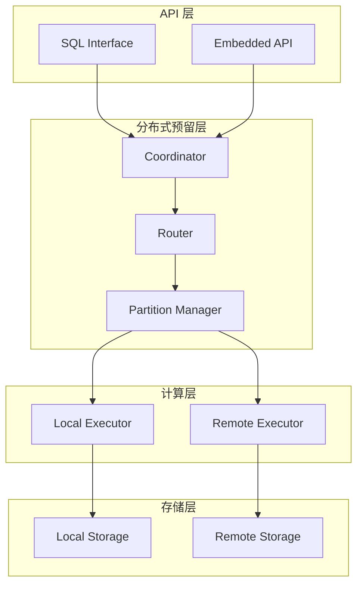

# SQLRustGo 3.0 分布式接口预留层设计

> 版本：v1.0
> 日期：2026-03-02
> 状态：设计草案

---

## 一、设计目标

### 1.1 为什么需要预留层

在 2.0 架构重构时，提前设计分布式接口预留层，可以：

- **降低未来重构成本**：避免大规模代码改动
- **保证接口稳定性**：核心 trait 不变，只扩展实现
- **渐进式演进**：从单机到分布式平滑过渡
- **降低认知负担**：开发者无需关心分布式细节

### 1.2 设计原则

```
┌─────────────────────────────────────────────────────────────────────────────┐
│                          分布式预留层设计原则                                 │
├─────────────────────────────────────────────────────────────────────────────┤
│                                                                              │
│   1. 接口抽象                                                                │
│      ├── 所有核心操作通过 trait 定义                                         │
│      ├── 实现可替换，调用方无感知                                            │
│      └── 本地/远程实现统一接口                                               │
│                                                                              │
│   2. 位置透明                                                                │
│      ├── 调用方不关心数据在哪里                                              │
│      ├── 调用方不关心计算在哪里                                              │
│      └── 路由逻辑封装在实现层                                                │
│                                                                              │
│   3. 状态分离                                                                │
│      ├── 无状态计算节点                                                      │
│      ├── 状态下沉到存储层                                                    │
│      └── 便于水平扩展                                                        │
│                                                                              │
│   4. 错误隔离                                                                │
│      ├── 网络错误与逻辑错误分离                                              │
│      ├── 重试机制封装                                                        │
│      └── 降级策略可配置                                                      │
│                                                                              │
└─────────────────────────────────────────────────────────────────────────────┘
```

---

## 二、架构概览

### 2.1 分层架构



### 2.2 核心接口

```rust
/// 分布式协调器接口
#[async_trait]
pub trait Coordinator: Send + Sync {
    /// 执行查询
    async fn execute(&self, query: &str) -> Result<QueryResult>;
    
    /// 获取集群状态
    async fn cluster_status(&self) -> Result<ClusterStatus>;
    
    /// 获取元数据
    async fn metadata(&self) -> Result<Arc<Metadata>>;
}

/// 路由器接口
#[async_trait]
pub trait Router: Send + Sync {
    /// 路由查询到指定节点
    async fn route(&self, query: &LogicalPlan) -> Result<Vec<NodeAssignment>>;
    
    /// 获取节点列表
    async fn nodes(&self) -> Result<Vec<NodeInfo>>;
}

/// 分区管理器接口
#[async_trait]
pub trait PartitionManager: Send + Sync {
    /// 获取分区信息
    fn get_partition(&self, table: &str, key: &Key) -> Result<PartitionId>;
    
    /// 获取分区列表
    fn list_partitions(&self, table: &str) -> Result<Vec<PartitionInfo>>;
    
    /// 创建分区
    async fn create_partition(&self, table: &str, spec: PartitionSpec) -> Result<PartitionId>;
}
```

---

## 三、执行引擎预留

### 3.1 分布式执行器接口

```rust
/// 执行引擎 trait（2.0 已有，3.0 扩展）
#[async_trait]
pub trait ExecutionEngine: Send + Sync {
    /// 本地执行（同步）
    fn execute(&self, plan: Arc<dyn PhysicalPlan>) -> Result<RecordBatch>;
    
    /// 分布式执行（异步）- 3.0 新增
    async fn execute_distributed(
        &self, 
        plan: Arc<dyn PhysicalPlan>,
        context: DistributedContext,
    ) -> Result<DistributedResult>;
    
    /// 名称
    fn name(&self) -> &str;
}

/// 分布式执行上下文
pub struct DistributedContext {
    /// 协调器引用
    pub coordinator: Arc<dyn Coordinator>,
    
    /// 执行配置
    pub config: ExecutionConfig,
    
    /// 超时设置
    pub timeout: Duration,
    
    /// 重试策略
    pub retry_policy: RetryPolicy,
}

/// 分布式执行结果
pub struct DistributedResult {
    /// 结果批次
    pub batches: Vec<RecordBatch>,
    
    /// 执行统计
    pub stats: ExecutionStats,
    
    /// 节点执行详情
    pub node_details: Vec<NodeExecutionDetail>,
}
```

### 3.2 远程执行器实现

```rust
/// 远程执行器（3.0 实现）
pub struct RemoteExecutor {
    client: NodeClient,
    node_id: NodeId,
}

#[async_trait]
impl ExecutionEngine for RemoteExecutor {
    fn execute(&self, plan: Arc<dyn PhysicalPlan>) -> Result<RecordBatch> {
        // 本地不支持，返回错误
        Err(SqlError::NotSupported("Local execution not supported on remote executor".into()))
    }
    
    async fn execute_distributed(
        &self, 
        plan: Arc<dyn PhysicalPlan>,
        context: DistributedContext,
    ) -> Result<DistributedResult> {
        // 序列化计划
        let plan_bytes = plan.serialize()?;
        
        // 发送到远程节点
        let response = self.client
            .execute(plan_bytes, context.timeout)
            .await?;
        
        // 反序列化结果
        let batches = response.batches
            .into_iter()
            .map(|b| RecordBatch::deserialize(&b))
            .collect::<Result<Vec<_>>>()?;
        
        Ok(DistributedResult {
            batches,
            stats: response.stats.into(),
            node_details: vec![NodeExecutionDetail {
                node_id: self.node_id.clone(),
                duration: response.duration,
                rows_processed: response.rows_processed,
            }],
        })
    }
    
    fn name(&self) -> &str {
        "remote-executor"
    }
}
```

---

## 四、存储层预留

### 4.1 分布式存储接口

```rust
/// 存储引擎 trait（2.0 已有，3.0 扩展）
#[async_trait]
pub trait StorageEngine: Send + Sync {
    // === 2.0 接口 ===
    
    /// 扫描表
    fn scan(&self, table: &str) -> Result<Box<dyn Iterator<Item = Row>>>;
    
    /// 插入行
    fn insert(&self, table: &str, row: Row) -> Result<()>;
    
    /// 删除行
    fn delete(&self, table: &str, id: RowId) -> Result<()>;
    
    // === 3.0 扩展接口 ===
    
    /// 分布式扫描
    async fn scan_distributed(
        &self,
        table: &str,
        partition: Option<PartitionId>,
    ) -> Result<DistributedScanIterator>;
    
    /// 批量写入
    async fn batch_write(
        &self,
        table: &str,
        batch: WriteBatch,
    ) -> Result<WriteResult>;
    
    /// 获取分区信息
    fn partition_info(&self, table: &str) -> Result<Vec<PartitionInfo>>;
}

/// 分布式扫描迭代器
pub struct DistributedScanIterator {
    partitions: Vec<PartitionIterator>,
    current: usize,
}

/// 写入批次
pub struct WriteBatch {
    pub inserts: Vec<Row>,
    pub updates: Vec<(RowId, Row)>,
    pub deletes: Vec<RowId>,
}

/// 写入结果
pub struct WriteResult {
    pub success_count: usize,
    pub failed_count: usize,
    pub errors: Vec<WriteError>,
}
```

### 4.2 远程存储实现

```rust
/// 远程存储引擎（3.0 实现）
pub struct RemoteStorageEngine {
    client: StorageClient,
    partition_manager: Arc<dyn PartitionManager>,
}

#[async_trait]
impl StorageEngine for RemoteStorageEngine {
    fn scan(&self, table: &str) -> Result<Box<dyn Iterator<Item = Row>>> {
        // 本地不支持
        Err(SqlError::NotSupported("Local scan not supported on remote storage".into()))
    }
    
    async fn scan_distributed(
        &self,
        table: &str,
        partition: Option<PartitionId>,
    ) -> Result<DistributedScanIterator> {
        let partitions = match partition {
            Some(p) => vec![p],
            None => self.partition_manager
                .list_partitions(table)?
                .into_iter()
                .map(|p| p.id)
                .collect(),
        };
        
        let iterators = partitions
            .into_iter()
            .map(|p| self.scan_partition(table, p))
            .collect::<Result<Vec<_>>>()?;
        
        Ok(DistributedScanIterator::new(iterators))
    }
    
    async fn batch_write(
        &self,
        table: &str,
        batch: WriteBatch,
    ) -> Result<WriteResult> {
        // 按分区分组
        let grouped = self.group_by_partition(table, batch)?;
        
        // 并行写入
        let futures: Vec<_> = grouped
            .into_iter()
            .map(|(partition, batch)| {
                let client = self.client.clone();
                async move {
                    client.write(partition, batch).await
                }
            })
            .collect();
        
        let results = futures::future::join_all(futures).await;
        
        // 合并结果
        let mut success = 0;
        let mut failed = 0;
        let mut errors = Vec::new();
        
        for result in results {
            match result {
                Ok(r) => success += r.success_count,
                Err(e) => {
                    failed += 1;
                    errors.push(WriteError::from(e));
                }
            }
        }
        
        Ok(WriteResult {
            success_count: success,
            failed_count: failed,
            errors,
        })
    }
    
    fn partition_info(&self, table: &str) -> Result<Vec<PartitionInfo>> {
        self.partition_manager.list_partitions(table)
    }
}
```

---

## 五、事务支持预留

### 5.1 事务接口

```rust
/// 事务管理器接口（3.0）
#[async_trait]
pub trait TransactionManager: Send + Sync {
    /// 开始事务
    async fn begin(&self) -> Result<Transaction>;
    
    /// 提交事务
    async fn commit(&self, txn: Transaction) -> Result<()>;
    
    /// 回滚事务
    async fn rollback(&self, txn: Transaction) -> Result<()>;
    
    /// 获取事务状态
    fn status(&self, txn_id: TxnId) -> Result<TransactionStatus>;
}

/// 事务
pub struct Transaction {
    /// 事务 ID
    pub id: TxnId,
    
    /// 开始时间戳
    pub start_ts: Timestamp,
    
    /// 快照隔离级别
    pub isolation_level: IsolationLevel,
    
    /// 写入集
    pub write_set: HashSet<RowId>,
    
    /// 读取集
    pub read_set: HashSet<RowId>,
}

/// 隔离级别
pub enum IsolationLevel {
    ReadUncommitted,
    ReadCommitted,
    RepeatableRead,
    Serializable,
}
```

### 5.2 MVCC 预留

```rust
/// MVCC 存储接口（3.0）
pub trait MVCCStorage: StorageEngine {
    /// 读取特定版本
    fn read_version(&self, key: &Key, ts: Timestamp) -> Result<Option<Value>>;
    
    /// 写入新版本
    fn write_version(&self, key: &Key, value: Value, ts: Timestamp) -> Result<()>;
    
    /// 获取最新版本
    fn latest_version(&self, key: &Key) -> Result<Option<(Value, Timestamp)>>;
    
    /// 垃圾回收
    fn gc(&self, before: Timestamp) -> Result<()>;
}
```

---

## 六、高可用预留

### 6.1 副本管理接口

```rust
/// 副本管理器接口（3.0）
#[async_trait]
pub trait ReplicaManager: Send + Sync {
    /// 获取副本列表
    fn replicas(&self, partition: PartitionId) -> Result<Vec<ReplicaInfo>>;
    
    /// 获取主副本
    fn leader(&self, partition: PartitionId) -> Result<NodeId>;
    
    /// 切换主副本
    async fn transfer_leader(&self, partition: PartitionId, new_leader: NodeId) -> Result<()>;
    
    /// 添加副本
    async fn add_replica(&self, partition: PartitionId, node: NodeId) -> Result<()>;
    
    /// 移除副本
    async fn remove_replica(&self, partition: PartitionId, node: NodeId) -> Result<()>;
}

/// 副本信息
pub struct ReplicaInfo {
    /// 节点 ID
    pub node_id: NodeId,
    
    /// 是否为主
    pub is_leader: bool,
    
    /// 复制进度
    pub replication_lag: Duration,
    
    /// 状态
    pub status: ReplicaStatus,
}

pub enum ReplicaStatus {
    Healthy,
    Syncing,
    Offline,
}
```

### 6.2 故障检测接口

```rust
/// 故障检测器接口（3.0）
#[async_trait]
pub trait FailureDetector: Send + Sync {
    /// 检查节点是否存活
    async fn is_alive(&self, node: &NodeId) -> bool;
    
    /// 获取故障节点列表
    fn failed_nodes(&self) -> Vec<NodeId>;
    
    /// 注册故障回调
    fn on_failure(&self, callback: Box<dyn Fn(&NodeId) + Send + Sync>);
}
```

---

## 七、演进路径

### 7.1 版本演进

```
┌─────────────────────────────────────────────────────────────────────────────┐
│                          版本演进路径                                         │
├─────────────────────────────────────────────────────────────────────────────┤
│                                                                              │
│   v2.0 (当前)                                                               │
│   ├── 定义核心 trait（ExecutionEngine, StorageEngine）                      │
│   ├── 本地实现                                                              │
│   └── 接口预留（async 方法默认返回 NotSupported）                           │
│                                                                              │
│   v2.5 (过渡)                                                               │
│   ├── 实现网络传输层                                                        │
│   ├── 实现远程执行器                                                        │
│   ├── 实现远程存储                                                          │
│   └── 单主多从架构                                                          │
│                                                                              │
│   v3.0 (分布式)                                                             │
│   ├── 实现分布式协调器                                                      │
│   ├── 实现分区管理                                                          │
│   ├── 实现事务支持                                                          │
│   └── 实现高可用                                                            │
│                                                                              │
└─────────────────────────────────────────────────────────────────────────────┘
```

### 7.2 接口兼容性

| 版本 | ExecutionEngine | StorageEngine | 新增接口 |
|------|-----------------|---------------|----------|
| v2.0 | execute() | scan/insert/delete | - |
| v2.5 | + execute_distributed() | + scan_distributed() | Coordinator |
| v3.0 | 同上 | + batch_write() | TransactionManager, ReplicaManager |

---

## 八、实现优先级

| 优先级 | 接口 | 版本 | 说明 |
|--------|------|------|------|
| P0 | ExecutionEngine trait | v2.0 | 核心接口 |
| P0 | StorageEngine trait | v2.0 | 核心接口 |
| P1 | execute_distributed() | v2.5 | 分布式执行 |
| P1 | scan_distributed() | v2.5 | 分布式扫描 |
| P2 | TransactionManager | v3.0 | 事务支持 |
| P2 | ReplicaManager | v3.0 | 高可用 |
| P3 | MVCCStorage | v3.0 | MVCC |

---

*本文档由 TRAE (GLM-5.0) 创建*
