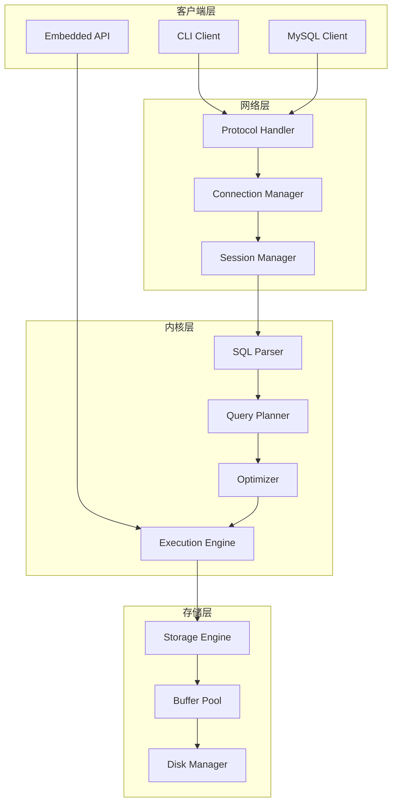
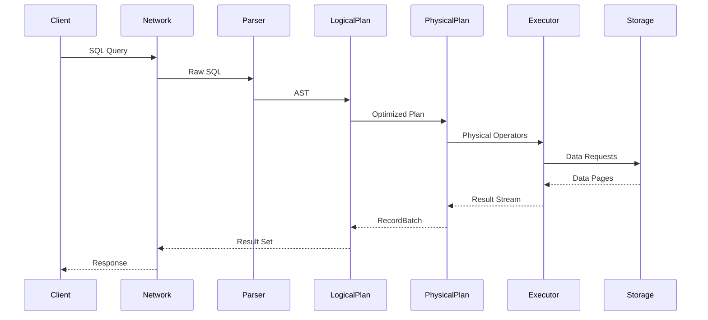
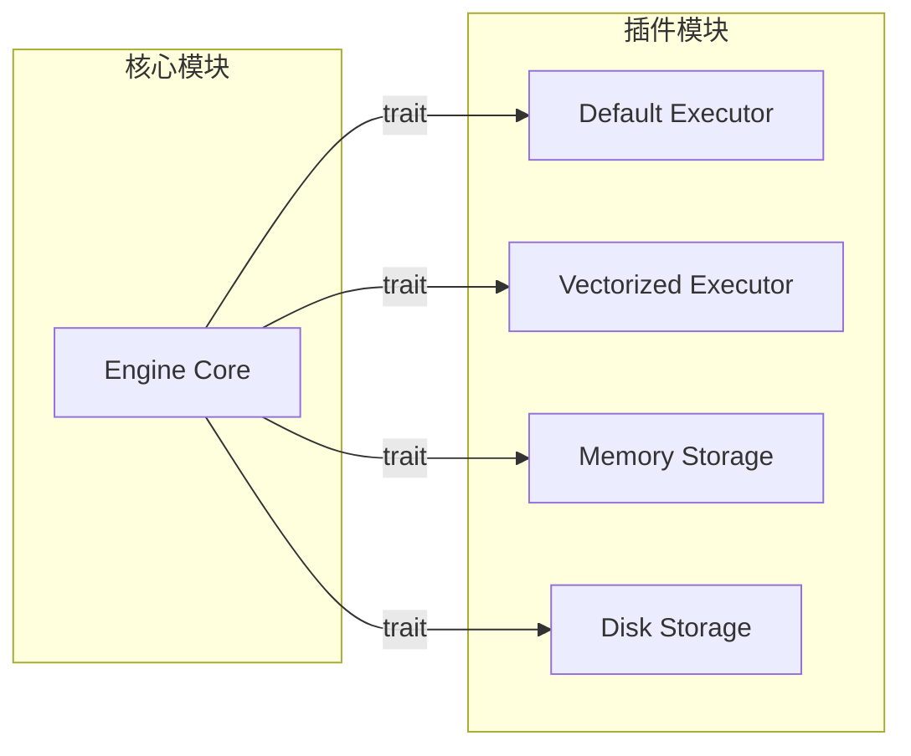
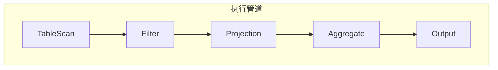
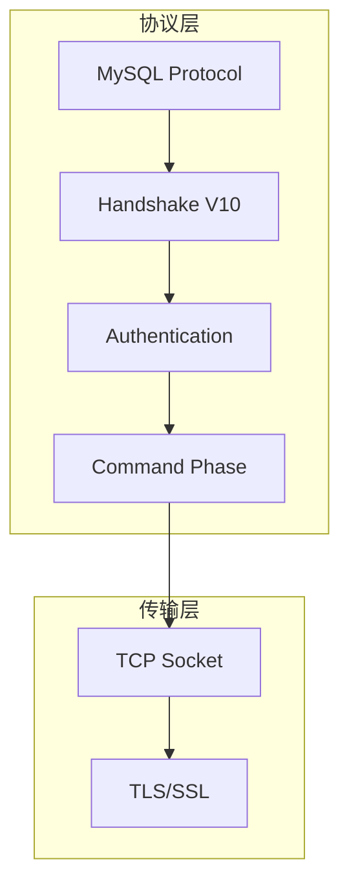
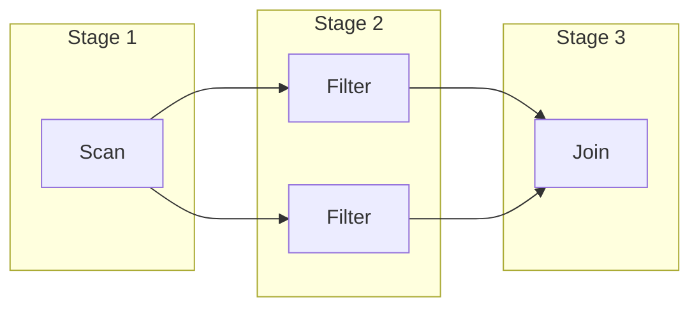

# SQLRustGo 2.0 架构白皮书

> 版本：v1.0
> 日期：2026-03-02
> 状态：草案

---

## 一、项目愿景

### 1.1 为什么做 SQLRustGo

SQLRustGo 的目标是构建一个 **Rust 原生 SQL 数据库内核**，具备以下特点：

- **高性能**：利用 Rust 的零成本抽象和内存安全
- **可嵌入**：可作为库嵌入到其他应用程序
- **可扩展**：插件化架构，支持自定义执行引擎和存储后端
- **教学友好**：清晰的代码结构，适合学习数据库内核实现

### 1.2 目标定位

```
┌─────────────────────────────────────────────────────────────────────────────┐
│                          SQLRustGo 定位                                      │
├─────────────────────────────────────────────────────────────────────────────┤
│                                                                              │
│   SQLite ────────── SQLRustGo ────────── DuckDB                            │
│   (嵌入式)            (C/S + 嵌入式)        (分析型)                         │
│                         ▲                                                   │
│                         │                                                   │
│                    Rust 原生                                                │
│                    插件化架构                                                │
│                    教学友好                                                  │
│                                                                              │
└─────────────────────────────────────────────────────────────────────────────┘
```

---

## 二、总体架构

### 2.1 架构全景图



### 2.2 数据流图



---

## 三、关键设计原则

### 3.1 Trait 驱动设计

```rust
/// 核心执行引擎 trait
pub trait ExecutionEngine: Send + Sync {
    fn execute(&self, plan: Arc<dyn PhysicalPlan>) -> Result<RecordBatch>;
    fn name(&self) -> &str;
}

/// 物理计划 trait
pub trait PhysicalPlan: Send + Sync {
    fn schema(&self) -> &Schema;
    fn execute(&self, partition: usize) -> Result<Box<dyn ExecutionPlan>>;
    fn children(&self) -> Vec<Arc<dyn PhysicalPlan>>;
}

/// 存储引擎 trait
pub trait StorageEngine: Send + Sync {
    fn scan(&self, table: &str) -> Result<Box<dyn Iterator<Item = Row>>>;
    fn insert(&self, table: &str, row: Row) -> Result<()>;
    fn delete(&self, table: &str, id: RowId) -> Result<()>;
}
```

### 3.2 插件化架构



### 3.3 无全局状态

- 所有状态通过参数传递
- 便于测试和并发
- 避免 hidden state

### 3.4 可测试优先

```rust
#[cfg(test)]
mod tests {
    use super::*;
    
    #[test]
    fn test_select_execution() {
        let storage = MockStorage::new();
        let executor = DefaultExecutor::new(storage);
        let plan = create_test_plan();
        
        let result = executor.execute(plan).unwrap();
        assert_eq!(result.row_count(), 10);
    }
}
```

---

## 四、执行引擎模型

### 4.1 Volcano 模型



### 4.2 Operator 接口

```rust
pub trait Operator: Send + Sync {
    fn open(&mut self) -> Result<()>;
    fn next(&mut self) -> Result<Option<RecordBatch>>;
    fn close(&mut self) -> Result<()>;
    fn schema(&self) -> &Schema;
}
```

### 4.3 Iterator 设计

```rust
pub struct FilterExec {
    input: Arc<dyn PhysicalPlan>,
    predicate: Arc<dyn PhysicalExpr>,
}

impl Operator for FilterExec {
    fn next(&mut self) -> Result<Option<RecordBatch>> {
        loop {
            match self.input.next()? {
                Some(batch) => {
                    let filtered = self.predicate.evaluate(&batch)?;
                    if filtered.row_count() > 0 {
                        return Ok(Some(filtered));
                    }
                }
                None => return Ok(None),
            }
        }
    }
}
```

---

## 五、网络架构

### 5.1 协议栈



### 5.2 连接管理

```rust
pub struct ConnectionHandler {
    stream: TcpStream,
    executor: Arc<dyn ExecutionEngine>,
    session: Session,
}

impl ConnectionHandler {
    pub async fn handle(&mut self) -> Result<()> {
        self.send_handshake().await?;
        self.read_auth().await?;
        
        loop {
            let command = self.read_command().await?;
            match command {
                Command::Query(sql) => {
                    let result = self.executor.execute_sql(&sql)?;
                    self.send_result(result).await?;
                }
                Command::Quit => break,
                _ => {}
            }
        }
        Ok(())
    }
}
```

### 5.3 错误模型

```rust
#[derive(Debug, thiserror::Error)]
pub enum SqlError {
    #[error("Parse error: {0}")]
    Parse(String),
    
    #[error("Execution error: {0}")]
    Execution(String),
    
    #[error("Network error: {0}")]
    Network(String),
    
    #[error("Storage error: {0}")]
    Storage(String),
}
```

---

## 六、性能策略

### 6.1 HashJoin 实现

```rust
pub struct HashJoinExec {
    left: Arc<dyn PhysicalPlan>,
    right: Arc<dyn PhysicalPlan>,
    on: Vec<(Column, Column)>,
    join_type: JoinType,
}

impl Operator for HashJoinExec {
    fn next(&mut self) -> Result<Option<RecordBatch>> {
        // Build phase: 构建左侧哈希表
        let mut hash_table: HashMap<Key, Vec<Row>> = HashMap::new();
        while let Some(batch) = self.left.next()? {
            for row in batch.rows() {
                let key = self.build_key(&row);
                hash_table.entry(key).or_default().push(row);
            }
        }
        
        // Probe phase: 探测右侧
        let mut result = Vec::new();
        while let Some(batch) = self.right.next()? {
            for row in batch.rows() {
                let key = self.build_key(&row);
                if let Some(matches) = hash_table.get(&key) {
                    for left_row in matches {
                        result.push(self.merge_rows(left_row, &row));
                    }
                }
            }
        }
        
        Ok(Some(RecordBatch::from_rows(result)))
    }
}
```

### 6.2 Pipeline 执行



### 6.3 内存分配优化

- 预分配缓冲区
- 避免频繁小分配
- 使用对象池

---

## 七、未来路线（3.0 预告）

### 7.1 向量化执行

```rust
pub trait VectorizedOperator {
    fn execute_batch(&self, batch: &RecordBatch) -> Result<RecordBatch>;
}
```

### 7.2 CBO 优化器

```rust
pub struct CostBasedOptimizer {
    statistics: Arc<dyn StatisticsCollector>,
    cost_model: Arc<dyn CostModel>,
}

impl CostBasedOptimizer {
    fn optimize(&self, plan: LogicalPlan) -> Result<LogicalPlan> {
        let alternatives = self.enumerate_plans(&plan)?;
        let best = alternatives
            .into_iter()
            .min_by_key(|p| self.estimate_cost(p))?;
        Ok(best)
    }
}
```

### 7.3 存储插件

```rust
pub trait StoragePlugin: Send + Sync {
    fn create_table(&self, name: &str, schema: &Schema) -> Result<TableHandle>;
    fn drop_table(&self, name: &str) -> Result<()>;
    fn scan(&self, handle: &TableHandle) -> Result<Box<dyn ScanIterator>>;
}
```

---

## 八、版本规划

| 版本 | 目标 | 核心特性 | 预计时间 |
|------|------|----------|----------|
| v1.1.0 | 内核架构 L4 | LogicalPlan/PhysicalPlan/Executor 插件化 | 2026-04 |
| v1.1.1 | 基础 C/S | server/client 可执行程序 | 2026-03 |
| v1.2.0 | 100万行级 | 向量化执行、统计信息、简化 CBO | 2026-06 |
| v2.0.0 | 商用级内核 | 完整 CBO、Memory Pool、Spill to Disk | 2026-09 |
| v3.0.0 | 企业级 | 分布式执行、事务支持、高可用 | 2027+ |

---

## 九、参考项目

- [Apache DataFusion](https://github.com/apache/arrow-datafusion)
- [TiKV](https://github.com/tikv/tikv)
- [DuckDB](https://github.com/duckdb/duckdb)
- [RisingWave](https://github.com/risingwavelabs/risingwave)

---

*本文档由 TRAE (GLM-5.0) 创建*
