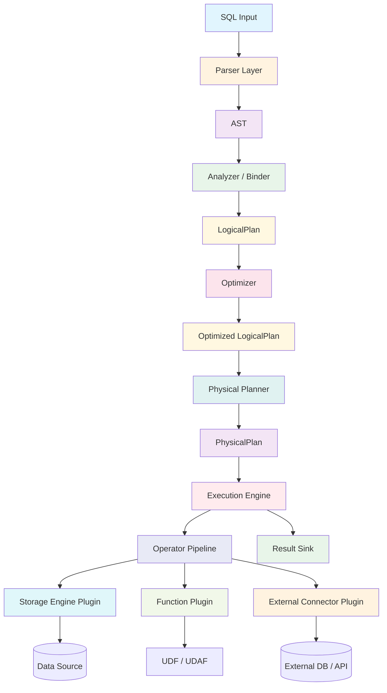

# SQLRustGo 插件化执行架构（完整版）

> 版本：v1.0
> 日期：2026-02-18
> 设计目标：可企业化、可插件化、可扩展到分布式

---

## 一、架构总览



---

## 二、架构分层解释

### 2.1 Parser 层

**职责**：
- SQL → AST
- 不参与优化

**建议**：
- 独立 crate
- 只依赖语法

```
┌─────────────────────────────────────────────────────────────────────────────┐
│                          Parser 层                                           │
├─────────────────────────────────────────────────────────────────────────────┤
│                                                                              │
│   输入：SQL String                                                          │
│   输出：AST (Abstract Syntax Tree)                                          │
│                                                                              │
│   特点：                                                                    │
│   ├── 纯语法分析                                                            │
│   ├── 无语义理解                                                            │
│   ├── 无优化逻辑                                                            │
│   └── 可独立测试                                                            │
│                                                                              │
└─────────────────────────────────────────────────────────────────────────────┘
```

### 2.2 Analyzer / Binder

**职责**：
- 表解析
- 字段解析
- 类型推断
- 生成 LogicalPlan

**这一层决定未来扩展能力**。

```
┌─────────────────────────────────────────────────────────────────────────────┐
│                          Analyzer / Binder                                   │
├─────────────────────────────────────────────────────────────────────────────┤
│                                                                              │
│   输入：AST                                                                 │
│   输出：LogicalPlan                                                         │
│                                                                              │
│   功能：                                                                    │
│   ├── 名称解析（表名、列名）                                                │
│   ├── 类型推断                                                              │
│   ├── 语义检查                                                              │
│   └── Schema 绑定                                                           │
│                                                                              │
└─────────────────────────────────────────────────────────────────────────────┘
```

### 2.3 LogicalPlan（逻辑计划）

**职责**：
- 纯逻辑表达
- 不涉及执行策略
- 可序列化（未来支持分布式）

```
┌─────────────────────────────────────────────────────────────────────────────┐
│                          LogicalPlan                                         │
├─────────────────────────────────────────────────────────────────────────────┤
│                                                                              │
│   特点：                                                                    │
│   ├── 声明式（做什么，不关心怎么做）                                        │
│   ├── 与物理执行无关                                                        │
│   ├── 可序列化传输                                                          │
│   └── 可被优化器变换                                                        │
│                                                                              │
│   节点类型：                                                                │
│   ├── Projection（投影）                                                    │
│   ├── Filter（过滤）                                                        │
│   ├── Join（连接）                                                          │
│   ├── Aggregate（聚合）                                                     │
│   └── TableScan（表扫描）                                                   │
│                                                                              │
└─────────────────────────────────────────────────────────────────────────────┘
```

### 2.4 Optimizer

**职责**：
- 谓词下推
- 投影裁剪
- Join Reorder
- 常量折叠

**必须插件化**。

```
┌─────────────────────────────────────────────────────────────────────────────┐
│                          Optimizer                                           │
├─────────────────────────────────────────────────────────────────────────────┤
│                                                                              │
│   规则类型：                                                                │
│   ├── 谓词下推（Predicate Pushdown）                                        │
│   ├── 投影裁剪（Projection Pruning）                                        │
│   ├── Join 重排序（Join Reorder）                                           │
│   ├── 常量折叠（Constant Folding）                                          │
│   └── 表达式简化（Expression Simplification）                               │
│                                                                              │
│   插件化设计：                                                              │
│   pub trait OptimizerRule {                                                 │
│       fn name(&self) -> &str;                                               │
│       fn optimize(&self, plan: LogicalPlan) -> LogicalPlan;                 │
│   }                                                                         │
│                                                                              │
└─────────────────────────────────────────────────────────────────────────────┘
```

### 2.5 Physical Planner

**职责**：
- LogicalPlan → PhysicalPlan
- 选择具体执行策略

```
┌─────────────────────────────────────────────────────────────────────────────┐
│                          Physical Planner                                    │
├─────────────────────────────────────────────────────────────────────────────┤
│                                                                              │
│   输入：Optimized LogicalPlan                                               │
│   输出：PhysicalPlan                                                        │
│                                                                              │
│   选择策略：                                                                │
│   ├── Join: HashJoin vs NestedLoop                                          │
│   ├── Scan: IndexScan vs SeqScan                                            │
│   ├── Aggregate: HashAggregate vs SortAggregate                             │
│   └── 基于 Cost 选择最优                                                    │
│                                                                              │
└─────────────────────────────────────────────────────────────────────────────┘
```

### 2.6 Execution Engine（核心可插拔层）

**真正执行 PhysicalPlan**。

```rust
pub trait ExecutorPlugin: Send + Sync {
    fn execute(&self, ctx: &ExecutionContext) -> Result<RecordBatch>;
    fn name(&self) -> &str;
}
```

**支持**：
- 本地执行器
- 向量化执行器
- 并行执行器
- 分布式执行器（未来）

```
┌─────────────────────────────────────────────────────────────────────────────┐
│                          Execution Engine                                    │
├─────────────────────────────────────────────────────────────────────────────┤
│                                                                              │
│   执行器类型：                                                              │
│   ├── DefaultExecutor（单线程）                                             │
│   ├── ParallelExecutor（并行）                                              │
│   ├── VectorizedExecutor（向量化）                                          │
│   └── DistributedExecutor（分布式）                                         │
│                                                                              │
│   特点：                                                                    │
│   ├── 可插拔                                                                │
│   ├── 可组合                                                                │
│   └── 可扩展                                                                │
│                                                                              │
└─────────────────────────────────────────────────────────────────────────────┘
```

### 2.7 Plugin 类型

| 类型 | 说明 | 接口 |
|:-----|:-----|:-----|
| **Storage Plugin** | 文件、内存、S3 | `StorageEngine` trait |
| **Function Plugin** | UDF / UDAF | `ScalarUDF` / `AggregateUDF` |
| **Connector Plugin** | 外部数据库 | `ExternalConnector` trait |
| **Optimizer Plugin** | 规则扩展 | `OptimizerRule` trait |

---

## 三、数据流图

```
┌─────────────────────────────────────────────────────────────────────────────┐
│                          数据流                                              │
├─────────────────────────────────────────────────────────────────────────────┤
│                                                                              │
│   SQL String                                                                │
│       │                                                                      │
│       ▼                                                                      │
│   ┌─────────────┐                                                           │
│   │   Parser    │  → AST                                                    │
│   └─────────────┘                                                           │
│       │                                                                      │
│       ▼                                                                      │
│   ┌─────────────┐                                                           │
│   │  Analyzer   │  → LogicalPlan                                            │
│   └─────────────┘                                                           │
│       │                                                                      │
│       ▼                                                                      │
│   ┌─────────────┐                                                           │
│   │  Optimizer  │  → Optimized LogicalPlan                                  │
│   └─────────────┘                                                           │
│       │                                                                      │
│       ▼                                                                      │
│   ┌─────────────┐                                                           │
│   │  Physical   │  → PhysicalPlan                                           │
│   │  Planner    │                                                           │
│   └─────────────┘                                                           │
│       │                                                                      │
│       ▼                                                                      │
│   ┌─────────────┐                                                           │
│   │  Executor   │  → RecordBatch                                            │
│   └─────────────┘                                                           │
│       │                                                                      │
│       ▼                                                                      │
│   QueryResult                                                               │
│                                                                              │
└─────────────────────────────────────────────────────────────────────────────┘
```

---

## 四、关键设计决策

### 4.1 为什么分层？

| 分层 | 好处 |
|:-----|:-----|
| Parser 独立 | 可替换解析器 |
| LogicalPlan | 可优化、可序列化 |
| PhysicalPlan | 可选择执行策略 |
| Executor 插件化 | 可扩展执行方式 |

### 4.2 为什么需要 IR？

```
AST → LogicalPlan → PhysicalPlan

而不是：

AST → 直接执行
```

**原因**：
- LogicalPlan 可优化
- PhysicalPlan 可选择策略
- 支持分布式传输

### 4.3 为什么插件化？

| 插件类型 | 扩展能力 |
|:---------|:---------|
| Storage | 支持多存储后端 |
| Function | 支持自定义函数 |
| Executor | 支持不同执行策略 |
| Optimizer | 支持自定义优化规则 |

---

## 五、与业界对比

| 项目 | 架构特点 |
|:-----|:---------|
| **DataFusion** | 完全插件化，Arrow 原生 |
| **DuckDB** | 向量化执行，列式存储 |
| **Velox** | 模块化，可组合 |
| **sqlrustgo** | 轻量级，教学友好，可扩展 |

---

## 六、下一步演进

### 短期（L3）

- [ ] LogicalPlan 独立模块
- [ ] Optimizer 规则系统
- [ ] PhysicalPlan 抽象

### 中期（L4）

- [ ] 向量化执行
- [ ] 并行执行
- [ ] Cost-based Optimizer

### 长期

- [ ] 分布式执行
- [ ] 多存储后端
- [ ] 外部连接器

---

*本文档由 TRAE (GLM-5.0) 创建*
