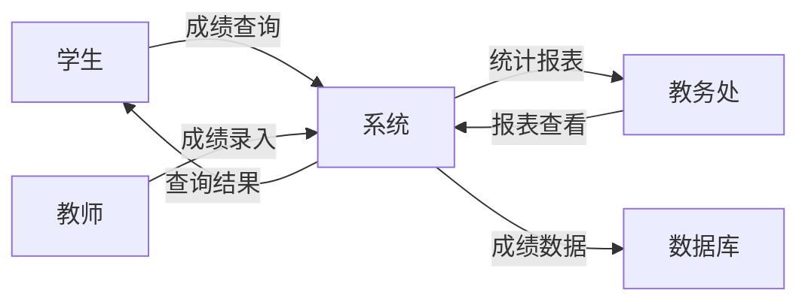
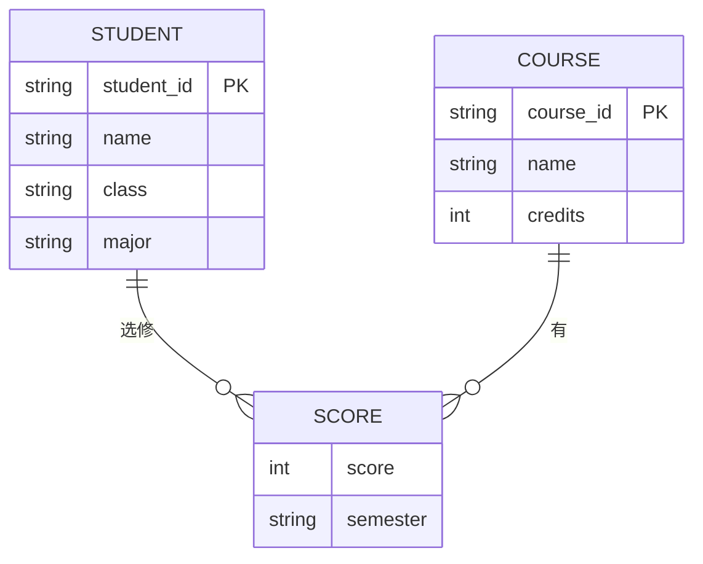
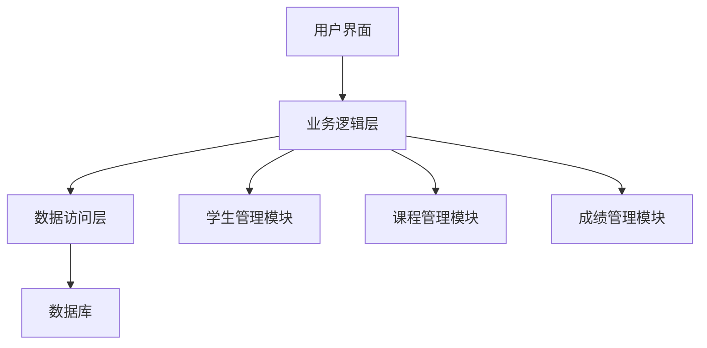

# 第2周：需求文档编写 —— 结构化分析方法实践

> 实验时间：2学时
> 实验类型：设计性
> 前置知识：第二讲 - 结构化分析、设计与实现

---

## 一、实验目标

- [ ] 掌握结构化分析的基本方法（SA）
- [ ] 能够使用AI辅助创建DFD图和ER图
- [ ] 能够进行数据字典设计
- [ ] 能够使用Trae生成数据库设计代码
- [ ] 掌握AI-IDE工具的实践技巧

---

## 二、知识回顾：结构化方法

### 2.1 结构化方法三阶段

|阶段|方法|产出|
|:---|:---|:---|
|需求分析|结构化分析 SA|DFD、ER图、数据字典|
|系统设计|结构化设计 SD|模块结构图|
|程序实现|结构化程序设计 SP|代码|

### 2.2 DFD四元素

- **外部实体**：系统外交互的人/系统
- **处理**：对数据的加工变换
- **数据流**：数据流动路径
- **数据存储**：静止的数据（文件/数据库）

### 2.3 ER图三元素

- **实体**：现实世界的对象
- **属性**：实体的特征
- **联系**：实体间的关系

---

## 三、操作步骤

### 步骤1：使用AI生成DFD图（25分钟）

#### 1.1 打开Trae IDE

启动Trae IDE，打开SQLRustGo项目（或创建新项目）。

#### 1.2 生成DFD上下文图

在AI对话窗口输入：

```
请为"学生成绩管理系统"生成数据流图（DFD）的上下文图，使用Mermaid语法。
系统名称：学生成绩管理系统
外部实体：学生、教师、教务处
数据存储：学生表、成绩表、课程表
主要功能：成绩录入、成绩查询、成绩统计
请输出Mermaid代码。
```

#### 1.3 查看生成结果

AI会生成类似以下的Mermaid代码：



#### 1.4 生成DFD Level 1

继续输入：

```
请生成该系统的DFD Level 1图，展示主要功能模块之间的数据流动。
```

#### ✅ 检查点1：截图保存DFD图

---

### 步骤2：使用AI生成ER图（25分钟）

#### 2.1 生成ER图

在AI对话窗口输入：

```
请为"学生成绩管理系统"生成ER图，使用Mermaid语法。
实体包括：
1. 学生(Student)：学号、姓名、班级、专业
2. 课程(Course)：课程号、课程名、学分
3. 成绩(Score)：学号、课程号、分数、学期

关系：
- 一个学生可以选修多门课程
- 一门课程可以被多个学生选修
- 成绩关联学生和课程

请输出Mermaid ER图代码。
```

#### 2.2 查看ER图结果



#### 2.3 使用PlantUML格式（可选）

```
请用PlantUML格式生成相同的ER图。
```

#### ✅ 检查点2：截图保存ER图

---

### 步骤3：数据字典设计（20分钟）

#### 3.1 什么是数据字典

数据字典是对DFD和ERD中所有元素的精确定义，确保所有开发人员对术语的理解一致。

#### 3.2 生成数据字典

在AI对话输入：

```
请为"学生成绩管理系统"生成数据字典。
需要定义：
1. 学生表的所有字段（学号、姓名、性别、出生日期、班级、专业、联系电话）
2. 课程表的所有字段（课程号、课程名、学分、开课学期）
3. 成绩表的所有字段（学号、课程号、分数、考试日期）

请用表格形式输出，包含字段名、类型、说明、主键/外键。
```

#### 3.3 数据字典示例

|表名|字段名|数据类型|说明|约束|
|:---|:---|:---|:---|:---|
|Student|student_id|VARCHAR(10)|学号|PK|
|Student|name|VARCHAR(50)|姓名|NOT NULL|
|Course|course_id|VARCHAR(10)|课程号|PK|
|Course|credits|INT|学分|DEFAULT 0|
|Score|score|DECIMAL(5,2)|分数|0-100|

#### ✅ 检查点3：保存数据字典

---

### 步骤4：使用Builder模式生成SQL代码（20分钟）

#### 4.1 切换到Builder模式

在Trae中点击Builder模式或输入`/builder`

#### 4.2 输入建表指令

```
创建一个MySQL数据库的学生成绩管理系统。
需要生成以下表的CREATE TABLE语句：
1. student表：学号(主键)、姓名、性别、出生日期、班级、专业
2. course表：课程号(主键)、课程名、学分、开课学期
3. score表：学号(外键)、课程号(外键)、分数、考试日期

请生成完整的SQL文件，包含主键、外键约束。
```

#### 4.3 查看生成的SQL

AI会生成类似以下的SQL：

```sql
CREATE TABLE student (
    student_id VARCHAR(10) PRIMARY KEY,
    name VARCHAR(50) NOT NULL,
    gender ENUM('男', '女'),
    birth_date DATE,
    class VARCHAR(20),
    major VARCHAR(50)
);

CREATE TABLE course (
    course_id VARCHAR(10) PRIMARY KEY,
    course_name VARCHAR(100) NOT NULL,
    credits INT DEFAULT 0,
    semester VARCHAR(20)
);

CREATE TABLE score (
    id INT AUTO_INCREMENT PRIMARY KEY,
    student_id VARCHAR(10),
    course_id VARCHAR(10),
    score DECIMAL(5,2),
    exam_date DATE,
    FOREIGN KEY (student_id) REFERENCES student(student_id),
    FOREIGN KEY (course_id) REFERENCES course(course_id)
);
```

#### 4.4 复制SQL到文件

将生成的SQL保存到 `docs/requirements/student_system.sql`

#### ✅ 检查点4：保存SQL文件

---

### 步骤5：生成模块结构图（15分钟）

#### 5.1 生成模块结构图

在AI对话输入：

```
请为"学生成绩管理系统"生成模块结构图，使用Mermaid语法。
系统模块包括：
- 学生管理模块（增删改查）
- 课程管理模块
- 成绩管理模块
- 数据访问层

请展示模块之间的调用关系。
```

#### 5.2 查看结果



#### ✅ 检查点5：保存模块结构图

---

### 步骤6：Git提交（15分钟）

#### 6.1 创建分支

```bash
git checkout -b docs/student-system-design-你的学号
```

#### 6.2 创建文档目录

```bash
mkdir -p docs/requirements/student-system
```

#### 6.3 保存所有生成的内容

将以下文件放入目录：
- DFD图截图
- ER图截图
- 数据字典
- SQL代码
- 模块结构图

#### 6.4 提交

```bash
git add docs/requirements/student-system/
git commit -m "docs: add student system analysis and design

- DFD context diagram and Level 1
- ER diagram
- Data dictionary
- SQL CREATE TABLE statements
- Module structure diagram"
```

#### 6.5 推送

```bash
git push origin docs/student-system-design-你的学号
```

#### ✅ 检查点6：截图Git提交记录

---

## 四、实验报告

### 4.1 报告内容

1. DFD图（上下文图 + Level 1）- 截图
2. ER图 - 截图
3. 数据字典 - 表格
4. SQL建表语句 - 代码
5. 模块结构图 - 截图
6. Git提交截图
7. **AI实践心得**：描述使用AI工具生成图表和代码的体验

### 4.2 报告格式

```markdown
# 实验报告：结构化方法实践

## 1. 实验概述
（描述你完成的工作）

## 2. DFD分析
（截图+说明）

## 3. ER图设计
（截图+说明）

## 4. 数据字典
（表格）

## 5. SQL代码
（代码块）

## 6. 模块结构图
（截图）

## 7. AI实践心得
（使用AI工具的体会和技巧）
```

### 4.3 提交方式

```bash
mkdir -p reports/week-02
# 将报告放入该目录
git add reports/week-02/
git commit -m "experiment: submit week-02 report"
git push
```

---

## 五、评分标准

|检查项|分值|
|:---|:---|
|DFD图正确完整|20分|
|ER图正确完整|20分|
|数据字典规范|20分|
|SQL代码正确|20分|
|Git提交规范|10分|
|AI实践心得|10分|

---

## 六、AI工具使用技巧总结

### 6.1 有效Prompt要素

- ✅ 明确技术栈（MySQL、PostgreSQL等）
- ✅ 明确功能需求
- ✅ 明确输出格式（Mermaid、PlantUML、SQL）
- ✅ 提供参考示例

### 6.2 常用Prompt模板

**生成DFD**：
```
请为[系统名]生成DFD，使用Mermaid语法。
外部实体：[...]
数据存储：[...]
处理功能：[...]
```

**生成ER图**：
```
请为[系统名]生成ER图。
实体：[...]
属性：[...]
关系：[...]
```

**生成SQL**：
```
请生成[系统名]的SQL建表语句。
表：[表名和字段]
约束：[主键、外键]
```

### 6.3 Builder vs Chat模式

- **Chat模式**：生成图表、解释代码、局部修改
- **Builder模式**：从0到1生成完整项目框架

---

## 七、课后思考

1. DFD与流程图有什么区别？
2. 为什么ER图是数据库设计的基础？
3. AI生成的代码需要人工审查哪些内容？
4. 如何将结构化方法应用于实际项目开发？

---

*最后更新: 2026-03-09*
