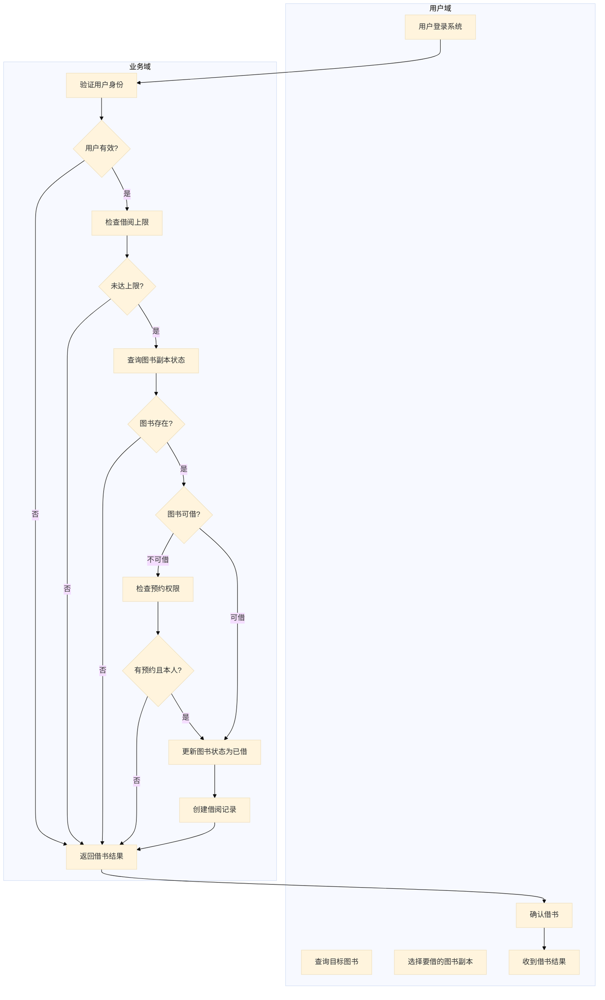
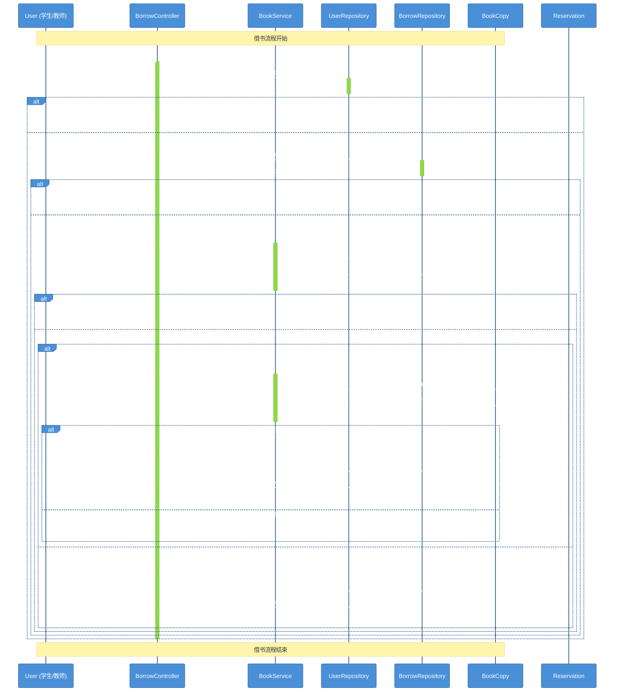
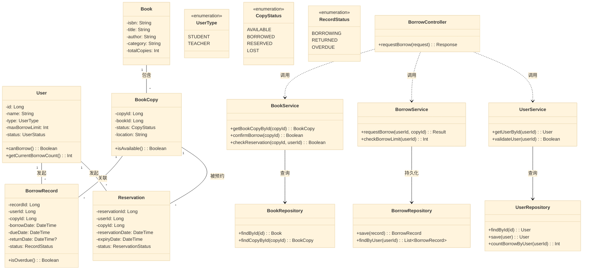
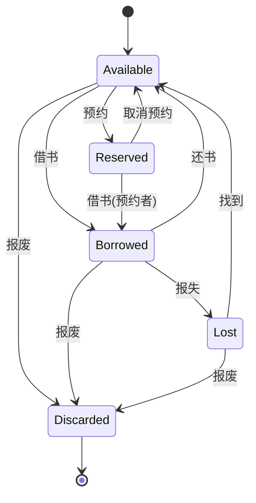

# 第4周：OOA到OOP学生上机实践过程记录

> 实践时间：2学时（80分钟）
> 实践类型：设计性
> 前置知识：第4周课程 - OOAD动态建模与架构设计

---

## 一、实践目标

- [ ] 掌握从用例图过渡到顺序图的方法
- [ ] 理解OOA到OOD再到OOP的转换过程
- [ ] 能够使用AI辅助生成顺序图和类图
- [ ] 理解关键设计决策及其理由
- [ ] 理解为什么必须按固定顺序进行设计

---

## 二、核心方法论：正确 OOA→OOD 的细化顺序

```
┌─────────────────────────────────────────────────────────────────────────────────────┐
│                    OOA → OOD 正确细化顺序                                            │
├─────────────────────────────────────────────────────────────────────────────────────┤
│                                                                                     │
│   ┌─────────────┐     ┌─────────────┐     ┌─────────────┐     ┌─────────────┐      │
│   │   用例图    │ ──▶ │   活动图    │ ──▶ │  架构设计   │ ──▶ │   顺序图    │      │
│   └─────────────┘     └─────────────┘     └─────────────┘     └─────────────┘      │
│         │                   │                   │                   │             │
│         ▼                   ▼                   ▼                   ▼             │
│    "谁可以做什么"     "先做什么后做什么"    "分成哪几层"       "谁和谁交互"        │
│                                                                                     │
│   静态视图            流程视角              架构视角           对象视角             │
│                                                                                     │
└─────────────────────────────────────────────────────────────────────────────────────┘
```

### 为什么必须按这个顺序？

| 步骤 | 回答的问题 | 跳过会导致 | 时间分配 |
|------|-----------|-----------|---------|
| 用例图 | 谁可以借书？有哪些功能？ | 不知道系统有哪些功能 | 10分钟 |
| 活动图 | 借书的完整流程是什么？ | 流程不清晰，顺序图会混乱 | 15分钟 |
| 架构设计 | 系统分成哪几层？ | 不知道类怎么组织 | 10分钟 |
| 顺序图 | 对象之间如何交互？ | 对象凭感觉，职责不清晰 | 15分钟 |
| 类图更新 | 类有什么方法？ | 类图不完整 | 10分钟 |
| 状态图 | 对象状态如何变化？ | 遗漏特殊状态 | 5分钟 |

### 核心思想：从"做什么"到"怎么做"的渐进式细化

```
第一层：业务视角（用例图）
  关注点：功能需求
  问题：谁可以借书？借书包含哪些功能？

第二层：流程视角（活动图）
  关注点：业务流程
  问题：借书的完整流程是什么？有哪些分支？
  → 不关心谁来做，只关心流程步骤

第三层：架构视角（架构设计）
  关注点：系统结构
  问题：采用什么架构？分哪些层？
  → 决定Controller/Service/Repository的划分

第四层：对象视角（顺序图）
  关注点：对象协作
  问题：具体哪些对象交互？怎么交互？
  → 基于架构，确定对象的消息传递
```

---

## 三、需求描述

```
参与者：学生、教师、图书管理员
用例：登录、查询图书、借书、还书、管理图书、预约图书、查看借阅历史、计算罚款

关系：
- 学生和教师可以登录、查询图书、借书、还书、预约图书、查看借阅历史
- 图书管理员可以登录、管理图书、查看所有借阅记录
- 借书和还书都包含查询图书（<<include>>）
- 还书包含计算罚款（<<include>>）
- 预约图书扩展借书（<<extend>>）

【补充规则】
罚款规则：逾期每天罚款0.1元，最高不超过图书原价
```

---

## 四、实践过程记录

### 4.1 阶段一：用例图生成（10分钟）

#### 操作步骤

1. 打开Trae IDE，进入AI对话模式
2. 输入用例图生成请求

#### AI提示词

```
请为"高校图书借阅系统"生成用例图，使用Mermaid语法。

参与者：学生、教师、图书管理员
用例：登录、查询图书、借书、还书、管理图书、预约图书、查看借阅历史、计算罚款

关系：
- 学生和教师可以登录、查询图书、借书、还书、预约图书、查看借阅历史
- 图书管理员可以登录、管理图书、查看所有借阅记录
- 借书和还书都包含查询图书（<<include>>）
- 还书包含计算罚款（<<include>>）
- 预约图书扩展借书（<<extend>>）
```

#### AI生成结果

```mermaid
%%{init: {'theme': 'base', 'themeVariables': { 'primaryColor': '#4A90D9', 'primaryTextColor': '#fff', 'primaryBorderColor': '#2C5F8D', 'lineColor': '#666', 'secondaryColor': '#F5F5F5', 'tertiaryColor': '#FAFAFA'}}}%%
graph LR
    subgraph "参与者"
        Student("学生")
        Teacher("教师")
        Librarian("图书管理员")
    end

    subgraph "用例"
        Login("登录")
        QueryBook("查询图书")
        BorrowBook("借书")
        ReturnBook("还书")
        ManageBook("管理图书")
        ReserveBook("预约图书")
        ViewHistory("查看借阅历史")
        ViewAllRecords("查看所有借阅记录")
        CalculateFine("计算罚款")
    end

    Student --> Login
    Student --> QueryBook
    Student --> BorrowBook
    Student --> ReturnBook
    Student --> ReserveBook
    Student --> ViewHistory

    Teacher --> Login
    Teacher --> QueryBook
    Teacher --> BorrowBook
    Teacher --> ReturnBook
    Teacher --> ReserveBook
    Teacher --> ViewHistory

    Librarian --> Login
    Librarian --> ManageBook
    Librarian --> ViewAllRecords

    BorrowBook ..> QueryBook : <<include>>
    ReturnBook ..> QueryBook : <<include>>
    ReturnBook ..> CalculateFine : <<include>>

    ReserveBook ---> BorrowBook : <<extend>>
```

#### 用例图说明

| 关系类型 | 符号 | 说明 |
|---------|------|------|
| 关联 | `-->` | 参与者与用例之间的交互 |
| 包含 | `..>` | 用例之间的关系，表示必须执行 |
| 扩展 | `--->` | 用例之间的可选扩展关系 |

---

### 4.2 阶段二：从用例图到顺序图的过渡

#### 为什么要从用例图过渡到顺序图？

**问题思考**：

- 用例图只说"借书"，但**如何借**？对象如何交互？
- 不知道谁和谁交互
- 不知道何时判断条件
- 不知道缺失什么对象

**答案**：顺序图揭示对象间的**消息传递、时间顺序、激活周期**

#### 用例图与顺序图的对比

| 用例图 | 顺序图 |
|--------|--------|
| 描述系统功能 | 描述对象交互 |
| 参与者与用例的关系 | 对象之间如何通信 |
| 静态视图 | 动态视图 |
| "谁可以做什么" | "做了什么之后谁响应" |

---

### 4.3 阶段三：借书流程活动图分析（15分钟）

#### 3.1 为什么要先画活动图？

```
活动图回答的问题：
══════════════════════════════════════════════════════════════════════════

1. 借书这个"动作"包含哪些步骤？
   → 验证用户 → 检查上限 → 查询图书 → 检查状态 → 执行借阅 → 记录

2. 借书过程中有哪些分支判断？
   → 用户是否有效？是否已达上限？图书是否可借？是否有预约？

3. 借书的流程是线性的还是并行的？
   → 串行：先验证再检查再执行

4. 活动图不关心"谁来做"，只关心"做什么"
   → 这是业务层面的分析，与技术实现无关

══════════════════════════════════════════════════════════════════════════
活动图的价值：
- 帮助我们理清业务逻辑（不掺杂技术细节）
- 为后续架构设计提供基础（知道需要哪些功能模块）
- 是画顺序图的前提（流程不清，顺序必乱）
```

#### 3.2 借书流程活动图（带泳道）



#### 活动图流程说明

```
借书完整流程步骤：
══════════════════════════════════════════════════════════════════════════

步骤1: 用户登录系统
  └─ 前置条件：用户必须先登录

步骤2: 查询目标图书
  └─ 用户需要找到想借的书

步骤3: 选择要借的图书副本
  └─ 一本书可能有多个副本，选择具体哪一本

步骤4: 验证用户身份 [业务判断]
  ├─ 检查用户是否存在
  └─ 检查用户状态是否正常（未冻结）

步骤5: 检查借阅上限 [业务判断]
  ├─ 查询当前借阅数量
  └─ 判断是否达到个人上限

步骤6: 查询图书副本状态 [业务判断]
  ├─ 查询该副本的当前状态
  └─ 判断是否可借（Available/已借出/已预约）

步骤7: 检查预约权限 [特殊分支]
  ├─ 如果图书已预约：检查是否是当前用户预约
  └─ 只有预约者才能借走已预约的图书

步骤8: 执行借书操作
  ├─ 更新图书状态为"已借"
  └─ 创建借阅记录

步骤9: 返回结果
  └─ 通知用户借书成功或失败原因
══════════════════════════════════════════════════════════════════════════
```

#### 3.3 从活动图识别对象

```
活动图 → 对象 的映射关系：
══════════════════════════════════════════════════════════════════════════

活动图中的"处理框"          →    可能的类/对象
─────────────────────────────────────────────────────────────────────

"验证用户身份"             →    UserService / UserRepository
"检查借阅上限"             →    BorrowService / UserRepository
"查询图书副本状态"          →    BookService / BookCopyRepository
"检查预约权限"             →    ReservationService / ReservationRepository
"更新图书状态"             →    BookCopy / BookCopyRepository
"创建借阅记录"            →    BorrowRecord / BorrowRepository

══════════════════════════════════════════════════════════════════════════
关键洞察：
- 活动图的每个处理框都可能对应一个类的某个方法
- 活动图帮助我们识别需要哪些Service类
- 活动图中的"判断"对应代码中的if-else或条件分支
- 活动图中的"数据流动"暗示需要Repository进行持久化
```

---

### 4.4 阶段四：架构设计（10分钟）

#### 4.1 为什么要先做架构设计？

```
══════════════════════════════════════════════════════════════════════════
问题：有了活动图，为什么还要做架构设计？

答案：活动图只告诉我们"做什么"，不告诉我们"怎么做"

活动图说：
  "验证用户身份" → "检查借阅上限" → "查询图书" → "执行借书"

但没说：
  - 这些逻辑放在哪些类里？
  - 谁处理请求？谁处理业务？谁处理数据？
  - 如何组织代码结构？

⚠️ 重要提示：
此时不需要纠结"数据库怎么连接"、"SQL怎么写"，只需要知道：
- 需要一个"数据存取"的接口（Repository）
- 需要一个"业务逻辑"的类（Service）
- 需要一个"处理请求"的类（Controller）

重点：职责划分，而不是具体实现！
══════════════════════════════════════════════════════════════════════════
```

#### 4.2 三层架构设计

```
┌─────────────────────────────────────────────────────────────────────────────┐
│                        三层架构（Three-Tier Architecture）                   │
├─────────────────────────────────────────────────────────────────────────────┤
│                                                                             │
│   ┌─────────────────────────────────────────────────────────────────────┐   │
│   │                      表现层 (Presentation Layer)                     │   │
│   │                                                                       │   │
│   │   ┌─────────────────┐    ┌─────────────────┐                        │   │
│   │   │ BorrowController │    │ ReturnController │   ...                │   │
│   │   │                  │    │                  │                        │   │
│   │   │ - requestBorrow │    │ - requestReturn  │                        │   │
│   │   │ - 参数校验      │    │ - 参数校验       │                        │   │
│   │   │ - 返回响应      │    │ - 返回响应       │                        │   │
│   │   └─────────────────┘    └─────────────────┘                        │   │
│   │         │                         │                                 │   │
│   └─────────│─────────────────────────│─────────────────────────────────┘   │
│             ▼                         ▼                                    │
│   ┌─────────────────────────────────────────────────────────────────────┐   │
│   │                      业务层 (Business Layer)                        │   │
│   │                                                                       │   │
│   │   ┌─────────────────┐    ┌─────────────────┐    ┌──────────────┐   │   │
│   │   │  BorrowService  │    │  ReturnService  │    │ BookService  │   │   │
│   │   │                  │    │                  │    │              │   │   │
│   │   │ - 借阅业务逻辑   │    │ - 还书业务逻辑   │    │ - 图书查询    │   │   │
│   │   │ - 检查借阅上限   │    │ - 计算罚款      │    │ - 库存管理    │   │   │
│   │   │ - 检查预约权限   │    │ - 更新状态      │    │ - 状态检查    │   │   │
│   │   └─────────────────┘    └─────────────────┘    └──────────────┘   │   │
│   │         │                         │                  │              │   │
│   └─────────│─────────────────────────│──────────────────│──────────────┘   │
│             ▼                         ▼                  ▼                   │
│   ┌─────────────────────────────────────────────────────────────────────┐   │
│   │                      数据层 (Data Layer)                            │   │
│   │                                                                       │   │
│   │   ┌─────────────────┐    ┌─────────────────┐    ┌──────────────┐   │   │
│   │   │  UserRepository  │    │ BorrowRepository │    │BookCopyRepo  │   │   │
│   │   │  (接口)          │    │  (接口)          │    │   (接口)      │   │   │
│   │   │                  │    │                  │    │              │   │   │
│   │   │ - findById      │    │ - save           │    │ - findById   │   │   │
│   │   │ - countBorrow   │    │ - findByUser     │    │ - updateStatus│   │   │
│   │   └─────────────────┘    └─────────────────┘    └──────────────┘   │   │
│   │                                                                       │   │
│   └─────────────────────────────────────────────────────────────────────┘   │
│                                                                             │
└─────────────────────────────────────────────────────────────────────────────┘
```

#### 4.3 架构设计原则

```
┌─────────────────────────────────────────────────────────────────────────────┐
│                          架构设计五大原则                                    │
├─────────────────────────────────────────────────────────────────────────────┤
│                                                                             │
│  原则1: 单一职责 (SRP)                                                     │
│  ─────────────────────                                                      │
│  每个类只做一件事                                                          │
│  Controller处理请求，Service处理业务，Repository处理数据                    │
│                                                                             │
│  原则2: 依赖倒置 (DIP)                                                      │
│  ─────────────────────                                                      │
│  高层模块不依赖低层模块，两者都依赖抽象                                    │
│  Service依赖Repository接口，不依赖具体实现                                  │
│                                                                             │
│  原则3: 开闭原则 (OCP)                                                      │
│  ─────────────────────                                                      │
│  对扩展开放，对修改关闭                                                    │
│  新增数据库实现只需新增Repository实现类                                     │
│                                                                             │
│  原则4: 里氏替换 (LSP)                                                      │
│  ─────────────────────                                                      │
│  子类可以替换父类                                                          │
│  InMemoryRepository可以替换UserRepository                                  │
│                                                                             │
│  原则5: 接口隔离 (ISP)                                                      │
│  ─────────────────────                                                      │
│  使用多个专门的接口，不使用单一的总接口                                    │
│  UserRepository和BookRepository分开                                         │
│                                                                             │
└─────────────────────────────────────────────────────────────────────────────┘
```

#### 4.4 基于活动图的架构映射

```
活动图的处理框         →    架构分层          →    具体类
─────────────────────────────────────────────────────────────────────

"验证用户身份"         →    业务层            →    UserService
                           ↓
                          数据层            →    UserRepository

"检查借阅上限"         →    业务层            →    BorrowService
                           ↓
                          数据层            →    UserRepository.countBorrow()

"查询图书副本状态"     →    业务层            →    BookService
                           ↓
                          数据层            →    BookCopyRepository

"更新图书状态"         →    业务层            →    BookService.updateStatus()
                           ↓
                          数据层            →    BookCopyRepository

"创建借阅记录"         →    业务层            →    BorrowService
                           ↓
                          数据层            →    BorrowRepository.save()

══════════════════════════════════════════════════════════════════════════
结论：架构设计连接了"做什么"（活动图）和"谁来做"（顺序图）
```

---

### 4.5 阶段五：顺序图生成（15分钟）

#### 5.1 为什么现在才画顺序图？

```
══════════════════════════════════════════════════════════════════════════
前提条件：
══════════════════════════════════════════════════════════════════════════

✅ 活动图：已经知道完整的业务流程（先做什么后做什么）
✅ 架构设计：已经知道分层结构和类的大致划分
✅ 对象识别：已经知道需要哪些Service和Repository

现在画顺序图：
- 流程是清晰的（活动图已明确）
- 对象是已知的（架构设计已划分）
- 职责是明确的（每个类只做一件事）

══════════════════════════════════════════════════════════════════════════
如果跳过前两步直接画顺序图：
❌ 流程不清楚，可能漏掉步骤
❌ 对象不明确，可能凭感觉添加
❌ 职责不清晰，顺序图会混乱
```

#### 5.2 顺序图与活动图的对应关系

```
活动图步骤                              顺序图消息
─────────────────────────────────────────────────────────────────────

Step 1: 验证用户身份              BC → UR: getUserById()
                                         ↓
                                    UR -->> BC: User

Step 2: 检查借阅上限              BC → BR: checkBorrowLimit()
                                         ↓
                                    BR -->> BC: count

Step 3: 查询图书副本状态          BC → BS: getBookCopyById()
                                         ↓
                                    BS → BCopy: findById()
                                         ↓
                                    BCopy -->> BS: BookCopy
                                         ↓
                                    BS -->> BC: BookCopy

Step 4: 检查图书可借性            (条件判断)

Step 5: 检查预约权限              BC → BS: checkReservation()
                                         ↓
                                    BS -->> Res: findByCopyAndUser()
                                         ↓
                                    Res -->> BS: Reservation?
                                         ↓
                                    BS -->> BC: hasReservation

Step 6: 执行借书                  BS: confirmBorrow()
                                         ↓
                                    BCopy: updateStatus(已借)
                                         ↓
                                    BR: createBorrowRecord()
```

#### AI提示词

```
基于活动图和架构设计，生成借书过程的顺序图。

前置信息：
1. 活动图已明确借书流程：验证用户→检查上限→查询图书→检查状态→执行借书→返回结果
2. 架构采用三层架构：Controller → Service → Repository
3. 已识别的对象：BorrowController, BookService, UserService, UserRepository, BorrowRepository, BookCopy, Reservation

请生成顺序图，体现：
- 分层调用：Controller → Service → Repository
- 消息传递：方法调用和返回
- 条件分支：用户有效性、借阅上限、图书状态、预约权限的判断
- 激活周期：对象执行的时间段
```

#### AI生成的顺序图



#### 顺序图说明

1. **激活条 (activate/deactivate)**：表示对象的活动时间
2. **alt 片段**：表示条件分支（对应代码中的 if-else）
3. **返回消息**：虚线表示返回值
4. **消息流**：实线箭头表示方法调用

---

### 4.6 阶段六：类图更新（10分钟）

#### 问题引出

完成顺序图后，我们已经知道：
- 有哪些对象参与了交互
- 对象之间如何消息传递
- 有哪些条件分支

**但类图还是之前的版本，没有反映顺序图中的新发现！**

#### 顺序图揭示的问题

| 顺序图发现 | 类图需要反映 |
|-----------|-------------|
| 需要 BorrowController | 添加控制类 |
| 需要 BookService/UserService | 添加服务类 |
| 需要 Repository 接口 | 添加抽象接口 |
| 方法调用链 | 添加方法签名 |
| 条件分支逻辑 | 添加业务方法（如 checkBorrowLimit） |

#### 更新类图的三原则

```
┌─────────────────────────────────────────────────────────────────────────────┐
│                         更新类图的三原则                                    │
├─────────────────────────────────────────────────────────────────────────────┤
│                                                                             │
│  原则1: 补充缺失的类                                                        │
│  ─────────────────────                                                      │
│  顺序图中的每个参与者都应该对应一个类                                        │
│  如果类图中没有，就需要添加                                                  │
│                                                                             │
│  原则2: 添加必要的方法                                                       │
│  ─────────────────────                                                      │
│  顺序图中的每条消息都对应一个方法调用                                        │
│  类图需要添加这些方法（方法名、参数、返回值）                                │
│                                                                             │
│  原则3: 体现协作关系                                                        │
│  ─────────────────────                                                      │
│  顺序图中的调用关系映射到类图的依赖关系                                      │
│  服务类依赖仓储接口（依赖倒置）                                              │
│                                                                             │
└─────────────────────────────────────────────────────────────────────────────┘
```

#### 完整类图



---

### 4.7 阶段七：状态图（5分钟）

#### 1. 为什么要用状态图？

| 类图的问题 | 状态图的回答 |
|-----------|-------------|
| 类图只有属性 `available: bool` | 状态图告诉你在什么情况下这个布尔值会变 |
| 不知道什么时候可以借 | 状态图告诉你：可借 → 已借出（借书事件） |
| 不知道有什么特殊情况 | 状态图告诉你：还有"预约中"、"遗失"等状态 |

#### 2. 状态图的核心要素

```
┌─────────────────────────────────────────────────────────────────────────────┐
│                          状态图三要素                                       │
├─────────────────────────────────────────────────────────────────────────────┤
│                                                                             │
│  1. 状态 (State)                                                           │
│     - 对象所处的"状态"：可借、已借出、预约中...                            │
│     - 例如：BookCopy 的状态可以是 AVAILABLE, BORROWED, RESERVED            │
│                                                                             │
│  2. 事件 (Event)                                                           │
│     - 触发状态变化的原因：借书、还书、预约...                              │
│     - 例如：借书事件 导致 AVAILABLE → BORROWED                             │
│                                                                             │
│  3. 转换 (Transition)                                                     │
│     - 状态之间的变化关系                                                   │
│     - 格式：状态 + 事件 [条件] → 新状态                                   │
│                                                                             │
└─────────────────────────────────────────────────────────────────────────────┘
```

#### 3. 图书副本状态图



---

## 五、关键设计决策解释

### 5.1 为什么需要 BookCopy 而不是直接用 Book？

```
问题：一本《Python编程》可以有 5 本副本（复本）
- 副本1: 已在借
- 副本2: 可借
- 副本3: 已预约
- 副本4: 正在维修
- 副本5: 可借

答案：如果只用一个 Book 对象，无法精确管理每本书的状态！
BookCopy（副本）代表具体的物理书籍，是借阅的最小单位。
```

### 5.2 为什么要用 Repository 接口？

```python
# 不使用接口（紧耦合）
class BorrowService:
    def __init__(self):
        self.db = MySQLDatabase()  # 直接依赖具体数据库

# 使用接口（松耦合，可测试）
class BorrowService:
    def __init__(self, user_repo: UserRepository):  # 依赖抽象
        self.user_repo = user_repo
```

**好处**：

- 便于单元测试（可以用 Mock 对象替代）
- 可替换数据库实现（从 MySQL 改为 PostgreSQL 不影响业务代码）
- 符合依赖倒置原则

### 5.3 为什么要分层？

```
Controller: 职责是处理请求/响应
Service:    职责是业务逻辑
Repository: 职责是数据访问

各层各司其职，符合单一职责原则
便于分工协作和独立测试
```

---

## 六、OOA到OOD再到OOP的转换映射

### 转换路径

```
┌─────────────────────────────────────────────────────────────────────────────┐
│                        OOA → OOD → OOP 转换路径                             │
├─────────────────────────────────────────────────────────────────────────────┤
│                                                                             │
│   OOA (面向对象分析)         OOD (面向对象设计)          OOP (面向对象编程)  │
│   ─────────────────         ─────────────────          ─────────────────   │
│                                                                             │
│   用例: 借书              ──▶  类: BorrowService    ──▶  class BorrowService │
│                           ──▶  类: BorrowRecord     ──▶  @dataclass          │
│                                                                             │
│   参与者: 学生/教师        ──▶  类: User             ──▶  class User          │
│                                                                             │
│   图书副本                 ──▶  类: BookCopy         ──▶  class BookCopy      │
│                                                                             │
│   借阅记录                 ──▶  类: BorrowRecord     ──▶  @Entity             │
│                                                                             │
│   (无)                     ──▶  接口: Repository     ──▶  abstract class      │
│                                                                             │
│   流程: 验证→检查→借阅     ──▶  方法: request_borrow ──▶  def request_borrow  │
│                                                                             │
└─────────────────────────────────────────────────────────────────────────────┘
```

---

## 七、实践心得

### 7.1 从用例图到顺序图的过渡要点

1. **为什么需要顺序图？**
   - 用例图描述"谁可以做什么"（静态视图）
   - 顺序图描述"做了什么之后谁响应"（动态视图）
   - 用例图只说"借书"，顺序图揭示"如何借"

2. **如何从用例图识别顺序图对象？**
   - 从参与者映射到实体对象（User）
   - 从用例映射到服务对象（Service/Controller）
   - 从包含关系识别数据访问对象（Repository）

### 7.2 正确的OOA→OOD细化顺序

```
正确的顺序：
用例图 → 活动图 → 架构设计 → 顺序图 → 类图

每一步的作用：
1. 用例图：明确功能需求
2. 活动图：理清业务流程（不关心谁来做）
3. 架构设计：决定系统分层结构
4. 顺序图：描述对象交互（基于架构）
5. 类图：生成静态结构

为什么不能跳过？
- 跳过活动图 → 流程不清晰
- 跳过架构设计 → 不知道分成哪些层
- 直接画顺序图 → 对象凭感觉，职责不明确
```

### 7.3 架构设计的重要性

```
架构设计是连接"做什么"和"怎么做"的桥梁

活动图说：
  "验证用户" → "检查上限" → "查询图书" → "执行借书"

架构设计告诉我们：
  Controller → Service → Repository

顺序图告诉我们：
  BorrowController.requestBorrow()
    → UserService.validateUser()
      → UserRepository.findById()
```

---

## 八、Mermaid 语法避坑指南（选读）

```
┌─────────────────────────────────────────────────────────────────────────────┐
│                          Mermaid 语法常见错误                                │
├─────────────────────────────────────────────────────────────────────────────┤
│                                                                             │
│  1. 顺序图消息符号混用                                                     │
│     ❌ 错误: User -> System: 消息                                          │
│     ✅ 正确: User->>System: 消息  (同步调用)                               │
│         User-->>System: 消息 (返回)                                        │
│                                                                             │
│  2. 包含/扩展关系符号                                                      │
│     ❌ 错误: BorrowBook > QueryBook : <<include>>                         │
│     ✅ 正确: BorrowBook ..> QueryBook : <<include>>                       │
│                                                                             │
│  3. 激活条语法                                                             │
│     ❌ 错误: activate BC                                                   │
│     ✅ 正确: activate BC (在同一消息后面)                                   │
│         deactivate BC (在返回消息后)                                        │
│                                                                             │
│  4. 条件分支缩进                                                           │
│     ❌ 错误:                                                                 │
│         alt 条件                                                            │
│         分支内容（没有正确缩进）                                           │
│     ✅ 正确:                                                                 │
│         alt 条件                                                            │
│             分支内容（正确缩进）                                           │
│         end                                                                 │
│                                                                             │
│  5. 类图继承关系                                                           │
│     ❌ 错误: Student extends User                                          │
│     ✅ 正确: User <|-- Student                                             │
│                                                                             │
│  6. 状态图初始/终止状态                                                    │
│     ❌ 错误: Start --> Available                                           │
│     ✅ 正确: [*] --> Available                                              │
│         Available --> [*]                                                   │
│                                                                             │
└─────────────────────────────────────────────────────────────────────────────┘

💡 建议：先用纸笔画草图，确认逻辑正确后再录入 Mermaid
```

---

*文档更新时间：2026-03-24*
