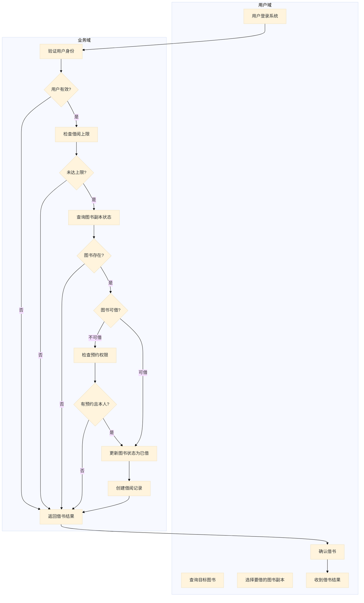
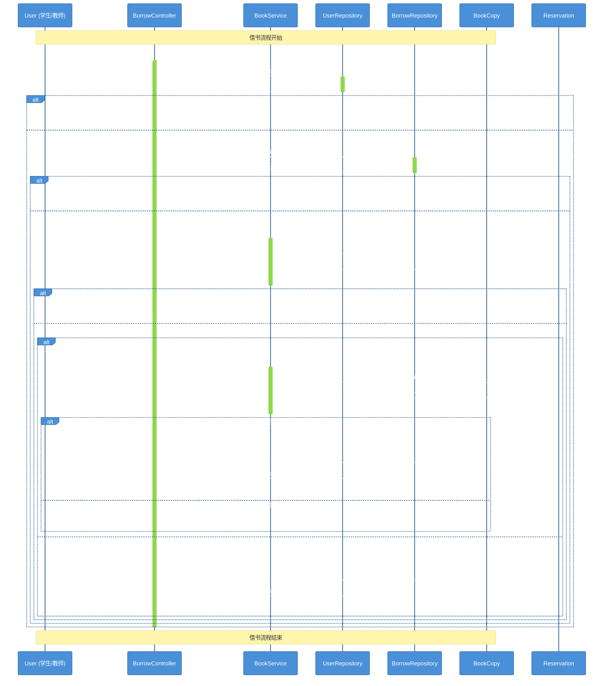
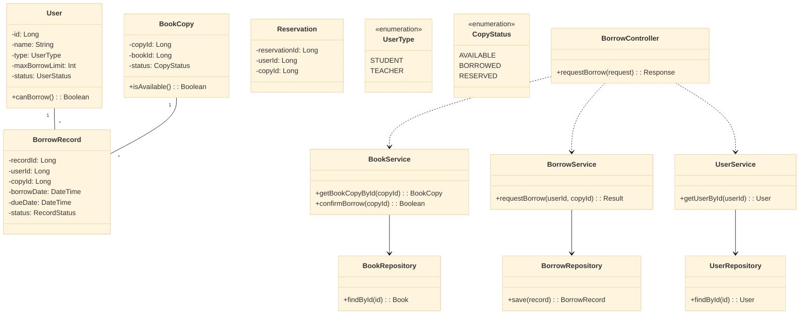
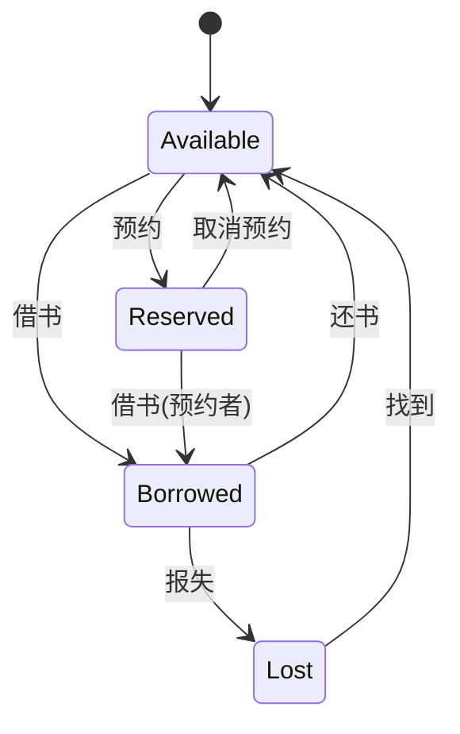

# 第4周：UML建模与OOA-OOD实践 - 完整上机指南

> **实验时间**：2学时（80分钟）
> **实验类型**：设计性
> **案例**：高校图书借阅系统
> **前置知识**：第4讲 - UML规范与图例、OOAD动态建模

---

## 一、实验目标

- [ ] 掌握用例图绘制方法
- [ ] 掌握活动图绘制方法（流程视角）
- [ ] 理解架构设计的重要性
- [ ] 掌握顺序图绘制方法（对象视角）
- [ ] 掌握类图的更新方法
- [ ] 掌握状态图绘制方法
- [ ] 理解OOA→OOD→OOP的转换过程

---

## 二、实验环境

- TRAE IDE（或 VS Code）
- Git
- Mermaid 插件（VS Code 扩展）

---

## 三、必读参考书目

> 以下参考书是本课程的重要参考资料，建议课后深入学习：

### UML建模

| 书名 | 大小 | 建议学习内容 |
|------|------|-------------|
| **UML 2基础、建模与设计实战** | 89.64MB | 第4-8章：UML基础、用例图、类图、顺序图、活动图、状态图 |

### 软件架构

| 书名 | 大小 | 建议学习内容 |
|------|------|-------------|
| **软件架构设计(带目录清晰版)** | 27.77MB | 第1-3章：架构设计背景知识；12-13章：领域建模，概念性架构设计，三层架构、MVC模式 |
| **软件工程：实践者的研究方法（第7版）** | 80.92MB | 第6-10章：需求分析、架构设计原则、模式设计 |

### 设计模式

| 书名 | 大小 | 建议学习内容 |
|------|------|-------------|
| **设计模式：可复用面向对象软件的基础** | 25.27MB | 第1-3章：设计原则、创建型模式、结构型模式 |
| **人月神话** | 2.54MB | 全书：软件项目管理、架构决策 |

### 计算机基础

| 书名 | 大小 | 建议学习内容 |
|------|------|-------------|
| **计算机基础入门** | 20.07MB | 第1-5章：计算机基础知识、面向对象基础 |

### 学习建议

```
┌─────────────────────────────────────────────────────────────────────────────┐
│                            学习路径建议                                      │
├─────────────────────────────────────────────────────────────────────────────┤
│                                                                             │
│  第一阶段：UML基础                                                          │
│  ───────────────────                                                       │
│  1. 先读《UML 2基础、建模与设计实战》第1-6章                              │
│  2. 掌握用例图、类图、顺序图、活动图、状态图的画法                         │
│  3. 结合本周上机练习，实践绘制各类UML图                                     │
│                                                                             │
│  第二阶段：架构设计                                                         │
│  ───────────────────                                                       │
│  1. 再读《软件架构设计》第1-3章                                            │
│  2. 理解三层架构、依赖倒置、单一职责等设计原则                             │
│  3. 结合实验中的Repository接口，理解"面向接口编程"                        │
│                                                                             │
│  第三阶段：设计模式                                                         │
│  ───────────────────                                                       │
│  1. 选读《设计模式》前3章                                                 │
│  2. 理解常见设计模式（Factory、Repository、Strategy等）                   │
│  3. 在后续课程中实践应用                                                   │
│                                                                             │
│  第四阶段：工程实践                                                         │
│  ───────────────────                                                       │
│  1. 选读《人月神话》                                                       │
│  2. 理解软件项目管理与团队协作                                             │
│                                                                             │
└─────────────────────────────────────────────────────────────────────────────┘
```

> 💡 **提示**：以上书籍可在课程资料文件夹中找到，建议先学习UML基础，再学习架构设计，最后学习设计模式。

---

## 四、核心方法论：正确 OOA→OOD 的细化顺序

```
┌─────────────────────────────────────────────────────────────────────────────────────┐
│                    OOA → OOD 正确细化顺序                                            │
├─────────────────────────────────────────────────────────────────────────────────────┤
│                                                                                     │
│   ┌─────────────┐     ┌─────────────┐     ┌─────────────┐     ┌─────────────┐      │
│   │   用例图    │ ──▶ │   活动图    │ ──▶ │  架构设计   │ ──▶ │   顺序图    │      │
│   └─────────────┘     └─────────────┘     └─────────────┘     └─────────────┘      │
│         │                   │                   │                   │             │
│         ▼                   ▼                   ▼                   ▼             │
│    "谁可以做什么"     "先做什么后做什么"    "分成哪几层"       "谁和谁交互"        │
│                                                                                     │
│   静态视图            流程视角              架构视角           对象视角             │
│                                                                                     │
└─────────────────────────────────────────────────────────────────────────────────────┘
```

### 为什么必须按这个顺序？

| 顺序 | 回答的问题 | 跳过会导致 |
|------|-----------|-----------|
| 用例图 | 谁可以借书？借书有哪些功能？ | 不知道系统有哪些功能 |
| 活动图 | 借书的完整流程是什么？ | 流程不清晰，顺序图会乱 |
| 架构设计 | 系统分成哪几层？ | 不知道类怎么组织 |
| 顺序图 | 对象之间如何交互？ | 对象凭感觉，职责不清晰 |

---

## 五、需求描述

```
参与者：学生、教师、图书管理员
用例：登录、查询图书、借书、还书、管理图书、预约图书、查看借阅历史、计算罚款

关系：
- 学生和教师可以登录、查询图书、借书、还书、预约图书、查看借阅历史
- 图书管理员可以登录、管理图书、查看所有借阅记录
- 借书和还书都包含查询图书（<<include>>）
- 还书包含计算罚款（<<include>>）
- 预约图书扩展借书（<<extend>>）

【补充规则】
罚款规则：逾期每天罚款0.1元，最高不超过图书原价
```

---

# 第一部分：用例图（10分钟）

---

## 步骤1：用例图

### 1.1 识别参与者

| 参与者 | 说明 |
|--------|------|
| 学生 | 借书、还书、查询、预约、查看历史 |
| 教师 | 借书、还书、查询、预约、查看历史 |
| 图书管理员 | 管理图书、查看所有借阅记录 |

### 1.2 识别用例

| 用例 | 说明 |
|------|------|
| 登录 | 用户身份验证 |
| 查询图书 | 搜索和查看图书信息 |
| 借书 | 借阅图书 |
| 还书 | 归还图书 |
| 预约图书 | 预约已被借出的图书 |
| 查看借阅历史 | 查看个人借阅记录 |
| 管理图书 | 图书管理员添加/修改/删除图书 |
| 查看所有借阅记录 | 管理员查看所有借阅情况 |
| 计算罚款 | 计算逾期罚款 |

### 1.3 用例图（Mermaid）

```mermaid
%%{init: {'theme': 'base', 'themeVariables': { 'primaryColor': '#4A90D9', 'primaryTextColor': '#fff', 'primaryBorderColor': '#2C5F8D'}}}%%
graph LR
    subgraph "参与者"
        Student("学生")
        Teacher("教师")
        Librarian("图书管理员")
    end

    subgraph "用例"
        Login("登录")
        QueryBook("查询图书")
        BorrowBook("借书")
        ReturnBook("还书")
        ManageBook("管理图书")
        ReserveBook("预约图书")
        ViewHistory("查看借阅历史")
        ViewAllRecords("查看所有借阅记录")
        CalculateFine("计算罚款")
    end

    Student --> Login & QueryBook & BorrowBook & ReturnBook & ReserveBook & ViewHistory
    Teacher --> Login & QueryBook & BorrowBook & ReturnBook & ReserveBook & ViewHistory
    Librarian --> Login & ManageBook & ViewAllRecords

    BorrowBook ..> QueryBook : <<include>>
    ReturnBook ..> QueryBook : <<include>>
    ReturnBook ..> CalculateFine : <<include>>
    ReserveBook -.-> BorrowBook : <<extend>>
```

### 1.4 用例图说明

| 关系类型 | 符号 | 说明 |
|---------|------|------|
| 关联 | `-->` | 参与者与用例之间的交互 |
| 包含 | `..>` | 用例之间的关系，表示必须执行 |
| 扩展 | `--->` | 用例之间的可选扩展关系 |

---

# 第二部分：活动图 - 流程视角（15分钟）

---

## 步骤2：活动图分析

### 2.1 为什么要先画活动图？

```
活动图回答的问题：
══════════════════════════════════════════════════════════════════════════

1. 借书这个"动作"包含哪些步骤？
   → 验证用户 → 检查上限 → 查询图书 → 检查状态 → 执行借阅 → 记录

2. 借书过程中有哪些分支判断？
   → 用户是否有效？是否已达上限？图书是否可借？是否有预约？

3. 活动图不关心"谁来做"，只关心"做什么"
   → 这是业务层面的分析，与技术实现无关

⚠️ 注意：此时不需要知道谁来验证用户，只需要知道"要验证用户"
```

### 2.2 借书流程活动图



### 练习：还书流程活动图

> 参考以上借书活动图，尝试绘制还书流程（课后选做）

---

# 第三部分：架构设计（10分钟）

---

## 步骤3：架构设计

### 3.1 为什么要做架构设计？

```
问题：有了活动图，为什么还要做架构设计？

答案：活动图只告诉我们"做什么"，不告诉我们"怎么做"

活动图说：
  "验证用户身份" → "检查借阅上限" → "查询图书" → "执行借书"

⚠️ 重要提示：
此时不需要纠结"数据库怎么连接"、"SQL怎么写"，只需要知道：
- 需要一个"数据存取"的接口（Repository）
- 需要一个"业务逻辑"的类（Service）
- 需要一个"处理请求"的类（Controller）

重点：职责划分，而不是具体实现！
```

### 3.2 三层架构设计

```
┌─────────────────────────────────────────────────────────────────────────────┐
│                        三层架构（Three-Tier Architecture）                   │
├─────────────────────────────────────────────────────────────────────────────┤
│                                                                             │
│   表现层 (Controller)    业务层 (Service)    数据层 (Repository)           │
│   ═════════════════     ══════════════     ══════════════                 │
│                                                                             │
│   ┌─────────────────┐    ┌─────────────────┐  ┌─────────────────┐        │
│   │ BorrowController │    │  BorrowService  │  │ UserRepository  │        │
│   │                  │    │                 │  │  (接口)         │        │
│   │ - requestBorrow │    │ - 借阅业务逻辑   │  │                 │        │
│   │ - 参数校验      │    │ - 检查借阅上限   │  │ - findById     │        │
│   │ - 返回响应      │    │ - 检查预约权限   │  │ - countBorrow   │        │
│   └─────────────────┘    └─────────────────┘  └─────────────────┘        │
│                                                                             │
└─────────────────────────────────────────────────────────────────────────────┘
```

### 3.3 架构设计原则

| 原则 | 说明 |
|------|------|
| 单一职责 (SRP) | 每个类只做一件事 |
| 依赖倒置 (DIP) | Service依赖Repository接口，不依赖具体实现 |
| 开闭原则 (OCP) | 对扩展开放，对修改关闭 |

---

# 第四部分：顺序图 - 对象视角（15分钟）

---

## 步骤4：顺序图

### 4.1 为什么现在才画顺序图？

```
前提条件：

✅ 活动图：已经知道完整的业务流程（先做什么后做什么）
✅ 架构设计：已经知道分层结构和类的大致划分

现在画顺序图：
- 流程是清晰的（活动图已明确）
- 对象是已知的（架构设计已划分）
- 职责是明确的（每个类只做一件事）

如果跳过前两步直接画顺序图：
❌ 流程不清楚，可能漏掉步骤
❌ 对象不明确，可能凭感觉添加
```

### 4.2 借书顺序图



### 4.3 顺序图核心要素

| 要素 | 说明 |
|------|------|
| 参与者 (Participant) | 交互中涉及的对象 |
| 消息 (Message) | 对象间的方法调用 |
| 激活条 (Activation) | 对象执行的时间段 |
| 条件分支 (Alt) | 基于条件的不同路径 |

### 练习：绘制"还书"顺序图

> 参考以上借书顺序图，尝试绘制还书流程（课后选做）

---

# 第五部分：类图更新（10分钟）

---

## 步骤5：类图更新

### 5.1 为什么要更新类图？

```
完成顺序图后，我们已经知道：
- 有哪些对象参与了交互
- 对象之间如何消息传递
- 有哪些条件分支

但类图还是之前那个版本，没有反映顺序图中的新发现！
```

### 5.2 类图更新三原则

```
原则1: 补充缺失的类
  顺序图中的每个参与者都应该对应一个类

原则2: 添加必要的方法
  顺序图中的每条消息都对应一个方法调用

原则3: 体现协作关系
  顺序图中的调用关系映射到类图的依赖关系
```

### 5.3 完整类图



---

# 第六部分：状态图（5分钟）

---

## 步骤6：状态图

### 6.1 为什么要用状态图？

| 类图的问题 | 状态图的回答 |
|-----------|-------------|
| 类图只有属性 `available: bool` | 状态图告诉你在什么情况下这个布尔值会变 |
| 不知道什么时候可以借 | 状态图告诉你：可借 → 已借出（借书事件） |

### 6.2 图书副本状态图



### 练习：绘制借阅记录状态图

> 参考以上BookCopy状态图，尝试绘制BorrowRecord状态图（课后选做）

---

# 第七部分：综合练习与评分标准（30分钟）

---

## 练习任务（必做）

### 任务1：完善用例图（3分钟）

在给定的用例图基础上，添加：
- 管理员可以"管理用户"（添加/冻结/解冻用户）

### 任务2：绘制借书活动图（参考示例）

绘制完整的借书活动图，包含：
- 用户登录 → 查询图书 → 选择副本 → 验证用户 → 检查上限 → 检查状态 → 执行借书 → 返回结果

### 任务3：绘制还书活动图（5分钟）

绘制"还书"活动图：
- 提交还书请求 → 验证借阅记录 → **计算罚款** → 更新图书状态 → 记录还书 → 返回结果

> 💡 注意：还书流程需要包含"计算罚款"逻辑（逾期每天0.1元，最高不超过图书原价）

### 任务4：绘制还书顺序图（8分钟）

基于还书活动图，绘制完整的还书顺序图，需要包含：
- ReturnController 处理请求
- FineService 计算罚款
- BookService 更新图书状态
- BorrowRepository 创建还书记录

```
主要消息流：
User → RC: requestReturn(userId, copyId)
RC → UR: getUserById(userId)
RC → BR: getBorrowRecord(copyId)
RC → FS: calculateFine(recordId)  // 计算罚款
FS → BR: getBorrowDate()
FS -->> RC: fineAmount
RC → BS: updateStatus(copyId, Available)
RC → BR: createReturnRecord()
RC -->> User: 返回结果
```

### 任务5：更新类图（7分钟）

根据还书顺序图，补充类图中的方法：

```
ReturnController:
  - requestReturn(userId, copyId): Result

FineService:
  - calculateFine(recordId): BigDecimal
  - isOverdue(borrowDate, returnDate): Boolean

BorrowRepository:
  - findByCopyId(copyId): BorrowRecord
  - createReturnRecord(record): BorrowRecord

BookService:
  - updateStatus(copyId, status): Boolean
```

### 任务6：绘制状态图（4分钟）

绘制 BorrowRecord（借阅记录）的状态图：
- 状态：借阅中(BORROWING)、已归还(RETURNED)、已逾期(OVERDUE)
- 事件：借书、还书、超期

---

### 课后拓展任务（选做）

1. **预约图书活动图**：绘制完整的预约流程
2. **预约图书顺序图**：补充完整的预约顺序图

---

## 评分标准

| 检查项 | 分值 | 要求 |
|--------|------|------|
| 用例图 | 10分 | 参与者正确、用例完整、关系准确 |
| 借书活动图 | 10分 | 流程完整、分支清晰 |
| 还书活动图 | 15分 | 包含计算罚款逻辑、流程完整 |
| 还书顺序图 | 15分 | 对象清晰、消息完整、包含罚款计算 |
| 类图更新 | 15分 | 方法完整、关系正确、层次分明 |
| 状态图 | 10分 | 状态准确、转换合理 |
| 架构设计 | 10分 | 三层架构清晰、职责划分合理 |
| Git提交 | 5分 | 按时提交、文件完整 |
| 设计说明 | 10分 | 能解释设计决策的理由 |

> 💡 **总分100分**，其中借书部分参考示例，还书部分为评分重点

---

### 提交要求

1. 将所有Mermaid图保存为 `.md` 文件
2. 提交到Git仓库
3. 包含简要的设计说明（200字以内）

---

# 第八部分：OOP实现（选做内容，不计入成绩）

> 以下内容供学有余力的同学课后完成，使用Java、Python或Rust实现

---

## 代码实现任务

### 要求

1. 基于上述UML图，实现完整的借书和还书功能
2. 使用三层架构：Controller → Service → Repository
3. 使用依赖注入实现接口编程

### Python实现参考

```python
from dataclasses import dataclass
from datetime import datetime, date
from enum import Enum
from typing import Optional
from abc import ABC, abstractmethod

class UserType(Enum):
    STUDENT = "学生"
    TEACHER = "教师"

class CopyStatus(Enum):
    AVAILABLE = "可借"
    BORROWED = "已借出"
    RESERVED = "已预约"
    LOST = "遗失"

class RecordStatus(Enum):
    BORROWING = "借阅中"
    RETURNED = "已归还"
    OVERDUE = "已逾期"

@dataclass
class User:
    id: int
    name: str
    user_type: UserType
    max_borrow_limit: int
    status: str = "active"

    def can_borrow(self) -> bool:
        return self.status == "active"

@dataclass
class BookCopy:
    copy_id: int
    book_id: int
    status: CopyStatus

    def is_available(self) -> bool:
        return self.status == CopyStatus.AVAILABLE

@dataclass
class BorrowRecord:
    record_id: int
    user_id: int
    copy_id: int
    borrow_date: date
    due_date: date
    return_date: Optional[date] = None
    status: RecordStatus = RecordStatus.BORROWING

    def is_overdue(self) -> bool:
        if self.return_date:
            return False
        return date.today() > self.due_date

# 仓储接口（依赖倒置）
class UserRepository(ABC):
    @abstractmethod
    def find_by_id(self, user_id: int) -> Optional[User]:
        pass

class BookRepository(ABC):
    @abstractmethod
    def find_copy_by_id(self, copy_id: int) -> Optional[BookCopy]:
        pass

class BorrowRepository(ABC):
    @abstractmethod
    def find_by_copy_id(self, copy_id: int) -> Optional[BorrowRecord]:
        pass
    @abstractmethod
    def save(self, record: BorrowRecord) -> BorrowRecord:
        pass

# 服务层
class FineService:
    FINE_PER_DAY = 0.1  # 每天罚款0.1元

    def calculate_fine(self, record: BorrowRecord) -> float:
        if not record.is_overdue():
            return 0.0
        overdue_days = (date.today() - record.due_date).days
        return min(overdue_days * self.FINE_PER_DAY, 100.0)  # 最高100元

class ReturnService:
    def __init__(
        self,
        user_repo: UserRepository,
        book_repo: BookRepository,
        borrow_repo: BorrowRepository,
        fine_service: FineService
    ):
        self.user_repo = user_repo
        self.book_repo = book_repo
        self.borrow_repo = borrow_repo
        self.fine_service = fine_service

    def request_return(self, user_id: int, copy_id: int) -> dict:
        # 1. 验证用户
        user = self.user_repo.find_by_id(user_id)
        if not user:
            return {"success": False, "message": "用户不存在"}

        # 2. 查询借阅记录
        record = self.borrow_repo.find_by_copy_id(copy_id)
        if not record:
            return {"success": False, "message": "借阅记录不存在"}

        # 3. 计算罚款
        fine = self.fine_service.calculate_fine(record)

        # 4. 更新图书状态
        self.book_repo.find_copy_by_id(copy_id).status = CopyStatus.AVAILABLE

        # 5. 创建还书记录
        record.status = RecordStatus.RETURNED
        record.return_date = date.today()
        self.borrow_repo.save(record)

        return {
            "success": True,
            "message": "还书成功",
            "fine": fine
        }

# 控制层
class ReturnController:
    def __init__(self, return_service: ReturnService):
        self.return_service = return_service

    def handle_request(self, request):
        user_id = request.get("userId")
        copy_id = request.get("copyId")
        result = self.return_service.request_return(user_id, copy_id)
        return result
```

### Java实现参考

```java
// 实体类
public class BorrowRecord {
    private int recordId;
    private int userId;
    private int copyId;
    private LocalDate borrowDate;
    private LocalDate dueDate;
    private LocalDate returnDate;
    private RecordStatus status;
    
    public boolean isOverdue() {
        if (returnDate != null) return false;
        return LocalDate.now().isAfter(dueDate);
    }
}

// 服务层
@Service
public class FineService {
    private static final double FINE_PER_DAY = 0.1;
    private static final double MAX_FINE = 100.0;
    
    public double calculateFine(BorrowRecord record) {
        if (!record.isOverdue()) return 0.0;
        long overdueDays = ChronoUnit.DAYS.between(record.getDueDate(), LocalDate.now());
        return Math.min(overdueDays * FINE_PER_DAY, MAX_FINE);
    }
}

@Service
public class ReturnService {
    @Autowired
    private UserRepository userRepository;
    @Autowired
    private BookRepository bookRepository;
    @Autowired
    private BorrowRepository borrowRepository;
    @Autowired
    private FineService fineService;
    
    public ReturnResult requestReturn(int userId, int copyId) {
        // 实现还书逻辑
    }
}

// 控制层
@RestController
public class ReturnController {
    @Autowired
    private ReturnService returnService;
    
    @PostMapping("/return")
    public ReturnResult handleReturn(@RequestBody ReturnRequest request) {
        return returnService.requestReturn(
            request.getUserId(), 
            request.getCopyId()
        );
    }
}
```

---

### Rust实现参考

```rust
use std::collections::HashMap;

// 实体
#[derive(Debug, Clone)]
pub struct BorrowRecord {
    pub record_id: i32,
    pub user_id: i32,
    pub copy_id: i32,
    pub borrow_date: String,
    pub due_date: String,
    pub return_date: Option<String>,
    pub status: RecordStatus,
}

#[derive(Debug, Clone)]
pub enum RecordStatus {
    Borrowing,
    Returned,
    Overdue,
}

// 仓储接口（trait）
pub trait UserRepository {
    fn find_by_id(&self, user_id: i32) -> Option<User>;
}

pub trait BookRepository {
    fn find_copy_by_id(&self, copy_id: i32) -> Option<BookCopy>;
}

pub trait BorrowRepository {
    fn find_by_copy_id(&self, copy_id: i32) -> Option<BorrowRecord>;
    fn save(&mut self, record: BorrowRecord) -> BorrowRecord;
}

// 服务层
pub struct FineService;

impl FineService {
    const FINE_PER_DAY: f64 = 0.1;
    const MAX_FINE: f64 = 100.0;

    pub fn calculate_fine(&self, record: &BorrowRecord) -> f64 {
        // 计算罚款逻辑
        0.0
    }
}

pub struct ReturnService<U: UserRepository, B: BookRepository, Br: BorrowRepository> {
    user_repo: U,
    book_repo: B,
    borrow_repo: Br,
    fine_service: FineService,
}

impl<U: UserRepository, B: BookRepository, Br: BorrowRepository> ReturnService<U, B, Br> {
    pub fn request_return(&self, user_id: i32, copy_id: i32) -> Result<ReturnResult, String> {
        // 实现还书逻辑
        Ok(ReturnResult { success: true, fine: 0.0 })
    }
}
```
    STUDENT = "学生"
    TEACHER = "教师"

class CopyStatus(Enum):
    AVAILABLE = "可借"
    BORROWED = "已借出"
    RESERVED = "已预约"
    LOST = "遗失"

class RecordStatus(Enum):
    BORROWING = "借阅中"
    RETURNED = "已归还"
    OVERDUE = "已逾期"

@dataclass
class User:
    id: int
    name: str
    user_type: UserType
    max_borrow_limit: int
    status: str = "active"
    _current_borrow_count: int = 0

    def can_borrow(self) -> bool:
        return self.status == "active" and self._current_borrow_count < self.max_borrow_limit

@dataclass
class BookCopy:
    copy_id: int
    book_id: int
    status: CopyStatus
    location: str

    def is_available(self) -> bool:
        return self.status == CopyStatus.AVAILABLE
```

### 服务层实现

```python
from abc import ABC, abstractmethod

class UserRepository(ABC):
    @abstractmethod
    def find_by_id(self, user_id: int) -> Optional[User]:
        pass

class BorrowService:
    def __init__(
        self,
        user_repo: UserRepository,
        book_copy_repo: BookCopyRepository,
        borrow_record_repo: BorrowRecordRepository
    ):
        self.user_repo = user_repo
        self.book_copy_repo = book_copy_repo
        self.borrow_record_repo = borrow_record_repo

    def request_borrow(self, user_id: int, copy_id: int) -> dict:
        # 1. 验证用户
        user = self.user_repo.find_by_id(user_id)
        if not user or not user.can_borrow():
            return {"success": False, "message": "用户无效或已冻结"}

        # 2. 检查借阅数量
        # 3. 检查图书状态
        # 4. 执行借阅
        # ... (详见顺序图)
```

### 依赖注入示例

```python
# 使用接口（松耦合，可测试）
class BorrowService:
    def __init__(self, user_repo: UserRepository, book_repo: BookRepository):
        # 依赖抽象接口，不依赖具体实现
        self.user_repo = user_repo
        self.book_repo = book_repo

    def borrow(self, user_id, book_id):
        # 通过接口调用
        user = self.user_repo.find_by_id(user_id)
        ...

# 定义接口（抽象）
class UserRepository(ABC):
    @abstractmethod
    def find_by_id(self, user_id: int) -> Optional[User]:
        pass

# 具体实现：MySQL
class MySQLUserRepository(UserRepository):
    def find_by_id(self, user_id: int) -> Optional[User]:
        # 连接MySQL查询
        ...

# 具体实现：内存（测试用）
class InMemoryUserRepository(UserRepository):
    def find_by_id(self, user_id: int) -> Optional[User]:
        # 从内存字典获取
        return self.users.get(user_id)
```

---

# 【选读】第九部分：AI提示词详解

> 本部分为选读内容，供学生了解如何向AI工具提问生成各类UML图。

## 9.1 生成用例图的AI提示词

```
请为"高校图书借阅系统"生成用例图，使用Mermaid语法。

参与者：学生、教师、图书管理员
用例：登录、查询图书、借书、还书、管理图书、预约图书、查看借阅历史、计算罚款

关系：
- 学生和教师可以登录、查询图书、借书、还书、预约图书、查看借阅历史
- 图书管理员可以登录、管理图书、查看所有借阅记录
- 借书和还书都包含查询图书（<<include>>）
- 还书包含计算罚款（<<include>>）
- 预约图书扩展借书（<<extend>>）
```

## 9.2 生成顺序图的AI提示词

```
基于活动图和架构设计，生成借书过程的顺序图。

前置信息：
1. 活动图已明确借书流程：验证用户→检查上限→查询图书→检查状态→执行借书→返回结果
2. 架构采用三层架构：Controller → Service → Repository
3. 已识别的对象：BorrowController, BookService, UserService, UserRepository, BorrowRepository, BookCopy, Reservation

请生成顺序图，体现：
- 分层调用：Controller → Service → Repository
- 消息传递：方法调用和返回
- 条件分支：用户有效性、借阅上限、图书状态、预约权限的判断
- 激活周期：对象执行的时间段
```

## 9.3 生成类图的AI提示词

```
基于以下信息生成类图：

1. 实体类：User, Book, BookCopy, BorrowRecord, Reservation
2. 服务类：BorrowService, BookService, UserService
3. 仓储接口：UserRepository, BookCopyRepository, BorrowRecordRepository
4. 控制器类：BorrowController

要求：
- 体现分层架构：Controller → Service → Repository
- 依赖倒置：Service依赖Repository接口
- 泛化关系：学生/教师继承User
```

---

# 【选读】第十部分：设计决策解释

> 本部分为选读内容，帮助理解为什么需要这样设计。

## 10.1 为什么需要 BookCopy 而不是直接用 Book？

```
问题：一本《Python编程》可以有 5 本副本（复本）
- 副本1: 已在借
- 副本2: 可借
- 副本3: 已预约
- 副本4: 正在维修
- 副本5: 可借

答案：如果只用一个 Book 对象，无法精确管理每本书的状态！
BookCopy（副本）代表具体的物理书籍，是借阅的最小单位。
```

## 10.2 为什么要用 Repository 接口？

```python
# 不使用接口（紧耦合）
class BorrowService:
    def __init__(self):
        self.db = MySQLDatabase()  # 直接依赖具体数据库

# 使用接口（松耦合，可测试）
class BorrowService:
    def __init__(self, user_repo: UserRepository):  # 依赖抽象
        self.user_repo = user_repo
```

**好处**：
- 便于单元测试（可以用 Mock 对象替代）
- 可替换数据库实现（从 MySQL 改为 PostgreSQL 不影响业务代码）
- 符合依赖倒置原则

## 10.3 为什么要分层？

```
Controller: 职责是处理请求/响应
Service:    职责是业务逻辑
Repository: 职责是数据访问

各层各司其职，符合单一职责原则
便于分工协作和独立测试
```

---

# 【选读】第十一部分：Mermaid 语法避坑指南

```
常见错误：

1. 顺序图消息符号混用
   ❌ 错误: User -> System: 消息
   ✅ 正确: User->>System: 消息  (同步调用)
       User-->>System: 消息 (返回)

2. 包含/扩展关系符号
   ❌ 错误: BorrowBook > QueryBook : <<include>>
   ✅ 正确: BorrowBook ..> QueryBook : <<include>>

3. 激活条语法
   ❌ 错误: activate BC (单独一行)
   ✅ 正确: activate BC (在同一消息后面)

4. 类图继承关系
   ❌ 错误: Student extends User
   ✅ 正确: User <|-- Student

💡 建议：先用纸笔画草图，确认逻辑正确后再录入 Mermaid
```

---

# 思考题

1. **为什么必须按用例图→活动图→架构设计→顺序图的顺序？**

2. **活动图和顺序图的区别是什么？**

3. **为什么要用 Repository 接口？**

---

*实验完成日期*: ____________

*得分*: ____________
