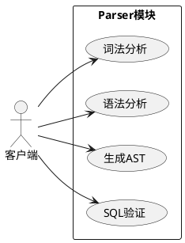
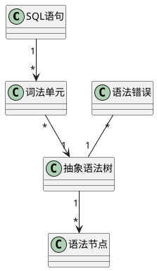
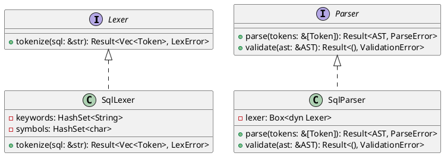

# 第6周：核心模块设计实践

## 课程大纲

1. **核心模块设计概述**（15分钟）
2. **手工OOA-OOD设计方法**（30分钟）
3. **AI辅助设计方法**（30分钟）
4. **实验步骤详解**（30分钟）
5. **案例分析与实践**（20分钟）

---

# Part 1: 核心模块设计概述

---

## 1.1 What：核心模块设计是什么？

### 核心模块定义

**SQLRustGo的4个核心模块**：

| 模块 | 主要职责 | 输入 | 输出 |
|------|----------|------|------|
| **Parser** | SQL解析、语法检查 | SQL字符串 | AST（抽象语法树） |
| **Optimizer** | 查询优化、成本估算 | 逻辑执行计划 | 物理执行计划 |
| **Executor** | 执行查询、管理算子 | 物理执行计划 | 查询结果 |
| **Storage** | 数据存储、事务处理 | 读写请求 | 数据或操作结果 |

---

## 1.2 Why：为什么要进行核心模块设计？

### 设计的重要性

1. **复杂性管理**：将复杂的数据库系统分解为可管理的模块
2. **团队协作**：明确模块边界，便于多人并行开发
3. **可维护性**：清晰的设计便于后续维护和扩展
4. **可测试性**：模块化设计便于单元测试和集成测试
5. **性能优化**：合理的模块设计有助于性能调优

---

## 1.3 How：核心模块设计的方法

### 设计流程

1. **OOA（面向对象分析）**：理解问题域，识别对象和关系
2. **OOD（面向对象设计）**：定义软件对象、接口和协作
3. **OOP（面向对象编程）**：用Rust实现设计

### 设计工具

- **UML**：统一建模语言，用于可视化设计
- **PlantUML**：文本化UML工具，便于版本控制
- **AI工具**：辅助生成设计和代码

---

# Part 2: 手工OOA-OOD设计方法

---

## 2.1 What：手工OOA-OOD设计的步骤

### 设计步骤

1. **需求分析**：理解模块的功能需求
2. **用例分析**：绘制用例图，明确功能边界
3. **概念建模**：绘制概念类图，识别对象和关系
4. **行为建模**：绘制活动图、顺序图、状态图
5. **架构设计**：绘制组件图，定义模块边界
6. **详细设计**：绘制设计类图，定义接口和实现

---

## 2.2 Why：手工设计的价值

### 手工设计的优势

1. **深入理解**：迫使设计者深入理解问题域
2. **灵活性**：可以根据具体需求调整设计
3. **可控性**：完全掌握设计的每一个细节
4. **基础能力**：培养基本的设计能力
5. **验证工具**：验证AI生成设计的正确性

---

## 2.3 How：手工设计Parser模块示例

### 步骤1：用例分析

**Parser模块用例图**：



### 步骤2：概念建模

**Parser模块概念类图**：



### 步骤3：行为建模

**Parser模块活动图**：

```plantuml
@startuml
start
:接收SQL语句;
:词法分析生成Token流;
diamond "语法正确?"
  -> 是: 继续
  -> 否: 生成语法错误
:语法分析构建AST;
diamond "语义正确?"
  -> 是: 输出AST
  -> 否: 生成语义错误
stop
@enduml
```

### 步骤4：详细设计

**Parser模块设计类图**：



---

# Part 3: AI辅助设计方法

---

## 3.1 What：AI辅助设计的流程

### AI辅助设计步骤

1. **需求描述**：清晰描述模块的功能需求
2. **提示词设计**：设计有效的AI提示词
3. **AI生成**：让AI生成UML图和设计文档
4. **人工审查**：审查和调整AI生成的设计
5. **迭代优化**：通过多次交互优化设计

---

## 3.2 Why：AI辅助设计的优势

### AI辅助的好处

1. **速度快**：快速生成设计初稿
2. **创意多**：提供多种设计思路
3. **减少错误**：避免常见的设计错误
4. **学习工具**：作为学习设计的参考
5. **提高效率**：节省设计时间，专注于核心问题

---

## 3.3 How：AI辅助设计的实践

### 提示词设计原则

1. **明确目标**：清楚说明要生成的内容
2. **提供上下文**：给出模块的职责和需求
3. **指定格式**：要求输出PlantUML代码
4. **设置约束**：说明设计约束和要求
5. **示例引导**：提供示例格式

### 生成Parser模块设计类图的提示词

```
请为SQLRustGo的Parser模块生成设计类图，使用PlantUML语法。

包含以下类和接口：
- Lexer接口：tokenize方法
- Parser接口：parse和validate方法
- SqlLexer类：实现Lexer接口
- SqlParser类：实现Parser接口
- Token类：包含token_type、value、position字段
- AST类：包含root和statements字段
- 各种错误类

显示类的属性、方法和关系。
```

### 生成Optimizer模块顺序图的提示词

```
请为SQLRustGo的Optimizer模块生成顺序图，使用PlantUML语法。

参与者：Planner、Optimizer、LogicalOptimizer、PhysicalOptimizer

流程：
1. Planner调用Optimizer的optimize方法
2. Optimizer调用LogicalOptimizer进行逻辑优化
3. LogicalOptimizer返回优化后的逻辑计划
4. Optimizer调用PhysicalOptimizer进行物理优化
5. PhysicalOptimizer返回物理执行计划
6. Optimizer返回物理执行计划给Planner

使用alt片段处理异常情况。
```

---

# Part 4: 实验步骤详解

---

## 4.1 What：实验任务分解

### 实验任务

1. **Parser模块设计**：30分钟
2. **Optimizer模块设计**：30分钟
3. **Executor模块设计**：30分钟
4. **Storage模块设计**：30分钟
5. **测试计划设计**：20分钟
6. **Git提交**：15分钟

---

## 4.2 Why：实验步骤的逻辑

### 设计顺序的合理性

1. **从外到内**：Parser → Optimizer → Executor → Storage
2. **依赖关系**：Storage被Executor依赖，Executor被Optimizer依赖，Optimizer被Parser依赖
3. **复杂度递增**：从简单的解析到复杂的存储
4. **逻辑连贯性**：从SQL解析到数据存储的完整流程

---

## 4.3 How：实验步骤详解

### 步骤1：Parser模块设计

1. **OOA分析**：
   - 绘制用例图
   - 绘制概念类图
   - 绘制活动图

2. **OOD设计**：
   - 绘制设计类图
   - 绘制顺序图
   - 绘制状态图
   - 绘制组件图

3. **详细设计文档**：
   - 创建 `docs/design/parser_module_design.md`
   - 编写模块概述、核心功能、类与接口设计等

### 步骤2：Optimizer模块设计

1. **OOA分析**：
   - 绘制用例图
   - 绘制概念类图
   - 绘制活动图

2. **OOD设计**：
   - 绘制设计类图
   - 绘制顺序图
   - 绘制状态图
   - 绘制组件图

3. **详细设计文档**：
   - 创建 `docs/design/optimizer_module_design.md`
   - 编写模块概述、核心功能、类与接口设计等

### 步骤3：Executor模块设计

1. **OOA分析**：
   - 绘制用例图
   - 绘制概念类图
   - 绘制活动图

2. **OOD设计**：
   - 绘制设计类图
   - 绘制顺序图
   - 绘制状态图
   - 绘制组件图

3. **详细设计文档**：
   - 创建 `docs/design/executor_module_design.md`
   - 编写模块概述、核心功能、类与接口设计等

### 步骤4：Storage模块设计

1. **OOA分析**：
   - 绘制用例图
   - 绘制概念类图
   - 绘制活动图

2. **OOD设计**：
   - 绘制设计类图
   - 绘制顺序图
   - 绘制状态图
   - 绘制组件图

3. **详细设计文档**：
   - 创建 `docs/design/storage_module_design.md`
   - 编写模块概述、核心功能、类与接口设计等

### 步骤5：测试计划设计

1. **测试目标**：定义测试的目标和范围
2. **测试策略**：制定测试策略和方法
3. **测试用例**：设计具体的测试用例
4. **测试环境**：说明测试环境和工具

### 步骤6：Git提交

1. **创建分支**：`git checkout -b docs/module-design-week6`
2. **添加文件**：`git add docs/design/*`
3. **提交**：`git commit -m "docs: add module design for week 6"`
4. **推送**：`git push origin docs/module-design-week6`

---

# Part 5: 案例分析与实践

---

## 5.1 What：案例分析

### 案例：Parser模块设计

**需求**：
- 支持基本SQL查询（SELECT、INSERT、UPDATE、DELETE）
- 生成抽象语法树（AST）
- 进行语法和语义验证

**设计决策**：
- 使用词法分析器和语法分析器分离的设计
- 采用接口+实现的模式，便于扩展
- 错误处理使用Result类型

---

## 5.2 Why：案例的价值

### 案例的意义

1. **示范作用**：展示完整的设计流程
2. **学习参考**：作为其他模块设计的参考
3. **验证方法**：验证设计方法的有效性
4. **问题发现**：发现设计中可能的问题
5. **优化思路**：提供优化的方向

---

## 5.3 How：实践建议

### 实践技巧

1. **从简单开始**：先设计简单的模块，再设计复杂的模块
2. **迭代设计**：通过多次迭代优化设计
3. **对比分析**：对比手工设计和AI生成的设计
4. **团队协作**：与同学讨论设计方案
5. **参考资料**：参考成熟数据库系统的设计

### 常见问题及解决方法

| 问题 | 原因 | 解决方法 |
|------|------|----------|
| 设计过于复杂 | 追求完美，忽视核心功能 | 回到核心需求，删除不必要的设计 |
| 接口设计不合理 | 对模块职责理解不够 | 重新分析模块职责，设计合理接口 |
| 依赖关系混乱 | 缺乏清晰的依赖方向 | 定义清晰的依赖方向，确保单向依赖 |
| 性能考虑不足 | 专注于功能设计，忽视性能 | 在设计阶段就考虑性能因素 |
| AI生成设计不合理 | 提示词不够清晰 | 优化提示词，提供更多上下文 |

---

# 核心知识点总结

## 1. 核心模块设计

- **What**：设计SQLRustGo的4个核心模块（Parser、Optimizer、Executor、Storage）
- **Why**：管理复杂性、便于团队协作、提高可维护性
- **How**：使用OOA-OOD方法，结合UML和AI辅助

## 2. 手工OOA-OOD设计

- **What**：通过需求分析、用例分析、概念建模、行为建模、架构设计、详细设计等步骤完成设计
- **Why**：深入理解问题域，培养设计能力，验证AI生成设计的正确性
- **How**：使用PlantUML绘制各种UML图，编写详细设计文档

## 3. AI辅助设计

- **What**：使用AI工具辅助生成UML图和设计文档
- **Why**：提高设计速度，提供创意，减少错误，节省时间
- **How**：设计有效的提示词，审查和调整AI生成的设计，迭代优化

## 4. 实验步骤

- **What**：按照Parser → Optimizer → Executor → Storage的顺序完成设计
- **Why**：遵循依赖关系，从简单到复杂，保持逻辑连贯性
- **How**：每个模块都要完成OOA分析、OOD设计、详细设计文档，最后制定测试计划并进行Git提交

## 5. 实践建议

- **从简单开始**：先设计简单的模块
- **迭代设计**：通过多次迭代优化设计
- **对比分析**：对比手工设计和AI生成的设计
- **团队协作**：与同学讨论设计方案
- **参考资料**：参考成熟数据库系统的设计

---

# 总结

通过本实验，你将掌握数据库系统核心模块的设计方法，学会使用UML进行面向对象分析与设计，能够为每个核心模块生成完整的UML图和设计文档，理解模块间的依赖关系和接口设计，掌握测试计划的制定方法。

记住：设计是一个迭代的过程，没有完美的设计，只有不断优化的设计。通过手工设计和AI辅助相结合的方式，你可以更快、更好地完成核心模块的设计，为SQLRustGo的开发奠定坚实的基础。