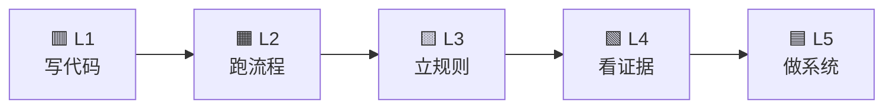
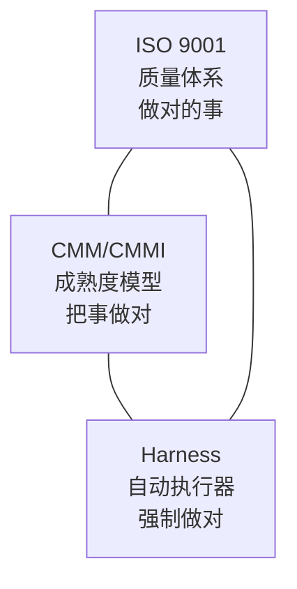
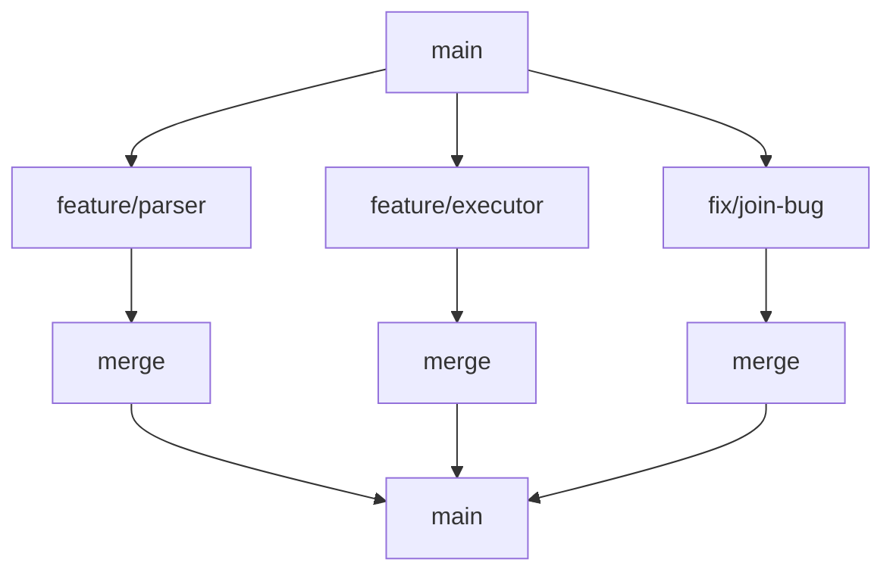
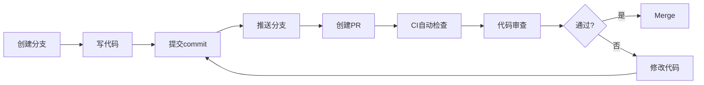
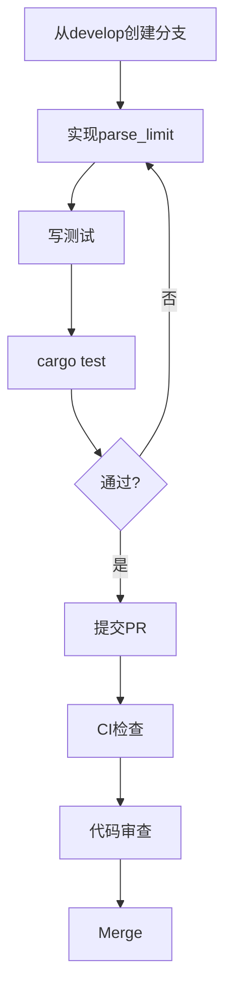
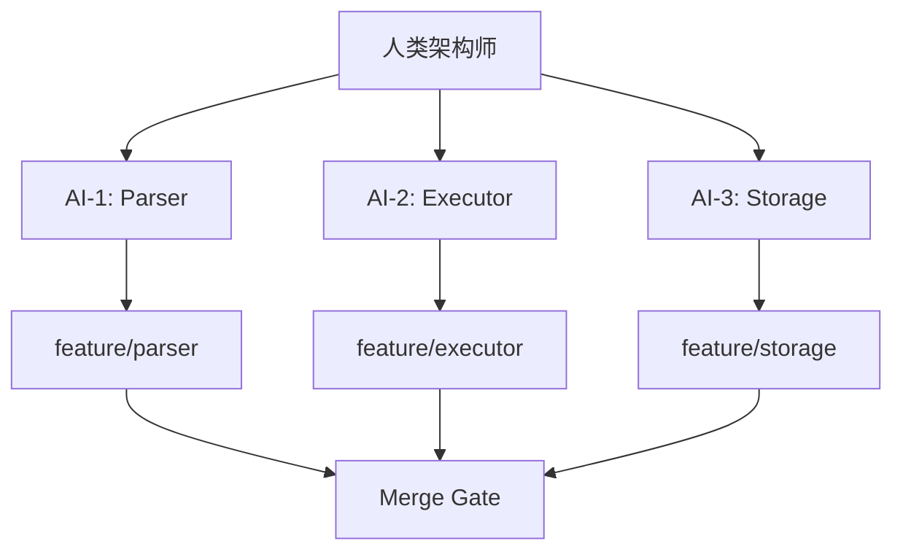

# AI-Native Software Engineering — Week 9–16 教学大纲与 Week 9 完整讲义

> **版本**: 2.0
> **创建日期**: 2026-04-24
> **课程定位**: 下一代软件工程课（AI-native Software Engineering）
> **实战项目**: SQLRustGo
> **核心主线**: 从"写代码" → 到"可协作" → 到"可治理" → 到"可证明"
> **统一公式**: AI-Native SE = ISO9001 + CMM + Harness + Proof

---

# 第一部分：Week 9–16 总体大纲

## 核心主线（必须反复强调给学生）

```
先让学生会用（工程）
→ 再让学生会控（治理）
→ 再让学生会管 AI（GBrain）
→ 最后让系统"可证明"（Proof）
```

## Week 9–16 总体结构

| 周 | 阶段 | 核心主题 | 学生获得能力 |
|-----|------|----------|-------------|
| Week 9 | 工程入门 | PR + Git + 基础 CI | 能提交 PR + 跑 CI |
| Week 10 | 自动化质量 | CI/CD + 覆盖率 + 质量门禁 | 知道"代码必须被验证" |
| Week 11 | Harness | Anti-Cheat CI | 防 AI 作弊 |
| Week 12 | Context | LLM-Wiki | AI 不乱写 |
| Week 13 | Orchestration | GBrain | 多 AI 不打架 |
| Week 14 | Proof 基础 | Proof-Carrying Code | 代码必须带证据 |
| Week 15 | 数据库验证 | Relational Algebra Proof | SQL 正确性可验证 |
| Week 16 | 工业体系 | 全链路系统整合 | 达到"可信系统" |

## 知识依赖关系

```
Week 9: Git + PR
    ↓
Week 10: CI/CD
    ↓
Week 11: Harness (Anti-Cheat CI)
    ↓
Week 12: LLM-Wiki
    ↓
Week 13: GBrain
    ↓
Week 14: Proof-Carrying Code
    ↓
Week 15: DB语义验证 (Relational Algebra)
    ↓
Week 16: 工业体系整合
```

> 👉 这张图建议每节课都放一遍，学生会逐渐建立全局认知。

## 教学原则

**正确节奏**：Git → CI → Harness → AI → Proof → DB

**关键教学转折**：

```
Chaos（多AI混乱）
→ Control（GBrain治理）
→ Trust（Proof证明）
```

**避免翻车**：
- ❌ 一上来讲 LLM-Wiki → 学生懵
- ❌ 直接讲 Proof → 学生跟不上
- ❌ 忽略 Git / CI 基础
- ✅ Git → CI → Harness → AI → Proof → DB

---

## ISO/9000 + CMM 质量体系映射

### 核心等式

```
Harness Engineering = AI时代的软件质量管理体系（ISO/9000）的自动化实现
```

### ISO 9001 × CMM × Harness 三位一体

| 体系 | 关注点 | 本质 |
|------|--------|------|
| ISO 9001 | 质量是否可控 | 有没有规范 |
| CMM/CMMI | 过程是否成熟 | 做得稳不稳定 |
| Harness | 是否被强制执行 | 能不能作弊 |

### CMM Level → 课程周次映射

| Level | ISO | CMM | Harness | 学生能力 | 课程周次 |
|-------|-----|-----|---------|----------|----------|
| 🟥 L1 | ❌ 无体系 | Initial | ❌ 无 | 写代码但不确定对不对 | 前8周 |
| 🟧 L2 | 有流程 | Repeatable | 基础 CI | 会用 Git + CI | Week 9-10 |
| 🟨 L3 | 标准化 | Defined | CI + 规则 | 能用规则约束 AI | Week 11-12 |
| 🟩 L4 | 可审计 | Managed | Proof | 能用证据证明正确 | Week 14 |
| 🟦 L5 | 持续改进 | Optimizing | GBrain + 自动化 | 能设计可信系统 | Week 13+15+16 |

### 传统 QA vs AI 时代 QA

```
传统企业：QA = 人 + 流程 + 文档
AI 时代：QA = CI + Harness + Proof
```

### 质量保证层级对比

| 层级 | 传统 ISO | 本课程系统 |
|------|----------|------------|
| 基础 | 测试报告 | cargo test |
| 增强 | 审计记录 | CI logs |
| 高级 | 质量证明 | verification_report |
| 顶级 | ❌ 无 | Relational Algebra Proof |

---

## 关键教学突破点

```
1️⃣ 把"AI写代码" → "AI被规则约束写代码"
2️⃣ 把"测试" → "Proof（CI生成的证据）"
3️⃣ 把"项目开发" → "工业级可信系统"
```

## SQLRustGo 在课程中的角色

```
教学载体（Teaching Harness）
```

学生通过它理解：
- SQL ≈ 数学
- 执行器 ≈ 证明系统
- CI ≈ 审判系统

---

# 第二部分：Week 9 完整讲义

---
---
marp: true
theme: gaia
paginate: true
backgroundColor: #fff
color: #333
---

<!-- _class: lead -->

# 第9周：进入 AI-Native 软件工程

## 从"写代码" 到 "构建可信系统"

---

# 🧠 9.0 回顾前8周：我们学了什么？

- 编程语言（Rust）
- 数据结构
- 基本测试（TDD）
- Git / PR / CI（基础）
- 软件工程流程（传统）

---

# ❗ 关键问题（必须问学生）

```
我们现在写的代码：

真的"可信"吗？
```

---

# 🧨 举个真实问题（你刚经历的）

| 行为 | 本质 | 后果 |
|------|------|------|
| 改测试期望值（4 → 2） | 篡改规范 | 错误代码通过测试 |
| 加 `#[ignore]` | 隐藏错误 | 失败静默消失 |
| 测试全绿，但逻辑是错的 | 循环论证 | 系统看起来正确但不可信 |

---

# ❌ 结论

```
测试可以骗人
CI 也可以骗人
AI 更会骗人
```

---

# 🧠 9.0.2 哲学问题：什么是"正确的软件"？

## 两种世界观

### ❌ 世界 1：经验主义

```
测试通过 → 应该是对的
```

### ✅ 世界 2：工程理性主义

```
系统必须"可证明正确"
```

---

# 🔥 关键转折

```
软件工程 ≠ 写代码
软件工程 = 构建"可信系统"
```

---

# 🏗️ 9.0.3 引入工业体系（ISO + CMM）

## 🏭 在工业界：

```
软件不是"写出来的"，而是：
被"生产"出来的
```

---

## 两个核心体系：

### ISO 9001

👉 定义：什么是"好质量"

### CMM / CMMI

👉 定义：你能不能稳定地产出"好质量"

---

# 🔗 但问题来了（AI时代）

```
AI 不遵守规则
AI 会作弊
AI 会"看起来正确"
```

---

# 🧠 所以我们需要：

# 👉 Harness Engineering

---

# ⚙️ 9.0.4 Harness 的本质

```
用系统强制执行规则
而不是相信人（或AI）
```

---

## 对比

| 时代 | QA方式 |
|------|--------|
| 传统 | 人 + 审查 |
| AI时代 | CI + Harness + Proof |

---

# 🔥 一句话定义

```
Harness = ISO + CMM 的自动化执行器
```

---

# 🎓 9.0.5 学生能力成长路径（核心图）

👉 **这一页是全课最重要的图之一**

---



---

# 🟥 Level 1：写代码

```
我会写代码，但不知道对不对
```

- AI 乱写
- 没测试
- 或测试不可信

---

# 🟧 Level 2：跑流程

```
我会 Git / PR / CI
```

- 能跑起来
- 但可以作弊

---

# 🟨 Level 3：立规则

```
我能约束 AI
```

- CI 规则
- 不允许改 tests
- LLM-Wiki

---

# 🟩 Level 4：看证据

```
我能证明系统正确
```

- verification_report
- CI 生成 proof

---

# 🟦 Level 5：做系统

```
我能构建"可信系统"
```

- 多 AI 协作（GBrain）
- Proof 驱动
- 自动优化

---

# 🧠 关键一句（一定要讲）

```
你们的目标不是：

成为一个"会写代码的人"

而是：

成为一个"能构建可信系统的工程师"
```

---

# 🧩 9.0.6 三大体系统一（必须讲清）



---

# 🔥 对应关系

```
ISO     → tests（规范）
CMM     → CI / PR（流程）
Harness → 防作弊 + 自动执行
```

---

# 🧠 9.0.7 AI 时代的软件工程目标

## 不再是：

```
写出能运行的代码
```

## 而是：

```
构建一个：
  可控（Controlled）
  可验证（Verifiable）
  可证明（Provable）
  可优化（Optimizable）
的系统
```

---

# 🚀 9.0.8 本课程接下来要做什么？

## Week 9–16 目标

```
把你从：

Level 1 → Level 5
```

---

## 你将构建：

- SQLRustGo 数据库
- Anti-Cheat CI
- Proof 系统
- 多 AI 协作系统（GBrain）

---

# 🎯 9.0.9 给学生的挑战

```
如果 AI 会写代码，

你的价值是什么？
```

---

# 💥 答案

```
定义规则的人
构建系统的人
保证正确性的人
```

---

<!-- _class: lead -->

# 欢迎来到新世界

<br>

AI 会写代码
但只有你
能让系统"可信"

---

# ✅ 这段的教学效果

这一段讲完，学生会发生三个变化：

---

## 1️⃣ 认知升级

```
写代码 → 构建系统
```

---

## 2️⃣ 目标明确

```
我要到 Level 5
```

---

## 3️⃣ 理解后续内容

- 为什么要 CI
- 为什么要 Anti-Cheat
- 为什么要 Proof
- 为什么要 GBrain

---

<!-- _class: lead -->

# Week 9：Git / PR / 分支协作

## AI-native Software Engineering

<br>

从"AI写代码"到"多人 + 多AI协作"

---

## 本周目标

### 🎯 学习目标

完成本周后你应该理解：

- 为什么 AI 项目更需要 Git
- 什么是分支（branch）
- 什么是 Pull Request（PR）
- 如何避免多人/多AI冲突
- 如何在 SQLRustGo 中实践

---

### 🧠 本周核心一句话

```
没有 Git，AI 只能"写代码"
有了 Git，AI 才能"协作开发"
```

---

# Part 1：为什么需要 Git？

---

## 1.1 回顾你现在的开发方式

```
你 + 一个AI
    ↓
  写代码
    ↓
 覆盖旧代码
```

### ❌ 问题

- 没有历史记录
- 改错无法回滚
- AI 会覆盖你的代码
- 多AI同时写 → 直接炸

---

### 🧠 核心问题

```
AI ≠ 有记忆的程序员
AI 每次都是"重新开始"
```

---

## 1.2 引入 Git

### Git 是什么？

```
Git = 代码的时间机器 + 协作协议
```

### Git 解决了什么？

| 问题 | Git 解决 |
|------|----------|
| 改错怎么办 | 回滚 |
| 谁改了代码 | 历史记录 |
| 多人冲突 | 分支 |
| 审查代码 | PR |

---

# Part 2：Branch（分支）

---

## 2.1 什么是分支？

### 🧠 理解

```
分支 = 一个独立的开发空间
```



---

## 2.2 为什么 AI 必须用分支？

### ❌ 不用分支

```
AI1 改 parser.rs
AI2 改 parser.rs
→ 覆盖 / 冲突 / 丢代码
```

### ✅ 用分支

```
AI1 → feature/parser
AI2 → feature/executor
→ 不冲突
```

---

## 2.3 分支命名规范（必须强调）

```
feature/ai-parser-limit
fix/ai-join-bug
refactor/ai-executor-cleanup
```

### 🧠 原则

```
分支名 = 可读的任务描述
```

| 前缀 | 用途 | 示例 |
|------|------|------|
| feature/ | 新功能 | feature/ai-parser-limit |
| fix/ | 修复 | fix/ai-join-bug |
| refactor/ | 重构 | refactor/ai-executor-cleanup |
| docs/ | 文档 | docs/api-reference |

---

## 2.4 SQLRustGo 的分支策略

```
main（稳定发布，禁止直接push）
  └── develop/v2.8.0（开发主线）
        ├── feature/mysql-protocol
        ├── feature/disk-overflow
        └── fix/join-null-fix
```

| 分支类型 | 命名规范 | 生命周期 | 示例 |
|----------|----------|----------|------|
| 开发分支 | develop/vX.Y.Z | 长期 | develop/v2.8.0 |
| 功能分支 | feature/名称 | 短期 | feature/audit-trail |
| 修复分支 | fix/名称 | 短期 | fix/null-join |
| 发布分支 | release/vX.Y.Z | 中期 | release/v2.8.0 |

**关键规则**：
- ❌ 禁止直接 push 到 main
- ✅ 所有变更必须通过 PR
- ✅ feature 分支从 develop 创建

---

# Part 3：Pull Request（PR）

---

## 3.1 什么是 PR？

```
PR = "请求把我的代码合入主分支"
```

### 🧠 更本质的理解

```
PR = 变更审查单（Change Request）
```

---

## 3.2 PR 流程



---

## 3.3 为什么 PR 很重要？

### 没有 PR

```
AI 直接改 main
→ 没人知道发生了什么
→ 系统崩
```

### 有 PR

```
AI 提交变更
→ CI 检查
→ 人类 review
→ 再合并
```

---

## 3.4 PR 描述模板（必须教）

```markdown
## What
实现 parse_limit

## Why
支持 SQL LIMIT 语法

## Test
- [x] cargo test 通过
- [x] 添加了 5 个单元测试
- [x] 覆盖率：85%

## Related Issue
Closes #45
```

---

# Part 4：代码冲突（最重要）

---

## 4.1 什么是冲突？

```rust
<<<<<<< HEAD
let x = 1;
=======
let x = 2;
>>>>>>> feature
```

### 🧠 本质

```
两个人修改了同一行代码
```

---

## 4.2 为什么 AI 更容易冲突？

| 原因 | 说明 |
|------|------|
| AI 不知道别人正在改什么 | 没有"团队感知" |
| AI 没有"团队感知" | 每次都是独立决策 |
| 多Agent并行写代码 | 同时修改同一文件 |

---

## 4.3 冲突解决原则

```
1. 理解两个版本
2. 选择正确逻辑
3. 保持测试通过
```

### 冲突解决步骤

```bash
# 1. 拉取最新代码
git fetch origin
git merge origin/develop/v2.8.0

# 2. 查看冲突文件
git status

# 3. 手动解决冲突（编辑文件）

# 4. 标记为已解决
git add <resolved-file>

# 5. 完成合并
git commit

# 6. 验证测试通过
cargo test
```

---

# Part 5：SQLRustGo 实战（理论 → 实践桥接）

---

## 5.1 本周任务

```
实现：parse LIMIT
```

### LIMIT 语法

```sql
SELECT * FROM users LIMIT 10;
SELECT * FROM users LIMIT 10 OFFSET 20;
```

---

## 5.2 分支策略

```
feature/ai-parser-limit
```

---

## 5.3 工作流



---

# Part 6：上机实验 1（基础）

---

## 🧪 实验1：创建分支

```bash
# 确保在最新代码上
git checkout develop/v2.8.0
git pull origin develop/v2.8.0

# 创建功能分支
git checkout -b feature/ai-parser-limit
```

---

## 🧪 提交代码

```bash
# 添加修改的文件
git add crates/parser/src/lexer.rs
git add crates/parser/src/parser.rs

# 提交
git commit -m "feat(parser): add LIMIT and OFFSET support"
```

---

## 🧪 推送

```bash
# 推送到远程
git push -u origin feature/ai-parser-limit
```

---

# Part 7：上机实验 2（PR）

---

## 🧪 创建 PR

### 步骤：

1. 打开 GitHub
2. 点击 "Compare & pull request"
3. 填写描述

---

## PR 描述模板

```markdown
## What
实现 parse_limit

## Why
支持 SQL LIMIT 语法，用于分页查询

## Test
- [x] cargo test 通过
- [x] 添加了 5 个单元测试
- [x] 测试 LIMIT 和 OFFSET 两种语法

## Related Issue
Closes #45
```

---

# Part 8：上机实验 3（冲突模拟）

---

## 🧪 制造冲突

### 学生A（在 develop 上）：

```rust
// crates/parser/src/parser.rs
let limit = 10;
```

### 学生B（在 feature 分支上）：

```rust
// crates/parser/src/parser.rs
let limit = 100;
```

---

## 🧪 merge → 冲突

```bash
git checkout develop/v2.8.0
git merge feature/ai-parser-limit

# 输出：
# CONFLICT (content): Merge conflict in crates/parser/src/parser.rs
# Automatic merge failed; fix conflicts and then commit the result.
```

---

## 🧪 解决冲突

```bash
# 1. 打开冲突文件
# 2. 选择正确版本（或合并两个版本）
# 3. 删除冲突标记

# 解决后：
git add crates/parser/src/parser.rs
git commit -m "fix: resolve merge conflict in parser"
```

---

# Part 9：多AI场景（关键认知）

---

## 9.1 多AI开发



---

## 9.2 没有治理

```
混乱 / 覆盖 / bug
```

| 场景 | 后果 |
|------|------|
| AI-1 和 AI-2 同时改 parser.rs | 代码覆盖 |
| AI-3 直接 push 到 main | 无人审查 |
| AI-1 引入 bug | 全系统崩溃 |

---

## 9.3 有 PR + Git

```
可控 / 可审查 / 可回滚
```

| 场景 | 解决 |
|------|------|
| AI-1 和 AI-2 同时改 parser.rs | 分支隔离 + 冲突解决 |
| AI-3 想直接 push | PR 必须审查 |
| AI-1 引入 bug | CI 检测 + 回滚 |

---

# Part 10：总结

---

## 🧠 本周核心

```
Git 不是工具
Git 是协作协议
```

---

## 🎯 你学会了

| 概念 | 说明 |
|------|------|
| branch | 独立开发空间 |
| PR | 变更审查单 |
| merge | 合并代码 |
| conflict | 冲突与解决 |

---

## 🔗 下周预告

### Week 10：CI/CD（自动裁判）

```
人不能审查所有代码
→ 机器必须做第一层裁判
```

---

## 🧪 作业

### 作业1

创建分支并提交 PR：

```
feature/ai-parse-order-by
```

### 作业2

模拟冲突并解决

### 作业3（思考题）

```
如果 5 个 AI 同时开发，会发生什么？
如何用 Git + PR 管理这种场景？
```

---

## 🎯 教学点评

这套 Week 9 的关键不是 Git 技术，而是：

> 让学生意识到：
> **AI 不受控 → 必须引入工程体系**

---

*文档版本: 2.0*
*创建日期: 2026-04-24*
*更新日期: 2026-04-24*
*课程: AI-native Software Engineering*
*实战项目: SQLRustGo*
*统一公式: AI-Native SE = ISO9001 + CMM + Harness + Proof*
