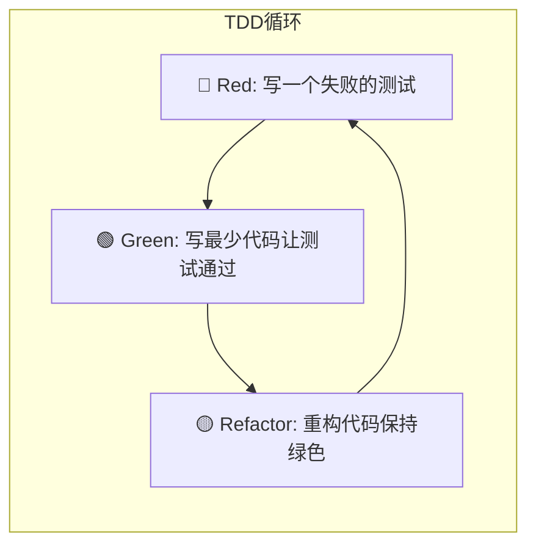
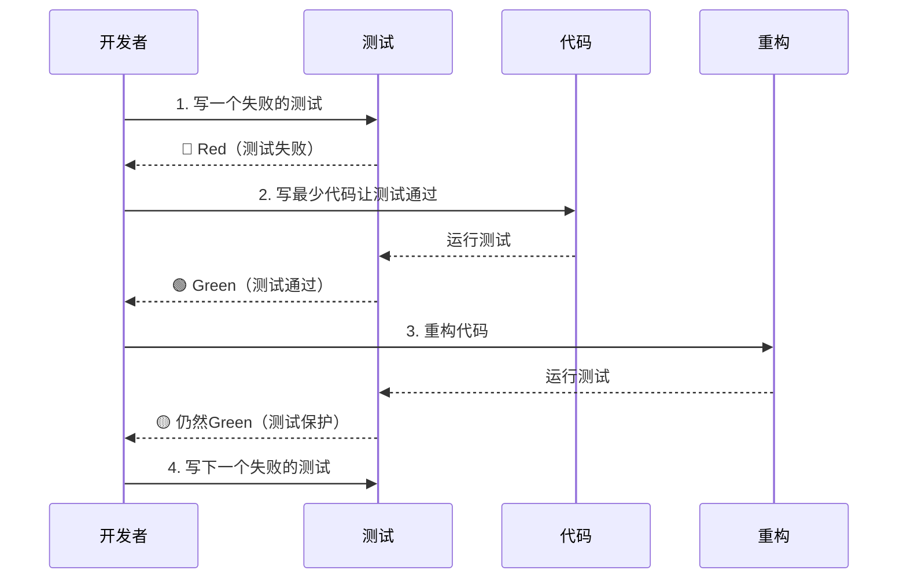
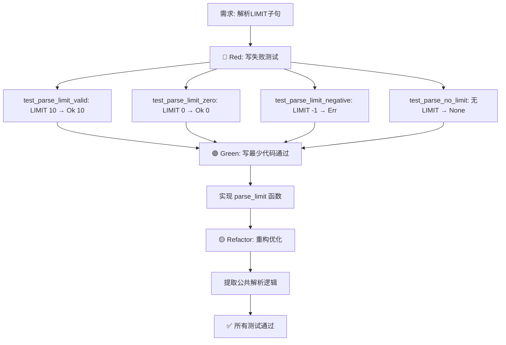
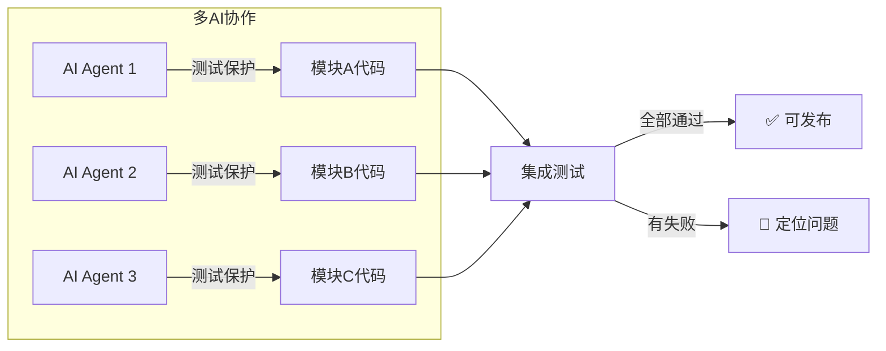
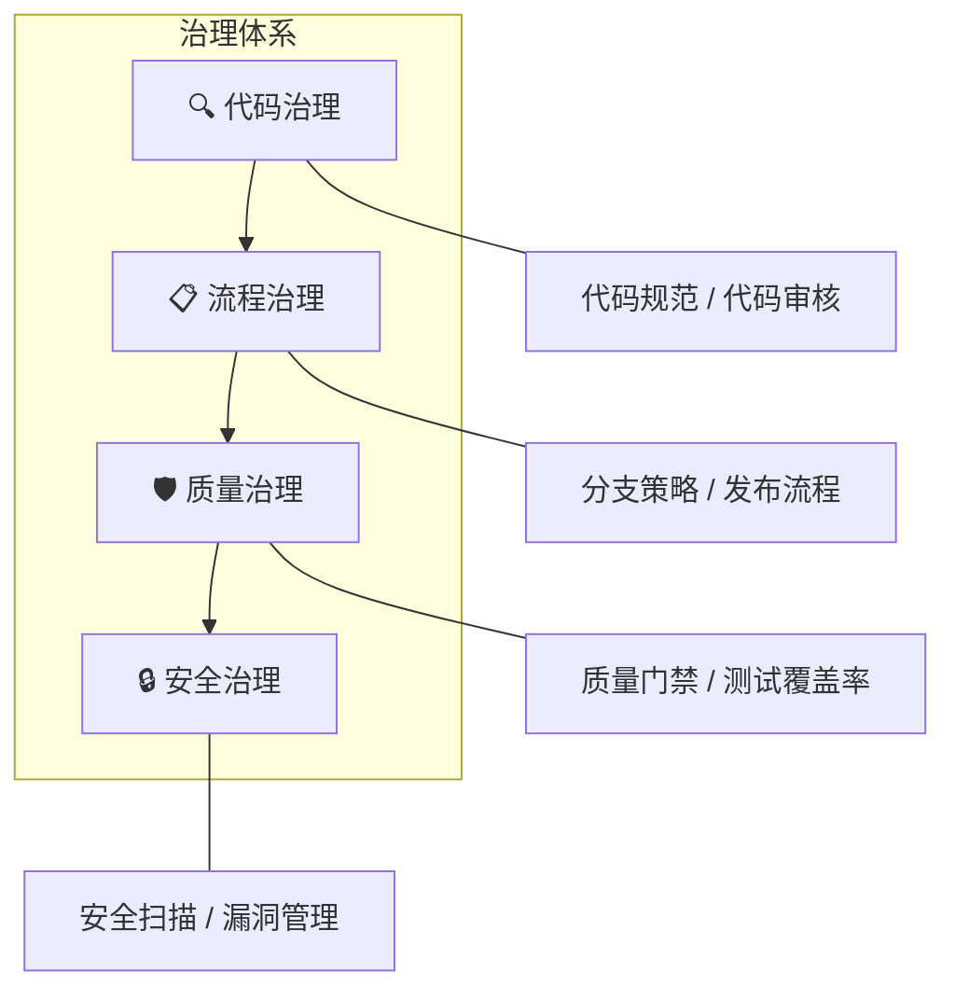
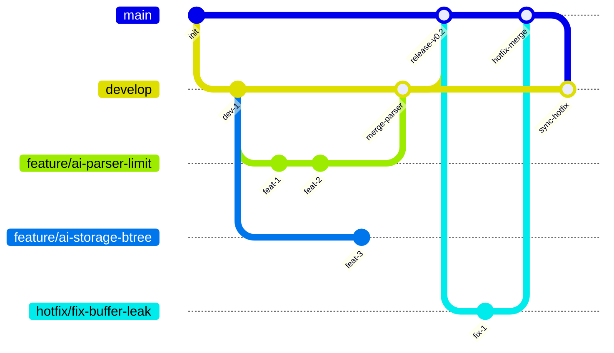
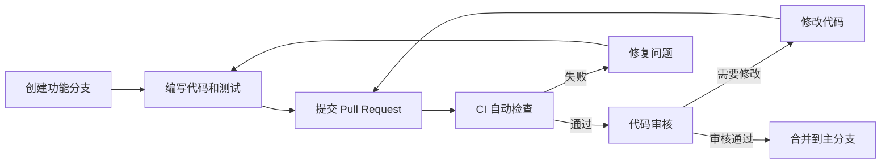
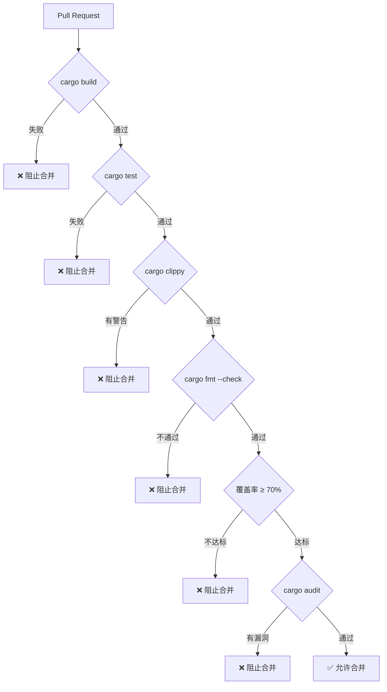
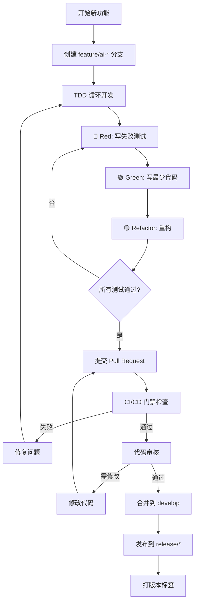

<!-- _class: lead -->

# 多AI Agent开发与软件治理

<br>

让 AI 从"写代码"到"守规矩"
—— 软件工程核心实践的 AI 增强版

---

## 课程大纲（2周4节课）

| 周次 | 课次 | 主题 | 核心内容 |
|------|------|------|----------|
| 第1周 | 第1课 | 从单点AI到多AI并行 | 为什么要并行？Prompt-Context-Harness 演进 |
| 第1周 | 第2课 | 测试基础：黑盒 vs 白盒 | 用图示讲透两种测试，覆盖率三层含义 |
| 第2周 | 第1课 | TDD 完整实践 | 红-绿-重构循环，用泳道图展示流程 |
| 第2周 | 第2课 | 软件治理与分支策略 | 分支保护、PR审查、CI/CD门禁，Harness落地 |

---

# Part 1: 从单点AI到多AI并行（第1周第1课）

---

### 1.1 回顾：前6周我们怎么工作的？


**特点：**

- 一个人 + 一个AI（Copilot、ChatGPT）
- 像"自动档汽车"：我下指令，AI执行
- 适合简单任务，但复杂系统开发时速度慢、容易出错

---

### 1.2 为什么要转向并行开发？


**核心转变**：从"提示词工程"到"多Agent编排工程"

---

### 1.3 并行开发带来的新挑战（为什么需要治理？）


**三大挑战：**

1. AI之间会"打架"：同时修改同一文件、同一行代码
2. AI会"跑偏"：忘记整体架构，各自为战
3. 质量无法保证：没有统一规范，不知道谁写的代码有问题

---

### 1.4 解决方案：软件治理金字塔


**核心思想**：用工具和规则代替对人的依赖，让 AI 和人类都遵守同一套标准。

---

### 1.5 Prompt-Context-Harness：AI协作的三阶演进


| 层级 | 核心特征 | 第1-6周 | 第8-16周 |
|------|----------|---------|----------|
| Prompt | 人类给指令，AI执行 | ✅ 主要方式 | 辅助方式 |
| Context | AI理解项目结构、历史 | 有限 | ✅ 通过OpenCode等 |
| Harness | 规则+测试+CI强制约束 | ❌ 无 | ✅ 核心保障 |

---

### 1.6 举例：开发一个"解析WHERE子句"的功能


**结论**：Harness 层是让不懂编程的人也能管理复杂项目的关键。

---

# Part 2: 测试基础 —— 黑盒 vs 白盒（第1周第2课）

---

### 2.1 什么是测试？为什么需要测试？


- 测试 = 可执行的需求文档
- 没有测试的代码，就像没有保险的汽车
- 在多AI协作中，测试是"共同语言"：我的代码没破坏你的功能

---

### 2.2 黑盒测试 vs 白盒测试 —— 类比

| 维度 | 黑盒测试 | 白盒测试 |
|------|----------|----------|
| 视角 | 外部功能 | 内部实现 |
| 依据 | 需求规格 | 代码结构 |
| 问的问题 | "功能对吗？" | "所有分支都执行了吗？" |
| 多AI协作中的角色 | 定义模块的"外部契约" | 保证每个AI写的代码没有隐藏分支 |

---

### 2.3 用真实场景理解：计算会员折扣

假设我们要测试一个"计算折扣"的功能。规则如下：

- 普通会员：年龄 ≥ 60 打9折，否则无折扣
- 黄金会员：一律8折
- 白金会员：一律7折，且年龄 ≥ 60 再额外减5%（折上折）


---

### 2.4 黑盒测试：只关心输入输出


**黑盒测试的优点：**

- 测试用例直接来自需求（产品经理能看懂）
- 不依赖代码实现，重构后测试仍然有效
- 适合多AI协作：每个AI只需知道"输入输出契约"

**黑盒测试的局限：**

- 无法保证覆盖所有代码分支（比如上面的 else 分支可能没测到）

---

### 2.5 白盒测试：检查内部分支


**白盒测试的目标**：确保每个分支都被执行过。

**要达到分支覆盖100%，需要至少以下测试用例：**

| 测试用例 | 覆盖的分支 |
|----------|------------|
| (黄金, 30) | 分支1, 分支6 |
| (黄金, 70) | 分支1, 分支5 |
| (白金, 50) | 分支2, 分支6 |
| (白金, 70) | 分支2, 分支4 |
| (普通, 30) | 分支3, 分支6 |
| (普通, 70) | 分支3, 分支5 |

**注意**：黑盒测试的6个用例已经覆盖了所有分支！但白盒测试让我们有意识地检查是否遗漏。

---

### 2.6 覆盖率的三层含义


**一个重要的认识**：100%语句覆盖 ≠ 没有bug！


所以我们需要分支覆盖来检查所有条件。

---

### 2.7 覆盖率工具工作流程


**实践命令**：

```bash
cargo tarpaulin --out Html --output-dir coverage
# 打开 coverage/index.html 查看红色行
```

---

# Part 3: 测试驱动开发（TDD）—— 红-绿-重构（第2周第1课）

---

### 3.1 TDD的核心循环



**三个状态的解释**：

- **Red**：测试失败（因为功能还没实现）
- **Green**：测试通过（功能已实现，可能很粗糙）
- **Refactor**：优化代码结构，不改变功能（测试仍然通过）

---

### 3.2 TDD完整流程 —— 泳道图



---

### 3.3 实例：用TDD开发"解析LIMIT子句" —— 泳道图详解

**需求**：解析 SQL 的 LIMIT 10，返回数字10。要求支持0、负数报错、无LIMIT返回None。



---

### 3.4 为什么TDD对多AI协作特别重要？



**核心价值**：

- 测试成为可执行的需求文档，AI之间不会误解
- 每个AI修改代码前必须保证所有测试通过
- 重构安全：有测试兜底，AI可以大胆优化

---

### 3.5 TDD vs 传统开发 —— 对比图

| 维度 | 传统开发 | TDD |
|------|----------|-----|
| 测试编写时机 | 事后（常常忘记） | 事前（强制编写） |
| 反馈周期 | 长（手动测试） | 短（自动化秒级反馈） |
| 重构信心 | 低（怕破坏功能） | 高（测试保护） |
| AI适用性 | AI容易写出"一次性代码" | AI被迫写出可测试代码 |

---

# Part 4: 软件治理与分支策略（第2周第2课）

---

### 4.1 多AI协作的完整治理体系

**核心理念**：规则不是建议，而是法律。



---

### 4.2 分支策略：让AI各走各的路



**分支命名规范**：

- `feature/ai-{模块名}-{功能描述}` —— 新功能
- `fix/ai-{模块名}-{问题描述}` —— Bug修复
- `refactor/ai-{模块名}-{改进内容}` —— 重构

---

### 4.3 分支保护规则（GitHub配置）


---

### 4.4 PR审查流程（带泳道）



**AI代码审查清单（人类要检查的）**：

- ✅ 功能正确性（边界条件、错误处理）
- ✅ 代码质量（命名、重复代码）
- ✅ 测试覆盖（新代码有测试吗？）
- ✅ 安全（SQL注入？硬编码密码？）

---

### 4.5 CI/CD门禁 —— 自动法官



**门禁清单**：

| 检查项 | 命令 | 失败后果 |
|--------|------|----------|
| 编译 | cargo build | ❌ 阻止合并 |
| 测试 | cargo test | ❌ 阻止合并 |
| 代码质量 | cargo clippy | ❌ 阻止合并 |
| 格式 | cargo fmt --check | ❌ 阻止合并 |
| 覆盖率 | cargo tarpaulin --fail-under 70 | ❌ 阻止合并 |
| 安全 | cargo audit | ❌ 阻止合并 |

---

### 4.6 版本命名规范与发布流程


**为什么要规范版本？**

- 避免混乱：v1, v1.0, version1, final 让人困惑
- 明确质量阶段：alpha 表示可能还有bug，release 表示稳定
- 支持多AI并行：每个AI知道自己基于哪个基线开发

---

### 4.7 完整的多AI协作工作流



---

# Part 5: 总结与后续课程呼应

---

### 5.1 核心思想总结


---

### 5.2 从Prompt到Harness的演进路径


**最终目标**：即使不懂具体的编程语言，也能通过"规则治理"开发出高质量的软件产品。

---

### 5.3 与第10-16讲的呼应

| 后续讲 | 内容 | 与本讲的关系 |
|--------|------|--------------|
| 第10讲 | PR工作流与项目成熟度评估 | 细化PR审查和成熟度度量 |
| 第11讲 | CI/CD与OpenClaw自动化 | 将Harness层自动化，编排多AI |
| 第12讲 | 性能优化与重构 | 在测试保护下进行安全重构 |
| 第13讲 | 安全扫描与审计 | 扩展Harness层，加入安全门禁 |
| 第14讲 | 发布门禁与检查清单 | 系统化门禁，形成发布标准 |
| 第15讲 | 版本发布与长期规划 | 基于版本规范进行多AI协作规划 |
| 第16讲 | 项目展示与职业发展 | 总结多AI协作经验 |

---

## 课后作业（2周4节课）

### 第1周第1课作业

1. 画出你所在项目的当前协作模式（是单点还是并行？）
2. 思考：如果让三个AI同时开发你的项目，最可能出现的冲突是什么？

### 第1周第2课作业

为下面的函数设计黑盒测试用例（至少5个）和分支覆盖测试用例：

```rust
fn can_vote(age: u32, citizenship: &str, registered: bool) -> bool {
    age >= 18 && citizenship == "US" && registered
}
```

解释为什么100%分支覆盖仍然可能遗漏bug。

### 第2周第1课作业

用TDD方式开发一个 `parse_order_by` 函数（解析 ORDER BY 子句）。要求：

- 支持 ORDER BY name ASC
- 支持 ORDER BY age DESC
- 支持多个字段：ORDER BY name ASC, age DESC

画出红-绿-重构的泳道图

### 第2周第2课作业

1. 为你的项目设计分支策略（画出gitGraph图）
2. 配置GitHub分支保护规则（至少3条）
3. 创建一个PR，观察CI门禁运行，截图报告

---

<!-- _class: lead -->

# 谢谢！

## 下节课：PR工作流与项目成熟度评估

**核心思想**：用测试保护协作，用治理实现规模，用TDD驯服AI

---
