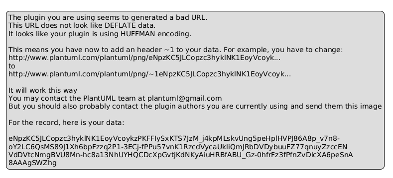
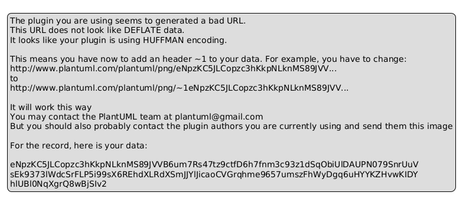
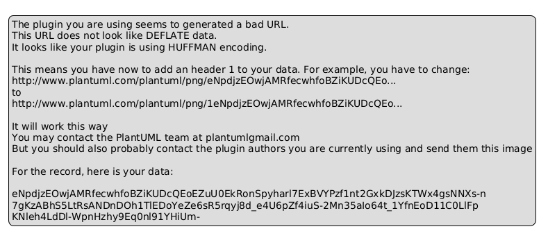
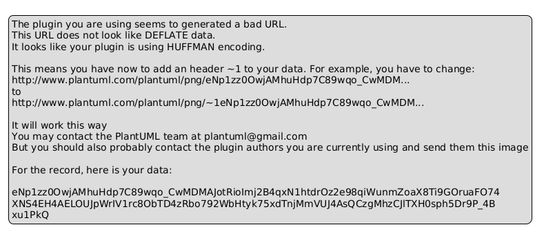

# 软件工程（第二讲）

# 结构化分析、设计与实现

## ——以早期数据库系统为例

---

# 一、软件工程历史背景（回顾）

20世纪60年代以后，计算机软件规模迅速增长。

软件开发出现大量问题：

- 项目延期
- 软件成本失控
- 软件质量差
- 系统难以维护

这一问题被称为 **软件危机**。

1968年，在  
NATO Software Engineering Conference  
上首次正式提出"软件工程"概念，旨在将工程化的原则和方法应用于软件开发。

---

# 二、结构化方法概述

结构化方法（Structured Method）是早期软件工程的重要方法，旨在应对软件危机。

**核心思想**：

- **自顶向下（Top Down）**：从问题的最高层抽象开始，逐步分解细化。
- **分而治之（Divide and Conquer）**：将复杂问题分解为若干个较简单的小问题分别解决。
- **模块化（Modularity）**：系统由功能独立、可互换的模块组成。

---

# 二、结构化方法概述（续）

**主要阶段与目标**：

|阶段|核心方法|主要产出|目标|
|:---|:---|:---|:---|
|需求分析|结构化分析 (SA)|数据流图(DFD)、实体关系图(ERD)、数据字典|搞清楚"做什么"，建立模型|
|系统设计|结构化设计 (SD)|模块结构图(SC)、模块说明书|解决"怎么做"，规划架构|
|程序实现|结构化程序设计 (SP)|代码|将设计转换为可执行的程序|

**最终目标**：构建一个 **高内聚、低耦合** 的软件系统。

---

# 三、结构化分析（SA）—— 建立分析模型

结构化分析的本质是通过图形化工具，将模糊的用户需求转化为清晰、无歧义的 **分析模型**。

这个模型由三部分组成：

- **功能模型**
- **数据模型**
- **行为模型**

---

# 3.1 功能模型：数据流图（DFD）

数据流图用于描述数据在系统中的流动、处理和存储过程，是结构化分析的核心工具。

**提出者**：Tom DeMarco 和 Edward Yourdon

**DFD包含四种基本元素**：

|元素|图形表示|含义|
|:---|:---|:---|
|外部实体|矩形/方形|位于系统外，但与系统交互的人、部门或其他系统|
|处理|圆角矩形/圆形|对输入数据流进行加工、计算或变换|
|数据流|箭头|代表数据的流动路径|
|数据存储|双杠/单杠|静止的数据，表示系统中的文件或数据库表|

---

# 3.1 功能模型：数据流图（DFD）（续）

**分层数据流图**：

- **顶层图**：将整个系统视为一个加工，展示系统与外部实体之间的数据交互。
- **0层图**：将顶层图的加工分解为若干个主要功能，展示系统内部主要的数据流动和处理。
- **底层图**：对0层图中的加工继续进行分解，直到每个加工的功能都足够简单、清晰。

---

# 案例：图书馆管理系统

以图书馆系统为例：

|元素|在本例中的含义|
|:---|:---|
|外部实体|读者、图书管理员|
|处理|借书处理、还书处理、查询图书|
|数据流|借书请求、读者信息、图书信息|
|数据存储|读者文件、图书文件、借阅记录|

---

# 案例：图书馆管理系统（DFD图）



---

# 案例：图书馆管理系统（DFD Level 1）



---

# 3.2 数据模型：实体关系图（ER图）

ER图用于描述系统中的数据结构及其之间的关系，是数据库设计的基础。

**提出者**：陈品山（Peter Chen）于1976年提出

**ER图包含三种核心元素**：

|元素|图形表示|含义|
|:---|:---|:---|
|实体|矩形|现实世界中可以相互区分的"对象"或"事物"|
|属性|椭圆形|实体或联系所具有的特征|
|联系|菱形|实体之间的业务关联关系|

---

# 3.2 实体关系图（续）：联系类型

**联系的类型**：

- **1:1 (一对一)**：一个实体实例对应另一个实体的一个实例。
- **1:N (一对多)**：一个实体实例对应另一个实体的多个实例。
- **M:N (多对多)**：一个实体实例对应另一个实体的多个实例，反之亦然。



---

# 案例：图书馆ER图

以简易图书馆管理系统为例：

- **读者** 实体：读者编号、姓名、电话
- **图书** 实体：ISBN、书名、作者
- **借阅** 联系：读者 M:N 图书

---

# 3.3 数据字典

数据字典是对DFD和ERD中所有元素的精确定义，是分析模型的核心。

**确保了所有开发人员对同一术语的理解是一致的。**

**示例**："读者"条目

|项目|内容|
|:---|:---|
|名称|读者|
|别名|用户、借书人|
|描述|在图书馆注册并拥有借阅权限的个人|
|组成|读者编号 + 姓名 + 联系电话 + 注册日期|
|存储方式|读者文件/读者表|

---

# 四、结构化设计（SD）—— 规划软件架构

结构化分析阶段解决了"**做什么**"的问题，结构化设计阶段则要解决"**怎么做**"的问题。

它将分析模型（DFD、ERD）转化为 **设计模型** —— 即 **模块结构图（Structure Chart, SC）**。

---

# 4.1 结构化设计的核心思想

**模块化**：将整个系统分解为一系列功能独立的模块。

**模块独立性**：用 **高内聚** 和 **低耦合** 来衡量。

- **高内聚**：一个模块内部各个元素之间的联系紧密，共同完成一个单一的功能。
- **低耦合**：不同模块之间的联系尽可能简单、松散，一个模块的改动对其他模块的影响最小。

---

# 4.2 从DFD到结构图的映射

结构化设计提出了两种典型的映射策略：

- **变换映射**：信息流明显地分为 输入流、变换中心 和 输出流 三个部分。
- **事务流**：数据流到达一个"事务中心"的加工，根据输入数据的类型，从多条动作路径中选择一条执行。

---

# 4.2 映射步骤

**步骤1：确定流的类型和边界**

- **输入流**：接收"借书请求"，从"读者文件"和"图书文件"获取信息
- **变换中心**：检查读者合法性、检查图书是否在馆、生成借阅记录
- **输出流**：将结果反馈给读者，更新文件

**步骤2：进行一级分解，画出初始结构图**

**步骤3：优化结构设计**

- 控制扇入/扇出
- 将作用域限制在控制域内



---

# 五、结构化实现（SP）—— 编码与数据库实现

这是将设计蓝图变为可运行软件的最后一步，主要包括 **程序编码** 和 **数据库实现** 两个方面。

---

# 5.1 结构化程序设计（SP）

**核心思想**：程序应仅由三种基本控制结构构成：

- **顺序**
- **选择**（if-then-else）
- **循环**（do-while）

避免使用 **goto** 语句，使程序逻辑清晰、易于理解和验证。

**实现方式**：使用过程式语言（如Pascal、C语言）来实现模块结构图中的每个模块。

---

# 5.2 数据库实现 —— ER图转化为关系模式

将分析阶段设计的 **ER图（概念模型）**，转换为数据库管理系统（DBMS）能够支持的关系模式（即具体的**表结构**）。

**转换规则**：

|联系类型|转换方法|
|:---|:---|
|1:N|将"1"端实体的主键，作为外键添加到"N"端实体对应的表中|
|M:N|必须创建一个独立的**新表**来表示该联系|
|1:1|可任选一端添加另一端的主键作为外键|

---

# 5.2 图书馆系统关系模式示例

```sql
-- 1. 出版社表 (实体)
CREATE TABLE 出版社 (
    出版社编号 VARCHAR(20) PRIMARY KEY,
    出版社名称 VARCHAR(100) NOT NULL,
    地址 VARCHAR(200)
);

-- 2. 图书表 (实体，体现与出版社的 1:N 联系)
CREATE TABLE 图书 (
    ISBN VARCHAR(20) PRIMARY KEY,
    书名 VARCHAR(200) NOT NULL,
    作者 VARCHAR(100),
    出版社编号 VARCHAR(20),
    FOREIGN KEY (出版社编号) REFERENCES 出版社(出版社编号)
);

-- 3. 读者表 (实体)
CREATE TABLE 读者 (
    读者编号 VARCHAR(20) PRIMARY KEY,
    姓名 VARCHAR(50) NOT NULL,
    联系电话 VARCHAR(20)
);

-- 4. 借阅记录表 (实现 M:N 联系)
CREATE TABLE 借阅记录 (
    流水号 INT AUTO_INCREMENT PRIMARY KEY,
    读者编号 VARCHAR(20) NOT NULL,
    图书ISBN VARCHAR(20) NOT NULL,
    借阅日期 DATE NOT NULL,
    应还日期 DATE NOT NULL,
    实际归还日期 DATE,
    FOREIGN KEY (读者编号) REFERENCES 读者(读者编号),
    FOREIGN KEY (图书ISBN) REFERENCES 图书(ISBN)
);
```

---

# 六、方法总结

结构化方法开发流程：

```
需求分析（SA）
      ↓
  DFD建模
      ↓
   ER图设计
      ↓
   数据字典
      ↓
   数据库设计
      ↓
  模块设计（SD）
      ↓
  程序实现（SP）
```

通过本讲学习：

- 理解**结构化分析**建立需求模型的方法
- 掌握**结构化设计**规划软件架构的技巧
- 学会**结构化实现**将设计转化为可运行系统

---

# 课后思考

1. DFD 与流程图有什么区别？

2. 为什么模块化设计可以降低系统复杂度？

3. 为什么现代数据库系统需要事务管理？
