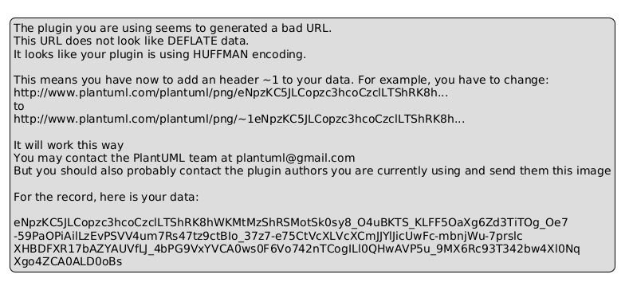
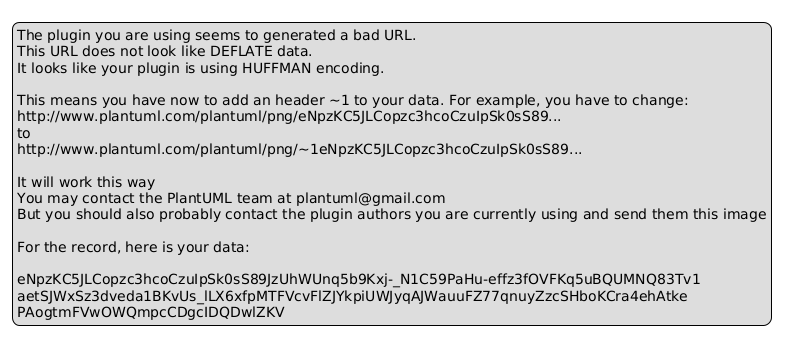
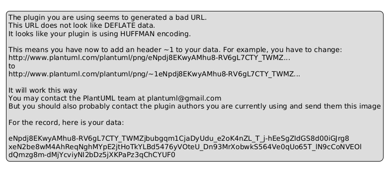
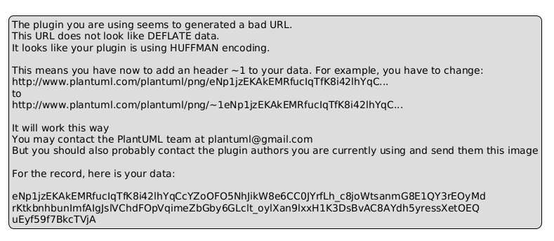
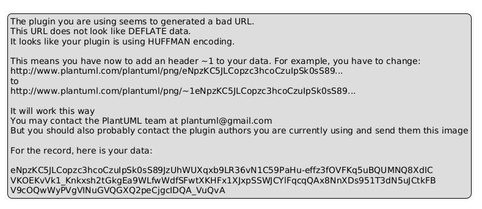
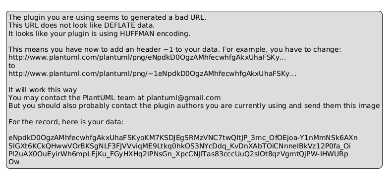
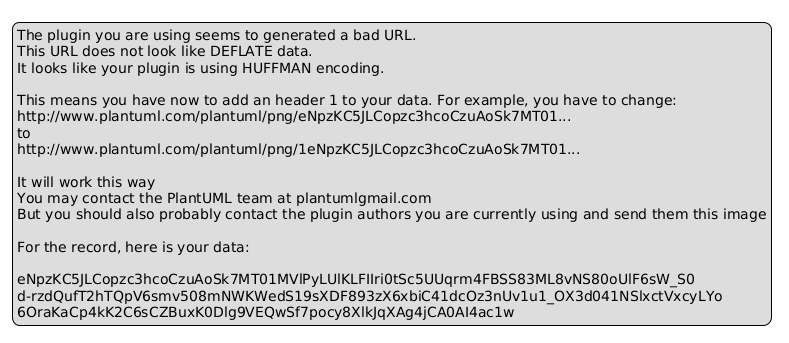
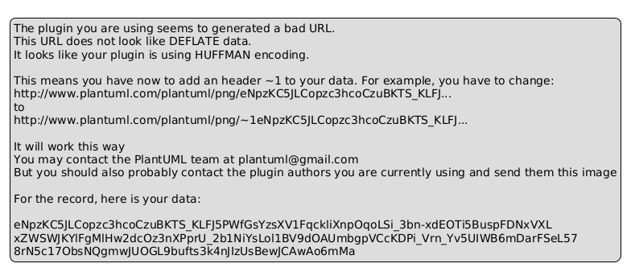
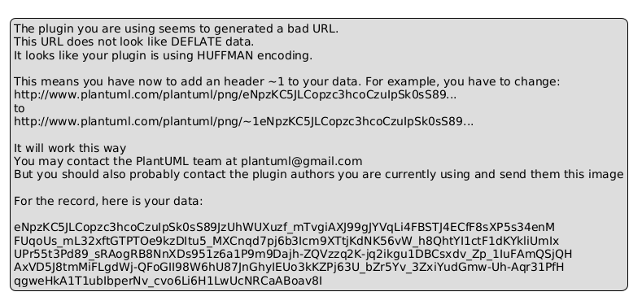

# 第二部分：实例篇

# 结构化方法实例学习

## 三个数据库系统的分析与设计 + AI-IDE工具实践

**说明**：本部分供自学，每个案例后附有AI-IDE工具实践环节

---

# 实例篇目录

**案例一**：客户信息管理系统（dBase实现）

- AI实践1：用Trae生成DFD/ER图及dBase代码

**案例二**：销售订单管理系统（关系数据库实现）

- AI实践2：用Trae生成模块结构图及SQL代码

**案例三**：迷你关系数据库管理系统（RDBMS）的设计

- AI实践3：用Trae生成系统架构图及核心代码

---

# 案例一：客户信息管理系统（dBase实现）

---

# 案例一：系统功能与角色

**系统功能**：

- 客户信息录入
- 客户信息修改
- 客户查询
- 销售统计

**用户角色**：

|角色|可用功能|
|:---|:---|
|销售员|录入、修改|
|经理|查询、统计|

---

# 案例一：DFD上下文图



---

# 案例一：DFD Level 1



---

# 案例一：数据字典

**CUSTOMER表**：

|字段|类型|说明|
|:---|:---|:---|
|cust_id|Numeric|客户ID（主键）|
|name|Character|客户姓名|
|company|Character|公司|
|phone|Character|电话|
|city|Character|城市|

**SALES表**：

|字段|类型|说明|
|:---|:---|:---|
|sale_id|Numeric|销售ID（主键）|
|cust_id|Numeric|客户ID（外键）|
|product|Character|产品|
|amount|Numeric|销售金额|

---

# 案例一：ER图



---

# 案例一：数据库设计（dBase）

- 使用dBase III/IV，文件型数据库
- 表文件：CUSTOMER.DBF、SALES.DBF
- 字段类型：Numeric、Character
- 运行环境：MS-DOS，单机

---

# 案例一：模块结构设计



---

# 案例一：dBase程序示例

```dbase
CREATE CUSTOMER
USE CUSTOMER
APPEND BLANK
REPLACE name WITH "李华"
REPLACE city WITH "北京"
USE CUSTOMER
LIST FOR city="北京"
```

---

# AI实践1：用Trae生成DFD/ER图及dBase代码

---

# AI实践1-1：准备工作——安装Trae插件

**Trae插件简介**：

字节出品的免费AI编程助手，支持VS Code和JetBrains系列IDE

**安装步骤**：

1. 在VS Code扩展商店搜索"Trae"
2. 点击Install安装
3. 重启IDE，登录账号

**两种工作模式**：

- **Chat模式**：问答式辅助
- **Builder模式**：全自动AI工程师

---

# AI实践1-2~1-6：Prompt示例

```
请为"客户信息管理系统"生成ER图，使用Mermaid语法。
实体包括：客户(CUSTOMER)和销售(SALES)...
```

---

# 案例二：销售订单管理系统

---

# 案例二：系统功能描述

- 订单录入、修改、删除
- 产品信息管理
- 订单查询（按客户、日期、产品）
- 销售统计（按月、按产品）

---

# 案例二：角色与用例

|角色|用例|
|:---|:---|
|销售员|订单录入、修改、查询|
|仓库管理员|产品库存管理|
|经理|销售统计、报表查看|

---

# 案例二：DFD上下文图


---

# 案例二：DFD Level 1



---

# 案例二：ER图



---

# 案例二：关系模式设计（SQL）

```sql
CREATE TABLE CUSTOMER (cust_id INT PRIMARY KEY, name VARCHAR(50));
CREATE TABLE PRODUCT (prod_id INT PRIMARY KEY, name VARCHAR(50), price DECIMAL(10,2));
CREATE TABLE ORDER (order_id INT PRIMARY KEY, cust_id INT, order_date DATE);
CREATE TABLE ORDER_DETAIL (detail_id INT PRIMARY KEY, order_id INT, prod_id INT, quantity INT);
```

---

# AI实践2：用Trae生成模块结构图及SQL代码

---

# AI实践2-1~2-6：Prompt示例

**生成模块结构图**：
```
请为"销售订单管理系统"生成模块结构图，使用Mermaid语法。
```

**生成SQL建表语句**：
```
请为"销售订单管理系统"生成SQL建表语句...
```

---

# 案例三：迷你关系数据库管理系统

---

# 案例三：问题定义与目标

**目标**：设计一个支持基本SQL操作的单用户关系数据库引擎

**功能需求**：

- 支持 CREATE TABLE、INSERT、SELECT、UPDATE、DELETE
- 支持简单条件查询（WHERE）
- 数据持久化存储在文件中

---

# 案例三：DFD上下文图



---

# 案例三：DFD Level 1



---

# 案例三：模块结构图



---

# 案例三：核心模块设计说明

- **SQL解析器**：词法/语法分析，生成抽象语法树
- **查询优化器**：基于规则简化，生成执行计划
- **执行引擎**：按执行计划调用存储引擎接口
- **存储管理器**：管理数据文件的读写
- **目录管理器**：管理系统表（元数据）

---

# AI实践3：用Trae生成系统架构图及核心代码

---

# AI实践3-1~3-5：Prompt示例

**生成系统架构图**：
```
请为"迷你关系数据库管理系统"生成系统架构图...
```

**生成Python原型**：
```
用Python实现一个迷你关系数据库引擎的原型...
```

---

# 幻灯片 41：三个案例对比

|案例|数据库类型|核心特点|适用场景|AI实践重点|
|:---|:---|:---|:---|:---|
|客户信息管理|dBase (文件型)|单机、简单|个人/小型应用|生成ER图/DFD|
|销售订单管理|关系型|SQL、事务|企业业务系统|生成模块结构图|
|迷你RDBMS|关系型引擎|教学演示|学习原理|生成架构图|

---

# 幻灯片 42：AI-IDE工具使用技巧总结

**Builder模式适用场景**：

- 从0到1搭建项目框架
- 生成标准化的CRUD代码

**Chat模式适用场景**：

- 局部代码生成和修改
- 代码解释和学习
- Bug修复

---

# 幻灯片 43：自学指导建议

1. 安装Trae插件，亲自体验Builder模式
2. 尝试用自然语言生成三个案例的各类图表
3. 修改Prompt，观察输出变化
4. 将生成的代码与手写代码对比

---

# 幻灯片 44：结束页

# 感谢观看

## 欢迎提问交流
